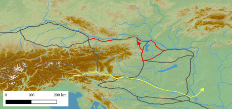
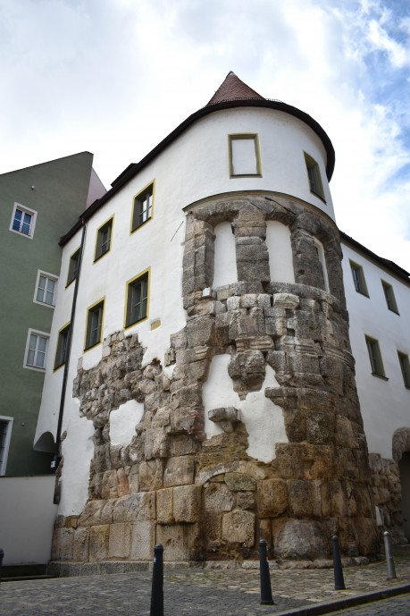
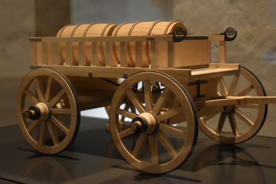

„Za všemi vojenskými operacemi stojí jediný princip, který je založen na těchto zásadách: přivést většinu svých vojsk na rozhodující místo válčiště; v boji přečíslit protivníka; v bitvě vrhnout největší síly na klíčové místo a zajistit, aby tyto síly bojovaly ve správný čas a s dostatečnou energií,“  [napsal](https://gutenberg.org/cache/epub/13549/pg13549-images.html) v první polovině devatenáctého století baron Jomini a vztyčil tím jeden z pilířů moderní vojenské teorie.

Jeho závěry jsou ale platné bez ohledu na období – války se nevyhrávají jen počtem mužů, ale také schopností tyto muže přivést v rozhodující okamžik na rozhodující místo. To před velitele staví velmi náročný úkol, a tento úkol se stává tím náročnější, čím hlouběji do minulosti jdeme.

Zdroje energie, které umožňují moderním armádám udržet v poli stovky tisíc až miliony mužů, totiž v předmoderní době nebyly dostupné. Pokud si generálové přáli přepravit velký náklad – ať už zásoby anebo vojáky – na velkou vzdálenost, mohli se spoléhat prakticky jen na energii větru a vody.

Předmoderní vojenství tedy mělo kromě boje na pevné zemi ještě jednu tvář, kterou představovala úporná snaha dopravit k bojujícím armádám dostatek zásob, a to ideálně po vodě. Pro všechny vojevůdce se tím otevíraly zcela nové možnosti, ale i problémy, které museli řešit.

Z různých důvodů je však tento prvek vojenského umění v popkultuře [prakticky opomíjen](https://acoup.blog/tag/logistics/), anebo v ní hraje jen malou roli. Hrám, knihám i filmům však může dodat hloubku, a proto se může hodit rozebrat některé potíže, se kterými se předmoderní armády musely potýkat. Jako příklad mohou posloužit události v Podunají na přelomu osmého a devátého století, které do dějin vešly jako avarské války Karla Velikého.

## Karlovo východní tažení a Dunaj

Tyto události začaly prakticky současně s tím, jak Francká říše pronikající podél Dunaje na východ pohltila Bavorsko. Frankům se tak otevřela cesta dále do Panonie, která se měla jen velmi záhy na to stát jejich dalším vojenským cílem. Avaři, kteří ještě na konci osmého století drželi Karpatskou kotlinu poměrně pevně ve svých rukou, se na počátku osmdesátých let pokoušeli s Franky vyjednávat, ovšem když zjistili, že se jejich prosbám nedopřává sluchu, přistoupili až k ozbrojené agresi. Frankům se však podařilo všechny jejich útoky odrazit.

Situace vyeskalovala na podzim 791, kdy se do Panonie vydala tři francká vojska. Ze severu táhli proti Avarům Frísové a Sasové pod vedením hrabat Theodoricha a Meginfrida, podél Dunaje vedl své muže osobně Karel Veliký a na jihu vytáhl z Itálie krátce před začátkem ostatních válečných akcí Karlův syn Pipin. Italská výprava však trvala jen krátce a vrátila se domů, jakmile se jí podařilo dobýt jednu z avarských pohraničních pevností. Na severu však byli Frankové [mnohem více vytrvalí](https://lumyd.eu/article/soumrak-avarske-moci-francko-avarske).

Karlovi se podařilo překonat avarskou pohraniční obranu, spojit se se severním vojskem, které přes Čechy mířilo k Dunaji, projít takřka bez problémů okolo avarských posádek [v okolí Bratislavské brány](https://www.academia.edu/64090026/J_Vav%C3%A1k_Slovansk%C3%A9_hrady_v_Mal%C3%BDch_Karpatoch_Predve%C4%BEkomoravsk%C3%A9_obdobie_Slavic_castles_in_the_Little_Carpathians_Pre_Great_Moravian_period_in_Slovak_?sm=b&rhid=32822900788) a dojít až k soutoku Ráby a Dunaje, odkud se vrátil přes Savarii domů. S odporem se prakticky nesetkal a tažení se obešlo bez velkých ztrát na životech. Mnohem zajímavější než výsledek tažení je ale podle mě to, co umožnilo Frankům dostat se tak daleko na východ.

Byl to prvek tak významný, že se o něm dochovala zpráva i v Letopisech království Franků, které většinou detaily ohledně vojenských akcí opomíjejí. Jednalo se o Bavory povolané k vojenské službě na lodích, jejichž úkolem bylo dopravit z bezpečného zázemí po řece všechno to, co francké armády v poli potřebovaly.

Řešení to bylo prosté, ale přitom velmi účinné. Frankové se díky tomu z větší části vyvázali z nutnosti vést zásoby i pro tažná zvířata a celkově se zřejmě obešli [bez zásobovacích vozů](https://slovanologie.cz/2023/12/12/lode-proti-avarum-francka-logistika-na-podzim-791/). To jejich armádám poskytlo mnohem větší volnost pohybu a zároveň [rychlost](https://slovanologie.cz/2024/03/13/s-franky-o-zavod-casove-moznosti-avarske-mobilizace/), která se jim velmi hodila. Tažení začalo přibližně v polovině září a protože zima byla na spadnutí, bylo nejlepší ho ukončit co možná nejdříve.

Klíčem k tomuto měla být mimo jiné funkční logistika. Zásobování franckých vojsk bylo založeno na flotile říčních člunů, čí spíše prámů. Na délku měly soudě podle [archeologických nálezů](https://www.evolution-mensch.de/Anthropologie/Karl_(Schiff)) přibližně patnáct metrů, jejich šířka se pak pohybovala okolo dvou a půl metru.

O tom, co posádky bavorských lodí ve válce proti Avarům zažily, se zprávy nedochovaly. Není tedy jasné, jak byl její pohyb koordinován se zbytkem vojska, nebo kde se nacházela jejich kotviště (což je také velmi důležitá součást [říční logistiky](https://youtu.be/4R9NxwnI88I)). Karel se však po skončení bojových akcí rozhodl k rozšíření a posílení dunajské flotily, což nasvědčuje, že se ve válce velmi osvědčila. Zároveň s tímto krokem však připravoval ještě mnohem větší projekt, který mu měl usnadnit budoucí tažení.

Několik odborníků mu totiž navrhlo, že s dostatkem pracovních sil a umu by bylo možné propojit řeky Altmühl a Rednitz prostřednictvím kanálu zvaného v pramenech _fossa Carolina_. Pokud by se podařilo tento projekt dokončit, francký král by získal možnost dopravovat zásoby z Porýní do Podunají po vodě. Bez tohoto vodního díla to nebylo možné, protože obě řeky mají oddělená povodí; propojení bohatého a lidnatého Porýní s méně rozvinutým Podunajím by ale značně rozšířilo Karlovy strategické možnosti na východě.

Z dnešního pohledu se zdá tento projekt až příliš náročný, ovšem to, že k němu Karel nakonec svolil, ukazuje, že v podmínkách raného středověku se nejevil až tak ambiciózně. Plánovači se mohli spolehnout na pomoc antické literatury, které o podobných stavbách hovoří a lidská práce představovala zdroj, kterého mělo expandující francké impérium relativní dostatek.

První stromy, jejichž dřevo bylo použito na stavbu, byly pokáceny již [na podzim 792](https://onlinelibrary.wiley.com/doi/full/10.1111/emed.12422), zatímco práce na samotném kanálu začaly na jaře 793 a skončily jen krátce poté. Podzim toho roku byl [mimořádně deštivý](https://www.academia.edu/113341966/Kl%C3%ADma_hlad_a_reziliencia_v_Karol%C3%ADnskej_r%C3%AD%C5%A1i) a nepříznivé počasí znemožnilo výkopy dokončit. Část kanálu se nicméně podařilo vykopat a jeho zbytky je možné v německé krajině najít dodnes. Pro své současníky však představovaly spíše než terénní zajímavost symbol promarněných prostředků a další prohry v nekonečném boji raně středověkého člověka proti klimatu a počasí.

## Vítězství bez náročné logistiky?

Francké vojenství tedy kvůli špatnému počasí narazilo na jeden ze svých největších limitů. Plány, ve kterých figurovala _fossa Carolina_, bylo potřeba zcela přehodnotit, nebo rovnou opustit. Nepříznivých okolností se totiž v první polovině devadesátých let osmého století na východní hranici Francké říše nastřádalo více než dost.

Tou největší pohromou, která Karlovo vojsko ve vztahu k energii a zásobování potkala, byla dosud ne zcela jistě identifikovaná koňská epidemie, která podle Letopisů království Franků skolila devět z desíti koní v pravobřežní armádě. I když se to zdá jako silně nadhodnocený údaj, porovnání s moderními statistikami pro některé nemoci, které mohly propuknout v průběhu podzimního tažení, naznačuje, že francký analista nelhal, když hovořil o 90% ztrátách. Mobilita Karlovy armády se kvůli nákaze smrskla na naprosté minimum a vyhlídky na to, že by snad možná mohla obstát proti avarské jízdě v otevřené bitvě, klesly prakticky na nulu.

Karlovi muži mohli po skončení tažení doplnit koně z části v Bavorsku a zčásti se o ně mohli v průběhu dalšího tažení podělit s vojáky levobřežní armády, ovšem to by bylo jen polovičaté řešení. Pokud Karel chtěl vytáhnout do války se skutečně mobilní, a tedy i nebezpečnou armádou, musel počkat, než se podaří na východ přepravit dostatečné množství zvířat. To však šlo v podmínkách raně středověké dopravy jen velmi obtížně.

Celý rok 792 proto Frankové strávili v Řezně a čekali na svou příležitost. V mezičase nechal jejich král postavit pontonový most, který s sebou nejspíš plánoval vzít na další výpravu, ovšem na ni nikdy nedošlo. Když se pak Karel roku 793 připravoval opět vytáhnout do pole, donesla se k němu zpráva, že jeho severní vojsko přepadli a zničili Sasové, kteří opět povstali proti francké vládě.

Další komplikací bylo spiknutí Karlova syna Pipina Hrbatého, které se králi sice podařilo překazit, ale stále jej na nějakou dobu odvedlo od jeho cílů v Panonii. Ničemu nepomohla ani další válka s muslimy, která si vyžadovala přesunutí Karlovy pozornosti do zcela jiných částí jeho říše. Kombinace všech těchto faktorů nakonec způsobila, že Frankové od podzimu 791 na území kaganátu nevkročili po čtyři dlouhé roky.

Vrátili se až roku 795, kdy na avarské území proniklo vojsko vedené slovanským vojevůdcem Vonomírem a vyplenilo sídlo avarského kagana nazývané hrink. Hned následujícího roku se do Panonie vydal osobně Karlův syn a langobardský král Pipin (ne ten Hrbatý) a přinutil kagana k připojení jeho země k Francké říši.

Problémy s logistikou tedy Franky v jejich válkách nezastavily. Kombinace problémů na mnoha úrovních sice jejich vojska odvedla na čtyři roky z Panonie pryč, ale cíl, který si Karel Veliký vytyčil, se jim nakonec podařilo splnit. Museli ale zvolit zcela odlišný přístup.

Řešení potíží, které se v mezidobí nakupily jinde (například v Sasku nebo Španělsku), totiž vyžadovalo hlavní část franckých vojsk. Navíc, i pokud by se Karlovi podařilo na úkor ostatních front najít dostatečné síly, tažení do nitra Panonie po dunajské cestě byla nepříjemná a zdlouhavá záležitost, která ještě více komplikoval nedostavěný kanál. Už jenom dostat do Bavorska dostatek zásob pro koně i muže bez _fossy_ vyžadovalo obrovské úsilí, které mohlo být využito mnohem efektivněji a lépe proti jiným nepřátelům.

Frankové však měli ještě jednu možnost jak proti Avarům vytáhnout. Poprvé ji vyzkoušeli již roku 791 a o čtyři roky později se tuto akci rozhodli zopakovat. Do Panonie se svým způsobem dalo dostat i mnohem pohodlněji a snáze ze severní Itálie. V tomto koridoru sice netekla žádná velká řeka, ale Římané v něm před staletími postavili několik silnic, a to Frankům stačilo. Armády, které proti Avarům v letech 795–796 vyslali, navíc nemusely být vůbec velké, protože těsně před začátkem Vonomírova tažení začala v kaganátu občanská válka, která tříštila avarské síly.

Situace na jižní frontě díky tomu nebyla vůbec špatná a bylo jen otázkou času kdy se ještě zlepší. Schopný stratég by ji potom dokázal využít na maximum a vývoj v polovině devadesátých let jasně ukazuje, že Franckou politiku proti Avarům vedl právě takový schopný muž.

Geografie tedy sice Frankům kladla překážky, ale uvážené kroky spolu s notnou dávkou schopnosti vyčkávat na vhodnou příležitost a vojenského štěstí nakonec rozhodly ve francký prospěch, a to bez ohledu na deště a kanály. Právě to je další poučení, které mohou hráčům a autorům avarské války nabídnout. Logistika velkých armád je velmi důležitá a jakákoli (military) fantasy tvorba by s ní měla počítat, nicméně dějiny nepíši jen desetitisícová vojska sunoucí se šnečím tempem údolím velkých řek. Občas stačí jednoduše hrstka odvážných, kteří se ve správnou chvíli dostanou na to správné místo.

## Zdroje

1. KURZE, Friedrich, 1895. Annales regni Francorum. In: _Annales regni Francorum inde a. 741 usque ad 829, qui dicuntur Annales Laurissenses maiores et Einhardi_ [online]. Hannoverae: Hahn [vid. 2024-04-06]. ISBN Annales regni Francorum. Dostupné z: [https://www.dmgh.de/mgh_ss_rer_germ_6/index.htm#page/(I)/mode/1up](https://www.dmgh.de/mgh_ss_rer_germ_6/index.htm#page/(I)/mode/1up)
1. MĚŘÍNSKÝ, Zdeněk, 2002. _České země od příchodu Slovanů po Velkou Moravu I_. Praha: Libri. ISBN 80-7277-104-3.
1. POHL, Walter, 2018. _The Avars: A Steppe Empire in Central Europe 567-822_. Ithaca, London: Cornell University Press. ISBN 978-1-5017-2940-9.
1. SZŐKE, Béla Miklós, 2011. Die Donau und die Letzten Tage des Awarischen Khaganats. In: Gyöngyi KOVÁCS a Gabriella KULCSÁR, ed. _Ten thousand years along the Middle Danube: life and early communities from Prehistory to History_. Budapest: Archaeolingua, s. 265–294. ISBN 978-963-9911-26-0.
1. WERTHER, Lukas, Jinty NELSON, Franz HERZIG, Johannes SCHMIDT, Stefanie BERG, Peter ETTEL, Sven LINZEN a Christoph ZIELHOFER, 2020. 792 or 793? Charlemagne’s canal project: craft, nature and memory. _Early Medieval Europe_ [online]. **28**(3), 444–465. ISSN 1468-0254. Dostupné z: doi:[10.1111/emed.12422](https://doi.org/10.1111/emed.12422)
