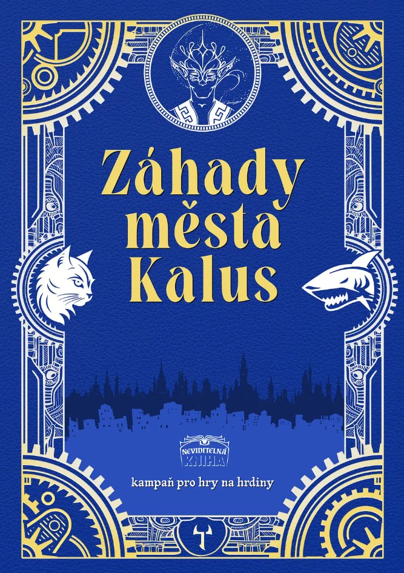

Vložíš si do hlavy část hodinového stroje? Vlezeš do břicha velryby? Přepíšeš neviditelnou knihu? Zastavíš nekonečného hada? Uzdravíš duši závislou na zlých aurách? Rozpleteš sen tyrana? Ztišíš pláč věže? Nakrmíš kočku?

To poslední je ze všeho nejdůležitější. Pak se můžeš starat o ten zbytek! Chápeme se? Výborně! Tvé dobrodružství začíná!

## Co tě čeká?

- Nelineární kampaň s mnoha vyústěními od ovládnutí města až po jeho zkázu.
- Prolézání strašidelného domu. Souboj pod padající hvězdou. Intriky na plese. Momenty odlehčené i vážné. A mnohé další.
- Propracovaní obyvatelé města, odkrývání jejich tajemství a budování vztahů s nimi.
- Možnost být za klaďase, záporáka i něco mezi.
- Mnoho rad a nástrojů pro vedení hry i pro úplné nováčky.

Záhady města Kalus vyjdou v červnu 2025.

{:.map}

