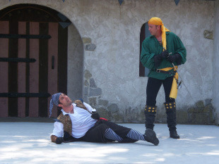

Jsme skupina zatvrzelých rpgčkařů z Čelákovic a po mnoha letech šaškování s různými variantami d20 systému jsme nedávno na blogu [2k6goblinu.blogspot.cz](http://2k6goblinu.blogspot.cz) zveřejnili česká fantasy pravidla volně založená na starém Dungeons & Dragons (1974) a jeho retroklonu [Swords & Wizardry](http://rpgforum.cz/anotace/swords-wizardry) (2008).

## Nevýhody

Neintuitivní a __nerealistická zranění__. Jak je možné, že ten stejný zásah za pět životů jen škrábne třicetiživotového válečníka, ale div nerozprskne tříživotového vesničana? Protože proto. Jednoduše se musíte naučit popisovat zranění relativně k maximálnímu počtu životů. Není to nijak těžké. Stačí všechno interpretovat jako lehká zranění (šípy zaseklé ve zbroji, pohmožděniny, mělké seky a řezy...) a brutální poslední ránu popsat, až bojovník padne pod nulu.

Stejně __nereálné léčení__. Vesničan zmlácený do bězvědomí je fit za tři dny. Zmíněný válečník za měsíc. Naštěstí se tahle nesrovnalost nedostane do hry často. Většinou jde vesničan k zemi jednou ranou, zatímco válečník klesá až opravdu rozřezaný. Občas tohle obhajuji Zaklínačem, který se po boji s Vilgefortzem musel měsíce lěčit u dryád. Epické postavy holt přežijí i epická zranění a vyžadují adekvátní léčbu.

## Výhody

__Životy jsou povědomé__ z počítačových her, deskových her i larpů. Je to velmi jednoduchý koncept k vysvětlení.

__Slouží jako nárazník__, dávají hráči čas a poskytují snadno počitatelný, viditelný prostor k chybě. Tím, že hráč tuší, kolik zranění mu nepřítel může v kole udělit, a ví kolik mu ještě zbývá, může s tím počítat ve svých rozhodnutích. V realistických systémech, kde lze zemřít jednou ranou, na tohle není místo - hráč nemůže s životy počítat a nemůže udělat ani jedinou chybu. V takové hře není možné mít na každém sezení několik bojů, protože dřív nebo později by to někdo odskákal. Takové hry jsou pak buď opravdu hardcore, nebo se okrádají o napětí přes [plot immunity](http://tvtropes.org/pmwiki/pmwiki.php/Main/PlotImmunity). Ne, že by se u nás také nebylo možné zaklepat bačkorama, ale minimálně je to více v rukou hráče.

Růst životů po úrovních zajišťuje __plynulou změnu žánru__. Postavy na prvních úrovních nejsou o moc silnější než běžní vesničani nebo řadoví vojáci a musí se podle toho chovat. Tři orci se zažívacími potížemi jsou pro ně seriózní hrozba. Tahle fáze má [dvě přednosti](http://jrients.blogspot.cz/2012/06/why-low-level-high-lethality.html); Je snadná na přípravu, protože vám stačí malá lokální dobdrodružství. A hráči si po cestě z dungeonu připadají strašně chytře, protože se museli vyhnout všem bojům a každého přečůrat. Je to tréninková fáze, kde ještě tak nebolí, když umře postava, a během první hry nebo dvou se každý dostane do toho herního stylu, který to vyžaduje – připravenost, vynalézavost, vnímavost, důvtip a malinko šedá morálka.

Hráčí prakticky získávají zkušenosti společně se svými postavami, je to taková malá pojistka, že nikdo nebude hrát epickou postavu neuvěřitelně nebo nesmyslně. Nejlepší je, že se ta síla nastřádá celkem plíživě. Jeden den se bojíš goblina s prakem, pořídíš si zbroj, zapleteš se do nějakých potyček, naučíš se nové kouzlo, a než se naděješ, porazíš v duelu i orčího berserka. Získáš magickou zbraň, možná pár dovedností, zapleteš se do dalších potyček, vykradeš pár hrobek, přidáš se ke královské gardě, najdeš lásku, naplníš pokladnici zlatem, povedeš revoluci, ztratíš lásku, získáš trůn. A než se naděješ, zabíjíš ty gobliny, kterých ses tak bál, po desítkách a s pánem démonů vydržíš v ringu i pět kol. Ten vývoj od survival horroru, kde zbloudilý šíp může znamenat konec, k epické fantasy, kde ustojíš i hněv titánů, je velmi uspokojivý zážitek.

Nezanedbatelnou výhodou životů je „resource management“, [zoufalství](http://dndwithpornstars.blogspot.cz/2013/07/dwindling.html) a stres. Společně s pomalým léčením dovolují vypravěči zabíjet postavy pomalu. Během dlouhých výprav a bezedných dungeonů je může ostrouhávat celé hodiny. Zajistí to nejen, že i sebemenší bitka může mít význam v průběhu celé hry, ale hlavně to hráče společně s docházejícími zlaťáky, manou, pochodněmi, lektvary apod., neustále napíná a zvedá sázky v každém dalším střetu. A je to právě překonání všech překážek navzdory stahující se smyčce, ten __triumf nad zoufalstvím__, co ve hráčích ještě dlouho rezonuje.

## Na závěr

Pokud jste stejně dlouho jako my Hit Points jen kritizovali, ale přesto vás hry s nimi bavily; alespoň už tušíte proč. Samozřejmě, každá ze zmíněných výhod lze simulovat jinou mechanikou, ale proč to nemít všechno obsažené v životech?
