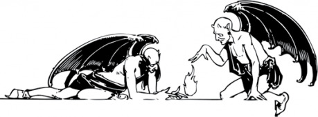

> _Go to Heaven for the climate, Hell for the company._ – Mark Twain

## Pekelné volání

- Stupeň: učeň
- Dosah: magický kruh
- Seslání a trvání: směna a do konce konverzace

Rituál kontaktuje zatracence, který se čaroději zjeví nepřímo formou telepatické komunikace, obrysů v dýmu, obrazu v zrcadle, psaní po zdech, tváře ve vosku, mluvícího zvířete nebo něčeho podobného. Čaroděj pak může vznést svůj požadavek, démon svou cenu, a dokud jeden z nich neodstoupí nebo se nedomluví, tak mohou smlouvat.

K seslání je třeba znát celé jméno démona. Řadoví vojáci a posluhovači mají krátká jména. Někteří nemají žádná a dají se vyvolat jen pomocí třídy nebo oddílu, ke kterému patří. Mocní mají jmen několik, někdy protože mají mnoho titulů, někdy protože jsou známí ve více jazycích.

Démoni jsou schopní mnohého, každý má jiné schopnosti a možnosti. Menší po čase sloužení mohou čaroděje považovat za svého pána. Mocnější vyžadují za každou pomoc často nemyslitelné rituály, oběti a služby.

## Poznámky pro vypravěče

{:.sidebar}
pozn.: Pokud někdo rozehrává čaroděje přímo jako černokněžníka a začíná s Pekelným Voláním už na první úrovni, ať si na tuhle tabulku hodí 3x desetistěnkou pro první tři jména.

Samotné kouzlo pro čaroděje nemá přílišnou hodnotu, protože je k němu potřebná znalost jmen. To ti dává příležitost pro další cool položku v pokladech. Grimoáry černokněžníků a hlubiny prastarých knihoven mohou obsahovat jména, nebo jen části celých jmen démonů. Kontaktování silného pekelníka s mnoha tituly se tak může stát výpravou samo o sobě.

> __Vzorová jména:__ _Asmodeus, Astaroth, Azazel, Balaam, Behemoth, Beelzebub, Bile, Cimeries, Coyote, Damballa, Dagon, Mormo, Mictian_ 
> __Vzorové tituly:__ _Pán Much, Slídič, Polykač Purpurového Plamene, Prznitel, Malý Pán, Lord z Karsaaka, Zubař, Pojídač štěstí, Generál Bezesné Legie_

Co konkrétně bude muset čaroděj za zatracencovi služby zaplatit je na tobě. Imp může být pokorný poskok, pokud mu bude denně poskytnut hrníček krve. Některá ze zmučených duší může vyžadovat lidskou oběť. Někdy stačí udělat něco na oplátku, třeba ukrást relikvii z kostela či zmrzačit kněze. Silnější démoni hledající dlouhodobou spolupráci mohou vyžadovat jako důkaz důvěry čarodějovu ruku, oko nebo kůži na hlavě. Pro povolání největších ďáblů bude zapotřebí při správném postavení planet zorganizovat masovou (sebe)vraždu nebo něco ještě náročnějšího.

Pro inspiraci tu nechám krátkou tabulku démonů. Lze ji použít k náhodnému určení pekelníka, jehož jméno (nebo jeho část) čaroděj právě získal.

1. __Patolízal__ – Úroveň 1, Obrana 12, Záchrana 16, Pařáty 1k4 
_Vlezlý okřídlený imp._
1. __Ohnivec__ – Úroveň 1, Obrana 10, Záchrana 17, Ohnivý dotek nebo plivanec 1k6 
_Malý plápolající skřet. Dokáže plivat oheň na vzdálenost 20ti metrů, zranění za 1k6. Při šestce oběť hoří a zranění se háže i příští kolo._
1. __Utrpení__ – Úroveň 1, Obrana 10, Záchrana 17, Dech 1k4 (záchrana proti nemoci, která zastaví jakékoli přirozené léčení) 
_Vyhublá oběť mokvavého moru. Kdykoli někde přebývá, začne na ostatní v obydlí přicházet smůla._
1. __Nenarozený__ – Úroveň 1, Obrana 12, Záchrana 17 
_Tvor podoby lidského plodu v třetím až pátém měsíci těhotenství. Pohybuje se nepřirozeně rychle, dokáže vlézt člověku ústy do hlavy a ovládat ho. Jeho odchod hostitel nepřežívá._
1. __Sliz__ – Úroveň 2, Obrana 11, Záchrana 16, Kyselinový dotek 1k6 (ničí zbroje) 
_Blob zlizovité kyseliny z pod kterého lehce prosvítá malá obtloustlá postava. Pomalý, zraňuje kyselinou, všechny útoky na něj poškozují zbraně a během směny dokáže protéct téměř libovolnou překážkou._
1. __Střelec__ – Úroveň 2, Obrana 10, Záchrana 16, Kuše 2k4 
_Z kůže stažená zotročená duše s vypálenýma očima a upilovanými rohy (Hellboy-style). Nosí černou těžkou kuši, která má lučiště vyrobené z velkých kozích rohů a poskytuje +2 k útoku (běžná těžká kuše má +1)._
1. __Zrazená__ – Úroveň 3, Obrana 12, Záchrana 14, Pařáty 1k6 
_Matianak, duše ženy, která zemřela při porodu. Útočí výhradně na muže. Kdokoli slyší její křik, háže záchranu proti dezorientaci (všechny hody 2x a bere horší)_
1. __Otrok__ – Úroveň 3, Obrana 14, Záchrana 15, 3x řetěz 1k6 
_Pološílená zmučená duše omotaná v ozubených řetězech, které dokáže ovládat jako chapadla._
1. __Zatracený__ – Úroveň 3, Obrana 14, Záchrana 15, Pařáty 1k4 
_Lemure, humanoid s hlinitou kůží, pod kterou se neustále něco hýbe. Regeneruje 1 život za kolo a na dobro usmrtit lze jen svěcenou vodou._
1. __Voják__ – Úroveň 3, Obrana 14, Záchrana 15, Zbraň 1k10 
_Kozí démon. Napůl člověk, napůl zvíře. Ozbrojený vždy nějakou děsivou obouruční zbraní._
1. __Neviděný__ – Úroveň 3, Obrana 12, Záchrana 15, Zuby nebo pařáty 1k6 
_Neviditelný přízrak s dlouhými pařáty a ostrými zuby. Nevraždí, ukusuje uši, vydloubává oči, případně trhá jazyk._
1. __Obchodník__ – Úroveň 3, Obrana 10, Záchrana 12 
_Upravený čert se slušivým oblekem. Uzavírá dohody výměnou nikoli přímo za své služby, ale za schopnosti a dovednosti. Může člověka učinit nejlepším kovářem, milovníkem, šermířem, dát mu schopnost vidět ve tmě nebo dýchat vodu apod_
1. __Dvojče__ – Úroveň 4, Obrana 12, Záchrana 15, 2x šavle 1k8 
_Zády srostlá siamská dvojčata bez tváří. Dokáží bojovat jako dva a nelze je obklíčit._
1. __Zrůda__ – Úroveň 4, Obrana 13, Záchrana 12, Dotyk rozkladu 1k4 
_Asag, démon nemoci. Zranění jím utržená jsou nevyléčitelná. Podle legendy je tak ošklivý, že se všechny ryby v dohledu uvaří za živa. Všichni, kdo ho spatří záchrana vs panický útěk (na minimálně 2k4 kol)._
1. __Pojídač__ – Úroveň 5, Obrana 12, Záchrana 14, Drtivé kousnutí 1k12 (ale útok -2) 
_Červ z růžovou kůží, groteskními kruhovými ústy s tisíci dětských zubů, a několika páry lidských rukou i nohou._
1. __Pes__ – Úroveň 5, Obrana 15, Záchrana 12, Rohy s rozeběhem 1k10 nebo kousnutí/ruka 1k6 
_[Eurynomův sluha](http://2k6goblinu.blogspot.cz/2013/07/eurynomova-sklizen.html). Rohatý mohutný pes s širokou tlamou a lidskou rukou v rozevíratelném hrudním koši. Když se mu v boji podaří svalit protivníka na zem, hrudník se rozevře a ruka vyrve soupeři srdce._
1. __Svůdník__ – Úroveň 5, Obrana 14, Záchrana 11, Pařáty 1k6 
_Succubus (žena) nebo incubus (muž) je okřídlený démon slasti. Dokáže hypnotizovat (záchranný hod povolen) opačné pohlaví a brát na sebe podobu krásného člověka. Po nocích navštěvuje a znásilňuje spící._
1. __Brouk__ – Úroveň 6+6, Obrana 17, Záchrana 13, Kusadla 1k12 
_Prakticky arachnid z Hvězdné Pěchoty. Jen z pod plátů chitinového krunýře se neustále valí štiplavý dým._
1. __Tlustej bastard__ – Úroveň 7, Obrana 13, Záchrana 9 
_Obrovský, morbidně obézní tlusťoch. Jeho pot je úžasná, neskutečně návyková droga. Bojuje blitím malých zombií dětí, co zemřeli při hladomoru. (k4 životů, koušou 1k4)_
1. __Generál__ – Úroveň 11+11, Obrana 21, Záchrana 5, Meč 1k12 a ohnivý bič 1k6 (útočí naráz do všech v dosahu; při šestce oběť hoří a zranění se háže i příští kolo) 
_Grandiózní okřídlený démon, rohy, ocas, kopyta, rudá kůže s rytinou acheronských zpěvů. V jedné ruce ohnivý bič ze žhnoucí lávy, v druhé enormní černý meč kalený v krvi nevinných. Zrozen k velení pekelných armád a totální destrukci._
