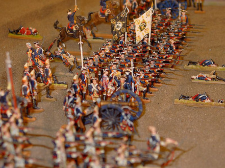
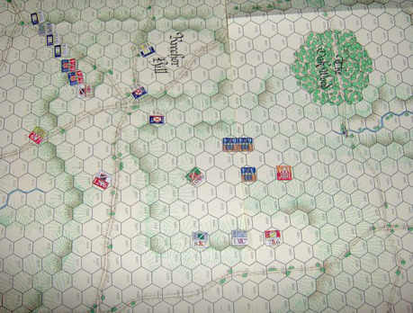
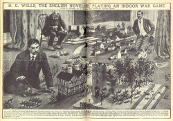
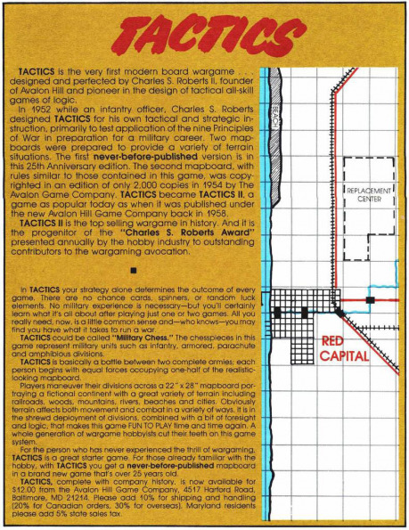

## Co to ten wargaming vlastně je?

_Wargaming_ označuje aktivitu, během níž hráči hrají hry (tedy _wargames_), které simulují nebo zprostředkovávají bitvy nebo války různých stran a jednotek. Nejčastěji se pod tímto termínem rozumí hry, které využívají cínové vojáčky, plastové figurky nebo podobné miniatury, se kterými se posunuje po stole a válčí se.

Mezi dnes nejrozšířenější hry patří třeba Warhammer 40 000 a Warhammer Fantasy Battles od _Games Worshopu_, Warmaschine od _Privateer Press_ nebo třeba španělská Infinity. U nás jsme nezažili zlatou éru _wargamingu_, která na Západě probíhala během sedmdesátých let, takže spíš jen znalcům budou něco říkat jména her jako Tactics, Gettysburg, Panzer­Blitz, Panzer Leader nebo Squad Leader od _Avalon Hillu._

Jako hráčům RPG by nám ale něco mohlo říkat jméno hry Chainmail z roku 1971, kterou vytvořili Gary Gygax a Jeff Perren a která simulovala války fantasy armád. Velká část konceptu z této hry se poté objevila v další Gygaxově hře, kterou už je samozřejmě Dungeons & Dragons. Chainmail ale už obsahoval všechny rasy, které se objevily později, AC (tedy _armor class_), povolání a úrovně postav, stejně jako některá kouzla a příšery. Po prolistování musím říci, že základ hry je v podstatě velmi podobný, přestože soubojový systém je trochu odlišný. Chainmail byl sice vytvořen pro velké bitvy armád, ale v realitě se hrál jako později DnD – hráči odehrávali osudy malých skupin vojáků nebo prozkoumávání jeskyní.

## Prehistorie

Mezi první hry, které zachycovaly válku dvou armád do hry, patřila hra _Wei-Hai_ (či _wej-čchi_), čínská hra dnes známá spíše jako _go_. Následovala ji pozdější, ale podobná indická hra _Čaturanga_ z níž vycházejí pozdější šachy, které jsou v podstatě bitvou dvou armád převedenou do zjednodušených pravidel.

Šachy jsou ale opravdu hrou, která ztratila vztah k reálné válce a je nedostatečná pro potřeby vojenských stratégů, kteří chtějí „simulovat“ války a bitvy. V průběhu historie se proto objevily pokusy upravit šachy tak, aby odpovídaly reálné válce.

V roce 1664 vytvořil v Ulmu jistý Christoph Weickmann hru zvanou _Königsspiel_, která mě­la být „výtahem nejužitečnějších vojenských a politických principů“. Obsahovala třicet kusů jednotek na každé straně, které byly zařazeny do 14 vojenských tříd s různými druhy pohybu. Hrála se také na větší ploše a měla simulovat strategii války (tedy válku z nadhledu). Stala se poměrně populární, ale šlo stále jen o nadstavbu na šachy.

První hra, která se vymanila z šachových principů byla verze _Königsspiel_ z roku 1780. Tu vytvořil C. L. Helwig, mistr pážat na dvoře vévody z Brunswicku. Hra obsahovala 1666 dílků, které představovaly kusy terénu a měly různou průchodnost. Figurky nyní představovaly skupiny vojáků (a ne jednotlivé vojáky), druhů vojenských jednotek bylo na 200 a každá figurka měla jinou rychlost chůze (pěšáci mohli za kolo překonat 8 čtverečků, těžká jízda 12, apod.). Obsahovala i pravidla pro pontonové mosty a podobně. Helwigova hra si získala po Evropě slušnou popularitu.

Dále ji modifikoval v roce 1796 Georg Venturini, vojenský spisovatel ze Šlesvicka, který vytvořil ještě komplexnější verzi. Dále ji pak modifikoval v roce 1798, když pro hru vytvořil mapu, jež zobrazovala skutečný terén hranice mezi Francií a Belgií.

## Kriegsspiel

V roce 1811 se na válečné hry vrhl pruský kreativní tým sestávající z otce a syna von Reisswitz. Starý baron von Reisswitz byl civilním poradcem pruského dvora. Během doby, kdy bylo Prusko poraženo Napoelonem a tvořilo vlastně francouzský protektorát, vytvořil válečnou hru, která využívala místo mapové mřížky stůl s pískem. 1811 ji zahlédli dva pruští princové a představili ji králi. Hra se stala okamžitým hitem na pruském a ruském dvoře, ale skuteční vojáci pro ni zatím nenacházeli využití.

Lze pozorovat tendenci k vytváření stále složitějších a složitějších her, které měly za úkol co nejvěrněji simulovat realitu. Je to vidět v následující fázi, která zažila zlatý věk komplexních pravidel. Tato tendence se objevila i ve dvacátém století... hry se stávaly složitější a šložitější, až situace nebyla únosná a wargaming zažil strašlivou krizi na konci osmdesátých let.

Tehdy se válečné hry přesunuly na počítače, které dokázaly simulovat strašlivé množství faktorů, které s tužkou nešlo vůbec zohlednit... a stolní válečné hry přišly o masovou hráčskou základnu, přičemž se staly útočištěm několika podivných geeků.

To se změnilo v roce 1824 – tehdy poručík George Heinrich Rudolf Johann von Reisswitz z pruského dělostřelectva, představil svoji vlastní verzi hry. Hra se jmenovala _Anleitung zur Darstellung militairischer Manöver mit dem Apparat des Kriegs-Spieles_ (Instrukce pro reprezentaci taktických manévrů pod rouškou hry), ale známější se stala jako _Kriegsspiel_. Oproti otcově verzi představil řadu změn – především použití skutečných topografických map, které vytvářely bojiště, a velmi složitých pravidel, která simulovala uvěřitelné výsledky bojů.

Touto verzí byl okouzlen pruský princ Wilhelm, který mladého poručíka doporučil veliteli pruského štábu, generálu von Muffling. Během hry byl generál nadšen a prohlásil, že nejde o hru, ale vojenský trénink. Brzy poté zajistil, aby měl každý pruský regiment jednu sadu hry, v padnoucí dřevěné krabici. Bohužel musím na tomto místě zmínit, že mnoho ostatních důstojníků závidělo mladému poručíkovi jeho slávu, takže mu házeli klacky pod nohy, zatímco se objevilo mnoho „odborníků“, kteří zpochybnili přesnost jeho simulace. Von Reisswitz spáchal v roce 1827 sebevraždu. Jeho hra už ale žila vlastním životem.

Velmi zaujala kupříkladu poručíka Helmutha von Moltkeho, který založil v roce 1828 wargamingový klub jménem _Kriegsspieler Ver­ein_, kde se hra hrála, a který dokonce vydával vlastní časopis. Von Motlke se stal velitelem generálního štábu v roce 1837 a hraní _Kriegesspiel_ zavedl pro vojáky povinně.

V roce 1876 byla zveřejněna další wargame, tentokráte plukovníkem Juliem Adrianem Friedrichem Wilhelm von Verdy du Vernois. Ten představil nový přístup hraní _Kriegsspiel_. Byl takzvaný „volný“ – většinu rozhodnutí tedy neřešila pravidla (jak tomu bylo ve von Reisswi­tzově „rigidním“ systému), ale zkušený rozhodčí, který odhadoval výsledky na základě své zkušenosti.

Dilema, zda volit systém „rigidní“, nebo „volný“ se stalo pruským evergreenem (v USA kupříkladu převládl systém „volný“, zatímco později byla snaha oba přístupy kombinovat). Díky hraní _Kriegsspiel_ (a tím simulaci bojiště a rozhodování pro důstojníky) získalo Prusko velký náskok a byl to jeden z faktorů, který rozhodl prusko-francouzskou válku ve prospěch německých zemí. Prusko mohlo velmi levně trénovat své důstojníky a během 19. století se z toho stal jeden z hlavních výcvikových prostředků vojska.

## První skutečné „hry“

Přechod od „vojenské simulace“ ke „hře“ přišel až ve dvacátém století. Fred T. Jane (autor _Janeʼs Fighting Ships_, nejpřesnější příručky vojenských lodí na světě) přišel v roce 1898 s pravidly, která zobrazovala námořní bitvu s modely lodí. Edice _Janeʼs Fighting Ships_ z roku 1905 dokonce tato pravidla obsahovala pod názvem _The Naval War Game_. Stále šlo ale o pokus vytvořit věrnou simulaci reality.

Prvním, kdo vytvořil skutečnou „hru“ určenou k hraní a odklonil se od reality ve prospěch zábavy, byl anglický spisovatel H. G. Wells (autor knih _Válka světů, Stroj času, Neviditelný muž_ a mnoha dalších). Je mnohými považován za „otce wargamingu“.

Věnoval se hledání toho, jak do hraní her přidat strukturu, podle které by se dalo hrát. Prvním výsledkem tohoto bádání byla _Floor Games_ z roku 1911 a byla následována první wargame vůbec, která je známá jako _Little Wars_.

Vyšla v roce 1913 a celý název hry zní _Lit­tle Wars: a game for boys from twelve years of age to one hundred and fifty and for that more intelligent sort of girl who likes boysʼ games and books_. Uznejte, že hru takto pojmenovanou si nelze jen tak snadno nezamilovat. Pravidla si můžete přečíst sami, jsou (stejně jako text _Floor Games_) volně k dispozici [díky projektu Gutenberg](http://www.gutenberg.org/files/3691/3691-h/3691-h.htm).

Celá hra je velmi sympaticky napsaná formou jakéhosi záznamu tvorby pravidel, kde autor vysvětluje, proč se rozhodli pro některá pravidla, které věci testovali, a které ne. Na začátku autor vysvětluje, jak se k tomuto hraní vlastně dostali. Jeho známý si jednou z dlouhé chvíle vzal cínové vojáčky a začal na ně střílet z děla na pružinku. Oba ctihodní gentlemani v tom začali závodit a brzy jim přišlo divné, že se jejich terče nemohou skrýt... a z toho postupně vznikla pravidla, jak si hrát s vojáčky a střílet z děl na pružinky.

Hra není složitá, naopak je velmi jednoduchá a obsahuje poměrně málo pravidel (ale i s nimi lze dělat kouzla – například děla musí obsluhovat čtyři vojáci, pokud to budou místo pěšáků jezdci, má hráč jízdní dělostřelectvo schopné rychle se přepravovat a rozmístit). Na konci je návrh úpravy pravidel hry na _kriegsspiel_ (opět s upřímným dodatkem, že tato pravidla netestovali, jen navrhli).

{:.sidebar}
Autoři jsou zakládajícími členy SpRLW (Společnost pro revitalizaci Little Wars a jejich hraní na Slezině RPG Fóra). Společnost je tu od toho, aby se pokusila oživit hraní Little Wars a přitom se pobavila.

Hra využívá pěšáků, jezdců a děl. Děla jsou pro hru zásadní, protože jde o skutečná děla na gumičku, ze kterých hráč pálí, a vojáčci, které projektil zasáhne, jsou zabiti. Děla pak musí obsluhovat 4 vojáci (jak bylo řečeno), takže když je nepřítel pobije, může dělo otočit proti jeho majitelům. Dělo pálí 4 rány za kolo, takže je velmi důležité. Základní mechanika je taková, že když se srazí dva nepřátelští vojáci – zabijí se navzájem. Když je jich přesila a bojují proti oddílu bez kontaktu s armádou, zajmou je, ale body za ně hráč získá, až když je odvede za svoji startovní čáru. Proto musí velitel vyčlenit nějaké vojáky, aby zajatce odvedli dozadu. Jeden voják dokáže doprovázet osm zajatců. Pokud jich hráč vyčlení moc, budou mu chybět v bitvě, pokud málo, může jej nepřítel překvapit osvobozením zajatců a jejich přezbrojením.

Skvělá mechanika je ta, že vítězné body jsou stanoveny ne na bitvu, ale na válku – takže pokud se bitva nedaří, je výhodnější stáhnout se, než se nechat zmasakrovat. Ustupující hráč rychle dostane do bezpečí děla (jsou za 10 bodů), stáhne, koho může, a nechá vojáky, kteří jsou příliš vepředu (a při ústupu je by je zkosila děla), aby se vzdali (protivník tak za ně dostane jen ½ bodu, a ne celý bod).

Další hrou, která zvolila stejný přístup, a tedy byla skutečnou wargame, je švédská _Hur man för krig med tennsoldater_ (Manuál pro válku s cínovými vojáčky) od Ossiana J. D. Elgströma (švédského etnologa, spisovatele a umělce) z roku 1914.

Kniha vyšla rok po Wellsovi a podle formy, ilustrací a fotek zřejmě musel autor _Little Wars_ znát. Hra má podobně jednoduchá pravidla, ale obsahuje kulomety, děla střílející pomocí gumy, bombardy a další šílenosti, včetně návodů, jak tyto podivné válečné stroje metající projektily vyrobit.

Roku 1916 vyšel německý překlad této hry (_Wie man mit Zinnsoldaten Krieg führt_) v Lipsku a zhruba ve stejné době také vyšla podobná německá hra _Strategie und Taktik des Spieles mit Bleisoldaten_ od Kurta Floerickeho.

Společně s _Little Wars_ představuje tato trojice asi první tři wargame, které vyšly. Až do padesátých let se držel princip, že hlavní složkou těchto her jsou děla na pružinku, se kterými hráči střílejí sami... a závisí na jejich umu, zda uspějí, nebo ne (děla pokosila nejvíce cínových vojáčků, ostatní pravidla byla víceméně velmi jednoduchá). Teprve v padesátých letech to změnili američtí wargameři, když Charles S. Roberts v roce 1952 přišel s hrou _Tactics_. Ta se posunula někam mezi _Kriegsspiel_ a _Little Wars_ a představila hru, která sice vytvářela zdání reality, ale nebyla příliš těžká na počítání a tím byla dostupná běžnému hráči.

Charles S. Roberts (i on bývá někdy označován spolu s Wellsem jako „otec wargamingu“) pak založil slavnou herní společnost _Avalon Hill Game Company_, která nastartovala „zlatou éru wargamingu“ ... ale to už je zase jiný příběh, stejně jako úpadek této zábavy na konci let osmdesátých.
