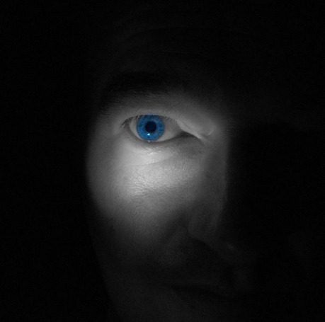

## I.

_Objeví se něco, co začne hrdiny ohrožovat._

Toto je zřejmě jeden z nejstarších typů příběhů, který se kdy objevil. Netvorů, kteří by mohli pronásledovat postavy, pobíhalo v pradávnu po lese dost. Nejen vlk, ale třeba dokonce šavlozubý tygr. Efekt vyprávění je skoro zaručený; jde o krk. Hrdinův, někdy i tygrův; násilí hrozí vybuchnout každým okamžikem. A i když nevybuchne a hrdina přežije, v příběhu ta možnost nebezpečí zůstává a žene vpřed naši pozornost. _Je to napínavé_, z podstaty věci. Karkulka přežila nebezpečné setkání s vlkem v lese, došla v pohodě až k babiččinu domečku, ale tam najednou obrat a všechno bylo jinak. Už tady se ukazuje, že možností má vypravěč spoustu. A dokud vlk hrozí, jede to zcela samo.

Že tato prostinká metoda funguje i v moderní době, lze doložit například Čelistmi. Příběh je fascinující tím, jak je jednoduchý a starožitný. _Člověk má příšerný strach, že ho sežere příšerně velký žralok,_ shrnul to lakonicky kterýsi kritik. Pro velký úspěch se ostatně vyhrnula vzápětí do Hollywoodu lavina odvozených dalších žraloků, aligátorů, anakond a dinosaurů.

Hlavní žánry příběhů se strašidlem jsou dva mocní jednovaječní bratři _horor_ a _thriller._ Odlišují se údajně tím, že v thrilleru je hrdina ohrožován, pronásledován či strašen něčím přirozeným, jako třeba Spielbergovým žralokem, v hororu pak strašidlem nadpřirozeným, dejme tomu veleknězem Cthulhu. Thriller pak klade důraz spíš na tu adrenalinovou fázi pronásledování, horor na beznaděj a hrůzu. O bratrech ale mluvím proto, že jsou principy obou žánrů velmi podobné a velmi často je ani nedokážeme pořádně odlišit.

Společné mají také to, že je příběh se strašidlem pouze podtypem obou žánrů; můžeme mít děsivou situaci i bez strašidla, například postapokalyptickou katastrofu.

Předpokládejme, že jste se z nějakého důvodu na tuto trasu rozhodli vydat a strašit čtenáře, diváky či hráče RPG pomocí strašidla. Článek by měl naznačit základní výhody a úskalí, které to přináší.

## II.

Přirozenou vlastností veškeré epiky je snaha _trumfnout předchozí vypravěče._ Protože, přiznejme si, to o tom vlkovi, tygrovi a žralokovi jsme už asi slyšeli.

Oblíbený trik vypravěče je zejména _zvětšování._ Horší než tygr je větší tygr. Případně dva tygři. Neochvějná rybářská logika káže zvětšovat všechny ryby, o kterých byla řeč, a ani žraloky samozřejmě není důvod vynechat. Takže ten slavný žralok Spielbergův byl rovnou rodu Carcharadon carcharias, čili ten největší z dravých, a hned v maximální známé velikosti. Nedosti na tom. V napodobených příbězích ho postupně nahradil rovnou třicetimetrový pravěký __Megalodon__, který zhltne vrtulník v letu.

Soudnější vypravěči ovšem velmi brzy odhalí, že tato cesta nikam nevede a je slepá. U žraloků a tygrů o délce zhruba od deseti metrů výš je překročen jistý kritický moment; čtenář začne pochybovat, zda z nás vypravěč nedělá blbce. A místo větších obav o osud nebohých hrdinů se začne smát.

Je velmi dobré si uvědomit, jak veliké má být vaše strašidlo. Jednoduchá rovnice, že _větší potvora = větší efekt_ funguje jen velmi omezeně. Uvědomte si, že svět, ať reálný, či fiktivní, je kompatibilní jen k určité velikosti jeho obyvatel. V případě skutečného světa byli živí tvorové evolucí zkonstruováni na míru tomu světu, v případě světů virtuálních to může být právě obráceně; ale v každém případě nastanou veliké potíže, když je strašidlo jaksi z měřítka. Hodně veliké monstrum, jako třeba __Godzilla__, má silně omezené možnosti. Bude se propadat na mostech a na všech stropech lidských měst. Bude zapadat do bažin, váznout v lese. Bude mít málo žrádla. Všechny tyhle věci musí nechat autor raději stranou, jinak se zaplete do neřešitelných rozporů; strašidlo může být předvedeno pouze v tom velkolepém efektu, kdy rozdupává domy a auta, a na jeho další život se raději neptejte.

Stejně tak možná interakce s lidmi je dost omezená. Lidi pro Godzillu představují jedno sousto, a většinou ani to ne – jen je nechtěně zašlápne. Člověk jako individuum je pro ni dokonale nezajímavý. Nemá tedy žádný pravděpodobný důvod pronásledovat jednoho konkrétního člověka, jako třeba vlk Karkulku. Na většině míst lidi ani pronásledovat nemůže. Nevleze za nimi do domu nebo do metra – a pokud ano, tak za cenu velmi divokých licencí, jako v Emmerichově filmu, kde je třeba věřit, že Godzilla umí hrabat jako krtek.

Záhy zjistíte, že s takto velkým monstrem je plno starostí, udržet je na scéně delší dobu dá obrovskou práci, a hlavně – _nikdo se vůbec nebojí_. Čímž postrádá strašidlo svůj hlavní smysl.

Rozumná velikost strašidel je tedy v běžných antropomorfních rozměrech, tedy přibližně jako člověk nebo známá zvířata. Je oblíbené dělat strašidla o kus větší, aby se dívalo na člověka shora, a aby bylo zřejmé, že při fyzickém souboji je člověk ztracen. Velikost Vetřelce, Balroga nebo Predátora není zvolena náhodně; je to osvědčený rozměr. Musí být právě jen o kus větší, ne moc; aby šlo vhodně a rozumně vysvětlit, jak se stalo, že je větší, a aby se vešlo do všech míst, kudy mohou před ním hrdinové prchat.

Opravdu děsivé strašidlo pak těží z úplně jiných vlastností, než je velikost.

## III.

Obratný vypravěč může přidat nebezpečnému zvířeti vlastnosti, které obvykle nemívá. Žraloci obvykle neskáčou do lodi; ale _mohli by_. Žraloci také rafinovaně nečíhají v místech, která lidé už prohledali, aby bylo velmi těžké je odhalit. Ale _mohli by;_ nic tomu nebrání...

Neobvyklý a málem nadpřirozený žralok z Čelistí, pocházející z předlohy Petera Benchleyho, není tak úplně originální; prapůvodní vynález takto vylepšeného zvířete byla zřejmě __Bílá velryba__. I tam už lze zaznamenat, že vorvaň si kupodivu pamatuje svého nepřítele kapitána Achaba, čeká na něho řadu let a když se objeví, tak ho velmi inteligentně a systematicky pronásleduje, což normální vorvani nedělají. Ale _mohli by_. Tímto manévrem dělá Bílá velryba dojem, že je něčím daleko víc, než jen zvířetem a stává se opravdu _strašidlem._

_Strašidlo musí umět víc, než je běžné a než lze rozumně očekávat._

Působí tak dojmem, že má hlubší smysl a nutí teoretiky vymýšlet o tomto jejím smyslu sáhodlouhé teorie. A hlavně, pro vypravěče představuje opravdu velkolepou horu energie, která udrží román pohromadě i při jeho kolosální délce. Nevěřili byste, že je možno napsat 600 stran o rybaření; ale je tomu tak a kniha je naprosto skvělá. Podrobnějším studiem zjistíte, že Čelisti si vypůjčují z Bílé velryby daleko víc, než základní nápad.

Zdánlivě jednoduchý manévr vylepšení zvířete do strašidla tak úplně jednoduchý není, proto také řada napodobenin těchto předloh selhává. _Provedení_ je ze všeho nejdůležitější; je to balancování na laně uvěřitelnosti, kdy to nesmíte přehnat ani na jednu stranu. Pokud bude tvor nadpřirozený moc, může být stejně směšný, jako když to přeženete s velikostí. Dejte žralokovi laserový pohled, a nebude se bát nikdo. Nebo Piraňa 2 od mistra Camerona neblahé paměti, která létá; bál se asi málokdo.

Naopak, pokud vylepšíte zvíře jen nedostatečně, pak se vracíte k příběhu o lovu, nikdo se bát nebude a zas až tak moc dlouho s tím nevystačíte.

Trend _vylepšování zvířete do strašidla_ je zřejmý i v původním příkladu; vlk začíná s Karkulkou konverzovat. Už si nemůžeme být tak úplně jisti, co to zvíře všechno umí. Vypadá sice jako vlk, ale ve skutečnosti _je to tvor neznámý a pro vědu úplně nový._

Prvotním instinktem badatelů již od Linného je takto neznámé tvory katalogizovat a třídit a lepit na ně popisné cedulky. Takže jdeme na to.

## IV.

Potřeba _strašidel coby zvířat strašnějších, než je reálně možné,_ vyvstala zřejmě již ve starověku a ve středověku. Každá kultura vybavená písmem, která má přehled o vlastních starých historkách, dospěje k tomuto momentu zřejmě nevyhnutelně.

Jedním z velmi archaických řešení problému jsou _montážní představy_, tedy monstra, smontovaná z více zvířat. Například nápad, že je něco veliké a ozbrojené drápy jako lev a při tom umí létat, tedy _gryfon_, je prastarý. Podobná monstra bývala oblíbené téma starého Řecka, které si na ně náramně potrpělo. _Sfinga, chiméra, hydra, medúza, harpyje, manitkora,_ trojhlavý pes _Kerberos_. Řekové jsou národ, který vynikal velikou obrazností a měl tendenci spoustu těchto nápadů vymalovat, takže jsme docela dobře informováni o tom, jak to všechno mělo vypadat. A díky některým encyklopedickým badatelům, například Pliniovi, existovaly odedávna pokusy uspořádat tuto fantastickou zoologii do bestiářů a systémů.

Podobná monstra, doplňovaná často i tím zvětšováním, samozřejmě vytvářely i jiné národy, například Židi s jejich starozákonním _Behemotem_ a _Leviathanem_, Sumerové a jejich _Tiámat_, která má někdy podobu zvířecího monstra, ale jindy připomíná spíš bezednou propast a gravitaci; rozhodně je extrémně nebezpečná. Tyto národy mívaly tendenci k přehánění; snaha o ultimátní monstra, čili _co nejstrašnější potvory,_ vedly obvykle k omylům, popsaným dříve – k přehnané velikosti, nebo k příliš nepravděpodobným vlastnostem.

O něco lepší variantou, než montážní monstra, jsou _zvířata, která reálně existovala, ale už vyhynula._ Například obrovský chodící dravý pták, který nese v mytologii různá jména (Noh, Ruch), který se s lidmi skutečně potkával, pod latinským jménem Aepyornis, Dinornis, Phorusrhacus a podobně. V některých případech se tak mohlo dít dokonce ještě v novověku. Možná jsou tímto případem i _draci_, snad nejoblíbenější zvířecí strašidla vůbec. Rozhodně draci nepůsobí dojmem montáže z jiných zvířat; o jejich technické reálnosti v dávné minulosti se věda po stádiu pochybností nakonec přesvědčila, když se objevil první exemplář rodu Pterodactyl, tedy dravý ještěr, který létá.

Vynalézání fantastických zvířat chytilo druhý dech ve středověku, který s velkým zájmem oživil starověké bestiáře a doplnil je mnoha nápady vlastními, jako je například severský mořský had _kraken_ (který není starořecký, jak by vám chtěl snad někdo namluvit). Je samozřejmě možné, že původem krakena nebo hydry jsou zprávy o obrovských hlavonožcích, kteří ovšem reálně existují, takže jde opět o případ vylepšeného zvířete.

Věk osvícenství, vědy a rozumu začal fantastická zvířecí monstra odsouvat pomalu do pohádek a přestal je brát vážně; ale byla to v trvání dějin vlastně jen nevýznamná epizoda. Protože ve dvacátém století je jich postupně chopili _spisovatelé fantastické literatury_ všeho druhu. A použili k tomu všech metod, které jsme popsali, v množství a rozmanitosti, nad kterou by se starším dobám tajil dech.

Z hlediska vypůjčování si vyhynulých monster pomohlo zjištění, že velmi neobvyklá a nebezpečná zvířata na Zemi kdysi opravdu žila.

Podobně vděčný byl nápad, že takové dravé příšery by mohly žít někde _daleko ve vesmíru;_ tam dokonce padá i většina těch omezení, která platí pro pozemskou evoluci. No, a montážní konstrukce jsou samozřejmě možné i v současnosti, takže i těch leckdo neváhal využít. Čím jiným je ostatně __Cthulhu__, než kombinací člověka a chobotnice?

Zakladatelé této „zvířecí“ větve příběhů o strašidlech v době moderní jsou zejména R. E. Burroughs; a na něho navazují H. P. Lovecraft, R. E. Howard a armáda dalších. Tolkien, mimochodem, v tomto oboru přispěl poměrně málo; jeho nejpodstatnějším vynálezem jsou možná _balrogové_ a _entové_.

## V.

Existuje ještě úplně jiné řešení strašidelné rovnice. Pokud potřebujeme, aby zvíře nabylo nových nebezpečných vlastností, zejména inteligence, potom je lákavé, aby bylo _zvíře zároveň člověkem._

S tématem proměn ve zvíře se lidé straší také už nějakou dobu. Nejslavnější jsou asi _vlkodlaci,_ ale třeba z Polynésie jsou známi i místní _žralokodlaci_ a z Indie _tygrodlaci._ V Číně má kolosální tradici myšlenka _drakodlaka,_ tedy lidí, proměňujících se v draky. Drakem byl například legendární __Žlutý císař__, působící někdy v době pyramid. Stejně tak i na západě existují velmi stará vyprávění o lidech, měnících se v draky či hady; obzvláště slavná je třeba __Melousine__, prababička rodu Lusignanů (a vzdáleně příbuzná i s našimi Lucemburky). Bohatý a mocný rod pokládal zjevně za náramně rajcovní možnost, že jejich prababička byla drakodlačice a nadšeně si o tom vyprávěl stovky let. Tady se strašení zjevně jaksi zvrhlo v lehce úchylné sexuální fantazie.

Princip proměny člověka ve zvíře je v popsaných případech podobný a „dlaků“ lze vyrobit neomezené množství. Může jít o variantu, kdy _člověk-čaroděj umí být zvířetem_, nebo naopak, z_víře se vydává za člověka_. Tím získává další výtečnou možnost, že na vás může bafnout skutečně nečekaně. Třeba v podobě krásné dívky, jako __Clarimonda__ od Theophila Gautiera.

Klíčový problém je moment proměny člověka ve zvíře; to bývá slabé místo celého nápadu a vlastně se to nikdy moc přesvědčivě vyřešit nepovedlo. Vzpomeňme na ten prvotní princip nadpřirozeného vylepšování; chceme tvrdit, že vlci se sice běžně nemění v lidi, _ale mohli by._ Pokud přesvědčíme čtenáře, že by opravdu mohli, je teprve vyhráno. Pokud ne, máme problém.

Neselhávající je zejména nápad, že se _sám hrdina_ začne proměňovat ve zvíře. Jistá děsivá intimita této myšlenky se s úspěchem uplatňuje ještě dnes. Ono totiž kromě děsivosti této Proměny, jak ji známe například u Kafky, nebo u původní Langelaanovy Mouchy, má celá věc i rovinu jisté lákavosti a dokonce i důmyslného sexuálního dobrodružství, na kterou nás přivedla už __Meluzína__. Tato Barkerovská dvojlomnost, kdy nejvyšší děs balancuje na pokraji s fascinací, je například jasně patrná u __Mouchy__ ve filmu Davida Cronenberga.

## VI.

Odpradávna existuje úplně jiná metoda výroby strašidel, a možnou rovnou říci, že dnes nepoměrně oblíbenější a vděčnější. Jsou to _obživlí mrtví._

Většinu těchto nápadů opět vypátráme už v Bibli a dávném starověku. Nápad o možném návratu mrtvého musel dostat snad každý, kdo někdy nějakou mrtvolu viděl. Profesor Claude Lecoteux dokládal, že prý původně byl takový nemrtvý prostě a jednoduše oživené tělo, nejlépe již s projevy rozkladu (zápach, černé maso, potrhaná kůže), který moc nemluvil a jednal; a obvykle měl obrovskou a nadpřirozenou sílu. To, co dnes nazýváme historickým nedorozuměním obvykle _zombie_. Názornou ukázkou takové brutální starožitné potvory je třeba _Grendel_ v Beowulfovi.

Velmi starodávný je také pokus vysvětlit jejich fungování; _život mají díky tomu, že ho kradou._ Podstata života pro staré národy nějak souvisela s krví; proto kradení krve je ekvivalentem _kradení životní síly._ Dnes řekneme samozřejmě, že je řeč o upírovi; ale název této nemrtvé nestvůry byl velmi mlhavý, neustálený a často překvapivý. Nejstarší doklad, jaký jsem zatím objevil, se nachází v Izaiášově proroctví 34,13–15:

> A vzroste na jejich palácích trní, kopřivy a bodláčí na hradích jejich, a bude příbytkem draků a sov. Tam se budou potkávati zvěř s ptactvem, a příšera jedna druhé se ozývati; tam toliko __noční přeluda__ se usadí a odpočinutí sobě nalezne.

> Tam se zahnízdí sup a škřečeti bude a když vysedí, shromáždí pod stín svůj; tam také shledají se luňáci jeden s druhým.

Ekumenický překlad má místo té noční přeludy přímo upíra.

Jiný slavný případ je _morous_, čili mužský tvar od _můry_ či _mory_, z Neplachovy kroniky ze 14. století, který se velmi podobně vykrádal v noci z hrobu a pil lidem krev, díky čemuž žil i po vlastní smrti.

Slovanská _striga_ je zřejmě zase ten samý případ; divoká, obživlá mrtvola. A pak máme ještě zvláštní rumunskou příbuznost mezi těmito strigami a _„vukolaky“_, v popisu opět připomínající upíra či zombii.

V principu se zřejmě bavíme stále o tom samém starožitném strašidle, prototypu všech nemrtváků, tehdy ještě bez vědeckého odlišování a přesných názvů.

Ryze křesťanského, čili novějšího původu jsou příšery rázu vysloveně sexuálního; jsou založeny na jiném reálném jevu, totiž sexuálních snech. Nemožnost odlišit, zda se noční dobrodružství odehrávají jen v mysli, nebo doopravdy, dala vzniknout _sukubám_ a _inkubům_. Sukuba je ženská, inkubus je chlap, ale fungují v principu lautr stejně; dopouštějí se sexuálních nepravostí na pokojně spících křesťanech. Aby se náhodou tato strašidla nestala místo obávaných _žádanými_ návštěvníky, byla tendence je různě vylepšovat; v rámci sexuálních radovánek upíjejí lidem životní sílu, jako ti upíři, případně jsou jejich sexuální orgie nějakým způsobem bolestivé a škodí vašemu zdraví a zejména duši, před čímž pan biskup varuje.

Opět lze nacházet četné příbuznosti mezi upíry a těmito démony. Počínaje 19. stoletím je upír _elegantní a sexuálně přitažlivý,_ nikoli olezlá mrtvola. Tato varianta na dlouhou dobu v kultuře zvítězila.

Nakonec ovšem křesťané boj s těmito strašidly raději přesunuli do čistě duchovní roviny, oživlé mrtvé raději odhmotnili a vyrobili z nich _duchy_. Claude Lecoteux tvrdí, že duch je patentem až pozdně středověkým. Mám o tom jisté pochyby, protože o něčem na způsob „astrálního těla“ hovořili už ve starém Egyptě, jmenovalo se to Ka a stavěla se pro to malá pyramida někde v koutě u té veliké. V každém případě, duch je strašidlo principiálně jiného charakteru, než klasický nemrtvý; je decentní, bez nehygienických hnusáren, netrhá oběti nadlidskou silou, nepožírá je, ani s nimi nepáchá sexuální nepravosti; intelektuálnímu 19. století takové akademické salónní strašení zřejmě vyhovovalo víc. Mohlo se o to snadněji zabývat otázkami duchovy viny či naopak křivdy, řešit pomstu, odpuštění a podobné věci.

Což nás ovšem táhne někam úplně jinam, od jednoduchého příběhu o strašidle, které pronásleduje hrdinu. Dnes se doba zase navrací daleko častěji k těm hmotným nemrtvým a má se zato, že je s nimi možné nepoměrně více strašení a zábavy.

## VII.

Po této taxonomické přehlídce základních typů strašidel přejděme k historii jejich užívání; a skočíme rovnou do věku průmyslové revoluce, kdy byla možná vynalézána literatura pro zábavu.

Nutno říci, že se v první fázi s popsanými starými nápady hodně dlouho vydrželo. Draci a fantastická zvířata se v devatenáctém století zjevovali spíše střídměji, neb racionalismus jim moc nefandil. Častěji se mihnul nějaký ten _nemrtvý_ a zejména _duch_. Duchové s ohledem na jistou hygienu a společenskou důstojnost mohli jak do vyšší společnosti, tak i vyšší literatury; například do děl ctihodného Henryho Jamese.

Chytřejší autoři odhalili, že všechny tyto nápady začínají být poněkud provařené klišé. Hraběnek, u kterých se ukázalo, že jsou _vskutečnosti mrtvé_, bylo už příliš mnoho. Podobné překvapení si mohli dovolit vynálezci povídky s pointou, jako třeba Dobrodružství německého studenta, Washington Irwing, 1930, nebo Poe v Pádu domu Usherů – ale po nich to už tak moc překvapení nebylo. Takže se vymýšlely varianty, například, že dáma je vskutečnosti pavoukodlak (Clarimonda, Gautier). Nebo je strašidlo jen vedlejší prvek situace. Poeův Černý kocour by mohl být nemrtvý, ale také při troše dobré vůle i zcela realisticky živý. V obou verzích o to příliš nejde; mnohem zajímavější jsou duševní pochody v hlavě antihrdiny.

Můžeme konstatovat, že až na pár výjimek 19. století při rozvoji modelu _příběhu o strašidle_ spíše rezignovalo a vydrželo převážně s těmito starožitnými jednoduchými schématy. Kdyby vás dnes napadlo něco, co se vejde do popsaných schémat, vězte, že to není úplně nejnovější myšlenka a bude proto třeba ji poněkud rozvinout.

## VI.

H. P. Lovecraft je osoba, o které už byla řeč a ke které se nevyhnutelně na tomto místě vracíme.

Prvním krokem bylo tedy již zmíněné obohacení světa o nová strašidla, o nichž čtenáři až doposud nikdy neslyšeli. Většina potvor pochází z dalekého vesmíru, případně ze dna oceánu, nebo konečně z Antarktidy; tam běžná pravidla neplatí, což omlouvá jejich poněkud nezvyklý vzhled a chování. Lovecraft si dal velikánskou práci s tím, aby přesvědčil – v rámci příběhu – o reálnosti těchto velmi nereálných monster. Takže lze říci, že úspěšně vnutil lidem kilometrové chobotnice s částečně lidským tělem, ohromné neviditelné žáby s šesti nohama, neviditelnou barvu neznámého vzhledu, okřídlené radiálně symetrické netvory, mávající křídly v mezihvězdném vakuu, případně lidi, zmutované tak, že bleskově ryjí zemí jako krtci a zahryzávají se do lidských obličejů, aniž by je při tom kdo postřehl. Jedna šílenost vedle druhé. Přesto to funguje a lidé mohli být úspěšně strašeni a pronásledováni novými a ještě neokoukanými strašidly.

Zde udělejme historické předběhnutí někam k roku 1970, ke Gygaxovi a prvním RPG.

Ukázalo se, že _příběh o strašidle_ je vlastně nesmírně vděčný i v situaci, pokud funguje jako hra. Když hrdina zápasí se strašidlem, většinou už jsme o tom někde zaslechli a dá dost práce, aby to působilo nově a svěže. Ale když _strašidlo pronásleduje mne, jakožto hráče,_ je to zábavné skoro vždycky, neselhávající hit, který strhne prakticky každého. _Hackʼnʼslash, střílečka, akce,_ to jsou všechno názvy těchto v jádru prastarých příběhů, zredukovaných na kost – prostě _kydlíte nějaké potvory_, případně potvory kydlí vás.

Je jasné, že při takovém masakru spotřeba strašidel ke kydlení prudce vzroste. Už Gygax začal prohledávat literaturu, filmy a vůbec všechno, aby vedle běžných lidských lupičů, pirátů a jiných enemíků doplnil i nestvůry nepřirozené, tedy zombie, vlkodladky, draky, prostě úplně všechno, co starší věky vytvořily a lze s tím strašit, bojovat, zápasit, případně být tím pronásledován. A po té to všechno umně roztřídil do bestiářů podle schopností obrany, odolnosti proti ohni, schopností kouzlit, rychlosti pohybu a schopnosti odolat kyselině. Linné by zbledl závistí. V zásadě nejsou žádné hranice, které by bránily vymýšlet cokoli; důkazem budiž [Alnagovo pojednání o pitomých nestvůrách](http://www.d20.cz/clanky/stripky/4282.html).

Nějak automaticky se při tom rozumělo, že nadpřirozené strašidlo je lepší a efektnější. V době dost vyspělé techniky nevzbuzuje tygr ten respekt, jako před milionem let. Dokonce dnes už mnoho zeleněji založených duší moc nesouhlasí s likvidací tygrů, žraloků, draků a jiných roztomilých domácích mazlíčků. Na zabijácké zombie, kostlivce a splašené polštáře se podobné ohledy zatím nevztahují. Naštěstí, jinak by nebylo co kydlit.

V každém případě si asi brzy všimneme, že většina strašidel nemluví a ani mluvit nepotřebuje; svoji úlohu plní, aniž by k tomu potřebovala jediné slovo. Není zajímavý jejich duševní život a ani není důvod se trápit technickým – dost nepravděpodobným – vysvětlením, proč zombie, chodící polštář, nebo kdovíco žije a útočí. Účelem je jen a pouze konfrontace, kdy dojde k politováníhodnému násilí a bude konec strašidla. Nebo hrdiny. Je nutno sehnat další strašidlo, případně příběh ukončit.

Což je pro ty, co chtějí vydržet s oblíbeným strašidlem v příběhu déle, dost smutné zjištění. A spisovatel – amatér zjistí velmi rychle překvapivou věc, že napsat použitelný příběh o těchto jednorázových strašidlech na jedno použití vlastně není vůbec snadné. Je zásadní rozdíl požadovat od nestvůry několik sekund života v akční hře, kde bude nakonec nejspíš odstřelena, a _úlohu plnohodnotného strašidla, které nám dokáže hnát vpřed celý příběh._

Pokud se rozhodnete jít do rizika, a zkoušet v delším příběhu strašit pomocí nějaké jednoduché potvory z RPG, byť vylepšené, bude třeba se zejména zaměřit na otázku _provedení a chování strašidla_, jinak jste odsouzeni k nezdaru téměř se zárukou.

## VII.

Postmoderna a cyberpunk, následující vlastně až po vynálezu RPG, přinesly na scénu ještě několik opravdu skvostných strašidel.

Dalo by se říci, že tu je využito starých a zde popsaných metod až nadoraz; dokonce se tu lehce rýsují cesty k překonání té problematické jednorázovosti.

Králem všech zvířecích, vesmírných a nadpřirozených příšer je zřejmě Alien. Je to zároveň jakási tečka za Lovecraftem; souvislost s jeho dílem už byla analyzována [v Drakkaru č. 19](http://drakkar.rpgplanet.cz/film/vetrelci-jeste-po-mnoha-letech).

Hodně zábavy se podařilo dosáhnout díky vetřelčím hmyzím proměnám; to samé strašidlo na vás bafne v příběhu hned v několika podobách. Máte to vlastně jako několik strašidel v jednom balení.

Podobně vděčná technická potvora je Věc, která se úspěšně umí vydávat za člověka. Svým způsobem je to dost ultimátní a těžko překonatelné strašidlo, které dokáže, aby se hrdinové nechtěně pozabíjeli sami navzájem. I zde vystopujeme v pozadí snadno Lovecraftův vliv, neb začátek je málem kopie Hor šílenství.

Již zmíněná Moucha v Cronebergově verzi potom oživuje novodobou variantu vlkodlaka.

Další strašidla příbuzného druhu potom již většinou zasahují do říše strašidel lidských, o kterých bude řeč v příštím pokračování.

## IX.

Strašidla jsou věčná, strašení místo řešení je výborná metoda pro všechny vypravěče. Takže závěrem _návod, jak to vidím dnes, l. p. 2013, pokud chcete někoho z nějakého důvodu strašit nebo pronásledovat pomocí strašidel:_

### 1.

Pokud chcete strašidlo vážně uvést na veřejnost, musíte si dát pozor na to, že jde o téma je extrémně probádané. S tím, že je hraběnka od začátku mrtvá, vážně nevystačíte; chce to ještě vylepšit nějakými půvabnými zatáčkami. _Zkuste uvést na scénu nový druh;_ a když ne nový druh, tak ten starý alespoň novým a svěžím způsobem zpracujte.

### 2.

Narozdíl od Tolkiena si myslím, že není žádný důvod kvůli jednomu strašidlu měnit celý svět, ve kterém žijeme, protože funguje dobře a nelze ho snadno umělým výtvorem překonat. Tolkienův výrazný příběh o strašidelném drakovi, Narn I Hin Hurin, je dokonalý, a fungoval by úplně stejně i v případě, že by byl posazen do reálné středověké Anglie. Na trpaslících, elfech a dalších typických tolkienovských ozdobách tu tentokrát naprosto nezáleží; celé to stojí a běží především na bezvadně vymyšleném drakovi.

_Pro příběh o strašidle stačí jediný fantastický prvek, a to je samo strašidlo._ Netřeba napínat čtenářovu soudnost dalšími prvky. Strašidlo samo automaticky vytváří situaci. _Vymyslete strašidlo, a nemusíte dělat skoro nic dalšího. Příběh se napíše vlastně sám,_ jak by řekl Bradbury.

### 3.

_Není moc zajímavé, jak moc je strašidlo reálné a vědecké._

Můžeme se trápit nad tím, jak může člověk reálně zmutovat tím způsobem, aby lezl po zdi jako Spiderman. Nebo jak to přijde, že drak mluví. Můžete použít vliv chemie nebo záření. Nebo kouzel. Všechno je to stejně jen podezřelé a reálně nefungující klišé, abrakadabra, to zajímavé nastane až _po tom, kdy strašidlo vznikne._ Někdy je proto lepší _nic nevysvětlovat_, jít na to jako Barker v Hellraiseru; Frank někde v první scéně zatoužil po neslýchaných tělesných rozkoších, a našel strašidla, která je umí poskytnout. _Cenobité_ prostě jsou; kde se vzali a jak to, že fungují, to nás vlastně zajímá stejně málo, jako reálnost _Saurona_.

Odtud následně zjistíte, že nás často přesné zařazení žánru příběhu o strašidle vlastně moc nezajímá. Může se vám to klidně pod rukama změnit v realistickou kriminálku – co na tom, když to bezva funguje?

### 4.

_Je dobré mít „důkazy“ pro vaše strašidlo._

Mnohem lépe se pracuje s něčím, pro co máte jakési – byť podezřelé – doklady. Každý ví, že upíři existují. Píše se o nich v Bibli, že. Najdete nějaký ten dopis nebo starý výstřižek z novin. Obzvlášť dobré bude, pokud je pravý. Vlastně si moc nevymýšlíte, když vpustíte na scénu něco jako _Grendel_ nebo _Glaurung_ – to hlavní za vás obstarali kdysi dávno. Čím menší bude snaha čtenáře uvěřit vám, tím lépe pro strašidlo i pro váš příběh.

### 5.

_Strašidlo by mělo mít nezaměnitelnou indivi­dualitu._

To, že Mary Shelleyová svoje monstrum nepojmenovala, byla trestuhodná chyba. Zavařila si tím nejen to, že si monstrum všichni pletou s jeho tvůrcem Frankensteinem. Pojmenovat něco je magický úkon; teprve tím je stvoření dokonáno. _Iä, Cthulhu fthagn!_ Kdyby se Cthulhu nejmenoval, je velký kus efektu pryč.

### 6.

_Strašidlo má vlastní historii._

Není to aušusová potvora do střílečky – _za vteřinu bude po ní_ – ale něco, co v příběhu roste, co dlouho budujete a připravujete. Trojice mých oblíbených velezdařilých strašidel – Alien, Balrog a Cthulhu – má společné přesně tohle; autoři si s nimi dali náramnou práci.

### 7.

_Hodně zvažte, kolik strašidel vlastně potřebujete._ V drtivé většině případů právě jedno. Je zajímavé, že ti cenobiti z Hellraisera, kterých bylo přesně pět, ve filmu rychle zmutovali vlastně do jediného hlavního, který mluví; ti ostatní jsou jen takový čestný doprovod. Čím bohatší menažerie strašidel, tím víc napínáte čtenářovu trpělivost a uvěřitelnost. Pokud je strašidel víc, má to svůj jasný důvod – a stojí zato si dát stejnou práci i s těmi ostatními.

Rozhodně to nepřehánějte; méně je obvykle více.

### 8.

_Nespotřebujte strašidlo hned._

Tohle je univerzální rada příběhů o strašidlech od pradávna; _nechte ho napřed lehce prosvítat v obalu zdálky,_ pomalu naznačujte, mluvte o něm. I poměrně prosté strašidlo, jako ten žralok v Čelistech, vám vystačí na celý film, když s ním budete zacházet šetrně a pozvolna. V mnoha příbězích o strašidlech lze spoustu času strávit zjišťováním, že strašidlo vůbec existuje.

Ad absurdum dovedl toto umění mistr Lovecraft, který strašidlo v akci v některých případech _nepředvedl vůbec_. Jenom se o něm celou dobu mluvilo. A přesto mu to funguje.

Je ale třeba poznamenat, že tohoto svérázného rekordu dosáhl Lovecraft za tu cenu, že napsal jenom krátké povídky (Výpověď Randolpha Cartera a Hudba Ericha Zanna zejména).

### 9.

V delších příbězích (od noveletty výš) se ovšem asi předvedení strašidla nevyhnete; a železný zákon vás zřejmě donutí sáhnout v ještě delších věcech až k _explicitnímu násilí._ Ono totiž opakovaná informace, že je na světě Cthulhu, už podruhé jaksi nefunguje. Pak je třeba ještě přitvrdit – strašidlo má dítě a tím jste náhodou zrovna vy (znalci Lovecrafta si ihned vzpomenou).

S další gradací je to jemná práce. Vzpomeňme na to, co bylo řečeno jinde o kompozici. Pokud necháte monstrum rozsekat nějakou postavu v mixéru na nudličky, po patřičném předchozím strašení a naklepávání čtenáře, uvažte, čím ještě můžete tuto scénu přebít. Někdy se něco najde; například, když zaryjete do duše hlavního hrdiny; ale moc dál už to obvykle nejde.

### 10.

A pokud to nejde, je třeba příběh spěšně ukončit. Což činím i s tímto pojednáním.
