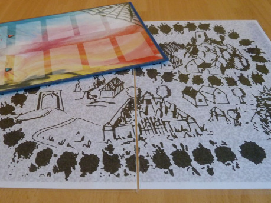
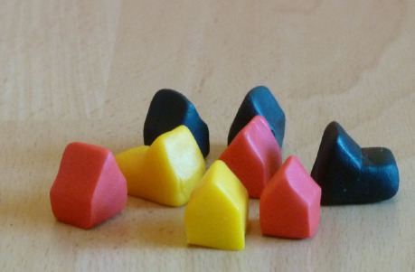
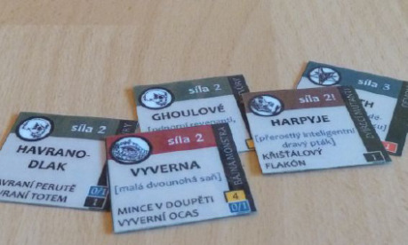
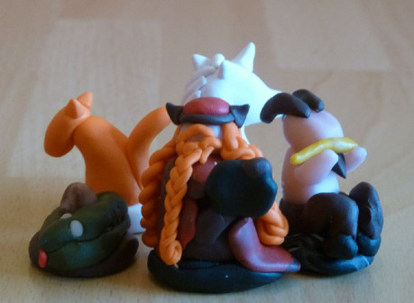
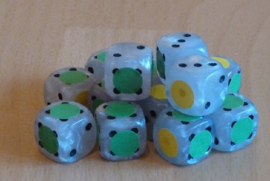
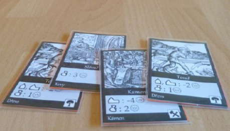
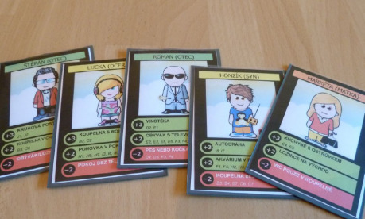
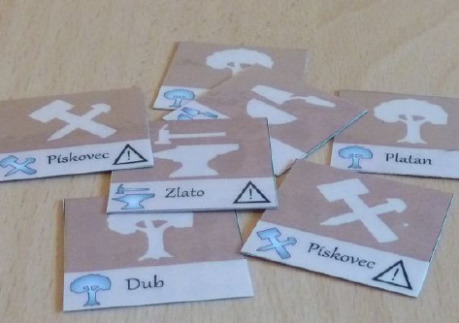
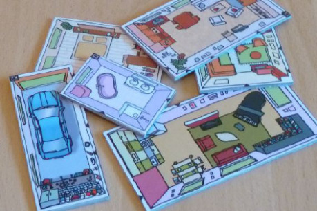

Dnes se seznámíte s technickými postupy, jak jednoduše a nepříliš draze vyrobit jednotlivé komponenty pro deskovku. Za dva měsíce se můžete těšit na rozbor možností, jak dodat prototypu požadovaný grafický vzhled.

Při výrobě prototypu musíme mít na paměti jedno slovo – odolnost. Při testování projde rukama mnoha hráčů, proto rovnou zapomeňte na papírky narychlo vystříhané z „áčtyřek“ do tiskárny (gramáž 80). To si můžete dovolit nejvýš u prvního draftu, který vám pomůže ujasnit si, jak budou komponenty vypadat, a pracovat s ním budete jen vy. Pro testování je třeba, aby hra něco vydržela. Pusťme se tedy do toho.

## Herní deska (board)

Navzdory tomu, že termín desková hra (Board game) je odvozen od desky hracího plánu, řadí se dnes mezi deskovky i hry bez plánu. Ale my hrací desku samozřejmě chceme, takže si ji vyrobíme.

Nejprve ze všeho je třeba zvážit velikost. Berte na vědomí, že oproti komerční podobě hry se může velikost plánu prototypu výrazně lišit na obě strany. Rozměry jsou totiž nejčastěji závislé na velikosti komponentů, které budete na desku pokládat. Pokud jde jen o kostičky či figurky, pak je situace většinou únosná. Ovšem zamýšlíte-li na herním plánu místo i pro různé kartičky a destičky (viz níže), pak možná budete překvapeni, jak moc velký budete herní plán (a tedy i hrací stůl) potřebovat. Pokud kvůli prototypu vyrábíte figurky z modelovací hmoty, pak budou nejspíš větší než ty průmyslově vyráběné, plastové. To má na rozměry hrací plochy zásadní vliv.

Na základě velikosti se rozhodnete, jakým způsobem bude hrací deska sestavena, aby se ve složeném stavu dala rozumně skladovat. Pokud si plán budete tisknout na domácí tiskárně, pak nejspíš budete chtít, aby se jeden jeho díl vešel na formát A4. Spojení desek v místech ohybu závisí na tom, jak je plán vyroben. Podívejme se na to tedy podrobně.

Nejjednodušší cestou, jak zaručit bytelnost a trvanlivost vytisknutého nebo namalovaného díla, je laminace. V každém copycentru vám to udělají na počkání (cena cca 20 Kč / A4). Laminovací fólie je při procesu nahřáta a celoplošně nalepena na papír z obou stran. Díky tomu si můžete dovolit zastřihnout okraje, aniž byste se museli obávat roztřepení. Pokud vás zajímá, zda ušetříte při domácí laminaci, tak počítejte s cenou jedné fólie (je to vlastně taková kapsa, do které se papír vkládá) asi 2 Kč, v závislosti na gramáži. Laminovačku pořídíte od čtyř stovek nahoru. Nezapomeňte započítat také energii.

Zalaminované papíry získají odolnost a potřebnou tuhost. Na stole se nekrabatí a nevadí jim, když je polijete pivem. Spojit je můžete jednoduše pásem izolepy. Ponechte mezi deskami mezeru asi 2 mm, aby se dal plán dobře složit, a spojení přelepte z obou stran.

Zdá se vám pouhý zalaminovaný papír jako příliš laciné řešení? Chcete, aby vaše herní deska opravdu byla deskou? Směle do toho. Budete potřebovat strojní lepenku, která se dá pořídit v obchodech, jako je třeba Svět papíru. Připravte se na cenu v řádech stokorun a velké rozměry, ze kterých pak budete své díly odřezávat. Strojní lepenka je složena z mnoha vrstev papíru lepených pod tlakem. Když s ní tedy budete zacházet hrubě, okraje se vám postupně mírně roztřepí. Ta obyčejná má šedou barvu recyklovaného papíru, ale prodávají se i bílé. Na herní plán si kupte tloušťku aspoň 2 mm, abyste zamezili budoucímu kroucení. Strojní lepenka se stane základem vaší desky. Poznámka: stejně dobře bude fungovat i mnohem dostupnější vlnitá lepenka, ale pouze do doby, než si někdo o herní plán opře loket.

Pokud máte herní plán složený z více dílů, pak je k sobě slepte hned v prvním kroku. Použijte klasickou kobercovku a lepte z obou stran. Mezeru nechte větší (až 5 mm), aby se vám v budoucnu podařilo plán složit. Pokud chcete, můžete kobercovkou objet i všechny hrany. Vytisknutý či namalovaný plán nalepte celoplošně na desku. Stačí použít běžné kancelářské lepidlo – svíčka. Tekuté lepidlo (Herkules) doporučuji použít jen v případě, že máte plán vytisknutý na kartonu (gramáž 160 a více). U měkkého papíru by mohly vzniknout bubliny.

Finální úprava desky spočívá v nalepení samolepkové fólie. Tu koupíte opět v copycentru, cena kolem 20 Kč / A4. Samolepková fólie je mnohem tužší než izolepa, takže se při lepení nemusíte bát vzniku bublin a faldů. Stačí postupovat od jednoho okraje a nalepenou fólii vyhlazovat rukou.

## Žetony a kostičky (tokens and cubes)

Pod výraz „žetony“ se toho schová mnoho. Dají se ovšem rozdělit na dvě skupiny podle toho, zda nesou jen jedinou informaci (barva nebo tvar), či kombinaci informací (barva, tvar, symbol, číslo). Podívejme se nejprve na ty jednoduché. Pokud vám jde jen o barvu, bohatě si vystačíte například s dřevěnými kostičkami, které si vypůjčíte z jiných her. Svůj účel splní i půlkulaté skleněné žetony, které se dají nakoupit například v řetězci Ikea nebo v herních obchodech (tam jsou podstatně dražší). Možná ale budete chtít, aby vaše žetony měly speciální tvar, například jako domečky. Pak nezbývá, než si je vyrobit doma. Pokud nevlastníte dřevoobráběcí nářadí a dostatek zkušeností, tak na dřevo raději zapomeňte. Mnohem jednodušší je potřebný tvar prostě vymodelovat.

Ve výtvarných obchodech jsou dostupné různé modelovací hmoty. Nejznámější modurit (vytvrzuje se vařením nebo pečením) je relativně levný, ovšem prodává se po velkých jednobarevných baleních. Podobně je na tom i na vzduchu tvrdnoucí varianta moduritu. Chcete-li různobarevné žetony, pak je pohodlnější nakoupit si větší počet menších balení, každé v jiné barvě. Tehdy přichází ke slovu produkty s názvy Fimo, Cernit, Proto, atd. Vyznačují se výraznými barvami, vyšší cenou (vzhledem k hmotnosti balení) a velmi snadnou zpracovatelností. Vytvrzují se krátkým pečením v troubě na vysokou teplotu. Počítejte s tím, že pokud zrovna nepoužijete nějakou sofistikovanou vykrajovací metodu, pak bude každý žeton trochu jiný a váš prototyp tak získá „punc domácí výroby“. _Poznámka: Mícháním barev nedojde k vzniku nové barvy, ale k žíhanému efektu._

Podívejme se teď na složitější žetony s více informacemi. I zde můžete vsadit na modelovací hmotu a do různobarevných válečků vyřezávat symboly apod. Možná bude ale jednodušší uchýlit se k méně pracné metodě vytisknout > zalaminovat > rozstříhat. Výhoda spočívá v automatizaci procesu. Při použití vhodného kreslicího softwaru budete mít desítky žetonů raz dva a největší práce bude se stříháním. Nebojte se roztřepení, laminace snese i ostré úhly a malé rozměry hran (pokud tedy nebudete používat žetony namísto trsátka). Jednodznačnou výhodou tisknutých a laminovaných žetonů je možnost dostat na omezenou plochu množství informací. Nevýhodou je jistá nešikovnost při jejich použití v praxi (sbírání z herního plánu).

## Figurky (pawns, characters)

Pobíhají-li ve vaší hře postavy, pak budete potřebovat figurky. Nejsnažší cesta je samozřejmě vypůjčit si figurky z jiných zdrojů. Nabízí se Člověče nezlob se, plastové či kovové figurky pro RPG, legoví panáčci a spousta dalších možností. Záleží na tom, jaký účel mají plnit. Jak ale vyrobit figurky vlastní?

Disponujete-li takovou fantazií a manuální zručností, jako moje manželka, nebojte se pustit se do výroby z modelovací hmoty. Výsledek bude fantastický (viz foto). Nezapomeňte ovšem, že modelovací hmota při pečení nejprve změkne, proto tvary nesmí být příliš subtilní. Opačnou možností je opět tisk a laminace. Zalaminované figurky vystříháte a vložíte do malých plastových stojánků, které seženete v každém herním obchodě. U této varianty nejspíš budete chtít, aby figurky byly oboustranné. Budete-li tisknout v copycentru, raději obsluhu instruujte, aby ohlídala správnou orientaci stran při tisku. Na domácí tiskárně si to ohlídejte sami. Mějte na paměti, že při oboustranném tisku může dojít ke vzájemnému posunu stran v řádu milimetrů. Proto si alespoň na jedné straně ponechte mezi jednotlivými obrázky rezervu.

## Kostky (dice)

Pokud chcete mít perfektně vyvážené a pravidelné kostky, pak je nevyrábějte na koleně. Investice do kostek z obchodu se rozhodně vyplatí. Malý zádrhel přichází ve chvíli, kdy místo bodové hodnoty chcete mít na kostkách vlastní symboly. Existují výrobci, kteří vám udělají kostky s libovolnou symbolikou na zakázku. Tomu ovšem odpovídá i cena, takže toto řešení odpadá u stále se vyvíjejícího prototypu.

Jak to tedy udělat snadno a levně, abyste nemuseli čmárat na kostky lihovým fixem? V běžném papírnictví seženete samolepicí označovací kolečka v různých velikostech. Stačí pořídit jeden aršík, na kolečka nakreslit požadované znaky a kostky jimi polepit. Není to zrovna vrchol estetiky, ale svůj účel to splní. Použijte raději hladké plastové kostky, než dřevěné lakované. Při odstraňování samolepek byste mohli lak poškodit.

## Karty (cards)

Mnoho deskovek používá karty různých velikostí. V tomto případě máme na mysli ohebné papírové či plastové karty, které musí snést dlouhý pobyt v rukou hráčů, míchání, třídění a další běžné úkony. Karty patří, možná překvapivě, mezi nejdražší komponenty v deskovce. Je to proto, že odolná povrchová úprava a kvalitní tisk něco stojí. U sběratelských karetních her, kde je zátěž ještě větší, je běžnou praxí karty chránit pomocí obalů. Tento princip můžeme využít i u prototypu, u něhož se nám o nějakém kvalitním tisku může jen zdát. Obaly se vyrábějí v různých velikostech, ty nejlevnější (100 ks za 15 až 20 Kč) seženete v rozměrech 66,5 × 93 mm, 63,5 × 88 mm a podobně. Malé obaly, například European mini (44 × 68 mm), vyjdou výrazně dráž (50 ks za 50 Kč). Při návrhu kartiček tedy podřiďte jejich velikost rozměrům dostupných obalů.

Karta o síle jedné čtvrtky (160–250 g/m2) je v ruce cítit jako „měkká“, i když je zasunuta do obalu a někdy též může přinést problém s průsvitností. Proto je lepší použít vsunout do obalu papíry dva, jeden jako líc a druhý jako rub. Pokud jejich velikost bude odpovídat obalu, zamezí se jejich posouvání, takže nebude třeba je k sobě lepit (tím by stejně vznikly faldy a kroucení). Pro ruby karet často stačí jednoduché rozlišení (barva). V takovém případě je možné nastříhat je z barevných kartonů (k zakoupení v copycentrech kusově), což vyjde levněji a méně pracně, než barevný tisk na čtvrtku.

Výhodou karet vyrobených obalovací metodou je také to, že je během procesu vývoje hry můžete snadno obměňovat, a obaly vám zůstávají. Někdy se ovšem může stát, že budete potřebovat přesné rozměry karet, a žádné obaly vám nevyhoví (nezapomeňte ale, že obaly můžete i stříhat). Pak je možné použít již zmíněnou metodu laminace. Jen připomínám, že u zalaminovaného a následně rozstříhaného papíru není třeba obávat se roztřepení rohů – laminace funguje celoplošně. Nevýhodou laminovaných kartiček jsou kromě vyšší ceny i špičaté rohy a ostřejší hrany.

## Destičky (tiles)

Na rozdíl od karet se destičky (dílky, dlaždice...) používají zpravidla k sestavování obrazců, vzorů či struktur na herním plánu (nebo rovnou na stoje), případně k označování míst na herním plánu a podobně. Z toho důvodu není vhodné volit obalovou metodu (dílky by k sobě nepřiléhaly). Kromě obligátní laminace se nabízí využití již zmíněné kombinace strojní lepenka – papír s potiskem – samolepková fólie. Řezání strojní lepenky je ovšem poměrně náročné, proto u destiček dejte přednost menší tloušťce (1 mm). Naopak velmi snadné na řezání jsou KAPA desky, které se rovněž prodávají po velkých formátech ve specializovaných obchodech. Jedná se o sendvičovou strukturu – jádro tvoří pěněný polyuretan, vnější plášť chromokartonová fólie. KAPA desky jsou velmi lehké a nesnesou větší tlak, proto se nehodí k výrobě hracího plánu. Pro různé dílky a destičky ale poslouží dobře. Řezání se provádí vysunovacím dílenským řezákem, proto se při navrhování destiček raději vyhněte kulatým tvarům, které se vyřezávají opravdu špatně.

Věřím, že se vám můj stručný přehled výrobních postupů líbil. Jsem si jistý, že existuje mnoho dalších zajímavých možností, které jsem v článku nezmínil. Pokud o některých z nich víte a vyzkoušeli jste je, neváhejte a podělte se o ně v diskuzi věnované tomuto vydání Drakkaru.
