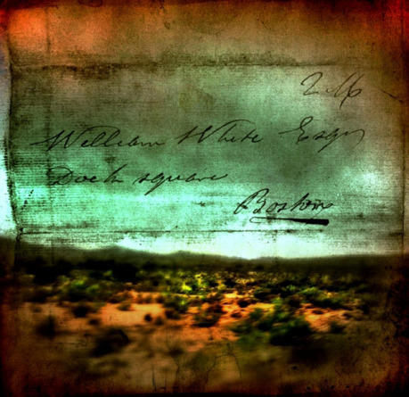
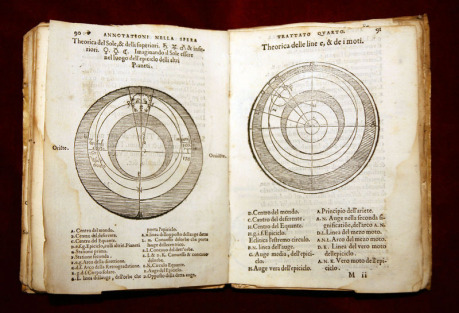
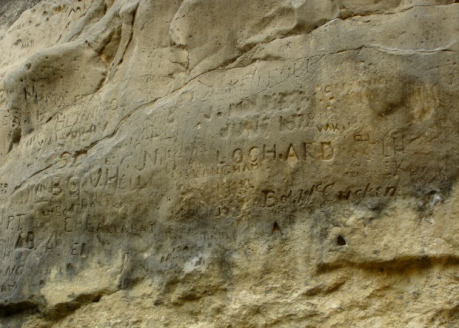
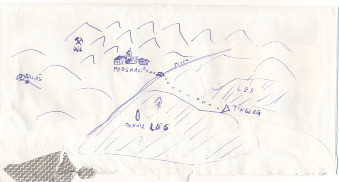
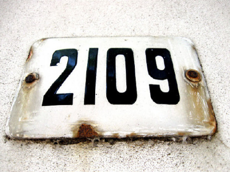

Jak bude výstavba světa pokračovat, bude nevyhnutelně přibývat materiálu a dříve či později bude těžké, nebo dokonce nemožné to všechno udržet v hlavě. S tím mohou vzniknout nepříjemnosti jako nekonzistence, rozpory ve vnitřní logice a další problémy a nesoulady, kterým je velmi těžké se u větších projektů vyhnout. Přesto bychom se o to měli pokusit, a pokud se nám nepodaří, tyto nešvary zcela vymýtit (což se nejspíš nepodaří – jen žádný stres), pak je alespoň co nejvíce minimalizujeme.

## Ptejte se včas

Jedním ze základních témat Stopařova průvodce po Galaxii je otázka života, vesmíru a vůbec. Odpověď na tuto otázku už dávno vypočítal superpočítač Hlubina myšlení a ta odpověď je 42. Proč 42? Těžko říct, ta odpověď je ale určitě správná. Háček je v tom, že nevíme, jak vlastně zní otázka života, vesmíru a vůbec.

Ve škole nás naučili, že musíme znát odpovědi. Při zkoušení nebo písemce jsme tázáni a musíme včas a správně odpovědět, abychom nebyli potrestáni špatnou známkou. Musíme tedy znát, umět rychle nalézt nebo uhádnout odpověď, kterou bude nám nadřazená osoba, čili učitel, považovat za správnou. A nedej bože, pokud byste této osobě kladli nějaké „hloupé“ otázky.

Jenže v životě (a při jakékoliv tvůrčí činnosti zvlášť) se nás ne vždy někdo ptá, málokdy existuje jedna správná odpověď a ne vždy je odpověď uznávaná nějakou autoritou ta správná. Otázky jsou důležité, a dost možná důležitější než odpovědi. Otázky podporují zvědavost, a tak i tvůrčí myšlení. Na každou otázku je řada (správných) odpovědí, ke kterým se můžete dopracovat jen tím, že se budete ptát.

Základem _zenu_ jsou koány, někdy zdánlivě nelogické otázky či hádanky, jejichž rozlousknutí brání právě naše snaha najít odpověď. Například „Co je jídlo bez potravy?“ nebo „Jak zní tlesknutí jedné ruky?“ Smyslem těchto otázek není najít odpověď, ale pochopit moudro, které se v nich skrývá... a které si musí každý najít sám. Ačkoliv se nemusíte stát zenovým mistrem, abyste mohli tvořit fiktivní světy, je cvičení s koány dobrý způsob, jak se oprostit od tradičního „školského“ uvažování, které je často vážnou překážkou v kreativitě.

Řekněme například, že jsme si vymysleli město v oblacích. Jaké otázky vás napadnou, když si takové město představíte? No tak, zkuste to! Ptejte se! Kde se tu vzalo? Proč nespadne dolů? Jak je to možné? Kdo tam žije? Kdo by tam chtěl žít? Proč? Kde berou jídlo a vodu? Kam házejí smetí? Co jeho obyvatelé dělají? A žije tam vůbec někdo? Bude shora vidět na zem, nebo budou výhled zakrývat mraky? Nemůže se převrhnout, když začne foukat silný vítr? Jsou tu další taková města? Jsou spolu v kontaktu? Jak? Co si asi myslí o zemi pod sebou?

Je moře otázek a ne každá musí mít odpověď. Stačí, že se nad nimi zamyslíte, nemusíte hned vysypat z rukávu řešení. Chcete přece tvořit, ne si opravit známku z písemky. Otázky vám v první řadě umožní podívat se na věc z jiných úhlů, než na ni nahlížíte jindy, a to samo o sobě stačí. Nemusíte na všechny odpovídat. Odpovídejte si jen na ty zajímavé otázky a nebojte se dál hledat otázky plynoucí z odpovědi. Znovu – otázka nepotřebuje odpověď k tomu, aby vám něco řekla. Samotné uvažování o otázce vás může posunout dál než nalezení odpovědi.

Třeba kde bere to oblačné město vodu? Může mít dokonalou recyklaci. Nebo se sem tam zastavit nad jezerem a napumpovat pár set kubíků do rezervoárů. Nebo mohou být na střechách domů konstrukce, na kterých bude kondenzovat voda a stékat do cisteren. Ale co kdyby se nad městem prohnal nějaký jedovatý oblak a zamořil zásoby vody? Co by se pak muselo udělat, aby město nevymřelo žízní? Dalo by se vůbec něco dělat?

Takhle se můžeme celkem bezbolestně propracovat k dlouhé řadě možných řešení a různým náhledům na věc. Otázky nám totiž nenabízejí jen řešení, ale také jiné úhly pohledu. Toho můžete využít nejen při samotném vymýšlení, ale především u vlastního hodnocení toho, co jste doposud vytvořili.

Vždy když dokončíte nějaký větší krok v tvorbě světa, proberte si to, co už máte, než se pustíte do další tvorby, a ptejte se. Dává tohle smysl? Nešlo by to ještě nějak jinak? Nebylo by to zajímavější tak či tak? Když teď udělám to, co jsem si naplánoval, nezazdím tím tady tu věc, co už jsem vymyslel před měsícem? Bude lepší jedno nebo druhé vypustit, sloučit to dohromady, nebo by bylo zajímavější ty dvě věci něčím odlišit? Není tenhle hrdina až moc hrdinský? Nebylo by zajímavější, kdyby měl takovou nebo makovou slabůstku? Nebo pořádného kostlivce ve skříni? A i když jsou všechny tyhle věci zajímavé, půjdou nějak rozumně využít? Nebude to jenom vata?

Je dobré si projít předchozí tvorbu následující den (týden, měsíc...), pokusit se najít slabá místa a díry v logice a ty opravit. Stejně tak je dobré si po určitých etapách projít všechno, co doposud máte, a přezkoumat, jestli je to tak dobré, jak se vám zdálo, nebo jestli se vám mezi tím svět neposunul docela jinam (a jestli by nebylo lepší staré věci upravit nebo odstranit, či se naopak vrátit do starých kolejí a upravit ty novoty).

Při tomto rozjímání se řiďte následujícím pravidlem:

## Buďte k sobě drsně upřímní

Ano, ten svět je váš, udělali jste ho od prvního do posledního písmenka, snažili jste se a vůbec jste dělali vše pro to, aby byl výsledek co nejlepší. Máte svůj výtvor rádi a jste na něj hrdí. To je dobře, ale pokud chcete, aby byl váš výtvor _opravdu_ dobrý, potřebujete odhalit jeho slabé stránky a ty přes růžové brýle jen těžko uvidíte.

Dejte si třeba pár dní pauzu. Představte si, že s tím nemáte vůbec nic společného. Že vás to třeba ani moc nezajímá. Zkrátka si udělejte co největší odstup a pak zkuste to „cizí dílo co vás moc nezajímá“ zhodnotit. Co je na něm dobré? („Všechno“ není odpověď.) Které části jsou nejslabší? („Žádné“ taky není odpověď.) Dostávám dost zajímavých informací, nebo musím přelouskat pět stránek než narazím na něco, co stojí za přečtení? Upřímné odpovědi na takovéto otázky jsou první linií, která vám pomůže najít slabiny a udělat váš výtvor lepším.

Nakonec buďte ještě drsnější. Zkuste své vlastní dílo vykoupat ve zdrcující kritice. Hledejte věci, po kterých by se mohl kdejaký šťoura vozit – a vozte se. Ideálně si někam poznamenejte, na čem se dá vozit a proč. Pak zkuste vymyslet, jak se těchto slabostí zbavit. Nezakrývejte tyto třecí plochy za každou cenu – nechystáte právní obhajobu – jen se pokuste zamyslet, jestli by se to nedalo udělat nějak méně choulostivě. Když ne, tak ne – nemá cenu si kvůli úlitbě potenciální kritice rozbít něco, co dobře funguje.

Tato samokritika, pokud budete dostatečně drsní, vám pomůže i vyrovnat se lépe s kritikou, která se na vaše dílo snese poté, co jej vypustíte do světa. I kdyby to bylo zlaté, vždycky se najde někdo, kdo vám to otluče o hlavu. Takhle na to budete alespoň trochu psychicky připraveni.

## Nebojte se prořezávat

Stejně jako nebude dobře růst příliš hustý les, nebude dobře růst ani váš svět, když ho příliš zahustíte. Když tvoříte, tak nevyhnutelně zahušťujete. Přidáváte další a další prvky, vazby a témata. Jenže když je toho moc, bude se to rušit (o tom jsme si nakonec říkali minule).

Čas od času proberte, co máte, hledejte věci, které by tam nutně být nemusely, a poznamenejte si je. Následně se podívejte, co na nich závisí, jestli je ta závislost významná a jestli by je nemohlo nahradit něco jiného. Když zjistíte, že na té ne až tak významné věci vlastně nic nevisí nebo že její roli může klidně zastat něco jiného, vůbec se nerozpakujte a odstraňte ji. Je jen na vás, jestli skončí v šuplíku nebo v propadlišti dějin, ale pokud vašemu dostatečně světu neprospívá, musíte ji odstranit, aby měly jiné, prospěšnější, prvky prostor k tomu se patřičně projevit.

Obzvlášť záležet si dejte při hledání duplicit a skoro duplicit. Pokud máte ve svém světě dvě nebo víc stejných, nebo velmi podobných věcí, je to problém. Příliš podobné věci se vzájemně pletou, a pokud je podobností moc, působí vaše dílo odfláknutě a budete obviňováni z nedostatku invence. Nešlo by je sjednotit do jedné, nebo naopak víc vzájemně odlišit?

Zejména ve fázi, kdy přecházíte od konceptu k prototypu (tj. dáváte svému dílu takovou formu, aby se v něm vyznal i někdo jiný než jen vy). Později je třeba zaměřit se i na rozsah, který jednotlivým prvkům věnujete. Pokud budete mít stránku o rostlinách, stránku o zvířatech, stránku o počasí a pět stránek o zbraních a chcete řešit dopady pytláctví v rezervaci, pak by bylo na místě část o zbraních výrazně zeštíhlit. Vypusťte podrobnosti, zobecňujte, vyhazujte zbytečnosti.

## Stavte na logice

Váš svět nemusí být reálný. Nemusí být ani realistický a může být dokonce velmi abstraktní a naprosto odlišný od skutečného světa. Jakkoliv může být váš svět odlišný od skutečného světa, musí mít svoji vnitřní logiku a tato logika musí být patrná a srozumitelná, pokud má váš svět pochopit někdo jiný než jen vy. Do značné míry to vyplývá i ze souvislostí, které mezi jednotlivými prvky světa jsou (a o kterých jsme si říkali v prvním dílu).

Hlavní ale je, že když budete mít jasno ve vnitřní logice, bude poměrně snadné vyhnout se rozporům a nekonzistentnosti. To je důležité zejména u všeléků jako je magie nebo supermoderní technologie. Když si jen vymyslíte nové kouzlo nebo supertechnologii na řešení té které situace bez toho, abyste si ujasnili, jak to vlastně funguje (puf – kouzlo!), zaděláváte si na značné problémy s konzistencí.

Kdo by stavěl hradby, když si na každém tržišti můžete pořídit létající koberec a přeletět je? Proč by měla existovat auta a lodě, když jsou běžně rozšířená antigravitační vznášedla? K čemu jakýkoliv dopravní prostředek, když máme kapesní teleportér? To jsou otázky, na které je třeba myslet, než takové exotické věci do svého světa přidáte. Přemýšlejte o dopadech, jaké budou mít na fungování světa, aby nenarušily jeho logiku.

Ačkoliv by se mohlo zdát nejsnazší použít zákonitosti platící ve skutečném světě, není tomu vždy tak. Lidé mají rozdílný pohled na svět, různé vzdělání a přesvědčení. Někdo je přesvědčený, že člověk pochází z opů, jiný, že ho stvořil bůh, a další zas ví, že muži pocházejí z Marsu a ženy z Venuše. Někdo si pod pojmem _primátor_ představí pána v saku, jiný zase sýr. Když na to přijde, lidé mají různé představy i o elementární fyzice. Dokonce se najde i dost lidí, co si myslí, že se Slunce otáčí kolem Země.

I když se budete držet jen faktů (třeba že těleso ponořené do kapaliny je nadlehčováno silou...), řada lidí bude mít o těch faktech jinou představu – jakkoliv může být mylná. Dokonce i vaše představa může být mylná. Přijde vám jako hloupost dělat loď třeba... z betonu? Takové lodě ale skutečně existují – a plavou.

Tímto elaborátem o rozdílných pohledech na svět vás v žádném případě nechci odradit od využití skutečných zákonitostí ve svém světě. Naopak. Pouze upozorňuji na to, že je v takovém případě důležité dát si pozor na to, abyste opravdu pracovali se skutečnými zákonitostmi (a neměli třeba perpetuum mobile, zvuk se nešířil vesmírným vzduchoprázdnem, nebo aby kilo železa nebylo těžší, než kilo peří), ověřili si, že to, jak si myslíte, že to je, tak skutečně je (nikdo neví všechno, každý se v něčem mýlí a fungování světa je něco tak složitého, že se v něčem musí mýlit každý), a nakonec, i když vám některé věci přijdou jasné a samozřejmé, nastiňte jejich fungování, když to bude třeba. Nespoléhejte se, že to vaši hráči nebo čtenáři budou samozřejmě vědět.

Pokud vytváříte vlastní zákonitosti a s tím související logiku, je třeba to dělat s rozmyslem, uvažovat o všech možných důsledcích a hlavně být v těchto zákonitostech konzitentní. Když něco funguje tak a tak, musí to tak fungovat vždy. Abyste na to nezapoměli, je dobré si to zapsat. Nejlépe jako jednoduchou pravdu.

## Zapisujte si jednoduché pravdy

Jakkoliv může být v životě sledování jednoduchých pravd zhoubné a zavádějící, při tvorbě světa jsou jednoduché pravdy nedocenitelnou pomůckou. Vezměte nějaký významný prvek vašeho světa (místo, osobu, zvíře, technologii nebo cokoliv jiného, co je ve vašem světě důležité) a zapište si všechny důležité vlastnosti tak, jak ve skutečnosti jsou, bez zbytečné omáčky a jakýchkoliv spekulací nebo otevřených konců – zkrátka jen jednoduché pravdy. Jde o to, mít jednoduchý a jasný popis té které věci na jednom místě, abyste se mohli kdykoliv podívat, jak to vlastně je.

Způsobů, jak si takový záznam vést, je nespočet a každému bude vyhovovat něco jiného. Můžete si jednoduché pravdy zapisovat do sešitu, na samostatné listy tvrdého papíru (vydrží daleko déle), do jednoho nebo více textových souborů, nebo můžete použít třeba software na správu kartotéky, pokud vám to vyhovuje. Jediná kritéria jsou, aby zaznamenávání bylo co nejjednodušší (když ne, nebude se vám chtít si pravdy zapisovat), stejně tak hledání (když ne, nebude se vám chtít hledat), a aby se vám záznamy nepoztrácely.

Pro lepší orientaci je dobré psát co nejjednodušší a nejjednoznačnější věty a jednotlivé tématické části členit do odstavců (i kdyby měl mít odstavec jen jednu větu). Například:

### Londýn

> Hlavní město Velké Británie a je to jedno z největších měst na světě.
>
> Leží na řece Temži a má propracovaný systém protipovodňových zábran.
>
> Londýnské metro je nejstarší na světě, má 12 linek a je klíčovým prvkem hromadné dopravy.

O Londýně by se toho dalo jistě napsat víc, a pokud by byl Londýn důležitou součástí vašeho světa, jistě by byl popis delší, pro ukázku však tyto tři věty stačí. V malém množství textu máme obsaženo velké množství informací. Nic z toho nejsou spekulace (povodňové bariéry dokáží zastavit běžné povodně, ale co kdyby přišla tsunami?), pověry (říká se, že pod Big Benem je templářský chrán), něčí názory (Londýn je nejkrásnější město na světě), nebo otevřené konce (jednoho dne radikálové povraždí polovinu královské rodiny).

Jakkoliv mohou být spekulace, pověry, názory nebo otevřené konce zajímavé a výživné (a při vytváření světa je dobré dost takových věcí vytvořit), v jednoduchých pravdách nemají místo. Všechny tyto věci jsou příliš nejasné a mohou, ale nemusejí být pravdivé – a proto nemají v jednoduchých pravdách co dělat.

Pokud ovšem víte, že je ve vašem světě pod Big Benem templářský chrám, nebo že radikálové povraždí polovinu královské rodiny, už to není pověra ani otevřený konec, ale záměr, a tím pádem to také bude pravda. Pravda, kterou je třeba zaznamenat, aby tomu tak v budoucnu zůstalo.

Při práci s jednoduchými pravdami je třeba pamatovat na jednu důležitou věc – je to záznam skutečného stavu věcí určený pro vaši potřebu. Vašim čtenářům nebo hráčům je můžete jakkoliv skrývat nebo vydávat za pověry či spekulace. Můžete je nechat tápat, ale sami byste měli mít jasno (alespoň u důležitých věcí), aby se vám nestalo, že jednou popíšete templářský chrám pod Big Benem a za rok budete tvrdit, že je to jen pověra a pod Big Benem nic není (protože jste to za tu dobu zapoměli).

Smyslem zápisu jednoduchých pravd je mít jednoduchou pomůcku pro udržení konzistence. To, co si jednou zapíšete jako pravdu, už byste neměli nikdy porušit. Tak to prostě ve vašem světě je, a pokud to má být jinak, musí nastat něco, co to změní (a mělo by to být u dané věci poznamenáno).

## Co takhle časovou osu?

Řada lidí začíná tvorbu světa nějakou časovou osou. Na počátku nebylo nic, to nic explodovalo a vznikl vesmír. Za milion let se udělaly planety, za další milion let se na nich vylíhli dinosauři a o další milion let později je sežrali mamuti, pak přišel pračlověk a tak dále a tak dále. Začít časovou osou není nejlepší nápad (jak jsme si konečně říkali už v prvním díle), dokonce ani není dobré mít na časové ose usazené vše, nebo (nedej bože) používat časovou osu pokaždé.

Časovou osu je možné využít jako lehký úvod do prostředí. V takovém případě by měla obsahovat jen nejklíčovější (a hlavně nejzajímavější) události a neměla by být moc dlouhá. Rozhodně by neměla začínat stvořením světa (nebo něčím podobně vzdáleným), ale nejdříve první důležitou událostí, která vedla k současné situaci, do které chcete čtenáře či hráče uvést. A neměla by být moc dlouhá, aby je to příliš neutahalo.

Časová osa ale může sloužit i jako pomůcka při tvorbě světa. Pokud máte dáno (například), že parní stroj byl vynalezen roku 1765, stirlignův motor roku 1816 a vznětový motor roku 1893, pak se vám bude časová osa hodit, aby třeba někdo necestoval napříč kontinentem na voze s naftovým motorem pět let před tím, než byl vynalezen. Jediným pohledem na časovou osu tak můžete zjistit, jestli už ta která technologie byla vynalezena a můžete ji použít.

Způsobů, jak si časovou osu udělat, je celá řada a každému bude vyhovovat trochu jiný způsob. Je ale důležité, aby se do osy dalo snadno přidávat, odebírat, nebo i posouvat jednotlivé události. K tomu účelu je nejlepší udělat si časovou osu v digitální podobě. Například jako tabulku v excelu, kde sloupce označují roky (měsíce, dny nebo století – v závislosti na rozsahu a podrobnosti) a řádky události. Pak stačí si jen jednotlivé řádky vybarvit podle potřeby. Třeba když 2. světová válka trvala od roku 1938 do roku 1945, tak v řádku „2. světová válka“ vybarvíme sloupce 1938 až 1945.

Pokud záleží na přesných datech nebo sledu a překrývání událostí může se stát časová osa nedocenitelnou pomůckou. Avšak když už nějakou časovou osu máte, neznamená to, že byste ji měli někomu dalšímu (mimo tým, pokud pracujete v týmu) ukazovat. V první řadě to bude pro většinu lidí těžko stravitelný knedlík, v druhé řadě se z toho může v rukou těch ostatních, kteří to strávit zvládnou, stát pořádný bič na případné nekonzistence, co jste ve svém světě vytvořili.

## Mapy

Navzdory všeobecnému přesvědčení, k vytvoření světa nepotřebujete kreslit jeho mapu. Už v prvním díle jsme si říkali, že je dobré vyhnout se kreslení map a hlavně vyplňování bílých míst vším možným, jen aby tam nebyla bílá místa. To ale neznamená, že vám mapa při uspořádání jednotlivých prvků nemůže pomoct. Pokud závisí na umístění nějakých věcí, není lepší způsob jak to znázornit, než pomocí mapy.

Taková mapa nemusí být hezká, nemusí být ani moc přesná a hlavně by neměla obsahovat víc, než je nezbytně nutné. Nikdo podle toho nepoběží orientační běh, nebude plánovat dálnici, ani si to nebude věšet na zeď (tedy většinou). Je to pouze pomůcka, která vám má pomoci s uspořádáním, kde co je, nic víc. Proto se s ní také nemusíte příliš párat.

Na přiloženém obrázku je jedna moje mapka. V městečku Podskalí a v jeho okolí se dějí podivné věci. Šeptá se o čarodějnicích, rodí se znetvořený dobytek, v lese se ztrácejí lidé a v nedalekých železných dolech se ozývá tak strašlivé kvílení, že se horníci bojí na šachtu. To je problém, protože tím se zastavila těžba železa a pánové z Tinburgu musejí poslat někoho, kdo se podívá celé věci na kloub.

Tato paranormálně-detektnivní zápletka ke svému rozpletení vyžaduje i jasné povědomí o tom, kde co je, a tedy i kdo mohl nebo nemohl být na inkriminovaných místech, když se něco dělo. Pro představu není nic jednoduššího, než si nakreslit mapu.

Jak vidíte, moje mapka není žádné umělecké dílo, je sfouknutá asi za 5 minut, je na druhé straně použité obálky, a že by vzdálenosti mezi objekty na mapě přesně odpovídaly skutečnosti, to se také říct nedá. Přesto ale dostačuje, protože obsahuje vše podstatné a dává nám představu o kompozici.

Máme tu důl, salaš, kde jsou problémy s dobytkem, menhir v lese za potokem i jediný most na cestě mezi Podskalím a Tinburgem. Vidíme, že od dolu je to zhruba stejně daleko do města jako na salaš, k menhiru se dá suchou nohou dostat jen přes most, a to rozhodně není vše, co se z rozložení objektů na mapě dá dedukovat. Současně si všimněte, že na mapě není nic víc než místo, kde se to celé odehrává. Tinburg, který tu hraje jistou vedlejší roli, leží někde na jihovýchod, což naznačuje šipka – jediný odkaz na okolní svět.

Mapy mohou být samozřejmě i daleko hrubší, než je tento příklad. Mohou jen (velmi vágně) znázorňovat hranice, aby bylo vidět kdo s kým sousedí (a na samotném tvaru hranic nakonec tak nezáleží).

Hlavní výhoda map je, že vám pomohou udržet konzistentní představu o tom, kde co je, podobně jako vám jednoduché pravdy pomohou udržet představu, jak se věci mají, nebo časová osa, kdy se co stalo. Nestane se vám tak, že byste třeba umístili menhir do lesa jednou na jižní a jednou na severní straně cesty do Tinburgu, nebo že by se vám nečekaně změnil tok potoka, nebo že by spolu sousedily pokaždé docela jiné jiné státy.

Své pracovní mapy nedělejte příliš propracované. Nemá to být umělecké dílo. Ani to nemá být hezké. Mapa vám má pouze dát představu o tom, kde co je – a krom toho ji budete dost možná ještě pětkrát předělávat.

## Lokalizace bez mapy

Ne vždy je vhodné vše zakreslovat do mapy – zanášet do mapy každý kurník může být dost vyčerpávající. Někdy dokonce ani není možné něco uspokojivě zmapovat. Například taková mapa pro mezihvězdné cestování je slušný oříšek. Hvězdy totiž, narozdíl od objektů na povrchu země, nejsou v jedné rovině a odpovídající mapa by musela být třírozměrná a ačkoliv to není nemožné, je to přinejmenším komplikované.

Ve většině případů ale nepotřebujeme úplně přesně vědět, kde co je, a stačí nám pouze přibližně vědět, kde hledat. Například když budeme mluvit o vykotlaném dubu na kopci za městem, je to celkem přesné určení místa, aniž bychom potřebovali vědět, na kterém kopci, kterým směrem a v jaké vzdálenosti se ten vykotlaný dub nachází – kolem města jich jistě víc nebude. Mapu dále nepotřebujeme, pokud má místo nějakou adresu. Víme, že Sherlock Holmes bydlí na Baker Street 221B a nepotřebujeme k tomu mapu Londýna.

V případě hvězd nám bude většinou stačit ještě méně – třeba vzájemná vzdálenost, nebo jen vzdálenost od Slunce. Ve větším měřítku můžeme jako „adresu“ použít název galaktického ramene, ve kterém se hvězda nachází, nebo použít nějaké jiné dělení (kvadranty a podobně).

Ne vždy záleží na přesné pozici toho nebo onoho, ale je potřeba nějakým způsobem určit, kde to je (například Příšera, která žila v ledničce za majonézou, vedle kečupu a vlevo od zelného salátu – ale většinou vystačíte i se stručnější adresou). Jakmile něčemu dáte nějakou adresu, neměla by se už měnit (aby z toho zas nevznikla nějaká nekonzistence), a tak nic nezkazíte, když si adresu připíšete k jednoduchým pravdám.

## Závěrem

Dnes jsme si tu nastínili pár technik, s jejichž pomocí se dá udržet konzistence. Určitě je nevyužijete vždy všechny. Často nebudete potřebovat dost možná ani jednu z nich. Přesto vám pomohou v mnoha případech nejen zabránit zbytečným chybám, nelogičnostem a nekonzistencím, ale také pomohou lépe si uspořádat vlastní představu o světě.

Nakonec ještě zdůrazním, že podobných přístupů a technik je daleko víc (můžete je najít například v publikacích zabývajících se organizací času a osobním rozvojem), a protože každý člověk funguje a myslí trochu jinak, tak každému funguje ta která technika lépe či hůře (to už se však v publikacích většinou nedočtete). Nemá smysl se snažit vměstnat do nějaké techniky, když vám práci neulehčí, ale zkomplikuje. Pokud vám to nepomáhá, zkuste něco jiného, nebo hledejte vlastní způsoby, jak si ve své tvorbě udržet přehled.

Jak jsme si řekli už na začátku, tyto techniky nejsou samospásné a pouze pomáhají udržovat hladinu nekonzistence na minimální úrovni. Pokud je vaše dílo dostatečně velké, vždycky se něco najde (pokud se najde někdo, kdo bude pořádně hledat).

Nejlepší způsob, jak odhlait nějaké nedostatky, je nechat někoho jiného, aby si to prošel, rozebral a zkritizoval nám to. Ne vždy máme někoho k tomu ochotného po ruce (málokdo má čas a náladu se prokousávat něčím elaborátem), ale žijeme v době internetu, a tak není nic snažšího, než svůj výtvor předhodit někde, kde se vyskytují lidé, které by mohl zajímat, a počkat si na jejich reakce a s těmi potom pracovat. Jenže to není tak snadné, jak by se mohlo na první pohled zdát. Reakce nejsou vždy jásavé, dokonce ani kladné, co hůř, kritika není vždy věcná a navrch často vychází jen z toho, že kritik nepochopil, co se snažíte říci.

O tom, jak se z takové kritiky nejen nezbláznit, ale náležitě ji zužitkovat bude následující díl našeho světotvorného seriálu. Protože kritika je nejen cenným vodítkem pro další tvorbu, ale ať chcete nebo ne, tak pokud nebudete jen vystýlat šuplík, tak se nějaké šťavnaté zdrcující kritice nevyhnete. A chcete-li v tvorbě pokračovat, je nutné naučit se s ní vyrovnat.
