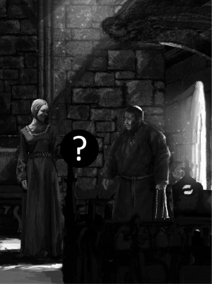

Jak už jste možná zaslechli, nakladatelství Altar chystá ve spolupráci s tvůrčím týmem Dračího doupěte II vydání rozšiřující knihy s podtitulem _Hry mocných_. Příručka se objeví na pultech obchodů v prosinci, aby si ji zájemci mohli nadělit pod stromeček.

Hry mocných se soustředí na příběhy kolem velmi mocných postav – králů, vojevůdců, arcimágů, velekněží, prostě všech, kteří mají zásadní vliv na běh dějin. Vychází vstříc hráčům, jejichž hrdinové stoupají na vrchol společenské hierarchie, aby si zde vydobyli místo na slunci.

Čtenáři v knize najdou deset nových mistrovských povolání, pravidla pro mocenské organizace, vedení velkolepých konfliktů s účastí početných armád a především spoustu inspiračního materiálu pro své hry. Chybět nebude ani bestiář, pravidla pro tvorbu artefaktů či praktická doporučení pro intrikánskou hru.

Těšit se můžete na ilustrace Jana „Merlkira“ Pospíšila (základní příručka) a Ondřeje „Rimba“ Hanzlíka (bestiář). Jednu z ilustrací vám přinášíme už nyní společně se soutěží, v níž máte možnost vyhrát výtisk DrDII: Hry mocných zdarma.

Pravidelné informace a ukázky z knihy najdete na webu [drd2.cz ](http://drd2.cz)a v [oficiální diskuzi](http://rpgforum.cz/forum/viewtopic.php%3Ff%3D262%26t%3D10707) k DrDII na stránkách RPG Fóra, kde se s vámi rádi setkáme. Věříme, že příručka splní očekávání fanoušků Dračího doupěte, a doufáme, že najde své místo i v knihovnách hráčů jiných systémů, kteří ocení její inspirační potenciál.

Za tým DrDII

Petr „ilgir“ Chval
