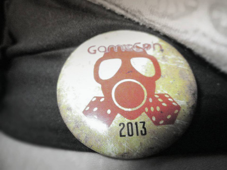
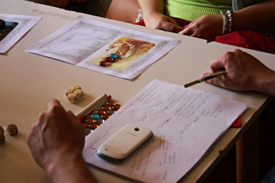
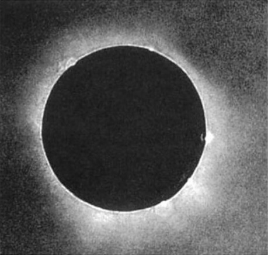
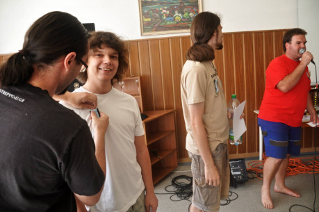

> Hluboko pod ulicemi Londýna, pod sklepeními a stokami, v dávno zapomenuté síni uprostřed katakomb, které tu vybudovali první křesťané, stáli mezi sloupy ve stínech kultisté. Čekali. Jejich čas skoro nadešel a oni uměli být trpěliví. Osm mlčenlivých stínů stálo bez pohnutí. Nečekali dlouho. Brzy se ozvaly kroky, jejichž ozvěna naplnila chodby. Velmistr prošel portálem a jeho přítomnost naplnila místnost:
>
> „Náš okamžik nastal, bratři a sestry. Podle znamení a věšteb brzy nastane zatmění slunce a uvězněný Vlk zaškube svými pouty. Tma zatmění nám ukáže cestu. Každý z vás provede na průsečíku magických a mystických sil rituál. Účinek všech dohromady pak zlomí Vlkovy řetězy. Jeho příchod ohlásí konec světa. Vlk sežere slunce a měsíc a starý svět zanikne v ohni a plamenech, aby na jeho troskách mohl vzniknout svět nový. Náš svět!“
>
> Velmistr se na chvíli odmlčel a jeho slova se ozývala ozvěnou mezi klenbami.
>
> „Každý jeden z vás byl shledán věrným a prokázali jste svou oddanost naší věci. Vezměte své konventy a následovníky a splňte svůj úkol. Nenechte nikoho, aby vás zastavil.“
>
> Velmistr se zahalil pláštěm a otočil se k odchodu. I kultisté zamířili pryč a síň osaměla. Teprve když bylo jisté, že jsou všichni pryč, vynořil se z temného koutu gentleman, který celému setkání naslouchal, a zapálil si doutník. Jeho tvář byla plná obav...

Každá skupina, která se přihlásila, odehrála dvě hry – každou s jiným Vypravěčem a na jiném místě. Vypravěč hrál ve „svém prostředí“ a skupiny se u něj vystřídaly. Zastoupeny byly: čínská čtvrť Londýna, férijská strana Londýna, Whitechapel, City of London, Manchester, Transylvánie a San Francisco. Každý hráč se tak podíval do dvou z nich.

Ve čtvrtek a pátek se hrál první běh se čtveřicí skupin a v sobotu a neděli druhý běh s druhou čtveřicí skupin.

## Hraní

Hráči museli řešit, že se objevil se nový kult, který chtěl využít soustředění mystických sil, které se uskutečnilo během zatmění slunce 28. července 1851, aby osvobodil z pout uvězněného Vlka, jehož příchod ohlásí konec světa. Šlo mimochodem o první zatmění slunce, které bylo zaznamenáno, a existuje jeho snímek. Daguerrotypii pořídil astronom Berkowski.

Příznivci tohoto kultu věřili, že na troskách světa starého vznikne svět nový, kde nebude nerovností, ani bohatých a chudých... a ve kterém bude pro ně čestné místo. Samozřejmě jen tajemný vůdce kultu, který je obelhal sladkými slovy plnými falešné naděje, věděl, že nikdo (ani on sám) nepřežije zničení světa a že jeho nohsledi zahynou spolu s ním v chaosu, zkáze a smrti…

Kultisti se proto pokusili provést obřad zkázy na různých místech světa, kde se protínají čáry mystických sil, a uvolnit Vlka z pout. Britská vláda se o kultu dozvěděla na poslední chvíli, ale neměla po ruce dostatečné síly, aby mu mohla vzdorovat… požádala proto o pomoc gentlemany a dámy z Klubu dobrodruhů (kteří jako jediní byli na místě a mohou jednat), aby se pokusili kultisty zastavit.

### 1. První kolo

> Čtveřice britských gentlemanů stála na jedné straně ztichlé uličky kdesi uprostřed Divokého západu. Jejich tvídové obleky a buřinky se sem jaksi nehodily, stejně jako britské revolvery u pasů. Po jejich boku stál jednonohý starý šerif, který si odplivl tabákovou močku a povolil pás, na kterém měl připevněnou upilovanou dvojhlavou brokovnici. Na druhé straně ulice proti nim stála pětice kultistů, za kterými se rýsoval mistr kultu provádějící rituál. Jeho mumlání odnášené větrem byl jediný zvuk, který se ozýval. Obě strany se vzájemně a bez hlesu měřily. Pak, jakoby na povel, všichni v jeden moment sáhli po zbraních a vzduch prosytily ohlušující výstřely, pach spáleného prachu a výkřiky raněných...

V rámci prvního kola se skupiny snažily přerušit obřad kultistů ve své lokalitě. Podle toho, zda uspěly, nebo ne, vypadala situace pro skupinu, která hrála po nich (ta totiž hrála o několik týdnů později ve stejném prostředí). Pokud neuspěla skupina před nimi, Vlk se pohnul ve spánku a zaškubal pouty. Apokalypsa byla nastartována... v celém místě pak během druhé hry zuřily bouřky, zemětřesení, vichřice, tornáda, požár města, záplavy, davy rabující v ulicích, déšť meteoritů z nebe... a podobně.

Musím nicméně říci, že v zastavení obřadu v prvním kole uspěla většina skupin. I když občas za velkou cenu (jako dnes už slavný výbuch zásobníku na svítiplyn ve Whitechapelu, který stál život asi dvě stovky civilistů... i tak lepší než smrt celého světa). Ve čtvrtek neuspěly dvě skupiny, alespoň se jim však podařilo oslabit sílu rituálu).

### 2. Druhé kolo

> Illustrated London News: „Ve Whitechapelu explodoval dnes k večeru zásobník na svítiplyn, který zničil několik ulic a jehož výbuch si vyžádal několik desítek mrtvých a nesčetně zraněných. Policisté mají podezření, že nešlo o pouhou nehodu a někdo zásobník poškodil a k detonaci přivedl záměrně. Podle důvěrných informací, které náš list získal exkluzivně ze Scotland Yardu, šlo o konflikt dvou neznámých skupiny, z nichž jedna zničila zásobník, aby zastavila onu zmíněnou skupinu druhou. Drahý čtenář jistě pochopí naši zdrženlivost, týkající se jména onoho zdroje informací. Po případných vinících se intenzivně pátrá.“

Začínalo tak, že kultistický první pokus neuspěl, ale Vlk škubal pouty. Tajná služba Jejího Veličenstva se obávala, že se pokusí jej uvolnit znovu… zjistili mezitím totožnost hlavního vůdce kultu a to, že roztříštil svou sílu, aby ji v podobě střepu krystalu předal svým nejvěrnějším (oné osmici velitelů, kteří stáli proti skupinám). Cílem ve druhém kole bylo proto získat od místního vůdce kultistů onen krystal (probít se k němu, ukrást jej, proplížit se k němu). Se zničením většiny krystalů byla síla kultu zlomena.

Pokud si pamatuji dobře, ve druhém kole uspěly všechny skupiny. Síla kultu byla tedy zlomena... alespoň prozatím.

## Ocenění

Na závěr se ocenily družiny podle hry. Nehodnotili jsme, čeho dosáhly ve hře postavy, ale naopak, jak hráli hráči. To, že v detektivce rychle najdou hodně stop a během hodiny dopadnou vraha, nemusí být nutně zábavné. Naopak pátrání po vrahovi, který dál útočí a ohrožuje postavy a jejich blízké… které skončí napínavou honičkou na střeše jedoucího vlaku a souboji na uhláku s šíleným profesorem v jeho laboratoriu, kde parní stroje šlehají blesky… to už zní úplně jinak. Nejde tak ani tolik o efektivitu ve hře jako o to, jaký příběh se vytvoří. A to je na hráčích.

Proto závěrem Klub dobrodruhů ocenil trojici družin různými vyznamenáními:

- _Řád příběhů_ – Zde zvítězila družina, které se podařilo odehrát nejzajímavější příběhy, které vytvořili společně s Vypravěčem. Hodnotilo se dobré směřování příběhu, udržování a budování atmosféry, spolupráce postav a předávání spotlightu mezi hráči, stejně jako využívání bodů osudu k zlepšování hry.
- _Záslužná a osobitá medaile klubu_ – Byla udělena za ztvárnění postav a herecké výkony hráčů.
- _Řád ozubeného kola_ – Ten se udělil v podstatě za nejvíce cool scény, vnášení zajímavých a žánrových nápadů, zajímavé záměry a podobně.

Každý člen oceněné družiny byl odměněn medailí, kterou je oprávněn nosit při všech setkáních herní komunity. Tyto medaile vyrobil [Fantasyobchod.cz](http://www.fantasyobchod.cz/) a jsou unikátní. Přestože Fantasyobchod.cz bude mít nějaké medaile podobného druhu k prodeji, medaile Klubu dobrodruhů se nedají koupit. Lze je získat jen oceněním od Klubu.

## Závěr

> V klubu potichu odbíjely hodiny. Postarší gentleman usrkl brandy a složil noviny, kde se psalo o podivných událostech spojených se zatměním slunce. Přisedl si k němu druhý muž, který si zapálil doutník, potáhl dým a zvedl oči k prvnímu:
>
> „Nechybělo mnoho a vše bylo ztraceno, Mycrofte. Tuhle hrozbu jsme málem přehlédli a mohlo se nám to vymstít.“
>
> „Bohužel ano, byla to moje chyba. Velmistra jsem podcenil. Ale nemá cenu plakat nad rozlitým mlékem. Tentokrát se nám podařilo zachránit situaci jen s omezenými prostředky v rukách. Musíme se dívat dopředu, protože zítra nás může čekat nějaká další hrozba Impériu a Jejímu Veličenstvu... a pokud mě tahle práce něco naučila, tak to, že téměř jistě čeká.“

Chceme opravdu moc poděkovat všem, kteří Legendy hráli nebo vedli. Takový zájem ze strany hráčů i ochota Vypravěčů vést hry nás velmi mile překvapily a opravdu dojaly. Apophis, Bubák, Dukolm, Kiki, Sargold a Sniper všichni skvělým způsobem vedli hry a bez nich by se celá akce nemohla obejít. Díky i všem, kteří pomáhali s realizací celé aktivity, na tomto místě musím především zmínit Siriena, který s celým nápadem přišel a bez něhož by se Legendy nikdy nekonaly. Bubák nám pomáhal s vyladěním představy celé akce a představoval zpětnou vazbu pro naše často šílené nápady, která byla neocenitelná. Stejně tak musíme zmínit organizátory Dukolma, Maníka i ostatní, kteří se zapojili do přípravných debat, stejně jako všechny z infopultu, kteří nám byli ve všem nápomocni.

Legendy klubu dobrodruhů se hrály poprvé, takže je provázely určité organizační zmatky... ale doufáme, že hráči je příliš nepocítili a odnesli jsme to jen my Vypravěči (kterým bychom se tímto chtěli omluvit). Už ale díky nim i hráčům víme přesně, co je třeba vychytat a vyladit, příští ročník by tak měl být už bez problémů a doplněný o hromadu věcí, které jsme chtěli dát už do prvního ročníku, ale nestihly se nebo jsme si nebyli jistí, jestli to bude možné.

Jinak musím říct, že hraní se opravdu podařilo. Minimálně naše příběhy se vyvedly velice pěkně a slyšeli jsme od ostatních Vypravěčů, že i jinde to bylo opravdu zajímavé. Když jsme šli po chodbě, mohli jsme slyšet hráče, kteří řešili „jak to vypadalo u vás“ a „jestli už hráli druhou hru a co je tam čeká“, stejně jako bylo vidět Vypravěče, kteří si rychle vyměňovali detaily, jak se odehrálo první kolo, aby druhý Vypravěč mohl dobře vést druhou hru pro některou ze skupin... za nás musíme opravdu říct, že se Legendy klubu dobrodruhů povedly.

Budeme se těšit zase příští rok!
