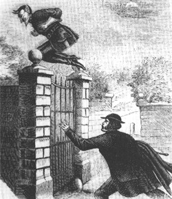

Ačkoli pamětníci válečných událostí na Péráka, či Pérového muže, jak byl zpočátku nazýván, dosud nezapomněli, generace konce dvacátého a počátku jednadvacátého století zůstávají již tímto městským mýtem nepoznamenány. Ovšem populární kultura nenechala tohoto legendárního hrdinu na pružinách zmizet v propadlišti dějin – právě skrz ni se Pérakově postavě pocházející ze světů tradovaných vyprávěním dostává reinterpretace.

Jaký byl Pérák podle svých současníků z let čtyřicátých a jaký je dnes? Vydejme se po stopách nevystopovatelného a nepolapitelného Péráka. Na napínavou cestu, která možná vede až do Libeňského plynojemu…

## Pérákův viktoriánský předobraz

> „The population of this place have been alarmed by this half monster, half man, walking the ground „midst the pale glimpses of the moon making the night hideous“...“

Manchester Times, 18. 3. 1849

> „As soon as night comes on he patrols the above road, but, on the appearence of any male he darts into a doorway and hides until his disturber has passed. Here he will remain until he sees a female, then he suddenly jumps from his hiding place, and assaults his helpless victim in the most shameful and indelicate manner.“

Era, 11. 4. 1840)

Kořeny městských legend o Pérovém muži je třeba hledat ve viktoriánské Anglii, neboť předobrazem pro českého hrdinu na pružinách, nebyl nikdo jiný než legendární „Spring-heeled Jack“ – maskovaný přízrak, který od 30. let devatenáctého století terorizoval obyvatele Londýna.

Na rozdíl od Péráka zdaleka nepředstavoval hrdinu v pravém slova smyslu, naopak byl obávaným padouchem, jehož skutky pobuřovaly anglickou veřejnost. Poprvé byl spatřen v jižní části Londýna, kde se v setmělé aleji pokusil znásilnit služku, z místa činu pak unikl pozoruhodnými až nadlidskými skoky (stejnými jakými bude zhruba o století později unikat před dopadením Pérák). Po této šokující zprávě, kterou přinesly 9. ledna 1838 _The Times_, se v novinách i nadále objevovaly nejrůznější zprávy o hrůzné činnosti tohoto městského fantoma, jehož ruce byly podle svědků chladné jako mrtvola a který, zahalen do kápě, přeskakoval bez sebemenších potíží zdi vysoké více než devět stop. Oběti útoku Spring-heeled Jacka byly takřka vždy ženy a několik z nich údajně po setkání s ním zemřelo hrůzou (snad poté, co zaslechly jeho démonický smích). Tyto zprávy se postupně rozšířily i do jiných částí Anglie a objevují se v tisku ještě několik následujících desetiletí.

Spring-heeled Jack se brzy stal také oblíbeným protagonistou šestákových krváků (penny dreadful), stejně jako (rovněž smyšlený) ďábelský holič z Fleet Street.

## Pérák očima generace let válečných

> „Pérák – to bylo za války. To byla reálná osoba, říkalo se mu Franta Pérák. Byl to chlapík, Čech, co škodil Němcům. Dělal sabotáže, kradl jim, co se dalo, a aby jim mohl lépe unikat, tak si dal péra z gauče na nohy...“

(Janeček 2007: 133)

Postava Pérového muže se sporadicky objevovala už ve dvacátých a třicátých letech v severních Čechách, ovšem zaměřme se zde na obraz Péráka žijícího v kolektivně sdíleném světě mluveného vyprávění v dobách válečných, který byl základem pro konstituování jeho moderního pojetí. Tedy na Péráka coby „protektorátního hrdinu“ a tajemného nepolapitelného fantoma, jenž se v posledních letech války pohyboval (nejen) v pražských ulicích, když padla tma.

Domovem Péráka bylo podle všeho původně velkoměsto, ale zanedlouho se o této postavě vyprávělo i mimo Prahu, v jiných částech Čech a Moravy, kde byl řadou „očitých svědků“ také spatřen, unikaje na svých legendárních pružinách. V Praze se tento fantom objevoval na nejrůznějších místech, ale nejčastěji na Žižkově, v Libni nebo Vysočanech, což byly očividně jeho nejoblíbenější městské čtvrti.

Masová obliba Péráka a šíření historek o jeho fantastických činech v rámci tak krátkého časového úseku nejspíše nebyla náhodná – je jistě na místě tuto vlnu popularity tajemné postavy s pružinami úzce usouvztažnit s dobovými událostmi. Není snad příliš velkou nadsázkou říci, že za tíživé situace okupace a stále nekončící války zde byla „poptávka“ po hrdinovi schopném Němcům vzdorovat bez ohledu na jeho „neskutečnost“. Ačkoli, v ulicích města ponořeného do tmy se mohlo dít cokoli, venku za zatemněnými okny se _mohl_ pohybovat Pérový muž... Ostatně řada „očitých svědků“ ho spatřila a ústní vyprávění, ač vždy z druhé ruky (Péráka nikdy nespatřil vypravěč sám, ale někdo z jeho okolí, jak je u tradovaných městských legend a fám zvykem), se zdálo být věrohodnější než oficiální hromadně sdělovací prostředky podléhající cenzuře, které o Pérákovi a jeho činech zarytě mlčely. Na rozdíl od Spring-heeled Jacka „žil“ Pérák pouze v časoprostoru ústně tradovaných pověstí a městských legend a nestal se hvězdou, která opanovala stránky novin, což souviselo jak s dobovou situací, tak také s celkově pozitivnějším charakterem tuzemského pérového fantoma.

Otázka původu Péráka nebyla nikdy řádně objasněna – někteří věřili, že se jedná o osobu napojenou na odboj, snad dokonce parašutistu, jiní (nejspíš ve snaze po racionálním uchopení jeho nadlidských schopností) se domnívali, že by se mohlo jednat o akrobata či vynálezce, ovšem samozřejmě mohlo jít i o „řadového“ Čecha. Podle některých byl zas Pérák uprchlým zločincem... Všichni se však shodovali na tom, že své pověstné skoky vykonává díky pružinám připevněným k botám (výjimečně měl péra zabudovaná přímo do boty s vysokou podrážkou), a jakkoli se to může zdát paradoxní, mělo se prý _skutečně_ jednat o běžně dostupná péra z gauče. Stejně jako rostl věhlas pérového muže, rostla také vzdálenost, jakou byl Pérák schopen pomocí svých pružin urazit. Zpočátku skoky překonával ohrady a zdi hřbitovů, později i železniční vagóny a autobusy, vyskakoval na střechy kostelů a domů a jedním ze svých legendárních skoků prý překonal vzdálenost mezi Babou a Bohnicemi.

Pole Pérákovy působnosti bylo široké – tato tajemná postava měla několik různých tváří, ovšem zdaleka ne všechny byly v pravém smyslu „hrdinské“:

- Pérák, bojovník (nejen) s SS: snad nejvíce se Pérák zapsal do povědomí lidí jako záhadný hrdina na pružinách, o němž se šeptalo, že bez milosti potírá německé okupanty, kteří jsou vůči jeho řádění bezmocní (jednou se prý Pérákovi podařilo na Žižkově uprchnout četě vojáků se samopaly), a činorodě sabotuje – o tom, co přesně, se už příliš nemluvilo (ale měl snad na svědomí krádeže plánů z továrny ČKD).
- Pérák, vandal a recesista: Pérák byl nebývale činný také na na poli „streetartu“. Bylo mu přisuzováno autorství řady posměšných a výhružných nápisů nacházejících se na dobře viditelných, avšak těžko přístupných místech, jimiž „zdobil“ fasády domů a dalších objektů a znesnadňoval tak život protektorátním strážcům zákona a pořádku, kteří je (nevybaveni pružinami) mohli jen těžko odstraňovat.
- Pérák padouch: v určitých případech fungoval Pérový muž i jako „moderní klekánice“. Maminky jím strašily děti, aby nechodily ven, protože je tam Pérák. Ovšem, ani maminky nebyly v bezpečí – šířily se totiž zvěsti, že Pérák po setmění přepadává osamělé ženy, například když jdou na noční směnu do továrny (právě tato podoba Péráka se nejvíce blížila původnímu viktoriánskému Jackovi, jehož zločiny měly sexuální podtext).

Přestože podle příběhů městských legend Němci prahli po lapení Péráka, který jim znepříjemňoval život, a strojili na něj nejrůznější léčky, žádné oficiální záznamy, které by tyto zprávy potvrdily, se doposud nenašly. Pérák tedy navzdory pevnému přesvědčení některých, že se nepochybně jedná o osobu z masa a kostí, představoval „pouze“ pozoruhodného hrdinu stvořeného lidskou imaginací.

## Pérák v drápech postmoderny

Pérák tak, jak ho znali „pamětníci“, je dnes už mrtev a Pérákovi se skrz nejrůznější umělecká média dostává reinterpretace. Nejkomplexnější novodobý obraz hrdiny na pružinách představuje román Petra Stančíka _Pérák_ (2008), který může být vhodným nástrojem pro uchopení toho, jakým způsobem pracuje současná popkultura s pérakovskou postavou vypůjčenou z moderního folklóru.

> „Hrdina je oblečen do přiléhavého trikotu z poctivé hnědé hověziny. Na hlavě má koženou kuklu[...]. Obličej mu chrání letecké brýle a před ústy se mu klinká náustek kyslíkové masky pro pobyt ve výškách. Přišitý na prsou nese svůj symbol: žlutou, třikrát zatočenou pružinu.“

(Stančík 2008: 15)

Nové století tohoto ambivalentního městského fantoma, který možná byl, nebo také nebyl hrdinou, diametrálně proměnilo – z Péráka se stal první český superhrdina.

Způsob modelování ústřední postavy ve Stančíkově románu odpovídá archetypu comicsového superhrdiny. Pérák disponuje nadlidskými schopnostmi, které používá k ochraně nevinných, ovšem každodenní zločin v ulicích a protivníci, jimž čelí, mají poněkud jinou povahu než zločinecké podsvětí amerických velkoměst: úhlavními nepřáteli Péráka jsou pochopitelně nacisté, kteří si s poskoky comicsových superpadouchů v ničem nezadají: jejich síla je rovněž především v jejich množství a technologiích, jež mají k dispozici. Ale pro Péráka není žádná budova příliš vysoká, žádný déšť střel příliš hustý a ani žádný nepřítel příliš mocný, takže si hravě poradí s esesáky s plamenomety, stejně tak jako s německou obrněnou tramvají uzpůsobenou k boji. Ani kolaboranti a udavači si před Pérákem nemůžou být jisti, protože právě je trestá s pozoruhodnou vynalézavostí – pekařku, která na něj zavolá gestapo ještě před snídaní, upeče v její vlastní peci a muži, jenž nese na poštu v Jindřišské ulici čerstvé udání, usekne po zásluze ruku. Ochranu nevinných a potírání zla, kdykoli je to potřeba, superhrdinům umožňují jejich nadlidské schopnosti, či pozoruhodné dovednosti: v případě Péráka je to jeho charakteristická schopnost překonávat skoky fantastické vzdálenosti a v cestě stojící překážky (s jistým zjednodušením lze říci, že jde o poměrně „všední superschopnost“ pohybu vzduchem, jíž disponoval i první comicsový superhrdina v historii).

Stejně jako ostatní superhrdinové také Pérák je maskovaným mstitelem bezpráví, takže nedílnou součástí jeho identity tvoří kostým se symbolem pružiny a maskou, jež skrývá jeho totožnost, která má zůstat utajena.

Ve chvílích, kdy zločin a nacisté usínají, se Pérák uchyluje do svého utajeného příbytku v Libeňském plynojemu, který je jeho domovem a útočištěm, v němž odkládá superhrdinskou masku a (skryt před zraky těch, jež má chránit) stává se „obyčejným“ člověkem a žije svůj druhý život: spí v neuklizeném bytě, smaží si vajíčka k snídani, chodí nakupovat nebo hledá útěchu na dně sklenice, když jej žena odmítne. Stejně jako je demaskováno soukromí a život jiných superhrdinů (někdo je snaživý novinář, jiný zase multimilionář), také záhadná identita Péráka je postupně odhalována a to nejen čtenáři, ale také samotnému hrdinovi fikčního světa – Pérákovo pátrání po vlastní totožnosti a původu svých schopností představuje jeden ze zásadních motivů díla. Geneze superhrdiny a její zpětné odkrývání a rekonstruování je rovněž nezanedbatelným prvkem v kontextu žánru superhrdinských comicsů, snad právě proto, že každý čtenář chce vědět, kdo byl Doctor Manhattan předtím než se stal Doctorem Manhattanem...

Nejen Manhattan, ale i Pérák má svoji Silk Spectre II, jíž není nikdo jiný než srdnatá odbojářka Jitka, kterou Pérák zachrání po nezdařené akci odboje, jejímž cílem bylo zmocnit se svatováclavské koruny (avšak Heydrich nikdy nespí! Nebo aspoň ne v noci, kdy odboj koná). Ta Pérákovi okamžitě podlehne, jak už se to ženám, jimž život zachrání neohrožený a pohledný superhrdina v upnutém trikotu, běžně stává. Nebo jí prostě jen učaruje _„tvář muže, který všem gestapákům v protektorátu kazí sny i služební postupy. Toho muže, jímž matky straší neposlušné děti, a přece si všichni kluci chtějí hrát na něj, zatímco na Háchu žádný.“_ (Stančík 2008: 15)

Není nikdo (snad až na gestapáky bez nadějí na služební postup), kdo by se neobdivoval činům maskovaného superhrdiny. Pérák slouží dobru zcela nezištně, motivován morálním kodexem, který mu velí ochraňovat nevinné, zároveň se však snaží vypátrat pravdu o své minulosti a zaplétá se tak stále víc a víc do sítě intrik a tajemství svého nepřítele.

Fikční svět Stančíkova románu je vystavěn z jednotlivých střípků pocházejících z městských legend, v nichž se Pérák objevoval – Pérákovo doupě se nachází v jedné z jeho oblíbených pražských čtvrtí, zachráněné odbojářce se Pérák představí jako Franta (ačkoli zmínka Pérákova domnělého křestního jména patří v městských legendách mezi ojedinělý odkaz), Pérák je napojen na český odboj a také jedna z teorií o jeho identitě je potvrzena. Avšak kromě aluzí na vybrané rysy Pérakovy postavy z tradovaných vyprávění je v díle zřetelná i snaha po uvedení kolujících pověstí na pravou míru a odhalení toho, jaký Pérák _skutečně byl_ v kontrastu k rozšířeným představám o něm – takže Pérák nás neváhá ujistit, že nemá na nohách připevněna péra z gauče, že si je pouze vymysleli lidé, kteří ho zahlédli skákat.

Stančíkův román se svým stylem odkazuje k diskursivnímu poli textů populární literatury, tradičně označované jako „brakové“ – představuje postmoderní koláž různých jejích žánrových forem, detektivkou a špionážním románem počínaje a superhrdinským comicsem konče. Tajemné zásilky potrubní pošty, uklízečky vytahující z kbelíků se smetáky samopaly nebo odbojářka vyrábějící skleněnou pistoli nejsou ničím neobvyklým.

Pérákův příběh je zasazen do rámce německé okupace, avšak dějinné události jsou pojaty čistě fikčním způsobem a jsou prostřednictvím románu re-prezentovány a interpretovány a ani geneze doposud neodhalených historických „skutečností“ nepředstavuje žádnou výjimku (ovšem je otázkou, zda se nám někdy podaří najít pod Národním divadlem podzemní komplexy, v nichž operovala odbojová skupina Blanických rytířů a Pérák zde přebíral rozkazy, či důkaz, že by němečtí inženýři uvedli do chodu létající talíř za pomoci buddhistických mnichů).

## Závěr

Pro moderní svět jednadvacátého století již Pérák není a snad ani nemůže být tajemnou efemérní postavou spjatou s tradovaným vyprávěním fungujícím ve velmi konkrétních souřadnicích reálné historické epochy. Postava Péráka je vnímána současným měřítky a modelována na základě dnešních kulturních „vzorců“, a tak se z protektorátního fantoma stal archetypální superhrdina žijící svým životem ve fikčním světě inspirovaném okupační Prahou počátku 40. let. Pérák už není (potenciálním) faktem, hrdinou, který snad existuje a pohybuje se neviděn venku v ulicích, jako tomu bylo v letech čtyřicátých, dnes je už Pérákova postava pouhou fikcí...

A co bude s Pérákem dál? To teprve uvidíme.

_Jaká je reflexe pérákovského „mýtu“ na neliterárním poli?_

_Jak to bylo s Pérovým mužem za dob totality a jak si vedl v boji s konkurenčním Juliem Fučíkem? O tom se třeba dozvíte někdy příště._

### Pérákovská literatura:

- Janeček, P. _Černá sanitka: Druhá žeň._ Plot, Praha 2007.
- Janeček, P. _Černá sanitka: Třikrát a dost._ Plot, Praha 2008.
- Stančík, P. _Pérák._ Druhé město, Brno 2008.
