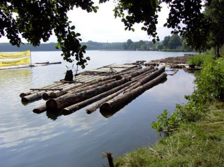

## Suchou nohou po vlnách

Když se člověk potřebuje dostat z jednoho místa na druhé, může se mu do cesty postavit vodní spousta. Pokud se chce přepravit v relativním pohodlí a vzít si s sebou alespoň nejnutnější věci, tak nepřichází v úvahu plavání. Proto na vzdálenosti, které nebyly překlenuty mosty, musel použít nějaké plavidlo. A právě možnostmi a limity využití plavidel v minulosti bychom se měli zaobírat v následujících odstavcích.

Protože se však jedná o téma obsáhlé, neřku-li bezbřehé, tak se protentokrát zaměříme na faktory ovlivňující rychlost a další možnosti plavby, přičemž se však nelze vyhnout odkazům na témata, která snad budou rozvedena v budoucnu.

Ačkoliv se dále budeme věnovat převážně námořní dopravě, započneme se stručným pohledem na sladké vody a některé jejich zvláštnosti.

## Po řece a přes řeku

Ačkoliv dnes, v době rozvinuté sítě silnic a železnic, vnímáme řeku v krajině především jako překážku dopravy, z historického hlediska, se jedná o významnou dopravní spojnici. Řeky měly svůj význam nejen pro zásobování velkých měst a pro obchod vůbec, ale bývaly rovněž branou, často jedinou, do neznámých oblastí. Právě po řekách často putovali objevitelé a první dobrodruzi kolonizující nová území. Nicméně i na již osídlených územích bylo častokrát snazší dopravovat náklad po řece než terénem obtížně průjezdným i pro překvapivě agilním volkem tažený dvoukolý vůz.

Nemáme-li však štěstí a řeky jako naschvál tečou kolmo ke směru naší pouti, tak nám nezbývá, než je nějakým způsobem překonat. Vynecháme-li brod, který nesplňuje dříve nadnesenou podmínku suchých nohou, přičemž luxus vynechání brodu si lidé po většinu historie opravdu nemohli dovolit, tak musíme využít buď most, nebo loď či přesněji plavidlo. Mosty však stojí jen na těch nejfrekventovanějších trasách a postavit je není zrovna rychlovka, například Karlův most se stavěl bratru 45 let a to nemuseli provádět řízení o veřejných zakázkách.

{:.sidebar}
Na vlastní kůži si lze __přívoz__ vyzkoušet třeba v Praze na Vltavě, konkrétně na Podbabě či v Sedleci, kde v rámci Pražské integrované dopravy fungují přívozní linky P1 (Sedlec) a P2 (Podbaba). Do obou míst se dá dostat autobusem ze stanice metra Dejvická.

Tím se tedy dostáváme k přívozům. Nejjednodušeji řečeno jde o plavidlo vozící pasažéry mezi protějšími břehy řeky, jezera či dokonce mořské úžiny. Jako plavidlo se zřejmě nejprve používaly vory, z voru se zvednutím okrajů stal prám, tedy jakýsi mezistupeň mezi vorem a lodí. Prám má proti voru výhodu vyšší nosnosti a většího pohodlí pasažérů. Z prámů se vyvinula pramička, druh loďky s plochým dnem, dobře známý především rybářům. Přívoz bývá mnohdy zajištěn nebo i poháněn lany či soustavou lan. Pokud jde o jeho využití ve hrách na hrdiny, stačí snad připomenout jméno Cháronovo či kentaura Nessose, zhoubce Heraklova, který na svém hřbetě přenášel pocestné přes řeku Euénu, tekoucí na středozápadě Řecka.

Již zmíněné zásobování měst či jiných hustěji osídlených oblastí probíhalo velmi často prostřednictvím vodního toku, který zajišťuje nejlepší poměr nákladů na přepravený objem. Komoditou nejčastěji dopravovanou tímto způsobem bylo beze sporu dřevo. U něho je výhodou, že pluje skoro samo. Rychlost této dopravy se dá zhruba srovnat s rychlostí lidské chůze. Silnější proud sice umožňuje rychlejší pohyb, avšak jeho využití je rizikovější, dochází k vyšším provozním ztrátám. Pro představu lze uvést, že ze Šumavy se dříví do Vídně dostalo v průměru za 8 dní, přičemž urazilo trasu něco málo přes 300 km. Urazit pěšky odpovídající kus cesty více dní po sobě už představuje slušný fyzický výkon a navíc to vyžaduje alespoň základní kvalitu cest či pěšin.

Na krátké vzdálenosti a na malých tocích se klády posílaly jednotlivě. Na delší cesty se vázaly do vorů ovládaných plavci, kteří se pak po svých vraceli svázat další vor. Tato náročná a nebezpečná práce patřila mezi tradičně dědičná řemesla. Již odedávna, pro představu na Vltavě od doby Karla IV., byl vyžadován pro „kapitána“ voru, zvaného vrátný, glejt, jakýsi doklad o odborné způsobilosti. Pro potřeby plavení dřeva se již v té době budovaly jezy či rybníčky k zvýšení hladiny toku. Například v Kanadě se dřevo dopravuje tímto způsobem dodnes.

Námět (ne)vracejících se plavců může být dobrou výchozí zápletkou pro dobrodružství. Z plavecké osady může pocházet některý z dobrodruhů, neboť se jedná o lidi pohybující se na velké vzdálenosti a zvyklé zacházet se sekerou.

Jakýmsi dnes již téměř zapomenutým protikladem splavování nákladů po řece je koníčkování, tedy tahání lodí s nákladem pomocí potahu umístěného na břehu. Koníčkování se nejprve používalo pro zpáteční dopravu prázdných lodí proti proudu k dalšímu naložení. S počátkem industrializace se ve velké míře budovaly umělé kanály umožňující tento způsob dopravy v širším měřítku a zároveň zásobující manufaktury vodou. Výhodou oproti dopravě vozmo je efektivnější využití koně, nevýhodou samozřejmě nákladnější budování kanálů a omezení plynoucí z jejich dostupnosti. Dnes se podobné metody používá při posunování lodí ve zdymadlech či ji používají vodáci při zdolávání náročnějších nebo sušších úseků řek.

Výše uvedené příklady nejsou rozhodně jedinými zajímavostmi spojenými se sladkovodní lodní dopravou. Jejich smyslem je ukázat, že i v domáčtějších kulisách řek a rybníků mohou vzniknout zajímavé příběhy.

## Vyplouváme na moře

Když jsme tedy spolu s nákladem plaveného dříví dorazili do mořského přístavu, tak by se hodilo vědět, jak lze dál pokračovat v cestě. V následujících řádcích se budeme stručně věnovat faktorům, které mohou ovlivnit rozhodnutí, zda plout lodí, případně jak asi taková plavba bude probíhat.

Spolu s dostupným typem lodí plavbu nejvíce ovlivní ve vzájemném působení tři následující faktory: počasí, posádka a zeměpisné podmínky. Řazeno dle abecedy:

## Počasí

### Vítr

Z důvodů, které budou dále naznačeny, uvažujeme především plachetní lodě. To z podstaty věci znamená, že počasí, zejména v podobě směru a síly větru, bude určujícím faktorem pro rychlost plavby. Starší lodě obecně využívaly primárně zadní vítr, hovorově zaďák, přicházející jen v malém úhlu od zadní poloosy lodi. Zjednodušeně vzato uměly využít jen čtvrtinu vanoucích větrů: čím víc se úhel větru odchyloval od osy lodi, tím menší díl z něj loď využila a tím hůře se ovládala. Využívání méně příznivých větrů vyčerpává posádku a opotřebovává plachty, proto obchodní plavidla tyto větry téměř nevyužívala.

S jiným, modernějším oplachtěním, jakým byla ku příkladu od Číňanů pocházející latinská plachta, lze využít širší úhel větru. Až na moderní konstrukce převážně rekreačních jachet dvacátého století umožňuje využívat předoboční vítr, tedy vítr přicházející spíš zepředu než z boku. Nicméně si lze představit mořský národ, například Teleri, který i s historicky dostupnými prostředky bude takové plavby schopen. Přímo proti větru samozřejmě nelze plout bez použití jiného pohonu vůbec.

{:.sidebar}
__Uzel je jednotka rychlosti__ odpovídající námořní míli za hodinu (rychlost 1 uzel tedy znamená, že loď urazí __za hodinu jednu námořní míli__). Její název je odvozen od uzlů oddělujících na laně vypuštěném z lodi jednotlivé úseky odpovídající rychlosti jedné námořní míle za hodinu. Tímto způsobem byla měřena rychlost lodi proti vodě. Jen pro představu, takové měrné lano rozhodně nemohlo být krátké – pokud bychom rychlost měřili ve čtvrtminutovém úseku, tak na změření každého uzlu rychlosti potřebujeme 25 stop (772 cm) lana. Abychom z rychlosti proti vodě dostali pro navigaci potřebnou rychlost proti zemi (anglicky SOG – speed over ground), musíme započítat vliv mořských proudů, pokud je známe. Uzel se __značí KT__, případně Kts., v chorvatštině čv.

Pokud vezmeme v úvahu čistě vítr bez dalších vlivů, tak lze plout do rychlosti větru nějakých 30 uzlů, což představuje 6. stupeň Beaufortovy stupnice – silný vítr. Na Zemi takto silné nebo slabší větry vanou velkou většinu času, kdy vůbec fouká. Pokud jde o směr větru, lze říci, že na moři je poněkud stabilnější než na pevnině, zejména v případě sezónního, pravidelného vzdušného proudění, jako jsou pasátní větry. Nad 50 uzlů je vítr velmi nebezpečný pro všechny druhy plachetnic a malých lodí, nad 70 uzlů pro všechna plavidla včetně soudobých.

U větru nelze nezmínit jev, který se nazývá poryv větru – jde o krátké, náhlé, nárazové zvýšení rychlosti větru, které může doprovázet částečná změna jeho směru. Vzhledem k tomu, že poryv tak řečeno využívá momentu překvapení, dokáže způsobit větší škody než stálý vítr o stejné síle. Autor může z vlastní zkušenosti potvrdit, že poryv o rychlosti kolem 50 uzlů je velmi nepříjemný i na moderní plachetnici dobře vyvázané u bóje. Pokud přijde více poryvů z různých stran, je pravděpodobné, že lodě stojící na kotvách budou uvolněny.

### Bouře

Podoba, síla i doba trvání bouřek se mohou měnit, pro různá místa existují roční období, kdy je výskyt bouří pravděpodobnější. Je-li bouře větší než malá, znamená to, že loď musí manévrovat tak, aby bouřku přestála bez úhony, a plavba směrem k cíli je až druhořadá. Tyto „přežívací“ manévry obvykle znamenají natočit příď proti vlnám a snížit plochu plachet na minimum nutné k manévrování apod.

Bouře je obvykle doprovázena i vlnobitím a v takovém případě se může snadno stát zkázou pro celou loď. Oplachtění jako nejcitlivější součást lodi je poškozeno prakticky vždy. Na dřevěných lodích každá větší bouřka znamená potřebu oprav: většinu je obvykle možné realizovat během další plavby, pokud je na palubě dostatek smoly, dřeva, lan, plachtoviny a schopná posádka s nástroji.

### Vlny

Mořské vlny, s výjimkou speciálních případů, jako je tsunami zrozená zemětřesením, jsou vytvářeny větrem, proto si je dovoluji zařadit mezi dílčí faktory počasí. Samy o sobě vlny nejsou pro samotnou loď až takový problém, byť posádku může sužovat mořská nemoc i z malého houpání. Spolu s větrem však vzájemně své působení násobí. Na druhou stranu větrem umožněný pohyb loď stabilizuje, zejména eliminuje vliv vedlejšího, obvykle bočního houpání, které je špatné jak pro posádku, tak pro pevnost plavidla.

Při charakterizaci vln pak nelze sledovat jen jejich výšku, ale je třeba věnovat pozornost i délce vln – tedy vzdálenosti jednotlivých hřebenů mezi sebou. I hodně vysoká vlna, je-li dostatečně dlouhá, tedy další vlna je daleko a úbočí vlny je proto pozvolné, nepředstavuje pro loď vážnější problém. Proto tsunami, která zpustoší pobřeží několik kilometrů do vnitrozemí, může být dál na moři jen větší vlnou, jejíž ničivý potenciál prakticky nelze rozpoznat.

Pro rozlišení stavu hladiny podle vln lze použít dva mezníky vyplývající z barvy hladiny. Pokud je mořská hladina jen modrá a vůbec se nevyskytuje bílá pěna, lze hovořit o klidném moři bezpečném pro plavbu. Když se bílá pěna vyskytuje jen místy a nesouvisle, mluvíme o tom, že se moře vlní a je třeba zvýšit opatrnost. Avšak když pěna tvoří souvislé pruhy, znamená to vlnobití, na takovém moři je lépe se nezdržovat.

### Viditelnost

Dohled může být omezen lecčíms, mlhou, deštěm, oblačností, oparem či jejich kombinací, což podstatně ztěžuje vizuální navigaci včetně vyhýbání se překážkám apod. Je třeba mít na paměti, že možnost manévrovat je u lodě nevybavené motorem citelně omezená, takže se nelze vyhýbat překážkám na poslední chvíli. Tento faktor třeba nabývá na významu v neznámých vodách. Za špatné viditelnosti je rovněž velmi komplikované kotvení a přistávání v přístavu. Na druhou stranu při plavbě na otevřeném moři daleko od pevniny a běžného lodního provozu má snížená viditelnost na plavbu jen malý vliv. Spíš z hlediska příběhu než čeho jiného lze očekávat útok pirátů či mořských nestvůr.

### Teplota

Naopak minimální vliv na možnost plavby má samotná teplota. V našich zeměpisných podmínkách je sice špatné počasí spojováno spíše se zimou, ale vlastní teplota má vliv zejména na pohodlí posádky. Ovšem pohodlí posádky, její možnost si dobře odpočinout, ale není vůbec zanedbatelný faktor. Je vhodné nezapomínat, že v opravdu chladné vodě člověk nevydrží dlouho plavat a záhy umírá na podchlazení. Vzhledem k teplotně akumulační schopnosti vody bývá na moři chladnější jaro než podzim a vůbec změny teplot se odehrávají spíše pomaleji než na pevnině.

## Podmínky geografické

### Mořské proudy

Rotací země, působením podnebí a dalšími vlivy vzniká komplikovaný systém pohybu vody v mořích a oceánech. Tento těžko uchopitelný kolotoč lze pro praktické potřeby rozdělit do jednotlivých mořských proudů, které jsou při hladině stálé. Mohou plavbu zrychlit, nebo zpomalit, ale mimo úžin či některých exponovaných úseků pobřeží nepředstavují přímou překážku plavby. Rychlost mořských proudů se pohybuje do tří uzlů, na Zemi žádný stálý mořský proud dlouhodobě nepřesahuje rychlost 4 uzlů. Pokud je masa vody v proudu teplejší než okolní spousta, hovoříme o teplém mořském proudu a obráceně. Při vytváření vlastního světa je dobré pamatovat na to, že větší mořský proud dokáže ovlivnit počasí pro významnou část kontinentu.

Pro transoceánické plavby je využití proudů krajně vhodné, rovněž v mořích budou obvyklé obchodní trasy respektovat přítomnost proudů, byť o něco méně než převládající větry. Některé úžiny mohou být část roku proplutelné prakticky jen jednosměrně právě z důvodů silných sezonních proudů – přes léto se jedná například o Gibraltar či Bospor, neb vlivem silného odpařování klesá hladina Středozemního moře rychleji než u Atlantického oceánu či Černého moře. Mořské proudy mohou rovněž přinést různé věci z daleka, neobvyklá dřeva, trosky či plovoucí ledové kry.

### Hloubka

Dobrá zpráva! Drtivá většina moří má dostatečnou hloubku pro bezpečnou plavbu, horší zprávou pak je, že většina z oněch nepočetných mělčin se vyskytuje právě tam, kam je nějaký důvod plout (pobřeží, úžiny, ostrovy). Naštěstí plavidla obecně nejsou na potřebnou hloubku příliš náročná. I dnešní lodě mají ponor v porovnání s ostatními rozměry téměř zanedbatelný. Největší loď světa, supertanker Knock Nevis, měl při délce 458,45 m ponor 24,61 m. Ani další supertankery jiné konstrukce nepřesahují svým ponorem 30 m. Pro zjednodušení lze říci, že je o něco menší než polovina šíře lodě.

Před zavedením více palub s děly se lodě většinou vešly do 4 metrů ponoru. Pro představu Kolumbova Santa Maria měla podle některých pramenů ponor jen sedm stop, přičemž mnohé dnešní rekreační jachty mají ponor o něco vyšší. Výhodou je, že za denního světla je do potřebné hloubky poměrně dobře vidět, lze se tedy překážkám vyhnout.

Podvodní překážky kromě celkově příliš mělkého moře jsou dvojího druhu – útesy nebo písčiny. Náraz na skálu umí snadno poškodit, prorazit trup, ale útesy se nepohybují a ve využívaných oblastech jsou známé, často i značené. Naopak písčiny se vlivem proudění vody pohybují, avšak nasednutí na ně nemá obvykle trvalé následky a stačí počkat na příliv, nebo loď trochu odlehčit a lze pokračovat v plavbě. Ovšem za bouře a při přílivu může být osudná i taková kolize, neboť loď položí na bok a příliv ji zaplaví dříve, než uvolní. Velká většina pobřeží je čitelná v tom smyslu, že lze odhadnout, jak bude mořské dno sestupovat, a tedy jak blízko se lze ke břehu odvážit.

### Ústí řek

Obvykle se tato místa považují za relativně příznivá pro mořeplavbu, protože se zde dá doplnit pitná voda či schovat se před bouří. V ústí většiny řek rovněž vznikaly sídliště a první přístavy, z nichž probíhal rybolov mimo jiné na brakických vodách, což je směs sladké vody z řeky a slané vody mořské. Tento druh rybolovu využívá nejen pravidelných tahů lososů a úhořů, ale i určité omámenosti ryb jiných druhů, které se do těchto vod dostanou. Z opačného hlediska je třeba uvést, že řeka, jež často přináší plovoucí kmeny a jiný odpad, také působí pohyby nanesených písčin, které jsou navíc v zakalené vodě obtížně viditelné.

V ústí řek rovněž vznikají pro plavbu nepříjemné, někdy až nebezpečné peřeje (na rozdíl od vln v nich voda proudí). Největší nebezpečí však představuje ústí řeky pro lodě plující podél břehu za snížené viditelnosti – proud může loď snést poměrně snadno mimo dohled pevniny, což například u Amazonky je pravidlem i za dne. Všechny výše uvedené jevy se násobí při povodních. Lze si představit zajímavou zápletku, kdy družinka musí během plavby provést průzkum řeky kus proti proudu, aby bylo možné ověřit, že lze ústí bezpečně přeplout.

### Příliv a odliv

Slapové jevy, jak se střídání přílivu a odlivu nazývá, jsou vyvolány gravitačními silami Měsíce a Slunce, které má však v těchto jevech jen necelou polovinu síly Luny. Velikost přílivu a odlivu se v průběhu lunárního měsíce mění vlivem vzájemné polohy obou vesmírných těles. Největší příliv a odliv nastává, když se síly obou těles sčítají, a označuje se jako skočný příliv či odliv. Stejný jev nastává i na straně Země od Měsíce odvrácené, tedy jak příliv, tak odliv nastává dvakrát za den. Interval mezi vrcholem přílivu a odlivu činí 6 hodin, 12 minut a 37 sekund. V některých oblastech jsou „odvrácené“ přílivy a odlivy stěží postřehnutelné, tedy se zdá, že interval je dvojnásobný.

Na rozdíl hladiny při přílivu a odlivu má vliv zejména členitost pobřeží, na otevřeném moři je tento rozdíl prakticky nepozorovatelný. Největší rozdíl na Zemi je v zálivu Fundy, Kanada, cca 20 m, v Evropě pak v zátoce Mont St. Michele až 13 m. Kromě výšky přílivu je taky třeba věnovat pozornost slapovým proudům, jež v některých lokalitách při odlivu dosahují až 12 uzlové rychlosti. Jsou sice relativně předvídatelné, ale pro loď s maximální rychlostí kolem 5 uzlů představují past mnohdy smrtící.

### Úžiny

Za zmínku stojí také úžiny, průlivy a podobně, tedy místa, kde obvykle masy pevniny svádí trasy lodí do jednoho, třeba širokého, bodu. V minulosti se v takových místech často vybíraly daně či poplatky za proplutí, které leckdy nebyly malé. Některé neověřené prameny uvádějí, že za proplutí lodí norských Vikingů vracejících se z výprav do Pobaltí Kattegatem se platilo až 40 % z kořisti. Do současnosti pak nelze přehlédnout nemalý význam strategický.

Bez ohledu na předchozí antropogenní jevy není možné podcenit ani ostatní význam úžin pro plavbu. Průlivy jsou jednak významným navigačním bodem, druhak zde často dochází k výskytu lokálních proudů a dalším změnám charakteru moře (směr a velikost vln, síla větru). V takových lokalitách se rovněž mohou skrývat mělčiny a další překážky, které činí proplutí značně náročným, či ve spojení např. s odlivem dočasně nemožným.

### Přístavy

I sebeslanější námořník se nakonec rád vrací do přístavu, aby užil něco suchozemských slastí. Za stání v přístavu se obvykle platí nějaký poplatek, pokud přístavní autorita neusoudí, že z volnějšího obchodu jí nakonec přijdou vyšší zisky. Avšak právo schovat se před bouří a doplnit pitnou vodu bezplatně má tradičně každá loď v nouzi. Již zmíněné slapové jevy pak mohou způsobit, že přístavy v určitých lokalitách jsou několik hodin denně (obvykle při vrcholícím odlivu) nedostupné, ačkoliv v samotném přístavu je vody dost na to, aby lodě nesedaly na dno. Naopak proudy při přílivu mohou způsobit, že lodě nebudou schopny přístav opustit (a připlutí může být dost náročné).

Nakonec by bylo vhodné neopomínat význam přístavu pro nakládání a vykládání zboží, které je v přístavu mnohonásobně snazší (byť nikoliv vždy snadné) než stejný manévr někde v zátoce, kde se musí zboží dovézt na člunu. Pouze pro úplnost pak dodejme, že ne každý přístav se hodí pro lodi všech velikostí, a to zejména kvůli hloubce vody u přístavního mola.

## Posádka

Vše výše uvedené má za cíl nám dát představu, co vše může být při plavbě na moři problémem, avšak o tom, jak velký to problém bude, rozhodují schopnosti posádky. Kvalitu celé posádky určuje __kapitán__, který nejenže má celou loď tak říkajíc na povel, ale své mužstvo obvykle vybírá a najímá. Je vhodné připomenout, že dobrý a zkušený námořník nebude dlouho sloužit pod špatným kapitánem, protože může jít o jeho život.

Na kapitánově povaze záleží, kam až bude ochoten dobrodruhy zavést, a na jeho schopnostech, zda to dokáže. V kritických okamžicích je to kapitán, kdo musí rozhodnout co a jak provést, kdy to provést. A to, i kdyby nevěděl o nic víc než poslední plavčík. Navíc musí vydávat rozkazy takovým způsobem, aby ujistil posádku, že má vše pod kontrolou. Možná to nedopadne podle očekávání, ale v případě, že posádka vycítí kapitánovu nejistotu, to nevyjde určitě.

Není se tedy co divit, že dlouholetí kapitáni námořních lodí jsou obvykle zajímavé – a téměř bez výjimky mimořádně schopné – existence. Přesto, má-li plavba trvat déle než přes jednu noc, se neobejdou bez dobrého __prvního důstojníka__, který má loď na povel v okamžicích kapitánova zaslouženého odpočinku. Mezi kapitánem a prvním důstojníkem musí panovat značná míra důvěry, obvykle podložená dlouhými roky spolupráce. Není-li tomu tak – například proto, že kapitán není vlastníkem lodi a __patron__, jak se pak takový vlastník nazývá, rozhodne jinak – je zaděláno na pěkný pr…příběhotvorný moment. Například kdyby patronem byl první důstojník, který nemá dost zkušeností, aby sám lodi velel. Není neobvyklé, aby kapitán, první důstojník, případně i ostatní důstojníci potřebovali k výkonu této funkce dekret.

Zatímco důstojníci obvykle velí, tak od rutinní manuální práce je tu __mužstvo__ či v méně vojenském duchu __posádka__ v užším slova smyslu. Ta má na starosti vše od umývání paluby přes drobné opravy, vaření až po „opravdové“ námořnické záležitosti, jako je práce s plachtami, tahání kotvy, držení hlídek apod. Samozřejmě se posádka rovněž podílí na obraně lodi, je-li toho třeba. Posádku tvoří námořníci, tedy lidé uvyklí pobytu na moři, krom jiného zvyklí na houpání lodi natolik, že mořskou nemoc dostávají minimálně a umí zvládat její následky. Prakticky s jistotou lze mezi nimi nalézt jedince, kteří umí velmi dobře pracovat se dřevem nebo s jehlou a nití – na lodi je třeba pořád něco opravovat. Pokud se plaví mimo domácí vody, pak lze předpokládat, že budou mít nějakou tu zkušenost v boji.

Z pohledu dobrodruhů a některých nepříliš dobrých důstojníků může být posádka relativně jednolitá masa pracovní síly. Bylo-li by vhodné ji dále individualizovat, tak v první řadě lze odlišit __bocmana__, předáka posádky, který za ni jedná s důstojníky. Vrchní lodník, __loďmistr__, jak se tato funkce označuje v češtině, vyřizuje běžnou agendu posádky a sám může mužstvu zavelet. Obvykle bývá velmi zkušený, často služebně nejstarší námořník, takže je moudré si poslechnout jeho názor. Oproti předpokladům je __kormidelník__ častěji prostý námořník než námořní důstojník, ale představit si lze obě alternativy. Nicméně práce s kormidlem je poměrně namáhavá, takže se u ní střídá větší množství lidí. Přestože se dřevem a smolou musí umět nějak pracovat každý, lze nalézt někoho, kdo v této práci vyniká, a je tedy považován za lodního truhláře. Na rozdíl od bocmanů, kteří důstojníky nejsou nikdy, se poměrně záhy začali mezi důstojníky počítat ranhojiči, od toho momentu již spíše doktoři. Ostatně nikoliv nevýznamná část historie soudobé medicíny se odehrála pod plachtami lodí Jejich veličenstev královny a králů Anglie.

Posádka musí být přiměřeně velká, tak aby zastala všechnu potřebnou práci včetně nějakého toho vystřídání se, ale zase ne příliš velká, aby nemohla vyžít ze svého podílu na zisku. Z tohoto důvodu pak pro potřeby dobrodružství nemá prakticky smysl uvažovat o lodích poháněných vesly. Na delší plavby či na svobodné podnikání je posádka veslice spíš komplikací (kvůli potřebě uskladnit velké množství jídla a vody, rozdělit příliš velkou část zisku, nebo naopak hlídat otroky) než výhodou, která spočívá jen v možnosti plavby bez ohledu na vítr. Pokud už někdo má touhu zapojit do příběhu veslaře, dovoluji si nabídnout možnosti mořského kajaku, třeba ve spojení s národem mořských skřetů.

## Dosah a rychlost plavby

Leckdy pro potřeby hry na hrdiny stačí vědět, kolik toho taková loď upluje za den, respektive kolik dní by trvala plavba z bodu A do bodu B, proto se, téměř na závěr, budeme věnovat i několika číslům a jejich vzájemnému vztahu. Ano, tušíte správně, autorovo dračákistické já si neodpustí obtěžovati Vás jedním vzorcem, který shrnuje výše naznačené informace do číselného vyjádření. Tak tedy, tady je:

X = L × N × T × P × M

> X je údaj, který nás zajímá, tedy skutečně uplutelné námořní míle za den.
>
> L je 30 NM, pouze v mimořádných případech, které by měly být nějak odůvodněny, lze zvýšit až na 50 NM. Jde o základní rychlost lodi vynásobenou deseti jako průměrný počet hodin denně, kdy lze asi tak plout. V pochybnostech doporučuji použít spíše nižší číslo.
>
> N plavba v noci. Hodnota 1 odpovídá případu, kdy loď nepluje v noci vůbec; hodnota 1,8 pak opačnému případu, kdy loď pluje každou noc. Podmínkou pro jakoukoliv noční plavbu více než jednu noc po sobě je přítomnost schopného prvního důstojníka v posádce. Tady je třeba upozornit, že navigace v té době měla většinou podobu pilotáže, tedy visuálního sledování znaků na pobřeží či ostrovech, za noci, kdy je snížená viditelnost, jsou tyto možnosti značně omezeny.
>
> T technický stav plavidla, jehož hodnoty se pohybují mezi 0,6 až 1,1; kdy nižší hodnota odpovídá lodím, které prodělaly bez jiných než kritických oprav na moři více než jednou bouřku, naopak vyšší hodnota lodi odpovídá okamžiku vyplutí po generální opravě. Při delší plavbě je třeba vycházet z toho, že tato hodnota pozvolna klesá, a vzít tedy její průměr, nebo rozpočítat X pro jednotlivé úseky plavby. V pochybnostech doporučuji použít výchozí hodnotu 0,9.
>
> P úroveň posádky, jejíž hodnoty se pohybují od 0,8 do 1,3. Jakýsi protiklad technického stavu lodi, neboť s naplutými mílemi a přestálými bouřemi tato hodnota stoupá, takže pro zjednodušení ji lze s výše uvedeným parametrem T „pokrátit“. V pochybnostech doporučuji použít výchozí hodnotu 1,1. Mimochodem, právě na úrovni posádky záleží (a projeví se), zda bude schopna i za dne plout více než předpokládaných 10 hodin.
>
> M vlivy počasí, jejichž hodnoty se pohybují od −0,5 do 2. Zde může nejnižší hodnota dokonce dosáhnout záporných hodnot, protože si lze snadno představit situaci, kdy posádka vypluje z přístavu s úmyslem plout na sever, ale záhy se dostane do bouře a při přežívacích manévrech ji bouře snese na jih od místa vyplutí. Jistě si lze představit i silnější vítr, než je dvojnásobek příznivého větru, ovšem jeho využití bude kvůli celkové síle rovněž omezené. Čím delší doba, pro niž má být vliv stanoven, tím spíš se bude za běžných podmínek blížit hodnotě 1. Pro úplnost lze uvést, že plavba proti větru bude vyjádřena hodnotou 0,3 a s dovětkem, že pro nadměrné vyčerpávání posádky tak nelze plout delší dobu.

U dlouhých plaveb je vhodné započítat každý sedmý den na odpočinek, doplňování zásob, větší než drobné opravy apod. Obchodní lodě rovněž potřebují nějaký čas na nakládku a vykládku zboží, které zejména mimo přístav můžou trvat dokonce ještě delší dobu. Pokud rybářská loď nechce připlout s prázdnou, tak potřebuje zhruba půl dne na nalovení nákladu ryb, který se ale rychle kazí, takže by ryby měly být obratem dodány na trh. Ze stejného důvodu vydrží nalovené ryby i posádce ne déle než tři dny.

Z výše uvedeného vzorce pak vyplývá, že průměrná loď za průměrných podmínek a okolností urazí denně (necelých) 30 námořních mil. Což se na první pohled nezdá nijak moc, ale pořád je to 55 km, což ujít po souši není úplně snadné, mimo cesty pak prakticky nemožné.

## Co říci závěrem…

Předcházející odstavce obsahují veliké množství údajů, přičemž ale v žádném případě není třeba je znát všechny. Naopak při jejich předkládání jsem od počátku počítal s tím, že laskavý čtenář si metodou samovolné separace průtokových poznatků zapamatuje jen to, co jej zaujme a snad i přispěje k obohacení jeho her. A třeba, třeba jednou se díky zábavným hodinám stráveným na moři ve své vlastní fantasii při hře na hrdiny rozhodne vyplout na to skutečné, všelijak modré, vždy však krásné a zároveň nebezpečné. Pak zažije stejné okouzlení, jako když poprvé vcházel do dveří Jarikova domku a předcházející řádky nebyly marné.
