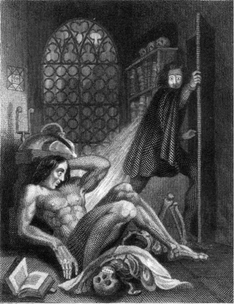
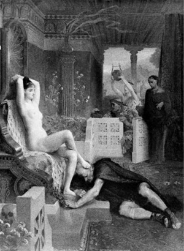

Minule jsme sledovali strašidlo, _tedy nadpřirozeného tvora, který dovede víc, než lze rozumně očekávat,_ až na hranici postmoderního věku, tedy k současnosti. Ukázalo se, že jednou z největších potíží příběhů o strašidle je to, že se používá už stovky let, takže hrozí _klišé a stereotyp._

Druhý základní problém je v _přehánění,_ kdy je strašidlo tak obrovské, komplikované a nepravděpodobné, že vyvolává spíše smích než strach.

Třetí a největší problém se vztahuje do jisté míry na všechna strašidla, o kterých byla minule řeč. Je to jakási _jednorázovost_. Po konfrontaci hrdinů se strašidlem, jakkoli velkolepé a pečlivě připravené, už jaksi _není kam pokračovat_ a není čím tuto pointu přebít. __Žralok__ sežral kapitána, __Velký Cthulhu__ byl předveden v celé své kilometrové velikosti, __Balrog__ srazil Gandalfa do propasti, __Vetřelec__ zlikvidoval rovnou celou posádku. Tím jejich úloha nevyhnutelně končí. Můžeme to párkrát odsouvat, jako třeba v těch _Čelistech,_ kde jsou k vidění snad všechny zdržovací triky, ale nejde to donekonečna. Vymýšlet pokračování znamená udělat to celé znovu a jinak, s jinými postavami. A u jakéhokoli myslitelného pokračování jste o hlavní efekt okradeni; _divák nebo čtenář už vaše strašidlo zná;_ neohromíte ho tím, jak hrůzně vypadá a co dělá.

## I.

_Řešení schopné vyvolat ještě více strašení,_ které překonává toto jednorázové zakletí, se přitom mlhavě rýsovalo už v 19. století.

Rokem nula je v tomto směru rok 1816, kdy došlo k památné soutěži čtyř literárních přátel, Byrona, Shelleyho, Polidoriho a Mary Shelleyové. Neznám podrobnosti, jaké bylo přesné zadání příběhu, který měli napsat, ale už oni čtyři se shodli, že jasným vítězem je, pro ně možná překvapivě, Mary Shelleyová s příběhem __Frankenstein__ _čili moderní Prométheus._ Pozdější dějiny dokonce na ty konkurenční výtvory zapomněly; jen znalci ví, že za pozornost stála i Polidoriho povídka jménem Upír, která podle české wiki byla vlastně dokončením Byronovy rozdělané práce, ale podle jiných a spolehlivějších zdrojů je autorem přece jen Polidori. Jak to bylo přesně, to v tuto chvíli není důležité, zajímavé na tom je, že obě nezapomenutá díla řešila problém strašidla naprosto stejně – _pojala ho jako člověka._

Takže žádné zvíře vylepšované do člověka, ale přesně z opačného konce; _člověk, který má nadpřirozené vlastnosti._ Čímž odpadají úvahy o kilometrových rozměrech, strašlivých zubech a podobně. Lidské strašidlo může především myslet a mluvit. Což je pro potřeby vyprávění zásadní výhoda; _strašidlo je potom plnohodnotná postava s jistými záměry a plány._

Netrvalo dlouho a autoři si začali všímat revolučních možností, které tohle spojení nabízí. Týká se to především všech zachovalejších nemrtvých, nejen přímo upírů, což zjistil třeba Sheridan Le Fanu v příběhu _Carmilla,_ který je opět o upírovi, případně Gautierova _Mrtvá milenka_ jménem Clarminoda.

Asi zdaleka nejslavnější z nich je o kus novější Stokerův __Dracula__.

Jak vidno, Dracula je vlastně kolektivní výtvor, který zjevně těží od zmíněných předchůdců. Strašidlo, které takto vzniklo, je stejně geniální jako _Vetřelec_ či _Bílá velryba_. Už na první pohled je zřejmé, že _Dracula_ vydržel zcela bez obtíží pronásledovat hrdiny po celých několik set stran, aniž se u toho musel před hrdiny nějak zvlášť skrývat. Naopak, setrvával v dlouhých a zajímavých konfrontacích. To je výkon do té doby naprosto neslýchaný a jinými technikami těžko představitelný; _Bílá velryba_ sice může bodovat srovnatelnou spoustou stránek textu, ale fakticky se zjevuje až v posledních kapitolách.

Druhá nápadná věc je, že _Dracula_ stvořil armádu napodobenin, které všechny více či méně těží z jeho úspěchu. Paradoxně lze tvrdit, že dnes, po více než stu letech, je kromě mnoha verzí _Draculy_ samotného okolo nás upírů více než kdykoli předtím.

Plno komentátorů se zaměřilo na bod, že _Dracula_ je nemrtvý a upír. Pro nás je dnes zajímavá druhá polovina pravdy – _na pohled vypadá jako normální člověk,_ což jsme o většině dosavadních strašidel minulého dílu rozhodně říci nemohli. Možnosti strašidla, které je _zároveň člověk a zároveň ne tak docela,_ jsou obrovské. Může cestovat lidskými zařízeními, může vést společenský život, může se zamilovat, může prostě skoro všechno, co normální hrdina. Při tom všechny ty rozmluvy, setkání, úniky a obraty provází zcela automaticky tísnivá atmosféra a napětí, což je přesně to, čeho jsme chtěli dosáhnout. _Strašidlo stále plní svoji hlavní a prapůvodní úlohu příběhové situace; posunuje příběh kupředu mocnou silou._ Autor se ani nemusí moc namáhat a nějak to zdůrazňovat; drama vznikne prostě tím, že se pan hrabě zjeví na scéně.

Poznamenám, že pokud ignorujeme tu obvykle problematickou proměnu, podobné nároky na lidský vzhled a chování splňují i všichni _zvířatolidé_ čili _dlaci_, o kterých byla řeč minule. I zde na první pohled každého praští do oka ta napínavá možnost, že by mohli být zvířaty. Nyní je ale čas si uvědomit, že jejich hlavní silná stránka jsou ty okamžiky opačné – když vypadají jako lidé. Je velmi výhodné je nechat v této podobě po většinu času a tu zvířecí vytáhnout až jako občasný trumf.

Pokud je jedním z minule navržených pravidel _nespotřebujte svoje strašidlo hned,_ potom je k takovému užití tato zdánlivě lidská podoba zvláště vhodná; dlouho mohou hrdinové zjišťovat, jak je strašidlo _nějaké divné,_ a obavy mohou plíživě narůstat daleko přirozeněji a postupněji. Divnost takového Cthulhu naproti tomu moc dlouho neutajíte. Jak se objeví, je to beznadějně vidět.

## II.

Jiná větev téhož řešení strašidla může být ještě staršího data. Mám na mysli myšlenku _zlého čaroděje,_ případně _čarodějnice_.

Výzkumy na tomto poli jsou pro mne stále ještě velmi otevřené; mám podezření, že strašidla tohoto druhu byla tak strašidelná, že se jich obávala sama literatura, a tudíž je příliš nerozpracovala. V antice byla magie a nadpřirozené vlastnosti výsadou bohů nebo alespoň polobohů; takže zlá kouzla prováděl jen velmi omezený okruh osob či monster jako třeba __Kirké__, jež proměnila námořníky na prasata. V severské mytologii nám zase velmi často chybí konkrétnější popis toho, co vlastně za magii dotyčný provozoval; jen se naznačuje, že to bylo dokonale příšerné, jako třeba __Grendelova matka__ z Beowulfa.

Z různých pramenů, například z jedné renesační smolné knihy, usuzuji, že různé činnosti čarodějníků se nejasně prolínaly; byla to _náboženská hereze,_ údajné sexuální orgie s ďáblem, běžný realistický _zločin_ – u žen typicky travičství – nebo nějaká primitivní, leč účinná a škodlivá magie jako _uřknutí,_ v praxi neodlišitelné od nemoci, nebo konečně všechno najednou. Docela vzorná ukázka je ježibaba z _Jeníčka a Mařenky_ – veškeré její čarování je vlastně kanibalismus. Církev podobná témata moc nepreferovala; čarodějnice šlo pronásledovat a nenávidět, ale rozhodně nebylo žádoucí je _studovat_.

Ze stejných důvodů je ve středověku nepříliš prozkoumaná i _démonologie_. Pro nás je to zatracená škoda, protože ďábel může být dalším mocným pololidským strašidlem, které by se vypravěčům hodilo. Ale bohužel, jeho podoba nabyla nám důvěrně známou podobu až hluboko v novověku, například s Goethovým __Mefistofelem__, protějškem _Fausta_.

S konkrétnějším hrůzostrašným čarodějnictvím jsem se v literatuře setkal ještě v novější době, až u Arthura Machena nebo H. P. Lovecrafta, tedy autorů poměrně moderních. Řekl bych, že důvodem tohoto přehlížení tématu v 19. století byla pro změnu vlna racionalismu; na čarodějnice se prostě moc nevěřilo. Kromě toho to bylo pro křesťanské publikum i nadále problematické téma.

Myslím, že pravou sílu tématu nedocenil ani sám Lovecraft. Možná ho později odrazovalo, jak starožitný a nevědecký je to nápad. To vyvozuji z faktu, že v závěru života se věnoval daleko více vznikající technice scifi a výrobě monstrózních stonožek. Pololidská strašidla vytvořil poměrně brzy, ale bohužel je předčasně opustil.

Čarodějové Suydam nebo Joseph Curwen či kapitán Marsh z jeho _okultního cyklu,_ které jsem rozebíral [v jiném článku](http://drakkar.rpgplanet.cz/zamysleni/lovecraft-okultni), jsou v základu opět normální lidé. Nicméně jejich čarodějné schopnosti je přibližují nadpřirozenu a staví zcela do příbuzenství hraběte Draculy. Mohou věci, o kterých se normálním smrtelníkům nesnilo.

Konkrétně a přesněji vynalezl Lovecraft postavu __nekromanta__, který oživuje mrtvé. Což je jedna z nejošklivějších magií, jakou lze vymyslet, která navíc zvláště strašidelně působila na křesťanské publikum. Mistrovi nekromanti přitom mohou zároveň provádět i všechny lidské věci, které jsou nemožné pro Velikého Cthulhu. Čímž se také stalo, že je _Případ Charlese Dextera Warda_ nejdelším textem, jaký kdy Lovecraft napsal. V případě Josepha Curwena lze říci, že to je opět strašidlo přímo geniálně vymyšlené a Lovecraft se k němu na konci kariéry ještě vrátil. Napodobovali ho nejen jeho věrní žáci, ale vedlo to k docela působivé partě nekromantů současných, jako třeba v Simmonsově _Času mrchožroutů_ nebo Lumleyho _Nekroskopu_.

## III.

Starší větev strašlivých čarodějníků zatlačil kromě toho na přelomu 19. a 20. století jiný model, a to _geniální zločinec_. Zrodila ho z velké části stále rozšířenější technika novin, časopisů a románů na pokračování.

V okamžiku, kdy měl příběh hrdiny řadu dílů, například _Sherlock Holmes,_ bylo jasné, že nastane problém; obyčejní zločinci jsou proti Holmesově genialitě úplní saláti bez šance a je třeba proti němu postavit někoho mocnějšího. A tak se zrodil __profesor Moriarty__. O něm jsme informováni daleko méně, než bychom si přáli; ve většině případů je to jen nejasný stín v dáli. Málokdy máme možnost ho vůbec uvidět. Je to prostě tajemné _zlo v pozadí,_ které ovšem dokáže _vytvářet příběhovou situaci i tehdy, když ho vlastně celou dobu nevidíme_. Tento model není nezajímavý; o takovém __Sauronovi__ v Pánu prstenů lze tvrdit přesně to samé. Ostatně, prováděli to už staří Řekové – lze třeba tvrdit, že tím pravým soupeřem v pozadí Odysseových protivenství je bůh Poseidon.

Myšlenka vytvoření padoucha jako opozitum k hrdinovi se zákonitě opakovala; _Superman_ takto neodvratně dospěl k __Lexi Luthorovi__ a _Batman_ k __Jokerovi__. Tihle padouši jsou nepochybně mocní, místy mají pravomoci málem božské, ale přesto jsou v příběhu fyzicky viditelní, stejně jako ten _Dracula_. O řadě z nich nelze říci nic jiného než to, že jsou geniální a mají k dispozici spoustu techniky, což je poněkud duchamorné. Ale naštěstí po delším užívání stejná potřeba příběhu a situace, která je zrodila, začala postupně tyto pány prokreslovat a vylepšovat. A sem tam jim přidala nějaký ten rys hraničící s nadpřirozenem a tajemnem, vypůjčený od těch čarodějníků, nebo od monster. Jokerův ďábelský úsměv je zrovna takový pěkný detail.

Na tomto místě musíme zmínit dost bizarní případ __Fantomase__, což je padouch, který naprosto zastiňuje svoje kladné protivníky a je daleko zajímavější než oni. Právě Fantomas má k nadpřirozeným efektům a kulisám obzvláště blízko; celý je fantasticky krvavý, bizarní, pulpový a pokleslý, čímž je neodolatelný i dnes.

## IV.

Na jiný konec Frankensteina navázala scifi; na vytvoření člověka _umělého_ čili _robota_. Čímž se zrodila další větev humanoidních strašidel.

Důkazem toho je například roztomilá povídka Ambrose Bierce jménem _Moxonův pán_ a taktéž Čapkovo _R.U.R.,_ kde bylo označení robot poprvé s úspěchem využito. Od těch dob scifivěda hodně postoupila kupředu. Robot se stal celkem běžnou rekvizitou příběhů z budoucnosti a lidi se jich postupně bát přestali. Navíc se začali postupně odlišovat lidem zcela nepodobní _roboti,_ lidem podobní _androidi_ a konečně smíšeniny biologických a umělých materiálů jménem _kyborgové_. Touto terminologií zpětně viděno, jsou Čapkovi roboti vlastně androidi.

Nicméně naštěstí pro svět, potenciál strašidelných robotů nebyl zapomenut. Přímo starožitný strašidelný robot je k vidění v Lemově povídce _Terminus_. Dost zlověstný je také __Roy__ z _Blade Runnera._ To už není žádný Čapkův pokusný model, ale strašidlo náramně důmyslné a propracované.

V této souvislosti by měl být určitě také zmíněn výtečný __Neuromancer__ Williama Gibsona, praotec svébytné skupiny Umělých Inteligencí (AI), kterého fyzicky nikdo neuvidí, čímž se vracíme k variantě _zlo v pozadí_. Přesto je to strašidlo kromobyčejně mocné a působivé. Je dědicem strašlivých zlých počítačů, jaký je k vidění například ve _Vesmírné odyseji,_ nebo stroj v geniální zapomenuté Lemově povídce _Kladivo_.

__Terminátor__ je z této party asi nejdokonalejší a kráčí přitom asi nejvíc tím původním Frankensteinovitým a Draculovským směrem. Jeho původ samozřejmě můžeme vysledovat napříč všemi dříve jmenovanými umělými roboty.

Terminátor na rozdíl od počítačů umí běhat po světě. Na rozdíl od robotů není z plastu. Lze s ním konverzovat, byť dost lakonicky. _Vypadá jako člověk_ právě jako ti vlkodlaci nebo Dracula. Ono totiž až do vzniku Terminátora málokdo postřehl, že jediný důvod existence umělého stroje, který vypadá jako člověk, je lidi _oklamat_. Jinak robotický vysavač nevypadá jako sluha se smetákem, robotický operační stroj jako lékař se skalpelem, atd. Dokonalá napodobenina člověka může logicky sloužit jedině k atentátům, vojenským akcím, špionáži a podobně – rozhodně nic mírumilovného.

Další novinkou Terminátora byla jeho _reálnost_. Přišel v době, kdy byly mikročipy již téměř součást všedního života; s různými roboty si hráli vědci v laboratořích a celé to ztratilo charakter čiré fantazie. Představa, že něco takového vyrobí nějaká armáda světa za pár desetiletí, už nebyla v roce 1984 nijak přitažená za vlasy. Mnohem reálnější než u nějakého vlkodlaka, byla i Terminátorova finální proměna v nelidské a děsivé monstrum.

Kromě toho tu je pár novinek, které si Terminátor vypůjčil od konkurence, coby trend postmoderní doby – například to, že si můžeme _prohlížet svět jeho očima_. Sledujeme jeho nápady a přání. To je nenápadná revoluce s netušenými důsledky. Do těch dob bylo velmi nezvyklé, aby měl čtenář či divák možnost nahlédnout do toho, co si myslí a provádějí ti zlí, tedy i strašidla. Dnes už je to málem povinnost dát padouchovi alespoň menší vlastní scény. Zapadá to přesně do trendu, že _lidské strašidlo je postava, ne zvíře._

Plným právem patří dnes terminátoři k jednomu z nejúspěšnějších modelů strašidla, přičemž mohu potvrdit, že se terminátoří příběhy píší a vyprávějí obzvláště snadno. Připojuji ještě další Vallunovu poznámku, že v dalších dílech terminátorů strašidlo předvedlo i dramatický oblouk ke kladnému hrdinovi, případně se na scéně honili terminátor kladný a záporný, čímž se situace dále zkomplikovala a možnosti vyprávění ještě obohatily.

Vznikla opět úplná záplava následovníků; _RoboCop, Univerzální voják,_ nebo ne až tak dávný film _Já, Robot,_ který lze považovat za velmi plnohodnotné pokračování této řady, jdoucí daleko za Asimovovu předlohu a její schémata.

Vlastně tento model strašidla ve scifi vytlačil většinu strašidel konkurenčních; jen _mimozemšťané_ si ještě drží svoje důležité pozice. Například takový __Predátor__ může být chápán jako zajímavý technicistní hybrid Vetřelce a Terminátora.

## V.

Další energii fenoménu _strašidla coby postavy_ dodal fenomén _sériového vraha_. Poznamenejme, že sériový vrah je sám o sobě lidsky dost nepochopitelná bytost. Vrah, který umlátil tetičku, protože ji nesnášel, nebo vrah, který zabil tetičku pro peníze v kredenci, není nijak zásadní a mýtický. Hůře se už vysvětluje vrah masový, který jednoho dne pozabíjí půl vesnice.

Ale vrah, který každou první neděli při úplňku někoho podřeže, je ze všech nejstrašidelnější, nejhůře se lidsky chápe a zároveň z hlediska příběhu vykazuje vděčnou vlastnost, _že jeho řádění prostě dlouho trvá._ Historie nám nedochovala jména mnoha takových démonických postav, s čestnými výjimkami __Gillese de Rais__ a __hraběnky Báthoryové__. Mýtickou slávu v moderní době dosáhl zřejmě jako první __Jack Rozparovač__, který se strefil do doby plné novinářů a vděčných čtenářů.

Nemenší senzaci svedl [Ed Gein](http://cs.wikipedia.org/wiki/Ed_Gein) v padesátých letech, který dokázal, že takové věci se mohou stát i na bohabojném americkém vidlákově, nejen v New Yorku.

První, kdo jeho příběh v nějaké podobě literárně zpracoval, byl Lovecraftův pokračovatel a kamarád Robert Bloch, když vytvořil __Normana Batese__ a _Psycho_. Přidal k myšlence sériového vraha nápad další – osoby trpící disociativní poruchou mnohočetné osobnosti. Nápad to byl nový a mimořádně mocný. Disociativní porucha sama o sobě je věc natolik podivná, že hraničí s nadpřirozeností; dochází tu ke zdrcující proměně mezi dominantní vraždící postavou matky a jejím plachým synem. _Proměna,_ která představovala literárně skoro neřešitelný problém pro vlkodlaky nebo pro fantastického dvojjedince _Jekylla a Hyda,_ tu najednou funguje docela jednoduše a ještě se to může blýsknout _vědeckým_ vysvětlením. Můžeme říci, že nám tu vzniklo další, přímo geniální literární strašidlo, které vydrží strašit rozhodně déle než standardní vrah. Otázka, zda jde o postavu reálnou nebo nadpřirozenou, zda je to horor, scifi nebo thriller, je pro účely vyprávění naprosto vedlejší; funguje to výborně a to je hlavní. A taky se to od té doby schizofreniky v knihách jenom hemží. Občas činí potíže i odlišit strašidlo od hlavního hrdiny, jako třeba ve filmu _Hra na schovávanou._

Taktéž od původního Eddieho Geina je odvozen __Leatherface__, vrah z _Texaského masakru motorovou pilou,_ který založil další úctyhodnou tradici strašlivých venkovských krvežíznivých primitivů; a konečně poslední veleslavné Geinovo literární vtělení je __Bufallo Bill__ z _Mlčení jehňátek_.

Tam ovšem asi ještě více slávy dobyl zřejmě úplný král všech ďábelských sériových vrahů, __Dr. Hannibal Lecter__ z téhož románu. Ten vrací problém zase trochu jinam; nemá vůbec žádnou schizofrenní ustrašenou složku osobnosti, ale je to chladný génius, připomínající Moriartyho nebo Fantomase, s tím, že je navíc ozdoben hrůzostrašnými vlastnostmi a detaily. Pro velký úspěch byl již taktéž mnohokrát zreplikován; za pozornost určitě stojí jeho vlastní duchovní bratr __John Doe__ z thrilleru _Sedm,_ případně technovarianta jménem __Clyde Sheldon__ z příběhu _Ctihodný občan_, nebo konečně comicsoví __Joker__ a __Bane__ ze série o _Temném rytíři_. A jistě byste jich našli plno dalších. Dnes se dá mluvit o úplné renesanci ďábelských padouchů. Tihle chlapíci mohou svojí zlověstnou uhlazenou elegancí připomínat hraběte Draculu a jeho dávný vzor, ďábla Mefistofela. Většinou se vydávají za postavy zcela realistické, ale při tom vlastně balancují na samé hraně nadpřirozených schopností.

Uvědomme si třeba to, že pan Lecter, nevěda, že ho příběh odveze do Memphisu, má už předem připraven nástroj k úniku; a když mu nahraje situace, útěk geniálně zimprovizuje, předvídaje naprosto všechno, i to, co nikdo jiný předvídat nedokáže. Jeho schopnost využít nepatrných chyb policejního aparátu nebo samotných hrdinů a schopnost přesunů v místě a čase jsou mimo veškeré chápání. Občas až napínají čtenářovu soudnost stejně jako Draculovo létání a proměny v mlhu. Tytéž divy zvládne Joker nebo Bane; mají výbušniny připravené vždy tam, kde je budou jednou potřebovat. Ale budiž; devět z deseti kritiků bude tvrdit, že to je realistický příběh, a devět z deseti kritiků se nemůže mýlit.

Z našeho pohledu je zřejmé, že právě jako u Normana Batese nám může být skutečná reálnost příběhů ukradená; zda je to strašidlo přirozené nebo nadpřirozené je úplně jedno, když tak krásně straší. Funkci strašidla plní tito pánové excelentním způsobem; nějaké ty standardní zombie nebo žraloci proti nim nestojí za zmínku.

## VI.

Dostáváme se k _autorům, kteří se přesto na reálnost vykašlali._

Pokud psal Stephen King o zešílevším hoteliérovi v příběhu _Shining,_ mohl někdo doufat, že je to realistické. U _Carrie_ nebo příběhu _To_ všechny podobné naděje končí; strašidla umí víc, než je obvyklé, právě jak je jejich nadpřirozenou přirozeností.

Clive Barker se na to vykašlal taky, a to hned v první publikované povídce vůbec, _Půlnočním vlaku smrti_. Mohli bychom tvrdit, že je to zase o sériovém vrahovi, jenže vysvětlení motivů jeho konání vrhá příběh někam úplně jinam – do říše Lovecraftových šíleností.

Druhý z jeho raných nápadů, _Hellraiser,_ přináší hned komplementární dva druhy strašidel; muže, který chce poznat všechny nejdůmyslnější rozkoše světa, a strašidla, která takové věci poskytují. Výsledkem jsou velmi neobvyklá humanoidní monstra v obou případech. Ze záplavy nápadů vyjímám třeba [zpětně skládající se strašidlo](http://www.youtube.com/watch%3Fv%3DpWD23_pyOGU), což je artefakt od té doby velmi oblíbený – začíná tak například film _Mumie_.

Stejně tak bych ocenil i [Cenobity](http://www.youtube.com/watch%3Fv%3DTYx8uN8F4kg), Řád řezné rány. Dávám schválně odkaz na jejich vizuální provedení; je ve všech případech velmi bizarní. Společný jmenovatel u nich je to, že _utrpení vnímají jako rozkoš;_ jsou to tedy všechno jacísi nadpřirození masochisté, kteří si svoji bolestivou podobu nepřetržitě užívají. Střetnutí s normálními lidmi vede k nedorozuměním a ta jsou potom nevyhnutelně fatální. Rozhodně něco, co tu tehdy nebylo a napodobuje se to dnes také (_Faunův labyrint_ – prostřední strašidlo příběhu), i když většinou bez pochopení té ústřední zarážející myšlenky.

Z ohňostroje dalších nápadů a vynálezů Cliva Barkera v oboru strašení je asi třeba zmínit jeho ultimátní vrchol, když vyrobil __Mamouliana__ v příběhu _Damnation game_ (čili _Věčné zatracení_). Pokud je oblíbeným vyprávěcím manévrem v příběhu odhalování záhady, zde je pak jedním z ústředních témat děje zkoumání samotného strašidla; co je vlastně zač. Každou epizodou jsme o něco chytřejší a o něco vystrašenější. Podrobnosti o Mamoulianovi už asi nemá smysl popisovat a je třeba si o něm přečíst, pokud chcete vědět o tématu strašidel opravdu všechno. Mistr sám potom vyrobil několik parádních variant a parafrází Mamouliana, ale popravdě řečeno, také ho už nepřekonal.

Vlastně si nevzpomínám, který z Barkerových příběhů _není_ o strašidlech. Mám dojem, že Clivem Barkerem věda o strašení a vývoj zatím skončil; nenašel jsem nikde nic úžasnějšího ani strašidelnějšího.

## VII.

Osobně se přiznám, že jsem příběhy o strašidlech páchal nevědomky už od počátků. Statisticky tvořily zpočátku nevýraznou skupinku, ale zpětně viděno, byly to všechno věci, které měly většinou zásadní význam pro vývoj a většinou stály za zaznamenání. I když to většinou byla poměrně konvenční strašidla na způsob chobotnic, oživlých automobilů nebo _stromů,_ což pravidelným čtenářům Drakkaru [netřeba připomínat](http://drakkar.rpgplanet.cz/zamysleni/confessio-cili-jak-jsem-se-chtel-stat-spisovatelem). Význačnější vlastní strašidlo byl lvodlak jménem _Černý lev,_ který mi vystačil na novelu. Byla to jakási montážní konstrukce ze staroegyptského faraona a vlkodlaka a fungovalo to docela slušně.

Když jsem začal nacházet vlastní směr, strašení se tomu přirozeně přizpůsobilo. Strašidla nabrala jistou patinu a starožitný záhrobní odstín; taková z hlíny vykopaná klasika. Zajímají mne stará strašidla, dávno známá, o kterých _každý ví, že existují._ Lze to nevěřícím Tomášům doložit odkazem na Písmo svaté nebo něčím podobně bytelným. Při tom si tato strašidla udržela svoji výjimečnost tím, že byla vždy u toho, když jsem psal něco delšího nebo složitějšího. Jako příběh o strašidle lze například číst i _Souboj,_ kde ovšem nemá smysl tajit výrazné cizí vlivy, jakými jsou třeba __Fáfnir__, __Glaurung__ a draci z rukopisu G5.

Kolem přelomu tisíciletí mne naplno zastihla postmoderna a strašidel ještě přibylo. První takové ze [Sal Borelli](http://drakkar.rpgplanet.cz/povidky/sal-borelli) je přímý sequel Lovecraftova příběhu. Okolo roku 2000 vznikl _Ochránce cesty_ a _Temný rytíř,_ což jsou dvě strašidlárny. Přísně vzato, ze sedmi příběhů [Ztracených letopisů](http://www.legie.info/kniha/12768-ztracene-letopisy/vydani) je jediný, o kterém lze bezpečně tvrdit, že tam žádné strašidlo není.

Potom přišla zajímavá krize.

Měl jsem dojem, že strašidlo je jisté příběhové zakletí; vyrábí sice perfektní short story, ale nemá sklony jít hlouběji. Stále je to při všem důmyslu variace na ten první příběh o Karkulce, kde padne buď ona, nebo vlk. Došel jsem ke stejné zdi jako stará moderní kritika, která považuje příběhy o strašidle za brakové a primitivní z podstaty věci; trvalo desítky let, než byla postupně uznána výjimečnost takových věcí, jako _Bílá velryba_ nebo _Čelisti._

Další pečlivé studium ukázalo, že to je složitější; _hloubka v příběhu o strašidle klidně být může, nic jí nebrání,_ jen ji opticky zakrývá strašidlo tou efektní dramatičností. Akční drajv a rychlost příběhu, který strašidlo vyvolává, a skryté hlubší plány jsou dvě různé věci. První pohled prolétne _Blade Runnera_ jako celkem obyčejnou a lehce nudnou scifidetektivku; teprve oko pečlivější zahlédne temné a docela rozsáhlé hlubiny. Podobný případ jsou Meyrinkovy romány, například už ten první a nejslavnější __Golem__. Příběh o strašidle to je mimo veškerou pochybnost; ale ještě snad nikdo se neodvážil tvrdit, že je to povrchní.

A tak se mi najednou stalo, že mi pod rukama vznikají další strašidla, příběhy mnohem delší než dříve a zároveň mnohem komplexnější. Při tom mne téměř přestala zajímat míra fantastičnosti; u [Anděla smrti](http://www.lemurie.eu/) jsem se přistihl, že jsem napsal vlastně úplně realistický příběh. Přitom i zde je strašidlo základem; ale v jeho stínu mohou kvést i hodně nečekané květy.

## VIII.

Takže, co z toho všeho by mohlo být užitečné i pro vás. Především, _i pro lidská strašidla platí ta první baterie rad_ [v předchozí části](http://drakkar.rpgplanet.cz/nezarazene/pribeh-o-strasidle)_._ Ač částečně lidské povahy, přesto zůstává strašidlo strašidlem; situací, která nám žene příběh kupředu.

### 1.

_Příběh o strašidle je věčný._ Ale _nezneužívejte toho._ Vyhněte se provařeným strašidlům. A když už potřebujete staré a ověřené strašidlo, zkuste se na něho alespoň podívat nějakým novým způsobem. _Toho, co je známé, se nikdo nebojí._ Dracula působil strašidelně, když to byla novinka; dnes si čtenář řekne – _aha, další upír._ Zkoušejte světy strašidel rozšiřovat nějakým novým a konstruktivním směrem.

### 2.

Ono je vůbec výhodnější, když si svoje strašidlo nebudete vybírat podle zavedených typů, ale _zkusíte ho vybudovat od začátku._ Zapomeňte na chvíli na nějaké upíry a vlkodlaky a zkuste přemýšlet o tom, _jaké vlastnosti má vaše strašidlo mít._ Ty totiž určují povahu příběhu a jsou s ním neoddělitelně spjaté.

_Budujete-li strašidlo, budujete tím situaci a příběh sám._

Pokud bude třeba strašidlo procházet zdmi, stane se to skoro nevyhnutelně součástí děje; hrdinové budou řešit, jak se před ním ukrýt, co funguje a co ne. Pokud vás taková honička neláká a chcete to ladit do intelektuální konverzačky, pak je nasnadě zabývat se telepatií nebo třeba schopností předvídat budoucnost.

### 3.

Pravděpodobně zjistíte, že pro delší příběh _jsou humanoidi nenahraditelní._ Můžete přisoudit rozum a plány drakovi, vlkodlakovi, umělé inteligenci nebo oživlému topinkovači, ale zavaříte si tím spoustu potíží. Bude složité vysvětlit anomálii, proč topinkovač myslí; a může se vám stát, že se nikdo nelekne. Přitom nejsme schopni vymyslet odlišnou mysl než lidskou; a stvořený rozum monstra bude vždycky tak trochu lidský.

Takže neuděláte chybu, když to uděláte obráceně; _začnete normálním, lidským záporákem a začnete ho postupně vylepšovat nějakými nepříjemnými vlastnostmi._

### 4.

_Dilema nadpřirozeného a reálného_ funguje úplně stejně i u strašidel. Když se budete držet přísně realismu, usnadníte si přesvědčování čtenáře, že se to mohlo stát. Když naopak použijete něco nadpřirozeného, snadněji zaujmete, překvapíte nebo vystrašíte.

Doporučuji si s tím nelámat hlavu a rozplétat to od toho, _co opravdu potřebujete._ Standardní upíři se bojí česneku a slunce, mění se v mlhu a ovládají krysy – ale co je vám do toho? Třeba vás zrovna inspiruje jenom to _ovládání krys;_ zkusíte to chytnout za ten ctihodný a archetypální efekt __Krysaře__, který z nějakého důvodu dokáže vábit a hypnotizovat hejna krys v celém městě. No, a ejhle – už se vám rozvíjí, co všechno by se s tím dalo dělat. Jak přesně funguje ta schopnost, jestli je nadpřirozená, nebo to funguje na principu ultrazvuku jako u psů, je naprosto podružné.

### 5.

Není tak důležité, že má strašidlo místo ruky plamenomet. _Je důležité, že umí slušně pozdravit,_ když je to potřeba. Věřte, že ten pozdrav v sobě může mít daleko víc mrazivé hrůzy než použití plamenometu.

Charakterizace skutečné postavy sestává z trefných a zajímavých detailů a platí to i pro strašidlo. Některé lásky, fobie nebo vlastnosti nemají jasné vysvětlení. Někdo nesnáší plastik při doteku; někdo se pořád usmívá, i když pro to není důvod; jsou ženy, které voní parfémem, který probouzí nejasné vzpomínky.

_Ďábel vězí v detailu._

### 6.

Pokud je vaše strašidlo _postava, potom něco chce,_ má nějaký cíl, _i kdyby to měla být jen sklenice vody,_ jak praví klasik. Věnujte daleko víc práce přemýšlení nad tím, co a proč strašidlo chce, než nad tím, kolik má těch plamenometů a jaké ráže.

Nasnadě jsou věci, že chce _pozabíjet hrdiny,_ případně chce _ovládnout svět_ – i s tímhle prostoduchým motivem lze užít plno zábavy.

Ale pokud je to strašidlo, je nepřirozené a zneklidňující, pak chce i věci poněkud divné a ujeté. Počínaje tím Lecterovým přáním _sníst vaše játra s fazolemi a s výborným Chianti,_ přáním _uniknout mamince – a zároveň ji poslouchat,_ což motivovalo Normana Batese, případně přáním sešít hrdiny dohromady jako magorský chirurg v příběhu _Human centipede_, nebo konečně zdánlivě prosté, ale nakonec asi nejtísnivější _jít s ním do té tmy,_ což si přál Mamoulian.

Vězte, že takové věci straší daleko lépe než deset rotačních kulometů. Vstupte na chvíli do kůže vašeho strašidla a vymyslete mu nějakou bezva motivaci.

### 7.

Tím, že má strašidlo rozum, _můžete koukat jeho očima._ Pohled okem strašidla či nahlédnutí do jeho hlavy je dramatický efekt, aniž se musíte o něco dalšího snažit. Obvyklé dilema bývá, že nechcete prozradit moc ze zápletky. Udělat trajler, ne spoiler. Většinou to lze vyřešit snadno; nemusíte vlastně prozradit vůbec nic užitečného. Naopak; zneklidňujete a matete, což by mělo být ve strašidelném příběhu vaší druhou přirozeností.

### 8.

Častým dilematem je také otázka, zda _rychlý, nebo pomalý nájezd._ Pokud vaše strašidlo nastoupí nekompromisně jako Leatherface s rozjetou motorovkou, určitě zaujme a není snadné ho ignorovat. Na druhou stranu, podstatný efekt si tím vyplácáte a další zjevení už tak pěkně fungovat nebude; zapletete se nevyhnutelně do spirály rostoucího násilí, popsané minule.

Klasická možnost je nájezd zlehka, jako třeba zrovna to _Psycho;_ velmi dlouho se mluví o všem možném než o podstatě problému a může vám dlouho unikat, že to vůbec je příběh o strašidle. A pak se postupně přitvrzuje. Tady zase hrozí, že to přeženete a publikum se začne nudit.

Volba je na vás; platí tu všechna pravidla o kompozici, [popsaná jinde](http://drakkar.rpgplanet.cz/literatura/co-je-kompozice-a-prace-s-casem).

### 9.

_Strašidla jsou univerzální._

Pokud si připomeneme, že _úkolem strašidla je dodat příběhu energii,_ pak nic nebrání tento typ příběhu kombinovat se vším možným. Rozhodně není dané, že se vše musí odehrát na půdě thrilleru nebo hororu; ona to také může být málem detektivka, jako třeba _Pes baskervillský,_ nebo nejpravověrnější fantasy, jako P_án prstenů_. Oba tyto příběhy strašidlo obsahují a nejen to; je to právě strašidlo, co to táhne v obou případech kupředu a dodává tomu velikánskou sílu.

_Uvažte, zda tam nepřidat strašidlo._ Málokdy se tím něco zkazí. A leckdy se tím mnoho problémů zázračně vyřeší.

### 10.

_Strašidla nebrání hloubce příběhu._

Toto je možná nejdůležitější zjištění, které je třeba znovu zvláště zdůraznit. Panuje o tom celá řada nesmyslných pověr; že strašidlo znamená jen lehký žánr.

Ve skutečnosti vám strašidlo nijak nebrání řešit třeba problém ženské otázky v Botswaně, o což vám ve skutečnosti šlo zejména. Rozumné je v takovém případě jenom provést strašidlo tak, aby v té Botswaně vypadalo přirozeně a působivě. Pokud dokážete, že honička se strašidlem a ženská otázka budou propojeny naprosto neoddělitelně jako mramorový monolit, pak jste vyhráli.

Nevěříte, že to jde?

Pokud vás nepřesvědčil _Pán prstenů,_ poháněný zejména Sauronem, jakož i dalšími strašidly, pak bych přidal třeba _Hamleta_ nebo Meyrinkova _Golema_. Platí o nich to samé; strašidlo je jádrem situace. A nikdo si ještě nedovolil tvrdit, že jsou to povrchní věci.
