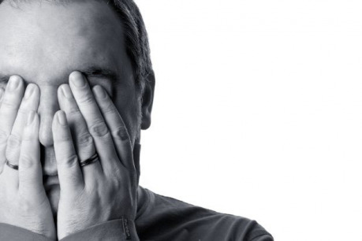
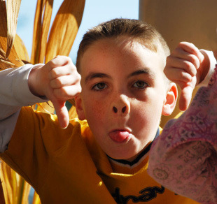
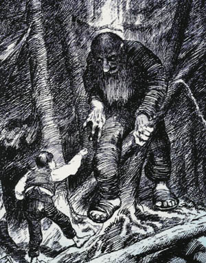
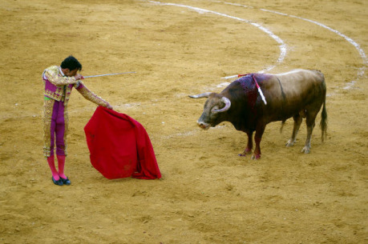

A pak přijde kritika. Někomu se to nebude líbit. Možná se to nikomu nebude líbit. Třeba se tím úplně znemožním a budu všem na věčné časy pro smích. Zažíváte tyto pocity? Bojíte se kritiky? Tak toho nechte! Kritiky se nemáte proč bát – s jakkoliv zdrcující kritikou se dá pracovat a vytěžit z ní poznatky, které vám pomohou udělat váš svět lépe. Nebojte se kritiky – využijte ji!

## Překonáváme strach z kritiky

Když jde o to předvést vlastní práci, jisté obavy jsou celkem přirozená záležitost. Chceme, aby se to lidem líbilo, a nevíme, jestli se jim to opravdu líbit bude. Pro mnohé z nás jsou tyto obavy poněkud silnější a přerůstají v až paralyzující strach. Přijdou vize totálního krachu, trapasu, ostudy na věčné časy a kdoví čeho ještě. To už není přirozené, dokonce ani opodstatněné, ale škodlivé a je třeba se s tím nějak vyrovnat. Každý se s tím vyrovnává po svém, ale docela dobře funguje, když si představíte, jak nejhůř by to mohlo dopadnout – protože pak můžete být jedině mile překvapeni.

Zkuste si představit, co nejhoršího by se mohlo po předvedení vašeho výtvoru stát. Pokud máte z kritiky opravdu strach, budete si to představovat stejně, tak to teď udělejte cíleně. A klidně to přežeňte. Pak si u každé té katastrofy, co vás napadne, odpovězte, co z toho plyne. Tedy nejen hrůzné následky, ale i to, co si z toho můžete odnést.

Zde jsou tak nejhorší věci, co se vám okolo předhození světa ke zkritizování mohou stát:

- Vaše dílo bude obecně přijato špatně – z reakcí vyčtete, co a proč se nelíbí, a můžete na tom zapracovat.
- Nikdo vám žádnou kritiku nedá – měli byste to zřejmě zkusit ještě někde jinde, nebo zmenšit porci ke kritizování.
- Sklidíte jen posměch – i kdyby, nebude to trvat věčně a celkem si z toho nemusíte dělat těžkou hlavu. Kdo nic nedělá, nic nezkazí.

Když se nad tím zamyslíte, tak tyto katastrofické scénáře vlastně tak hrozné nejsou. I kdyby se vám podařilo udělat tu nejpříšernější fantasmagorii na světě, i kdyby na vás nenechali nit suchou, tak vás to nijak neohrožuje. Přinejhorším vám to spoluautor hodí na hlavu, přátelé se tomu zasmějí a veřejnost se může třeba stavět na hlavu, aniž by vás to muselo trápit. Kdo z toho bude dělat problém kromě vás? Když si z toho nebudete dělat problém sami, máte po problému.

To pochopitelně není úplně jednoduché. Dělali jste to s láskou, nejspíš i hodně dlouho, a teď vám po tom nějaký hejhula dupe. I když si řeknete, že si to nebudete brát, nepotěší vás to. Jde ale o to tohle všechno překonat a prvním krokem je nedělat si z toho sám větší problém, než to ve skutečnosti je.

Vtip je v tom, že o kritiku nežádáte proto, aby vám to někdo pochválil, nebo abyste udělali dojem. Jde o to získat informace a jiné pohledy. Ať už by byla kritika sebevíc zničující, pořád bude obsahovat informace a indicie, ze kterých můžete těžit. Jen se nesmíte nechat zaskočit tím, že na vás třeba bude někdo ošklivý.

Jak vidíte, celkem není důvod se nějakého špatného přijetí obávat. Mimo to, že se při špatném přijetí nic tak strašného neděje, se totiž taky může stát, že bude váš výtvor přijat dobře. Ale to se může stát pouze v případě, že se o něj s ostatními podělíte, ne když budete jen vycpávat šuplík.

Tak se nebojte! :)

## Kdy a koho žádat o kritiku

O kritku můžete požádat v zásadě tři skupiny lidí, od každé však můžete očekávat něco jiného a každá žádá jinou úroveň zpracování.

První skupinou jsou __spoluautoři__. Ne vždy nějaké máme, ale když už je máme, můžeme jim předhodit jakýkoliv koncept nebo útržek, zpracovaný jen tak, aby měl nějakou hlavu a patu, a někdy ani to ne. Zpravidla také dostanete reakci nejrychleji a budete mít příležitost ji důkladně rozebrat. Háček je ale v tom, že spoluautoři budou mít nějakou svoji vizi, která bude alespoň v něčem podobná té vaší, ale nemusí se shodovat s tím, co chce vaše publikum. Že se to zdá dobré nebo špatné vám i vašim spolu­autorům, ještě nemusí znamenat, že to tak bude vidět i někdo další.

__Přátelé__ jsou jakýmsi mezičlánkem mezi spoluautory a publikem. Nemůžete jim předhodit kde co, ale musí to být už něco trochu ucelenějšího, ovšem v co nejmenším rozsahu. Nejsou na vašem díle přímo zainteresováni a mají často i velmi odlišný pohled na svět, ale podívají se na to už jen proto, že je to vaše dílo. Přátele nemůžete otravovat úplně se vším – mají i jiné starosti než se probírat vašimi výmysly. Předkládejte jim proto spíš věci, které už máte propracované, než pouhé nápady, koncepty nebo první verze.

Přátelé vám ale často na rovinu neřeknou, že se jim něco nelíbí (i když je o to přímo požádáte) a mají tendenci reagovat spíše pozitivně (nebo vůbec). Přesto vám mohou poskytnout mnoho důležitých poznatků a z jejich reakcí si můžete udělat obrázek, jak by mohlo s trochou štěstí reagovat publikum (počítejte ale spíš s horším přijetím).

__Publikum__ čili lidé, co neznáte. Úplně cizí lidé, o kterých si myslíte, že by je váš výtvor mohl zajímat. Svůj výtvor jim musíte prezentovat tak, aby je hned na začátku zaujal a měli chuť se probrat až do konce tím, co jim předkládáte. V podstatě by to mělo být už téměř hotové. Kritika od publika bývá nejupřímnější (a i nejdrsnější), a pokud tvoříte pro publikum, tak je i nejdůležitější.

## Jak na kritiku reagovat

To, jakou zpětnou vazbu dostanete, nezávisí jen na tom, co předložíte, komu to předložíte a jak dobře to podáte. Jde i o to, jakým způsobem budete na kritiku reagovat. Abyste dostali co nejvíce informací a neudělali ze sebe blbce, je vhodné držet se následujícíh pravidel:

1. __Ničím se nenechte zaskočit.__ Lépe se to píše, než dělá. Budete zírat, v čem všem se bude publikum šťourat a co vám otlučou o hlavu. Zdánlivě jasné věci budou pro mnohé nepřekonatelnou záhadou. Budou si to vykládat jinak, než jste to mysleli. Dokonce se může stát, že narazíte na lidi, co budou prvoplánově napadat nejen vaše dílo, ale i vás bez zjevného důvodu. A stát se může i řada jiných nepředvídatelných věcí. Nesmíte se tím ale nechat vyvést z míry a musíte zachovat chladnou hlavu, jak jen to bude možné. Stojí na tom i další pravidla...

1. __Nikdy se s nikým nehádejte.__ Lidé mají různé názory a mohou se i mýlit. Když z vás k tomu ještě dělají blbce, je snadné přejít do protiútoku a rozpoutat hádku. Tomu se snažte za každou cenu předejít. Nejde o to, že uděláte špatný dojem na dotyčnou osobu, ale i každého, kdo se k hádce dostane. Na internetu to může být kdokoliv a hádka navíc zůstane někde zaznamenána na další dlouhé roky. To je reklama, kterou rozhodně nepotřebujete.

V situaci, která hrozí přerůst v hádku, se řiďte zlatým pravidlem „mlčeti zlato, mluviti stříbro, křičeti průser“. Mlčet není vždy nejlepší řešení, zvlášť když se protistrana domáhá odpovědi. V takovém případě se omezte na krátké, stručné a co nejjasnější odpovědi. Nezabíhejte příliš do detailů, jinak se v tom zamotáte.

Hlavně se vyvarujte reakcí na osobní útoky i osobní otázky, které se jako útok nejeví. Soustřeďte se pouze na debatu týkající se předloženého materiálu a při té se nesnažte o obhajobu. Pouze se ptejte, nebo dovysvětlujte, ale neospravedlňujte ani sebe, ani svůj výtvor.

1. __Za žádnou cenu nikoho nenapadejte.__ Na interetu je nespočet diskusí, ve kterých někdo s něčím přijde, ostatní se k tomu nestavějí tak, jak by si představoval, a tak se autor rozhodne dát najevo, že on má pravdu, a kdo si myslí něco jiného, je idiot, nevyzrálý puberťák, neschopa, co nikdy nic nedokázal, smějící se hyena, co umí jen kritizovat, troll, blbeček, který tomu ale vůbec nerozumí a svým vstupem se jen ztrapňuje. Ve skutečnosti se ale ztrapňuje jen ten, kdo se k těmto osobním útokům sníží. Nerozšiřujte jejich řady.

1. __Nemusíte odpovědět na vše.__ Technicky vzato, nemusíte odpovídat na nic, ale to také není moc dobré. Zejména, pokud svůj výtvor předhodíte na internetu, může se stát, že budou přibývat komentáře (a dotazy) rychleji, než zvládnete psát odpovědi. V takovém případě odpovídejte jen na ty nejzajímavější, nejpodstatnější, případně jednodušší dotazy. Je lepší zodpovědět půlku dotazů pořádně, než každý zvlášť jen tak, aby se neřeklo. Kvalita vaší odpovědi se neměří její rychlostí.

Další věcí je, že se dotazy můžou týkat něčeho, co v předloženém materiálu není. Třeba něčeho, co ještě zveřejnit nechcete, nebo to nemáte dost rozpracované, abyste mohli pořádně odpovědět, nebo zkrátka nevíte. Pak by vaše odpověď měla být v tom duchu. „O tom se zatím nechci příliš bavit, bude se to řešit v příštím vydání“, nebo „tohle je zatím dost otevřené a ještě se uvidí, co z toho bude“, nebo „na tohle nedokážu odpovědět“, či zkrátka „nevím“.

Pak je celá řada otázek, na které je lépe neodpovídat. Například „proč ve tvém světě nejsou Jediové“, „jaká je průměrná výška elfů“, či pseudoinvestorské dotazy typu „kdo je cílová skupina“ a podobně. Když si dáte tu práci a odpovíte tak, abyste se do toho nezamotali, nijak vám to nepomůže. Pokud se do toho ale zamotáte, uškodíte si. V každém případě se ale připravíte o čas, který byste mohli věnovat odpovědím na jiné otázky, zpracovávání kritiky, nebo něčemu úplně jinému.

1. __Nekrmte trolly.__ V dostatečně velké skupině lidí se vždy najde někdo, kdo se vás bude v první řadě snažit vytočit. Nepřistupujte na jejich hru. Nenechte se vytočit. Držte se především předchozích pravidel.

1. __Nebojte se zeptat.__ Když nerozumíte tomu, co má druhý na mysli, zeptejte se. Pokud je kritika příliš strohá a není jasné, co že je vlastně dobře nebo špatně, požádejte o hlubší rozbor. Poměrně často pak dostanete informace, ze kterých si už můžete něco vzít.

1. __Nepřesvědčujte o své pravdě.__ Pokud máte pocit, že si někdo udělal názor na základě omylu, můžete se pokusit to uvést na pravou míru. Když ale někdo nesouhlasí, nerozmlouvejte mu to. Názory se různí a vehementním přesvědčováním se do toho jen zbytečně zamotáte.

1. __Za věcnou kritiku se děkuje.__ Každá kritika, která je alespoň trochu k věci, je cenná. Je proto namístě za ni poděkovat, a to i v případě, že vás zrovna nechválí.

1. __Nebuďte neomylní.__ Každý občas šlápne vedle, ne každý to ale dokáže uznat. Nebojte se přiznat chybu – zapůsobí to lépe, než když se budete snažit chybu zamaskovat a tvářit se, že žádná není.

## Práce s kritikou

Kritiku už bychom měli, nyní je třeba ji zpracovat. Připomínky, které dostanete, je v drtivé většině možné rozdělit do tří kategorií – faktické chyby, záležitosti vkusu a srovnávání. Toto prvnotní třídění vám usnadní následnou práci, protože ve své podstatě určuje i důležitost té které připomínky.

__Faktické chyby__ jsou logické rozpory, nebo nekonzistence, ale můžeme sem řadit i špatnou srozumitelnost. Jsou nejvýznamnější, protože by tu prostě být neměly, a tak byste se na jejich řešení měli zaměřit v první řadě. Když si něco odporuje, jednou je to tak a po druhé jinak, případně je to tak složité nebo zmateně podané, že jen málokdo pochopí, co jste tím chtěli říct, je to špatně. Nemá cenu to zastírat, je to prostě tak. Přiznejte chybu – především sami sobě. A hlavně vymyslete, jak to napravit. Vždycky to nějak jde a opravením faktických chyb uděláte kolikrát víc, než když vymyslíte dalších deset úžasných věcí.

Ještě zdůrazním, že faktická chyba je i to, že vám to sice logicky funguje, ale ze způsobu, jakým je to podané, se většině lidí zdá, že to tak nefunguje. Prostě to nechápou. To, že tomu publikum nerozumí, nemusí (a zpravidla nebývá) tak docela jeho vina. Zkuste to podat jinak, k něčemu připodobnit, nebo to celé zjedodušit. Aby váš svět alespoň těsná většina lidí správně chápala, je jedna z nejdůležitějších věcí. Bez toho vaše geniální logické konstrukce, vymazlená konzistence a neotřelé myšlenky nikoho neosloví a váš svět zmizí v propadlišti dějin jednoduše proto, že zůstane nepochopen.

__Záležitosti vkusu__ je dobré sledovat, ale není dobré se jimi vždy řídit. Kolik lidí, tolik chutí. Na druhou stranu, pokud se něco výrazné většině lidí nelíbí, je to jistý signál, že toto může být ve vašem světě slabé místo. Když bude ve vašem světě třeba působit kult provádějící dětské oběti, k tomu ještě nějakým zvlášť ohavným způsobem, můžete vzít jed na to, že to pro řadu lidí bude červená, nebo dokonce červený hadr. Můžete se s tím smířit, nebo tomu alespoň trochu předejít (třeba že nebudete citlivé téma příliš rozmazávat), případě se takové třecí plochy zbavit úplně. Pokud je vaším cílem úspěch před širokým publikem, v podstatě vám nic jiného nezbude. Je ovšem na vás, jestli jste ochotni takovou cenu zaplatit.

Do záležitostí vkusu spadají i méně podstatné věci, které jsou ve své podstatě jen žabomyší války. Třeba elfové. Pro spoustu lidí je přítomnost elfů ve fantasy světě jednoznačně plus. Jiní z elfů dostávají kopřivku. Zde se opět vyplatí pouze sledovat, jaký je poměr mezi oběma tábory, a také to, kolika lidem je to jedno. Když se 10 lidem elfové líbí a jednomu nelíbí, pak elfové jednoznačně vedou. Pokud je k tomu ale dalších 50 lidí, kterým je to fuk, nemá příliš smysl se elfí otázkou zabývat a na současném stavu (ať je jakýkoliv) něco měnit.

__Srovnávání__ je celkem přirozený, ovšem do značné míry nepříjemný proces. Každý, komu svůj svět předložíte, ho bude poměřovat s tím, co už někde viděl. Téměř jistě se setkáte s tím, že někdo prohlásí „to je jako X“, kde X může být jakýkoliv film, kniha, hra nebo jiné dílo, dokonce i takové, o kterém jste nikdy neslyšeli. Často také uslyšíte nejen, že je to „jako X“, ale že to „je inspirováno X“ nebo že „kopíruje X“, či přímo „vykrádá X“.

S ohledem na pravidlo reakcí na kritiku číslo 7 nikoho příliš nepřesvědčujte, že to tak není, ani se to nesnažte nijak obhájit. Zaměřte se místo toho na to, jak moc je to či ono shodné se svým „dvojčetem“ a jestli je to skutečně na závadu. Je čistě na vás, jak se k tomu postavíte. Podobnost může být do jisté míry přínosná, ale nesmí toho být příliš. Když bude váš svět působit jako jedno velké déjà vu, nikoho příliš neohromí.

Dalším druhem srovnávání je skutečné poměřování. „X má to a to lepší“ nebo „X má tohle a tady to není“ atd. K těmto připomínkám je dobré přistupovat jako k jakémusi průzkumu konkurence. Může vás upozornit na místa, ve kterých jiné světy „vedou“, ale není dobré se snažit být ve všem lepší, nebo (nedej bože) mít všechno, co má X, nebo ještě víc. O tom jsme si nakonec říkali [v předminulém díle](http://drakkar.rpgplanet.cz/vydani/cerven-2013-38), když jsme řešili správnou míru.

Kritiku, ať už spadá do kterékoliv z předchozích kategorií, není dobré držet v hlavě. Pokud své dílo předložíte dostatečnému počtu lidí, ani to nejde. Zejména věci vkusu a srovnání si poznamenávejte, ideálně i s poznámou, jak často a od kolika lidí se tyto připomínky objevují. Faktické chyby se snažte řešit pokud možno hned, a když to nejde, zaznamenejte si je tak, abyste na ně nezapomněli. Právě faktické chyby totiž patří mezi největší vady na kráse.

Důležité ovšem je – a to nejen v této fázi – nefiltrovat připomínky podle toho, jak se vám líbí. Třeba tak, že budete přikládat daleko větší váhu názorům, které se shodují s vašimi, a ty ostatní odhodíte jako nepodstatné. Nebo že tohle je snadné, tak to tak uděláme a tohle je moc práce, tak to nebudeme řešit. To není dobře.

Jestli si chcete brát jen to, co se vám hodí, pak vám kritika příliš nepomůže. Právě z toho, co se vám úplně nehodí do krámu, se dá totiž zjistit nejvíc o slabinách vašeho výtvoru a často se i samo nabídne řešení, jak se s těmito slabinami poprat. Nemusíte nakonec zapracovat všechno – ani byste neměli. Přesto je dobré se nad vším, co vám kritici předhodí, alespoň zamyslet. I věci, co se rozhodnete nereflektovat, vám tak mohou dát nové nápady a úhly pohledu. A to rozhodně není k zahození.

## Závěrem

Shrnuto do několika vět, nežádejte o kritiku, dokud nemáte materiál hodný kritiky. Když už to má hlavu a patu, není to moc dlouhé a dá se to dobře přečíst, nebojte se a ptejte se lidí na jejich názor. Spíš poslouchejte a nesnažte se je příliš přesvědčovat o opaku. Ať už dostanete kritku jakoukoliv, soustřeďte se na to, co vám sděluje, ne jak to sděluje. Kritiku si rozškatulkujte na faktické chyby, věci vkusu a srovnání a podle toho s nimi naložte.

Pamatujte, že nemáte patent na pravdu a kritika vám přináší jiné pohledy na věc. Čím víc, tím lépe. S její pomocí můžete svůj svět udělat lepším, než je právě teď, a to je také důvod, proč o kritiku žádat. Současně ale nezapomínejte, že ani žádný kritik nemá patent na pravdu a nakonec je vždy na vás, jestli a jak budete připomínky reflektovat. Kritika, ať už je pozitivní nebo negativní, vždy znamená, že někoho váš výtvor zaujal natolik, aby se jím alespoň trochu zabýval a napsal, co si o tom myslí. Je sice pravda, že kritizovat dokáže každý, ale ne vždy se někomu chce. Proto si kritiky važte a snažte se z ní vytěžit co nejvíc. To, že vám dílo někdo pochválí, je jistě příjemné, ale určitě to není důvod, proč jste o nějakou kritiku žádali.

O kritiku si žádejte opakovaně – pokud možno ne stále stejné lidi. Tak dlouho, dokud váš svět nebude jako vybroušený diamant, a ani potom nebuďte k ohlasům hluší. Smiřte se s tím, že budete potřebovat řadu věcí znovu a znovu upravovat, předělávat a přistupovat k nim z různých směrů. To je samozřejmě spousta práce, která přináší jen málo viditelné (přesto velmi důležité) výsledky.

Spousta práce s málem výsledků začne být brzy úmorná. Počáteční nadšení dříve či později vyprchá a nápady časem přestanou chodit v takovém množství, jak bychom si představovali. Spousta lidí tu končí a jejich světy pak končí v lepším případě v šuplíku, v horším případě v koši. Nemusí tomu tak ale být. V příštím díle si proto povíme pár triků, jak si dodat ždibec kreativní energie a projít z pokročilé fáze tvorby k nějakému použitelnému výsledku.
