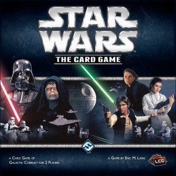
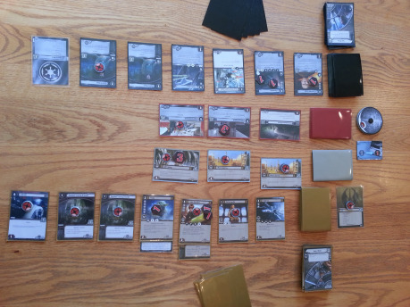
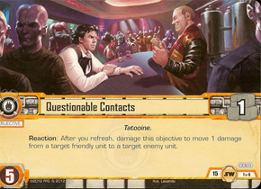
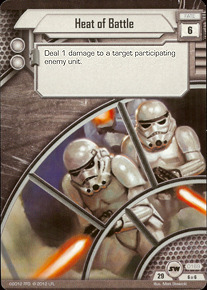
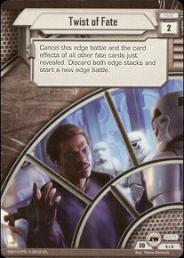
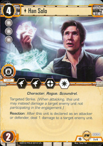
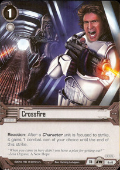
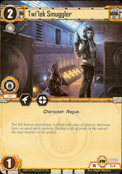
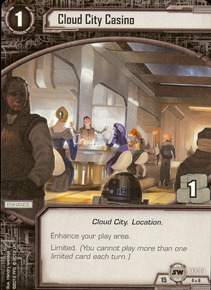
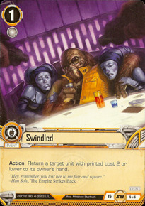

Fenomén Hviezdnych vojen si už dlhé desaťročia drží svoju popularitu. Bol využitý v snáď každej forme známej človeku (vrátane mydla či [psích kostýmov](http://www.petco.com/product/122959/STAR-WARS-Yoda-Dog-Hoodie.aspx)), zberateľské kartové hry nie sú žiadnou výnimkou. Ako sa licencia presúvala medzi rozličnými spoločnosťami, vzniklo postupne viacero hier – Star Wars CCG, Young Jedi CCG, Jedi Knights CCG, potom Star Wars TCG, a najnovšie Star Wars LCG. O každej z nich by sa dalo rozprávať (aj keď by to často porušovalo pravidlo „o mŕtvych len dobre“), dnes sa budeme venovať najnovšej inkarnácii z dielne Fantasy Flight Games.

Star Wars: the Card Game patrí do rodiny tzv. živých kartových hier, podobne ako [Call of Cthulhu](http://drakkar.rpgplanet.cz/deskove-hry/call-of-cthulhu-the-card-game) či [Android: Netrunner](http://drakkar.rpgplanet.cz/deskove-hry/android-netrunner), o ktorých sme písali v predošlých číslach. Ide teda o hru, ku ktorej pravidelne vychádzajú nové karty, tie sa však predávajú v mini-expanziách, ktorým sa v tejto hre hovorí _Force Pack_.

## Ako to funguje

Star Wars je asymetrická hra, v ktorej majú hráči nielen k dispozícii rozličné karty (ako sa dá koniec-koncov očakávať), ale aj rozličné ciele, o ktoré sa snažia. Svetlá strana sa snaží zvrhnúť vládu teroru zničením dostatku kľúčových cieľov, skôr ako bude temná strana príliš „usadená“ na to, aby sa už nikto z občanov galaxie neodvážil postaviť v otvorenej vzbure.

Každý hráč ma dva balíčky – v jednom sú tzv. _objectives,_ v druhom karty ktoré bude hrať počas partie na stôl. _Objective_ reprezentuje dôležitý cieľ, ktorý dáva hráčovi zdroje a na ktorý môže protivník útočiť. Ak svetlá strana zničí tri tieto ciele, vyhráva. Čas, ktorý na to má, je však veľmi obmedzený – temná strana má počítadlo Hviezdy smrti (_„Death Star Dial“_). Toto začína na nule, na začiatku každého ťahu temnej strany sa však zvýši o jedna. Každý objective, ktorý sa temnej strane podarí zničiť, taktiež zvýši počítadlo o toľko bodov, koľko objectivov dovtedy temná strana zničila. Akonáhle počítadlo dosiahne 12, čas uplynul a temná strana vyhráva.

Objectivy a niektoré iné karty majú na sebe symbol prepraviek s číslom. Toto číslo reprezentuje, koľko zdrojov na platenie kariet je odtiaľto možné dostať. Ako sa odtiaľ dostávajú? Tým sa dostávame k najzaujímavejšej vlastnosti tejto hry.

Vo väčšine kartových hier sa totiž zdroje, ktoré má hráč k dispozícii, budujú postupnou krivkou – spočiatku sa dajú vyložiť iba lacné karty a až postupne si vie hráč dovoliť naozajstných „ťažkotonážnikov“. Toto v Star Wars LCG celkom neplatí – dôvodom je unikátny systém nakladania žetónov vyčerpania na jednotlivé karty, čím je možné ju zo zdrojov „vyťažiť“ na viacero kôl dopredu. Ak mám teda vyloženú kartu, ktorá mi vie poskytnúť až tri zdroje, môžem si všetky tri vybrať naraz (čo mi môže umožniť vyložiť veľmi drahú kartu napríklad hneď v prvom kole). Ale pozor! Z každej karty na stole ubúda iba jeden žetón za kolo a navyše, žetóny sa smú nakladať iba na karty, ktoré na sebe žiaden žetón nemajú. Ak teda zoberiem zo spomínanej trojzdrojovej karty v jednom kole všetky tri zdroje, bude trvať tri kolá, kým z nej budem môcť opäť ťažiť. Preto je v Star Wars LCG často možné vyložiť veľkú jednotku ako napríklad Darth Vader v prvom kole, cenou za to je však niekoľko nasledujúcich kôl, počas ktorých bude mať hráč k dispozícii zdrojov naopak veľmi málo.

Hra obsahuje za každú stranu tri frakcie, pričom keď vykladáte kartu, musíte aspoň jeden zo zdrojov zaplatiť z karty „tej správnej farby“. Každý hráč pritom začína s jedným zdrojom podľa vlastného výberu – na stole máte od prvého kola nielen tri objectivy, ale aj kartu príslušnosti ku frakcii (z ktorej je možné ťažiť každé kolo 1 zdroj). Vďaka tejto karte je potom možné rozumne hrať „dvojfarebné“ balíky, kde má hráč z jednej z frakcií iba veľmi málo kariet.

Tak, už vieme ako sa karty jednotiek (teda postavy, vozidlá a lode) dostanú na stôl. Čo sa s nimi bude diať potom? Samozrejme, keďže sa tu bavíme o Hviezdnych _vojnách,_ budú na seba navzájom útočiť!

Ako sme už spomínali, každý hráč má pred sebou vyložené tri karty objectivov. Potom, ako vo svojom kole vyložíte všetky karty, čo ste chceli, nastáva tzv. _fáza konfliktov_. Hráč, ktorý je na ťahu, môže spustiť útok na niektorý zo súperových objectivov. Môže postupne zaútočiť viackrát, na každý vyložený objective však iba raz za kolo. Každý z útokov sa najprv celý vyhodnotí a uzavrie, až potom je možné ohlásiť ďalší útok. Pri vyhlásení útoku najprv útočník, potom obranca ohlásia, ktoré jednotky posielajú do boja a potom nasleduje bluffovacia minihra menom _boj o prevahu_ („edge battle“). Ako to bude fungovať?

Každá karta má na sebe nakreslený určitý počet ikoniek Sily, ktoré určujú nakoľko hodnotná je daná karta za účelom získania výhody v bitke. Hráči sa budú striedať v kladení kariet z ruky zakryto na stôl. V momente, keď už ani jeden z hráčov nechce pridávať ďalšie karty, kôpky sa otočia a spočítajú sa. Hráč, ktorý položil na stôl viac ikoniek získava prevahu, ktorá posilní niektoré jeho jednotky a umožní mu prvému zaútočiť v nastávajúcom boji . Karty, použité na boj o prevahu sa následne odhodia, ich ostatné efekty sa nevyhodnotia – výnimkou sú tzv. karty osudu (_fate cards_), ktoré je naopak možné zahrať iba počas boja o prevahu a vtedy navyše k ikonkám prispejú aj efektom, často veľmi zásadným. Existuje napríklad karta, ktorá celý práve prebiehajúci boj o prevahu zruší a spustí nanovo – preto častokrát jednoduché „nahádzanie čo najviac ikoniek bez rozmyslu“ rozhodne nie je správnym postupom!

Keď už je rozhodnuté, kto má v bitke prevahu, začína prestrelka!

Začínajúc hráčom s prevahou, hráči budú postupne na striedačku vyberať svoje jednotky v boji a vyhodnocovať ich útoky. Ako však bude takýto útok jednotky vyzerať?

Zavolajme si na pomoc starého kamaráta, najspoľahlivejšieho pašeráka široko-ďaleko, Hana Sola (ktorý vždy strieľa prvý!):

Pod obrázkom vidíme štyri ikonky – sú rôznych typov a jedna z nich má navyše biele pozadie... čo sa to tu presne deje? Ikonky s čiernym pozadím má jednotka vždy, ikonky s bielym pozadím iba v bitkách, kde hráč vyhral boj o výhodu. Vždy, keď jednotka vyhodnotí svoj útok, každá z ikoniek ktoré momentálne má spraví nasledovnú vec:

- Ikonka blasteru značí, že táto jednotka udelí jednej oponentovej jednotke v tejto bitke jedno poškodenie. Ak má jednotka viacero ikoniek blastru, musí všetky poškodenia naložiť na ten istý cieľ. Akonáhle má jednotka toľko poškodení, koľko má životov, je zničená
- Ikonka terčíku (symbol vyčerpania) umožňuje jednotke naložiť jeden žetón vyčerpania na akúkoľvek nepriateľskú jednotku na stole. Môže tak nielen zabrániť nejakému nepriateľovi vyhodnotiť svoj útok, ale dokonca môže takto „vypnúť“ aj jednotku, ktorá sa tohto boja nezúčastňuje (čím jej zabráni zúčastniť sa iných bojov v tomto kole) či naložiť žetón aj na jednotku, ktorá už žetón na sebe má, čím ju vyčerpá na viacero kôl dopredu!
- Ikonka výbuchu udelí jedno poškodenie nepriateľskému objectivu, o ktorý sa práve bojuje. Táto ikonka má teda efekt iba počas útoku na nepriateľský objective, pri obrane nič nerobí

Keď sa pozrieme na Hanove ikonky, vidíme že môže byť pre nepriateľa nočnou morou – ak získa výhodu, dokáže sám pravdepodobne zneutralizovať dve nepriateľské jednotky (jednu zastrelí, druhú vyčerpá) a ešte aj poškodí objective, na ktorý útočí. Aspoň už vieme, čo v ňom tá princezná vlastne videla...

Po vyhodnotení útoku jednotky sa na ňu naloží žetón a bitka končí v momente, keď už majú všetky zúčastnené jednotky na sebe naložené žetóny vyčerpania. Ak obrancovi na konci bitky nežijú žiadni obrancovia (či už preto, že všetci biedne zhynuli, alebo preto, že sa neobťažoval tam nikoho ani len poslať), dostane objective ešte jedno poškodenie navyše. Tým je boj ukončený a hráč, ktorý je na rade, môže prípadne vyhlásiť ďalší útok na iný z objectivov. Keď sa minú útočníci alebo ciele, prechádza kolo hráča do poslednej fázy, ktorou je _Zápas o rovnováhu Sily_.

Každý hráč má možnosť poslať až tri svoje vyložené jednotky do tohto zápasu, ktorý reprezentuje snahy v zázemí – organizovanie odboja, politizovanie a podobne. Takáto jednotka sa naďalej normálne zúčastňuje hry, s jednou výnimkou: keď vyhodnotí svoj útok v nejakej bitke, dostane extra žetón vyčerpania. Jednotku, ktorá bola takto raz poslaná do zápasu o silu, už nie je možné vrátiť – aby sa uvoľnilo jej miesto, musí najprv zomrieť, až potom môže na jej miesto nastúpiť niekto iný. Treba si preto dobre rozmyslieť, koho do tohto zápasu pošlete.

Na záver kola teda najprv môže hráč, ktorý je na ťahu poslať do Zápasu o Silu ďalšie jednotky (ak má momentálne v zápase menej ako tri), následne obaja hráči spočítajú počet ikoniek Sily na všetkých svojich nevyčerpaných jednotkách v zápase. Kto má viac, na toho stranu sa prikloní Sila v ďalšom kole. V prípade rovnosti ostáva Sila s tým, s kým bola v predošlom kole.

„No dobre,“ poviete si, „čo mi to ale dá? Aby som túto výhodu získal, musím niekoľko svojich jednotiek prakticky nepoužívať. Čo môže byť také skvelé, že sa to oplatí?“ Odpoveď je jednoduchá:

- Ak hráte za temnú stranu a na začiatku vášho kola je Sila s vami, stúpne počítadlo Hviezdy smrti o jeden extra bod. Ak by ste teda po celú hru udržali Silu u seba, stačí sa vám ubrániť 6 kôl a vyhrali ste!
- Ak hráte za svetlú stranu a na začiatku vášho kola je Sila s vami, môžete jednému súperovmu objectivu udeliť jedno poškodenie zadarmo. Keďže jediný spôsob, ako vyhrať, je pre vás zničiť tri objectivy, je toto veľká výhoda. Omnoho väčšou výhodou je však, že súper nebude získavať svoju výhodu a teda Vám nebude čas plynúť dvakrát rýchlejšie!

Zápas o Silu vytvára v rámci partie (ďalšiu) zaujímavú mini-hru, keďže Sila začína u hráča svetlej strany, ale prvé kolo (a teda aj prvú príležitosť strhnúť rovnováhu k sebe) má hráč temnej strany. Vzniká tak od prvého kola napätie a zápas, ktorým je táto hra aj v iných aspektoch doslova prešpikovaná.

Potom, ako sa rozhodne, na čej strane bude rovnováha Sily počas budúceho kola, končí hráčovo kolo a ide jeho protivník. Takto sa budú hráči striedať, počítadlo Hviezdy smrti bude stúpať, objectivy budú vybuchovať, až hra skončí víťazstvom jednej zo strán.

## Stavanie balíkov

Tak, teraz už viete ako hra funguje. Ešte stále však neviete jednu vec, ktorou je oproti iným zberateľským či živým kartovým hrám unikátna. Touto vecou je skutočnosť, že keď si staviate balík, karty doňho nedávate jednotlivo, ale v tzv. sadách. Každá sada obsahuje jeden objective a päť kariet do balíka. Jedna zo sád vyzerá takto:

To znamená, že ak chcem mať v balíku Hana, musí jeden z mojich objectivov byť Questionable Contacts, a taktiež bude môj balík obsahovať ostatné karty z tejto sady. Je to prístup, na jednej strane limitujúci (možno by som chcel hrať Crossfire, ale nemám v skutočnosti záujem o Hana), na druhej strane tématický (nemôžem si do balíku vybrať len tie najsilnejšie karty, bude obsahovať väčšie tématické celky) a uľahčuje stavbu balíkov začiatočníkom. Je totiž takmer nemožné postaviť balík, ktorý bude nefunkčný kvôli základným nedostatkom ako primálo zdrojov či nedostatok jednotiek – každá sada obsahuje zopár postáv, nejaké tie zdroje a nejaké efekty na prekvapenie súpera.

## Výhodya nevýhody

Pravidlá stavania balíkov sú hlavným dôvodom, prečo by som Star Wars: the Card Game odporučil hlavne ľuďom, ktorí zatiaľ so svetom kartových hier nemajú žiadne (alebo skôr malé) skúsenosti. Starých „veteránov“ ako som ja často pri stavbe balíku znechuťuje pocit, že mám umelo zviazané ruky a tieto pravidlá mi zabraňujú hrať sa s ezoterickými kombináciami a neštandardnými balíkmi. Na druhú stranu, ľahkosť s ktorou sa balíky stavajú aj bez dokonalej znalosti všetkých existujúcich kariet je super – hra, v ktorej funguje prístup „Vyberiem si 10 cool vyzerajúcich kariet a tým mi vznikne funkčný balík, s ktorým môžem hrať“ je rozhodne veľmi priateľská.

Druhým problémom, spôsobeným týmto prístupom je príliš malá rozdielnosť rozličných balíkov. Tento problém bol pomerne extrémny, kým z hry existovala iba základná krabica, s postupným vychádzaním rozširujúcich balíčkov sa našťastie trochu zmierňuje. Stále však je veľmi nepríjemné, že dve z frakcií hry (jedna svetlá, jedna temná) sa iba so základnou krabicou prakticky nedajú hrať, pretože krabica obsahovala pre každú z nich iba jednu sadu. Našťastie prednedávnom vyšla deluxe expanzia, ktorá sa zameriava práve na tieto dve frakcie a robí ich plne hrateľnými. Stále však treba tento jav mať na pamäti a za skutočný základ na vyskúšanie hry nepovažovať iba základnú krabicu, ale aj krabicu s deluxe expanziou.

## Expanzie – čo už vyšlo a plány do budúcnosti

Momentálne má hra za sebou ukončenie prvého cyklu rozširujúcich balíčkov (v tejto hre zvaných _Force Pack_), zameraného na planétu Hoth a boj o ňu. Okrem tohto cyklu vyšla už spomínaná deluxe expanzia _Edge of Darkness_, ktorá je zameraná na podsvetie sveta Star Wars – nájdete v nej také karty ako je Jabba the Hutt, Millenium Falcon, Lando Calrissian či obľúbený zelený lovec odmien Greedo (ktorý __celkom určite__ nestrieľal prvý).

Ako ďalší cyklus je oznámený _Echoes of the Force,_ ktorý sa má zameriavať na Silu a boj o ňu. Fanúšikov rozšíreného univerza Star Wars poteší, že sú potvrdené jednotky ako Kyle Katarn (ak neviete, kto to je, okamžite sa začnite hanbiť a následne si choďte zahrať počítačovú hru Jedi Knight 2) a Mara Jade (v podstate platí predošlá poznámka, akurát vás namiesto za počítač pošlem do kníhkupectva – hľadáte vynikajúcu _Thrawnovú trilógiu_ od Timothyho Zahna). To znamená, že Fantasy Flight sa pri ďalšom rozvoji hry plánuje naplno venovať práve bohatému univerzu, ktoré okolo Star Wars vzniklo, na rozdiel od predošlých kartových verzií Star Wars, ktoré používali namiesto ilustrácií fotografie z filmov a tzv. rozšírené univerzum prakticky úplne ignorovali.

Ak ste doteraz čítali pozorne, určite vám neuniklo, že Star Wars: the Card Game je určená iba pre dvoch hráčov. Toto je vec, ktorú zmení práve ďalšia ohlásená deluxe expanzia menom _Balance of the Force,_ ktorá bude zameraná práve na hru viacerých hráčov. Bude poskytovať dve možnosti – jednak pravidlovú podporu pre hru štyroch hráčov, kde hrajú proti sebe dva tímy po dvoch, jednak dva špeciálne scenáre, kde môžu svoje sily spojiť až traja hráči proti jednému. Ten bude hrať za špeciálny balík – buď bude stavať druhú Hviezdu Smrti, alebo bude hrať za Luka Skywalkera, ktorý uniká “spravodlivosti“ a pôsobí ustanovenému poriadku extrémne potiaže.

## Záverom

{:.sidebar}
Není-li uvedena licence, jsou obrázky k tomuto článku užity jako citace pro účely recenze (~_fair use_).

Máme za sebou predstavenie hry, ktorá síce nepatrí medzi mojich absolútnych favoritov (na to obsahuje primálo zelených chápadiel a kybernetickej kriminality), ale je zábavná, má atraktívnu tématiku a atraktívne vyhliadky do budúcnosti. Ak ste fanúšikom Hviezdnych vojen, neváhajte a vyskúšajte si ju!
