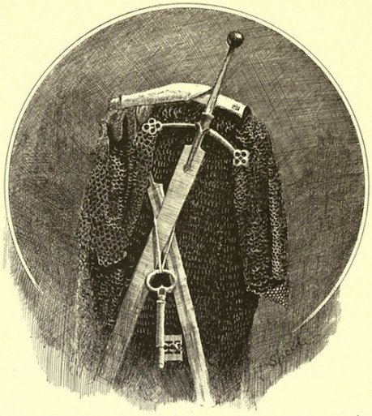

> Nie je to tak dávno, čo sme pochovali starého kráľa a našeho otca. Len nemnohí za ním uronili slzu. Poklady, čo za svojho života nazhromaždil, sme si s bratmi rovným dielom rozdelili. Kiež by sme počúvli jeho poslednú vôľu a do hrobky uložili jeho meč. Teraz by sme žili spokojným životom a užívali ríšu, ktorú nam odovzdal.
>
> Bratia sú už po smrti, dostali ich noční jadzci. Každú noc vychádzajú z otcovej hrobky a hľadajú ten prekliaty meč. Keby som tak tušil, kde mu je koniec.
>
> Nepomohli stráže, nepomohli čarodeji a dokonca ani najatí dobrodruhovia. Teraz som na rade ja. Už nemôžem ani spať, ako ich každu noc očakávam...

Martin „Mytko“ Mýtny bol členom vývojového tímu DrD2 a jedným z autorov mechanickej podoby pravidiel.

## Problémy určovania sudby

Určovanie sudby má podľa mna niekoľko problémov, ktoré spôsobujú že jej použitie nemusí byť úplne intuitívne a vyžadujú od PH cvik a cit pre príbeh. Kameňom úrazu je, že na rozdiel od hráčov PH nemusí so sudbou nijak hospodáriť. Pravidlá síce radia, aby sa nesnažil v každom konflikte minúť všetkú sudbu, ale žiadnym spôsobom ho k tomu nemotivujú. Základom pravidiel pritom je spravovanie zdrojov, ktoré majú hráči k dispozícii. Následne potom proti sebe stoja hráči s obmedzenými zdrojmi a rozhodujú sa nielen na základe toho, čo sa deje teraz, ale musia myslieť aj na budúcnosť, a PH s virtuálne neobmedzenými zdrojmi a bez motivácie nejak s nimi šetriť do budúcna. Iste, rozumný PH s citom pre hru vie poskytnúť ostatným hráčom aj napriek tomu adekvátnu výzvu, ale prečo nepodať pomocnú ruku aj PH, ktorý ten cit ešte vypestovaný nemá a chce sa oprieť o pravidlá.

### Zem kostí

_Od sútoku Vratky a Lužice až po Biele vrchy leží zem nikoho, posiata ruinami dávno zaniknutej ríše. Chamtivosť a vidina pokladov z času na čas príláka bláznov a dobrodruhov, ale nik z nich sa nevratil. Len zopár tulákov a putníkov rozpráva príbehy o tom ako z druhého brehu videli prízračných jazdcov brázdiť krajinu._

__Nebezpečnosť:__ 12

__Charakteristika:__ „Prízračný kráľ žiarlivo stráži všetky poklady svojej zeme“, „V zemi leží bezpočet kostí pripravených poslúchnuť volanie svojho pána“, „Všetky cesty vedú pred panovníkov trón“

Druhým problémom je nedostatok návodov ako zohľadniť pri určovaní sudby predchádzajúce úspechy a neúspechy postáv. Podľa pravidiel je množstvo sudby určené len počtom nepriateľov a poradím v akom prichádzajú na scénu. Následkom poľahky môže byť deformácia príbehu v prospech optimalizácie množstva sudby, čo je tak trochu v rozpore s deklarovaným zámerom hry odzrkadolovať a popisovala herný svet a dianie v ňom.

## Nebezpečnosť

Postavy sa pri hre obyčajne pohybujú v nebezpečnom prostredí a čelia jeho nástrahám. Z toho dôvodu aj konflikty, do ktorých sa postavy dostávajú sú naviazané na prostredie a často je naň naviazaná celá jedna herná epizóda. Ako príklad nám môže poslúžiť bohmi zabudnutá Zem kostí, v ktorej vládne prízračný kráľ. Hľadá poklad odcuzený jeho synmi a nič živé neodolá jeho hnevu. Ak sa do tejto krajiny vyberú postavy, je pravdepodobné, že väčšina prekážok v ich dobrodružstve bude s ňou viac či menej súvisieť. Zoberme si takéto prostredie za základ nášho nového systému pre sudbu a priraďme mu nejaké pravidlové i fikčné popisy.

### Kráľova hrobka

_Niekde uprostred Zeme kostí ležia ruiny kráľovského mesta. V jeho strede stojí svätyňa a pod svätyňou je hrobka s kosťami prízračného kráľa. Kto do jeho rúk vloží meč a k nohám položí štít, vrati do krajiny život a stane sa novým kráľom. Tak nejak znejú staré príbehy, koľko je na nich pravdy, nik netuší._

__Nebezpečnosť:__ 15

__Charakteristika:__ „Labyrint plný pascí“, „Kto tu zahynie, bude večne slúžiť kráľovi“, „Raz mŕtve neumiera druhý krát“

Každému takémuto ucelenému prostrediu môžeme priradiť hodnotenie od 3 do 24, ktoré bude vyjadrovať nakoľko je voči votrelcom nepriateľské a nazvime ho nebezpečnosť. Čím bude nebezpečnosť vyššia, tím je prostredie drsnejšie. Pri hodnote 3 sa napríklad môže jednať o les za dedinou v ktorom žije nejaká ta divoká šelma, ale nebojí sa tam ísť ani babka bylinkárka zbierať chrastie. Prostredie s nebezpečnosťou 24 je smrtenou hrozbou, napríklad Bažiny smútku a beznádeje z Nekonečného príbehu, alebo Morgulské údolie z Pána prsteňov.

## Sudba

Nebezpečnosť prostredia nám bude slúžiť ako vlastnosť, na základe ktorej PH určí výšku sudby v konflikte. Na začiatku konfliktu dostane PH toľko sudby, aké je hodnotenie nebezpečnosti prostredia, ku ktorému sa konflikt viaže. Ak sa napríklad postavy vstupujú do konfliktu na území Zeme kostí (nebezpečnosť 12) s prízračnou srážou nemŕtveho kráľa, tak na začiatku konfliktu dostane PH 12 bodov sudby. V prípade že postavy stretnú súpera, ktorý nemá s prostredím žiadnu spojitosť, PH nemôže nebezpečnosť prostredia použiť. Je v poriadku, ak v takom prípade nebude mať PH k dispozícii žiadnu sudbu.

V prípade potreby môže PH pri súperoch v cudzom prostredí použiť základné pravidlá pre určovanie sudby. Treba však brať na zretel, že prostredie je pre súperov nevýhodné a preto do konfliktu prinesú len polovičné množstvo sudby.

V hernej realite používanie sudby určenej nebezpečnosťou vyjadruje znalosť prostredia, podmienok života a boja v ňom. Tiež vyjadruje nakoľko drsnému životu sú obyvatelia prostredia privyknutí a aj ich nebezpečnosť pre votrelcov.

Počas konfliktu môže PH nebezpečnosť zjazviť, aby získal nejaký ten potrebný zdroj naviac. V hernej realite potom síce jazvu dostane súper, ktorý túto možnosť využil, ale postihnutá bude aj nebezpečnosť a PH teda bude v budúcich konfliktoch dostávať menej sudby. V hernej realite to znamená, že prostredie dočasne stráca na svojej nebezpečnosti, je v ňom menej súperov, ich odhodlanie a vôľa bojovať sa vytráca a podobne. Postavy si takto môžu zabezpečiť dočasné bezpečie.

Napríklad Zjazvenie krajiny kostí môže znamenať, že súperi bojujúci s postavami budú chybať na iných bojiskách, a preto putovanie po iných častiach krajiny bude bezpečnejšie.

## Liečenie nebezpečnosti

Tak ako sa obnovuje príroda okolo nás, tak sa aj postupom času obnovuje zjazvená nebezpečnosť. Vždy keď hráči odpočívajú, každé prostredie si vylieči jednu jazvu na nebezpečnosti. Ak teda postavy počas stretu s kráľovými prízračnými strážcami zjazvili nebezpečnosť a potom niekoľko dní oslavovali svoje výťaztstvo v bezpečí, po ich návrate už môže byť kraj rovnako nebezpečný ako pred ich prvým príchodom. Z toho dôvodu bude mať význam aby postavy nebrali ohľad na vlastné zranenia a snažili sa využiť oslabenie prostredia. Zvišuje sa tak napätie a hra sa táva obtiažnejšou.

Okrem času môže PH na liečenie jaziev v nebezpečnosti použiť aj nespotrebovanú sudbu. Ak na konci kofliktu ostane PH aspoň 5 bodov sudby, môže vyliečiť jednu jazvu prostredia ku ktorému sa konflikt viazal. Vyvarujte sa však pridávaniu konfliktov len za účelom zbierania zdrojov na liečenie jazviev. Ak budú hráči často nadobúdať dojem, že konflikt ktorý podstúpili slúžil len na odstránenie nepohodlnej jazvy, radšej toto pravidlo nepoužívajte.

## Charakteristika nebezpečnosti

### Bratsvo meča

_Majte sa na pozore pred mužmi vyzbrojenými mečom, ktoreho rukoveť je zdobená motívom kostí. Môže to byť člen Bratstava meča._

_Povráva sa, že svoju existenciu zasvetili pátraniu po legendárnom meči. V súčasnosti tomu ale nik neverí. Ak jedna z najvýznamnejších vojenských síl v siedmych kniežatstvách stoja na pozadí každého politického rozhodnutia. Nie vždy však na tej strane, ako na prvý pohľad vyzerá._

__Nebezpečnosť:__ 11

__Charakteristika:__ „Bez zábran a svedomia“, „Prsty v rozhodnutiach kniežat a kráľov“, „Keď jeden padne, kapitol pošle dvoch na jeho miesto“

Každé prostredie má určité dôvody prečo je nebezpečné. Napríklad kráľova hrobka v Zemi kostí je plná pascí a leží na nej prekliatie. Táto kliatba živý kráľovu nenávisť k votrelcom a oživuje jeho osobnú gardu dávno mŕtvych vojakov.

Prostredie môže mať aj viacero charakteristík popisujúcich nepezpečnosť. Niektoré charakteristiky sú pre postavy verejne známe, o iných sa dozvedia rôznymi cestami a ich zisťovanie je dobrodružstvom samým o sebe.

Charakteristika nebezpečnosti naznačuje ako by sa malo prejavovať používanie sudby a zároveň naznačuje ako prostredie skrotiť, alebo úplne odstrániť jeho nebezpečnosť. Ak postavy snímu kliatbu prízračného kráľa, nebezpečnosť hrobky výrazne klesne, prípadne úplne zanikne.

Rovnako ako vie nebezpečnosť klesnúť, vie za určitých okolností aj vzdrásť. Stačí ak si predstavíme úrodnú farmársku krajinu, akou v minulosti bola Zem kostí a pozrieme sa čo s ňou spravila kliatba.

## Organizácie

Nebezpečnosť sa nemusí viazať len na prostredie, v ktorom sa postavy pohybujú, ale môže vyjadrovať i organizáciu zasahujúcu do herného prostredia. Napríklad rytiersky rád, zasahujúci do politiky a sledujúci vlastné ciele. Sudba v takom prípade môže vyjadrovať finančné zdroje, kontakty, informácie a mnoho iných vecí. Jazvy budú dočasnými okliešteniami organizácie a ich liečenie bude opetovné ziskavanie pozícií, o ktoré organizácia prišla.

Ak postavy stretnú na svojich cestách súperov nepatriacich k prostrediu v ktorom sa nachádzajú, je slušná pravdepodobnosť ich príslušnosti k niektorej viac či menej významnej organizácii a v konflikte s nimi bude mať PH k dispozícii sudbu podľa príslušnosti k organizácii a nie podľa prostredia v ktorom sa nachádzajú.

## Záver

Ako teda mnou navrhovaná úprava rieši problémy, ktoré som na začiatku načrtol? Jazvenie, liečenie a zmena charakteristiky nebezpečnosti v sebe zachytávajú odohraný dej, zmeny spôsobené postavami a následky ich činov. PH sa môže viac zamýšľať kedy chce pritlačiť na pílu a pôjde so sudbou na doraz a kedy sa mu ju naopak oplatí sudbu šetriť.

Dúfam že moju úpravu vyskúšate vo svojich hrách a podelíte sa so mnou o poznatky z jej používania.

Prajem veľa zábavy s DrDII!
