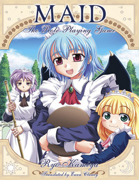
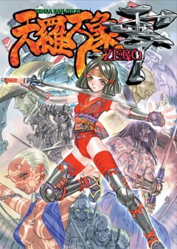
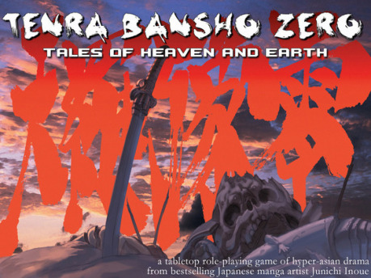
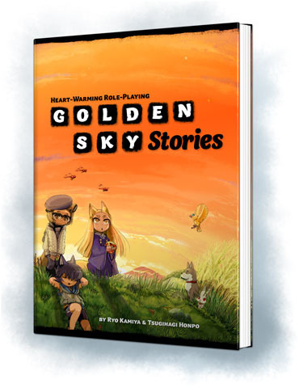
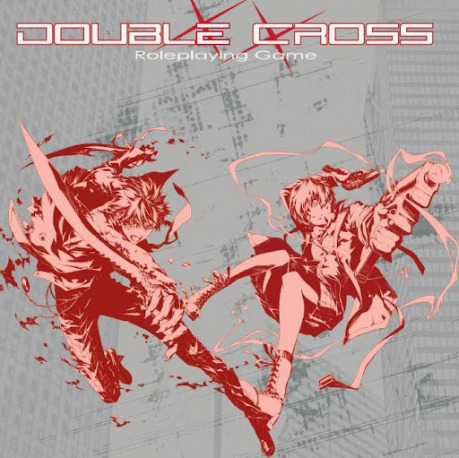
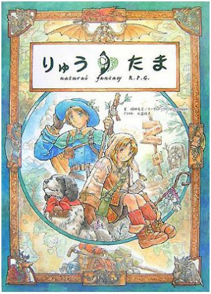

## O RPG v Japonsku

To důležité je třeba říct hned zkraje – jen s češtinou moc nepořídíte. Překlady do našeho rodného jazyka neexistují a v dohledné budoucnosti zřejmě existovat nebudou. Ale pokud přidáte třeba angličtinu, vaše možnosti se výrazně rozšíří. Některé hry totiž do angličtiny přeloženy byly. První opatrné pokusy se setkaly s kladnou odezvou, a další na sebe nenechaly dlouho čekat.

Dovolím si malou terminologickou odbočku. Japonská RPG se obvykle označují zkratkou JRPG, kterou budu nadále používat. Protože se to může plést s RPG počítačovými, používá se i zkratka TRPG (tabletop RPG). V divočině můžete narazit na obojí.

## Podivná nabídka

Výběr japonských her, který se nám dostává, nepovažujte za úplně typický. Jelikož překlady jsou soukromou aktivitou malého množství lidí, to, které hry budou přeloženy je určováno směsí osobního vkusu, dostupnosti práv a náročnosti. Asi nepřekvapí, že neúměrně jsou zastoupeny hry malého rozsahu. Překládat tlusté svazky se snadno dostane mimo možnosti individuálních překladatelů.

Tento osobnější přístup má ještě jiný efekt. Je tu zároveň jistý prvek „když už, tak pořádně“. Překladatelé jsou v první řadě nadšenci a jsou rozhodnuti hru předvést v co nejlepším světle. Touha po dokonalosti ale snadno způsobí, že se překlad protáhne – zejména pokud se překladatel nechá strhnout k tomu, aby si nastudoval detaily historického buddhismu, jen proto, aby správně přeložil jména frakcí. Pak snadno dojde například k tomu, že překlad hry Tenra Basho trvá neuvěřitelných sedm let.

Perfekcionismus ale pracuje pro nás, čtenáře, v jednom směru pozitivně. Překládané hry jsou mnohdy už několik let staré a stihly za tu dobu nasbírat opravy, vysvětlení, nové verze a rozšíření. Ty jsou dost často zahrnuty do překladu, ať už hned nebo v reakci na zájem fanoušků. Hra kterou dostáváme je tak jakousi de luxe verzí.

## Mají něco společného?

Jak uvidíte níže, přeložená JRPG jsou docela nesourodá směska. Ať už prostředím, náladou nebo systémem, vzájemně se od sebe docela liší. Je ale několik věcí, které najdeme ve většině z nich.

První společný prvek je zdánlivá drobnost – vysvětlující komiksy. Není výjimečné, že vysvětlení zásadních mechanik je doprovázeno krátkými komiksy na půl stránky. V nich se střídají scény ze hry s momenty u stolu, hráči bývají vyobrazeni jako jejich postavy nebo opačně. Tohle je nápad, který se mi velmi líbí – zdá se mi, že dělá věci mnohem názornější a srozumitelnější.

Dalším výrazným pojítkem je formát – většina těchto her je stavěná na oddělené příběhy, odehrané za jedno delší sezení. To nutně neznamená jednorázovky; případná delší kampaň má spíš charakter seriálu nebo několika navazujících příběhů, z nichž každý je ale uzavřený. Styl, kdy sezení plynule navazují na sebe v nekonečném pásmu, je spíše výjimkou. Tohle mi bylo vysvětleno jako specifikum japonského životního stylu, kdy je problém najít čas na pravidelné hry. Sezení tedy bývají o něco vzácnější a o něco delší – spíše víkendový den jednou za čas, než večer každý týden.

## Maid

Prvním JRPG přeloženým do angličtiny je Maid. Má zároveň tu pochybnou čest být tím nejšílenějším. Co je tedy ten kousek, který k nám dorazil první přes oceán?

Dvěma slovy, potrhlá groteska. Hráči hrají služebnictvo v domě bohatého lorda a řeší běžné denní krize: příprava snídaně, útok indiánů, medvěd ve skříni (pozor na lordovo oblíbené sako!), oběd, atentát, návštěva příbuzenstva, odpolední čaj a tak dále. Jistou představu asi máte.

V rámci této premisy je ale hra velice variabilní. Váš vládce či zaměstnavatel může být šlechtic v klasickém středověkém hradě, kouzelník ve své věži, majitel nadnárodní korporace, velitel klanu ninjů, nebo obyčejný šéf místní pobočky McDonalds. Podle toho se budou lišit jistá specifika, jaké domácí práce je třeba dělat a kdo se bude snažit proplížit dovnitř.

Pravidla jdou v duchu grotesky. Dovednost s koštětem je hodnocena stejně vysoko jako dovednost v boji nebo zarputilost – a jak si můžete být jistí, co vám pomůže více při odvracení invaze z vesmíru? Boj je velice jednoduchý, a i pokud dojde na použití zbraní, není možné nikomu doopravdy ublížit. Výsledkem spíše budou očouzené šaty, omráčení, postavy vyhozené z okna a (téměř vždy) jisté množství nepořádku.

Tato hra snadno nabere jisté prvky PvP. I pokud si postavy vzájemně nejdou po krku z více či méně rozumných důvodů, je tu prvek soupeření o pozornost lorda a snaha se mu zavděčit nebo si upevnit pozici v domácí hierarchii. Stejně tak ale postavy můžou stát sjednoceny proti současné hrozbě nebo ignorovat události a šířit zmar a zkázu.

Jednoznačně nejlepší součástí Maid jsou náhodné tabulky. Říci, že pokrývají všechno, by bylo poněkud opovážlivé tvrzení, ale docela se tomu blíží. V případě kreativního záseku je s pomocí kostky možné naházet postavy (až po barvu očí a trauma z dětství), prostředí, zápletku a počasí. A pokud by ani to nestačilo, následuje obrovská tabulka různých podivností, na které je možné v sídle nebo jeho okolí narazit. Z vlastní zkušenosti můžu říct, že občas je zábava jen tak házet a zkoušet, co za šílenost náhodný generátor vytvoří. Nebudu tvrdit že by výsledek dával vždycky smysl, ale ještě se mi nestalo, že by byl nudný nebo nezapadal do zbytku hry.

Maid rozhodně není hra pro každého. Pokud ovšem občas máte rádi nevázanou komedii a netrpíte přebytkem zdravého rozumu, možná vám má co nabídnout.

## Tenra Basho

Kdybych měl v tomto článku zmínit jen jedinou hru, nepochybně by to byla tato. Překlad Ten­ra Basho z mého pohledu začal vlnu zájmu o JRPG, i když nešlo o první úspěšně dokončený. Zároveň je to asi nejvíce mainstreamová hra, kterou budu dnes představovat.

Tenra se těžko zařazuje do žánru. Dle slov autora jde o „Hyper-asian fantasy“, a toto označení nepochybně sedí. Je to spektakulární dobrodružství ve stylu filmového blockbusteru. Zavede vás do světa samurajů, feudálních pánů a mocných čarodějů. Svět válek a hrdinů větších než život. Najdeme v něm ale též prvky pro fantasy značně netypické. Střelné zbraně, kybernetické protézy, obří mechanické bojové stroje a náznaky ještě pokročilejších technologií naznačují, že spíš než v období válčících států se odehrává někdy v daleké budoucnosti. Podobné směsky obvykle nalézají útočiště pod označením steampunk, nenalézám tu ale ani stopy parních strojů nebo viktoriánské módy.

Postavy, které můžete hrát, jsou stejně exotické jako prostředí. Po bojišti se prohánějí pistolníci, samurajové, piloti obřích bitevních zbrojí i ti, kteří obětovali své lidství za větší moc a sílu. Ve stínech se plíží ninjové a vedou tajné války. Hmyzovládci pečují o své nestvůrné symbionty a vydávají se za prosté lékaře. Kouzelníci _onmyoji_ povolávají do služby fantomy a přízraky. Buddhističtí mniši vládnou jak ocelovou pěstí, tak slitováním a požehnáním nebes. A z povzdálí to celé pozorují agenti tajné organizace, kteří skryti v kněžských róbách tahají za nitky.

Z krátkého popisku to tak nevynikne, ale na postavách je vidět jistá míra tradice, i když jsou zcela fiktivní. Pěkný případ jsou mnišské řády. Nejde o generické klony šaolinu, každý z klášterů má vlastní filosofii a jejich členové jsou především buddhističtí mniši, bojovníci až v druhé řadě. Ostatně odkazů na buddhismus a šintó je Tenra plná. Historickou věrnost nečekejte – je to pořád fantasy – ale celé věci to dodává jistý nádech exotiky a autentičnosti.

Tenra jako svět je propracovaný, ale nezabíhá do přílišné do hloubky. Jednotlivé země a frakce jsou načrtnuty, jejich vztahy rozebrány, ale vždy poměrně hrubými tahy. Dozvíme se spousty detailů o tom, jak žijí obyvatelé měst a vesnic, jak fungují povinnosti vazala lennímu pánovi nebo jak nové zbraně mění tvář válečného konfliktu. Nějaké historii neujdeme, je ale milosrdně krátká. Zato popisy pojmenovaných NPC jsou zcela nepřítomny. Ať je to silou, nebo slabinou této hry, hráčské postavy a NPC kolem nich jsou hlavními hvězdami večera.

Stylem je Tenra spíše podobná výpravnému velkofilmu, nežli mnohadílnému seriálu. Postavy jsou představeny ve svižném úvodu a hned poté vrženy po hlavě do děje, který graduje směrem k finální konfrontaci. Pravidla toto zběsilé tempo podporují a mělo by být běžné odehrát plnohodnotný příběh v průběhu 4–6 hodin.

Her, které nabízí akční dobrodružství ve filmovém stylu, je několik, a pokud jste fanoušci tohoto žánru, máte zřejmě svou oblíbenou. Málokdy ovšem potkáte hru, která je tak zřetelně produktem odlišné kultury. Překladatel věnoval spoustu námahy tomu, aby Tenra neztratila svůj specifický feeling, a myslím že uspěl na celé čáře. Pokud je tenhle žánr vaše krevní skupina, máte příležitost se podívat, jak ho dělají na opačném konci světa.

## Golden Sky Stories

Každá z her, o kterých tu píšu, je něčím výrazně jiná. Pro žádnou to neplatí tolik, jako pro GSS. Odkládá většinu věcí, na které jsme z ostatních RPG zvyklí – násilí, napětí, kostky, dalo by se říci, že i dobrodružství tak, jak je obvykle chápáno. A přece jí zůstane dost na to, aby měla čím zaujmout.

GSS je z žánru, který se v japonštině nazývá _honobono_. To je zkrácenina, která v překladu znamená víceméně něco jako „zahřeje u srdce“. Představte si něco jako večerníčky o zvířátkách – žádná velká dramata, žádné temné konspirace v pozadí, trable všedního dne v prostředí idealizovaného venkova. Na konci to všechno dobře dopadne a děti mohou jít v klidu do postýlky. GSS je tohle všechno, v koncentrované podobně. Kdybych jí měl shrnout jedním slovem, to slovo by bylo „roztomilá“.

Hráčské postavy jsou bytosti zvané _henge_ – zvířata, která dokáží mluvit a brát na sebe lidskou podobu. Nepředstavujte si ale žádné vlkodlaky. Henge jsou ve své zvířecí podobě vcelku neškodná stvoření, jako kočky, králíci nebo drobné ptactvo. Jsou nadána zázračnou mocí, ale i ta spíše leží v oblasti triků a utváření nálady, než nějakých příliš užitečných kouzel.

Henge se snaží vycházet s obyvateli městečka a podle svých možností jim pomáhat. Typicky řeší různé sousedské neshody, nedorozumění a další drobné trable všedního dne. Nic, co by nedokázalo vyřešit pár slov a srdce na správném místě. A to je záměr – postavy málokdy budou dělat o mnoho více. Navzdory fantastické (či spíše pohádkové) podstatě postav jsou situace zcela civilní a jejich konečné řešení většinou stejně tak. Ne že by plány jako přeměnit učitele v žábu nebo půjčit křídla poškolákovi neměly své místo. Občas ale dokážou způsobit více problémů, než kolik jich vyřeší.

Možná si řeknete, o co tam vlastně jde? Žádný boj, žádné velké krize, idylický venkov … je tam vůbec co řešit? Odpověď zní, samozřejmě že ano. Sice tu chybí klasické hrdinské problémy, snadno řešitelné aplikací síly, ale to přece není jediné, co může člověka trápit. I taková drobnost jako ztracený pes může být ta nejdůležitější věc na světě, pokud ten, s kým mluvíme, je dítě a vyjednat mír mezi královstvími není nic proti tomu, usmířit rozhádané sousedy (zkoušeli jste to někdy?). Věčná lidská témata jako láska, závist, zrada a odpuštění tu rozehrávají své příběhy na malém, ale o nic méně dramatickém jevišti.

Tahle hra je něčím poměrně vzácným. Malí hrdinové, malý svět, malé sázky, to všechno může být osvěžením ve světě, kde obvykle více znamená lépe. A ještě jednou věcí je příjemně malá. Jednotlivé příběhy jsou kraťoučké a slibují dohrání za dvě tři hodiny. Vším tímto jsou GSS přístupné i publiku, které jinak klasická RPG moc nemusí.

## Double Cross

Toto RPG nás zavede do světa podobného tomu našemu – světa plného vládních konspirací a teroristických organizací, kde nebezpečí číhá na každém rohu. S jednou zásadní změnou.

Tou je epidemie viru zvaného „Renegade“, která se prohnala světem a zanechala za sebou lidi změněné. Někteří z nich se změní na monstra. Mnohem vzácnější je případ, kdy se infekce později znovu aktivuje a propůjčí svému nositeli nadpřirozené schopnosti.

Paralela se světem X-Men je zřejmá. Máme zde nakažené, společnost, která si s nimi neví rady, tajné organizace, které se je snaží využít pro své cíle, boj mezi těmi, kdo se chtějí vrátit mezi normální lidi, a vyznavači nadřazenosti nového lidského druhu. Zajímavým prvkem je virus, který projevuje inteligenci, vytváří vlastní podřízené bytosti a sleduje zatím neznámé cíle.

DC je nepochybně hrou akční. I když konspirace a vyšetřování mají své místo, hlavním bodem programu jsou nepochybně střety nakažených postav s podobně obdařenými protivníky. Je také hrou, která byla vytvořena s vidinou hraní na conech a podobných akcích. Dobrodružství mají předpokládanou strukturu, která začíná vyšetřováním nepřátelských aktivit, hledáním stop a výslechem svědků a směřuje k připravené konfrontaci. Vedlejší, leč důležité místo mají ale i interakce s přátelskými NPC. Jsou to právě ony, kdo udržují postavy příčetné a brání tomu, aby je virus zcela ovládl.

Výběr schopností je slušný. Existuje několik mutací viru a každá z nich se projevuje jinak. Například varianta Hanuman umožní svému nositeli ovládat zvuk a pohybovat se nadpřirozenou rychlostí, zatímco varianta Neuman změní jeho mozek v organický superpočítač. Schopností je dost na to, aby i postavy stejného typu mohly fungovat různě. Přidejme k tomu možnost kombinovat typy a příležitost se vyblbnout s tvorbou postavy by měla být dostatečná.

Pro někoho by mohlo být zklamáním, že většina schopností je tak či onak určena k boji. Pro každou z variant jsou k dispozici nějaké podpůrné schopnosti, ale je zřejmé že jsou spíše doplňující.

Her v podobném žánru jako Double Cross by se asi našlo několik. Myslím že srovnání snese a své téma zpracovává dobře. Tak či onak, své příznivce si už našla a autoři pracují na překladu rozšíření. První už je hotový a další byly oznámeny.

## Ryuutama – s batohem na cestách

Předchozí hry pokryly spektrum žánrů a settingů, a tak je jen šťastnou shodou okolností, že s touto poslední zabrousíme do známějších vod. Ryuutama neboli Dračí vejce je víceméně klasickou fantasy. Ne úplně takovou, jakých tu máme k vidění spousty, ale rozdíl se skrývá v detailech.

Stejně jako Golden Sky Stories, patří tahle hra do žánru _honobono_. Lidé jsou obecně přátelští, kraj nesužují pikle temných pánů a spíše než donést prsten do sopky vás někdo poprosí zanést dopis příbuzným do odlehlé vesnice. Nenechte se ale zmást, neznamená to, že by to hráči měli nějak jednoduché. Důraz je sice spíše na cesty do dalekých krajin než na prolézání kobek, ale zima na štítech velehor nepřipravené poutníky zahubí spolehlivěji než šipková past. A na cestách číhají příšery a ty, byť roztomile kreslené, jsou stále při chuti.

Největším nebezpečím jsou ale útrapy cesty. Protože Ryuutama je především hra o cestování, nocování pod hvězdami a touze vědět, co je za dalším kopcem. Na nějaké dobrodružné aktivity dojde také, ale občas je větší problém se vůbec dostat na místo. Začátečníkům se může podařit zabloudit v blízkém lese, zmoknout a do cíle dorazit o týden později, nachlazení a s polovinou životů. Zkušenější cestovatelé se nezaleknou bažin či horských štítů, a bez větší úhony přečkají vánici i pouštní bouři. A budou to potřebovat, jak jinak by mohli najít ztracená města a další místa, kam lidská noha nevkročila už stovky let?

To vše vyžaduje důkladnou přípravu. Zbraně a svěcená voda se sice můžou hodit, důležitější ale je, jestli přibalit víc zásob, teplou přikrývku, nebo spíš prut na ryby. Zapomeňte ale na kilometrové nákupní seznamy, místa v batohu je málo, což vám rozhodování neulehčí.

Zajímavostí hry je tvorba postavy. Jak je v žánru zvykem, najdete tu úrovně a výběr povolání, spíše ale v tom původním, neRPGčkovém smyslu toho slova. Na výběr jsou možnosti jako lovec, kupec, léčitel, bard nebo farmář. Ti všichni se vám na cestě nepochybně budou hodit. A nebojte, že byste zůstali ošizeni – každá postava může vládnout mečem, magií nebo nebývalou zručností. To je ale něco, co si volíte nezávisle na povolání.

Dalším zvláštním prvkem je postava vypravěče. Stejně jako hráči, i on má svou postavu, se kterou se zapojuje do hry. Tato postava je dračí člověk, tajemný poutník, který z povzdálí sleduje skupinku dobrodruhů a píše příběhy o jejich cestách. Do většiny konfliktů se nezapojuje, ale má některé schopnosti, kterými může v nouzi pomoci. Postupuje po úrovních s odehranými dobrodružstvími, ale nikdy nejde o nepřemožitelné NPC, které na sebe strhává pozornost; jen dokáže podat pomocnou ruku o něco častěji. Tato postava nemá povolání jako hrdinové, ale GM si vybírá barvu draka a mocný artefakt, který nosí s sebou. Barva určuje druh dobrodružství, která družinku potkávají. Modří draci jsou zvědaví a sledují družinky které zkoumají různá tajemství, zatímco draci červení jsou horkokrevní a mají rádi boj. Ostatní barvy mají zase svá specifika.

Celkově vzato, Ryuutama není nic převratného. Fantasy, kterou znáte, jednotlivé kousky jsou pojaté poněkud jinak, ale celek je si stále podobný. Dohromady to ovšem navozuje lehce nostalgický dojem z dob, kdy fantasy bylo nové a neznámé a každá další věc byla překvapením. Mě už tohle za porornost stálo a možná že by mohlo i vám.

## Co chystá budoucnost

Výběr japonské produkce na západním trhu začíná být docela široký a vypadá to, že zájem nikterak nepolevuje. Je tedy více než pravděpodobné, že se brzy dočkáme dalších překladů. Některé z nich se už připravují – další rozšíření Double Crossu, bitva ninjů Shinobigami a poněkud zhulený dungeon Meikyuu Kingdom. Pokud vaše zájmy leží tímto směrem, nebo jste alespoň zvědaví, budoucnost vypadá více než růžově.
