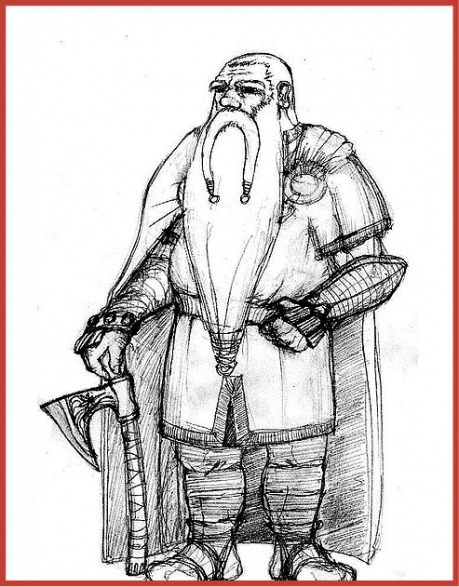
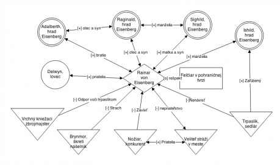
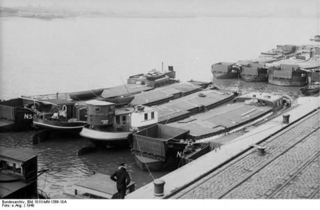

> alebo Ako do vašej hry uviesť postavu tak, aby to nebola ďalšia sirota z inej planéty.

> Táto metóda sa neviaže na žiadne konkréthne pravidlá, mala by sa dať ľahko použiť takmer v každej hre. Jediné, čo budete potrebovať, sú dve šesťstenné kocky, čistý papier a pero alebo ceruzku.

Metóda popísaná v tomto článku je veľmi silné zjednodušenie komplikovaných sociálnych vzťahov, tak ju prosím tak aj berte a nehľadajte za tým žiadnu hlbšiu psychologickú simuláciu reálneho sveta. Mala by do vašej hry priniesť nový zaujímavý prvok, a nie stáť vašim dobrodružstvám v ceste.

Ak hráte jednorázovú hru alebo len veľmi obmedzený počet sedení, pravdepodobne sa vám neoplatí investovať veľa času do vymýšlania minulosti postavy, a tvorby jej priateľov a nepriateľov. V takom prípade si jednoducho napíšte na papier najlepšieho priateľa a najzarytejšieho nepriateľa a venujte sa hre.

_Poznámka:_ V tomto článku sa vedome nebudem venovať vzťahom medzi postavami hráčov, ako k nim pristupovať, ako tvoriť družinu tak, aby mohla spolu fungovať, to všetko je zvyčajne v rôznych pravidlách rozpísané.

## Koncept postavy

Nebudem sa tu veľmi rozpisovať o koncepte postavy, vpodstate každá hra má niekoľko viet až odstavcov na túto tému. Pre účely tohto článku budem predpokladať, že nejaký koncept svojej postavy už máte, a viete ho zhrnúť niekoľkými slovami. Napríklad severský berserker, elfský stopár, trpasličí obchodník s nožmi.

Okrem tohto krátkeho popisu priraďte vašu postavu k jednému z nasledujúcich archetypov:

1. __Zelené ucho__ – postava na začiatku svojej dobrodružnej kariéry. V herných pojmoch je to postava na nízkej úrovni alebo s málo skúsenosťami.
1. __Ostrieľaný veterán__ – postava s aspoň tretinou až polovicou dosiahnuteľných úrovní alebo s veľmi veľkým počtom skúseností investovanými do nákupu schopností.

Teraz nastal čas spraviť z vašej siroty živú postavu, ktorá zapadne do vašeho herného sveta a oživí ho.

Na nasledujúcich riadkoch budem používať ako príklad Rainara von Eisenberg, trpaslíka, obchodníka s nožmi, ostrieľaného veterána.

## Sociálna sieť

Vašu postavu najlepšie uveriteľne zasadíte do hry tak, že jej vytvoríte (uveriteľné) sociálne zázemie, v ktorom vyrastala a pohybovala sa. Tvorí ho rodina, priatelia, nepriatelia a kontakty, ktoré si vaša postava postupne vybudovala. Zamyslite sa nad konceptom vašej postavy, s kým sa asi tak mohla stýkať, priateliť, koho si mohla svojimi činmi znepriateliť, z akej rodiny pochádza. Všetky tieto postavy budú ďalej označované ako Cudzie postavy (ďalej v texte označované CP), pretože ich v hre bude predstavovať Pán hry. Nemusíte ich tvoriť veľmi detailne, len veľmi zbežne. Ďalšie detaily k nim pripíšete, keď sa vyskytnú v hre.

Nevymenúvajte bratrancov a sesternice až do desiateho kolena, sústreďte sa na niekoľko naozaj blízkych priateľov alebo zarytých nepriateľov, ktrorí by sa mali vo vašej hre častejšie objavovať a od ktorých občas môžete očakávať nejakú extra pomoc navyše k tomu, čo vaša postava získa od dobrodruhov v družine (a teda spoluhráčov), v ktorej spolu putujú svetom.

Pri tvorbe Cudzích postáv sa poraďte s Pánom hry a aj ostatnými hráčmi, môžu vám poradiť, prípadne môžete mať niekoľko spoločných priateľov či nepriateľov.

> Podľa toho, či je vaša postava zelené ucho, alebo ostrieľaný veterán, si hoďte jednou alebo dvomi šesťstennými kockami a výsledky spočítajte. Súčet určuje počet Cudzích postáv, ktoré na začiatku hry tvoria sociálnu sieť vašej postavy.

> __Príklad:__ Rainar je ostrieľaný veterán, tak si hodím dvomi kockami. Padlo mi 3 a 5. Rainarovu sociálnu sieť bude na začiatku tvoriť 8 (3+5) Cudzích postáv.

Keď máte určený počet Cudzích postáv, môžete začať vypĺňať nasledujúcu tabuľku. Je trochu dlhšia, ako vám bude treba, môžete si do nej počas hry zapisovať ďalšie CP, s ktorými sa vaša postava stretne.

Priatelia [+] Nepriatelia [−]

[ ] [ ]

[ ] [ ]

[ ] [ ]

[ ] [ ]

[ ] [ ]

[ ] [ ]

[ ] [ ]

[ ] [ ]

[ ] [ ]

Prvú Cudziu postavu, vpíšte do stĺpca Priatelia, ďalšie Cudzie postavy vypĺňajte na striedačku do Priateľov a Nepriateľov.

Ideálny stav je, že sa vám podarí vytvoriť všetky Cudzie postavy, na ktoré máte „nárok“. Ak však utrpíte momentálny nedostatok fantázie, snažte sa vytvoriť aspoň niekoľko CP, a zvyšné môžete vytvoriť počas hry, keď budete od nich niečo potrebovať.

Každú Cudziu postavu popíšte nasledovne:

- _•_ meno
- _•_ koncept
- _•_ vzťah ku vašej postave – môžete si vybrať zo zoznamu nižšie (aj náhodne pomocou kocky), alebo vymyslieť vlastný
- _•_ lokácia – kde sa vyskytuje

Pán hry by vám mal pomôcť s lokáciami (alebo vy jemu, ak spolu tvoríte herný svet) a má zároveň posledné slovo v tom, či je vami vymyslená Cudzia postava adekvátna k vašej postave. Začínajúci dobrodruh bude len veľmi ťažko dobrým priateľom s kráľom, jeho ženou, bratom, veliteľom vojsk, katom a arcimágom.

### Vzťahy

[+] [−]

[1] Láska [1] Strach

[2] Uctievanie [2] Nenávisť

[3] Priateľstvo [3] Závisť

[4] Obdiv [4] Pohŕdanie

[5] Sympatie [5] Odpor

[6] Rešpekt [6] Nepriateľstvo

Vyplnená tabuľka vám dá veľmi dobrú predstavu, na koho sa vaša postava môže v prípade potreby obrátiť s prosbou o pomoc, kde nájde svojich priateľov, a kde môže očakávať nejaké zákernosti od svojich nepriateľov.

## Mapa vzťahov

Ak nemáte radi tabuľky, alebo ste viac vizuálne založení, možete si namiesto tabuľky nakresliť mapu vzťahov. Rôzne vzťahy Cudzích postáv k vašej postave vyjadrite rôznymi grafickými prvkami. Môžete použiť nasledovné prvky:

- _•_ Vaša postava – kosoštvorec
- _•_ Rodina – dvojica sústredených kružníc
- _•_ Priateľ – kružnica
- _•_ Nepriateľ – otočený trojuholník
- _•_ Kontakt – štvorec

Postupujte nasledovne:

1. Do stredu papiera nakreslite kosoštvorec a napíšte doňho meno svojej postavy
1. Nakreslite jeden z vyššie uvedených grafických prvkov, do neho vpíšte meno, koncept a lokáciu cudzej postavu.
1. Jednotlivé prvky spájajte čiarami. Šípkov na jednom alebo oboch koncoch čiary naznačte, či sa jedná o jednosmerný, alebo obojsmerný vzťah. Nad čiaru uveďte, či je to [+] alebo [] vzťah, a o aký vzťah sa jedná.
1. Medzi vašou postavou a CP môžu byť aj dve šípky, ak majú postavy navzájom rôzne vzťahy (vaša postava krčmárovu dcéru neznáša pre piskľavý hlas a mdlý rozum, naopak krčmárova dcéra je do vašeho urasteného svalnatého bojovníka po uši zamilovaná).
1. Podobne ako pri vypĺňaní tabuľky začnite rodinným príslušníkom, a postupne na striedačku dopĺňajte Priateľov a Nepriateľov.

Namiesto pera a papiera môžete použiť napríklad [www.draw.io](http://www.draw.io) alebo iný nástroj na vizualizáciu vzťahov medzi entitami. Nasledujúca mapa Rainarových vzťahov bola vytvorená pomocou tohto online nástroja.

## Dynamika sociálnej siete

Predchádzajúce riadky by vám mali pomôcť uviesť vašu novú postavu do hry. Tým sa však vzťahy postavy s okolitým svetom nekončia. Postava počas dobrodružstiev spoznáva nových ľudí (elfov, trpaslíkov...), jej vzťahy k priateľom, nepriateľom a rodine sa vyvíjajú a menia. Zaznamenávajte si všetky zmeny a nových priateľov, kontakty i nepriateľov, tieto záznamy vám poslúžia ako inšpirácia alebo zdroj pomoci v nasledujúcich hrách.

Ako som už vyššie písal, dve postavy môžu mať na seba úplne odlišný názor, a teda aj ich vzájomné vzťahy budú rôzne. Aj tieto vzťahy sa môžu časom meniť.

Okrem vzťahov Cudzích postáv k vašej postave si do mapy vzťahov môžete zaznačiť aj vzájomné vzťahy medzi Cudzími postavami, podobne ako na obrázku v predchádzajúcom texte. Aj tieto vzťahy sa môžu počas hry meniť.

Tabuľku alebo mapu vzťahov počas hry dopĺňajte. Ak vám nejaká CP v hre pomôže, dopíšte si ju medzi priateľov a zaznačte si nový Dlh, podobne ak niekomu pomôžete, CP vám niečo dlží a môžete ju v budúcnosti požiadať o pomoc.

Podobne si značte aj nepriateľov, ktorých si počas svojho putovania vaša postava vyrobí.

## Využitie sociálnej siete postavy v hre

Sociálna sieť, ktorú ste práve pre svoju postavu vytvorili, má v hre niekoľko funkcií. Pre hráčov slúži ako zdroj drobných výhod, pre Pána hry ako zdroj zápletiek, komplikácií pre postavy a dokreslenie sveta. Vytvorené CP a lokácie Pánovi hry jednak uľahčia prípravu na hru, ktorá je aj tak dosť náročná, a vám umožnia vniesť do hry CP a miesta, ktoré by ste s vašou postavou chceli stretnúť alebo navštíviť. Všetky tieto signály by mal Pán hry rešpektovať a zaniesť ich do hry, aby vaša spoločná snaha nevyšla nazmar.

### Dlh

Mechanika Dlhu je jednoduchá a poskytuje hráčom drobné výhody počas hry. Túto mechaniku môžete použiť kedykoľvek počas hry, aj uprostred konfliktu.

> Vždy, keď požiadate niektorú Cudziu postavu, ku ktorej máte kladný vzťah, o malú službu, drobný predmet atď, hoďte si jednou šesťstennou kockou, a ak hodíte viac, ako je Dlh (viď nižšie), vaša postava vlastní alebo vie to, čo práve potrebuje.

Majte na pamäti, že vaša postava získa len obyčajné, nie veľmi hodnotné predmety alebo informácie, relatívne ľahko dostupné. Vždy sa musí jednať o niečo, čo súvisí s archetypom Cudzej postavy, od ktorej vaša postava čerpá pomoc.

> __Príklad:__ Vaša postava môže získať pakľúč od zámočníka alebo zlodeja, kresadlo, informáciu o brode alebo loveckej chate od lovca alebo meno priekupníka s pašovaným tovarom alebo skorumpovaného člena mestskej rady od pašeráka či piráta.

Pri úspechu si k menu Cudzej postavy, ktorá vám nejako pomohla, urobte značku, napríklad [x].

> Súčet všetkých [x] je výška Dlhu vašej postavy. Môžete hru začínať s nulovým Dlhom, alebo už nejaký dlh uviesť do hry.

Dlh sa splatí vrátením zapožičaného predmetu, zaplatením určitého obnosu, alebo protislužbou.

> Ak počas hry pomôže vaša postava CP, ktorej nič nedlží, zaznačte si to ako Pomoc [xx]. Ak neskôr potrebujete požiadať nekotrého z vašich priateľov o službu, celkovú Pomoc si pripočítajte ku hodu kockou, a ak je súčet vyšší, ako Dlh, uspeli ste.

Vaša postava, ktorá často pomáha iným, ľahšie v čase núdze získa pomoc, lebo je o nej známe, že keď môže, pomôže.

### Zápletky

Pán hry môže Dlh využiť v hre na generovanie zápletiek. Stačí sa pozrieť, komu postava niečo dlží, a cez túto Cuzdiu postavu požiadať hráčovu postavu o protislužbu na splatenie dlhu.

> Pán hry by mal mať na pamäti, že pri splatení Dlhu by CP mali vyžadovať protislužbu adekvátnu pomoci, ktorú postave poskytli.

Ak hráč odmietne vyhovieť, pozitívny vzťah [+] sa zmení na neutrálny [o], pri druhom odmietnutí sa neutrálny vzťah zmení na negatívny [−].

Hráč nemôže využiť Cudzie postavy, ktoré majú k jeho postave neutrálny vzťah, na získanie pomoci, pokiaľ im okamžite neponúkne protihodnotu alebo niečo nesľúbi.

> __Príklad:__ Rainara zastihla v horách snehová búrka. Hráč pohľadom na mapu vzťahov zistil, ze jeden z Rainarových priateľov je miestny horal, lovec. Rainarov Dlh je momentálne 4, výprava na druhú stranu hôr pred skončením zimy si vybrala svoju daň. Hráčovi padne na kocke 5, uspel. Raniar si spomenul, že mu jeho priateľ hovoril o malej jaskyni, v ktorej občas prespáva, ak ho na ceste prikvačí nevľúdne počasie. Po takmer hodinovom boji s očasím sa vyčerpaný Rainar dotrmáca k jaskyni, a ukryje sa pred vyčíňaním živlov. Hráč si k menu horala poznačí nový Dlh značkou [ ] a celkový Dlh stúpne na 5.

> __Príklad:__ Neskôr v hre Pán hry potreboval inšpiráciu na nejakú zápletku. Pozrel sa na Rainarovu mapu vzťahov a vybral si horala. Popísal hráčovi, ako za Rainarom do krčmy prišiel skrvavený horal s prosbou o pomoc pri prenasledovaní škretov, ktorí uniesli jeho syna. Ak mu Rainar pomôže, splatí svoj dlh. Ak nie, ich priateľstvo značne ochladne.

> __Príklad:__ Pri návšteve hraničnej pevnosti požiadal Rainar miestneho felčiara o masť proti popálenínám. Nemá s felčiarom veľmi priateľský vzťah (v mape naznačené ako [o]), pretože mu z poslednej výpravy nedoniesol sľúbené medvedie sadlo a tak musel za masť zaplatiť niekoľko strieborných. Ak by ho Rainar nemal vo svojej mape vzťahov, masť by nezískal, lebo felčiar ju cudzincom nepredáva.

### Komplikácie

Ako už bolo vyššie napísané, Pán hry môže sociálnu sieť hráčovej postavy využiť na uvedenie komplikácií do hry. Cuzdie postavy s negatívnym vzťahom k hráčovej postave mu môžu škodiť, alebo komplikovať jej život. Vždy, keď Pán hry vnesie do hry komplikáciu vzťahujúcu sa k nejakej Cudzej postave, poznačí si to k nej.

Podobne ako pri Dlhu, ak komplikácie musia súvisieť s konceptom Cudzej postavy, musí to byť niečo v jej moci, kompetenciách alebo schopnostiach. Komplikácia môže mať aj podobu zápletky.

> __Voliteľné pravidlo:__ Súčet komplikácií môže hráč pripočítať ako bonus k hodu šesťstennou kockou pri žiadosti o pomoc. Čím viac prekážok mu do cesty budú jeho nepriatelia hádzať, tým viac pomoci bude potrebovať, a dobrí priatelia mu takmer vždy pomôžu.

> __Príklad:__ Rainar odmietol veliteľovi stráží dať úplatok za to, aby nemusel platiť taký vysoký poplatok za povolenie predávať nože v meste, čím si ho znepriatelil. Pri najbližšej návšteve mesta Rainara v hostinci zatkli strážnici za rušenie poriadku na základe vymysleného udania, len aby mu ukázali, kto je v meste pánom. Pán hry využil negatívny vzťah veliteľa stráží ku Rainarovi a poznačil si to na mapu vzťahov. V tomto sedeni už ďalšiu komplikáciu od veliteľa stráží nevnesie.

> __Príklad:__ Rainarov konkurent chcel poškodiť jeho dobrú povesť, začal potajme predávať nože s Rainarovou značkou, ale veľmi nekvalitné, zle opracované. Rainarovu dielňu navštívil rozhnevaný lovec, ktorému sa pri sťahovaní kožušiny zlomil nový nôž.

> __Príklad:__ Trpaslík, ktorý sa tajne zaľúbil do Rainarovej ženy, sa chce Rainara zbaviť. Pred poslednou výpravou od neho nič netušiaci Rainar kúpil nové sedlo na poníka. Sedlový remeň v horách z ničoho nič praskol, keď sa Rainar snažil cvalom ujsť pred vyhladovaným horským levom. Rainarovi sa podarilo leva zabiť a pri obhliadke nového sedla zistil, že remeň bol narezaný.

## Záver

Dúfam, že vám tento článok pomôže, keď si najbližšie budete tvoriť novú postavu. Pridajte sa do diskusie o tomto článku na [rpgforum.cz](http://rpgforum.cz/forum/index.php).
