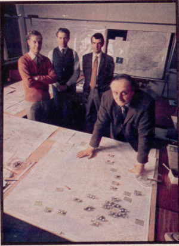
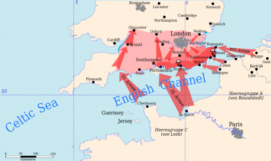
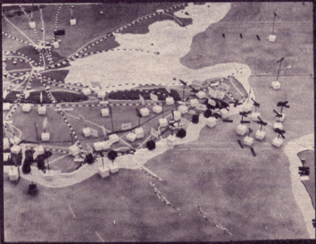
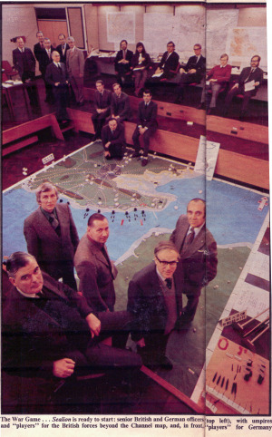

Lachtan, který nevyplul, zadělal na debaty dlouho dopředu. Dodnes se vedou spory o tom, zda mohla invaze uspět. V roce 1974 se to rozhodlo několik nadšenců zjistit. Daily Telegraf a Oddělení válečných studií na univerzitě v Sandhurstu uspořádaly velkou válečnou hru (wargame) ve snaze zjistit, zda německá invaze mohla 22. září 1940 uspět. O přesnost se starala šestice rozhodčích, kteří byli přímými účastníky války.

Za německou stranu jimi byli:

- generál __Adolf Galland__ – za letecké síly – letecké eso za druhé světové války, 1941 až 1945 velitelem stíhacího německého letectva (General der Jagdflieger),
- admirál __Friedrich Ruge__ – za námořnictvo – víceadmirál během války, od roku 1943 ředitel výstavby lodí pro celé válečné loďstvo,
- generál __Heinrich Trettner__ – za pozemní síly – během války velitel 4. Fallschirmjäger-Division (výsadkové divize) a mezi lety 1964–1966 byl generálním inspektorem západoněmeckého Bundeswehru.

Za britskou stranu pak:

- Air Chief Marshall __Christopher Foxley-Norris__ – za letecké síly – během Bitvy o Británii byl pilotem Hurricanu a získal DSO za odvahu v boji,
- Rear Admiral __Teddy Gueritz__ – za námořnictvo – proslavil se především během dne D, kdy byli vyšší důstojníci zabiti a on musel bez pomoci organizovat vylodění na pláží Sword (s modře natřenou přilbou, červenou šálou a vycházkovou holí jako jedinou zbraní) a zajistit, aby se všechen vykládaný materiál dostal na pevninu,
- generálmajor __Glyn Gilbert__ – za armádu – jeden ze dvou Bermuďanů, kteří se vylodili během dne D, vyznamenán za překročení escautského kanálu (během překračování Rýna).

Hra se hrála na velké mapě jižní Anglie, dostupné síly a zdroje byly založeny na plánech obou stran, počasí odpovídalo záznamům Admirality (které nebyly do té doby nikde publikovány). Předpokládalo se, že Luftwaffe stále pokračovala v bombardování Londýna.

## Nasazené síly – Německo

Pro invazi bylo na německé straně vyčleněno dle rozkazů polního maršála Walthera von Brauchitsche 39 divizí. Celkově se v prvních dvou sledech mělo přepravit 250 000 mužů, 650 tanků, 35 000 vozidel a 57 000 koní. První vlna se měla sestávat ze skupiny armád A (celkem 10 pěších divizí pod velením maršála Rundstedta) a 6. armády (3 divize pod velením maršála Reichenaua), druhý sled měl vylodit 6 tankových a 3 motorizované divize. Následovat měl třetí sled s 9 pěšími divizemi a sled čtvrtý s 8 pěšími divizemi. První vlna měla mít s sebou lehké tanky, ale ne dostatek dělostřelectva a podpůrných zbraní. Německé námořnictvo nemělo nikdy k dispozici dostatečný počet přepravních kapacit – velkou část jejich lodí určených k přepravě vojáků tvořily říční bárky zabavené v Holandsku a Belgii, které byly upraveny pro tento účel.

K invazi bylo shromážděno 732 stíhačů a 724 bombardérů Luftwaffe.

## Nasazené síly – Velká Británie

Britská stana měla připravena k obraně 25 divizí, ale jen 17 z nich bylo plně vyzbrojeno. Velká část vojáků byla navíc nedávno evakuovaná z Francie po těžké porážce a ústupu.

Domobrana čítala v době ohrožení na 1 682 000 mužů (většinou rezervistů z první světové války nebo hochů, kterým nebylo dost na to, aby mohli sloužit v armádě), ale k dispozici měli jen 847 000 obstarožních pušek z první světové války (často s nedostatkem munice), 47 000 brokovnic (nezřídka sportovních) a 49 000 kulometů. To znamená, že téměř 739 000 z nich nemělo naprosto žádnou zbraň. Objevil se pokus dodat jim provizorní píky vytvořené ze starých bajonetů navařených na trubkách (bylo jich vyrobeno čtvrt milionu), ale dobrovolníci tyto zbraně odmítli jako urážku a nikdy se nepoužily.

Dobrovolníci neměli dostatečný výcvik a výstroj, měli pouze pušky a žádnou těžkou výzbroj. Kompletně jim chyběly protitankové zbraně a motorizované prostředky přesunu (většina měla kola). V bojovou sílu se je podařilo proměnit až někdy kolem roku 1943, do té doby by dobrovolníci neměli v boji proti pravidelným německým silám mnoho šancí.

Royal Navy mělo k 1. červenci 1940 k dispozici 14 bitevních a 6 letadlových lodí, 15 těžkých a 44 lehkých křižníků a 158 torpédoborců. Kriegsmarine naproti tomu mohla nasadit 2 křižníky a 8 torpédoborců.

RAF měla k dispozici pro obranu 1048 letounů (stíhačů a bombardérů).

## Lachtan vyplul!

### 22. září 1940, ráno

První německá invazní vlna se za východu slunce vylodila na britských plážích.

Invazní flotila utrpěla malé škody od rychlých torpédových člunů během nočního překročení úžiny, ale Royal Navy ztratila těžký křižník a dva torpédoborce, jeden její další těžký křižník a dva torpédoborce byly poškozeny. Kriegsmarine za tento úspěch zaplatila ztrátou tří torpédoborců.

První oddíly devíti divizí se vylodily mezi Folkstone a Rottingdean (poblíž Brightonu). Sedmá parašutistická divize (Fallschirmjäger-division) seskočila nad Lympne, aby obsadila letiště. Během několika hodin přemohly německé oddíly obránce pláží a postoupily dál do vnitrozemí. V Kentu, kde vylodění proběhlo, byly umístěny pouze tři britské divize. Britská obrana ale spoléhala na použití mobilních rezerv. Obrněné a mechanizované brigády byly odeslány na místo ihned, jakmile bylo vylodění potvrzeno.

Nad hlavami vyloďujících se jednotek probíhala zuřivá letecká bitva. Luftwaffe odlétala do dvanácté hodiny přes 1200 stíhacích misí a 800 misí bombardovacích. RAF nasadila do boje i cvičné letouny narychlo osazené bombami. Luftwaffe začala mít problémy s krátkým dosahem stíhaček Bf 109, přestože jich před útokem soustředila co nejvíce do okolí Pas de Calais.

### 22.–23. září 1940

Němci stále neobsadili žádný větší přístav, přestože zahájili postup na Folkstone. Lodě vykládající zásoby na plážích utrpěly těžké ztráty kvůli bombardování RAF. Další ztráty pak v přístavech ve Francii, které byly také pod útokem britských bombardovacích perutí.

U-Booty, letouny německého letectva a několik zbylých povrchových lodí ztratilo kontakt s loděmi Royal Navy. Pak skupina těžkých křižníků s podporou torpédoborců vplula do Kanálu (pokusila se proklouznout na dosah svých děl k vyloďovacím plážím) a musela proplout pod palbou německých pobřežních děl, E-Bootů (rychlých motorových člunů) a asi 50 Stuk. Dva těžké křižníky byly potopeny a jeden byl poškozen.

Německý klamný výpad z Norska, který měl odvést pozornost Royal Navy, byl úplně zničen. Britské výpady torpédových rychlých člunů a torpédoborců způsobily škody na německých přepravních lodích. Celkové ztráty německé invazní flotily se vyšplhaly na 25% během prvního dne. Nejtěžší ztráty byly mezi přepravními bárkami, které se ukázaly jako zoufale nevhodné pro přepravu na moři.

### 23. září 1940, 5:00 až 14:00

RAF ztratila zatím 237 letounů z 1048 (167 stíhačů a 70 bombardérů) a námořnictvo utrpělo takové ztráty, že bitevní a letadlové lodě se musely držet zpátky. Velké skupiny torpédoborců a křižníků se ale začaly soustřeďovat. Letecký průzkum ukázal, že německé síly se soustředily v Cherbourgu, a síly byly nasměrovány na jihovýchod.

Německé námořnictvo bylo malomyslné ze ztrát, které utrpělo, především mezi přepravními bárkami. Armáda a letectvo byli naopak nadšeni a přípravy pro přesun dalších posil pokračovaly s leteckým přesunem 22. divize. Luftwaffe zatím ztratilo 165 stíhačů a 168 bombardérů. Z 732 stíhačů a 724 bombardérů dostupných to byly ztráty těžké. Obě strany v tomto bodě přecenily množství ztrát, které způsobily protivníkovi, o více než 50 %.

Německá 22. divize byla úspěšně letecky přesunuta do Lympne i přes přesnou dalekonosnou dělostřeleckou palbu. Tu řídila skupina vyčleněných vojáků, která zůstala za nepřátelskými liniemi. První britský protiútok britské 42. divize podporovaný obrněnou brigádou zastavil německou 34. divizi na jejím postupu na Hastings. 7. německá pancéřová divize měla problémy s hustými protitankovými překážkami a obránci s přilnavými bombami. Její postup byl pomalý. Australská divize mezitím znovu dobyla Newhaven (jediný Němci obsazený přístav), ale novozélandská divize byla napadena zezadu 22. divizí (která byla přepravena leteckým mostem). Novozélanďané museli ustoupit poté, co utrpěli 35% ztráty.

### 23. září 1940, 14:00–19:00

Přes den Luftwaffe vyvinula maximální úsilí a její letouny startovaly k 1500 stíhacích a 460 bombardovacích misí. RAF ale přesto vytrvala v útocích na lodě v Kanále a letiště. Velká většina německého úsilí byla zaměřena na podporu pozemních sil a letecké zásobování, přestože admirál Raeders požadoval více letecké ochrany nad Kanálem. Britská Domácí flotila se stáhla z dosahu německých útoků a zanechala za sebou 57 torpédoborců, 17 těžkých křižníků a torpédové motorové čluny, aby vedly boj. Ty vyrazily v několika vlnách do Kanálu, a přestože dva z nich byly potopeny U-booty, torpédoborce potopily jeden U-boot na oplátku a pokračovaly v plavbě. Německá flotila vyplula na moře z Le Havre (tři torpédoborce a 14 E-bootů) a při západu slunce napadla Brity. Byla ale smetena a Němci ztratili všechny torpédoborce a polovinu E-bootů.

Na britském břehu bylo nyní 10 německých divizí, ale v mnoha případech nekompletních a stále čekajících na druhý sled, který měl dorazit v noci. Počasí ale nebylo vhodné pro bárky a rozhodnutí, zda vyplout bylo přesunuto nahoru v řetězci velení.

### 23. září 1940, noc

Vůdce svolal konferenci na 18:00, ale ta se změnila v hořkou hádku mezi jednotlivými složkami vojska. Armáda chtěla vyslat druhý sled, námořnictvo protestovalo, že počasí je nevhodné. Poslední porážka je navíc nechala bez hladinové ochrany a letecké podpory. Göring poznamenal, že to může zvrátit pouze uvolněním sil od bombardování Londýna (které stále probíhalo). To ale Hitler vetoval. Flotile bylo rozkázáno, aby vyčkala.

RAF mezitím ztratila dalších 97 stíhačů a zůstalo jí pouze 440 letuschopných strojů. Letiště 11. skupiny byly obráceny v ruiny a hrozil jí naprostý kolaps. Luftwaffe ztratila 71 stíhačů a 142 bombardérů.

Na zemi mezitím Němci pokračovali na Dover a Canterbury, přestože museli těžce bojovat s australskou a 45. divizí kolem Newhavenu. V 21:50 rozkázal Hitler flotile, aby přepravila druhou vlnu, ale pouze krátkou cestou mezi Calais a Dunkirkem. Než se rozkaz dostal do přístavu, druhá vlna nemohla doplout dříve, než vyjde slunce. 6. a 8. divize v Newhavenu, svádějící těžké boje s Australany, nemohly být zásobeny vůbec.

### 24. –28. září 1940

Německá flotila vyrazila pod ochranou U-bootů, E-bootů a stíhačů, zatímco počasí se uklidnilo. Za úsvitu je ale zpozorovala pátá flotila torpédoborců stále deset mil od pobřeží a rozsekala je na kusy. Luftwaffe nasadila proti torpédoborcům všechny své zbývající bombardéry, zatímco RAF odpověděla 19 letkami stíhačů. Němci vyřadili dva křižníky a čtyři torpédoborce, ale 65% bárek bylo potopeno. Rychlejším lodím se podařilo prorazit a zamířily k Folkstone. Přístav tam byl ale natolik těžce poškozen, že lodě mohly náklad vykládat pouze po dvou.

Neúspěch druhého překročení Kanálu znamenal, že německé pozice se stávaly stále více zoufalé. Divize měly munici jen na 2 až 7 dní bojů, ale bez dalších mužů a zásob nemohly rozšířit předmostí. Počátečně úspěšná invaze se tak stávala neudržitelnou. Hitler rozkázal nasazení záložních jednotek do Polska, kde se měly připravit na operaci Barbarossa, a Němci začali přípravy na evakuaci. Byly shromážděny rychlé lodě a trajekty pro evakuaci skrz Rye a Folkstone. Vojáci, kteří se nemohli stáhnout, museli kapitulovat.

Z 90 000 vojáků, kteří se vylodili 22. září, se jich do Francie vrátilo pouze 15 400. 33 000 německých vojáků bylo zajato, 26 000 bylo zabito v boji a 15 000 jich utonulo ve vodách Kanálu.

## Závěr

Všech šest rozhodčích prohlásilo operaci jednomyslně za naprostý německý neúspěch.

Německá strana měla dva zásadní problémy:

- nedosáhla letecké nadvlády,
- neměla dostatek sil, aby se na moři mohla postavit Royal Navy.

Nebylo v rámci jejich možností tyto dva problémy zvrátit (neměli kapacity). Z toho vyplývalo, že ani jednou ze sil nebyli schopni zabránit britské flotile ze Scapa Flow, aby přerušila zásobování z Kontinentu. A přerušení zásobování (těžkých tanků, posil a zásob) znamenalo konec invaze.

Dalším problémem německé strany byl nedostatek přepravních kapacit. Plánovači odhadovali, že v první vlně vyloděné dvě výsadkové divize a devět pěších budou potřebovat každý den 3300 tun zásob (ale v Rusku v roce 1941 potřebovala každá německá divize 1100 tun zásob denně, takže tohle číslo je hrubě podceněné). Po dobytí Folkstone (největší přístav ve vyloďovací zóně) mohl tento přístav přijímat denně 150 tun zásob (během sedmi dní by se počet zásob zvýšil na 600 tun denně). To znamená, že pěší i výsadkové divize by první dny musely vystačit s přinejlepším 20% potřebných zásob (nějaké zásoby by Němci získali v Anglii a něco by bylo přepraveno vzduchem, ale rozhodně ne dost). Po dobytí Doveru by si mohli přidat dalších 800 tun zásob za den, ale to by znamenalo, že by vojáci byli na 40% potřebných (a dost optimisticky spočítaných) zásob... a to ani kdyby do přepravy nijak nezasahovala RAF ani Royal Navy.

Hra skončila neúspěchem německého vylodění a poukázala na zásadní problémy, které německá strana měla. Nikdy se nedozvíme, jak by dopadlo skutečně vylodění (ve válce se může stát ledacos, co otočí poměr sil), nicméně zmíněné nedostatky německé strany byly takového rázu, že výsledek by zřejmě odpovídal odehrané hře.
