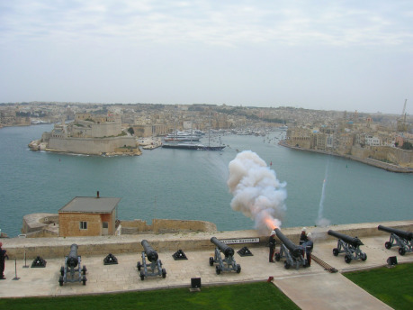
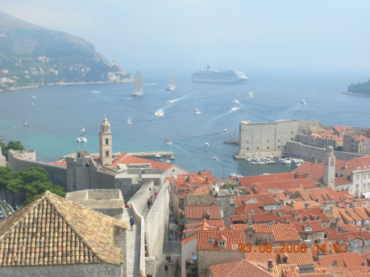

## Přístav, co to je?

Pozornějšímu pravidelnému čtenáři Drakkaru jistě neunikne, že název tohoto článku připomíná dvojčlánek _Krčmy a hostince_ z čísel [31](http://drakkar.rpgplanet.cz/vydani/duben-2012-31) a [32](http://drakkar.rpgplanet.cz/vydani/cerven-2012-32). Stejně jako vynikající ilgirova práce o pohostinstvích, jejíž přečtení mohu jen doporučit, budu povětšinou hovořit o přístavech beze vztahu ke konkrétní historické době nebo lokalitě, tedy převážně z hlediska potřeb her na hrdiny.

Na otázku, co je to vlastně přístav, lze odpovídat ze dvou různých úhlů. Při pohledu z paluby lodi je přístav v převážné většině místo více či méně uměle upravené, kde může bezpečně stát větší množství lodí. V přístavu je možno nejsnadněji opravovat loď, přesunovat věci a lidi na palubu i z ní, zkrátka udržovat styk s pevninou. Opačný úhel pohledu pak mluví o vesnici či městu, jehož struktury jsou všestranně ovlivněny lodním provozem a vším, co s tím souvisí. Přístavy, které by nebyly městy či vesnicemi, si sice představit lze, ale půjde o výjimky převážně z dnešní doby, jako jsou některá vojenská zařízení nebo nákladní terminály.

Přístav je přístavem, ať už slouží několika málo rybářským loďkám vesničanů nebo tisícovkám obchodních lodí s výtlakem v řádu stovek kilotun. Pořád se jedná o místo, kde se nakládá a vykládá zboží, doplňují zásoby i síly posádek. Bez ohledu na to, zda je k tomu potřeba speciálních konstrukcí a vrtulníků nebo jen obyčejného dřevěného mola. Někdy není třeba dokonce ani toho. Přínosnějším je pak dělení podle využití přístavu, podle něhož lze rozlišovat například přístavy rybářské, obchodní přístavy, nákladní terminály, zásobovací stanice, loděnice, městské přístavy, mariny, vojenská zařízení a v neposlední řadě jejich nejrůznější kombinace.

Mimo výše zmíněného dělení lze častěji zaslechnout také další označení přístavů, například celní přístavy, které dnes mohou být prvním místem vstupu do země. V subpolárních končinách najdeme velice ceněné nezamrzající přístavy, jejichž výhoda spočívá v tom, že jsou v provozu po dobu celého roku na rozdíl od těch sevřených ledovým krunýřem. V devatenáctém a na počátku dvacátého století se mluvilo o tzv. uhelných přístavech, tedy o přístavech či zásobovacích stanicích, v jejichž blízkosti se nacházel zdroj kvalitního uhlí pro lodní kotle. Mimochodem, člověk, který rozhodl o přechodu lodí z uhlí na ropné produkty, nebyl nikdo menší než sir Winston Leonard Spencer-Churchill, v té době první lord admirality, tedy britský ministr námořnictví. Stejný muž pak za obou světových válek prosazoval myšlenku sdružování civilních nákladních lodí do konvojů jako obranu před útoky ponorek. K tomuto účelu sloužily seřaďovací či shromažďovací přístavy na severozápadním pobřeží USA či na Islandu.

Než se však dostaneme k vlastnímu popisu toho, kde se přístav typicky nachází a jak běžně vypadá, tak se přeci jen nevyhneme krátkému historickému ohlédnutí.

## Pár postřehů z historie

Nejstarší nyní známý přístav na světě se nacházel v egyptském městě Vádí Džarf (Wadi al-Jarf) na pobřeží Rudého moře. Archeologické výzkumy, probíhající s řadou dlouhých přestávek od jeho objevení v roce 1832 do současnosti, jej datují do doby 4. dynastie egyptské Staré říše. Konkrétně snad vznikl za vlády velkého faraona Chufua, stavitele nejslavnější pyramidy, u nás známého též v řeckém přepisu jména jako Cheops či v anglickém jako Khufu. Je tedy starý přibližně 4500 let. Nalezené pozůstatky přístavu tvoří především cca 150 metrů dlouhé kamenné molo, jehož základy jsou dosud viditelné při nižších stavech vody, navigační znamení z navršených kamenů a několik budov dosud neupřesněného účelu. Spolu s nimi bylo nalezeno množství dalších pozůstatků, zejména kotev a nádob na uskladnění zásob a zboží.

O téměř dva tisíce let později bylo možné na pobřeží Středozemního moře nalézt jedny z nejzajímavějších přístavů vůbec. Kartaginská říše, založená Féničany, slavnými mořeplavci starověku z města Týr, budovala kóthóny. Kóthón byl druh přístavu skládající se ze dvou zón. První, vnější část tvořil běžný přístav pro rybářské a obchodní lodi, normálně přístupný. Druhou, vnitřní součástí byl vojenský přístav, stavba kruhové dispozice sestávající až z 220 doků pro válečné lodě. Doky byly postaveny kolem uměle vytvořené kruhové laguny, v případě největších kóthónů pak i na ostrůvku v jejím středu. Toto uspořádání poskytovalo celou řadu výhod – válečné lodě byly nejen dokonale chráněny před nepřízní počasí, ale opevněný přístav představoval i dobrou obranu před útoky z pevniny a zejména maximálně komplikoval nepřátelům získávání informací o tom, kolik lodí v přístavu je – a kolik jich tedy je na moři.

Přístavy byly a jsou mimořádné důležité nejen pro státy jako Kartaginská říše, která měla svá území rozeseta po velké části pobřeží Středozemního moře, ale i pro státy ostatní. Lze připomenout například obrázek dobře známý z učebnic dějepisu zobrazující mohutné hradby spojující Athény a jejich přístav Pireus, ač je vzdušnou čarou dělí vzdálenost téměř deset kilometrů. Je jen málo tradičních hlavních měst, která by zároveň nebyla významným přístavem. Z nich lze uvést třeba Paříž, jejíž umístění je dáno dohodou mezi šlechtou a králem. Velmi zjednodušeně lze říct, že leží ve vnitrozemí proto, aby se Francie nepřikláněla a nezvýhodňovala atlantické či středozemní pobřeží. Snaha získat trvalý a zajištěný přístup k nějakému přístavu mimo Barentsovo moře významně ovlivňovala zahraniční politiku Sovětského svazu, stejně jako předtím carského Ruska. Petrohrad či Oděsa tuto podmínku sice splňovaly, ale je až příliš snadné je zablokovat v Bosporské úžině či v úžinách dánských.

## Lokalita a okolí

Závěr předchozí pasáže naznačil, že význam přístavu je z velké části ovlivňován jeho polohou. Ovšem geografie se projevuje nejen v této řekněme strategické rovině, ale možná ještě víc v rovině taktické. Tedy z hlediska určení místa lze přístav nejsnadněji založit. To je v prvé řadě ovlivněno potřebou naplnit primární funkci přístavu, tedy ochránit lodě před negativním působením počasí. Dnes není problém vytvořit dostatečně chráněné přístaviště všude tam, kde je přijatelná hloubka vody, avšak v minulosti nebylo snadné budovat stavby pod vodní hladinou. Proto byly preferovány ty lokality, kde co největší díl práce odvedla samotná příroda, tedy zejména zátoky a ústí řek.

Nejlepším místem by samozřejmě bylo takové, které by nepotřebovalo vůbec žádnou stavební činnost. Avšak vzhledem k tomu, co všechno je od přístavu požadováno, ani to nejčlenitější pobřeží nenabízí zrovna nadbytek vhodných destinací. Přístav by měl poskytovat účinnou ochranu proti nečasu v podobě vln či bouřného větru, a to ze všech světových stran, zároveň však musí umožnit přiměřeně snadné připlouvání a odplouvání lodí. Takovým místem je například Port Vieux v Marseille či marina v chorvatském Kremiku. Rovná, byť dlouhá zátoka tedy sama o sobě nenabízí dostatečnou ochranu, neboť i když dokáže eliminovat většinu devastující energie, tak zejména vlny mohou způsobovat takové houpání lodi, že jakékoliv práce na palubě, natož třeba na stěžni jsou mimořádně komplikované, ne-li vyloučené.

Ochranu poskytovanou rovnou zátokou je tedy třeba doplnit hrází, případně více hrázemi – příkladem budiž Kukljica na ostrově Ugljan. S jejich pomocí pak lze vybudovat přístav i na jiných místech, jako v úžině mezi pevninou a ostrovem, příkladem budiž Trogir v Chorvatsku. Složitější je ochrana před větrem, ta ale není až tak podstatná. Navíc je třeba nezapomínat na to, že vítr je pro plachetnice hlavním pohonným prostředkem. Přesto jsou některé hráze doplněny svrchní zdí, která chrání před největšími vlnami a mimo to i proti větru v úrovni pevných částí lodě. Přístav samozřejmě nelze vybudovat tam, kde je příliš malá hloubka vzhledem k ponoru lodí, které jej mají využívat. Naopak velká hloubka teoreticky nevadí, ale může být překážkou pro budování nezbytných stavebních prvků.

To jsou požadavky platné pro, lidově řečeno, mokrou část přístavu. Má-li být přístav efektivní i z hospodářského hlediska, je třeba naplnit některé předpoklady i na pevnině. V prvé řadě je nezbytná existence zdroje pitné vody, což samozřejmě platí pro jakékoliv trvalé lidské osídlení. Nicméně zdroj vody musí být dostatečně vydatný i pro doplňování lodních zásob. Na stavbu lodí, stejně jako na jejich opravy je pak potřeba ohromné množství dřeva. Pokud již není k dispozici v blízkém okolí, je třeba jej dovážet, což se nejlépe realizuje jeho plavením, jak jsme si již řekli minule. V některých případech byla potřeba dřeva taková, že se vyplatilo založit nový přístav tam, kde byl dřeva dostatek. Takové případy známe jak z historie – například francouzské přístavy v Karibiku, které nechal admirál Nelson ostřelovat před bitvou u Trafalgaru a zde naskladněné zásoby dřeva tak shořely. Ze stejných důvodů budovali v průběhu druhého věku Númenorejci přístavy v ústí Šeravy a Želíze na západním pobřeží Středozemě, jak zaznamenává Tolkien.

Odlesnění okolí velkých přístavů pak zajišťuje dostatek zemědělsky využitelné půdy pro získávání potravin, které se opět dodávají také do lodních skladů. Při dlouhých plavbách představovalo hlavní energetický příjem námořníků sušené či solené maso a suchary, tedy jednotvárná strava obsahující jen minimum vitamínů. Vzhledem k tomu, že lidské tělo neumí vitamíny samo vytvářet, trpěli námořníci jejich nedostatkem projevujícím se kurdějemi. S jistou nadsázkou lze tedy říci, že lesy se při stavbě lodí proměňovaly na pole určená pro pěstování zelí, které vitamin C a další užitečné látky obsahuje ve velkém množství a lze jej v zakysané podobě dlouhodobě uchovávat.

Posledním faktorem, který by měl být alespoň stručně zmíněn, je možnost vojenské obrany přístavu, který je ze své vlastní povahy významným strategickým cílem i v případě, že se nejedná o přístav vojenský. Slavná francouzská pevnost Boyard byla vybudována proto, aby chránila arzenál a loděnici v Rochefortu a z boku rovněž přístav a pevnost La Rochelle před napadením z moře. Při plánování obrany přístavu je však třeba nezapomínat na potřebu obrany před útoky vedenými po pevnině. Singapur, do druhé světové války klíčový bod britské přítomnosti v jihovýchodní Asii, měl vybudovanou téměř nepřekonatelnou obranu proti útokům z moře. Avšak opomenutí potřeby ochrany před útoky vedenými pozemními silami spolu s nekompetentním velením generála Wavella, které se projevilo zejména v hrubém podcenění významu letectva, způsobilo pád této chlouby Impéria. Ztráta Singapuru je pak považována za nejtěžší jednotlivou porážku, kterou Británie během druhé světové války utrpěla.

## Části přístavu, aneb z čeho se to vlastně skládá

Každý větší námořní přístav lze rozdělit do tří základních částí, tedy na rejdu, vlastní přístaviště a stavby na břehu. Rejda je část moře poblíž přístavu, která je alespoň částečně chráněná před vlnami, dostatečně mělká a široká na to, aby tam mohly kotvit lodě. Při kotvení lodi se doporučuje vypustit kotevní řetěz o délce představující čtyřnásobek hloubky. Při použití kotevního lana se jedná ještě o vyšší násobky. Délkou kotevního řetězu je tedy dána maximální kotevní hloubka a ta je zase úměrná potřebnému prostoru, v němž se loď stojící na kotvě pohybuje. Plachetnice si sebou vozí stovky metrů kotevního řetězu, přičemž jeho úplné vytažení leckdy zabralo i několik hodin velmi namáhavé práce.

Rejdu využívají například plavidla, která jsou příliš velká na to, aby mohla vplout do přístavu, nebo taková, která nechtějí za použití přístavu platit vyšší poplatky. A samozřejmě na kotvení na rejdě jsou odkázány i lodě, které se do přístavu již prostě nevejdou. Stání zde taky umožňuje výrazně snazší manévrování a rychlejší vyplutí než vyvázání lodi v přístavu. Od slova rejda je pak dovozen český pojem rejdařství označující obchodní společnost zaměřenou na lodní dopravu, většinou nákladní a druhotně na obchod s loděmi.

Na pomezí rejdy a vlastního přístavu jsou pak moderní nákladní terminály pro některé druhy zboží, zejména pro ropu a propan-butan, nověji označovaný z angličtiny přejatou zkratkou LPG. Tyto terminály tvoří do prostoru rejdy, klidně i několik kilometrů od vlastní pevniny, vyvedené produktovody zakončené konstrukcí pro vyvázání lodi. Produktovodem se pak přečerpá náklad na pevninu. Vybudování těchto zařízení si vynutila vzrůstající velikost tankerů, jejichž klasické vykládání v přístavu nepřicházelo v úvahu z důvodů velice omezeného manévrování a v neposlední řadě i z důvodů bezpečnostních. Výbuch tankeru převážejícího LPG lze přirovnat k výbuchu atomové bomby, čehož využívá například Frederick Forsyth, zvaný mistr vypravěč, v románu Afghánec.

Pokud loď nechce zakotvit na rejdě, může vplout do samotného přístavu. Vstup do něj je obvykle označen na jedné straně zeleným a na druhé červeným majákem. V evropském prostoru, včetně Británie, se při pohledu z moře značí levá strana vjezdu červeným světlem/barvou, pravá zeleným. Toto označení odpovídá polohovým navigačním světlům lodi a napovídá tak, že lodi vplouvající do přístavu mají přednost před těmi vyplouvajícími. Je tomu tak proto, že loď v přístavu je teoreticky v bezpečí, kdežto loď na volném moři v bezpečí být nemusí, byť se může stát, že se budou lodě v přístavu hromadit a manévrování tak bude složitější. Obdobné barevné značení se používá pro vymezení vodních cest i v průlivech, pod mosty a podobně.

Prostor vymezený pobřežím a ochrannými hrázemi se nazývá přístavní bazén. Přiléhavost tohoto označení vynikne zejména u přístavů v místech s vyšším rozdílem hladiny při přílivu a odlivu. Při snížené hladině vody zadržuje zeď spojující červenou a zelenou hráz v přístavu dostatek vody na to, aby v něm vyvázané lodi nedosedaly na dno a tím se předešlo jejich poškození. V tuto dobu není možné, aby do nebo z přístavu plula jakákoliv plavidla. Obdobného výsledku může být dosaženo rovněž vybagrováním přístavního dna. Při využívání těchto přístavů je samozřejmě třeba počítat s přílivovými a odlivovými proudy.

Přístavní hráze jsou nejčastěji pevné kamenné zdi, na straně vystavené působení vodních proudů chráněné násypem velkých kamenů. Takto vzniklé úkryty využívá početná rybí populace a další mořští živočichové, kteří konzumují odpad z lidské činnosti a sami se stávají potravou přístavanů. Vršek hráze je obvykle zarovnaný tak, aby se po něm dalo přecházet, v případě větších přístavů i projet vozem. Uvnitř přístavního bazénu jsou pak umístěna mola, která zvyšují počet lodí, jež je možné v přístavu vyvázat. Zde by bylo na místě poznamenat, že v přístavu se nekotví, byť menší plavidla při stání zádí k molu mohou využít kotvu k zajištění přídě. To je však záležitost převážně dnešních jachet. Velké lodě se vyvazují bokem k molu nebo nábřeží tak, aby přes nižší okraj paluby bylo možné nakládat a vykládat zásoby apod.

Mola mohou být různých konstrukcí, od menších verzí kamenných hrází, která mohou oddělovat vojenské či jinak důležité sekce přístavu, přes nejběžnější dřevěné stavby až po moderní lehké plovoucí konstrukce. I v těch nejobyčejnějších přístavech se však jednotlivá stání rozlišují podle hloubky vody a náročnosti na zaparkování. Nejblíže u břehu budou tedy malé loďky rybářů, kteří vyrážejí na moře každý den sami nebo s jedním pomocníkem. Větší lodě budou stát uvázány u břehu jen tam, kde je dobře vybudované nábřeží, jinak jsou jim vyhrazeny vnější konce mol a hrází.

Pro to, aby bylo možné loď uvázat, jsou nábřeží, mola a hráze opatřeny vazáky a nárazníky. Vazák má nejčastěji podobu pevně zapuštěného kovového kruhu nebo kratšího silného sloupu opatřeného širší čepičkou nebo vodorovným břevnem, aby z něj lana neklouzala, takzvaného pacholete. V případě přístavů s velkým rozdílem hladiny při přílivu a odlivu bývají uvazovací oka protažena pod hranu mola tak, aby loď mohla být pevně uvázána bez ohledu na stav vody. Mezi lodním trupem a přístavem se umísťují nárazníky tvořené válci do sítí zabalených starých lan, v modernější době pneumatik nebo plastových vymyšleností. Lidově se nárazníkům říká též fendry nebo blbce na narážení.

Přechod mezi mokrou a pevninskou částí přístavu pro lidi obstarávají četně se vyskytující žebříky. Pro lodě je ke stejnému účelu zapotřebí tzv. skluzů. To jsou široké, pozvolna skloněné pevné cesty klesající od suchého doku do vody dostatečně hluboké pro plavbu. Někdy bývají opatřené podpůrnou konstrukcí, aby se loď nepřevrátila hned po opuštění doku. Doky samotné jsou dvojího typu – suché doky, v nichž se loď staví a provádějí se náročnější opravy zejména vnější části trupu, a doky, v nichž loď zůstává na vodě. Z později jmenovaných byly později vyvinuty plovoucí doky.

Na nábřežích a jinde v okolí přístavu lze najít celou řadu nejrůznějších staveb sloužících jeho provozu. Mimo doků lze uvést třeba sklady a nakládací zařízení sloužící námořnímu obchodu. Opravy a údržba lodí i samotného přístavu se neobejde bez celé řady dílen – kovárnou počínaje přes kameníky, truhláře, tesaře, pláteníky a provazníky až po provozovny zabývající se zpracováním ryb a sušením či jinou konzervací dalších potravin.

V době morových epidemií, které se po Evropě často šířily právě přes krysy žijící na palubách obchodních lodí, začala u přístavů vznikat první karanténní zařízení. Spolu s tím se ustálily mezinárodní obyčeje, tedy závazná pravidla pro podobné situace. Loď, která byla prostá nákazy, před vplutím do cizího přístavu vyvěsila celou žlutou čtvercovou vlajku znamenající písmenko „Q“. Používá se dodnes, byť její význam je již především žádostí o celní odbavení.

Významnější přístavy pak mají zvláštní budovu sloužící veliteli přístavu zvanou kapitanát. Součástí této budovy bývá věž umožňující přístavním správcům mít přehled o všech lodích. V této budově se také vybíraly poplatky a cla, proto pod kapitána přístavu spadalo několik ozbrojených strážců. Vzhledem k tomu, že silnější mořská bouře dokáže udělat oddaného věřícího i ze zapřisáhlého ateisty, tak se v přístavech a jejich okolí dobře daří různým kostelům a jiným svatostánkům. Z křesťanské tradice lze připomenout celou řadu svatých vykonávajících patronát mimo jiné nad námořníky či rybáři, například sv. Mikuláše, sv. Klementa, sv. Jakuba Většího, sv. Františka z Pauly či sv. Ondřeje.

Výše uvedené stavby jsou důležité, některé dokonce nezbytné, pro běžný provoz přístavu, ale srdcem každého správného přístavu je pořádná přístavní krčma. A většinou ne jen jedna. Nejedná-li se o vesnické přístaviště pro pár místních rybářů, využije takový přístav hospody nejméně tři – luxusní hostinec pro námořní důstojníky, vznešenější pasažéry a královské úředníky, obyčejnou poctivou tavernu pro prosté námořníky a v neposlední řadě zapadlou šerou putyku pro pochybné existence a živly na hraně zákona. Právě v pohostinstvích lze sjednat práci, doplnit posádku či najmout loď na vlastní výpravu, ale také nakoupit exotické zboží včetně informací. V přístavních špeluňkách se samozřejmě organizují všechny formy zábavy, které umožňují námořníkům navrátivším se z náročné plavby zbavit se výplaty.

## Co říci závěrem…

Něco z toho, co lze zažít v přístavní krčmě, ba v přístavu jako takovém bude námětem příštího lodního povídání. Výše uvedené řádky pak mají sloužit zejména jako pomůcka vypravěčům a v systémech s příběhovými pravomocemi hráčů i ostatním k tomu, aby jejich přístavy měly alespoň blíže k věrohodnosti a pestrosti hry. A myslím, že žádný Pán jeskyně neudělá chybu, když své družince nějaký ten přístav nabídne do cesty. I v období tuhého nevolnictví přístav nabízí jakéhosi ducha svobody, neboť toto zřízení není zrovna vhodné aplikovat při náročných plavbách přes vysoká moře. Navíc, říká se, že přístav je kouskem ciziny u nás doma, k tomu lze dodat, že naopak může být kouskem domova v daleké cizině.
