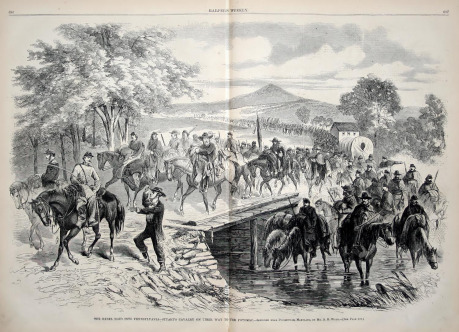
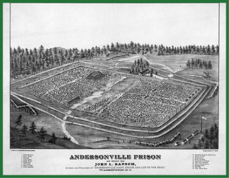
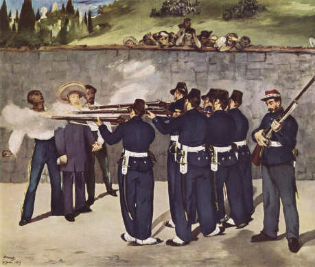
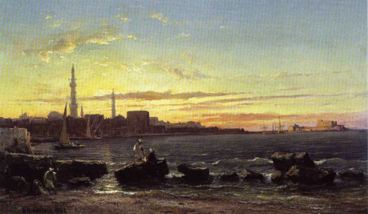

Moji milí čtenáři a čtenářky, příběh, s nímž se na těchto stránkách v letmém náčrtu seznámíte, vám bude jistě dobrým ponaučením do života. Autor těchto řádků dokonce doufá, že vám jeho vylíčením neposkytne ponaučení o nic menší nežli novela _Chudý chlapec, jenž pracovitostí ke štěstí došel_ či _Věrný syn aneb Zasloužené dědictví_, jakož i další díla tak oblíbená mládeží našeho kvetoucího Impéria. Vy, ctění mužští čtenáři, pečlivě zvažujte, zda v budoucnu, kdy zaujmete místa vašich otců ve správě panství a vedení rodinných továren, budete navazovat styky s cizinci s nejistou minulostí, a vy, ušlechtilé čtenářky, důkladně rozmýšlejte, kterého z nepřeberného množství nápadníků, jimiž budete beze vší pochyby zahrnuty, až plně rozkvete spanilost vašeho ženství, učiníte nejšťastnějším mužem pod sluncem. Neboť vizte, že právě hlavní hrdina našeho příběhu je mužem, z něhož byste neměli dělat ani obchodního partnera, ani manžela, natož pak – nedej Bůh – člena vašeho klubu.

Náš příběh začíná za širokou hladinou Atlantského oceánu v neklidném pohraničí Spojených států amerických, a to ve strašlivé době tamní krvavé občanské války. Samuel Elisha Figgins, jenž je právě oním mužem, jehož životní kroky budeme sledovat, ve válce stanul na straně Jihu. Je třeba uvést, že do armády Konfederovaných států amerických se vstupovalo z nejrůznějších důvodů. Zpočátku z nadšení, později, jak by poznamenal škarohlíd, spíše kvůli nuceným odvodům. Přiznejme, že pan Figgins nepatřil k idealistům a že ve vojenské službě viděl především vítanou příležitost, jak si vydělat na živobytí. Jako obyvatel Kansasu, kde zuřila miniaturní (a mnohá přecitlivělá duše by snad poznamenala, že i nesmírně špinavá) partyzánská válka už před tou velkou z let 1861–1865, měl ostatně s organizovaným násilím nějakou tu zkušenost. Coby zapuzený nemanželský syn se v padesátých letech protloukal po farmách a naučil se ovládat koně stejně tak dokonale jako kterýkoliv anglický gentleman. A tak nyní, ve věku 32 jar, nastoupil ke kavalerii, tělesu to veřejností v armádě nejvíce obdivovanému.

> ### Jak se zrodil pan Figgins
>
> Tahle postava pramení ze dvou hlavních zdrojů. Jednak jsem měl chuť vyzkoušet si v Příbězích Impéria hru za nepříliš kladnou postavu, která ale nebude stereotypní, a také jsem si chtěl vytvořit postavu spojenou s americkou občanskou válkou. Na tohle téma jsem kdysi psal diplomku, jsem členem spolku, který se zabývá re-enactingem občanské války, a mám to štěstí, že jsem se tímhle obdobím mohl zabývat i profesionálně jako historik. Do Figginsova příběhu jsem tudíž rozházel nejrůznější narážky na reálné osoby a události.
>
> Americká občanská válka je úžasně zajímavá, ale koluje o ní spousta falešných mýtů. Kdybyste se o ní chtěli dozvědět solidní informace, doporučuju vám pro začátek mrknout se do těchto knížek: Hutečka, Jiří: _Země krví zbrocená_ (2008), Vlha, Marek: _Dopisy z války Severu proti Jihu_ (2010). A případně taky na web [www.cacwa.cz](http://www.cacwa.cz), kde najdete volně přístupné informace a články v češtině.

Pan Figgins se zúčastnil několika nájezdů do seveřanského vnitrozemí a občas se svými spolubojovníky něco málo naloupil v domech civilistů. Och ano! Zvláště vy, útlocitná čtenářko, potlačte vzdech úžasu, jenž se právě snaží vyrazit z vašich půvabných rtíků! Na omluvu našeho hrdiny dodejme, že se jednalo o obyvatelstvo prohřešující se neblahým názorem, že neodvislost Jihu není záměrem Prozřetelnosti – tedy alespoň většinou. Samuel Elisha Figgins si vyzkoušel též o něco klidnější vojenskou službu, byv přeložen coby stráž do zajateckého tábora Andersonville. Tisíce Seveřanů zde během války zemřely na choroby rozličného rázu a v důsledku žalostné podvýživy, jež by se mnohému jinému oku nežli tomu náležejícímu panu Figginsovi jevila jako srdcervoucí. Jakkoliv vám osoba Samuela Elishy Figginse při pročítání předchozích řádků stačila jistě přirůst k srdci, takže ani nebudete ochotni se této myšlence poddat, přiznejme, že pan Figgins patřil k těm, kteří ze života andersonvillských zajatců dělali dokonce ještě větší peklo. Ne snad, že by propadal sadistickým sklonům, jeho srdce však jevilo nezvyklou schopnost zůstávat chladným jako kámen a jeho nadání využít každé situace k vlastnímu obohacení se zde nabízely doslova žně.

Když se Konfederace na jaře 1865 zhroutila, přišel (prosíme čtenáře, aby nám odpustil ten lehce nejapný výraz, náležející spíše než do psaného projevu mezi umouněné obyvatelstvo Dorset Street) čas sbalit švestky a zmizet. Velitel tábora Andersonville ostatně skončil po válce na šibenici coby válečný zločinec. Šlo o zbrusu nový příspěvek do dějin práva a náš hrdina nechtěl ani v nejmenším přispět k utvrzení tohoto precedentu. Samuelova investice ukořistěného jmění do otroků přišla z pochopitelných důvodů vniveč, takže ho, jak dnes v Londýně často prohlašuje, „na Jihu zašlapávaném uzurpátorskou nohou tyrana Lincolna“ nic nedrželo. Dodejme, že tragická smrt celým světem oplakávaného pana Lincolna rukou zákeřného vraha pana Figginse nikterak nedojala. Vyrazil do Mexika, v němž právě zuřila rovněž občanská válka, a to mezi příznivci republiky a císaře Maxmiliána Habsburského, dosazeného francouzskými interventy. Leč chatrná stavba císařství mexického jevila se panu Figginsovi ještě zpuchřelejší, než naznačovaly zvěsti kolující na sever od mexické hranice, a tak císařské služby záhy opustil. Doslechl se, že skupina vysokých jižanských důstojníků odjela do Egypta, aby se podílela na reformách tamní armády, a tak se do severní Afriky vypravil rovněž.

> ### Něco k zcestovalosti v 19. století
>
> Naše družina měla na základě všeobecné shody pobývat bez ohledu na původ jednotlivých postav v Londýně sedmdesátých let 19. století, takže jsem musel přimět pana Figginse opustit americkou půdu. Tak se zrodil nápad, že po občanské válce následoval několik bývalých konfederačních důstojníků, kteří skutečně odešli do Egypta. Proložil jsem to ještě mexickou epizodou (o odchodu do Mexika uvažoval třeba i Seveřan George Armstrong Custer, později proslavený během indiánských válek, ovšem na stranu republikánů), takže se z něj nakonec vyklubal celkem zcestovalý muž.
>
> Z vlastní zkušenosti mám pocit, že si hráči obecně vymýšlí hráčské postavy upjaté na jedno místo (i když v Příbězích Impéria asi silně působí příklady vysloužilců z Indie a zběsilých dobrodruhů à la Indiana Jones). Ve viktoriánském prostředí se není třeba bát nechat svou postavu objet kus světa ani v případě, že jde o prostého dělníka. Obzory většiny prostých lidí samozřejmě zůstávaly dost omezené, ale 19. století bylo taky svědkem populační exploze a obrovského rozmachu dopravy. Jen z Evropy do Ameriky tehdy proudily miliony vystěhovalců (kolem poloviny století byli nejpočetnější Němci a Iři). Častou záležitostí byla taky takzvaná sezónní migrace – například z českého jihu mířily pravidelně tisíce mladých lidí do služby či za výdělkem do Rakous. Takže se nebojte nechávat své postavy něco málo zcestovat, otevře vám to nové možnosti, a navíc to bude naprosto věrohodné :-).

Nemějme mu přitom za zlé, že desátník Figgins ze sebe při této příležitosti udělal kapitána a že svou minulost v roztodivných a barvitých, nicméně vavříny nepříliš věnčených partyzánských jednotkách „vyměnil“ za službu v 43. praporu virginské kavalerie, jenž se proslavil pod velením legendárního plukovníka Mosbyho. Ba nestyďme se přiznat, že čas od času pan Figgins vyšperkuje líčení svých válečných zkušeností historkou o tom, kterak ho přímo na bojišti povýšil za projevenou statečnost proslulý generál Stonewall Jackson nebo jak vlastním tělem úspěšně zabránil nepřátelským kulím provrtat ušlechtilou lebku páně generála Leeho. Oba tito zmiňovaní vojevůdci a miláčci amerického Jihu se již odebrali na pravdu Boží, a tak mohou hrdinské historky pana Figginse vyvracet pouze prostřednictvím několika málo spiritistických médií, jež se liší od drtivé většiny svých kolegů faktem, že nejsou pouhými šarlatány. A neboť i tato média považuje k jejich neutuchajícímu zármutku většina řádných gentlemanů za obdobné šarlatány jako převažující zbytek, můžeme usuzovat, že Samuelu Elishovi Figginsovi bude tato praktika ještě dlouho procházet. Tedy alespoň do okamžiku, kdy pilní badatelé a historici shromáždí v tlustých svazcích veškeré detaily z životů generálů Jacksona a Leeho, a příběhy líčené panem Figginsem tak dostanou vážné trhliny.

Ovšem vraťme se k životním osudům našeho hrdiny. Ani Egypt našemu kapitánovi příliš neprospíval. Zatímco jeho výše postavení kolegové začínali trpět znechucením z problémů se zásobováním a všudypřítomné korupce, Samuel Elisha Figgins propadal ještě hlubšímu znechucení prakticky ze všeho. Jeho mimořádně pevné (někdo by snad opáčil tvrdé) zacházení s egyptskými odvedenci, jež zásadně oslovoval jako „tmavou špínu“, dosáhlo neblahého vrcholu, když před zraky nastoupeného mužstva ubil holí jistého egyptského poddůstojníka. Pravda, poddůstojníkovy boty skutečně nebyly natolik vycíděné, jak se sluší na přehlídku, v tom by musel dát kapitánu Figginsovi za pravdu každý dbalý důstojník od Francouze po Rakušana. I tak ovšem egyptské mužstvo na našeho horlivého zastánce disciplíny dosti zanevřelo, ba dokonce natolik, že jeho další přítomnost v Egyptě se stala nebezpečnou jeho vlastnímu životu. Tak to alespoň naznačovali škorpioni opakovaně nalézaní panem Figginsem v nitru jeho jezdeckých holínek a dvě či tři kule vypálené uprostřed měsíčné noci jeho směrem zpoza zdi kasáren. „Ha, tak se tedy tato zaostalá země odvděčuje bílým nositelům civilizace,“ pomyslel si náš milý Samuel a vzápětí se prozíravě rozhodl opustit horkou půdu nevděčného Egypta.

Vyrazil vstříc Starému světu a po drobném intermezzu s mořskými piráty dospěl do staré dobré Anglie, v níž zůstává dodnes, byť jí s nejhlubší hořkostí stále odmítá odpustit, že výrazněji nepodpořila jeho jižanskou vlast v boji za neodvislost. Páně Figginsovy mravy jsou oproti divokým letům nerozvážného mládí poněkud uhlazeny, ovšem jeho mluva zůstává na první poslech notně americkou se vším, co k tomu náleží. Černý klobouk a revolver Reming­ton vzor 1858 k němu patří stejně tak neodmyslitelně jako jeho vysoká postava, hluboké oči a velkolepé stočené kníry. Pobývá v Londýně, a neboť postrádá dostatečný majetek, jenž by gentlemanovi zajistil řádnou a pohodlnou existenci, živí se coby nezávislý odborník v rozličných obchodech a podnikatelských činnostech („Jakejch­pak činnostech, nekalejch kšeftech!“ opáčil by nejeden z prostých lidiček ve Whitechapelu) a dává naplno vyniknout svému armádní službou vycizelovanému daru udržovat klid a pořádek („Houby s voctem, nájemnej vrahoun při vyřizování vzájemnejch účtů v podsvětí to je!“ dodal by opět onen imaginární prostý obyvatel odvrácené strany Londýna).

Při tom všem si Samuel Elisha Figgins stále nachází čas připomínat si slavná výročí spjatá s historií konfederační války za nezávislost, pořádat oslavy narozenin prezidenta Davise, jakož i dalších konfederačních pohlavárů, spílat prohnaným seveřanským mágům z Bostonu a New Yorku, kteří svým uměním nemálo přispěli k dobytí Richmondu, a dávat na odiv svou takříkajíc starozákonní zbožnost. K jeho nejmilovanějším pasážím, jež s oblibou předříkává svým – jak to jen ohleduplně vyjádřit... – obchodním partnerům, náleží příznačně tato pasáž z knihy Samuelovy: „Dnešního dne zavře tě Hospodin v ruku mou, a zabiji tě, a setnu hlavu tvou s tebe, a vydám těla vojska Filistinského dnes ptákům nebeským a šelmám zemským, a pozná všecka země, žeť jest Bůh v Izraeli.“ V klidných chvílích zaslouženého odpočinku se pak náš kapitán oddává mimořádně přikrášleným vzpomínkám na starou dobrou Dixie a pomalu se poohlíží po vhodné manželské partii, jež by pozvedla jeho společenské postavení. A ať už je zrovna doba pohnutá či nikoliv, denně vykouří značné množství virginského tabáku.

### Samuel Elisha Figgins

z hlediska herních mechanismů

__Aspekty:__ | __Dovednosti:__
Konfederát až na kost | [][][] Střelba z revolveru
Válečný veterán | [][] Jízda na koni
Zcestovalý vyhnanec | [] Velení v boji
Srdce z kamene | [][] Rvačka
| [][] Orientační smysl
| [] Hledání stop
| [][] Umění výslechu
| [][] Zastrašování

__Cíle:__

- Krátkodobý: Splnit poslední zakázku od čínského pašeráckého gangu.
- Dlouhodobý: Domoci se pohodlného životního zajištění, společenské úcty a pověsti vynikajícího gentlemana.

> ### Postavení důstojníka
>
> O tom, co obnášelo důstojnické řemeslo, se toho hodně dočtete v moc pěkné příručce k Příběhům Impéria nazvané __Kniha dobrodružství__. Nechci tu opakovat její obsah, ale spíš dodat pár postřehů. Sloužit v evropské armádě znamenalo stát poněkud mimo zbytek ostatního obyvatelstva. Myšlenkou, že mezi vojákem a civilistou leží nepřekonatelná propast, se opakovaně zabýval například francouzský básník a dramatik Alfréd de Vigny v knize _Vznešenost a bída vojenského života_ z roku 1835 – v mládí sám sloužil v armádě. Na rozdíl od řadového vojáka disponoval důstojník solidním příjmem, který z něj činil slušnou manželskou partii, ale ani sňatek ho vlastně plně nezařazoval do zbytku společnosti. Možné odvelení na jiné místo naopak od běžných poměrů odtrhávalo i jeho ženu a děti.
>
> Být důstojníkem taky znamenalo dodržovat určitý kodex cti a zvláštních zvyklostí. V rakousko-uherské armádě si například důstojníci mezi sebou tykali a na ulici nenosili žádná zavazadla, tedy s výjimkou květiny či jiného daru pro dámu. Dlouho by se dalo psát i o tradici soubojů, která se u vojska udržovala bez ohledu na oficiální zákazy a nad níž se v tomto prostředí zpravidla přimhuřovalo oko.
>
> Velký rozdíl od evropských armád představovala ta americká. Na rozdíl od Evropy byla před občanskou válkou miniaturní, měla jen něco přes 16 000 mužů, kteří vesměs sloužili v indiánském pohraničí. Důstojnický sbor se v ní pochopitelně nerekrutoval z řad šlechticů jako ve Starém světě a vůbec byla tato armáda mnohem víc „demokratická“. Na začátku občanské války se začalo s nabíráním obrovského množství dobrovolníků a nakonec oběma nepřátelskými armádami prošly víc než 3 miliony mužů (a několik málo tisíc žen v mužském převleku). Propast mezi důstojníky a mužstvem, stejně jako mezi civilisty a armádou jako takovou, zde byla mnohem menší. Za všechno mluví už to, že si hlavně na začátku konfliktu některé dobrovolnické jednotky volily důstojníky. To by si v Evropě nešlo ani představit.
