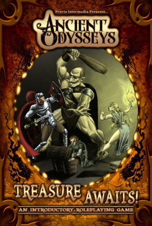

## Ako ku knihe

Najľahšie sa k hre možno dostať v PDF podobe z [DriveThruRPG](http://rpg.drivethrustuff.com/product/78591/Ancient-Odysseys-Treasure-Awaits-PDF), kde za 7 dolárov dostanete do ruky predovšetkým tri krátke príručky. Nečakajte však Príručku hráča, Príručku Pána Jaskyne a Monštruózny manuál!

Hra totiž tlačí na rýchly začiatok a spoločné radostné hranie. Hlavný mód hrania spočíva v spoločnom družinovom preliezaní jaskyne, ktorú vám nagenerujú kocky. A tušíte správne: Rozprávač pri tom nie je povinný, pretože viete hrať voči mape. Kúzelným dôsledkom je možnosť hrania v sólo móde: pripravíte si hrdinov, stvoríte jaskyňu, a hor‘ sa kynožiť potvory a pchať poklady do batohov.

A aby tvorba jaskyne netrvala pridlho, dvadsaťpäťstranová _Druhá kniha: The Jaskyňa_ vám jednu takú jaskyňu dáva priamo do rúk.

## Tvorba postavy

Tvorbu postavy a rady, ako hrať, dostanete v prvej, zhruba 35 stranovej, príručke. Vyberiete si spomedzi klasikov: čakajú vás rasy ľudí, elfov, trpaslíkov a, och, hoblingov (presne, prezlečených hobitov, lebo trademark nepustí); len tri povolania (tipujete správne: bojovníci, kúzelníci a zlodeji) a tri základné vlastnosti. K tomu si vyberiete štyri zručnodbornosti (medzi ktoré patrí kúzlenie, súboj na blízko, ale aj schopnosť lepšie vykrádať miestnosti), dohodíte zbraň, brnenie a prípadne kúzla a ste pripravení.

Takáto príprava je mimoriadne rýchla: obvykle vyberáte z kratučkých zoznamov, kde nehrozí tiahla meditácia nad tým, či je Atletika lepšia ako Súboj Šerm.

## Do jaskyňoch!

_Vchod očividne pochádza z dávnych čias: jeho kamenná obruba je popraskaná a niektoré kamene v nej držia len tak-tak._

Aby hráči neboli ani chvíľu zmätení, čo majú robiť, hra rovno povie, že ich cieľom je prechádzať z komnaty do komnaty a __celá__ hra sa odohráva v kolách. Naozaj, žiadne „fázy kolového boja“ a „fázy pohovu s oddychom, konverzáciou, jedením čipsov a vyšívaním brnení“. Vhupnete do prvej miestnosti jaskyne a okamžite si hádžete na reakciu (známa iniciatíva), ktorá určí poradie. Postupne sa zbavíte pascí, čelíte obyvateľom miestností a na záver zozbierate poklady. Pravidlá sú touto formou pevne v kraji stolových hier: staršinom sa síce môže zdať, že to uberá tvorivosti, na druhej strane má hra v každej chvíli jasnú štruktúru a vždy je jasné, čo má kto robiť. (Istým spôsobom to možno prirovnať ku kartovke Munchkin, aj keď tá je ešte viac zjednodušená paródia.)

Aj hráč vo svojom kole má právo na výber jednej akcie z pevného zoznamu: môže napríklad hľadať pasce, zaútočiť, zoslať kúzlo, zakrádať sa, alebo, ak je najhoršie, ujsť z miestnosti.

Ak treba určiť úspech, ide sa klasickým spôsobom: hodíte kockou, pripočítate základnú schopnosť, zručnoodbornosť a porovnáte s pevným cieľovým číslom – ktoré je zvyčajne sedem. Rozličné situácie dokážu s týmto číslom hýbať nahor, aj nahor (tma zvyšuje náročnosť niektorých akcií o štyri body, odhalená pasca je o va body slabšia pri jej účinkoch).

Samozrejme, dôležitý je súboj, ale v ňom je to opäť vcelku jednoduché: hádžete svojou zručnoschopnosťou voči súperovej obrane (ktorú môžete určiť jednoducho na základe štatistík, či zložitejšie s použitím jeho vhodnej zručnoschopnosti), zbraň určí počet kociek zranenia a súperove brnenie vie ujmu zredukovať.

Ak by mohlo byť samotné vyhodnotenie jednoduché, mimoriadne fintivo je vyriešený pohyb: schematický diagram súboja má políčka pre súperov, ktorí sa vedia zasiahnuť na blízko, alebo sú vzdialení, alebo sa zakrádajú. Žiadne štvorčeky či hexagóny nie sú potrebné a pritom stále máte vizuálny prehľad o tom, kto sa kde nachádza.

Mágia je potom radostným dodatkom: vďaka kúzlam (ktoré napodobňujú klasické hity ako „Magická strela“) viete zraňovať, ale aj liečiť, stať sa neviditeľným, zabraňovať útokom a získavať mnohé okamžité taktické výhody.

Ak súboje a odpascovávania a kúzlenia prebehnú bez ujmy na zdraví, vyfasujete od komnaty rozličné zbrane, brnenia, zvitky, alebo jednoduché zlatky. Cieľom hry je totiž vyjsť z jaskyne s aspoň 500 zlatkami či jedným magickým predmetom.

Hra nezabúda ani na skúsenosti: voľne povedané, čím viac príšer ste porazili a čím menejkrát ste umierali, tým viac bodov dostanete: a za ne si môžete vylepšovať štatistiky svojej postavy.

## Vlastné jaskyne

Ak sa vám podarí prejsť celú jaskyňu z druhej knihy, určite budete chcieť hrať ďalej. Celá tretia príručka je venovaná hlavne elementom jaskýň, ktoré si na začiatku môžete „bezducho“, ale jednoducho vygenerovať len hodmi kockou. Nakockujete si miestnosti, prepojenia medzi nimi, vybavíte ich náhodnými pascami (na všetko máte tabuľky) a príšerami z definovaného zoznamu, rozsejete poklady a ste pripravení.

Samozrejme, náhodnosť má pomáhať: verím, že čoskoro sami začnete kreatívne uvažovať nad zákonitosťami jaskyne, prípadne si vytvoríte vlastné príšery či pasce.

Takéto zoznamovanie cez zoznamy má skvelú vlastnosť: dáva priestor do budúcich rozširujúcich príručiek. A naozaj, dodatkové pravidlá _More Treasure Awaits_ robia presne toto (a vychádzajú tiež von, do prírody).

{:.sidebar}
Ak nemáte prístup k tejto hre, skúste hru s podob&#173;nou filozofiou, aj keď odlišnejšími pravidlami. <a href="http://rpgforum.cz/anotace/kouzlem-a-mecem">Kouzlem a mečem</a> pristupuje k tomuto žánru v ešte skladnejšej forme, aj keď je trošku ďalej od tejto doskovkovej formy.

## Záver

Mnohé hry žánru oldschool sa vracajú ku koreňom, ale miestami obetujú prístupnosť smerom k začiatočníkom na úkor vyvolávania nostalgie u veteránov, ktorí si pamätajú ducha starých hier. Ancient Oddysseys sa nesnaží byť inovatívnou dramatickou hrou na hrdinov, a práve to je jej výhoda. Je to hlavne retro zábava na hranici doskovej hry obalená do elegantného, uchopiteľného a kompaktného stostranového A5kového trojnávodu, kde sa bez zložitej prípravy zabavíte nielen na jeden večer.
