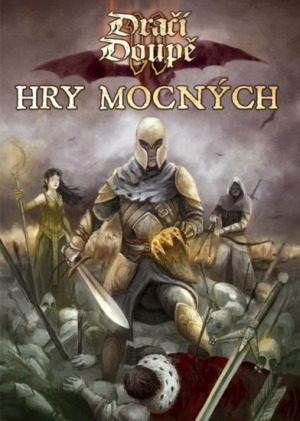

V květnu 2012 jsem uspořádal nábor mezi předem vytipovanými nejaktivnějšími fanoušky DrDII. Dva ochotní odvážlivci, Pavel „Tork“ Zoubek a Michal „Ocho“ Chocholoušek, položili spolu se mnou a pár veterány DrDII základ budoucímu týmu. Měsíc nato se konala ustavující schůzka, které se zúčastnili tvůrci základní knihy a někteří z budoucích autorů Her mocných (aniž to třeba ještě věděli, jako Šimon „Bart“ Stiburek) a na níž se vyjasnilo směřování příručky.

Kniha měla obsahovat tři základní části – nová „mistrovská“ povolání, pravidla pro hru ve světě mocných (bitvy, hrady, intriky atp.) a nakonec inspirační materiál, který by hráčům ukázal, co vše se dá s mocnými postavami prožít. Ustálil se pracovní název „Mistři“, neboť jsme nechtěli kopírovat Experty starého DrD ani Legendy, které v té době vznikaly v dílně nakladatelství Mytago (odkaz na hokej nám nevadil).

Dali jsme si za cíl do roka vytvořit betaverzi a předat ji uzavřenému okruhu zájemců pro testování. Byl stanoven rámcový časový plán, který vypadal zhruba takto:

- __VI–IX 2012:__ vývoj/úpravy potřebných mechanik, diskuze o podrobném obsahu, nábor testerů
- __X 2012 – II 2013:__ testování mechanik (testeři), psaní textů (autoři)
- __III–IV 2013:__ adaptace textů na otestované mechaniky
- __konec IV 2013:__ uzávěrka betaverze
- __V 2013:__ korektura a rychlosazba betaverze
- __VI–VIII 2013:__ sběr připomínek k betaverzi
- __IX 2013:__ uzávěrka finální verze
- __X–XI 2013:__ korektury a sazba finální verze
- __XII 2013:__ výroba
- __Vánoce 2013:__ vydání

Až do úseku „VI–VIII 2013: sběr připomínek k betaverzi“ běželo všechno hladce. Autoři psali, komunikovali spolu v diskuzích, které laskavě hostovalo RPG Fórum (někdy bylo třeba diskuze usměrňovat, aby se veškerá energie spolupracovníků nerozptýlila jen v nich). Testeři testovali a odevzdávali své reporty včas a ve slušné kvalitě.

### Autoři a spoluautoři

- Šimon „Bart“ Stiburek – pravidla pro organizace, oddíly, nová povolání, psaní textů
- Jakub „boubaque“ Maruš – korektury a revize
- Ján „Crowen“ Rosa – dobývání, ukázkové organizace, pravidla pro oddíly a organizace
- Jonáš „Ecthelion“ Ferenc – ukázková města
- Karel „Charles“ Černín – život u dvora a další inspirační texty, korektury a revize
- Petr „ilgir“ Chval – vedení projektu, texty o hraní, ukázkové postavy, oddíly a organizace, korektury a revize
- Filip „MarkyParky“ Dvořák – pravidla pro organizace, oddíly, dobývání a nástroje, ukázkové oddíly
- Jiří „Maugir“ Vinklář – bestiář
- Michal „Ocho“ Chocholoušek – nová povolání, pravidla pro oddíly a organizace, bestiář
- Tereza „Raven“ Tomášková – korektury a revize
- Pavel „Tork“ Zoubek – nová povolání
- Kryštof „Ecthelion“ Ferenc – obálka, ilustrace
- Jan „Merlkir“ Pospíšil – ilustrace povolání
- Ondřej „Rimbo“ Hanzlík – ilustrace

Současně s externím testováním nových zvláštních schopností a pravidel probíhalo interní testování herního stylu mocných, na základě kterého pak vznikaly texty o hraní.Betaverze měla něco přes 100 stran a při jejím uzavírání se zjistilo, že finální verze rozhodně nebude pouze přepracovanou betaverzí. Již během jejího vzniku se totiž vynořilo značné množství nápadů, co všechno by ještě příručka měla obsahovat. Pravidla pro dobývání a nástroje, ukázkové oddíly, postavy a organizace, to vše se do betaverze nestihlo zahrnout.

Autoři se tedy pustili do druhé vlny práce, připomínkování, komunikace s testery a opravování. Do týmu přibyla významná posila, Filip „MarkyParky“ Dvořák, tester, pro jehož nesmírně přínosnou zpětnou vazbu mu byla nabídnuta účast na projektu. Někteří z autorů naopak z tempa vypadli a dál už přispívali jen sporadicky. Toto období bylo o něco hektičtější a kladu si tedy otázku, zda jsem neměl být přísnější při posuzování toho, co do příručky ještě pustit a co už ne. Nechci tím říct, že některé texty v knize jsou zbytečné – to ať posoudí čtenáři. Je však faktem, že při uzavírání projektu se nám vinou „bonusových“ textů posunuly termíny oproti plánu zhruba o dva týdny. Z toho vzešel značný tlak na korektory, kterým se naštěstí dostalo ochotné posily v osobě Terezy „Raven“ Tomáškové. Vzhledem k tomu, že plán obsahoval značné rezervy, to ovšem neměl být ten hlavní problém.

Největší obtíže přišly později a týkaly se nečekaně ilustrací. Zjistilo se, že dlouhodobě domluvený ilustrátor obálky nakonec práci nedodá, a ani ze záložního ilustrátora jsme nic kloudného nedostali. Obálky se tedy v časovém presu zhostil Kryštof „Ecthelion“ Ferenc, autor grafické identity Příběhů Impéria a obrázků v základní knize DrDII. Přes nepříznivé podmínky odvedl slušnou práci a je na místě mu poděkovat, protože zachránil termín vydání. Problém se vyskytl i u vnitřních ilustrací, konkrétně obrázků povolání. Tam zase pro změnu autor Jan „Merlkir“ Pospíšil onemocněl uprostřed rozdělané práce. Nahrazení jiným ilustrátorem nepřicházelo v tomto případě v úvahu, protože konzistence ilustrací měla přednost.

Zdržení se projevilo tím, že do Vánoc obdrželi své výtisky pouze ti, kdo využili předprodej na stránkách Altaru. Na pulty obchodů se příručky dostaly až v lednu 2014. Z takové situace má pochopitelně nejtěžší hlavu vydavatel. Autoři, jak věřím, si radost z díla a úlevu po vypjatém finiši tak snadno zkazit nenechají. A fanoušci vychovaní „odkládací politikou“ Altaru? Ti nejspíš s údivem konstatují, že zpoždění bylo tak malé.

Závěrem nezbývá než poděkovat autorům, jejichž jména a stručný obsah práce najdete v rámečku. Upřímně musím uvést, že jejich kázeň při dodávání textů a vzájemné spolupráci mě příjemně překvapila. O tom, zda pro vás jsou Hry mocných překvapením příjemným, nepříjemným nebo vůbec žádným, můžete diskutovat na [Oficiální diskuzi hostované RPG Fórem](http://rpgforum.cz/forum/viewtopic.php?f=262&t=12057).
