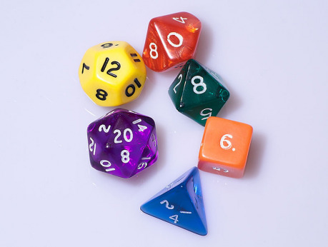

V tomto článku bych se rád věnoval tomu, jak vlastně RPG vzniklo, které byly první RPG hry a z jakých pramenů vznikla a vychází. První skutečnou RPG hrou, která vznikla, byla dnes již legendární Dungeons & Dragons (DnD). Stopy „hraní rolí“ a „příběhového hraní“ lze ale vystopovat již dříve. Podívejme se tedy spolu na historii vzniku rolového hraní a RPG her jako takových.

## RAND Corporation (padesátá a šedesátá léta 20. století)

Jedny z prvních „PRG her“, které se mi podařilo dohledat, probíhaly v padesátých letech pod patronátem společnosti RAND. To je think-tank, který se věnuje výzkumu a analýzám pro ozbrojené síly Spojených států, který založila Douglas Aircraft Company. Mezi lety 1955 a 1956 se pod vedením Herberta Goldhamera, ředitele oddělení sociálních věd v rámci RANDu, odehrála nejméně čtveřici simulací, které připomínaly RPG víc než jen trochu. Hráči v nich seděli kolem stolu s mapami, pravítky, tabulkami a kostkami. Ujali se rolí různých světových vůdců, zatímco Goldhamer sám se ujal role „Boha“ či „Přírody“ a určoval pravděpodobnosti úspěchu akcí hráčů (načež se nezřídka rozhodovalo kostkami), stejně jako vnášel do hry náhodné události. Byly to samozřejmě simulace, takže hráči nebyli omezeni žádnými „možnými akcemi“, ale mohli podnikat všechno, co v reálném světě. Jejich akce tak byly omezeny jen jejich vlastní představivostí.

V září 1961 (několik týdnů před stavbou Berlínské zdi) vedl ekonom a spolupracovník RANDu Thomas Schelling (v roce 2005 získal Nobelovu cenu za ekonomii za svou práci na poli teorie her) simulaci berlínské krize pro skupinu vysokých politiků v Camp Davidu (venkovském sídle amerických prezidentů). Mezi hráči byli McGeorge Bundy, Carl Kaysen, Henry Kissinger a Walt Rostow. Podle všeho byla hra velmi realistická. O rok později během kubánské krize řekl David Ellsberg Waltu Rostowovi: „Tohle ukazuje, jak realistická ta berlínská hra byla.“ Odpovědí pak bylo: „Nebo jak nereálné je tohle všechno.“

Na Halloween roku 1963 vedl Schelling další hru – tentokrát pro předsedu sboru náčelníků štábů, ředitele amerického rozpočtu, šéfa mariňáků a ministra spravedlnosti Roberta Kennedyho. Podle všeho byl Bobby hrou skutečně zaujat a chtěl odehrát další, zaměřenou na občanská práva. Nikdy k ní ale nedošlo, protože o dvacet tři dní později byl zavražděn jeho bratr a Kennedy měl jiné starosti.

## New Games (šedesátá léta 20. století)

Dalším poměrně významným východiskem pro vznik RPG bylo hnutí New Games, které na konci šedesátých let vedli Kenneth Boulding a architekt Buckminster Fuller. Hnutí odmítlo základní premisu, na které hry (a především wargamovky) do té doby stály – a tím byl předpoklad, že každá hra má jednoho vítěze, který bere vše. New Games to nahradily myšlenkou kooperativní hry, kde odměnou samou je _hraní_. Tyto nové hry sahaly od projektu Stewarda Branda jménem „Zeměkoule“, který spočíval v tom, že dav kutálel velkou nafouknutou zeměkouli po poli... až po společné divadelní a kooperativní projekty, které se už tehdy jmenovaly „hraní rolí“ (role playing) ještě před tím, než RPG vznikly.

## Brauenstein(1967, nepublikováno)

Pokud se bavíme o zdrojích a počátcích RPG, dojdeme zákonitě ke jménu __David Wesley__. Ten byl členem dodnes existující skupiny _Midwest Military Simulation Association (MMSA)_, která sdružovala hráče deskových her a wargame v Minneapolis a St. Pauls (dvojice měst oddělená řekou, často známá jako Twin cities).

Skutečné dějiny RPG, jak jej známe dnes, se začaly psát v roce 1967, kdy David Wesley dělal rozhodčího pro wargame z napoleonského období odehrávajícího se ve fiktivním německém městečku _Brauenstein_. Na hru se přišlo podívat příliš mnoho hráčů, a proto se rozhodl, že i jim umožní, aby se na hře podíleli. Rozdal proto i okolostojícím role ve hře – mezi hráči tak byl starosta města, bankéř, šéf zdejší univerzity a další. Během hry musel zavádět mnoho ad hoc pravidel, protože hráči začali skutečně hrát svěřené postavy. Došlo dokonce k duelu mezi dvěma postavami, který byl rozhodnut hodem kostkou. Výsledky byly hodně chaotické a Wesley sám hru považoval za neúspěch. Jeho hráčům se ale líbila a požádali ho, aby s nimi hrál další.

Wesley během této hry položil několik základních kamenů pro budoucí hraní RPG. Hráči se propříště identifikovali s jednou postavou na bitevním poli (namísto celé armády jako v případě wargame) a volná pravidla jim umožňovala vykonat jakoukoli akci, jejíž výsledek určil rozhodčí hry (na rozdíl od wargame a deskovek, kde jsou akce modelů omezené na několik popsaných). Wesley sám byl prokazatelně ovlivněn pracemi lidí z RANDu (především The Compleat Strategist od Kennetha Swezyho, která se věnuje teorii her) i pracemi lidí, kteří se věnovali New Games.

Později přišel Wesley s novým scénářem, kde se postavy snažily provést převrat (nebo mu zabránit v případě jiných postav) v malé latinskoamerické zemi. Pak byl ale Wesley povolán do armády, aby jel bojovat do Vietnamu. Nikdy si svůj vynález nového hraní nepatentoval nebo jakkoli jinak neochránil, protože v té době předpokládal, že ve Vietnamu padne. Navzdory tomu přežil a po dvou turnusech, které si tam odsloužil, se vrátil domů. K RPG se ale nevrátil, napsal několik deskových her a poté se podílel na vytváření počítačových her.

Jeho herní skupinu převzal __Dave Arneson__ (jak správně tušíte, jeden ze dvou autorů Dungeons & Dragons), další z členů MMSA, který přišel na první _Brauenstein_ a pak pokračoval v hraní. Arneson původně pokračoval ve scénáři latinskoamerické země, ale pod vlivem Pána prstenů a Dark Shadows (americký hororový televizní seriál) se rozhodl přejít na fantasy scénáře, které byly plné skřetů, elfů a čarodějů. V roce 1970 vstoupil mezi prvními do společnosti Castle & Crusade Society, zaměřené na hraní středověkých wargame, kterou vedl __Gary Gygax__ (a tady už je druhý z autorů Dungeons & Dragons).

## Chainmail (1971)

Gary Gygax se začal o wargaming zajímat poté, co na srazu „Lake Geneva Wargames Convention“ (LGWC funguje dodnes, známější je jako GenCon; Lake Geneva americké město ve Wisconsinu) zahlédl hraní hry Siege of Bodenburg. Vytvořil pak několik vlastních pravidel pro hraní středověkých bitev a založil kvůli tomu, jak již bylo zmíněno, společnost Castle & Crusade Society, kam brzy vstoupil David Arneson a velká část hráčů z Minneapolis a St. Pauls.

V roce 1970 nakoupili LGWC velké množství středověkých figurek a nevěděli, co s nimi. To motivovalo Jeffa Perrena, aby vytvořil pravidla pro hraní s těmito figurkami. Představil je pak Gary Gygaxovi, který je mírně upravil, a vyšly ve wargamerském časopise Panzerfaust jako „Geneva Medieval Rules“ („Ženevská středověká pravidla“). Pravidla poté několikrát rozšířil (kupříkladu o turnaje a osobní souboje) a měly velký ohlas na celou Castle & Crusade Society, protože tehdy pravidla pro středověké válčení byly vzácné.

V roce 1971 pak tyto upravené a pozměněné pravidla vyšly souhrnně pod názvem Chainmail („Kroužková košile“). Téměř na poslední chvíli k nim Gygax přidal čtrnáctistránkový „fantasy dodatek“, kde byly pravidla pro hrdiny, čaroděje, draky, elfy a další fantastické tvory a bytosti. Chainmail se ukázal jako největší hit společnosti Guidon Games a prodávala se stovka kusů měsíčně.

Chainmail se v mnoha ohledech podobá pozdějšímu DnD (popravdě první edice DnD vyžadovaly pro hraní vlastnění pravidel Chainmailu a pravidelně se na něj odkazovaly; teprve ADnD eliminovalo nutnost vlastnit knihu Chainmailu ke hraní), ale je to samozřejmě wargame. Objevují se tu magické zbraně, elementálové, kouzla jako Fireball a Lightning Bolt. Některé figurky si také mohou házet záchranné hody, objevují se tu koncepty Řádu a Chaosu (tedy předobraz pozdějšího přesvědčení). Fantasy bytosti byly ve hře charakterizovány jako některé ze šesti druhů jednotek – hobiti byli zařazeni jako lehká pěchota, elfové byli pěchota těžká, hrdinové jsou pak řešeni jako čtyři těžcí pěšáci (bylo potřeba odebrat jim čtyři zásahové body... tedy pozdější hit pointy), superhrdinové pak byli ekvivalentem dokonce osmi těžkých pěšáků.

## Blackmoor (počátky 1971, vydáno 1975)

Krátce po založení Castle & Crusade Society vznikla myšlenka založení „Velkého království“ s tím, že kusy země v tomto království byly rozdány členům organizace, kteří o ně pak válčili. David Arneson získal zodpovědnost za severní državy Velkého království a zde začal vznikat svět, který později vyšel jako dodatek DnD. V těchto severních končinách Velkého království začal organizovat hry středověkého „Brauensteinu“ s pravidly Chainmailu.

Blackmoor fungoval jako válečná hra pro víc hráčů, která se soustředila na válku sil Chaosu proti Řádu. Středem hraní bylo baronství Blackmoor a hráči hry představovali síly dobra (Duane Jenkins byl jako „sir Jenkins“ vládcem Severní marky, Mike Carr byl biskupem Blackmooru a podobně).

Hráčům se velice zalíbila dodatečná mechanika, kterou Arneson vymyslel – tou bylo prozkoumávání podzemí. Byla to pro ně nejzábavnější část hry, a tak kolem roku 1972 se už řešily v podstatě jen výlety do podzemí. Jak poptávka po hraní Blackmooru vzrůstala, předal Arneson autoritu rozhodčích her i pro své původní hráče (kteří pak dělali pro rozhodčí v rámci svých skupin).

V létě roku 1972 prezentoval svoje inovace celé Castle & Crusade Society v rámci článku a na podzim pak hru předvedl osobně Gary Gygaxovi. Následně nato začaly práce na Dungeons & Dragons.

Hraní Blackmoorské kampaně pokračovalo a začalo se koordinovat s hraním paralelní kampaně zvané Grayhawk, kterou vedl v Lake Geneva právě Gary Gygax. Když ale klíčoví účastníci hraní (především Arneson) odešli z Minneapolis do Lake Geneva, aby tu pracovali, hry se stávaly čím dál více sporadičtější.

Svět Blackmooru pak vyšel jako druhý dodatek pro DnD (prvním byl Gygaxův _Greyhawk_) pod TSR v roce 1975. Obsahoval nová monstra, poklady a první vydané dobrodružství pro RPG vůbec, kterým se stal „Temple of the Frog“ („Chrám žáby“). Kromě popisů v dobrodružství neobsahoval dodatek žádný popis světa, ten přišel až později.

## Dungeons & Dragons (1974)

Původní DnD, které se dnes často označuje jako oDnD (original DnD), vyšlo v roce 1974 v podobě tří útlých sešitků. Bylo to první vydané RPG na světě. V mnoha ohledech navazovalo na Chainmail, ze kterého se pravidla vyvinuly, a jak již bylo řečeno, v textu se na něj i odkazovalo. Chainmail měl navíc sloužit pro vyhodnocování bitev velkých armád.

Text sám byl napsán z pohledu wargamera, takže úplný nováček, který nehrál wargame, měl smůlu, protože netušil, co se tam řeší. Přesto bylo DnD ohromným úspěchem. První rok se prodalo tisíc kopií hry, druhý rok pak již více než tři tisíce kusů a prodeje dál rostly. V roce 1975 vyšla dvojice dodatků (zmíněné moduly _Greyhawk_ a _Blackmoor_), hru pak dále rozšiřovaly další oficiální publikace a články v nesčetných fanzinech.

V roce 1977 vydala TSR krabicovou verzi DnD – _Dungeons & Dragons Basic Set_. Ten představoval zjednodušená pravidla cílená na nováčky, kteří chtěli s hraním RPG začít. V roce 1978 pak vyšlo Advanced Dungeons & Dragons (ADnD), které se oprostilo od návaznosti na wargame, a šlo o pravidlově sjednocenou podobu původního DnD, které už k hraní nepotřebovalo Chainmail. Od původního DnD se také v mnoha ohledech odlišovalo a přechod z hraní DnD na ADnD vyžadoval určité konverze (obě hry nebyly kompatabilní).

## Další RPG hry (1975 a dál)

Již rok poté, co vyšlo oDnD, se na trhu objevily další RPG systémy. V roce 1975 samotném tak vyšla čtveřice dalších her. Druhá RPG, kterou TSR vydala, byla Empire of the Petal Throne odehrávající se ve světě Tékumel od M. A. R. Barkera, třetí pak westernově zaměřený Boot Hill (na které se podíleli Brian Blume, Gary Gygax a Don Kaye).

Vyšla i dvojice her od konkurenčních společností. Druhou RPG hrou, která vůbec vyšla tak byli Tunnels & Trolls od Flying Buffalo, kterou vytvořil Ken St. Andre. Záměrem bylo vytvořit více přístupnou verzi DnD, která by byla vhodná i na hraní pro jednoho hráče nebo třeba hraní pomocí dopisů (play-by-mail). Stejně tak vyšla i hra En Garde! od společnosti Game Designers’ Workshop, ve které se utkávali duelisti v Paříži sedmnáctého století.

V následujících letech následovaly další a další hry. Žánr RPG byl jasně definován a získával si stále více popularity mezi hráči wargame i úplnými nováčky. Značka _Dungeons and Dragons_ přešla v roce 1997 pod Wizards of the Coast poté, co TSR téměř zbankrotovala.

Během své více než třicetileté historie se RPG hry vypracovaly z odvětví pro pár nadšenců na důležité odvětví herního průmyslu. Přestože rolové hraní muselo vydržet ohromnou kontroverzi v osmdesátých letech, za kterou stála Patricia A. Pulling a její B.A.D.D. („Bothered About Dungeons & Dragons“, tedy „Máme obavy z Dungeons & Dragons“), stejně jako masivní krizi a propad hráčské popularity, která jej postihla v letech devadesátých. Celosvětově dnes existuje silná komunita, která se rolovému hraní věnuje.
