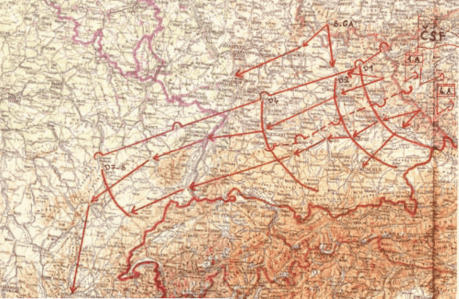
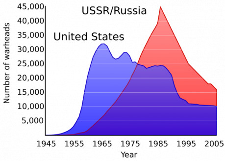
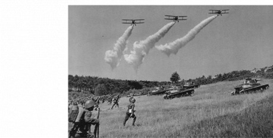

## I. Co je na plánu k vidění

Nemá asi smysl podrobně komentovat jednotlivé položky plánu. Neferitovy podrobné komentáře jsou [v tomto pojednání](http://rpgforum.cz/forum/viewtopic.php?f=88&t=11339). V dalším textu z nich částečně vycházím.

Začnu nejprve krátkým úvodem do problému pro úplné laiky, kteří jen přibližně tuší, o co v té studené válce vlastně šlo. Je to přece jen už delší doba a plno čtenářů se narodilo do úplně jiného světa.

Marxismus-leninismus byl propracovaným světonázorem, který se během socialismu vyučoval na vysokých školách. Byl povinnou součástí státnic, a to z jakéhokoli(!) oboru. Tedy i strojní inženýři museli složit základní zkoušky z marxismu, jinak prostě nevystudovali. Samozřejmě se strašlivě švindlovalo, všichni se tomu posmívali a nakonec z toho všeho v hlavě lidem uvízlo poměrně málo. Nicméně každý znal některé základní poučky a hlavně věděl, že posmívat se jim otevřeně byl recept na velikánské potíže.

Z těch nezpochybnitelných marxistických pravd nás zajímají především tyto dvě:

- _1._ Západní kapitalistické státy se nacházejí ve stadiu imperialismu, které je konečným stadiem. Je to stadium agresivní a útočné. Je tedy jisté, že na nás vojensky zaútočí. Je jen otázkou, kdy to bude.
- _2._ Komunismus na celém světě zvítězí. Je to nevyhnutelné a dané vývojem dějin. Je tedy jisté, že ve vojenském střetnutí, které vyvolá imperialismus, socialistické státy zvítězí. Je jen otázkou, kdy to bude.

> Vidím, že se hlásí několik jedinců s námitkami. Nuže, těmto pochybovačům je nutno říci, že tohle vymyslel sám V. I. Lenin ve svém geniálním díle Imperialismus, nejvyšší stadium kapitalismu – a tudíž mohou na námitky zapomenout. Doporučuji jim na námitky zapomenout. Jistě mi rozumíte, soudruzi.

K těmto dogmatům si můžeme přidat ještě jedno třetí, speciálně vojenské:

- _3._ Válku rozhodne boj mohutných tankových formací podpořený drtivými jadernými údery.

Okouzlení mohutnými tankovými formacemi plynulo samozřejmě ze zkušenosti druhé světové války. Staré strategické moudro učí, že armáda je vždy dokonale připravena na minulou válku. Rusové v tom nebyli výjimkou. Slavili s mohutnými tankovými formacemi senzační úspěchy v rozhodujících bitvách; ostatně Němci předtím také. Krásný obrázek z jakéhosi vojenského cvičení za první republiky, který sehnali Ecthelioni z webu [www.fronta.cz](http://www.fronta.cz/), ukazuje tento způsob válčení. Stačí si jen trochu zmodernizovat ta letadla a tanky, k pěšákům doplnit obrněné transportéry a máte jasnou představu, co měli východní generálové v roce 1964 stále ještě v hlavě. Tak nějak má vypadat útok, soudruzi. A když to bylo dost dobré pro soudruhy Stalina, Žukova nebo Malinovského v roce 1945, pro nás to bude dobré také.

Ty jaderné údery se do věci dostaly později jako móda let padesátých. Byla to zbraň, která zjevně imponovala i soudruhům. Obzvláště nadšen tím byl nejvyšší soudruh Chruščov. Takže to nakonec začlenili coby nezbytnou součást, i když kritické oko si všimne, že vlastně s tou mohutnou tankovou ofenzívou souvisí drtivé jaderné údery velice volně a vlastně to skoro nejde spojit.

Podstatou této zdánlivé odbočky je hlavně vysvětlení, jak zákonitě musely vypadat všechny strategické plány naší armády za komunismu.

> Musely obsahovat útok ze strany imperialistů jako úvod a hrdinnou obranu, která ten útok odrazí. A pak bylo nutno přejít do mohutné ofenzívy, nejlépe s mnoha tanky. Cokoli jiného zavánělo malérem pro autora, a dokonce válečnou zradou. Pochybuješ snad, soudruhu, že imperialisté na nás zaútočí jako první? Myslíš si snad, že by stačilo imperialisty odrazit a protiofenzíva už není nutná?

Po mírném prozkoumání této záležitosti si dovoluji tvrdit, že také tak všechny plány léta letoucí opravdu vypadaly, počínaje plány jménem Orel a Pěst z roku 1951. Odborník na nich našel jenom odlišné důrazy na fázi úvodní obrany nebo následného útoku, ale ať je jakkoli, nakonec přejdeme do vítězného protiútoku a imperialisti budou nahraní.

Plán z roku 1964 ukazuje přesně toto. Vše podstatné prozradí laikovi mrňavá mapa, kde se dvě naše armády čili celkem 8 divizí budou valit jižním Německem proti směru Dunaje a během osmi dnů dosáhnou střední Francie. Na sever od nás útočí pochopitelně Rusové a soudruzi z NDR, i když to na mapě jen tušíme. Nemusíte být velcí stratégové, abyste tušili, že drtivá většina obrany NATO byla soustředěna v Německu, a jakmile dosáhnou nepřátelé Rýna, zastaví je potom až Atlantik. Potíž je, že stavět nové linie NATO už potom pomalu není z čeho; všechno by se muselo nějak dovážet z USA.

A abyste to měli v autenticky stylovém provedení, toto pravil k věci náčelník generálního štábu ČSLA Otakar Rytíř v březnu 1965:

> „Válka bude znamenat konečný zápas socialismu a imperialismu, rozhodný boj obou táborů na život a na smrt, k dosažení základního cíle – zničení jedné ze soustav a definitivní upevnění druhé soustavy. Strategickým cílem vojsk Spojeného velení s největší pravděpodobností bude vyvedení hlavních sil NATO i základních evropských kapitalistických zemí, myšleno Německá spolková republika a Francie, z války a obsazení přístavů Atlantského oceánu. Tím bude sledován cíl zamezit přísun podstatnějších sil a prostředků z USA do Evropy a vytvořit výhodné podmínky k vedení druhé, konečné etapy války.“

## II. Podivnosti plánu z r. 1964

Každý asi tuší, že základem jakéhokoli válčení je týlové zabezpečení, jak se říkalo tehdy, neboli logistika, jak se říká dnes. Jako strom vyrůstá z neviditelných kořenů a bez nich velmi rychle chcípne, pak je to tak i s armádou, a to i za mírového stavu. Studenou válku ostatně můžeme chápat jako _neustálé přesouvání nějakých tun materiálu do bodu X v čase Č_.

V tomto smyslu dostávají Neferitovy námitky proti plánu 1964 zvláštní význam. Je totiž náhodou týlař. A vidí v plánu z r. 1964 __tento první problém__:

> Tempo útoku mělo činit 60 až 100 km za den. To jsou údaje, které mi berou dech, a je škoda, že se to ani při cvičeních nikdy nezkusilo – na to je naše území moc malé...
>
> Jestliže se v roce __1960 plánoval za pět dnů postup do Bavorska na hloubku 100 až 120 km, což odpovídalo skutečným možnostem naší armády__, pokud by neutrpěla zásadní ztráty v obranné operaci, tak po rozhodnutí příhraničního střetného boje v roce 1964 byly plánované denní postupy někde úplně jinde. Naprosto klidně plán z října __1964__ kalkuloval s překročením Rýna a ovládnutí čáry Langeres – Besancon __vzdálené více než 500 km od naší státní hranice za osm dnů od zahájení operací__. To je denní tempo postupu kolem 60 kilometrů. Tyto úvahy jsou natolik vzdálené mým znalostem a zkušenostem, že nezbývá než si myslet, že se zde prostě předpokládalo naprosté zhroucení bojových možností protivníka.

Podotýkám, že pokud pojedete tankem v míru na cvičení, asi je takový výkon reálný. Ale těžko bude reálný, když s tím nepřítel nebude souhlasit a bude po nás třeba i střílet.

__Druhý základní problém:__

> Tato závratná rychlost, s níž měl být útok proveden, __neumožňovala v daném stavu dislokací Sovětské armády ve střední Evropě společnou bojovou činnost našich a sovětských vojsk__. V té době se na našem území sovětská vojska nenacházela.

Tato námitka představuje opravdovou záhadu. Není vůbec žádných pochyb, že naše armáda v systému Varšavské smlouvy nebyla nikdy plně samostatná. V době plánu 1964 to fungovalo tak, že ČSLA vytvářela samostatný front, který měl operovat se 14 pozemními divizemi. Ovšem, další zálohy a spolupráci měli tvořit Rusové za námi. Ale spolupráce je poněkud problém, když budeme uhánět tak rychle, že za námi Rusové nemohou stíhat.

__Třetí problém.__ Plán vypočítává podrobně těch 14 divizí, které jsme měli. Naše pozemní armády byly dvě, navlas stejné: 1. armáda s velením v Příbrami a 4. armáda, sídlící v Písku. Trasy jejich postupu vidíme i na té mrňavé mapě – ty dvě dlouhé šipky a čára s obloučky představuje dělící linie mezi nimi. To máme celkem osm našich divizí.

A těch šest zbývajících tvořilo zálohy útoku, postupující vzadu za 1A a 4A. Neferit to vidí takto:

> Tyto divize byly ve své podstatě výprodej. Například __obě záložní tankové divize a tankové pluky záložních motostřeleckých divizí byly postaveny na tancích T-34__ s kanonem 85 milimetrů. Jejich bojová hodnota v roce 1964 byla krajně diskutabilní. Těchto tanků naše armáda v roce 1964 měla ve válečných bojových sestavách neuvěřitelných __1120__ kusů... Naše armáda měla v době platnosti tohoto plánu údernou sílu __3240__ tanků. To je hodně. Ale pokud odpočítáme těch 1120 starých téček, jsme na čísle __2 120__ tanků a to už vypadá jinak.
>
> Samotný protivník v našem směru jich měl cca 800 u II. armádního sboru NSR, 835 u VII. armádního sboru USA a 625 u II. rmádního sboru Francie. To dává číslo 2 255 kusů tanků, a to v případě USA a NSR (Neferit ty západní tanky dále upřesnil) M-48 a M-60 v jednotkách USA, M-47 a M-48 u Němců a AMX 13 a časem i AMX 30 u Francouzů. K tomu lze dodat, že ty americké a německé jsou plně srovnatelné s T 55, občasné Leopardy 1 dokonce lepší, kdežto ty francouzské AMX 13 jsou rovněž dost podezřelé. No, ale co je podstatné – __Při této de facto paritě tankových sil byl úspěch pozemních bojů krajně nejistý___,_ uzavírá to Neferit.

To vskutku! Co je válečná strategie válečnou strategií, platí, že obrana má vždycky výhodu proti útoku a útočníků musí být víc, aby prorazili. Kdyby tomu tak nebylo, asi by nemělo žádný smysl stavět nějaké pevnosti, zakopávat se a podobně.

Dodávám, že pokud v hrubých počtech bylo na území SRN asi 5000 tanků – a těch 2255 na našem směru, zbytek proti NDR – a měly bránit zhruba 1000 kilometrů hranic, pak to na první pohled dává docela rozumných 5 tanků na kilometr, tedy docela tuhou obranu, když se to v reálu vyztuží odpovídajícím počtem pěšáků a dalších vehiklů. Tohle si samozřejmě ti strašliví imperialisti spočítali taky a s ohledem na to měli tanků právě tolik.

Mírná převaha VS, asi 8000 tanků českých, polských a NDR, je tvořena zejména těmi starožitnými T34, které to asi moc nevytrhnou.

Plán si toho nevšímá. Řítí se směle vpřed s tím, co máme, jak ukazuje tato ohromující tabulka:

V pásmu činnosti Československého frontu

je pro celou hloubku operace pravděpodob-

ný následující poměr sil:

- v divizích 1,1 ku 1,0

- v tancích a samohybných dělech 1,0 ku 1,0

- v dělech a minometech 1,0 ku 1,0

- v bojových letadlech 1,1 ku 1,0

vše ve prospěch Československého frontu.

Coby tankista záložák pravím, že __útok v silách 1 : 1 tankových formací je totálně magorský__. A to bez ohledu na učenou debatu, do jaké míry je srovnatelné 2255 směsi tanků na západě proti naší směsi 3240 tanků. I kdybychom tvrdili, že máme krajně optimisticky počítanou převahu 1,5 : 1, je to stále nesmysl. Ta mírná převaha v T 34, plánem beztak poslaná jako záloha v druhém sledu a raději nepočítaná, by to asi nerozsvítila. A naprostou záhadu a chaos tvoří z plánu předpoklad, že někde na začátku měl ještě proběhnout ten útok NATO, který jsme nějak odrazili.

__Čtvrtý problém jsou jaderné údery.__ Plán, pokud jste dávali pozor, o nich praví toto:

> Raketová vojska frontu v prvním jaderném úderu měla zničit uskupení vojsk 7. armádního sboru USA, část sil 2. armádního sboru NSR a část sil protivzdušné obrany protivníka.
>
> V dalším hlavní úsilí se měla soustředit na zničení nastupujících operačních a strategických záloh a také nově zjištěných prostředků jaderného napadení protivníka.
>
> Pro splnění úkolů frontu použít:

Fajn. Jenže pak to najednou uvádí na pravou míru malinká poznámečka:

> Použití speciální munice – pouze s povolením hlavního velitele spojených ozbrojených sil. A k tomu ještě další detail – __v roce 1964 nebyla na našem území vůbec žádná jaderná munice!__

Naopak na území našich soupeřů byla; a Neferit po dlouhatánském zkoumání došel k tomu, že NATO mělo převahu v jaderné technice asi __7 : 1__. Považuji opět za nepodstatné bádat nad detaily, zda je tento poměr přesný; Neferita ale zcela podporuje tento hrubý, leč poučný graf:

Pro nás důležité je, že __celý plán byl zcela závislý na tom, co nám dají a povolí Rusové__.

Takže si to shrňme – __celý ten báječný útočný plán z r. 1964 popisuje, jak se naše armáda po odraženém a blíže nepopsaném útoku NATO vyřítí na západ, prosviští Německem někam do Francie, bez ohledu na to, že síly máme s protivníkem zhruba vyrovnané, bez ohledu na to, že asi ujedeme vlastnímu týlovému zabezpečení, které nebude stíhat dodávat munici, pohonné hmoty a jídlo, že ujedeme Rusům, kteří nás nebudou moci podpořit, a když budeme hodní, tak nám k tomu Rusové možná věnují i nějaké ty jaderné zbraně.__

Dnes by se asi nabízelo zvolat – WTF? Ale ježto jsme styloví, řekneme raději – Što takoje?

## III. Záhada se klube; je za tím politika

V době vzniku plánu vládl v SSSR Nikita S. Chruščov. Byl to muž, který komunistická dogmata v mezích možností docela rozhýbal. A to i ta válečná.

> V __lednu 1960__ oznámil Chruščov v projevu před Nejvyšším sovětem __radikální snížení stavu sovětských vojenských sil__ v souvislosti s údajně novou vojenskou doktrínou, postavenou na odstrašujícím účinku sovětských strategických sil. Zároveň se Chruščov zabýval úvahami nahradit armádu __domobranou__ a otevřeně __vyjadřoval nevoli s plány obsadit západní Evropu__ během několika dnů.

Maršálům musela zřejmě poklesnout čelist, když to slyšeli. Chruščov touto akcí zpochybnil maršály, mohutné tankové linie a smysl toho všeho. Nikdo ze štábu asi neměl výhrady proti jeho nadšení pro rakety a atomovky, ale zpochybňovat tanky, to byla drzost. Takže v roce 1964, kdy se začala Chruščovova pozice uvnitř politbyra sypat, vypadá ten podivný plán __právě jako demonstrace toho, co si přáli ti maršálové.__ Vše je zase na svém místě – Západ na nás zaútočí, my ho odrazíme a přejdeme do mohutné tankové protiofenzívy, protože vítězství komunismu je zákonité. A naše ofenzíva bude ofenzivnější, než kdykoli předtím.

Šlo to celé vykládat, že ČSLA bude v šíleném útoku bez jaderné podpory bezohledně obětována a pak se uvidí. Já si troufám hodnotit věci jinak: hlavním smyslem nového plánu byla podle mne nejvíc ze všeho __demonstrace dovnitř, do vlastních řad, že soudruzi jsou i nadále tvrdí, ba ještě tvrdší.__ Dlabeme na Chruščova, vracíme se k původním mohutným tankovým liniím. Mezi řádky se tu rýsovala už nová politická linie soudruha Brežněva.

A také je čertovo kopýtko v tom, že __je třeba dodat do ČSSR nějaká ruská vojska a jaderné zbraně, právě aby byl plán reálný!__ Celý plán 1964 možná může fungovat jedině tak, že bude pevnou a nedílnou součástí plánu většího, celé varšavské smlouvy, s dovolením z Moskvy, s neprodleným přísunem těch záloh z Ruska i jaderných zbraní, a to __ihned__, protože netušíme, kdy to imperialista celé spustí.

Takže mi to připadá ve skutečnosti spíš jako politické dobývání ČSSR a židlí v politbyru, než že by šlo o skutečnou válku se Západem. Dokud na naše území nedorazily ruské hlavice a ruské zálohy, mohl být Západ úplně v klidu. Plánu se měl obávat zejména Chruščov a soudruzi v Československu. A jak víme dnes, v obou případech naprosto právem.

Tím by se dal případ plánu z r. 1964 pokládat za vyřešený. Jak prosté, milý Watsone.

## IV. Jenže

Do celého vysvětlení hodila pořádné vidle reálná historie. Jak známo, v noci z 20. na 21. 8. 1968 došlo k invazi pěti armád na naše území.

Přesný průběh událostí se lze dočíst [na stránkách ÚSTR](http://www.ustrcr.cz/cs/srpen-1968-chronologie). Většina komentářů a vzpomínek se samozřejmě soustřeďuje na osobní zážitky, případně na drama československých soudruhů v politbyru odvlečených do Moskvy. Ruské tanky jsou vnímané jako anonymní masa. Zaujal mne ale tento odstavec:

> 23.00 – vojska pěti zemí Varšavské smlouvy (SSSR, PLR, NDR, MLR a BLR) překročila čs. hranice. Nejsilnější vojenské uskupení složené z divizí Severní skupiny sovětských vojsk v Polsku, 2. polské armády, 38. sovětské armády Příkarpatského vojenského okruhu, 11. gardové tankové armády Pobaltského vojenského okruhu (asi __12 divizí__ podporovaných jednotkami 4. a 9. letecké armády) postupovalo na Jablonec nad Nisou, Náchod, Hradec Králové, Olomouc, Ostravu a Žilinu. V NDR bylo k invazi připraveno zhruba __9 divizí__ (sovětská 1. gardová tanková a 20. gardová motostřelecká armáda, východoněmecké 7. tanková a 11. motostřelecká divize a 12. pohraniční brigáda speciálně zřízená pro tuto operaci) podporovaných sovětskou 24. leteckou armádou, které měly postupovat na Prahu, Plzeň a podél jihozápadních hranic ČSSR. Jednotky Jižní skupiny sovětských vojsk posílené o zesílenou 8. maďarskou motostřeleckou divizi (celkem __6–7 divizí__) s 36. sovětskou leteckou armádou a maďarskou leteckou jednotkou zahájily postup na Bratislavu a Břeclav. Z prostoru Užhorodu nastupovala část 38. armády doplněná bulharským 12. motostřeleckým plukem ve směru Košice – Banská Bystrica. Počet vojáků prvního sledu, kteří se bezprostředně účastnili invaze, je odhadován na 70 000 mužů a __1800 tanků z Polska__, 35 000 vojáků a __1300 tanků z NDR__, 40 000 vojáků a __1500 tanků z Maďarska__; spolu s nimi přešlo hranice na 20 000 mužů týlních oddílů, speciálních technických útvarů a policie, __celkem se jednalo o 160 000 mužů a 4600 tanků__.

Tankisté amatéři, kteří dávali v předchozím výkladu pozor, už začínají tušit, co je špatně. A není to celé; po prvním sledu dorazily ještě další zálohy, takže wiki nakonec tvrdí, nikoli nesmyslně, že

> v průběhu invaze bylo nasazeno do československých ulic přibližně __6 300 tanků__, které byly následovány velkým počtem pozemních jednotek v odhadovaném počtu 200 000 až 500 000 mužů.

Takže proti těm 2255 tankům na našem směru v Německu stojí najednou __6300__ ruských. Poměr 3 : 1 jako z tankové příručky.

A to ještě mohly zhoršit lokální převahy. Pes je zakopaný v tom, že útočník na tom není jako obránce, který musí preventivně bránit všechno. V daném případě drželi Němci asi 800 kilometrů těmi 2255 tanky, což jsou slabé tři tanky na kilometr. To by za normálních okolností celkem stačilo. Jenže útočník si vybere místo a čas sám. __Podstata jakýchkoli útočných plánů byla založena na vytvoření lokální převahy.__ Takže na severu vznikla jakási rovnováha, ale na našem úseku je najednou 3 : 1 a hlavně místně, v řádově padesátikilometrových úsecích, šlo vytvořit třeba 6 : 1 a tam by byl průlom prakticky neodvratný. V době, kdy nebyly laserové zaměřovače, chytré bomby, podkaliberní granáty a jiné divy, vidím úkol těch zoufalců na západní straně jako zcela neřešitelný.

A co se týče __jaderných zbraní__, zdá se, že ani v tom už nebylo nutné čekat v Michalovcích. RB praví lakonicky, že:

> Bez možnosti ovlivnit sovětské vojenské plány se nakonec československé vedení podvolilo sovětskému tlaku a na jaře 1965 oficiálně požádalo o uzavření dohody o přemístění jaderných náloží na československé území.

Takže Sověti možná měli jadernou munici v ČSSR neznámo v jakém rozsahu už před začátkem invaze zcela pod svojí kontrolou – naši do těchto supertajných skladišť neměli vůbec přístup. Je to asi jedno; pro spuštění války by jaderné zbraně k ničemu nepotřebovali.

S poučením z plánu z roku 1964, lze říci jen – _a sakra_. Blouznění o osmi dnech do Francie a atlantických přístavech už zdaleka nevypadá tak zábavně.

## V. Zachránili to Češi?

Oficiální vysvětlení je, že celou to velikánskou sílu přivezli Rusové proti nám. Že si prostě nebyli jisti, jestli se Češi a Slováci nebudou bránit se svými 3240 tanky. A že si Brežněv zajišťoval souhlas od Johnsona, zda náhodou nehodlá Československu pomáhat. Pokud zatím odhlédneme od jaderných zbraní, pak by se mohlo podle takového vidění světa těch 2255 tanků v Německu nakonec připojit k těm našim a dá se vysvětlit, proč potřebovali Rusové takovou obrovskou vojenskou sílu. Takto bychom mohli tvrdit, že Češi zachránili svět, byť jen jako oběť a před čistě virtuální hrozbou; ruští maršálové prostě nedokázali myslet na nic jiného, než jak ty naše podezřelé soudruhy zpacifikovat.

Skeptici namítnou, že představa, že by se naše armáda zvedla a dokázala bojovat proti Rusům, je naivní. Historie dává skeptikům plně zapravdu. A nahlédnutí do průběhu událostí ukazuje, že tyto opravdu důležité věci měli soudruzi v rukou naprosto pevně celou dobu:

> • __23.00__ ministr národní obrany gen. Martin Dzúr hovoří telefonicky s ministrem obrany SSSR maršálem A. A. Grečkem, který jej varuje před ozbrojeným odporem vůči vojenským jednotkám vstupujícím do ČSSR
>
> • __23.00__ skupina sovětských důstojníků se dostavila do budovy Generálního štábu, kde se snažila zabránit jakémukoli ozbrojenému odporu československé lidové armády (ČSLA)
>
> • __23.30__ gen. M. Dzúr se vrací na ministerstvo národní obrany, svolává poradu Vojenské rady a telefonicky oznamuje O. Černíkovi, že vojska Varšavské smlouvy obsazují Československo
>
> • __00.20__ gen. Dzúr vydává rozkaz __ponechat všechna vojska v kasárnách__, štáby svazů a svazků povolat na pracoviště a neopouštět mírovou posádku, __v žádném případě nepoužívat zbraně a poskytnout sovětským vojskům na čs. území všestrannou pomoc__

Od této chvíle i teoretický československý odpor skončil a další činy veřejnosti na to neměly vliv. Mnichov číslo 2, v plné parádě. Naděje na odpor ještě daleko menší než v roce 1938 se staly pustou teorií v těch 0.20 v noci. Doufat v nějaký odpor ČSLA nemá od této chvíle smysl, protože vrchní velitel Martin Dzúr byl zkrátka sovětský generál v Československu.

Dokonce bychom si uměli představit ještě děsivější scénář – odevzdáme během několika dní svých 3240 tanků Rusům a naši vojáci odejdou domů. A do našich tanků nasednou další Rusové. Některé akce naznačují, že se to skutečně místy dělo:

> • __01.45__ maďarské jednotky obsazují kasárna a budovu VB ve Štúrove. Vojáky základní služby vyhánějí ven a důstojníky jednotlivě vyslýchají až do odpoledních hodin

V zásadě to měli Rusové vojensky pod kontrolou během několika málo hodin. O ujetých vzdálenostech svědčí tato poznámka:

> • __09.00__ v jižních Čechách se spojily jednotky postupující z NDR podél západních hranic ČSSR s oddíly, které vyrazily z Maďarska přes Slovensko a jižní Moravu. Československo se tak ocitlo sevřené v obrovských kleštích

Takže, shrňme si to – byli úplně všude, obkroužili stát kolem dokola už v 9.00 ráno dne 21. 8. 1968. Měli 4300 tanků v první vlně, měla jim dorazit záloha dalších 2000 a během dalších hodin mohli klidně počítat i s těmi našimi tanky. Nevěřím tomu, že by záklaďáci kladli nějaký velký odpor – to, že mají jít domů, bylo to, co přesně chtěli vždycky slyšet. Sečteno podtrženo nevím, kterého dne a hodiny přesně, ale rozhodně ne moc daleko od 21. srpna __měli Rusové k dispozici na našem území celkem neuvěřitelných 9540 tanků__.

__Takže vzniká záhada nová – co Rusům vlastně bránilo do nich nasednout a uhánět tím tempem, které navrhoval plán z roku 1964, pouze s jinými jednotkami a ve čtyřnásobné síle až k atlantským přístavům?__

## V. Jaderné zbraně

Možnost se na jaderné údery v rámci útoku mohutných východních tankových linií úplně vykašlat byla v té době na východní straně kupodivu zvažována. Graf, který jsme ukázali, tomu ostatně nahrával. Jakmile pominulo prvotní Chruščovovské nadšení nad neuvěřitelnými možnostmi jaderné techniky, vrátili se maršálové ke své klasice, jak vypátral RB:

> Nové vydání kompendia __Vojenská strategie__ zpracovávaného pod vedením maršála V. D. Sokolovského, ohlašovalo v roce __1968__ novou éru, kdy __konflikty budou probíhat bez jaderných zbraní__ nebo pouze za jejich omezeného použití.

__Na západní straně naopak vládlo přesvědčení, že tankovou invazi mohly zastavit jedině jaderné údery.__ Osobně tomu ale moc nevěřím. Připomínám, že i Neferit k plánu 1964 celkem správně namítal, že u pozemní tankové operace nedává jaderné bombardování velký smysl, protože tankové jednotky se budou přesouvat zamořeným územím.

O jaderných úderech panovalo tehdy i dnes řada naprosto pomýlených představ. _Zmáčkne se takový čudlík a svět vyletí do povětří._ V obou částech výroku to není tak úplně pravda.

Nejprve tedy první problém, „zmáčknutí čudlíku“. To bylo zajištěno na Západě velice pečlivě doktrínou „dvojího klíče“, tedy, že __souhlasit s použitím jaderných zbraní musí představitel jaderné mocnosti (v našem případě USA) i spojeneckého státu, kde má být jaderná zbraň použita (tedy Německa).__ Umím si představit mnoho amerických prezidentů, kteří by neváhali v kritické situaci takový rozkaz vydat. Kennedy k němu došel za [karibské krize 1962 ](http://cs.wikipedia.org/wiki/Karibsk%C3%A1_krize)asi ze všech nejblíže v historii. Lyndon Johnson, vládnoucí v kritickém roce 1968, k nim ale nejspíš nepatřil; byl nenáviděn za válku ve Vietnamu a měl sám války plné zuby. Vietnam drtil americký rozpočet i americké válečné nadšení. Snad nikdy nebylo tolik mírových protestů jako tehdy. V jedné fázi se sešlo ve Washingtonu na protivládní demonstraci milion lidí – to se neopakovalo už nikdy v historii USA. __Úder jadernými prostředky ze strany USA by zřejmě vyvolal v této konstelaci politické zemětřesení. Odpovědnost za válku by se znejasnila a její velká část by se přenesla na západní stranu.__

Ještě nepravděpodobnější představa je, že by s jadernou obranou souhlasili Němci. __Šlo by především o jaderné bombardování vlastní země!__ Než by se politici USA a Německa stačili dohodnout a pochopit, co se děje, ruské tanky by byly zjevně v Bavorsku v řádu desítek kilometrů od hranic.

Náhradní logičtější cíl, který se nabízel a měl v té akci vůbec nějaký smysl, bylo – Československo. To by ovšem čelní sled tanků nijak nezastavilo. A pro bombardování Ruska neexistovaly na místě samém žádné použitelné prostředky. Takže před Němci by stála děsivá otázka, __zda být raději rudý nebo mrtvý__, a to doslova.

Co vůbec dělala ta západní armáda? Byla zakopaná na hranicích v pevně zajištěné obraně, jak praví příručky tankistů? Ale kdeže! RB k tomu zjistil:

> Západ před invazí vynaložil nejvíce energie na to, aby nevyprovokoval srážku se Sovětským svazem. Neočekávaje vpád v době, kdy k němu došlo, NATO bylo ostatně __jako každý srpen v prázdninové náladě a navzdory masivnímu pohybu sovětských vojsk k hranicím SRN nepodniklo prakticky nic__, mimo jiné i díky tomu, že jeho čelní představitelé nebyli k dosažení.

Slyšíte správně – oni vlastně ani nebyli na hranicích zakopaní, netřásli se strachy, ale prostě byli v kasárnách a na dovolené! WTF? Što takoje? A fakt někdo věří, že by tihle lidé dokázali metat atomovky na vlastní zemi?

Druhý problém je, __kterak by svět vyletěl do povětří__, asi jako [v této slavné scéně](http://www.youtube.com/watch?v=djZFHTa6TfA). _(Star Wars, zničení Alderaanu – pozn. red.)_ Takovou sílu neměla žádná lidmi vyrobená zbraň, ani ta nejšílenější [bomba jménem Car](http://cs.wikipedia.org/wiki/Car-bomba) se silou reálných asi 55 megatun, schopná pozabíjet lidi na území asi o průměru 280 kilometrů, tedy podstatné části Čech. Zeměkoule ale už přežila i 100megatunové výbuchy, ba i daleko větší, a to přirozeného původu – takovou sílu měl třeba slavný vulkán Krakatoa r. 1883. Ve skutečnosti Neferitův přehled ukazuje, že jaderné zbraně v Německu měly největší ráži 1,1 megatuny, takže značně skromnější.

Jak by taková válka „atomovky proti tankům“ mohla vypadat, se můžeme jen dohadovat. Aniž bych podceňoval možnosti tlakových vln, zdá se mi, že je možnost zastavit postupující tankovou invazi v šíři asi 400 a více kilometrů taktickými jadernými výbuchy dost diskutabilní. Muselo by se těch jaderných zbraní použít hromada. Jasný by byl ten efekt, že by se podařilo zaručeně zamořit velikánské území jaderným spadem. Hlavní důsledek prozrazuje tento Neferitův odstavec, se kterým z duše souhlasím:

> Na použití jaderných zbraní jsme se důkladně připravovali a například v roce 1966 si během cvičení VLTAVA „válčící“ strany vyměnily 252 jaderných úderů o celkové mohutnosti 59 megatun, přičemž teoreticky bylo propočteno, že __kromě 57 tisíc vojáků by zahynulo i téměř 2,5 milionu civilistů__. To je něco, co se málo ví, ale je to pravda a je to zase jen to, co v jiných válečných hrách cvičila i druhá strana. Takže se obě chovaly jako idioti. Na druhou stranu tyto závěry ukazují, že jen naprostý blázen by se do něčeho takového pustil. Vést válku tak, že na jednoho vojáka zahyne 48 civilistů, a přitom na sebe obě armády nevystřelí ani jeden granát a ani jednu kulku, je mimo realitu...

__Takže zastavení invaze jadernými prostředky znamená vyvraždit spoustu Němců – řádově miliony obětí v krátkém čase a v dlouhém možná většinu ostatních.__ A to se nebavíme o dalších známých efektech – například o defektech případných potomků těch, co přežili.

Ostatně, podobný šílený experiment se v jistém slabším vydání skutečně odehrál. Kdo má opravdu pevné nervy, nechť si prostuduje [Žukovovo jadené cvičení](http://www.valka.cz/clanek_11073.html). Zjistíte, že i když jsou vojáci ozáření, neznamená to, že jsou okamžitě nebojeschopní; mohou zemřít až dodatečně, případně si nesou následky pro zbytek života, když přežijí.

Pokud by probíhala válka i na severní straně hranic, což by zřejmě nastalo dříve či později, je nutno tento šílený scénář ještě patřičně rozšířit. Na celé Německo.

Poslední problém je __odstrašující strategický jaderný úder na Sovětský svaz__. Mohlo by k němu dojít jedině chybou v uvažování; to, že jsou tanky na cestě, znamená z podstaty věci, že odstrašení už vlastně selhalo. Takže nic než jaderná pomsta. Počet obětí by ještě podstatně vyskočil, tankům v Bavorsku by se opět naprosto nic nestalo, ruská invaze by vyhrála stejně, ale přibylo by mrtvých ještě víc v Rusku, zřejmě v řádu desítek milionů.

Jadernou obranu vidím proto jako velmi problematické a v praxi dost nereálné řešení. Jsem si skoro jist, že prakticky každý, kdo by měl vliv na rozhodování, by nakonec reagoval tak, __že je lépe být rudý než mrtvý__.

Takže nejpravděpodobnější scénář je, že invazi do Bavorska by v roce 1968 nejspíš zastavit nešlo. Po zvážení rizik by to Němci asi vzdali. A slova Otakara Rytíře z roku 1965 by tím došla naplnění – __Rusové by se zastavili až v těch atlantických přístavech__.

## VI. ...ale stejně se to nestalo

I když měli Rusové v tento moment blízko k úplnému vítězství v Evropě, neudělali nic. Chovali se tak, jako by tato možnost vůbec neexistovala. To, že __Rusové i u tohoto dalšího breakpointu studené války zaváhali, znamenalo definitivní zazdění pozice. Nadále zůstaly mohutné tankové ofenzívy jen rituální hrou na papíře.__

Vysvětlení lze vidět různé. Třeba nebyli tak strašlivě agresivní, jak se tvářili. Třeba chtěli útočit jen úplně na jistotu a jaderné hazardérství se jim nelíbilo ani v mírné variantě.

Soukromě bych viděl dva dost jasné důvody, proč se nic nestalo.

__Prvním byl Brežněv sám.__ Pamětníci ho mají zafixovaného jako strašlivého zkostnatělého dědka s tváří smutného orangutana, který každoročně objímá Husáka. Byl to pán, který měl rád věci na svém místě a nemiloval žádná dobrodružství. Do Československa poslal tanky zřejmě opravdu jen vrátit věci do původního stavu a nic víc; a dokonce se předem opatrně ptal prezidenta Johnsona, zda nemá nic proti tomu. __Válce chybělo to základní; opravdová chuť ji vést.__ A ač je těžké najít na Brežněvovi něco dobrého, tohle mu přesto slouží ke cti; mohl být snadno ještě daleko horší, jak vidíme.

__Druhým byl fakt, že Rusové v té době získali cenné úspěchy úplně jinou formou boje.__ Mám tím na mysli politický a „policejní“ boj, pomocí KGB a GRU, což se nazývalo „národněosvobozenecké hnutí“. Země, která se slavně zbavila kolonizátorů, přirozeně nebývala moc nadšena další spoluprací s původním kolonizátorem. SSSR nabízel zdánlivě lákavou alternativu: proletáři a kolonizovaní, spojme se! Rok 1968 lze označit za poměrně jasný začátek mohutné ofenzívy tohoto stylu. Brežněv sice vedl minimum opravdových válek, ale dobyl toho skoro stejně jako Stalin. Takže proč nějaká invaze, když lze to samé dosáhnout mírově?

__A třetím problémem byli ruští vojáci. Totiž záklaďáci.__ Jako si nebyli Rusové moc jisti československými soudruhy a jejich vojáky, tak si nebyli tak úplně jisti ani vlastními. Ono se během invaze párkrát stalo, že někteří z nich odmítli splnit příliš drsný rozkaz a byli neprodleně popraveni. Část jich byla také vystřídána zálohami.

Neferit má podobné pochybnosti i o vojácích z Polska, z NDR a z Maďarska; kdyby došlo na opravdové střílení, nelze moc spoléhat na to, jak by se zachovali. Lze předpokládat, že riskovat život pro pochybnou vizi ovládnutí atlantských přístavů by se jim moc nechtělo.

> A kromě toho, jak píše RB, Sovětský svaz sice obsadil Československo během několika dní, ale __průběh operace, kdy se některé jednotky ocitly bez pohonných hmot nebo se úplně ztratily__, stěží svědčily o schopnosti obsadit během několika týdnů prakticky celou Západní Evropu.

Tak fungovaly mohutné tankové linie v praxi; za stavu, kdy vlastně ještě ani nebojovaly doopravdy. Vychází to i z mojí vlastní autentické zkušenosti. Příprava tankistů na jedné straně papírově očekávala spoustu znalostí a dovedností; předpokládala, že nižší velitelé dokážou samostatně dojet na místo, zaujmout obranu a z ní zase zaútočit, libovolně a na povel.

Na druhé straně ale generalita těmto nižším stupňům strašlivě nevěřila; předpokládala celkem správně, že jsou to hajzlové líní, co chtějí všechno jen švindlovat a při nejbližší příležitosti zdrhnout. V zásadě skoro nic nevymýšleli nižší velitelé, ale velitelé divizí, armád a frontů; mohutné tankové linie byly prostě z podstaty věci kolosální.

Takže vznikal základní principiální rozdíl velkých očekávání a nedostatku prostředků, znalostí, odhodlání, důvěry a vůbec všeho. Klíčové a symptomatické je, že __velitelé čet neměli mapy a neuměli v nich číst__. Neměli jsme je ani my v roce 1987, a tudíž nepředpokládám, že na tom byli Rusové v roce 1968 lépe. Z mnoha případů je doloženo to, co tvrdí RB – většina z nich neměla ponětí, kde je.

Možná někdo z těch maršálů skutečně uvažoval o možnosti vyvolat válku. Ale když viděl ty potíže v Československu, ten totální zmatek a nevhodnou nebo nedostatečnou přípravu, tu zbědovanou morálku normálních záklaďáků, tak moudře usoudil, že i když by výhra asi stejně přišla, byla by ještě docela drahá.

## VII. ...a co s tím

Celý případ, který je tímto teprve vyřešen, pro mne znamená jedno odhalení ještě zásadnější a celoživotní; __žádná válka vlastně doopravdy nehrozila__. A pokud nezaútočil Sovětský svaz ani v takto vyhroceném případě, kdy se cesta k vojenské výhře jasně nabízela, pak lze tvrdit, že ve všech jiných situacích bylo to nebezpečí ještě menší. Takže __k válce mohlo dojít jedině omylem a nedopatřením__.

Pokud ovšem tento příběh potřebujete k vyprávění, případně ke hře, pak se samozřejmě s podobným konstatováním nemusíte spokojit. Nic vám nebrání si některé parametry příběhu malinko pozměnit.

Zrovna ten scénář „nedopatření“ může být lákavý. Někdo omylem střelí soupeřovo letadlo nebo loď... což se skutečně také občas dělo.

Nebo můžete nechat v roce 1964 vyhrát v politbyru nějaké ještě o číslo ostřejší soudruhy než Brežněva. Který by nechal naše vedení v r. 1968 nekompromisně postřílet, jako se to stalo v Maďarsku v roce 1956, a pak to vzal z chodu rovnou na Mnichov. Nebo vyměnit soudruha Dzúra a nechat Československo, aby se bránilo. Za pomoci Západu!

Zkrátka, celý tento podivný příběh lze naštěstí lze užít už jen jako hru nebo vyprávění.
