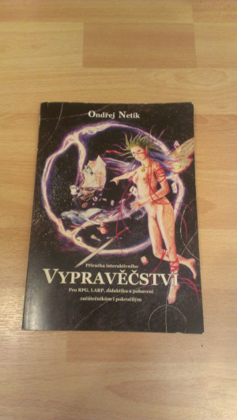
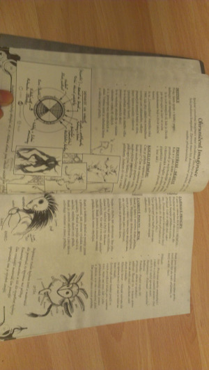
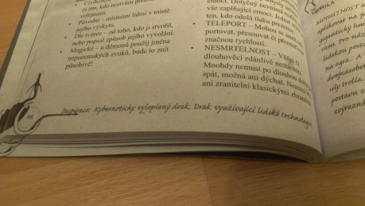
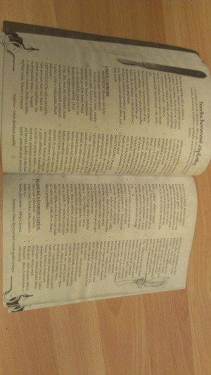
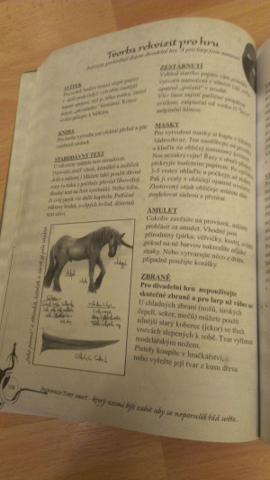

Ak vysedávate na internete viac než pri hraní, ste štamgastom aspoň troch fór a máte plnú policu obskúrnych hier, umenie rozprávačstva si viete vydestilovať a nájsť aj sami. Vtedy často ani neviete, že príručka k [Dračímu doupěti II ](http://rpgforum.cz/anotace/draci-doupe-ii)obsahuje famóznu stať o rozprávaní, že vyšiel preklad geniálneho počinu o spolutvorbe v hre a divadle [Play Unsafe](http://rpgforum.cz/novinky/hrajte-bez-zabran-slovensky-preklad-play-unsafe), a že existuje téma [Vypravěčské techniky](http://rpgforum.cz/forum/viewtopic.php?f=118&t=5457) na RPGFóre.

A možno ani neviete, že existuje recenzovaná kniha Vypravěčství, svojim plným menom _Příručka interaktivního vypravěčství pro RPG, LARP, didaktiku a pobavení začátečníkům i pokročilým_.

Ak si ju objednáte, napríklad rovno od vydavateľa Mytago, dostanete 160 strán v čiernobielom B5kovom prevedení. Decentne vyvedené sivasté pozadie v duchu starých manuskriptov, kombinácia solarizovaných fotiek a ručne kreslených diagramov (vyvolávajúcich príjemnú nostalgiu) je v čudesnom kontraste so sprofanovanou typografiou Times New Romanov a podčiarknutých nadpisov. Nepatrí sa hodnotiť vnútro podľa obalu, ale v tomto prípade je vizuál knihy zrkadlom jej obsahu.

Skúsený rozprávač intuitívne vie, že dobrý príbeh obvykle vyplynie zo zaujímavých postáv, nevyhnuteľných výziev a atmosferického sveta. Vypravěčství však pokrýva omnoho viac.

Kým typická príručka býva koncipovaná ako séria voľných textov venovaných na príslušné témy (príkladom je [Play Dirty](http://rpgforum.cz/anotace/play-dirty) s ukážkami v minulých Drakkaroch ([21](http://drakkar.rpgplanet.cz/vydani/srpen-2010-divocina-21), [23](http://drakkar.rpgplanet.cz/vydani/prosinec-2010-krev-na-snehu-23), [26](http://drakkar.rpgplanet.cz/vydani/cerven-2011-26)), alebo Play Unsafe recenzované v [Drakkare 18](http://drakkar.rpgplanet.cz/vydani/unor-2010-planovani-a-priprava-18)), vo Vypravěčství takýto prístup rozhodne nečakajte – kniha je predovšetkým encyklopédia či taxonómia rozprávačstva. Text štruktúrovaný v témach, nadpisoch, pojmoch, zoznamoch a odrážkach budí dojem erudovanosti a vyčerpávajúceho prístupu. Už nahliadnutie do obsahu napovie o statiach k samotnému médiu (RPG i larpom), hernému svetu, imaginácii, charakterom, obsadeniu, scenáru, nápomoci Rozprávačom, odohrávaniu postáv atakďalej a tak ďalej. Neprezradím žiadne tajomstvo, keď poviem, že Príručka vypravěčství sa omnoho viac než radám a skúsenostiam venuje hlavne definícii, klasifikácii, enumerácii.

A naozaj: uvidíte mnohé geniálne zoznamy – napríklad v pätičke každej strany nájdete jednu inšpiráciu (element známy z horrorového [Dreadu](http://rpgforum.cz/anotace/dread)): „Divoženky sbírající lidské oči,“ alebo „Zájezdní hostinec, kde se schází podsvětí.“ Pri ich čítaní v mysli mimovoľne vyskakujú ďalšie prvky a v okamihu získavate semienko budúceho príbehu. Rovnako kapitola _Kde brať nápady_ je skutočná studnica nápadov krížom cez hry, a dokonca čerpá z novej generácie príbehových hier, čo platí pre _Ciele [príbehu]_, resp. _Motivácie postáv_, čo je paleta farieb a odtieňov použiteľných do hry. Niekedy mi bolo až ľúto, že sa elementy spomínajú len telegraficky: čo je daň za rozsah, ktorý chce kniha pokryť.

V jej forme sa bijú dve strany von Linnéovského štýlu: na jednej strane vidieť obrovskú snahu precízne a exaktne katalogizovať „veškeré znalosti“, na druhej strane to ide na vrub príťažlivosti textu. Príkladom za všetky je hneď úvodná klasifikácia príbehových hier, ktoré je svojrázna (RPG v jednom vreci s drevárňami?), neúplná (kde sa stratila jeepforma?) a diskutabilná (naozaj obohatí samotného Rozprávača?).

Na druhej strane: ó, aký skvelý by mohol byť onen (fiktívny) univerzitný kurz, ku ktorému by Vypravěčství tvorilo excelentnú sadu poznámok! Poskytuje hojný základ na to, aby si čitateľ v rámci „domácich úloh“ sám vyabstrahoval užitočné prvky pre rozprávanie. Výslovne to charakterizuje tvorba netvorov: po prečítaní bodov kapitoly (akéhosi maskovaného dotazníka) sa vám na papieri vytvorí plnokrvná príšera s významnými _netvorskými_ črtami: ostane však na vás, ako ju dramaticky zapojíte do príbehu. To platí pre mnohé aspekty rozprávania: plány sídiel, ale aj napríklad tvorbu zápletiek pre rozličné druhy. Kniha je skutočne veľmi silná v momentoch, keď opúšťa savanu definícií a vracia sa do džungle napomáhajúcich rád (_Osobní línie příbehu_ kde dostanete desať zdanlivo generických, ale v skutočnosti využiteľných rád pre previazanie postavy s príbehom).

Pozitívne je, že Vypravěčství otvorene priznáva existenciu iných hier a príručiek, pretože nie je nič horšie, než popisovať situácie či prístupy staré 15 rokov, a Vypravěčství sa tomu veľmi úspešne vyhýba. K dokonalosti by viedla destilácia odporúčaní z kánonických hier iných žánrov: kapitola o horrorovej zápletke s praktickými radami z Dreadu či niektorého [World of Darkness](http://rpgforum.cz/anotace/world-darkness-novy), alebo detektívka zmixovaná s líniou _Gumshoe_, de facto štandardom detektívneho žánru. Koniec-koncov, tento prístup funguje napríklad v kapitole _Vlastní vyprávění_, kde improvizačné rady čerpá z neprekonateľného Play Unsafe.

_Příručka interaktivního vypravěčství pro RPG, LARP, didaktiku a pobavení začátečníkům i pokročilým_ je odvážnym vykročením do oblasti _self-help_ príručiek Rozprávačov, ktorých nie je nikdy dosť. Istým spôsobom ju možno prirovnať k rudnej bani stvorenej mocným kúzlom čarodeja: cesta ňou nie je jednoduchá, miestami sa musíte pretiahnuť úzkymi otvormi, neraz pohyb ňou namáhavý a monotónny, ale nemožno poprieť, že schováva mnoho krásnych stalaktitov, stalagnitov, stalagnátov a drahokamov, ktoré si môžete odniesť do svojho sveta.
