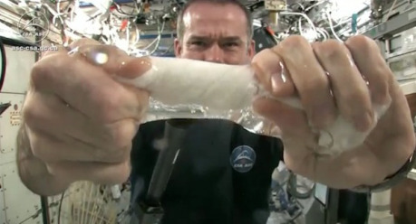

Proto si dnes uděláme malou exkurzi do sféry kosmonautiky a odpovíme si na některé otázky života, vesmíru a vůbec, které jsou snad tak staré jako lidstvo samo. Třeba jak si ve stavu beztíže dojít na záchod.

## Stav beztíže

Beztížný stav je stav, kdy předměty nemají žádnou tíhu. Čajová lžička nebo raketoplán, obojí má stejnou, tedy nulovou tíhu. Proto se tomu říká stav beztíže. Výlet do vesmíru je tak vlastně nejúčinnější dieta na světě. Ať vážíte kolik chcete, během méně než deseti minut nebudete vážit ani gram! Za tu dobu vás raketa vynese na oběžnou dráhu, kde panuje stav beztíže. Tedy, nebudete nic vážit, ale vaše hmotnost zůstane stejná.

Pokud si ještě vzpomenete na hodiny fyziky ze školy a máte to štěstí, že vám to nepodali příliš zmateně, pak víte, že tíha a hmotnost není totéž. Tíha je síla, která působí na předmět v gravitačním poli a závisí na hmotnosti. Hmotnost je množství hmoty daného předmětu. Čím větší hmotnost předmět má, tím více energie je potřeba, abychom s ním mohli pohnout, a také má tím větší tíhu, když se dostane do gravitačního pole.

To mimo jiné znamená, že ve stavu beztíže sice máte vy, raketoplán i čajová lžička nulovou tíhu, ale zatímco s čajovou lžičkou můžete dělat co chcete, s raketoplánem pohnete jen stěží. Hmotnost se nám totiž nemění. I když raketoplán nic neváží, nemůžete ho vzít a zahodit, protože jeho hmotnost mnohonásobně převyšuje tu vaši. Ve skutečnosti byste se při takovém pokusu akorát od raketoplánu odrazili a odletěli byste vy.

Přesněji řečeno, do pohybu by se dal i raketoplán, opačným směrem než vy, jen daleko méně. Se skafandrem budete mít hmotnost nějakých 200 až 250 kilogramů (pokud jste ve vesmíru a chcete házet raketoplánem, obléct si skafandr je to nejrozumnější, co můžete udělat). Donedávna používané raketoplány měly hmotnost 78 000 kilogramů (ale třeba takový Dream Chaser, který by mohl jednoho dne převzít roli raketoplánů, už by měl vážit okolo 12 000 kilogramů).

Když tedy ten raketoplán čapnete za čumák a mrštíte jím vší silou, odmrštíte sami sebe rychlostí několika málo metrů za sekundu (v závislosti na své fyzičce). Řekněme něco přes 2 metry za sekundu. 78 000 kilogramů vážící raketoplán má ale více než třistakrát větší hmotnost, takže vliv vašeho hodu bude o to menší. Začne se pohybovat opačným směrem než vy, a to rychlostí asi 7 milimetrů za sekundu.

Jestli jste měli dost rozumu a před pokusem se k raketoplánu přivázali, vaše vzdalování skončí v momentě, kdy se lano napne. Vy přestanete mizet rychlostí 2 metry za sekundu a raketoplán se přestane sunout 7 milimetrů za sekundu opačným směrem. A až přeručkujete zpátky, bude raketoplán dokonce na stejném místě, jako by byl, pokud by vás nenapadlo jím házet. Stejně jako se vy přitahujete k raketoplánu, přitahujete i raketoplán k sobě.

Kdyby vás ovšem s raketoplánem nic nepojilo, budete se vzdalovat stále stejnou rychlostí, až si zmizíte z dohledu. Dobrá zpráva je, že až obletíte Zemi, znovu svůj raketoplán spatříte. Má to ale dva drobné háčky...

## Oběžná dráha

V první řadě vám bude trvat docela dlouho, než svůj raketoplán znovu uvidíte. Dva metry za sekundu není žádný fofr a délka oběžné dráhy se počítá na desetitisíce kilometrů. Kdybyste tuhle legrácku udělali zhruba na oběžné dráze Mezinárodní vesmírné stanice, měli byste na přemýšlení o tom, jak moc pitomý nápad to byl, nějakých 495 dní.

V případě, že se vám podaří za tu dobu neumřít hladem, žízní, nedostatkem kyslíku nebo nudou, a budete stále doufat, že konečně nasednete do raketoplánu, zařeknete se, že už ven nikdy nevylezete a zamíříte domů, čeká vás zklamání. Raketoplán bude (vůči Zemi) buď pěkný kus pod vámi nebo nad vámi. V závislosti na tom, jestli jste s ním házeli po směru nebo proti směru své oběžné dráhy. Jak je to možné?

Ačkoliv je na oběžné dráze stav beztíže, není to způsobeno tím, že bychom byli mimo dosah gravitačního působení Země. Gravitační síla se vzdáleností slábne. Je to trochu znát i na Zemi – jestli na pláži u Sředozemního moře vážíte metrák, na vrcholu Everestu budete vážit o 280 gramů méně (alespoň v případě, že při výstupu nezhubnete ani gram). Jenže i tisíce kilometrů nad povrchem tu gravitace pořád je a táhne vás směrem k zemi.

Družice, Mezinárodní vesmírná stanice nebo třeba Měsíc ale nespadnou na zem, protože gravitační síla je vyrovnána odstředivou silou. To je důvod, proč se tam nahoře všechno točí a proč vlastně něco jako oběžná dráha vůbec je.

Mezinárodní vesmírná stanice (ISS), poletující si ve výšce mezi 410 a 420 kilometry, musí letět rychlostí 27 600 kilometrů v hodině. Pokud tedy jste na ISS, nepotřebujete na cestu kolem světa 90 dní, ale stihnete to za 92 minut... i když trochu z dálky.

Ve výšce 35 786 kilometrů se nachází geostacionární oběžná dráha. Najdete zde většinu meteorologických, komunikačních i jiných satelitů – jednoduše proto, že jeden oběh na této dráze trvá 24 hodin a družice se tak nachází více méně stále nad stejným místem zemského povrchu. V této vzdálenosti je také gravitační síla o poznání slabší, a proto zde družice obíhají rychlostí okolo 11 000 kilometrů v hodině.

Vraťme se k našemu vrhu raketoplánem. Pokud bychom se od raketoplánu odmrštili po směru oběhu, naše rychlost se zvýší o 2 metry za sekundu (asi 7,2 km/h) a raketoplán zpomalí o 7 milimetrů za sekundu (asi 25 centimetrů za hodinu). To znamená, že odstředivá síla působící na raketoplán bude nepatrně menší a začne pomalu klesat (a nakonec spadne), zatímco odstředivá síla působící na nás by se zvětšila a my bychom se pomalu, ale jistě začali vzdalovat a časem opustili sluneční soustavu – tak za pár milionů let, pokud mezitím nenarazíme do Jupiteru nebo podobné překážky.

Jak vidíte, není to žádná legrace.

## Kosmonauti nepláčou

S těmito vyhlídkami je dost těžké zachovat si dobrou náladu a nikdo nebude považovat za zbabělost, když si zakvílíte jako šakal. Hlavně ale neplačte! Když jste ve stavu beztíže a ještě k tomu ve skafandru, pláč vás může ohrozit na životě.

Jakákoliv tekutina, slzy nevyjímaje, se chová ve stavu beztíže trochu jinak, než jsme zvyklí. V první řadě neteče shora dolů (nic takového jako nahoře nebo dole v beztížném stavu není) a nerozlévá se. Vlastně naopak. Povrchové napětí kapaliny způsobuje, že pokud chrstenete na zem kýbl vody, tak se sice po podlaze rozlije, ale pak se zase slije a utvoří různě velké kapky, nebo lépe řečeno koule.

Když začnete plakat, tak se vám taková koule vytvoří na očích. První, co člověka napadne, je oči si utřít, ale to dost dobře nejde – máte na hlavě přilbu. Krom toho, že vlastně nic neuvidíte, se může stát, že pokud budete dál brečet jako želva, můžete tuto „kapku“ prostě vdechnout a utopit se.

Kanadský kosmonaut Chris Hadfield o tom ví své. Ne že by ho při montování robotické ruky na ISS zachvátila nepřekonatelná lítost nebo tak něco. Po pěti hodinách práce ho zkrátka začalo pálit levé oko. Oko pálilo a slzelo a nakonec slzy zaplavily i Hadfieldovo druhé oko.

Protože nic neviděl, nezbývalo než požádat o radu pozemní personál. Ten došel k závěru, že podráždění oka způsobil únik hydroxidu lithného, který se používá k pohlcování oxidu uhličitého. Je to tedy látka, která je potřebná, aby se člověk neudusil, ale není zrovna zdravé se v tom přímo koupat. Bylo třeba vyvětrat, tedy otevřít ventil a nechat vzduch ze skafandru uniknout ven.

Když poslepu otevřel ventil, slyšel Hadfield, jak vzduch kvapně opouští jeho skafandr. Pomohlo to. Unikající vzduch s sebou vzal uniklý hydroxid lithný i nahromaděné slzy a po opětovném natlakování skafandru Hadfield nejen že zas viděl, ale mohl i dokončit instalaci robotické ruky.

## Procházka jen tak nalehko

Už se vám jistě někdy stalo, že jste vyrazili z domu a po pár metrech zjistili, že jdete v pantoflích, nemáte klíče nebo vám chybí nějaká část oděvu. Co by se ale stalo, kdybyste z raketoplánu vystoupili bez skafandru? Možná si říkáte: „To si dělá srandu! Vždyť je tam vzduchoprázdno! Když hodíte člověka do vzduchoprázdna, exploduje. Navíc je ve vesmíru šílený mráz, takže ještě než exploduje, tak mu umrzne hlava!“

Vězte, není tomu tak. Je sice prada, že člověk je stavěný na to žít v tlaku kolem 100 kPa, ale to ještě neznamená, že exploduje, když takový tlak mít nebude. Když budete v bazénu nebo v moři a potopíte se 10 metrů hluboko, bude na vás působit dvojnásobný tlak. Lidé se ale docela běžné potápějí i do 30 metrů, a pokud se rychle vynoří (rozdíl tlaku je 3x větší, než kdyby skočili do vzduchoprázdna), neexplodují.

Například ve skafandrech je tlak výrazně nižší než na povrchu Země – místo 100 kPa může být ve skafandru až 32,4 kPa, což je o něco méně, než je na vrcholu Mount Everestu. Důvod je prostý – čím menší tlak je uvnitř, tím méně je materiál skafandru namáhaný a tím je menší riziko v případě, že by měl skafandr nějakou trhlinu (vzduch bude zkrátka unikat pomaleji a je menší riziko, že se kvůli tomu bude skafandr dál trhat). Skafandr je také ohebnější. Při natlakování na pozemskou úroveň by kosmonauti připomínali panáčka Michelina.

Horolezci na vrcholu Everestu ale kvůli řídkému vzduchu sotva chodí, jak to, že kosmonauti zvládnou opravovat družice a vůbec dělat všechny ty komplikované věci? Na rozdíl od horolezců, kteří si jen sem tam dýchnou kyslíku, kosmonauti mají skafandr naplněný čistým kyslíkem. Mohou tak bez problémů fungovat i v takto nízkém tlaku.

Aby nebyl rozdíl tlaku uvnitř a vně kabiny tak velký, měly být čistým kyslíkem plněny i kabiny kosmických lodí. Zásadní nevýhodou čistého kyslíku však je fakt, že se v něm všechno stává velmi hořlavým, a jakmile jednou vypukne požár, prakticky se nedá uhasit. Závada na elektrickém zařízení spolu s atmosférou čistého kyslíku byly příčinou tragického požáru na palubě Apolla 1, během kterého zahynuli všichni členové posádky. Ve skafandru je však riziko požáru výrazně menší a výhody nižšího tlaku tu jasně převládají.

Co se ale stane, když člověk jen tak bez skafandru vyleze do vzduchoprázdna? To závisí na tom, jak rychle vyleze, tedy přesněji jak rychlá bude dekomprese.

Pokud je změna tlaku velmi rychlá (ze 100 kPa na 0 za nejvýše několik desetin sekundy), je to zlé. Člověk se sice nerozprskne, ale unikající vzduch protrhne ušní bubínky, rychlá změna tlaku může potrhat plíce a může dojít k drobnostem, jako popraskání žilek v nose, očích nebo kůži (což vás ale bude trápit asi nejméně). Taková situace by mohla ale nastat nejspíš jen v případě, že máte skafandr natlakovaný na pozemský tlak a ten se najednou v půli roztrhne.

Kdybyste si například sundali přilbu nebo se vás nějaký Hal 9000 rozhodl vycucnout do vesmíru, bude pokles tlaku pomalejší – mezi půl až jednou sekundou. Pokud jste se v ten moment zrovna zhluboka nenadechli, je riziko poškození plic poměrně malé, a když se nebudete snažit zadržovat dech, možná to přečkají i vaše bubínky.

Při pomalejším poklesu tlaku, který může nastat například, když máte díru ve skafandru, trupu lodi nebo během doby, než se vyčerpá vzduch z přechodové komory, vám v zásadě žádné riziko nehrozí, pokud se nebudete snažit zadržovat dech nebo si nedej bože zacpat nos (v takovém případě opět hrozí poškození plic nebo protržení ušních bubínků). Jediným problémem zůstává, že po vyčerpání vzduchu nebudete mít co dýchat.

U atmosférického tlaku je zajímavé, že určuje i takové věci, jako je bod varu. Ve škole nám říkali, že bod varu vody je při 100 stupních Celsia. To je pravda, ale při tlaku na hladině moře. S klesajícím tlakem klesá i bod varu. Pomocí teploměru a kotlíku s vodou tak cestovatelé v minulosti určovali přibližnou nadmořskou výšku. Pokud tlak klesne na takzvaný Armstrongův limit (nejmenuje se podle kosmonauta Neila Armstronga, ale podle Harryho George Armstronga, který založil Ústav vesmírné medicíny amerického letectva v roce 1947), tedy na 6,3 kPa, klesne bod varu na 37 stupňů Celsia. Při tomto tlaku plíce nemohou žádným způsobem dodávat kyslík do krve a předtím, než ztratíte vědomí, cítíte, jak se vám na jazyku vaří sliny.

Když už jste jednou ve vzduchoprázdnu a podařilo se vám bez zranění přežít dekompresi, jediné, co vám schází, je kyslík. Ten vám navíc schází výrazně víc, než pokud byste byli řekněme pod vodou, protože si nemůžete držet zásobu vzduchu v plicích. Během zhruba 10 sekund tedy ztratíte vědomí, a pokud vás během zhruba minuty nikdo neokysličí, je po vás.

Je také pravda, že ve vesmíru je příšerná zima. Ve vzduchopráznu totiž není dohromady nic, co by mělo mít nějakou teplotu. Veškeré teplo je tedy dané kosmickým zářením, a pokud na vás zrovna nepraží sluníčko, tak kosmické záření zvládne udělat teplotu asi 3 stupně nad absolutní nulou, tedy −270 stupňů Celsia.

Když ponoříte ruce do studené vody, budete během minuty jako rampouch, i když má daleko vyšší teplotu než −270 stupňů. Jenže ve vesmíru je vzduchoprázdno, takže na rozdíl od kýble studené vody tu není nic, co by vás mohlo ochladit. Veškeré teplo, které ztrácíte, se ztrácí zářením a to nejde zrovna rychle.

V podstatě je daleko větší problém se ve vesmíru uchladit než nezmrznout. Proto jsou také skafandry, vesmírné lodě, družice nebo stanice bílé, případně pokryté lesklou vrstvou. Není to proto, že kdyby byly černé, nebudou dobře vidět a daňoví poplatníci by měli pocit, že vyhodili peníze oknem, ale proto, že lépe odrážejí sluneční světlo, a tím pádem se méně ohřívají.

Mezinárodní vesmírná stanice má pod solárními panely, které jí dodávají energii, ukryty tepelné radiátory, které odvádějí teplo ze stanice a vyzařují ho do prostoru. Mají pěkných pár desítek čtverečních metrů, aby stačily vyzářit nejen teplo, které stanici dodá slunce (během těch asi 50 minut, kdy stanici během oběhu osvětluje), ale i teplo produkované přístroji a kosmonauty na palubě.

## Ticho tam nahoře!

Se vzduchoprázdnem se pojí ještě jedna zásadní věc – ve vesmíru nikdo neuslyší váš křik. Nejenže tam celkem nikdo není a vesmír je hrozně velký, ale hlavně zvuk se ve vzduchoprázdnu nešíří. Nemůže. Nemá totiž v čem.

Zvuk jsou vibrace, které se přenášejí hmotou, a v zásadě se dá říct, že čím je hmota hustější, tím lépe zvuk vede. Ve vodě se zvuk šíří daleko lépe než ve vzduchu a to nic není proti tomu, jak se nese třeba železem. Ve vzduchoprázdnu ale poletuje jen pár zapomenutých atomů a částic vzdálených od sebe natolik, že prostě žádný zvuk vést nemohou.

Paradoxní na tom celém je, že když už jste tam nahoře, tak na nějaké ticho můžete zapomenout. Ať už jste ve skafandru nebo na palubě nějaké kosmické rachotiny, vždycky je tu nějaký přístroj, který dělá hluk. A protože uvnitř vzduchoprázdno není, tak to slyšíte. Stejně tak můžete zaklepat na okénko a uvnitř to bude slyšet, a když se střetnete s nějakým zapomenutým šroubem, bude to pěkná rána.

Stačí ale jen malý kousek vzduchoprázdna k tomu, aby nic z toho slyšet nebylo.

## Život v bandasce

Že člověk dokáže žít mimo naši planetu i docela dlouhou dobu, už je známá věc. Valerij Poljakov strávil na palubě Miru dohromady přes 22 měsíců, přičemž na jeden zátah vydržel ve vesmíru celých 437 dní a 18 hodin.

Jakkoliv si můžeme kosmonauty idealizovat, jsou to stále jenom lidé a musejí jíst, pít, spát a chodit na záchod. Nic z toho ale není na palubě vesmírné lodi nebo stanice tak jednoduché, jak by se mohlo na první pohled zdát.

Jídlo není takový problém, pokud se zrovna raketa se zásobami o pár měsíců neopozdí. V dnešní době už se kosmonauti nekrmí jídlem v tubách, podivným želé ani jinými amarouny. Na guláš se šesti ovšem můžete zapomenout – jídlo musí být natolik kompaktní, aby se nerozletělo po celé kabině a dalo se rozumně sníst. Sendviče, ovoce, zelenina, sýr, a dokonce i špagety mají své místo na jídelníčku kosmonautů.

Se svačinou v beztížném stavu může ale nastat jeden problém a tím problémem je vesmírná nemoc. Nebojte, nejde o to, že byste snědli něco špatného, zezelenali a narostla vám tykadla. Jde v zásadě o obdobu mořské nemoci, jen horší. Příčinou mořské nemoci je houpání lodi. Kapalina ve vašem vnitřním uchu, díky které víte, kde je nahoře a kde dole, se neustále přelévá sem a tam a mnohým se z toho udělá zle.

V beztížném stavu se chová kapalina ve vašem vnitřním uchu stejně jako jakákoliv jiná kapalina. Jinými slovy nepřelévá se, ale shlukuje se, a jak se pohybujete, plácá se z jedné stěny na druhou, a než si na to člověk zvykne, má z toho v hlavě pořádný zmatek. Člověk vlastně zažívá podobné pocity jako při volném pádu, jen 24 hodin denně.

Zatímco na houpající se lodi mohou lidé s mořskou nemocí vesele zvracet přes palubu, ve vesmíru je to něco jiného. Jelikož už jsme si popsali, jak se v beztížném stavu chovají kapaliny, a vzhledem k tomu, že se prostě nedá otevřít okýnko, když to na člověka přijde, jistě si dokážete představit, co by to bylo za svinčík.

Nezbytnou součástí každého letu jsou tedy i pytlíky na zvracení, vybavené ubrouskem a zipem, aby se daly bezpečně uzavřít. Když už totiž jednou takový „náklad“ na palubě máte, musíte s ním vydržet – nemůžete prostě otevřít okýnko a zahodit to. I kdyby to šlo vyhodit třeba skrz přechodovou komoru, akorát byste tím vytvořili nový kus kosmického smetí a jednoho dne by takový kus mraženého fujtajblu mohl sestřelit nějakou družici.

Pokud si chcete udělat konkrétnější představu, jak se tento problém řeší, podívejte se na video v následujícím článku, kde vám to Chris Hadfield důkladně vysvětlí:

- [http://www.space.com/20825-how-to-barf-puke-vomit-in-space-video.html](http://www.space.com/20825-how-to-barf-puke-vomit-in-space-video.html)

Pití v beztížném stavu není nic tak náročného, pokud se k tomu správně postavíte. Vytáhnout skleněnou láhev a nalít si třeba sklenici vína jednoduše nejde – kapalina se bude držet v láhvi a bylo by to jako dobývat z láhve kečup pouze s tím rozdílem, že když otočíte láhev dnem vzhůru, její obsah nikam nepoteče. Když si ale vezmete brčko, můžete láhev bez problému vypít. Pokud je láhev měkká, můžete její obsah vymáčknout a chytit za letu. Nebo vám jako napajedlo stačí hadice s kohoutkem, ze které si jednoduše pustíte vody, co hrdlo ráčí. Jen si musíte dát pozor, abyste všechnu vodu pochytali a neskončila v některém z drahých, ale dost možná i životně důležitých přístrojů, co jsou kolem vás.

Jak to vypadá ve skutečnosti, vám předvede Greg Olsen v následujícím videu:

- [http://www.youtube.com/watch?v=Fg1RMEIP6i4](http://www.youtube.com/watch?v=Fg1RMEIP6i4)

Když kosmonauti jedí a pijí, je jasné, že dříve či později budou muset na záchod. Fakt, že si ve stavu beztíže všechno tak nějak poletuje, dává tušit, že to nebude úplně legrace. Vesmírná toaleta je ve své podstatě jedna hadice a jedna roura čouhající ze zdi. Hadice slouží k odvodu moči, pro vykonání závažnější potřeby se pak usadíte na ústí zmíněné roury. Celé je to ve své podstatě vysavač, takže exkrementy putují směrem dovnitř a nehrozí, že by se vám nějaká hrůza vrátila zpět.

Nejhorší máme za sebou, teď je třeba si umýt ruce. Ve srovnání s předchozím výkonem to bude hračka – stačí si na ruku vymáčknout větší kapku mýdlové vody, umýt ruce v zásadě tak, jak jsme zvyklí, a utřít do ručníku. Jak vidíte, ručník je skutečně nezbytný, pokud chcete cestovat vesmírem.

Chcete-li vidět, jak se to dělá v praxi, Chris Hadfield vám to předvede v tomto videu:

- [http://www.youtube.com/watch?v=JUUvlnnVMSQ](http://www.youtube.com/watch?v=JUUvlnnVMSQ)

Večeři máme za sebou, vyčůrali jsme se, umyli ruce a můžeme jít spát. Spánek ve stavu beztíže má jednu zásadní výhodu v tom, že vám stačí spacák a můžete se uvelebit kdekoliv. Třeba i na stropě a hlavou dolů – nahoře a dole v beztížném stavu nemá prakticky žádný význam. Bohužel, to je dohromady asi jediná výhoda.

Většina kosmonautů trpí nespavostí a jsou nuceni pravidelně užívat prášky na spaní. Důvodů je celá řada a jen těžko říct, který je ten hlavní. V první řadě, na palubě vesmírné lodi nebo stanice neprobíhá běžný denní cyklus dne a noci. Svítí se neustále a stejnou intenzitou. Mozek tedy nedostává informaci o tom, že se stmívá a půjde se spát. Dalším problémem je hluk, protože přístroje nejsou zcela tiché a musejí pracovat 24 hodin denně. Nakonec je tu fakt, že v beztížném stavu zažívá člověk neustále pocit volného pádu, což může klidný spánek výrazně rušit.

Jak to chodí na ISS, pokud jde o spánek, jídlo a hygienu, demonstruje Sunita Williamsová v následujícím téměř devítiminutovém videu:

- [http://www.youtube.com/watch?v=fa3nuXxM8yk](http://www.youtube.com/watch?v=fa3nuXxM8yk)

## Laskavé objetí geomagnetického pole

Naše planeta nám poskytuje vše, co potřebujeme k životu, často i tak, že o tom vlastně ani netušíme. Magnetické pole Země nedělá jen to, že otáčí střelky kompasu k severu. Slunce krom toho, že svítí, vystřeluje do vesmíru ohromné množství nabitých částit. To dělají nakonec všechny hvězdy a tvoří tak podstatnou složku kosmického záření. Mimo to si slunce sem tam uplivne pár milionů tun žhavého plazmatu, které pak putuje vesmírem. Jelikož jsou částice stejně jako plazma nabité, jsou strhávány magnetickým polem, a místo aby nás přímo bombardovaly, jsou zpomaleny, vychýleny z dráhy tak, že Zemi jen „obtečou“, nebo taženy směrem k pólu, kde při průletu atmosférou vytvářejí polární záře.

Díky tomu také neumíráme na nemoc z ozáření a neumírají na ni ani kosmonauté na oběžné dráze. Jenže magnetické pole Země není všudypřítomné – dosahuje jen do vzdálenosti několika desítek tisíc kilometrů. To je ovšem jen zlomek vzdálenosti, kterou je třeba urazit, když se chcete vydat k jiné planetě nebo třeba jen k našemu Měsíci.

Mise Apollo 11 trvala 8 dní, během kterých se trojice kosmonautů stačila dopravit na Měsíc, Neil Armstrong pronesl svoji slavnou větu a nakonec se vrátili zpět na Zemi. Značnou část této doby strávili mimo ochranu magnetického pole Země a dostali dávku kosmického záření odpovídající několika rentgenům hrudníku. Taková dávka radiace není nijak znatelně nebezpečná, pokud bychom ale letěli třeba k Marsu, byla by dávka záření (i doba letu) řádově vyšší a mohla by znamenat zdravotní riziko.

Kosmické záření ale dělá i jiné věci, než že ohrožuje vaše zdraví. Jsme zvyklí, že pokud zavřeme oči (a nemáme zrovna za oknem lampu veřejného osvětlení), pak nevidíme nic. Vlivem kosmického záření ale můžete vidět podivuhodné věci.

Když kosmonauti během letů Apollo mimo magnetické pole Země zhasli světla nebo zavřeli oči, viděli zhruba každé tři minuty slabé záblesky světla. Jednalo se buď o světelné body, šmouhy nebo skvrny. Možná vás napadne, že to může být pěkné, ale zkuste při tom spát.

Tento fenomén se zatím nepodařilo dokonale vysvětlit, ale jeho příčinou je podle všeho kosmické záření. Konkrétně nabité částice procházející oční bulvou, které se střetly s nějakou molekulou a uvolnily tak část svojí energie formou světla.

Alternativním vysvětlením tohoto jevu jsou manévry Aštarovy vesmírné flotily.

## Žádnou paniku!

Ačkoliv krátký výlet mimo naši planetu bude jistě exotičtější výpravou, než je cesta kolem světa, stále platí stejné přírodní zákony jako na Zemi. Jsou tu jen rozdílné podmínky. Natolik rozdílné, že se tím otevírá docela nový svět, s novými možnostmi i překážkami.

Filmová a televizní produkce nám ovšem vytrvale vštěpuje, že každá vesmírná loď musí mít umělou gravitaci, při změně směru provádí manévry jako letadlo a prolétávající barevné proužky, kterým se říká laser, phaser, blaster, nebo jíný „-er“, dělají pekelný randál. Není se čemu divit – nechat herce poletovat nad scénou by bylo dost náročnější, než aby prostě chodili v „umělé gravitaci“, „letecké“ manévry vypadají efektně a hřmot lodních motorů a paprskometů je pro diváka také asi atraktivnější než ticho, přerušované jen hlukem toho, co do lodi skutečně narazí.

Když ale zrovna netočíte film nebo seriál, nic z toho, co vesmír skutečně nabízí, není problém. Proč to tedy zahazovat?
