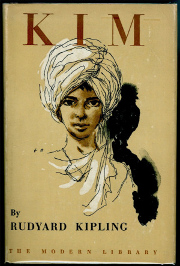
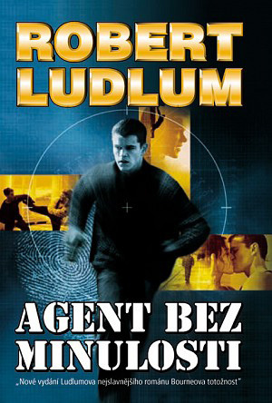

Oba dva žánry, tedy jak detektivka, tak špionážní román, vznikají téměř v téže době a prostředí. Konkrétně v anglicky mluvícím světě devatenáctého století. Na jeho počátku se z loupežnického románu vyvíjí detektivka, aby plných tvarů nabyla již v roce 1841 v díle Edgara Alana Poe, neboť za první dílo tohoto typu jsou považovány Vraždy v ulici Morgue právě z tohoto roku. Na konci téhož století pak vzniká dílo Rudyarda Kiplinga jménem Kim (vydáno v roce 1901), které bývá považováno za jednoho z předchůdců špionážních románů.

Devatenácté století by-lo stoletím páry, což, jak se na rozdíl od slavného českého filmu _Marečku, podejte mi pero!_ domnívám, má svůj význam i pro literaturu, neboť zkrocení páry a další pokroky (nejen) ve vědě a technice daly lidem věc dosud takřka nevídanou – volný čas. Nastal tedy rozvoj volnočasových aktivit, mezi jinými třeba i sportu v dnešní podobě a samozřejmě také četby. Jak se rozšiřoval okruh čtenářů, doznal vývoje i průměrný představitel obce knihomilné, který se po práci chtěl u četby odreagovat. Dochází proto k rozvoji dobrodružné literatury (především pro muže) a knihoven různých barevných variací (obvykle pro ženy). Tento rozvoj pak umožňuje diferenciaci žánru dobrodružného románu do řady subkategorií, jakými jsou právě detektivka či špionážní román.

Zatímco Poeův příběh je již detektivkou se vším všudy, věnující se zcela vyšetřování dvojité vraždy v jednom pařížském bytě, Kim je špionážním románem pouze zčásti, protože v sobě mísí více prvků a žánrů. Nelze dokonce ani říct, že by bylo možné použít špionážní román coby hlavní charakteristiku díla, neboť tím je samotná Indie, kde se příběh tohoto románu odehrává. Kipling byl svým pobytem v Indii zasažen tak jako mnoho dalších autorů, (ale nejenom jich: doživotní intenzivní vzpomínky na Indii si uchoval například i můj děda, který tam sloužil za druhé světové války. Ač byl ryze inženýrského založení, vyprávěl o ní s nebývalými emocemi) a promítl tyto zážitky do své tvorby.

Román Kim vypráví osudy dospívajícího chlapce, syna britského vojáka a domorodé matky, který cestuje po Indii v doprovodu tibetského lámy. Toho využije britská tajná služba a pověří jej řadou nejrůznějších úkolů. Aby měl šanci v nich uspět, je zároveň podrobován vzdělání a výcviku. S nadsázkou se tedy dá říci, že se špionážní román rodí spolu se špionem Kimem, celým jménem Kimballem O’Harou (to aby to nebyl zaměňován s jinými nedospělými Kimy z oblasti Dálného východu). I v tomto se však do románu promítá realita Indie na přelomu 19. a 20. století, neboť Kimovi protihráči jsou ruští agenti hrající svou Velikou hru o přístup Ruska k tzv. teplému moři. Tehdejší britská kolonie Indie zahrnovala mimo jiné i území dnešního Pákistánu, o nějž měla carská Moskva eminentní zájem, neboť Bospor a Dardanely byly kontrolovány Osmanskou říší, Dánské úžiny pak evropskými mocnostmi a cestu kolem Severního mysu zase rozmary počasí.

Nemá smysl, abych se podrobněji zabýval dějinami detektivky či detektivkou samotnou, neboť tomu se věnuje první díl Argonantovy zajímavé práce uveřejněné v 41. čísle Drakkaru mnohem erudovaněji, než bych toho byl schopen já. Právě v návaznosti na tento článek se pokusím definovat, jak špionážní román navazuje na své detektivní kořeny. Budu hovořit především o špionážních románech klasického období, tedy z doby studené války a později. Předchozí tvorba, například pánů Wallaceho či Hiltona, náleží do kyplingovksého přechodného období mezi dobrodružnými romány a špionážními romány. Při tom je třeba mít na zřeteli, že špionážní román je méně homogenním literárním útvarem než detektivka a dosud nedošel v oblibě – a rozšíření – tak daleko, aby nabyl jednoznačného vnitřního schématu.

Prvním z nesmrtelných a klíčových prvků detektivky je záhada, přesněji její odhalování. Přítomnost záhady je vlastní i špionážnímu románu, ten se ovšem na rozdíl od detektivky tolik nesoustředí na její odhalování, ale pozornost je třeba věnovat i ostatním oblastem díla. Téhož aspektu se pak týká i druhý bod, v němž se pro detektivku záhady dělí na dvě základní varianty: _Kdo to udělal_ a _Jak to udělal_. Pro špionážní román je pak možná nejdůležitější otázkou _Proč to udělal,_ ale ani původní otázky nemusí být bez významu. Smyslem zodpovězení všech těch otázek ve špionážním románu pak obvykle je ochránit či prosadit zájem své strany. Odhalit konkrétního vraha a případně se domoci jeho odsouzení nemusí stačit k vyřešení problému. Ve špionážním románu je obvykle třeba navíc identifikovat záměr protistrany a zmařit jej. Zločin, i tak strašlivý jako vražda, je obvykle jen počátkem řešeného problému, nikoliv problémem hlavním. Jako příklad může posloužit pokus vraždy dokonce spáchaný na hlavním hrdinovi (!) v klasickém díle tohoto žánru, Bournově totožnosti (u nás někdy vydáváno pod ne zcela šťastným názvem Agent bez minulosti) od Roberta Ludluma, kterým začíná jeden z nejspletitějších příběhů nejen v oblasti špionážních románů. Naopak Forsythův Den pro Šakala je vlastně celý o tom, jak jedné vraždě zabránit. Na druhou stranu povaha špionážních her umožňuje, aby hlavní zaporák vystupoval ve více po sobě jdoucích příbězích, neboť jen málokdy se jej podaří vyřadit. V klasických špionážních románech (vycházejících ze soupeření Západu s Moskvou v období studené války) pak lze některé záporáky (ale nejen je) ztotožnit se skutečnými historickými osobnostmi.

Určité rozdíly se vyskytují i ve třetím nesmrtelném a klíčovém prvku detektivky, a sice velkém detektivovi. Ve špionážních románech se sice vyskytují významné hlavní postavy, z nich je třeba na prvním místě připomenout Clancyho Jamese Patricka Ryana, který to z policajtova studujícího synka dotáhne přes zraněného důstojníka námořní pěchoty a řadu funkcí ve výzvědných službách až na prezidenta Spojených států amerických. Ale ani Jack Ryan nečelí nepřátelům „Země svobody“ sám, maximálně s věrným dr. Watsonem – po jeho boku stojí řada téměř stejně mimořádných osobností počínaje tajemným a děsivým Johnem Clarkem-Kellym, jeho parťákem Dingem Chavezem přes zkušené operativce, manžele Foleyovi, až po významem zcela určitě nikoliv poslední dr. Cathy Ryanovou, Jackovu milovanou ženu a oporu. Naproti tomu Frederic Forsyth, uznávaný mistr žánru, má sice postavy, které prostupují více jeho díly (z nich nelze nezmínit sira Nigela Irvine, šéfa britské tajné služby Secret Intelligence Service), avšak v jednotlivých knihách je spíš v pozadí a větší pozornosti se dostává jiným, jako Jasonu Monkovi v Ikoně či Mikeovi Martinovi z Afghánce a Boží pěsti. V tomto ohledu je tak dílo Mistra vypravěče, jak se Forsythovi rovněž přezdívá, uvěřitelnější zejména v porovnání s americkými protějšky.

Čtvrté pravidlo pak praví, že čtenář nahlíží do detektivových myšlenek skrze dialog, obvykle vedený s průvodcem či pomocníkem. Ve špionážních románech se tento prvek vyskytuje taktéž, ale v citelně menším rozsahu. To lze vysvětlit řadou různých důvodů, z nichž mne napadá třeba jedno ze zlatých pravidel špionáže – čím méně lidí něco ví, tím méně jich to prozradí. Z tohoto hlediska je pak ne zcela taktické poříditi si věrného průvodce. Z jiného soudku lze vybrat skutečnost, že špionážní román nemá hru pro čtenáře na tak prioritním místě jako detektivka. Navíc hra se čtenáři špionážních románů nerespektuje tak jako samotní špioni žádná pravidla, ani to, že by mělo být možné vydedukovat správnou odpověď ze zmíněných stop. Přesto máme určitou šanci poodhalit myšlenky hlavního hrdiny skrze dialogy s nadřízenými či spojenci. Ovšem je třeba mít stále na paměti, že pro úspěch ve věci samé je někdy třeba klamat, samozřejmě s těmi nejlepšími úmysly, všechny okolo.

V pátém bodě pak Argonantus skrze strukturu příběhu nalézá těsnou souvislost detektivky a short story, ale i dalších útvarů kraších románů, jako jsou novely a novelety. Tento literární útvar je někdy využíván i autory špionážních románů, ale (jak sám název napovídá) obvyklejší je o něco delší útvar. Ve špionážním románu totiž většinou nestačí zodpovědět některou z otázek pana detektiva – _Kdo to udělal? Jak je to možné?_ – ale následně je třeba ještě spravedlnost prosadit. Tedy, spravedlnost je pojem spíše detektivkářský, ve špionážním románu by bylo třeba použít její nejširší definici, ale ani ta by nemusela vždy stačit. Samotné naplnění zájmů vlasti či zmaření zájmů protistrany je mnohdy nejsložitější či nejdůležitější částí celého příběhu, neboť se sice nemusí dbát na legalitu důkazů, tedy jejich použitelnost u soudu, ale do hry vstupuje celá řada jiných aspektů limitujících počínání našeho hrdiny – od globálního poměru sil přes omezené lokální zdroje až třeba po potřebu utajení způsobů a možností získávání informací. Špionážní romány tak nabízejí dostatek prostoru pro vnitřní vývoj postavy a morální dilemata. Té první možnosti, po hříchu málo využívané, se odvážně chopil například John le Carré, spisovatel s mimořádným smyslem pro atmosféru a vystihnutí situace. Ovšem pro mne bude vždy zapsán agentem, který jda prozkoumat vyzrazený bezpečný dům mudruje o smyslu své existence a jiných nesmrtelnostech chrousta. Netřeba podotýkat, že v takovém případě by se záhy projevila jeho vlastní smrtelnost. U jména John le Carré pak nelze nedoporučit i jednu na výsost klasickou detektivku Vražda kvality.

Již zmíněný Jack Ryan s námi frčí přes mnoho tisíc stran textu, avšak od počátku do konce zůstává stejný, neoblomný ve svých zásadách správného amerického vlastence, důstojníka, investora, manžela a otce. Jakkoliv nepatřičný z hlediska „velké“ literatury se nám jeví, je třeba přiznat, že USA Reaganovy doby jej potřebovaly a trocha přímější zásadovosti a zdravého sebevědomí by se neztratila v západním světě ani dnes. Výrazně lépe si špionážní romány vedou ve druhé kategorii, tedy v morálních dilematech. Úvahám o morálce se nevyhneme nikde tam, kde jedná o zabíjení lidí, ale skuteční velikáni tohoto žánru dokázali nastínit problémy, které překračují hranice literatury. Za příklad může posloužit již zmíněná Ludlumova Bourneova totožnost, kde hlavní hrdina udiven svými ne zcela obvyklými schopnostmi přemítá, zda byl před ztrátou paměti padouch nebo hrdina, což nemůže nevést než dále k úvahám o tom, jak moc paměť formuje charakter, jestli se můžeme její ztrátou stát lepšími lidmi a zda je správné vykonat trest nad člověkem, který si nepamatuje své provinění. Z jiného soudku pak pochází představa Lincolnovy rady, stínového spolku mocných a bohatých, která u Forsytha zachrání situaci umožněním jednání tam, kde ostatní prostředky běžných vlád selhávají. Naopak obdobná instituce u Ludluma spíš přispěje ke zkomplikování situace, neb trpí všemi neduhy řádných vlád – přesto je to zásah právě takové vlády, který situaci vyřeší.

Klíčový prvek detektivky č. 6 se týká vyšetřování, které probíhá dvěma základními způsoby, logickou dedukcí nebo psychologickou technikou. V sedmém pak je odhaleno, že detektivka je vlastně hádanka zadávaná čtenáři v literárně poutavém podání. Ve špionážních románech stojí tato hra až za vlastním příběhem, což umožňuje autorům méně se držet pravidel a hrát se čtenáři hru poněkud drsněji. V poctivé detektivní hře autor omezí počet podezřelých, aby měl čtenář alespoň nějaký přehled a nemusel „hledat jehlu v kupce sena“. Na špionském poli je počet účastníků omezen přirozeně. Není proto hříchem, když hybatelem věcí je strana, která není autorem na počátku vůbec zmíněna. Za doby studené války dosáhla redukce zúčastněných entit téměř absolutních rozměrů, což vedlo k oblibě Izraele, respektive jeho tajné služby Mossad, který sice stál na straně Západu, ale vždy měl na prvním místě zájem na přežití vlastní země, a pokud se rozhodlo, že je pro to nezbytné získat například vybavení, které nedokázaly zajistit kruhy sympatizantů v politice, zajistili jej agenti svými metodami. S pádem Sovětského svazu jako esenciálního nepřítele skončilo nejen bipolární dělení, ale umocnily se i vnitřní rozbroje na straně velkých hráčů, a tak je i pro špionážní romány kandidátů na padouchy či hrdiny dostatek.

Na základě výše uvedeného srovnání si pak každý může sám udělat úsudek, zda je špionážní román svébytný žánr nebo jen detektivka přesazená do atraktivních kulis mezinárodní špionáže. Já osobně jej považuji za samostatnou žánrovou kategorii literatury už proto, že detektivky zvlášť nemusím, kdežto špionážní romány mne baví od okamžiku, kdy jsem poprvé otevřel Den pro Šakala. Nicméně se domnívám, že lze určit i další poněkud méně subjektivní důvody. Zatímco v detektivce jsou kulisy vládních budov a mocenských her maximálně snahou o oživení žánru, v němž již bylo napsáno téměř vše, tak pro špionážní román jsou tak příznačným prvkem, že přímo definují druhé já špionážního románu – technothriller. Technothriller sám má býti americkým vynálezem, za jeho otce je označován Tom Clancy a případně i Michael Crichton s Kmenem Andromeda, ale odlišit je od špionážního románu jinak než mírou pozornosti věnovanou institucím státní moci není prakticky možné. Naopak bych připustil, že Tom Clancy je otcem military thrilleru, tedy napínavého čtení o vojenské problematice literárně technicky blízkého špionážnímu románu. Zůstává však otázkou, zda lze takový útvar dostatečně odlišit od jiných, když vojenské prostředí je pro spisovatele vcelku vděčným zdrojem od nepaměti. Přesto Rudá bouře (v originále Red storm rising), zachycující horký, tedy naštěstí alternativní, konec studené války, představuje dostatečně zásadní počin, aby si vymezení vlastního prostoru na literárním poli zasloužila. Totéž však platí o druhém Clancyho počinu v této oblasti, sérii knížek představujících jednotlivé významné prvky ozbrojených sil Spojených států – od Výsadkářů přes Bojovou peruť až po skupinu Letadlové lodi se zvláštním přihlédnutím k atomovým ponorkám. Ostatně za vznik této série vděčíme právě vydavateli knihy Hon na Rudý říjen, který přiměl Clancyho vypustit tolik ponorkářských technikálií, že to vystačilo jako základ pro knihu Ponorka.

Čtenáři, zejména tomu, co přistoupil na hru a spolu s detektivem pátrá po vrahovi, přijdou vhod znalosti z oblasti přírodních věd a medicíny. Pro plný dojem ze špionážních románů je vhodné disponovat poznatky z oblasti dějin moderní doby a mezinárodních vztahů. Pátrat po posledním členu Cambridgeské pětky, aniž bychom věděli, kdo je to Kim Philby, je poněkud bezútěšné. Stejně jako těžko pochopíme varování nedopadnout jako Penkovskij, když nevíme, že tento elitní špion, který napomohl deeskalaci Kubánské krize, byl alespoň podle některých pramenů, za živa poslán do kremační pece. S tím pak úzce souvisí i to, co nejvíce odlišuje oba žánry, a sice uvěřitelnost prostředí a vztahů v něm. Zatímco v detektivce je jedno, zda by v Midsomeru bylo ještě vůbec koho vraždit, tak špionážní román v ten moment začíná skřípat a drhnout. Proto například Peklo pro zvané je sice Sebastianem Faulksem řemeslně skvěle napsané dílo, ale mizerný špionážní román. Prostě nefunguje – volba a způsob využití prostředků nepřítele k dosažení cíle nedává smysl stejně jako některá rozhodnutí Bondových nadřízených. Konkrétněji, ovšem s nebezpečím vyzrazení obsahu díla, využít ekranoplán zapůjčený od SSSR za účelem pašování drog do Británie k útoku na SSSR ve snaze rozpoutat jadernou válku není smysluplné, neboť těmito stroji disponovala právě jen Moskva, tedy skutečný útočník by byl od počátku znám. Stejně tak vyslat spolu s Bondem na stejnou misi jinou agentku-nováčka, která o Bondovi ví, je nonsense ohrožující elitního operativce v případě jaderného ohrožení země. Z literárního hlediska je pak tato skutečnost naznačena až příliš nápadně. Bondovky sice oplývají zejména ve srovnání například s vážně se tvářící Ryanovou ságou vysokou mírou hravosti, avšak pokud má být dílo špionážním románem, tak je třeba udržet vnitřní realističnost, a to v obou uvedených případech.

Ač je James Bond prototypem prvotřídního elitního tajeného agenta, tak samotné bondovky nejsou zrovna ideálními představiteli špionážních románů, neboť i ty vzniklé nejprve v knižní podobě jsou spíš kratší příběhy s proměnlivou kvalitou. Přesto v nich Ian Flemming dokázal vystihnout ideální charakter doby a pár dalších nápadů, jejichž přenesení na plátno působí přímo geniálně. Knižně vydané scénáře filmů pak jsou, stejně jako poslední filmy s D. Craigem, vyloženě smutným počinem, alespoň tedy podle skromného názoru autorova. Naopak lze doporučit, kromě již zmíněných pánů Toma Clancyho a především Frederica Forsytha (jehož Ikonu považuji za nejlepší špionážní román vůbec), knihy Kena Folleta, jehož výhodou je to, že své skvěle propracované příběhy zasazuje do různých prostředí, od viktoriánské Anglie až po dobu současnou – proto si lze vybrat to, co čtenáře opravdu zaujme. Bylo by hříchem u tohoto autora nezmínit, ze soudku románů historických a nikoliv špionážních (sic!), dvojtitul Pilíře země a Na věky věků, vyprávějící příběh o vzniku a životě katedrály v Kingsbridge – vskutku báječné čtení a s některými detektivními prvky.

Za sebe si tedy dovolím shrnout, že detektivka a špionážní román jsou si žánry blízké, ale nikoliv totožné. Nelze však vyloučit, že jedním z kořenů současného špionážního románu byla snaha o nalezené neotřelého atraktivního prostředí pro detektivní zápletky. To se rozhodně podařilo, neboť prostředí zahrnující mezinárodní vztahy ve všech jejich formách, vrcholné vládní instituce, nejmodernější válečné stroje, ale i historické reminiscence je pro řadu čtenářů mimořádně přitažlivé. Povaha světa tajných služeb pak dovoluje bez přepínání uvěřitelnosti navozovat morální dilemata v běžném životě jednoznačně řešená normami trestního práva. Na rozdíl od dění ve skutečném světě pak tyto příběhy i přes veškerá úskalí obvykle dobře končí, což je jistě příjemné.
