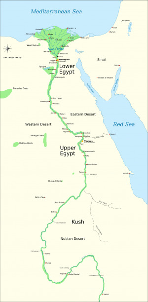

Tento (poněkud upravený) citát pochází z démotického Rylandova papyru č. IX. Jedná se o kopii stížnosti, jež byla adresována vysokému úředníkovi v Memfidě, administrativním centru celého Egypta. Stížnost popisuje velice dlouhý a komplikovaný rodinný spor táhnoucí se napříč několika generacemi (633–513 př. n. l.). Jablkem sváru je právo na dědičný podíl výnosů z chrámu boha Amona. Text papyru a tento článek, který z něj vychází, ukazují, jak v Egyptě Pozdní doby probíhaly majetkové a mocenské konflikty, jak se Egypťané dovolávali spravedlnosti a jak úspěšní, případně neúspěšní v této své snaze byli.

Egypt byl v době sedmého a šestého století př.n.l., kdy se události popsané na Rylandově papyru č. IX odehrávají, velice kosmopolitním státem – bohatství země lákalo mnohé, a tak se v Egyptě usazovali nejrůznější národnosti: Libyjci, Núbijci ze Súdánu, Aramejci, Řekové, Židé (židovská komunita je doložena až na Elefantině) a další. Právě díky bohatství Egypta museli panovníci 26. dynastie čelit velice reálné hrozbě na svých východních hranicích – Asyrské a později Babylonské říši. Samotní sajští panovníci byli úspěšní v obraně egyptské samostatnosti po mnoho let nejen díky své chytré diplomacii, ale i pomoci schopných řeckých žoldnéřů. Avšak postupně se jejich zdroje vyčerpaly a síla egyptského státu oslabila natolik, že v r. 525 př. n. l. už nebylo možné odrazit perské vojsko, které dobylo a obsadilo celý Egypt. Kdysi mocný stát se tak až do příchodu Alexandra Velikého stal pouhou provincií perské říše.

## I. Petiese I.

Události, které nakonec vedly k výše zmíněné vraždě dvou dětí, začaly velice nenápadně, a to jmenováním hodnostáře Petieseho I. do významných správních úřadů Horního Egypta. Došlo k tomu okolo r. 660 př. n. l. Nedlouho poté Petiese zjistil, že chrám boha Amona v Teudžoj je zanedbáván a nedostává se mu prostředků. Teudžoj bylo v sedmém století př. n. l. pouhým provinčním městečkem, jehož dřívější sláva dávno upadla. Přesto však Petiese nelitoval námahy, aby Amonově chrámu pomohl. Zachoval se jako příkladný zbožný Egypťan a postaral se o jeho zvelebení a také o zlepšení jeho ekonomické situace. Zajistil chrámu prominutí daní, ustanovil řemeslníky, kteří měli vyrobit novou chrámovou výbavu, a povolal do Teudžoj kněží, aby se starali o každodenní chod kultu a chrámu. V neposlední řadě také chrámu zajistil pozemky, které jej měly zásobovat, a ustanovil své děti do funkce Amonových kněží.

Aby jeho činy nebyly zapomenuty, dal vyrobit sochy a stély, které měly jeho zbožné skutky navěky připomínat, a nechal je vztyčit v Amonově chrámu v Teudžoj. Jako odměnu za své skutky dostal také právo na část výnosů tohoto chrámu a titul Amonova kněze. V následujících letech Petiese I. věrně sloužil panovníkovi a staral se o záležitosti Horního Egypta. Díky své oddanosti získal mnoho kněžských titulů a s nimi související bohatství. Na konci svého života požádal o propuštění ze služby a vrátil se do městečka Teudžoj, aby poslední léta svého života strávil v klidu a ve společnosti svých dětí a vnuků.

Bohužel však nebyl klid Petiesemu dopřán. Protože se vzdal svých světských funkcí, přišel i o velkou část svého politického vlivu. Toho využili kněží boha Amona, kteří nebyli příliš spokojení se sdílením chrámových výdělků s Petiesovou rodinou:

> Má Petiese opravdu dál dostávat celou pětinu božího majetku? Máme přece toho zbabělce ve své moci!

Zrádní kněží využili Petiesovy nepřítomnosti a rozhodli se proti němu jednat. Když Petiese odcestoval na jih, nechali zabít dva malé Petiesovy vnuky ve chvíli, kdy tyto dvě děti přicházely pro dědičný díl chrámových výnosů:

> _Čekali na ně muži s holemi, kteří dva chlapce obklopili a začali je bít. Děti se jim vysmekly a utíkaly do svatyně poblíž. Vrahové je však pronásledovali a dostihli je na prahu kaple boha Amona. Děti byly na tomto místě ubity a vrahové jejich těla pohodili do skladiště v kapli._

### Majetek egyptských chrámů

Chrámy ve starém Egyptě byly významnými hospodářskými centry. V&#160;jejich vlastnictví se nacházely rozsáhlé obdělavatelné pozemky a kromě zěmědělců a pastevců pro ně pracovali také řemeslníci a obchodníci. Chrámy mohly dokonce organizovat nákladné expedice do pouště za nerostnými surovinami. To vše tyto instituce získaly díky darům panovníků i soukromých osob a tyto dary byly samozřejmě vnímány jako dary samotným bohům, kteří byli v&#160;jednotlivých chrámech uctíváni.

Není proto divu, že právo na chrámové výnosy, které se často pojilo s&#160;kněžskou funkcí, bylo ve starém Egyptě velmi žádané a jeho získání mohlo vyvolat velmi vážné spory. Kněžské funkce, přesněji s&#160;nimi spojené výnosy, mohly také často sloužit jako odměna věrným podřízeným, udělená panovníkem nebo jiným vlivným hodnostářem. V&#160;Rylandově papyru č. IX jsou výnosy kněžími použity jako úplatek.

Přestože určitě existovali kněží, kteří se zabývali složitými teologickými problémy a sepisovali sáhodlouhá náboženská pojednání, většina „kněží“, kteří pracovali v&#160;chrámu, se zabývala spravováním rozsáhlého majetku chrámu a účastila se pouze výkonu čistě rutinních jednoduchých rituálů, případně organizace slavnostních procesí, která se konala u příležitostí významných náboženských svátků.

Obecně ve starověkém Egyptě náboženské funkce a funkce civilní administrativy velmi často splývaly a panovník měl právo kdykoliv chrámové bohatství přerozdělit podle svých přání a náboženských preferencí. Přestože Egypt bývá považován za teokratický stát, doklady nasvědčují spíše tomu, že v&#160;případě mocenských konfliktů se do čela státu nedostávali kněží, ale armádní velitelé.

Harvedža, otec chlapců, se vydal za náčelníkem Ma (libyjské oddíly starající se o bezpečnost v Egyptě) Takehim a nahlásil mu, co se stalo. Náčelník sebral vojáky a vypravil se s nimi do Teudžoj. K oddílu se později přidal také Petiese, který se urychleně vrátil ze své cesty. Podařilo se jim zatknout dva z kněžích zodpovědných za zosnování vraždy dětí a ti nakonec byli potrestáni samotným panovníkem. Ostatní obyvatelé Teudžoj měli takový strach z Petiesovy pomsty, že z městečka dočasně utekli. Avšak ani touto krvavou událostí nebyl spor o podíl z chrámových výnosů vyřešen.

## II. Petiese II.

O generaci později, v r. 592, se Amonovým kněžím naskytla další příležitost, jak zbavit Petiesovu rodinu dědičných příjmů z chrámu. Kněží velice chytře přesvědčili Petieseho II., aby se připojil k výpravě Psametike II. do Palestiny. Petiesovým soupeřům se podařilo díky úplatku přesvědčit významného hodnostáře z Herakleopole, blízkého regionálního centra, že Petiesův nárok na část výnosů z chrámu je falešný.

Rozzlobený Petiese II. se po návratu pokusil přednést svou stížnost faraonovi, ale nebyl přijat. A nakonec bylo dokonce rozhodnuto ve prospěch Petiesových protivníků. Petiese, nespokojen s výsledkem, požádal o pomoc své bohaté a vlivné příbuzné v Thébách:

> _Dali mu pět debenů stříbra a jeho příbuzní mu dali dalších pět debenů, dohromady deset debenů stříbra. Řekli mu: ‚Běž k soudu s tímto mužem, který tě připravil o tvůj díl z chrámových výnosů. Až použiješ stříbro, které jsme ti dali, vrať se k nám a dáme ti ještě víc.‘ Nato se Petiese vrátil domů do Teudžoj a lidé, které potkal, mu říkali: ‚Nemá smysl chodit k soudu. Tvůj protivník je bohatší, než jsi ty. I kdyby jsi měl sto kusů stříbra, stále by tě porazil.‘_

Na základě této rady se Petiese nakonec vzdal jakékoliv další snahy dovolat se spravedlnosti.

## III. Petiese III.

Nedlouho poté, tentokrát však už v době perské nadvlády, se kněží pokusili učinit Petieseho III., vnuka Petieseho II., zodpovědným za nový úpadek a zchudnutí chrámu. Petiese III., v té době asi sedmdesátiletý stařec, byl zatčen a dopraven k výslechu do Herakleaopole. Petiesův věznitel mu nebyl příliš nakloněn:

> _Nezbil jsem tě jen proto, že jsi starý muž a umřel bys._

Naštěstí se Petiesemu podařilo přesvědčit tamní hodnostáře o své nevině a jeden z Petiesových spojenců v Herakleopoli přislíbil celý případ vyšetřit.

Petiese se tedy s klidnější myslí vrátil zpět domů do Teudžoj. Avšak po několika dnech kněží zjistili, co vše o nich prozradil autoritám v Herakleopoli, a rozhodli se pomstít:

Egyptští panovníci vládnoucí v&#160;době popisovaných událostí (Podle Shaw, I.: Dějiny starověkého Egypta. Praha: BB Art 2003.)

#### 26. dynastie (664–525 př.n.l.)

- Psammetik I.&#9;664–610 př. n. l.
- Neko II.&#9;&#9;610–595 př. n. l.
- Psammetik II.&#9;595–589 př. n. l.
- Haibre/Apries&#9;589–570 př. n. l.
- Ahmose II.&#9;&#9;570–526 př. n. l.
- Psammetik III.&#9;526–525 př. n. l.

#### První perská nadvláda, 27. dynastie (525–404 př.n.l.)

- Kambýsés&#9;&#9;525–522 př. n. l.
- Dareios I.&#9;&#9;522–486 př. n. l.

> _Přepadli mě, mého syna a mé čtyři bratry. Mučili nás a uvěznili nás v chrámě.... Irethoreru se svými bratry za námi přišel do chrámu, napadli nás a bili nás. Skoro mě zabili svými ranami. Pak nás odvedli do staré věže, která byla součástí chrámové brány, a hrozili nám, že nás zabijí._

V poslední chvíli si však jeden z kněží uvědomil, že takováto hromadná vražda by jistě vyvolala pobouření na vyšších místech a přiměl své spojence od vražedného plánu ustoupit:

> Skutečně chcete za denního světla zabít tyto lidi? Určitě se o tom dozví správce i ti nejvýše postavení v Egyptě. Je tady šest lidí, které chcete zabít.

Zdá se, že pouze díky šťastné náhodě starý Petiese III. přežil mučení a bití. Trvalo ještě tři měsíce, než se zotavil. Ihned poté se vydal do Memfidy dovolat se potrestání útočníků. V hlavním městě se sedm měsíců snažil získat audienci u správce, zatímco jeho protivníci se mu v tom snažili zabránit. Nakonec byli kněží předvolání do Memfidy a za jejich pozdní příchod jim bylo vyplaceno padesát ran bičem.

Dalšímu soudu a trestu se vyhnuli podplácením:

> ,Dáme tobě a tvým pěti synům část chrámových příjmů. Dej přinést papyrus a sepíšeme smlouvu.‘ Úředník Sematavitajefnacht, syn Anchvennefera, nechal přinést papyrus a kněží sepsali smlouvu. Sematavitajefnacht poté šel za správcem a řekl: ,Tito kněží už byli potrestání a prohráli svůj případ. Pošli je pryč!‘

Když se Petiese od Sematavitajefnactha, který se stále tvářil jako jeho přítel a rádce, dozvěděl, že kněží byli bez dalšího potrestání propuštění, byl zdrcen a rozplakal se. Jeho sedmiměsíční úsili bylo k ničemu, ale nemohl už nic dalšího dělat. Vydal se tedy na cestu domů:

> Přišel jsem na jih do Hérakleopole a potkal jsem Nesirdieta a Ahmose, když cestovali po proudu na sever. Zeptali se mě: ‚Jsi Petiese? Jsi na cestě do Teudžoj? Neobtěžuj se, tvůj dům shořel!‘

Petiese se tedy znovu vydal na cestu, aby pokračoval ve své stížnosti. Dosáhl však potrestání pouze jednoho z knězů, který dostal dalších padesát ran bičem. Brzy poté se Petiese musel vrátit zpátky domů do Teudžoj, kde se rozhodl podat další oficiální stížnost tentokrát podpořenou písemným vylíčením všech událostí, které s rozepří souvisely.

Dochovanou kopii tohoto textu dnes známe jako Rylandův papyrus č. IX. Žádné další doklady týkající se výše popsaných událostí (zatím?) nalezeny nebyly a je možné se použe dohadovat, jak Petiesova stížnost dopadla.

## Závěrem

O přesnosti a výpovědní hodnotě Rylandova papyru č. IX. je možné v mnoha ohledech pochybovat, a to zejména vzhledem k účelu samotného textu. V podstatě se jedná pouze o pohled jedné ze stran sporu, který má svým obsahem naklonit čtenáře Petiesově věci. Je velice pravděpodobné, že Amonovi kněží, kteří jsou Petiesovými protivníky, by mnohé události vylíčili v úplně jiném světle. Za připomenutí také stojí, že velká část příběhu, který Petiese popisuje, se odehrála dlouho před jeho vlastním narozením.

Přes tyto připomínky však Rylandův papyrus č. IX poskytuje unikátní vhled do mnoha oblastí života egyptských kněží a hodnostářů, do fungování chrámové administrativy a v neposlední řadě do záležitostí spravedlnosti a práva.

Z textu je zřejmé, jak bylo dovolání se spravedlivého soudu v době sedmého a šestého století (a nejen tehdy) ve starém Egyptě obtížné. Na základě Petiesovy stížnosti se se dokonce zdá, že bez značných finančních prostředků nebo vlivných přátel to bylo téměř nemožné.

Korupce a úplatky jsou v Petiesově stížnosti chápány jako samozřejmost. Ani sami „hrdinové“ textu nepohrdnou finanční pomocí, která má sloužit k podplácení úředníků rozhodujících o jejich záležitostech. Velmi často víc než samotná fakta a výpovědi svědků hrají roli přímluvy mocných hodnostářů, kteří rádi ovlivňují události ve prospěch svůj a svých chráněnců.

### Kde se dočíst víc

- Ray, J.: Ve stínu pyramid: skutečný život ve starém Egyptě, Praha: Albatros 2003.
- Kemp, B.: Ancient Egypt. Anatomy of a Civilization, London: Routledge 2003.
- [Anglický překlad textu papyru]( http://www.reshafim.org.il/ad/egypt/texts/pediese.htm).

Téměř žádná z postav textu nebere morální stránku svého jednání v úvahu a nejčastějším motivem jak hlavních aktérů textu, tak vedlejších postav je osobní zisk:

> Správce polí nám řekl: ‚Připište mi část příjmů Amonova proroka v Teudžoj a pak vás budu podporovat ve všech vašich záležitostech.‘

Zajímavostí je, že jednou z mála postav, které se v textu zachovají nezištně, je cizinec z Libye, výše zmiňovaný náčelník Ma Takehi, jenž působil v čele regionálních bezpečnostních oddílů. Dokonce i v jeho případě je však možné podotknout, že na základě textu se pravděpodobně jednalo o přítele Petiesovy rodiny. V takovém případě by i Takehi měl ke svému jednání zištné důvody.

Popsané chování egyptských hodnostářů ostře kontrastuje s biografickými nápisy na stěnách hrobek velmožů a také s ideálem, který bývá často popisován v egyptských naučeních. V obou těchto literárních žánrech je vyzdvihována schopnost egyptských hodnostářů spravedlivě rozhodovat a soudit. Avšak stejně jako v naší současnosti se i ve starém Egyptě každodenní praxe od literárních ideálů velmi lišila.
