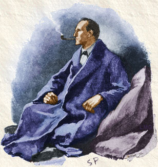
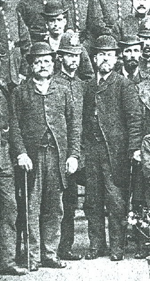
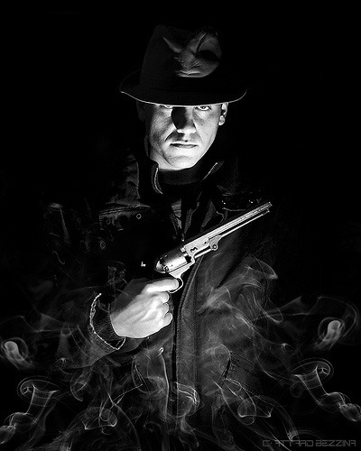

Tady je typický příklad: Hráčské postavy navštíví místo vraždy a neprohledají prostor před domem, tím pádem nikdy nenajdou vlčí stopy, které se mění v lidské. Neuspějí v hodu na hledání, aby našly ukryté milostné dopisy, takže nezjistí, že oběma ženám se dvořil stejný muž. Najdou rozbitou krabici s nápisem „Dannerovo řeznictví“, ale místo toho, aby do onoho řeznictví zašli, po debatě se rozhodnou zajít na nejbližší jatka.

Překlad vznikl s laskavým svolením autora. Na rozdíl od zbytku časopisu tento článek __nepodléhá__ licenci Creative Commons a __je vlastnictvím autora__. Původní článek můžete najít zde:

[http://thealexandrian.net/wordpress/1118/roleplaying-games/three-clue-rule](http://thealexandrian.net/wordpress/1118/roleplaying-games/three-clue-rule)

Následkem těchto problémů při hraní se mnoho lidí dobralo chybného závěru: Detektivky v RPG jsou prostě špatný nápad. V typické detektivce je kupříkladu hlavním hrdinou geniální detektiv. Hráči pravděpodobně nejsou geniálními detektivy. A tedy – detektivky jsou nemožné.

Nebo, jak mi to někdo kdysi vyložil: „Hráči nejsou Sherlock Holmes.“

Přestože je tento závěr nesprávný, je v těchto názorech trocha pravdy. Kupříkladu v případu „Studie v šarlatové“ vyšetřuje Sherlock Holmes na místě vraždy. Objeví malé množství popela v rohu místnosti. Pozorně je prohlédne a je schopen z toho vyvodit, že popel pochází z doutníků Trichinopoly (původem z Indie).

Teď si ukažme, jak tento relativně nevýznamný příklad Holmesovské dedukce bude vypadat při hraní:

1. _1._ Hráči by museli nejprve prohledat místnost.
1. _2._ Popel by je musel zaujmout natolik, aby jej pozorněji prohlédli.
1. _3._ Potřebovali by uspět v hodu na dovednost, aby jej identifikovali.
1. _4._ Potřebovali by této znalosti využít k vytvoření správného závěru.

To jsou čtyři potenciální body pro selhání. Hráči nemusí prohledat místnost (buď protože na to nepomyslí, nebo protože jejich hody na dovednost jsou slabé), hráči nemusí prozkoumat popel (protože si nemyslí, že je důležitý), nemusí uspět v hodu na zjištění, co je popel zač, nebo na základě zjištění mohou dospět ke špatnému závěru.

Pokud je správný výklad této stopy nezbytný k tomu, aby dobrodružství pokračovalo – pokud kupříkladu hráčské postavy musí jít do nejbližší prodejny s exotickými doutníky a začít se vyptávat – pak tato stopa funguje jako „štěrbina“ – buď hráči stopě porozumí a projdou skrz, nebo vrazí do zdi a zaseknou se.

„Štěrbiny“ v příběhových hrách jsou vždy velkým problémem, a je potřeba se jim vyhýbat, ale je jasné, že když dojde na detektivky, pak problém je ještě mnohem horší - každá stopa není jen jednou „štěrbinou“, ale najednou „šterbinou“ mnohonásobnou.

Řešení je tu jednoduché – odstraňte „štěrbiny“.

## Stopa z drobečků

Pro systém GUMSHOE (použitý ve hrách The Esoterrorists, Fear Itself a The Trail of Cthulhu), se Robin D. Laws rozhodl odstranit koncept potřeby hledat stopy. V každé „scéně“ vyšetřovacího příběhu, je jedna „stopa“. Automaticky se předpokládá, že ji vyšetřovatelé najdou.

To odstraňuje tři ze čtyř „štěrbin“, přičemž ponechává pouze nutnost použít stopu, aby hráči došli ke správnému závěru (tedy závěru, který je posune do další „scény“, kde je jim předána další stopa). V případě systému GUMSHOE lze dokonce tento bod překonat skrze mechaniky (pokud hráči nasadí body z dovedností svých postav, aby získali stále přesnější „závěry“ od Vypravěče).

To je způsob řešení problému skrze mechaniky hry. Přestože může být výsledkem herní sezení, které sleduje celou dobu strukturu detektivního příběhu, myslím, že selhává, protože nedává hráči onen pocit, jako by hrál detektivku.

Základní Lawsův omyl je, domnívám se, předpoklad, že detektivka spočívá v sledování „cesty z drobečků“, které sestávají ze stop. Zde je citace z eseje na toto téma:

> Především bych namítl, že tyto obavy jsou bezpředmětné a vycházejí ze základního nepochopení. Cesta ze stop, nebo zápletka cesty z drobečků, není příběhem a nepředstavuje předskriptovanou zkušenost. Co se hráčské postavy rozhodnou dělat a jak budou vzájemně interagovat, jak řeší detektivní zápletku, to je příběh. Jak je zmíněno v pravidlech The Esoterrorist, během testování se ukázalo, že každá skupině měla z připraveného dobrodružství velmi odlišný zážitek, protože každý Vypravěč i hráči reagovali unikátním způsobem na situace, které dobrodružství nabízelo.

Ale, ve skutečnosti, tento typ jednoduchého „A vede k B, což vede k C a to k D“ není typickým prvkem detektivního žánru. Pro relativně jednoduchý protipříklad se vraťme k Sherlocku Holmesovi a Studii v šarlatu:

_Watson:_ „To vypadá jednoduše,“ řekl jsem. „Ale co pak výška druhého muže?“

_Holmes:_ „Výška muže může být v devíti případech z deseti určena z délky jeho kroku. Je to poměrně jednoduchá kalkulace, přesto vás nechci nudit detaily. Měl jsem délku tohoto kroku z hlíny venku a z prachu uvnitř. Pak jsem měl možnost své výpočty ověřit. Když člověk píše na zeď, instinktivně píše nad úrovní vlastních očí. A nyní, písmo na zdi bylo něco zhruba šest stop nad zemí. Bylo to snadné.“

Toto je jen malá dedukce v mnohem větším příběhu, ale určitě si všimnete, že Holmes ve skutečnosti sesbíral několik stop, prostudoval je a závěr vyslovil na jejich základě. A to je ve skutečnosti typická struktura detektivního žánru: Detektiv pomalu sbírá důkazy, až se nakonec vynoří výsledek. Jak to slavně vyjádřil sám Holmes: „Když vyloučíte nemožné, pak to, co zbývá, musí být pravda, byť je sebenepravděpodobnější.“

Co je ale pravda, je to, že v mnoha případech je nezbytné, aby bylo nejprve učiněno mnoho menších závěrů, než bude sesbírán dostatek důkazů k tomu, aby byl případ vyřešen. Přesto, jak nám příklad ze Studie v šarlatové demonstruje, dokonce i ty nejmenší závěry mohou být založeny na několika důkazech, a ne jen jedné izolované stopě.

Toto pozorování nás neúprosně vede k řešení, které jsme hledali.

## Pravidlo tří stop

Kdykoli připravujete detektivku pro své hráče, měli byste se držet Pravidla tří stop:

Pro každý závěr, kterého chcete, aby hráči dosáhli, vložtenejméně tři stopy.

Proč tři? Protože hráči pravděpodobně minou první, budou ignorovat druhou a dezinterpretují třetí stopu, než učiní nějaký neuvěřitelný logický skok, který je dostane tam, kam jste je chtěli vést.

Dělám si samozřejmě legraci. Pokud ale přemýšlíte o každé stopě jako o plánu (postavy najdou A, vymyslí B a půjdou do C), pak pokud máte tři stopy, pak nemáte jen plán - máte také dva záložní plány. A když si uvědomíte, že vaše plány nikdy nepřežijí kontakt s hráči, potřeba těchto záložních plánů je jasná.

V nejlepším případě samozřejmě postavy hráčů najdou všechny tři stopy. Na tom není nic špatného. Mohou tyto stopy použít k potvrzení svých podezření a podpoření svých závěrů (jako Sherlock Holmes).

V nejhorším případě by měli být hráči schopni použít alespoň jednu z nich k tomu, aby dosáhli správného závěru a udrželi dobrodružství v chodu.

A ještě důležitý tip: Z pravidla tří stop nejsou žádné výjimky.

„Ale Justine!“ slyším vás říkat: „Tahle stopa je opravdu zřejmá! Na tu hráči prostě musí přijít!“

Podle mých zkušeností pravděpodobně nemáte pravdu. Zaprvé, vy jste ten, kdo vytváří příběh hry. Vy znáte řešení celé záhady a to vás činí značně neobjektivní k tomu soudit, zda je něco zřejmé, nebo ne.

A i kdybyste měli pravdu, tak co? Mít nějaké stopy navíc nezpůsobí žádné problémy. Radši být připraven, než pozdě bycha honit.

## Rozšíření pravidla tří stop

Pokud se nad tím zamyslíte, tak pravidlo tří stop je docela dobré mít na paměti, když připravujete jakoukoli hru.

Richard Garriot, tvůrce série počítačových her Ultima a hry Tabula Rasa, jednou řekl, že jeho práce jako herního designéra byla ta, aby zajistil, že bude existovat nejméně jedno řešení problému, ale bez toho, aby omezil hráče v tvorbě řešení vlastních. Kupříkladu, pokud jste v Ultimě našli zamčené dveře, vždycky pro ně někde bude klíč. Můžete se jimi ale prosekat, vypáčit zámek nebo přitáhnout dělo a ustřelit je.

Warren Spector, který začal pracovat s Garriotem na Ultimě VI, později pokračoval tvorbou hry Deus Ex. Následoval v ní stejnou filozofii a mluvil o nadšení, které zažíval, když viděl někoho hrát svou hru a přemýšlel: „Počkat... tohle bude vážně fungovat?“

Když připravuji dobrodružství, snažím se tuto filozofii dotáhnout ještě o kousek dál: Ujistím se, že pro každý problém existuje nejméně jedno řešení a snažím se zůstat otevřený všem možnostem, se kterými hráči přijdou.

Pro každou „šterbinu“ ale musíte mít připravena nejméně tři řešení.

Kupříkladu řekněme, že existují tajné dveře, za nimiž je ukryt náhodný, ale ve výsledku nedůležitý poklad. Nalezení tajných dveří je problém, ale není to „štěrbina“, takže je třeba přijít pouze s jedním řešením. V D&D je toto řešení jednoduché, protože je zapracováno do pravidel – tajné dveře je možné najít s úspěšným hodem na hledání.

Ale řekněme, že namísto náhodného pokladu by za tajnými dveřmi bylo něco nejvyšší důležitosti. Pokud má dobrodružství fungovat, pak hráčské postavy musí tajné dveře najít.

Tajné dveře jsou najednou „šterbinou“, a proto se snažím zajistit, aby pro tento problém byla nejméně tři řešení. První řešení zůstává stejné – úspěšný hod na hledání. K tomu můžeme přidat poznámku v jiné místnosti, kterou je kultista instruován, aby „ukryl artefakt za sochu Ra“ (kde se nacházejí tajné dveře), stejně jako velmi poškozený deník tvůrce celého komplexu, který na dveře odkazuje, také druhé tajné dveře, které vedou do té stejné místnosti (to se počítá jako samostatné řešení protože zavádí možnost druhého hodu na hledání), dále pravděpodobný scénář, kdy se hlavní zlosyn pokusí uprchnout skrze tajné dveře, případně možnost zajmout kultisty a vyslýchat je... a tak podobně.

Jakmile „štěrbinu“ identifikujete, je vlastně docela triviální začít přidávat řešení, jako jsou tato.

Viděl jsem Vypravěče, kteří si stěžovali, že to dělá věci „příliš jednoduché“. Ve skutečnosti jsou to ale právě tyto alternativní možnosti, které většinou dělají dobrodružství více, nikoli méně, zajímavé. Podívejte se kupříkladu na naše tajné dveře: Předtím, než jsme začali přidávat možnosti, to byl pouze hod kostkou. Nyní jsou to dveře navržené určitou osobou, využívané kultisty a lze je potenciálně využít jako únik z komplexu.

Pokud začnete vrstvit tyto techniky z pravidla tří stop, pak zjistíte, že vaše scénáře začnou být ještě robustnější. Kupříkladu si vezměme vyšetřování vraždy, kde vrahem je vlkodlak, který vyhledá své bývalé milenky. Přijdeme se třemi možnostmi, jak určit osobu vraha:

1. _1._ Hlídat na ulicích malého městečka v noci při svitu měsíce v úplňku.
1. _2._ Odhalit, že oběti byly milenky jednoho muže.
1. _3._ Zajít k řezníkovi, kde vrah pracuje, a odhalit jeho přiznání k nočním můrám a hříchům napsané krví na zdech zadní místnosti.

Pro každou z těchto tří možností (je vlkodlak, je bývalý milenec, měli bychom zkontrolovat řeznictví) potřebujeme tři stopy.

_Je vlkodlak:_ Vysledujte onu změnu vlčích šlápot na lidské. Velké stopy spárů na tělech obětí. Jedna z obětí vlastnila pistoli s nabitými stříbrnými kulemi.

_Je bývalý milenec:_ Milostné dopisy psané tou samou osobou. Deník psaný jednou z obětí, který popisuje, jak ji její milý podvádí s druhou obětí. Fotografie toho samého muže, které měly oběti u sebe nebo doma.

_Měli bychom zkontrolovat řeznictví:_ Rozbitá bedna s nápisem „Dannerovo řeznictví“ na místě jedné z vražd. Poznámka „sejdeme se v řeznictví“ zmačkaná a zahozená v koši. Poznámka „setkat se s P v řeznictví“ v diáři jedné z obětí.

A teď máte připravené dobrodružství s devíti možnými cestami k úspěchu. A pokud si ponecháte mysl otevřenou myšlence „čím více stop, tím lépe“, když dobrodružství připravujete, pak najdete možností ještě více. Kupříkladu, jak jednoduché by bylo umístit odkaz na řeznictví do jednoho z milostných dopisů? Nebo zaplnit deník oběti pološílenými uhlovými skicami vlků?

Zábavné na tom je, že jakmile sami sobě povolíte přidávat hodně stop, pak jste si povolili také možnost přidat nějaké opravdu tajuplné a slabé stopy. Pokud je hráči vyřeší a odhalí, pak se budete cítit opravdu dobře, že jste je tam dali. Pokud je nenajdou nebo jim neporozumí, pak je to také v pořádku – máte hromady dalších stop, které mohou následovat (a když vyřeší záhadu, pak si hráči opravdu budou užívat ohlédnutí za hrou a porozumění, co ty tajuplné stopy znamenaly).

## Důsledek: Shovívavé hledání stop

Ono „čím více stop, tím lépe“ je velmi důležité. Je myslím přirozené že se při přípravě detektivky snažíte zadržovat informace. Je to logický sklon – přece jen, záhady a detektivky jsou určeny nedostatkem informací. Ale je tu rozdíl v tom mít hromady stop, a nechat vraha napsat svoji adresu na zeď krví oběti.

Myslím také, že snaha zadržovat informace nadělá víc škody než užitku. Kdykoli zadržíte kousek informace, ve skutečnosti uzavíráte cestu možnému úspěchu. Tady se vracíme zpět ke Garriottově radě – pokud není důvod k tomu, aby dveře samy byly odolné na výstřel z děla, pak by měl být hráč odměněn za chytrý nápad. Nebo, pokud to podáme jinak – to, že byste neměli nechávat klíč k zamčeným dveřím ležet přímo před nimi, neznamená, že by nemělo existovat více možností, jak se za tyto dveře dostat.

Pokud máte toto na paměti, pak byste měli být vědomě otevření k shovívavému nalézání stop. Tím myslím to, že pokud hráči přijdou s nějakým chytrým přístupem k vyšetřování, měli bystě být otevření tomu, dát jim užitečné informace jako výsledek jejich akcí.

Další možnost, jak o tom přemýšlet – neberte seznam stop, se kterým během své přípravy přijdete, jako svěrací kazajku. Namísto toho o něm přemýšlejte jako o záchranné síti.

Dříve jsem se při přípravě hry vždycky velmi upnul k obzvláště chytrému řešení nějaké situace. Citově jsem se angažoval v myšlence, že mí hráči objeví toto chytré řešení, se kterým jsem přišel sám. Výsledkem toho jsem měl tendence vetovat ostatní potenciální řešení, se kterými hráči přišli - přece jen, pokud by tato ostatní řešení fungovala, pak by nikdy neodhalili to mé, obzvláště chytré řešení.

Časem jsem se naučil, že je mnohem větší zábava, když mě hráči překvapí. Výsledkem je to, že se snažím myslet na své připravené řešení jen jako na poslední pomoc – a záchrannou síť, která se využije, když hráči nic zajímavějšího nevymyslí sami.

Abyste zůstali otevření shovívavému nalézání stop, musíte nejprve rozumět základům situace (Kdo je vlkodlak? Jak zabil oběti? Proč je zabil? Kdy je zabil?). Pak oceňte všechny neočekávané přístupy, které hráči mohou mít a přikloňte se ke kladenému výsledku, když se rozhodujete, zda mohou postavy najít stopu, o které jste předtím nikdy nepřemýšleli.

## Důsledek: Aktivní stopy

> (známý také jako Omlaťte jim je o hlavu)

Občas, přes veškerou vaši snahu, hráči skončí ve slepé uličce - netuší, co stopy znamenají, jednoduše některé stopy ignorují nebo stop využili k dosažení chybného závěru a nyní míří naprosto špatným směrem (pokud používám Pravidlo tří stop, pak zjišťují, že tento případ nastává většinou ve chvíli, kdy si hráči neuvědomí, že je tu ve skutečnosti záhada k vyřešení – ne každá záhada je přece jen tak zřejmá jako mrtvé tělo).

V takovém případě je užitečné mít záložní plán. Problém v tomto dobrodružství je, že hráčské postavy jsou příliš pasivní - buď protože nemají informace, které potřebují, nebo protože je používají špatným způsobem. Řešením proto je, aby se jim něco aktivního stalo.

Rada Raymonda Chandlera pro tento druh slepé uličky byla „Ať do dveří vejde chlápek se zbraní.“

Můj typický přístup patří ke stejnému druhu – padouch zjistí, že postavy jsou ty, které zločin vyšetřují, a pošle někoho, aby je zabil nebo uplatil.

Další dobrá řešení jsou „někdo další zemře“, nebo obecněji „stane se další část padouchova plánu“. To má ten aktivní prvek, že vznikne nová lokace nebo událost, se kterými mohou hráči pracovat.

Myšlenka všech těchto rad samozřejmě není jen „ať se něco stane“. Potřebujete, aby událost přinesla novou stopu (nebo ještě lépe, několik stop), které postavy posunou dál.

V nejhorším případě můžete vymyslet závěrečnou „propustku z vězení“, kterou můžete použít, aby se příběh nějak uzavřel bez ohledu na to, jak špatně se postavy zasekly. V případě naší záhady s vlkodlakem se v případě, že se postavy úplně zamotají,může vlkodlak objevit a pokusit se je zabít (protože se „dostávali příliš blízko“). Je to většinou mnohem méně uspokojivé řešení, ale přinejmenším vás dostane ze špatné situace. Je to poslední záchrana, když všechny ostatní poslední záchrany selžou.

## Důsledek: Falešné stopy se přeceňují

Falešná stopa je klasický prvek detektivek – všechny důkazy ukazují na X, ale je to úskok! Vrahem je ve skutečnosti Y!

Když ale připravujete dobrodružství pro RPG, myslím si, že úhybné manévry se přeceňují. Nepůjdu tak daleko, abych řekl, že byste je neměli nikdy používat, ale půjdu tak daleko, že řeknu, že byste je měli používat jen s největší obezřetností.

Jsou pro to dva důvody:

Zaprvé, přimět hráče k tomu, aby došli ke správným závěrům už je beztak dost obtížné. Dávat jim tam falešné stopy situaci ještě ztěžuje. Co je ale ještě důležitější – ve chvíli, kdy hráči dojdou k nějakému závěru, tak u něj mají tendence setrvat. Je pak extrémně obtížné je přesvědčit, aby tento závěr opustili a přesměrovaly důkazy na někoho jiného. (Jeden ze způsobů, jak je možné falešné stopy použít, je existence absolutního popření viny neprávem obviněného - kupříkladu vraždy pokračují i poté, co postavy zatknou podezřelého. Naneštěstí to, co pokládáte za „absolutní popření viny“, stojí stejně na vodě jako „opravdu zřejmá stopa, kterou nemohou prostě minout“.)

Zadruhé, opravdu není potřeba falešné stopy připravovat – hráči se o to téměř jistě postarají sami. Pokud nevyplníte své dobrodružství ničím jiným než stopami, které vedou jasné a neodbytně k skutečnému vrahovi, pak vám mohu téměř zaručit, že hráči začnou podezřívat nejméně tři jiné lidi, než zjistí, kdo za tím opravdu stojí. Ke svým podezřením také velmi přilnou a začnou splétat komplikované teorie, které vysvětlí, jak důkazy, které mají, prokazují vinu vraha, kterého chtějí.

Jinými slovy – velký trik přípravy detektivního dobrodružství je snaha vyhnout se havárii automobilu. Přidání falešných stop je, jako byste opili hráče, předtím než je posadíte za volant.

## Důsledek: Nic není nerozbitné

Nyní jste si pečlivě připravili dobrodružství, v němž vede k řešení několik cest a kde každý krok po cestě podporují tucty stop. Máte připraveny aktivní záložní plány určené k nasazení hráčských postav zase na koleje, pokud by se zasekli.

Teď už se nic nemůže pokazit!

...proč vůbec říkáte tyhle věci?

Pravda je, že bez ohledu na přípravu se dříve či později vaše plány zvrtnou. Až se to stane, budete chtít být připraveni na možnost vymýšlet nové záložní plány přímo během hry.

Zde je citace ze skvělé eseje Bena Robbinse:

> Normální zbraně nemohou zabít zombie. MicroMan nevěří Kapitánu Furymu. Jezerní příšera je ve skutečnosti Starouš Wiggins v gumové masce.
>
> To jsou „Odhalení“. Jsou to věci, které chcete, aby hráči odhalili, aby mohli volit správné řešení, nebo pochopili, co se ve hře vlastně děje. Odhalení posunují zápletku a činí hru dramaticky zajímavější. Pokud je hráči neodhalí (nebo je neodhalí ve správnou dobu), mohou pak rozbít hru.

Opravdu tuhle esej doporučuji k přečtení. Říká víceméně všechno, co jsem plánoval zařadit do posledního Důsledku, takže nebudu ztrácet čas a pokoušet se to přeformulovat, když už je to tak dobře napsané. Místo toho se spokojím s citováním kousku rady z článku:

> Zapište si svá Odhalení – sepsání vašich odhalení dopředu vám ukáže, jak bude hra probíhat. Jakmile hra začne, věci začnou být trochu hektické – může se omylem stát, že padouch se objeví, přednese své ultimátum a pak zase zmizí, aniž si vzpomene, aby za sebou zanechal klíčovou stopu, která zavede postavy k jeho tajné základně. Pokud máte štěstí, uvědomíte si své opomenutí a můžete to nějak napravit. Pokud máte smůlu, pak si toho vůbec nevšimnete a strávíte zbytek hry přemýšlením nad tím, proč hráči mají tak odlišnou představu o tom, co se děje.

Jak jsem zmínil, jedna z možností, jak se tomuto druhu problému vyhnout, je nemít „jednu klíčovou stopu“, na které celé dobrodružství stojí. Ale rada „napište si své odhalení dopředu“ je skvělá. Jak Robbins říká, „měl by to být spíš seznam nebo nakopávač, než celé vysvětlení“.

Co doporučuji, je vytvořit si seznam závěrů, ke kterým chcete, aby hráči došli. Pod každý závěr si sepište každou stopu, která je k tomu závěru může posunout (také to může sloužit jako dobrá kontrola, zda máte pro každý závěr opravdu dost stop, které je podporují). Jak hráči získají stopu, odškrtněte si ji (to vám umožní kontrolovat, jestli jsou oblasti, kde hráčům chybí pořád příliš mnoho stop).

Naslouchejte také pečlivě tomu, co si hráči říkají navzájem. Pokud dosáhnou nějakého závěru, můžete si ho celý odškrtnout ze svého seznamu (dejte si pozor, abyste ho neodškrtli ve chvíli, kdy ho hráči zmíní jako možnost, ale skutečně až ve chvíli, kdy jsou přesvědčeni o tom, že je závěr pravdivý).

Pokud vidíte, že hráči nenašli dost stop pro nějaký závěr, nebo ty, které našli, nerozluštili... pak je pravděpodobně na čase začít přemýšlet o dalších stopách, které můžete do příběhu zapracovat.

## Závěr

Co z toho vyplývá, je jednoduché - __Připravte si více cest k úspěchu. Povzbuďte hráčskou důmyslnost. Připravte si pojistky.__

A pamatujete na Pravidlo tří stop:

__Pro každý závěr, kterého chcete, aby hráči dosáhli, vložte nejméně tři stopy.__
