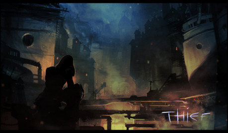
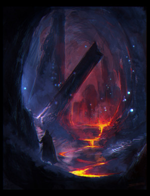
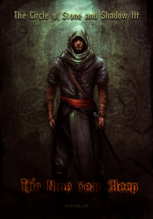

Project Dark je súborom troch herných prostredí vybudovaných na spoločnom mechanickom jadre. Autor zatiaľ zverejnil len beta verziu pravidiel, v ktorej chýbajú detailnejšie vysvetlenia, menej podstatné kusy systému či konkrétne herné prostredie. Čo nám ale také odlišné od stoviek už existujúcich RPG systémov DARK sľubuje?

Našťastie podľa prebehnutých testovacích hier nielen sľubuje, ale aj prináša, hry plné zakrádania sa, trpezlivého vyčkávania a odvážnych podfukov v prevleku uprostred nepriateľov. Zlodeji, nájomní zabijáci či korporátni agenti a vojenskí prieskumníci, u ktorých nie je to najpodstatnejšie aký demidž vedia spraviť za sekundu, ale či splnia úlohu, misiu alebo plánovanú krádež s čo najmenším rozruchom.

Tiene, klam, odvážna akrobacia a otváranie zámkov šperhákmi či hackovanie mainframe zavesený na lane z vetracej šachty. Inšpirácia postaršou PC hrou Thief: The Dark Project či filmami Mission Impossible je viac ako zjavná.

Pridajme k tomu:

- Medzihru medzi misiami, kde identitu postavy na základe zanechaných stop hľadá detektív – inšpektor.
- Tri rôzne prostredia:
    - magicko-technického Dark, kde v prastarom meste súperia šľachtické rody s obchodníckymi guildami a každú budovu či miesto obýva Genius loci,
    - postapokalyptického Dark\|Net, kde je elektrina vzácna a znepriatelene frakcie bojujú o next-gen technológie v ruinách mrakodrapov osvetlenými len klasickým ohňom,
    - Dark\|Planet, kde žije ľudstvo pod oceľovou oblohou v područí inej rasy a jedinou záchranou je hnutie odporu bojujúce proti kolaborantom a mimozemšťanom uprostred rozpadajúceho sa ľudského a nepochopiteľného mimozemského sveta.

Postavy nie sú nejakí začínajúci zlodejíčkovia, ale od začiatku sú to majstri tieňa, podvodu a parkúru. Na myseľ hneď príde Garett, Meh‘Lindi či Kára z WH40k a hrdinky seriálov Alias alebo Dark Angel. Zámer spraviť hru o zlodejoch - profesionáloch výborné podporuje nápad postaviť systém nie na klasických kockách, ale na pokrových kartách. Taktika ako, kedy a ktoré karty hráč použije patri spolu s neznalosťou presnej obtiažnosti a zmesou old či new school postupov k výrazným tvorcom napätia a atmosféry.

> GM sa snaží verne stvárňovať živé a meniace sa prostredie a jeho reakcie na postavy, pričom ale nemá zabúdať na príbehovú coolovost a to, že postavy sú vo svojom remesle borci. Finálnu hodnotu Obtiažnosti akcie spočíta súčtom dvoch čísiel. __Prekážka__ predstavuje náročnosť uspieť v danej činnosti ako takej.
>
> (Vyškriabať sa do druhého poschodia po fasáde budovy)
>
> __Opozícia__ zase vplyv aktívnej sily pôsobiacej proti zámeru postavy, ktorý obvykle zahŕňa robiť niečo nenapadne.
>
> (Vyškriabať sa tak aby si patrolujúca stráž nič nevšimla)

Obtiažnosť musí hráč vo svojej akcii prekonať vykladaním kariet z ruky a sčítavaním ich hodnôt. Neexistuje pritom tabuľka ktorá by definovala ako je čo náročné, takže výsledné číslo závisí výhradne od GMovho vnímania sveta. GM toto číslo hráčovi nehovorí, ale snaží sa mu adekvátne slovne opísať prostredie a protivníka. Stupnica je približné od jednoduchej akcie s hodnotou 5 po ďaleko nadľudské záležitosti s hodnotou 15. Hráči a GM samozrejme môžu diskutovať ohľadom existujúcej fikcie a GM môže svoj názor na Obtiažnosť na základe iného uhla pohľadu zmeniť. Každú vyloženú kartu musí hráč opísať ako konkrétnu čiastkovú akciu postavy vo fikcii. Priveľa použitých kariet však zvyšujú šancu že si niekto všimne že sa niečo nekalé deje a možno sa o to začne zaujímať hlbšie. Netreba asi dodávať že fyzicky súboj je smrtiaci a začínajúce postavy sa mu naozaj snažia vyhnúť. Pustiť sa do férového boja so strážcom-veteránom v krúžkovom brnení je naozaj zlý nápad.

> Príklady akcií: nepozorovane prejsť cez chodbu so slávičou podlahou, klepnúť nič netušiaceho strážcu obuškom a nehlučne zachytiť jeho padajúce telo, tiché vylomenie rubínov z očných jamiek sochy zabudnutého boha či hacknutie bezpečnostného systému bez vyvolania poplachu

Každý hráč ma svoj vlastný balíček kariet do ktorého si pri tvorbe postavy namieša karty pomocou bodového systému. Zvyšné karty okrem žolíkov z neho vyhodí. Farby pokrových kariet majú v systéme priradený konkrétny význam:

__Čierne farby:__ predstavujú fyzické - navonok sa prejavujúce schopnosti

- Kríže - prudkosť/silovosť
- Kára - šikovnosť/obratnosť

__Červené farby:__ predstavujú nefyzické - vnútorné schopnosti

- Piky - prefíkanosť/bystrosť
- Srdcia - odvaha/smelosť

__Obrazy (Court)__

Týmto kartám (J,Q,K) môže hráč priradiť niektorú zo Špeciálnych schopností. A tie dokážu v akcii pri ktorej ich kartu vyložíte kdejaké zaujímavé psie kusy. Použijete ich nielen na posilnenie štandardných mechanizmov ako je posilnenie efektu v prípade výhry či čiastočný úspech aj v prípade zlyhania akcie ale aj na rozličnú manipuláciu s už odhodenými alebo ešte nevidenými kartami v balíčku, odhadovanie vlastností nehráčskych postáv (NPC) a unikátne bojové či šmelinárske schopnosti. Systém ich na vyber obsahuje 60 pričom každé z troch prostredí ma pravdepodobne ešte svoje vlastne.

Počas hry ma hráč na ruke 2 až 6 kariet, ktorých počet označuje nakoľko dobre je postava v prostredí ukrytá pred zvyškom sveta a je to presné číslo nazývané __Utajenie__ (Stealth level),ktoré je dane okolím a situáciou. Konkrétnym Zónam ich priradí GM, keď si pripravuje a kreslí lokáciu (dom zbohatlíka, vládna budova archívu, mimozemská loď či drogový brloh) v ktorej sa misia bude odohrávať. Hráč si pri vstupe do zóny upraví počet kariet na ruke tak aby bolo rovné Utajeniu. Nie je problém dynamicky lokácie pridávať a modifikovať aj počas hry, pravidla sú na to dostatočne jednoduché a Zóny sú len veľmi schematické, nie nepodobné tým z Fate .

> Zóna: v závislosti na požadovanej granularite prebiehajúceho príbehu môže isť o časť miestnosti až celu štvrť veľkého mesta.

## Ako to teda reálne pri hre vyzerá?

Počas hry, v situáciách keď je úspech nejakej akcie sporný a neúspech zaujímavý, hráč objasni svoj zámer - čo chce svojou akciou dosiahnuť. GM určí jednu farbu vystihujúcu akciu (napríklad Kríže ak pôjde o šplh) a hráč môže navrhnúť druhu (Srdce ako odvaha alebo Kára ako premyslený postup po chytoch). Takáto farba sa označuje ako Sadnúca akcii (Suit). Karty zvyšných dvoch farieb je možné tiež počas akcie použiť a ich hodnoty normálne počítať, nesie to zo sebou ale isté nevýhody.

Po ustanovení zámeru zamýšľanej akcie a GMovho opisu jej náročnosti hráč začne vykladať svoje karty z ruky. Opisuje ako ktorá karta vo fikcii napomáha jeho snahe dosiahnuť ciel, pričom tie čo akcii “sedia“ musí opísať adekvátne k ich farbe. Keď si mysli že súčet hodnôt kariet je väčší ako Obtiažnosť akcie, ukončí vykladanie a čaká na GMovo zhodnotenie akcie. Samozrejme ak sa pri tom čo robí nepotrebuje skrývať a nie je tlačený časom dokáže všetko v rámci svojich možností. Vtedy jeho akcie netreba mechanicky vyhodnocovať.

> Prejsť cez osvetlenú miestnosť dokáže ktokoľvek.
>
> Prejsť cez osvetlenú miestnosť tak aby si to stráž či detektory v nej ani nevšimli, to už je úloha pre majstra.

Ak sa aj postave zamýšľaná akcia podarila, mohla počas nej spôsobiť neželané zvuky či pohyby a protivníci sa môžu pokúsiť zistiť čo sa to práve stalo. Počet vyložených kariet v akcii je označený ako __Miera Podozrenia__ (Suspicion) a pre daného strážcu či detektor môže byt priveľká na to aby tichučké zvuky či pohyb zbadaný kútikom oka ignoroval. Vtedy počet kariet zostávajúcich na ruke hráča +1 (na konci ťahu si hráč vždy potiahne jednu kartu zo svojho balíka) určuje hodnotu, ktorú GM musí prehodiť s 1d6 kockou aby postavu našiel. Samozrejme sú tu viaceré triky s kartami a špeciálnymi schopnosťami kariet, ktoré tuto šancu či Mieru Podozrenia znižujú.

Súboj ako som už spomínal je nebezpečný a je múdre sa mu vyhýbať ako je to len možné. Vyhodnocuje sa rovnako ako iné akcie v hre: vyložené karty vs Obtiažnosť súpera. Zranenie reprezentujú štyri pre karty vyhradene miesta (Wound slots) na liste postavy (charsheet) označené ako :

__Dobitý__ (Bruised), __Krívajúci__ (Limping), __Zakrvavený__ (Blooded) a __Zlomený__ (Broken). V momente keď postava utŕži nejaké zranenie, vrchná karta z hráčovho balíčka sa položí na relevantný slot a zostane tam až kým sa postava nevylieči. Fikčné prejavy ako zanechané kvapky krvi či stony sú opäť ponechané na rozhodnutie GM a jeho diskusii s hráčmi. Po utŕžení štvrtej rany je postava mimo prebiehajúcu misiu a plne v rukách opozície. Vtedy sa vyplatí nebyť osamelým vlkom a mat nejakého parťáka čo postavu z problémov vytiahne. Ako som spomínal, zaútočiť proti plne ozbrojenému strážcovi na férovku je jednoznačne zlý nápad. Ak sa však postava pripraví v tmavom kúte a prepadne nič netušiaceho strážcu, tak je jeho osud zrejme spečatený.

Nepríjemnou a plne plánovanou vlastnosťou tejto mechaniky je že balíček hráča je dlhodobo ochudobnený o „zranenú“ kartu a tak s ňou nemôže v budúcnosti počítať.

Ak aj súboj postava výhra, čo spraví s bezvládnym telom strážcu? Nebude ho časom niekto hľadať? Nevšimne si niekto chýbajúci obraz či mokré stopy na dlažbe? Nezacíti stráž nepatričnú vôňu vzácneho korenia schovanú v zlodejovom batohu s ktorým prebehol cez zatuchnutú kryptu?

Tieto otázky a zamyslenia sa nad tým ako bude svet reagovať na konanie postavy sú v pracovnej náplni GMa (nič nebráni hráčom navrhovať zaujímavé komplikácie či uveriteľné vysvetlenia). Ten preberá oldschoolovú zodpovednosť za férovosť správania sa okolia postavy. Každý super je totiž iný a bude inak reagovať na to čo sa deje. Autor zdôrazňuje že práve takéto zmýšľanie o prostredí je pre Dark podstatné a sú nerozlučnou súčasťou hry. Podobné ad-hoc rozhodnutia majú dokonca prím pred tvrdými pravidlami, čo tiež nemusí každému vyhovovať.

Charakteristiky popisujúce NPC sú úplne iné ako pre hráčske postavy. Majú totiž okrem číselnej hodnoty aj slovný popis toho čo reprezentujú a prečo sú aké sú:

- __Tolerantnosť__ – akú mieru divných zvukov či pohybov znesie kým nezačne pátrať po narušiteľovi
- __Vytrvalosť__ – nakoľko vytrvalá je vo svojom úsilí
- __Odvaha__ – nakoľko odvážna je čeliť divným zvukov z pivnice či narušiteľovi v otvorenom boji

> Fanatický chrámový strážca alebo robot môže mať pri Odvahe popis: „Kacír-Narušiteľ chrámu musí byt zničený za každú cenu.“
>
> ... a bežný návštevník hotela zase: „Výstrely? To sa ma netýka, nech si to rieši polícia veď je za to platená.“

Tieto popisy slúžia GMovi aj ako poznámky na orientáciu vo svete a pomáhajú konzistentnému správaniu sa NPC. Tiež sa o ne môže oprieť keď bude zvažovať ako by dané NPC reagovalo na konkrétny podnet či sériu podnetov. Nie sú síce hráčom známe ale dajú sa vytušiť na základe GMovych opisov či priamo zistiť pomocou špeciálnych schopnosti kariet.

Postavy majú aj ďalšiu mechanickú zložku a to __Zručnosti__ (Skills). Nenájdete medzi nimi v iných hrach obľúbené Zakrádanie (Stealth) či Klamanie (Bluff), keďže u postáv sa predpokladá že sú v týchto oblastiach skúsené a systém obsahuje iný spôsob určovania ich majstrovstva (výber kariet a špeciálnych schopností do balíčka). Taktiež všetky ich zručnosti sú podfarbené ich povolaním a teda napríklad aj Zručnosti ako Umenie či Znalosť náboženstva v sebe zahŕňa hlavne to ako ich využiť či skôr zneužiť na svoje ciele. Zručnosti sú rozdelene do troch oblastí: __Znalosti__ (Knowledge), __Fyzické__ (Physical) a __Sociálne__ (Social). O tých sociálnych ako je zvádzanie, zastrašovanie či pochlebovanie je v Beta verzii málo informácií ale vyzerá to že aj tu sa autor zamyslel a majú istý novátorský šmrnc hlavne v opisoch ako a kedy ich použiť. Najviac Zručností (12) je možno prekvapivo v oblasti Znalosti. Tie sa okrem štandardného prístupu (Klasická otázka či má postava šancu vedieť nejakú informáciu o svojom svete a do akej miery.) uplatnia napríklad aj pri hľadaní cenných vecí – modifikujú hodnotu ulúpeného predmetu, pretože postava vie nielen rozoznať čo je cenné ale aj komu to neskôr čo najvýhodnejšie predať. Nie sú pritom vyjadrené, ako je to obvyklé jedným číslom, ale štyrmi okienkami, kde každé z nich ma svoj význam.

Sú to: __Talent__ (Aptitude), __Vzdelanie__ (Education), __Skúsenosti__ (Experience) a vyjadrujú prečo je postava v danej Zručností dobrá. Tieto tri si môže hráč označovať v ľubovoľnom poradí či už počas tvorby postavy alebo neskôr pri levelovaní. Štvrté okienko __Úspešnosť__ (Accomplished) si ale hráč môže označiť až keď má aspoň jednu inú úroveň a vyjadrí tým že postava je na verejnosti touto zručnosťou známa. To jej zaručuje širší okruh kontaktov a uctievateľov ale na druhej strane nie vždy vhodnú popularitu. Takýmto spôsobom môžu mat dve postavy rovnakú celkovú výšku zručností, ale úplné odlišný jej fikčný význam.

> Vyštudovaný ale málo známy maliar s dl­horočnou praxou vs talentovaný samouk ktorý verejnosť zaujal svojou originalitou.
>
> Zjazvený Bitkár z prístavnej krčmy vs učiteľ šermu slávneho dojo.

Zručnosti sa používajú pri hre nielen počas misie kedy je to mimochodom hlavne GMova starosť sledovať čo by daná zručnosť postave o situácii prezradila (Hráč sa nemusí na všetko výslovne pýtať, jeho postava ktorá je na scéne by mala mať všetky relevantné informácie ... ktoré môže mať.), uplatnenia sa ale pri každom plánovaní novej misie. Získavanie informácií, máp, zaisťovanie alibi alebo podplácanie stráží. Za každú úroveň má postava nárok na jednu otázku v doméne konkrétnej zručností. To koľko čašu na prípravu a teda koľko použití zručností však postava budú mať, to už je iná záležitosť.

> Postava s vysokou hodnotou zručností Stavebný Inžinier (Engineering) si automaticky všimne tajný vcho vďaka zvláštnosti v stavebnom slohu alebo postava s vysokou hodnotou Boja na blízko (Combat) odhadne z chôdze strážcu jeho bojovú zdatnosť.

Za nové karty, vylepšenie špeciálnych schopností a zručností sa platí bodmi skúsenosti (Experience points) a to rovnako ako pri vytváraní postavy. Tie postava dostane za každú splnenú čiastkovú úlohu v misii a za každých nalúpených 1000g (čo je v základnom hernom prostredí dosť veľa). Týmto spôsobom si zväčšuje počet kariet a ich význam vo svojom baličku a stáva sa stále viac a viac drsnejšia.

Maskovanie (Disguise) sa za niekoho iného má v Dark osobitné mechaniky. Na charsheete máte štyri vyhradene miesta pre karty kde si môžete vytvoriť separátnu „ruku“. Vo fikcii opíšete ako konkrétne ste sa zamaskovali a počas hry v príhodnej situácii môžete tieto karty použiť spolu s normálnou rukou kariet. Podozrievavý strážca si však bude na odhalenie že nie ste nevinný kuchtík potulujúci sa po vínnej pivnici hádzať 1d6 proti vaším zostávajúcim kartám Maskovania. Všetko závisí od toho čo je v danej situácii uveriteľné pre vašu skupinu. Ten istý strážca ak kuchtíka prichytí pri vypáčenom trezore sa už nejakými sladkými rečami vôbec nemusí dať učičíkať.

Dosiaľ najtajomnejšia časť hry - Inšpektorova medzihra sľubuje že v hre figurujú aj následky nepodarených misií a stupňujúcu sa hrozbu že bude postava a jej zločiny odhalené. Postava totiž na verejnosti len tak neprehlasuje že je majstrom zlodejom ale pravdepodobne žije dvojitý život. Inšpektor skladá jej identitu pomocou kariet z balíka ktoré som ešte nespomenul - žolíkov. Na rozdiel od iných hier, v Dark ste naozaj neradi keď si z balíčka žolíka vytiahnete a skôr či neskôr sa to určíte stane. Má nulovú hodnotu a ak ho budete sušiť na ruke bude blokovať vzácne miesto pre inú kartu. Takže ho časom vyložíte na stôl a v tej chvíli sa ho zmocni GM, ktorý ho môže kedykoľvek použiť na dve pre postavu nepríjemné veci:

1. _1._ Použije ho na zavedene výraznej __Komplikácie__ do prebiehajúcej misie:

1. _2._ Zoberie si vrchnú kartu z odhadzovacieho balička postavy a __Zablokuje__ ju. Tuto kartu už postava do konca misie neuvidí a Inšpektor vďaka tomu aká je to karta a v akej situácii ju hráč použil získa stopu vedúcu k postave. Malou útechou je že blokujúci žolík sa do hry tiež vráti až po misii.

Takéto systémové použitie žolíkov znamená že ak pri akciách používate priveľa kariet aby ste mali čo najvyššie výsledné číslo, tak rýchlejšie prejdete cez balík a vytiahnete si žolíkov. Nevraviac o tom že ak ste naviac zranený a maskovaný tak je váš balíček kariet naozaj tenký.

## A záverom

Predstavil som iba beta verziu pravidiel Dark a už len z nich mám fakt dobrý pocit. Obraz aký som si z nich, z informácií na Kickstarteri a z ďalších zdrojov utvoril ma napĺňa veľkou chuťou vyskúšať si tento systém v praxi. Mix oldschool a newschool mechaník a pristupov v dosial pramálo zčerených vodách profesionálnych zlodejov bude v spojení s tromi originálnymi hernými prostrediami aj so štartovacími dobrodružstvami a s dôsledným vysvetlením vo finálnej verzii určite pecka. Teším sa na ňu koncom leta.
