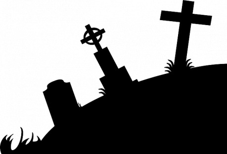

## Kapitola 1.

## Burnsova hrobka

V malé vesničce Mainville bylo poledne a kolem Burnsova hrobu stála smutná skupina lidí. Joseph Burns byl mrtev; umíraje dal tento podivný příkaz: „Než mé tělo uložíte do hrobky, upusťte tuto kuličku na zem na místě označeném písmenem A.“ Pak podal malou zlatou kuličku faráři. Lidé jeho smrti velice litovali. Když pohřeb skončil, farář, pan Dobson, řekl: „Přátelé, nyní splním poslední přání zesnulého.“ Po těchto slovech vstoupil do hrobky, aby položil kuličku na místo označené A. Pohřební společnost začala být brzy netrpělivá a právník pan Cha´s Greene vstoupil dovnitř, aby to tam prohledal. Brzy vyšel ven s vyděšeným výrazem v tváři a pravil: „Pan Dobson tam není!“

## Kapitola 2.

## Tajemný pan Bell

Bylo půl třetí odpoledne, když zvonek na dveřích Dobsonova sídla hlučně zazvonil a sluha, který přistoupil ke dveřím, tam našel postaršího muže s černými vlasy a licousy. Ptal se po paní Dobsonové. Když k ní byl uveden, řekl: „Paní Dobsonová, vím, kde je váš otec, a za 10 000 liber vám ho přivedu. Jmenuji se pan Bell.“ „Pane Belle,“ odvětila paní Dobsonová, „prominete mi na okamžik, když se vzdálím?“ „Zajisté,“ řekl pan Bell. Za chvíli se vrátila a pravila: „Pane Belle, já vám rozumím. Vy jste mého otce unesl a držíte ho kvůli výkupnému.“

## Kapitola 3.

## Na policejní stanici

Bylo půl čtvrté odpoledne, když prudce zazvonil zvonek na policejní stanici v North Endu a telefonista Gibson se zeptal, co se děje. „Zjistila jsem, jak je to s otcovým zmizením!“ odpověděl ženský hlas. „Jsem paní Dobsonová a otec byl unesen. Pošlete Kinga Johna!“ King John byl slavný detektiv ze západu. V té chvíli přiběhl nějaký člověk a vykřikl: „Hrůza! Pojďte na hřbitov!“

## Kapitola 4.

## Západní okno

Nyní se vraťme do sídla Dobsonů. Pan Bell byl poněkud zaražen jasnou klidnou řečí paní Dobsonové, ale když se vzpamatoval, řekl: „Nemluvte tak, paní Dobsonová, protože...“ Tu ho přerušil příchod Kinga Johna s revolvery v rukou, který zatarasil vchod. Bell se vrhl k západnímu oknu rychlostí blesku – a skočil.

## Kapitola 5.

## Tajemství hrobky

Nyní se vraťme na stanici. Když se rozčilený návštěvník poněkud uklidnil, mohl vypovědět svůj příběh jasněji. Uviděl na hřbitově tři muže, kteří volali: „Belle, Belle! Kde jste, starouši?“ Chovali se velmi podezřele, proto je následoval a oni _vstoupili do Burnsovy hrobky!_ Šel za nimi dovnitř, a když se dotkli nějakého pera na místě označeném „A“, zmizeli. „Kdyby tu tak byl King John,“ řekl Gibson. „Jak se jmenujete?“ „John Spratt,“ odpověděl návštěvník.

## Kapitola 6.

## Hon za Bellem

Vraťme se znovu k Dobsonovu sídlu: King John byl překvapen Bellovým náhlým útěkem, ale když se vzpamatoval, první jeho pomyšlení bylo únosce chytit. Vystopoval ho na nádraží a zjistil ke svému zděšení, že Bell chytil vlak do Kentu, velkého města na jihu, mezi nímž a Mainville neexistovalo žádné telegrafické ani telefonní spojení. Vlak právě vyjel!

## Kapitola 7.

## Černoch Hackman

Vlak do Kentu vyjel v 10.35 a kolem 10.36 vtrhl na mainvillské stanoviště drožek rozčilený, uprášený a unavený muž, který požádal černého kočího, stojícího u dveří: „Když mě vezmete do Kentu za 15 minut, dám vám dolar.“ „ To nepude,“ vzpouzel se černoch. „Nemám pořádný koně a vůbec...“ „Dva dolary!“ zvolal cestující, jímž nebyl nikdo jiný než King John. „Tak jo,“ řekl kočí.

## Kapitola 8.

## Překvapený Bell

Bylo jedenáct hodin v Kentu a všechny krámy byly zavřené kromě jednoho sešlého špinavého malého krámku na západním konci. Nalézal se mezi kentským přístavem a nádražím u trati mezi Kentem a Mainvillem. V přední místnosti spolu rozmlouvali chudě oblečený člověk nejistého věku a žena středních let s šedými vlasy. „Svolil jsem, že to udělám, Lindy,“ řekl. „Bell přijede v 11.30 a vůz je připravený vzít ho do přístaviště, kde odplouvá dnes večer loď do Afriky.“

„Ale co když přijede King John?“ ptala se žena.

„Pak je s náma ámen a Bell bude viset,“ odpověděl muž.

Tehdy se ozvalo zabušení na dveře. „Vy jste Bell?“ ptala se Lindy. „Ano,“ zněla odpověď. „Chytil jsem vlak v 10.35 a King John tam zůstal, takže je to olrajt.“ V 11.40 se společnost dostala do přístavu a v temnotě uviděli tyčit se loď. Na boku měla napsáno „Kehdive of Africa“, a zrovna když se chtěli nalodit, vystoupil z temnoty muž a řekl: „Johne Belle, zatýkám vás ve jménu královny.“

## Kapitola 9.

## Soud

Nastal den soudu a dav lidí se shromáždil kolem lesíka (kde se v létě pořádaly soudy). Chtěli vyslechnout soud s Johnem Bellem obviněným z únosu. „Pane Belle,“ zeptal se soudce, „jaké je tajemství Burnsova hrobu?“

„Řeknu vám tolik,“ odpověděl Bell, „když vejdete do hrobky a zmáčknete jisté místo označené písmenem A, tak uvidíte.“

„No a kde je pan Dobson?“ zeptal se soudce. „Tady!“ ozval se hlas za nimi a _postava pana Dobsona samotného_ se tyčila ve dveřích.

„Jak jste se sem dostal?“ zvolal celý zástup.

„To by byla dlouhá historie.“

## Kapitola 10.

## Dobsonův příběh

„Když jsem sešel dolů do hrobky,“ vyprávěl Dobson, „byla všude tma, nic jsem neviděl. Nakonec jsem uviděl písmeno A napsané bíle na onyxové podlaze, a tak jsem na to písmeno hodil kuličku – okamžitě se otevřely padací dveře a vyskočil z nich nějaký muž. Byl to tenhle muž,“ řekl a ukázal na Bella, který se třásl na lavici obžalovaných. „Ten mě stáhl dolů do přepychově osvětleného a zařízeného bytu, kde jsem žil až doteď. Jednoho dne přiběhl nějaký mladík a vykřikl: „Tajemství je prozrazeno!“ A byl pryč. Mne neviděl. Jednou nechal Bell klíč položený bez dozoru, takže jsem si ho otiskl do vosku a příštího dne jsem brousil klíč tak, aby se hodil do zámku. Dalšího dne už klíč zapadl do zámku a den nato (což je dnes) jsem utekl.“

## Kapitola 11.

## Tajemství je odhaleno

„Proč vás zemřelý J. Burns žádal, abyste v hrobce položil na A onu kuličku?“ zeptal se soudce. „Aby mě dostal do neštěstí,“ odpověděl Dobson. „On a Francis Burns, jeho bratr, proti mně intrikovali po léta, ale neměl jsem tušení, jakým způsobem mi chtějí ublížit.“ „Zatkněte Francise Burnse!“ vykřikl soudce.

## Kapitola 12.

## Rozluštění

Francis Burns a John Bell byli posláni do vězení na doživotí. Pan Dobson byl srdečně přivítán svou dcerou, která se mimochodem stala ženou Kinga Johna. Lindy a její společníci byli posláni do věznice v Newgate na třicet dní jako pomocníci zločinného útěku.
