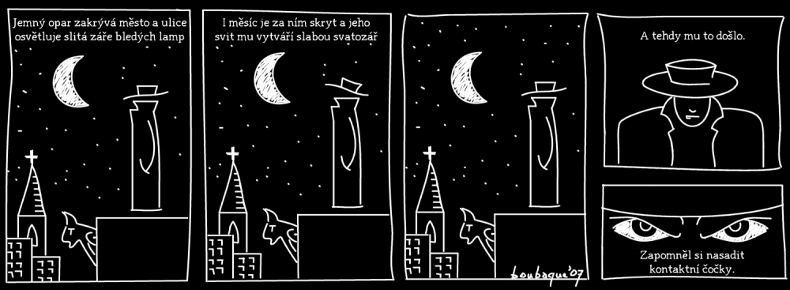

## 4 otázky na autora

__Jak vznikl Bezejmenný hrdina?__

Kdysi jsem podle kamarádových scénářů vytvořil asi tři stripy pro webovou verzi jednoho studentského časopisu. Tehdy jsem si řekl, že vytvořím také něco podle svého vlastního scénáře a vkusu – a po několika skicách, které původně zobrazovaly noirového detektiva v baloňáku a klobouku, vznikl Bezejmenný hrdina na vrcholu činžovního domu s chrličem jako aluze na Batmana držícího stráž nad Got­hamem. První čtyři díly pak vznikly v záchvatu kreativity zřejmě v růběhu září 2007. Proč ale tehdy, už vůbec netuším.

__Proč je Bezejmenný hrdina bezejmenný?__

Protože není důležité jméno, ale jeho hrdinské činy. A protože je tajemný a se jménem by o část své tajemnosti přišel. Je zahalený od hlavy k patě a nikdo nezná jeho pravou identitu, může to být kdokoli! A také proto, že lidé ve městě, nad kterým bdí, zatím neměli důvod ho pojmenovávat. Ale hlavně je bezejmenný proto, že je to nevýznamný člověk z lidu, který vede dvojí život – jeden stejně nudný jako ten druhý.

__Jací jsou tví oblíbení comicsoví tvůrci? Máš nějaké vzory?__

Já vlastně nejsem nějak velký comicsový fanoušek. Jasně, mám comics rád a nepohrdnu jím, ale jediný, který si pravidelně kupuji, je [Usagi Yojimbo](http://www.crew.cz/vydali-jsme-detail.php?id=558) (o antropomorfním králičím samuraji). Ale hlavní inspirací, i když to možná není vidět, je [Red Meat](http://www.redmeat.com/), hlavně stripy s postavou Earla. Jinak jsem míval ještě rád krátké, úderné, i když možná trochu dětské comicsy [Ondřeje Sekory](http://www.comicsdb.cz/comics.php?id=256 ) a dnes mám v záložkách asi 10 webcomicsů, např. [Buni](http://www.bunicomic.com/), [PhD comics](http://www.phdcomics.com/), [XKCD](http://www.xkcd.com/&#xd;), [Station V3](http://www.stationv3.com/&#xd;) a z českých [Korektor](http://korektor.webcomic.ws/&#xd;) a už jen zřídka publikující [Bugemos](http://bugemos.com/).

__Proč nepoužíváš ve svých stripech s Bezejmenným hrdinou přímou řeč?__

Zčásti právě proto, že vznikl na noirové myšlence i s žánrovým voice-overem a vyjadřování spíše myšlenek postavy, zčásti proto, že si můžu mimo přímou řeč víc vyhrát s patosem a ironií. No a taky proto, že Bezejmenný hrdina se vlastně nedostává s nikým do kontaktu. Když tak nad tím přemýšlím, docela dobře hrdinova mlčenlivost koresponduje s jeho vnější pasivitou. Původně jsem ale chtěl z Bezejmenného hrdiny vytvořit skutečný, několikastránkový comics s trochu plastičtější kresbou – ostatně náznak je vidět ve druhém dílu. Po několika nepovedených pokusech jsem od toho upustil.

### Díl I. Příležitost

### Díl II. Jemný opar

