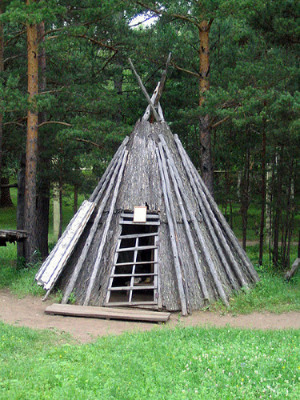
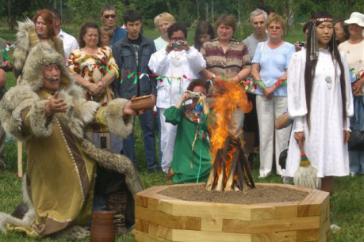

Pro začátek se lehce zmíníme kdo vůbec tito obyvatelé Sibiře jsou. Velmi zjednodušeně můžeme říct, že se povětšinou jedná o původně nomádské či polonomádské národy obývající Sibiř a spadající do jedné z následujících etno-lingvistických skupin – altajské, uralské, paleosibiřské a jenisejské (dené-jenisejská jazyková rodina). Antropologicky se řadí k mongoloidní rase. Milovníky Divokého západu možná příjemně překvapí, že původní Američané a sibiřské národy jsou vzájemně spřízněny. Šedá je však teorie, a proto zanechme národopisných rozborů a pojďme se podívat na způsob života, kulturu a náboženské představy a šamanské praktiky původních Sibiřanů.

### Mimo tajgu...

V některých oblastech, kde neprostupná severská divočina – tajga – ztrácela svůj lesnatý charakter a přecházela ve step mohli být sobi nahrazeni koňmi, jako tomu bylo u Jakutů, popřípadě dvouhrbým velbloudem, což byl případ Burjatů. U důležitých vodních toků, ať už jezer či řek, žily zcela usedlé rodiny živící se pouze rybařením, lovem a do jisté míry zemědělstvím – mimo jiné i pěstováním tabáku.

## Způsob života původních obyvatel Sibiře

Již v úvodu bylo zmíněno, že pro sibiřské národy byl typický kočovný, nebo polokočovný způsob života. Konkrétní způsob obživy se mohl u jednotlivých etnik a kmenů lišit, v zásadě však hrál hlavní roli chov sobů a lov či rybaření. Se stády se putovalo dvakrát do roka – v zimě do loveckých teritorií a v létě na pastviny do úrodných nížin. Se svými stády byli kočovníci schopni urazit relativně rychle velké vzdálenosti. Běžně využívali lyží a sněžnic. Sobi poskytovali mléko a do jejich kůží se kočovníci odívali. Mimo jiné se sobi běžně využívali pro přepravu nákladu, ale i jako jezdecká zvířata, což může znít trochu kuriozně (jsem zvědav, kdy se v různých bestiářích objeví první návrhy sobí kavalerie). Pro jízdu na sobech měli zvláštně uzpůsobená sedla, nevyužívali však třmenů.

## Pastevectví

Sobí stáda byla hlavním zdrojem obživy sibiřských pasteveckých populací a není proto divu, že sob byl uctívaným a respektovaným tvorem. O poutu pastevců a jejich sobů vypovídá i výraz „Děti slunce“, kterým označovali Evenkové malá sobí telata. Každá rodina nebo klan vybíraly ze svého stáda posvátného soba, jehož uctívaly jako ochránce rodiny – výběru vhodného kusu byla věnována náležitá pozornost a celý proces měli na starosti jen ti nejváženější členové rodiny, popřípadě šaman. Sobi v představách pastevců doprovázeli své pány i na cestě posmrtným životem. Velikost sobích stád se mohla lišit, ale obvykle čítala okolo __20–30 kusů na jednu rodinu__. Navzdory tomu, že konzumaci sobů z vlastního stáda se pastevci zcela logicky vyhýbali, lovu jejich divokých soukmenovců se nijak nebránili.

### Jak se stát šamanem?

U Evenků se často šamanské schopnosti dědily – duše zemřelého šamana „kontaktovala“ žijícího příslušníka rodiny. V podstatě však k získání šamanských dovedností stačilo mít vizi, tj. mít vidění světa duchů a dostat se myslí mimo náš čas a prostor. Během tohoto prvního kontaktu – „iniciace“ – šaman získal svého hlavního ochranného ducha, který si jej zvolil za svého služebníka.

## Bydlení a rodinné vztahy

Co se bydlení týče, opět můžeme najít u jednotlivých etnik dílčí rozdíly, ale pro zmíněný polonomádský způsob života byly typické různé stany – tzv. _čumy_ vyrobené ze sobích kůží, popřípadě z březové kůry. Tyče tvořící kostru stanu se většinou nepřenášely, ale nechávaly se na místě – uchovávala se jen krycí plachta. Sibiřané byli monogamní a svatby byly vesměs předem dohodnuté a samotnému obřadu předcházela dlouhá vyjednávání. Základní jednotku pak tvořila rodina s klasickým schématem muž – žena – několik dětí. Více příbuzných rodin pak utvoří kmen/klan. Každá rodina či kmen měly svého duchovního patrona (u Evenků typicky z ptačí říše), jehož si různě předcházeli a dávali mu drobné obětiny. Ve velké úctě byli i duchové předků, kteří měli uvnitř _čumu_ vyhrazené malé místečko či oltářík s obětinami.

## Odívání

Běžný chovatel sobů se odíval do lehkého oděvu ze sobí kůže, obut pak by do mokasínů – v zimě přidal teplý kabát a mokasíny nahradil vyšším typem bot připomínajícím klasické sněhule. Hřejivá sobí srst je dutá díky čemuž je lehká a perfektně izoluje – ne nadarmo si po setkání s původním obyvatelstvem polárních krajů pořídil sobí kožich i Roald Amundsen. Z doplňků jsou nezřídka k vidění slavnostní čelenky z korálků, náušnice a náramky.

## Obchod

Obchod probíhal až do kontaktu s Rusy v 17. století pouze formou barteru – tedy přímé směny zboží za zboží. Řemeslníci jako samostatná třída v podstatě neexistovali – šaty, boty, popřípadě nástroje si opravoval každý, jak uměl, typicky to byla starost žen (přestože se peníze nevyužívaly, neznamená to, že takový hezky blýskavý stříbrňák by dobrodruzi nemohli směnit např. jako náušnice či ozdobu pro paní domu, v tomto případě tedy spíš stanu, atd.).

## Náboženství

Náboženství obyvatel tajgy bylo animistické – uctívala se zvířata, ale i rostliny, popřípadě hory, mohutné toky apod. Duchové předků hráli v náboženském životě aktivní roli a šaman se k nim nezřídka obracel se žádostí o pomoc a ochranu. Zaměříme na náboženský život Evenků a Jakutů, kteří perfektně naplňují představu polonomádských chovatelů-lovců žijících v tajze (pozn. pokud není zmíněno jinak, pak je názvosloví jakutské).

Evencké a jakutské představy o světě jsou velmi podobné – vesmír se dělil na tři části – horní (Nebesa), prostřední (Země) a dolní (Podsvětí). Tyto světy podle nich obývali rozliční duchové, kteří mohli lidem pomáhat nebo škodit v závislosti na jejich povaze či okolnostech. Za komunikaci s duchy byl zodpovědný klanový šaman – o nich si více povíme dále v článku.

__Horní svět__ se skládal z Horních nebes, sídla dobrých duchů a jejich vládce Nebeského bílého náčelníka. Nebeský náčelník a jemu podřízení dobří duchové lidem všemožně pomáhali a byli spojování s plodností, sluncem a dalšími všeobecně kladnými a příjemnými aspekty lidského života. Právě k němu se obracejí „bílí šamani“ se svými prosbami a žádostmi. Spodní Nebesa jsou domovem zlých duchů, zjevujících se obvykle v různých ptačích či zvířecích podobách, a jejich vládce – Boha bouří a blesků. Ten je zároveň patronem „černých šamanů“, kteří od něj čerpají svou moc. Duchové spodních nebes přicházejí nejčastěji v sedmičlenných skupinách a jsou původci nemocí. Jejich apetit spolehlivě zasytí lidská pečínka – jsou to obávaní lidožrouti.

O __Prostřední svět__ se lidé dělí s přírodnímy duchy, kteří chrání zvířata a rostliny. Evenkové i Jakuti se chovali k přírodě uctivě a s respektem – rozhodně nechtěli rozzlobit přírodní síly a jejich patrony. Zároveň do našeho světa pronikají démoni _Abaasy_, kteří se zdržují na místech, kde se udála neštěstí, popřípadě v okolí hřbitovů a číhají na zbloudilé lovce a neopatrné pocestné. _Abaasům_ se pak do cesty staví hrdinové, o jejichž činech vypráví po celé rozlehlé tajze potulní pěvci. Recitace eposů popisujících boje hrdinů a démonů mohla zabrat i hodiny a jejich kolektivní přednes byl populární součástí oslav a společenských setkání.

V __Podsvětí__ nalezneme jednak druhou podskupinu zlých démonů _Abaasů_, tak i duše zemřelých lidi. Démoni podsvětí by již více odpovídali naší představě démonů. Jsou chlupatí, černí a pokroucených tvarů. Někdy jsou zobrazováni jako jednoruké, jednooké bestie, jež jezdí na dvouocasých dracích. Aby toho nebylo málo, jsou ještě horší než jejich nebeští příbuzní – nijak netroškaří a sesílají na lidi celé epidemie a obecně závažné nehody a neštěstí. Na povel je má samotný vládce Podsvětí – zlý obr se šesti rukama.

### Šamanské školy

Postupem času se mezi šamany vyčlenily dvě podskupiny, jež zastávaly v rámci klanu rozličné úkoly:

- __Bílí šamani__ – tito šamani byli především věštci a kněží, právě v jejich režii byl náboženský život a ceremonie uvnitř společnosti. Náboženská a věštecká role u nich tedy převažovala nad rolí léčitele a byli to oni, kdo ovlivňoval nálady a morálku uvnitř kmene nebo klanu. Pouze bílí šamani dokázali komunikovat se samotným vládcem Horních oblak.
- __Černí šamani__ – ač by se dle názvu mohlo zdát, že zastávali pouze negativní roli, není tomu tak. Jejich doménou obecně byl život a smrt. Zaměřovali se na komunikaci se zlovolnými duchy, což znamená i ochranu před nimi. Byli to právě černí šamani, na jejichž bedrech spočívala starost o zdraví soukmenovců. Pokud člověka trápil neduh, se kterým si neporadil místní bylinkář či bába kořenářka, pak byl černý šaman ten, koho člověk žádal o pomoc. Černými šamany se prý stávali jedinci, kteří během svého prvotního kontaktu se světem duchů měli vizi, ve které byli napadeni a rozsápáni smečkou Abaasů. Nejmocnější z nich si nárokovali schopnost nejen s Abaasy komunikovat, ale i je přímo ovládat a rozkazovat jim.

## Šamanismus

Za komunikaci s duchy a ochranu před démony byl zodpovědný _šaman_ – slovo samotné je evenckého původu a takový šaman v sobě spojoval úlohu kněze, věštce a léčitele (ne každý bylinkář či léčitel však musel být šamanem!). Tato funkce mohla být zastávána jak muži, tak i ženami – ženské šamanky nebyly nijak neobvyklé.

Pro komunikaci s duchy a Bohy využívali šamani různých postupů, aby si navodili stav tranzu. Obvyklou cestou bylo monotónní bubnování doprovázené různými rytmickými nápěvky, popřípadě hluboká meditace a soustředění. Jako podpůrný prvek pro dosažení transu a kontaktu s duchy byl využíván i tanec.

Mezi šamanské artefakty patřila maska šamanova ochranného ducha, kterou si šaman nasazoval, ale především to byl šamanův _buben_. Buben byl pro šamana zcela nezbytnou pomůckou, protože sloužil nejen jako brána skrze kterou se dostával mimo náš svět, ale zároveň jako jakási kotva, díky které dokázal najít cestu z jiných světů zpět do svého těla. Duše šamana, kterému někdo vzal buben, zatímco byl mimo náš svět, tak mohla být navždy ztracena a již nikdy nenajít cestu zpět do svého těla.

## Sociální postavení šamanů

Paradoxem je, že šamani patřili mezi nejchudší příslušníky klanu. Jejich šamanská profese je vytěžovala natolik, že neměli dostatek času na lov popřípadě chov vlastních sobů či koní a byli tak odkázáni na dary a příspěvky od ostatních příslušníků klanu. Naštěstí byli šamani velice váženými osobami, a tak o obětiny povětšinou nebyla nouze, nicméně jejich osobní majetek býval velmi skromný.

## Šamanismus v praxi

Šamané prováděli mnoho rituálů, například:

Rituál __„Krmení/Sycení ohně“__ – velmi populární rituál, který se obvykle odehrává na břehu řeky. Šaman, popřípadě stařešina rodu při něm žádá říční duchy a další místní entity o hojnost potravy a prosperitu pro svůj klan. Přízeň duchovních bytostí si snaží zajistit obětinou ve formě tučného kousku masa, který přiloží na oheň, jenž byl pro tuto příležitost založen.

__Singkelevun__ – Evencký __lovecký rituál__ – původně trval až 8 dní a šaman si v něm vypomáhal panenkou z vrbového proutí představující lovené zvíře, povětšinou losa. Cílem rituálu bylo „ulovit“ duši zvířete a tím zajistit lovcům směřujícím do divočiny bohatou kořist. Magický proces doprovázeli rituální kruhové tance – v podstatě klasické kolečko, které známe i z našeho folkloru.

__Očistný rituál__ – tento rituál, jenž je součástí oslav nového roku, se provádí k očistě osoby od neštěstí a nepřízní osudu, které ji v minulosti postihly. Před zahájením samotného obřadu je vyrobena a vztyčena nebo zavěšena soška z modřínového dřeva. Poté je vedle sošky zapálen oheň, jehož kouřem pak dva obvykle starší a vážení jedinci „očišťují“ účastníky rituálu. Jakmile dojde k očištění kouřem, každý účastník rituálu projde pod soškou nebo ji přeskočí (v závislosti na jejím umístění). Soška je sundána na zem, její nohy jsou obvázany kusem provazu a je uložena na předem připravené místo. Pokud se rituál vykonává mimo oslavy nového roku (tedy za účelem uzdravení nemocného), pak je soška na konci celého obřadu spálena.

## Sibiřské národy v průběhu historie...

Kontakt s ruskými osadníky a kolonizace Sibiře vnesly do životů sibiřských etnik nenávratné změny. Stejně jako u amerických Indiánů nebo Maorů, i zde se začal rozmáhat alkoholismus a docházelo k více či méně násilnému usazování původního obyvatelstva. Nomádský způsob života byl opouštěn a nově usazení Sibiřané pomalu, ale jistě začali ztrácet povědomí o vlastní kultuře, což spolu s christianizací vedlo ke kulturní i jazykové asimilaci do ruského prostředí. Spolu s Rusy a ostatními národy si pak prošli všemi peripetiemi carské i sovětské éry a i na nich se dějiny „vyřádily“. V současnosti tvoří původní etnika zhruba 10% obyvatel celé Sibiře a mimo území Ruské federace obývají i Čínu a Mongolsko – nutno dodat, že jejich osudy zde mnohdy nebyly o nic růžovější. V článku se hovořilo většinou o Jakutech, Evencích, popřípadě Burjatech, ale Sibiř obývala celá řada národů, jejichž populace se odhaduje od několika desítek tisíc (Korjaci) po několik set jedinců, jako je tomu například u Čulymů (Chulymů).

Pro bližší informace doporučuji _Červenou knihu sibiřských národů_, která je dostupná na webu [The Red Book](http://www.eki.ee/books/redbook/introduction.shtml). Příznivcům přírody, dobrodružství a kinematografie pak doporučím snímek [Děrsu Uzala](http://www.csfd.cz/film/5420-dersu-uzala/) od Akiry Kurosawy, z novějších pak film Kesin, popřípadě dokument [Happy People: A Year in Taiga](http://www.csfd.cz/film/283291-stastni-to-lide-rok-v-tajze/). Z česky psané literatury by to byl román _Ve stínu kozácké šavle_ od Ondřeje Pivody nebo některé z děl Pavlíny Brzákové.
