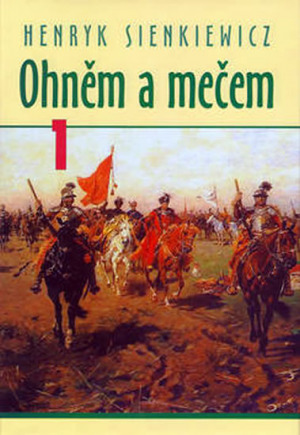
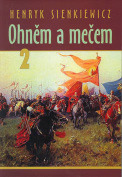
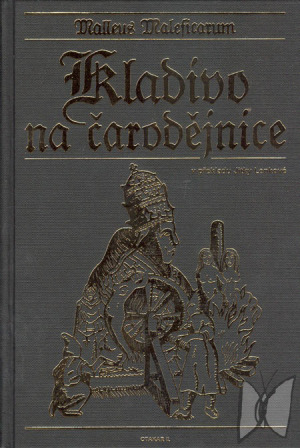
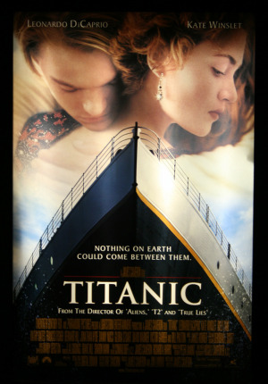
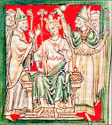
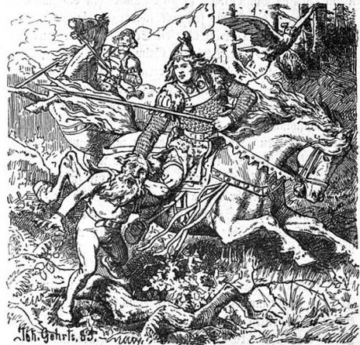

## I.

Historický román byl symbolem úctyhodné nudy.

Historická pojednání mívala strašnou spoustu stran; ať u Lva Tolstého, nebo u Jiráska, vždy to byla respekt vzbuzující baterie tlustých knih. Na nějakou tu stranu se nehledělo. Než baronka něco řekla, bylo to uvedeno dlouhým popisem interiéru, exteriéru i samotné baronky. Totiž hlavně jejího oblečení; svlečených baronek bylo k vidění žalostně málo. No, a když baronka konečně něco řekla, byla to nějaká společenská prázdná jalovost; rozhodně by se neslušelo, aby se šlo rovnou k jádru věci. Prohodilo se pár poznámek o poměru paní baronky k hraběti D., k panu arcibiskupovi a pochopitelně ke králi. I když D., král ani arcibiskup v příběhu nevystupují; ale znáte je ze školy a mohli byste se po nich ptát. A pokud se neptáte, stejně vám to autor řekne.

Ve chvíli, kdy se už chcete z nudy oběsit na hedvábné šňůře, visící z baldachýnu barončiny postele, stane se zázrak a konečně se dozvíte, co chtěl vědět náš hrdina, když do toho zámku lezl před třiceti stranami.

„Ne! Nikdy!“ vzkřikne baronka a tvář jí pokryje ruměnec.

## II.

Předpokládám, že patříte ke generaci, která tyto zážitky už nemá; a v dálce se tyčící hradby Jiráskových monstrknih obcházíte v bezpečné vzdálenosti. Co taky s tím. Příběh, který byste nakonec vyčetli, určitě znáte z několika filmových adaptací, kde polovina z nich lépe vystihuje podstatu doby, druhá polovina je zábavnější a hlavně jsou všechny tři poloviny mnohem rychlejší. Nesežerou vám měsíc čtení, jen dvě a půl hodiny koukání.

Výsledkem je, že to vlastně nikdo nečte. _Vojna a mír, Ohněm a mečem, Joseph Balsamo, Proti všem, Židovka z Toleda,_ všechno marno; pokud někdo chce vědět, o čem to bylo, sáhne po wikipedii a hotovo. Že by se snad někdo smiloval nad _Třemi mušketýry_? Ale kdeže, nesmiluje. Všem stačí ty zfilmované verze; že by to někdo četl, to ani pomyslet. Jo, já jsem u _Tří mušketýrů ještě po deseti letech_ taky odpadl, doznávám.

Historický román tohoto druhu nejenže vypráví o minulé době, ale často byl i docela dávno napsán. Zmínění autoři patří tak nějak k 19. století; buď k jeho časným začátkům, jako třeba Walter Scott nebo Victor Hugo, nebo alespoň k jeho konci, jako ten Jirásek. Jejich spřízněnost je očividná. Jsou to romantici v nejpůvodnějším smyslu; děti bláznivé doby, která dostavovala gotické katedrály a hrála si na rytíře.

Takže tady je první motiv, co je hnal do historie; __romantické nadšení__. Vlající korouhve, barevné štíty, rytíři na koních, lámající kopí pro srdce krásných dam. Nebo šviháci elegantně šermující kordem. Tohle tam prostě je, ve všech případech. I když se Tolstoj noří pouze do napoleonských válek, které pro něho nejsou až tak dávné, i když Walter Scott sahá jen do doby pro něho sotva sto let staré, přesto je všude patrný duch bojovníků, pro které je ztráta cti mnohem horší než tisíc smrtí a letmý úsměv dámy tou nejvyšší odměnou. Bez této zvláštní nostalgické lásky k dávnověku by to nefungovalo vůbec.

Romantické nadšení se velmi často týká __národního obrození__, kde pan Herder zapálil srdce Evropanů tím, že jejich národ je obzvláště hrdinný, ušlechtilý a skvělý. Bývali Čechové, zdatní jonáci. Taky samozřejmě Francouzi, pokud jde o Huga nebo Dumase, Skotové, pokud jde o Waltera Scotta, a tak dále. Vzorec je jasný – naši jsou frajeři, kdežto ostatním národům zbývá úloha padouchů. Když bitva, tak zejména taková, kterou naši slavně vyhráli.

Podobný a velmi setrvalý motiv je __zlatý věk__. Ono to dříve bylo vůbec nějaké lepší, barevnější, tráva zelenější a holky krásnější. Oblíbený nápad už v Bibli. Středověk tomu věřil dost masově – _jó, to tehdá, to bývali rekové, kdežto dnes svět spěje k zániku._ Tolkien, mimochodem, toto ze středověku automaticky přejal. Za starých dob u něho byla z balrogů rovnou vojska, pavouci byli drsnější a hrdinové hrdinštější. Nejspíš to celé není pravda; ale tento motiv zdaleka není mrtvý. Nadšení pro šermující rytíře je dost nezničitelné.

__Bída a ruce usekané.__ Tak bylo řečeno trefně o Warhammeru; ale tento opačný princip proti předchozímu je docela rozšířený a u mnoha moderních vypravěčů 20. století začal naprosto převažovat. Samotná myšlenka pokroku odsuzovala historii do podřízeného postavení. Ve středověku byli samí blbci, nemyli se a upalovali čarodějnice. Lecjaký autor chtěl takto demonstrovat nekonečnou nadřazenost věků novějších. Nebo pokud byl kritický i k dnešku, pak naznačoval, že _to je dnes hrozné jako ve středověku_, jako třeba Kaplický v románu _Kladivo na čarodějnice._

Ale ono to má ještě jednu variantu, o hodně aktuálnější. Když chce být autor sadistický, například podle Vonnegutova pravidla nebo podle mého pojednání [Proč horror](http://drakkar.rpgplanet.cz/uvaha/proc-horor), pak mu k tomu dávají staré věky značné možnosti. Moderní věk málokdy umožní hrdinovi vzít do ruky sekeru a jít zavraždit souseda, protože obvykle vzniká otázka, co na to policie a zákon. Pokud chceme vyprávět strašně temný příběh ze strašně drsných dob, stačí vyprávět třeba o dobách nájezdů Vikingů, kdy přifrčeli neznámí banditi, vyřezali pokojným občanům orly do zad a zase zmizeli.

Ale v 19. století najdeme ještě další veledůležitý motiv historické fikce. Čtenáře je totiž zejména nutno __poučit__; pan učitel Jirásek si bere ukazovátko a na stupínku ukazuje žákům, jak to tenkrát celé fungovalo. Ono to není jenom romantické; ono je to jedním dechem také vědecké. Odtud ta šílená láska k maniakálním popisům, odbočkám, výkladům a vysvětlivkám. A vedlejším postavám, které jsou v ději dokonale zbytečné. Podotýkám, že to je pokus překročit hranici umělecké fikce a vytvořit něco víc; dosáhnout, aby tam fikce byla zároveň reálnou učebnicí. To, co se dnes nazývá _edutainment_.

__Usnadnění fikce.__ Toto je daleko rafinovanější motiv, dodnes velice aktuální. Lze snáze tvrdit neuvěřitelné věci, které se staly někdy strašně dávno, neb to málokdo zkontroluje. Proti fantasy nebo sci-fi, která obvykle děj odsune někam do vesmíru, si autor drží vysoký kredit uvěřitelnosti, protože _to je stále historie, takže se to doopravdy stalo._

Extrémní případ takového postupu jsou případy, kdy autor umístil vyprávění do tak pradávných věků, že o nich nevíme prakticky nic. Následně mohl tvrdit skoro cokoli, jako v té sci-fi nebo fantasy. R. E. Howard takto svoje příběhy o Conanovi označoval za velice dávnou historii. Další podobný případ je spisovatel o pravěku Eduard Štorch; tvořil příběhy stejně fantastické jako Karel May se svými Indiány, i když se stále pasuje za autora historické fikce.

Trochu jiným směrem využili tutéž výhodu autoři _rukopisů Zelenohorského_ a _Královédvorského_. Tam se text vydával dokonce za autenticky historický, i když to bylo vymyšlené od A do Z. O starých Slovanech u nás toho víme dodnes strašně málo, takže autor historické fikce leccos domýšlet přímo musí.

Ale i při využití historie již trochu známější, třeba raného středověku, stále ještě tato výhoda funguje. Autor musí respektovat reálnou historii, ale vlastně ho to tak moc nesvazuje. Osobně mne tato zvláštní výhoda historie okouzlila už hodně dávno. _Proč vymýšlet Středozemi, když ve Středozemi žijeme?_

__Zjednodušení.__ Toto je motiv ještě rafinovanější. Trvalo mi řadu let, než jsem ho pochopil. Moje oblíbená doba, středověk, je jádro, dřeň, podstata civilizace; všechno se redukuje na svůj prazáklad. Místo ministerstva a zemědělské politiky je z toho jeden snáze pochopitelný člověk. Místo průmyslové výroby jeden mlýn se dřevěným kolem. Místo strategického válečného plánování pár maníků s luky na kopci. Lze daleko snadněji dospět k tomu, co je podstatné a důležité. Nemusíme se zdržovat úřady, policií, mobilními telefony a dalšími nesmysly.

Vzorec historické fikce, živený porůznu všemi uvedenými motivy, býval mimořádně úspěšný, napodobovaný, ctihodný a neporazitelný. Autor se dožil nemalých poct a byl pohřben coby velký otec národa. Děti ve škole byly mučeny příšernými tresty, protože musely velikánovo dílo číst a byly z toho zkoušeny.

## III.

Až se to v moderním věku zadrhlo. Podobné věci se četly stále méně a také je lidé pomalu přestali psát. Historická beletrie se stala po delší dobu zvláštním okrajovým žánrem.

Hlavní díra v konceptu byla __věda__. Historické bádání urazilo za sto let od svého vzniku slušný kus cesty a všimlo si, že ne všechno, co tvrdili pánové Jirásek nebo Scott, se odehrálo přesně tak, jak tito pánové tvrdili. Problém nedosažitelnosti historie v rámci vyprávěcí fikce je zásadní objev. Část toho pěkně postihla třeba Vilma Kadlečková v článku [O historické fantasy](http://www.argenite.org/page-o-historicke-fantasy). Už náš jazyk se od minulosti beznadějně liší; beletristický historický román může odpovídat maximálně _překladu_ příběhu z minulosti. Máme jiné věci v hlavě, jiné vidění světa, jinou zkušenost. Čím exotičtější a vzdálenější je to minulost, tím výrazněji tyto obtíže před autorem vyvstávají. Od historie se neustále vzdalujeme a naše postoje se mění.

V důsledku toho nové verze starých příběhů nenápadně upravují původní hrdiny tak, aby byli přijatelnější. Takový Homérův Achilles se nejenomže miloval s mladíkem, což se ještě donedávna dětem tajilo, ale občas ze žalu – nebo naopak z radosti – nechal pár mladíků obětovat. To se už raději tají i čtenářům a divákům současným; myslím, že Brad Pitt by v tomto původním Homérově pojetí asi v Petersenově _Tróji_ moc neuspěl.

Mezi pojetím beletristické fikce, tedy uměleckým vyprávěním příběhu, a mezi pojetím verifikovatelného vědeckého poznatku se pomalu začala rozevírat propast.

Otázka reálnosti historické fikce má obraz i v trochu zmatené terminologii. Česky se celý žánr obvykle nazývá _historický román_, což má tu vadu, že se moc ani neuvažuje o možnosti, že by to byl kratší útvar. Anglicky se to jmenuje _historical fiction_, což zase Čecha strašně mate tou fikcí. Ale anglická _fiction_ docela přesně a důsledně odlišuje vše, co opravdu bylo, tedy literaturu faktu, od toho, co vlastně nebylo, tedy _fiction_, a tedy po našem _beletrie_. Jak pravil trefně Eleshar na RPGfóru:

> slovo fikce neznamená jen něco bohapustě vymyšleného. Fikce je téměř každý příběh, kromě přísně historicky doložených. Téměř bych to slovo pro praktické účely ztotožnil se slovem vyprávění.

Sousední pozice _historické fikce_ vedle _science fiction_ je tedy naprosto správná a logická, jen pro nás trochu nezvyklá; nás ovlivnil Jirásek, který měl ty učebnicově pedagogické ambice, nejen nějaké _vyprávění_. Jádro problému je hlubší, než si Jirásek uměl představit. Jakmile pustil na scénu jakoukoli vymyšlenou postavu, třebas i obyčejnou a malou, začal s historií manipulovat; měnil ji ve _fiction_. Pokud má pravdu Bradbury ve svém pojetí historie a jediný motýl změní průběh událostí, pak vlastně není malých postav a není žádných drobností. V takovém pohledu už není jasný rozdíl mezi Jiráskovým vyprávěním a příhodami Sherlocka Holmese. Z toho by asi Jirásek velkou radost neměl, protože celý jeho pedagogický nápad umělecké dějepisné učebnice je tím pohřben.

Pes je zkrátka zakopaný v tom, že pokud nepopisujeme čistou historii, a tedy vlastně literaturu faktu, nic více a nic méně, a pokud nepostupujeme podle nejlepších a nejpřesnějších poznatků vědy, pak to nic jiného než _fiction_ nikdy není. Anglický název je tedy zcela správný a já se k němu pokorně vrátil.

## IV.

Kromě toho se v pojetí historické fikce na Jiráskův způsob skrývá od začátku ještě jeden neřešitelný rozpor, mířící do samotné podstaty epického vyprávění. Příběh, jak jsme ho poznali v řadě různých podob – třeba v _příběhu o strašidle_ nebo v _detektivce_ – má tu vlastnost, že _nevíme, jak to dopadne._ To je jeden z hlavních důvodů, proč se tím čtenář vůbec zabývá. V tomto smyslu se řada historických románů opravdu spíše blíží literatuře faktu; __víme, jak to dopadne__; právě proto, že je to historická událost. Pokud napíšu román _Hus před koncilem Kostnickým,_ visí už v tomto nadpisu ohromný spoiler; každý ví, že ho nakonec upálili. Pokud zfilmuje Besson _Johanku z Arku_, konec těžko bude jiný. Pokud to bude bitva u Kurska, pak je pro Němce zbytečné se snažit – Rusové stejně vyhrají.

Nápad na příběh o tom, že _naši vyhráli bitvu_, je pro umělecké psaní příliš jednoduchý a nedostatečný. To nestačí ani na povídku. Chybí tomu jakékoli překvapení; ta další nutná zatáčka, _ozvláštnění_, o kterém psal Havel v _Anatomii gagu_ a já v [tomto pokračování](http://drakkar.rpgplanet.cz/zamysleni/intuice) série článků o příběhu. I v jednoduchém příběhu musí být nějaké ale, nějaké překvapení, nějaká zrada; naši vyhráli, ale jen proto, že jim vlastně pomohla protistrana, třeba.

Výhrada, popsaná v předchozím oddílu, potom tvoří s touto jakýsi neřešitelný dvojí chvat; _jako učebnice to nemá cenu, protože to z podstaty věci nemůže být přesná pravda. Jako vyprávění to nemá cenu, protože je konec známý dopředu._ Myslím, že tohle je jádro problému, proč se klasické historické romány dočasně vytratily ze scény.

## V.

A přece. Vědecky vyvrácené, tisíckrát přesetý písek, přesto historická fikce stále žije. Dokonce se zvláštním způsobem zadními vrátky vrací.

Jednu z úspěšných metod této důmyslné nekromancie lze předvést na případu _Titaniku_. Všichni ho známe; nepotopitelný parník, který se potopil; legenda mezi námořními katastrofami. Je to historická událost, o které se dá vyprávět. No, a tak se vyprávělo. [Mnohokrát](http://cs.wikipedia.org/wiki/Titanic). A lidé pokývali hlavou, vyslechli to a pak šli dělat něco jiného. Nikdy se to nedostalo ani mezi přední katastrofické filmy, jako bylo třeba daleko slavnější a zcela vymyšlené [Dobrodružství Poseidonu](http://cs.wikipedia.org/wiki/Dobrodružství_Poseidonu).

Až přišel James Cameron a stal se Pánem světa, jak je všeobecně známo.

Na první pohled je poměr Cameronova olbřímího úspěchu ve srovnání s ostatními výtvory nesnadno vysvětlitelný. Těžko to lze přičíst filmovým trikům, i když na svou dobu velkolepým. Takový efekt by vyšuměl za pár let. Nelze to ani připsat hvězdnému Di Capriovi a Winslettové, neb ti se hvězdami stali teprve díky tomuto filmu.

Jádro věci je v té očividné dvojmontáži dvou příběhů, pečlivém záznamu katastrofy a zamilované historce z červené knihovny. Vypadá to jako nesmysl a ty dva příběhy k sobě nijak nepatří, ale tahle symbióza se zajímavým způsobem vzájemně vyživuje. Například; je to historická událost, takže ještě před vstupem do kina víme, že se Titanik potopí. Jenže Rose a Jack jsou postavy historii neznámé, příliš malé na to, aby je někdo někde zaznamenal; takže vlastně nevíme, jak to s nimi dopadne. Kromě toho kombinace osudu Titaniku a osudu dvou malých postav dává věci jakýsi zajímavý vertikální rozměr. Člověk není schopen pochopit jeden a půl tisíce utopených lidí; ale chápe docela dobře jednoho nebo dva, kteří jsou mu nějak blízcí. Takže skrz obavy o ty dva najednou úplně jinak vnímáme i ty ostatní. Zkrátka, na předchozí Titaniky se dívalo také plno lidí, ale mnohem méně jich u toho brečelo.

A funguje to i v protisměru. Příběh Jacka a Rose je příšerně prostoduchý cajdák; Rosamunde Pilcherová, odpolední představení televize k žehlení; vyslechnout a zapomenout. Není to nijak moc objevné nebo výjimečné. Ovšem zasazeno do maniakálně pečlivých a reálných kulis historické katastrofy to je také najednou jinak; vidíme, že nebezpečí, které jim hrozí, je přímo biblických rozměrů; a hlavně, stále můžeme tvrdit, _že se to reálně stalo_.

## VI.

_Vnést do historie malou postavu, jakéhosi průvodce_, který už tak moc historicky věrný být nemusí – nebo je alespoň nedoložen – je přitom stařičký tah. Vlastně je to návrat k prapočátkům historické fikce, na které se už poněkud zapomnělo. Většinou známe tento nápad v podobě již trochu degenerované – Jirásek vytvářel například _typické hrdiny_, kteří měli typické chování a řešili typické problémy. Aby nám lépe pedagogicky zobrazil uvažování doby.

To stařičký Dumas nebo Walter Scott na to šli většinou jinak, blíže tomu Cameronovi. Takový vložený a vlastně historií neprokázaný hrdina mohl být naopak jedním z hlavních důvodů, proč kniha vznikla. Historická fikce tohoto typu je vlastně _příběh hrdiny na pozadí velké historie_.

Dokonce se šlo ještě dál než Cameron. Někdy ani příběh sám historický není, je zcela vymyšlený a nevíme, jak dopadne; reálná je jen ta historie v dálce. _Tři mušketýři_ jsou přesná ukázka. V pozadí si běží velká Jiráskovská historie; král Ludvík XIII. a kardinál Richelieu, kterého si díky románu každý pamatuje. K nim se odehrávají odpovídající události, například obléhání La Rochelle. Ale to nás moc nezajímá. Jádrem románu je zcela smyšlený romantický příběh o královně, jejím milenci a jejích věrných třech mušketýrech, kteří jsou, jak známo, vskutečnosti čtyři. Je to napínavé, zamilované a není divu, že se to s úspěchem recykluje stále znovu po stopadesát let. Vzájemná symbióza obou složek tu funguje stejně šťastně jako u Titanicu. Mušketýři by nedávali smysl a nemohli efektně šermovat za čest dámy, kdyby neměli odpovídající historický rámec. Historický rámec by byl bez mušketýrů totálně nudný a nikdo by si ho nepamatoval.

Třetí příklad podobného postupu je pro naše účely nejnapínavější.

Je jím román _Ivanhoe_ od Waltera Scotta, což je vlastně jedna z nejstarších historických fikcí vůbec. Dílo vzniklo už roku 1819, tedy ještě hodně před těmi Mušketýry. Autor tentokrát výjimečně nechal plavat pro něho ne až tak dávné Skoty z doby barokní a klasicistní a ponořil se do doby, kde je historie jenom velmi mlhavě naznačena. Vydal se tedy na trasu, kterou jsme si popsali jako _usnadnění fikce_.

Historie ví, že se král Richard I., zvaný Lví Srdce, vracel z třetí křížové výpravy domů do Anglie, když byl cestou zajat v Rakousku. _Po propuštění se v roce 1193_ [vrátil](http://cs.wikipedia.org/wiki/Richard_I._Lví_srdce) _do Anglie. V roce 1194 již vedl válku proti Francii._

Všech asi 500 stran děje se stihne někde uvnitř té stručné druhé věty v předchozím odstavci a před začátkem věty další. Pozorujeme to z perspektivy bratra Jana a jeho dost vykutálených normanských rytířů, vykreslených coby cizí okupanti, kteří si vládnou v Anglii podle svého a poněkud tam kradou. Král Richard a jeho návrat je pro ně velmi nepříjemný mrak na obzoru, o kterém není jasné, kdy a kde přesně udeří. Kromě historických postav tu jsou zlí Normani a utlačovaní Sasové, se kterými je o dost větší nuda. A také postavy další, již zcela vymyšlené, jako třeba titulní sir Wilfred z Ivanhoe.

A všichni, vymyšlení nebo historičtí, společně provádějí věci, o kterých nemá historie ani tušení. Lze doufat, že by se akční hrdina Richard I. mohl zaplést do obléhání hradu a turnaje, když by jel okolo, nebo že by jeho bratr zkoušel návrat bratra překazit. Historie nám ovšem takové události v ničem nepotvrzuje.

Už na velkolepém turnaji se to všechno s těmito skrytými motivy postupně popere a rozvine se stejně velkolepá šermovačka jako v těch mušketýrech. Historie nehistorie, hlavní je, že rytířové rytířují, korouhve se korouhví a krásné dámy jsou ušlechtilost sama. Trhák, jehož romantické vyznění se nikdy nikomu nepodařilo přenést na plátno. Dílo, které jaksi mimochodem a ve vedlejším plánu vytvořilo Robina Hooda tak, jak ho dnes všeobecně známe. Tento román je zřejmě z velké části odpovědný za následné pojetí historické fikce v 19. století; zakladatelské dílo, bez kterého by možná všichni tihleti Dumasové a Jiráskové buď nevznikli, nebo by alespoň psali dost jinak.

Osobně mne tahle věc zasáhla velice dávno. Určitě mne nadchli ti rytíři a vlající korouhve. Je ovšem také nutno přiznat, že je Ivanhoe román trochu užvaněný a kompozičně podivně vratký. Nebo vás asi zmate podivně nedomrlý hlavní hrdina vedle některých vedlejších postav. Nebo jak to prapodivně vrcholí největším dramatem uprostřed knihy a pak to tak nějak záhadně chcípne. Po tom obléhání snad zbytek ani nemusíte číst. Nebo autorova nezkrotná hravost, se kterou tvořil ty zábavné figurky zbojníků, která se tak tříští o sošnou pompézní nudu utlačovaných Sasů, co mají být čtenářovu srdci nejbližší, ale nějak nejsou.

Protože jsem v té době už zkoušel psát, ty evidentní vady mne zvláštním způsobem provokovaly, abych je zkusil opravit a napsat to jinak. Vyrobil jsem vlastní verzi, která na nějakou historii úplně kašle, protože hlavní je, že rytířové rytířují, korouhve se korouhví a krásné dámy jsou ušlechtilost sama. Vznikl můj nadlouho nejdelší text vůbec, taková novela; nikdy jsem to nevydal, nikomu to neukážu, neb je to samozřejmě mizerné. Ale tímto podezřelým výtvorem mne kdysi historie lapila a už nikdy tak úplně nepustila.

Asi o pět let později, někde přesně na tom klíčovém prahu k vlastnímu psaní, jsem spáchal text podstatně kratší a kvalitnější, který polovinou objemu ještě vězí v Palackém a Jiráskovi, ale zároveň se už v něm rýsují úplně jiné směry. Je uveřejněn v tomto čísle Drakkaru asi po 25 letech od prvního vydání v novinách, které mezitím už dávno neexistují.

## VII.

Celý výlet historickou fikcí by byl čistě osobní a obecně těžko využitelná záležitost, kdybych nedávno nezjistil, že se ten ústřední princip __nalezení správného poměru historie a fikce__ neustále ztrácí a znovu nalézá.

Kdysi na počátku vypravěči jako Homér předvedli v akci velkolepé hrdiny a vyprávěli děj, úžasný děj, který procházel tisícovkami veršů, potažmo stovkami stran. O věcech, které jsou vratce podloženy skutečnou historickou událostí, ale vyprávěním nabyly daleko kolosálnějších a zajímavějších tvarů.

Pak se na to nějak zapomnělo. Ale ne navždy; přišel středověk, a v něm se zrodili další vypravěči, kteří dali světu takové hrdiny jako _Dietrich von Bern_, _Beowulf_ nebo _King Arthur_. Rozeznat v tom zbytky historie dokáže jen nejbystřejší oko; devět desetin všeho je fikce, kopa napínavého děje a nějakého šermování. A kvetlo to a rostlo dál, hluboko do renesance, romány jako _Amadis Galský_, snad ze 13. století, který se dočkal asi deseti – nebo kolika – pokračování.

A pak se na to nějak zapomnělo a Cervantes se tomu posmíval; ale jen do toho příchodu Waltera Scotta, který měl zase na co navazovat.

No, a pokud tvrdím, že se na historický román znovu jaksi zapomnělo v době moderní a byl považován za odepsaný, tak to byl zase jen přechodný stav věcí, který už zase moc neplatí.

Za všechny třeba G. R. R. Martin, jeden z mistrů zcela současných. Ve _Hře o trůny_ je asi ve třetině knihy turnaj a hlavní hrdina je podivně nedomrlý, kdežto vedlejší figurky jsou mnohem zajímavější. Nemohu se zbavit dojmu, že se Martinovi stalo kdysi dávno úplně to samé co mně; četl román _Ivanhoe_ a pocítil potřebu to napsat malinko jinak. Podobnost konstrukce začátku obou románů je značná. A dokonce je to ještě víc užvaněné a kolosální než kdysi; než se propracujeme k tomu turnaji, kde se konečně začne něco dít, čekají nás tři stovky stran vzpomínek na dávné historie a spousta jalových řečí. Kdybychom vzali perexovou scénu tohoto článku a dosadili místo anonymní baronky lady Catelyn Starkovou a postel s baldachýnem nahradili lesem s čarostromy, nenajdeme podstatnějších rozdílů.

## VIII.

Smysl tohoto cyklického výletu historickou fikcí, který skončil přesně v místě, kde začal, je podivný a matoucí. Ona totiž historická fikce je podivná a matoucí. Na jedné straně je historická fikce vyvrácený a v principu nemožný nápad; tím, že je fikce, nemůže být historická a tím, že je historická, nemůže být fikce. Na druhé straně, starověcí hrdinové v sandálech a šermující rytíři stále fungují. V každé nové generaci se najde někdo, koho to nadchne.

Pokud bych chtěl dávat nevyžádané rady, jak se stalo tradicí, pak bych řekl, že:

1. _Historie vás nezbavuje povinnosti vymyslet příběh._ To, že Skotové vyhráli u Bannockburnu, to není příběh, nýbrž historická událost. _Příběh je to, co historie neví;_ třeba rozvíjení nápadu, že tam bojovali templáři, kteří uprchli Filipovi Sličnému z Francie... a možná měli templářský poklad... V příběhu pro literaturu i pro hru potřebujete _situaci_. Od ní se jakýkoli příběh odvíjí. Něco, co ohrožuje hrdiny, tlačí na ně, pronásleduje je; třeba zrovna Filip Sličný a jeho nohsledi.
1. _Milujte svoji historii._ Když ji budete studovat poctivě, odmění se vám zvláštním kouzlem věrohodnosti. Pokud proti sobě pustíte vymyšlené rytíře, bude to fajn. Ale pokud to uděláte s rytíři reálně existujícími, kteří mají reálná jména, reálné erby a reálné hrady, bude to lepší; _magie opravdových jmen, opravdových míst a opravdových událostí_ vtáhne všechny do věci daleko větší silou. A pátráním v příhodách rodu najdete lecjakou historku, která by vás možná nikdy nenapadla.
1. _Nepište Proti všem._ Tady prostě opisuji Hudského univerzální radu; doba se změnila, a akvarijní rybičky dlouho neudrží pozornost. _Každá scéna má posouvat děj či rozvíjet postavu,_ žádá Vonnegut. To, že jste nastudovali sto stran k historii Skotů, nutně neznamená, že je musíte čtenářům všechny vnutit. Když to budou chtít vědět, nastudují si to sami. Je podstatné se soustředit jen na detaily, které mají vliv na samotné vyprávění. Určitě jim nekažte pěkný souboj rytířů tím, že ho utopíte v nepodstatnostech. Z neznámých důvodů mají historické věci tendenci k užvaněnosti. Nutné to při tom není; existují i krátké a úderné příběhy, jako třeba Goldingova _Věž_, nebo Jiráskovo (!) _Z Čech až na konec světa_. Kompozice, přirozená délka vyprávění tu platí bezpodmínečně také.
1. _Využijte přirozenou sílu svojí historie._ Do středověku jste lezli proto, aby se rytíři mohli šermovat. Do Homérského starověku jdete kvůli meči a sandálům. Do renesance se jde kvůli elegantním švihákům a na divoký Západ kvůli pistolníkům, kteří ustřelí mouše levou přední nohu. Vaše publikum to tak trochu očekává. Pokud chcete něco jiného, jděte rovnou jinam.
1. _Neváhejte v pravý čas historii zradit._ Husa nakonec upálili – ale, konečně, co je vám do toho? Zkuste zvážit, jaké to bude, když se ve vašem románu – nebo ve vaší hře ještě snadněji – podaří hráčům Husa zachránit a k čemu všemu by to mohlo vést. Co kdyby třeba v důsledku toho husitské války vůbec nezačaly?

A tím se ovšem ocitáme ve druhém díle pojednání.
