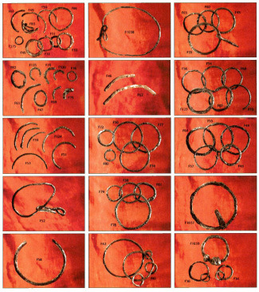

Staroseverská mytická vyprávění obsahují několik mocných prstenů – za všechny jmenujme Odinův prsten Draupnir a prsten Niflungů, Andvaranaut. Na tomto prstenu dokonce podle ságy o Volsunzích spočívalo prokletí jeho původního majitele, trpaslíka Andvariho:

> Trpaslík se skryl v kamenné sluji a pravil, že prsten způsobí každému, kdo by jej měl, smrt, a rovněž tak všechno zlato se stane každému majiteli zhoubným.

Tolkien sám ale inspiraci tímto mytickým prstenem výslovně odmítl. Avšak staroseverské písemné doklady zmiňují poměrně často také jiné prsteny – tzv. stallahringy. Na rozdíl od mytického Draupniru nebo prstenu z pokladu Niflungů byly stallahringy součástí každodenní reality Seveřanů a vyskytují se v textech, které popisují skutečné události a osobnosti. Na tyto prsteny se skládaly významné přísahy (například během soudních jednání) a stallahringy také sloužily jako odznak postavení a moci významných mužů staroseverského světa. Tyto šperky byly také často umístěny na oltářích pohanských chrámů.

Výstižně přeložit staroseverské slovo stallahring (stejně jako anglické synonymum altar-ring) je však obtížné, protože ve staroseverštině byl význam slova „hring“ velmi široký – mohlo se totiž jednat o téměř jakýkoliv šperk kruhového tvaru. Český překlad tedy vždy závisí na daných souvislostech a podrobnějším popisu daného předmětu.

Jedním z nejvýznamnějších pramenů zmiňujících stallahringy je islandský Landnámabók (tzv. Kniha o záboru země, která popisuje osídlení Islandu), kde jsou citovány některé z prvních zákonů Islandu. Díky Landnámabóku se dozvídáme, že stallahringy byly odznakem funkce godiho (místního vládce, který držel jak světskou tak i náboženskou funkci) a byly používány jako přísežné předměty během soudních procesů:

> Prsten vážící dva aury [54gr.] nebo více by měl ležet na oltáři každého velkého chrámu. Takovýto prsten, jenž byl předtím zbarven krví obětního kusu dobytka, by měl mít na ruce každý godi při všech shromážděních, na kterých vykonává své povinnosti dané zákonem.
>
> Každý, kdo měl vykonat zákonnou povinnost na thingu, musel nejdříve složit přísahu na tento prsten a jmenovat dva nebo více svědků. „Jmenuji [tebe, tj. M nebo N] svědkem své zákonné přísahy na prsten: Pomozte mi, Freyi, Njorde a Thore všemocný, abych žaloval nebo hájil, svědčil nebo soudil tak pravdivě a podle zákona, jak jen budu moci, a abych plnil všechny povinnosti, které mi připadly s příchodem na toto shromáždění.“

Pro Seveřany bylo běžné se v přísahách odvolávat k bohům, kteří měli zaručit dodržení slibu. Jednalo se zejména o Thora, Njorda, Freye nebo Ulla. Je nepřehlédnutelné, že Odinovo jméno se v přísahách neobjevuje, a to protože Odin byl považován za nedůvěryhodného, nebo dokonce zrádného boha, který běžně porušuje sliby. To je dokonce explicitně zmíněno ve 110. strofě Hávámálu (tzv. Výroků Vysokého, kde Odin vypráví o sobě a svých dobrodružstvích a zároveň posluchačům uděluje moudré rady do života):

> Na posvátný prsten
>
> Přísahal Odin:
>
> kdo jeho ujištěním věří?
>
> Suttunga podvedl,
>
> o nápoj připravil
>
> a Gunnlöd nechal v pláči.

![Stallahringu podobnou funkci mohl mít dnes ztracený zlatý gótský šperk z&#160;Pietrossy, nalezený v Rumunsku. Šperk má tvar přerušeného masivního kruhu s průměrem 15,3 cm a obvodem 40 cm. Předmět váží 671 gramů, což přibližně odpovídá váze uvedené v sáze Eyrbyggja. Předmět byl součástí chrámového pokladu z&#160;doby okolo 380 n. l. Na kruhu se nachází runový nápis, jehož překlad pravděpodobně zněl: „Vlastnictví Gótů. Jsem nedotknutelný.“ 			Zdroj: <a href="http://commons.wikimedia.org/wiki/File:Pietroassa_ring_1875.jpg">Wikimedia Commons</a>](pietroassa-ring-1875-opt.jpg)

Podrobné popisy stallahringů a jejich funkce je možné nalézt také ve staroislandských ságách. Jejich svědectví je však nutné brát s rezervou, protože tyto texty byly zapsány až dlouho po přijetí křesťanství a opuštění pohanských tradic. Přes tyto výhrady poskytují ságy zajímavá svědectví o vzhledu a funkci stallahringů. Například Sága o lidech z Eyru (Eyrbyggja saga, 4) popisuje pohanský chrám boha Thora, ve které se stallahring nachází:

> Tam také postavil svatyni a byla to velká budova. Dveře do ní vedly z podélné stěny vpředu. Uvnitř stály sloupy, které si přivezl Tórólf z Norska. Do sloupů byly zabity hřeby zvané boží. Před sloupy se prostíral rozsáhlý prostor, v němž nesměl být porušen mír. Ještě dále byl oddělený prostor, podobný chóru v křesťanských kostelích. Uprostřed bylo vyvýšené místo jako oltář a na něm ležel neuzavřený kovový kruh vážící dvacet aurů. Při něm se skládaly všechny přísahy. Tento kruh nosil godi, kněž svatyně, při všech shromážděních lidu na ruce jako náramek Na oltáři stála i obětní nádoba s obětní vějičkou jako kropidlem. Jí se kropila z nádoby obětní krev, která vytékala ze zvířat obětovaných bohům.

Sága o lidech z Eyru zmiňuje stallahringy ještě několikrát. Za zmínění stojí následující dramatická scéna:

> Steintór požádal Snorriho, aby mu podal ruku, a Snorri tak učinil. V tom napřáhl Steintór meč a sekl jím Snorrimu po ruce, až to zařinčelo. Meč totiž zasáhl kruh přísahy (stallahring) tak, že ho Steintór málem rozťal. Ale Snorriho nezranil.

Stallahringy se mezi Seveřany těšily takové úctě, že si jich povšimli také kronikáři jiných zemí, kteří vikingské dobyvatele často popisovali. Je tak možné jejich existenci a funkci doložit i z jiných, nezávislých zdrojů. V Anglosaské kronice pocházející z 9. století je například zmíněna přísaha dánského vikingského vojska anglickému králi Alfredovi (jak již bylo zmíněno, překlad slova stallahring není vždy zcela jednoznačný).

> L. P. 876 […] A v tomto roce vniklo vojsko do Warehamu, pevnosti západních Sasů. Král s nimi poté uzavřel mír a oni mu jako rukojmí dali nejlepší muže vojska a na posvátný náramek složili přísahu, že opustí jeho království, což neudělali dříve pro žádný jiný národ.

Také kronika Pověst dávných let (Nestorův letopis, Počáteční letopis), pocházející z počátku 12. stol., popisuje m. j. přísahy a obchodní smlouvy uzavřené mezi Řeky a „Rusy“, které se uskutečnily během desátého století. Při popisu přísahy o dodržování smlouvy v roce 944 mezi knížetem Igorem a vládcem Konstantinopole je „obruč“ spolu s meči a štíty mezi předměty, které byly během přísah použity.

> A nekřtění Rusové mají odložiti štíty své i meče své nahé, obruče své i ostatní zbraně, a mají přísahati o všech věcech, ježto jsou napsány na tomto listě, že zachovány budou od Igora, i ode všech bojarův, i ode všech lidí ze strany Ruské na budoucí léta i navždy. Jestliže kdo z knížat nebo z lidí ruských, budiž křesťan nebo nekřesťan, toto přestoupí, co na tom listě napsáno jest, bude hoden, aby umřel svou zbraní, i ať bude proklet od Boha i od Peruna, že přestoupil svou přísahu. A dokud bude dobrý Igor, veliký kníže, živ, ať toto zachová, láska pravá aby se nezrušila, dokud slunce svítí a svět stojí, na nynější věky i na budoucí.

Citovaný úryvek z Nestorova letopisu je však zajímavý i tím, že popisuje kletbu, která přísahajícího postihne v případě porušení slibu, a obsahuje také frázi s přáním věčného míru, jež je aliterovaná i v církevní slovanštině – _dondeže sujaeti solnce i besi miru stoit_. Obsah i aliterace (typický znak staroseverských básní) odpovídají textům přísah, které se dochovaly ve staroislandských písemných pramenech.

Z hmotných pramenů je pravděpodobně nejzajímavější tzv. Forsaring. Tento předmět pochází ze severošvédského kostela Forsa, kde sloužil jako klepadlo. Forsaring je železný kruh měřící 43 cm v průměru s dlouhým runovým nápisem (téměř 250 run) datovatelným do 9. století n. l. Místo nálezu se nachází nedaleko místa Hög, které bylo ve středověku sídlem thingu (shromáždění) všech obyvatel oblasti. A jak bylo zmíněno výše, _„každý, kdo měl vykonat zákonnou povinnost na thingu, musel nejdříve složit přísahu na tento prsten.“_ Je proto možné, že právě Forsaring kdysi dávno sloužil tomuto účelu. Tomu napovídá také (poněkud upravený) překlad zmíněného runového nápisu, který obsahuje právní ustanovení týkající se údržby posvátného místa:

### Kde se dozvědět víc?

- _Anglo-Saxon Chronicle_, přel. Ingram, J., ed. Ford, J. H., 2005.
- _Edda,_ přel. Heger. L., Argo, Praha 2004.
- _Nestorův letopis ruský,_ přel. Erben, K. J., Státní nakladatelství krásné literatury, hudby a umění, Praha 1954.
- _Sága o Völsunzích,_ přel. Zatočil, Leopold, Státní pedagogické nakladatelství, Praha 1960.
- _Staroislandské ságy,_ přel. Heger, L., Státní nakladatelství krásné literatury a umění, Praha 1965.
- Brink, S.: Law and Legal Customs in Viking Aga Scandinavia, in _The Scandinavians from the Vendel period to the 10. century,_ ed. Jesch, J., s. 87–128.
- Simek R.: _Dictionary of Northern Mythology_, Alfred Kröner Verlag, Stuttgart 1993.
- Magoun, F. P.: On the Old-Germanic Altar- or Oathring (Stallahringr), in _Acta Philologica Scandinavica_ 20, 1947/49, s. 277–293.
- Stein-Wilkeshuis, M.: Scandinavians swearing oaths in tenth-century Russia: Pagans and Christians, in _Journal of Medieval History_ 28, 2005, s. 155–168.

> Pokuta za zanedbání oprav kultovního místa: poprvé jeden kus hovězího dobytka a dvě unce, podruhé, dva kusy dobytka a čtyři unce podruhé, potřetí čtyři kusy dobytka a osm uncí, zabavení majetku, pokud nedojde k nápravě. Toto je možné požadovat, podle zákona lidu, který byl dříve vyhlášen a ustanoven. Toto udělali Anund z Tåsta a Ofeg z Hjorsta. A Vibjörn vyryl.

Z uvedených rozměrů Forsaringu jednoznačně vyplývá, že v tomto případě nešlo o prsten ale o daleko větší a těžší šperk. Jeho funkce však byla s největší pravděpodobností totožná s funkcí stallahringů.

Na základě výše zmíněných pramenů je možné konstatovat, že šperky kruhového tvaru (ať už prsteny, náramky či ještě větší předměty) se mezi starými Seveřany těšily velké až posvátné úctě. S největší pravděpodobností symbolizovaly právo a spravedlnost, jak dosvědčuje jejich použití během právních rozepří. Byly ovšem také znamením jak světské moci, tak i moci posvátné, odvozené od bohů. V pramenech se s nimi setkáváme jako s předmětem uctívání v chrámech a v neposlední řadě také jako s odznakem postavení knížat. Tato jejich funkce se nejspíše odráží i v Tolkienových verších:

> Tři prsteny pro krále elfů pod nebem, 
> Sedm vládcům trpaslíků v síních z kamene, 
> Devět mužům: každý je k smrti odsouzen.
