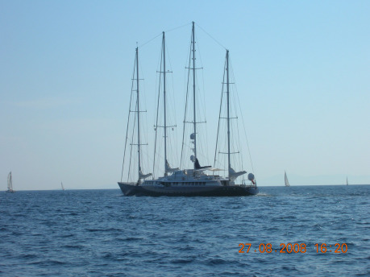
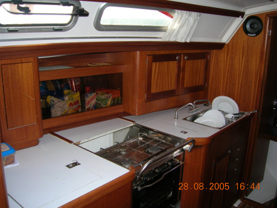
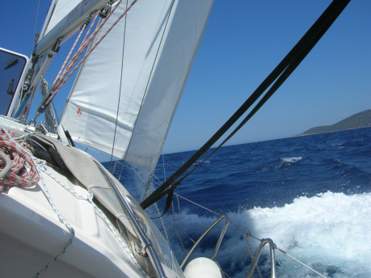
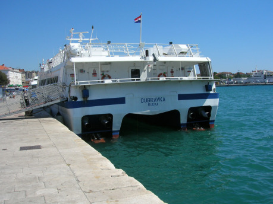
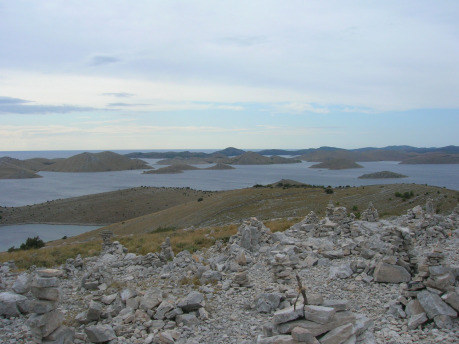
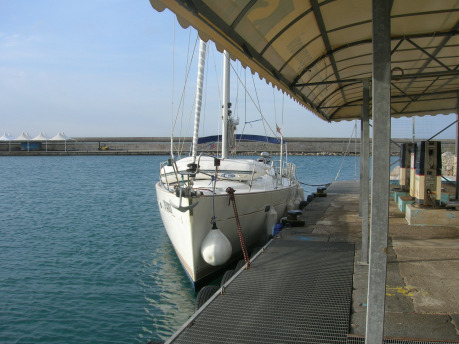
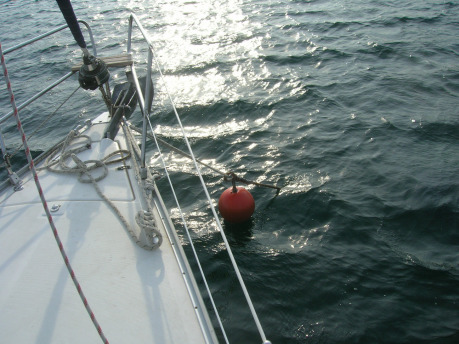
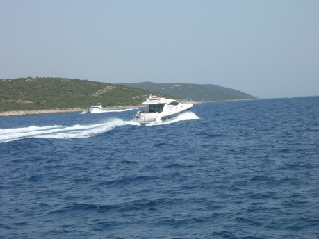

Povídání o jachtingu může začít mnoha různými způsoby. Vyprávění lze začít například chronologicky a vydat se zřejmě někam k Féničanům, kteří mořeplavbu ovládali natolik, že se jí s největší pravděpodobností opravdu bavili. Mnohem snazší a kratší cesta by byla po osobní historii autorově, tedy jak jsem se k jachtingu dostal já. Je možné se odpíchnout taky od nějaké aktuální události, ovšem v hodinu, kdy začal tento příspěvek vznikat, byla nejaktuálnější událostí v oblasti jachtingu smrt českého jachtaře v Šibeniku, tedy přístavu, do něhož směřovaly kroky Wrankovy družiny v minulém díle námořnického povídání. To by nebyl optimistický start, neboť jachting sice není bez rizika – přeci jen se jedná o nejužší vztah s mořským živlem, jakého si může běžný Středoevropan dopřát – ale takovou pověst by si tento krásný sport vskutku nezasloužil. Proto bude nejvhodnější začít od toho, co to vlastně jachting je.

Jachting je pojem zjevně související se slovem jachta. Na otázku, co to jachta je, by většina respondentů dokázala reagovat tak, že se jedná o druh lodi. Beze sporu správná odpověď, avšak nelze ji považovat pro naše potřeby za dostatečnou. Česká wikipedie nás skálopevně přesvědčuje, že se jedná vždy o plachetní loď, což ovšem není tak docela pravda. Tento výraz si osvojily (a to historicky nikoliv neopodstatněně) i motorové čluny, a tak pojem jachta odlišuje kategorii námořních plavidel o velikosti přibližně od 6 do 24 metrů délky, primárně určených pro zábavu osazenstva. Pro přesnější představu je třeba podotknout, že plachetnice této délky, ač určeny k rekreaci, jsou schopny přeplout oceán. Pokud je toho schopna posádka a má-li dostatek zásob pro takovou cestu, která i za příhodných podmínek na Atlantiku trvá nejméně 4 týdny. Za méně než 4 dny optimálních podmínek tuto cestu dokáží absolvovat soutěžní speciály. Pro úplnost lze uvést, že podobná plavidla nad 24 metrů délky se označují jako superjachty (nad 50 m megajachty) a zejména v případě megajachet jsou zábavou pro multimiliardáře, kterým nabízejí třeba i vlastní heliport, ale do tohoto povídání tak docela nepatří, a to nejen proto, že obvykle nemají plachty.

> Stabilita lodi, která pluje po neustále se pohybující vodní hladině, je věc na představy suchozemců poněkud složitější. To nám ukazuje už stručný popis rozdílů mezi katamaránem a&#160;plachetní jachtou. Katamarán se sice méně houpe, přesto je méně stabilní. Tento zdánlivý paradox vyplývá z&#160;toho, že pod pojem stabilita se řadí jak schopnost pohltit běžné drobné houpání, tak schopnost navrátit se po zhoupnutí do původní polohy. Množství houpání, které loď pohltí, je dáno především poměrem hmotnosti lodě vůči působící síle vln, přičemž u katamaránu je na stejnou délku vyšší výtlak, což je dáno tím, že jeho stabilitu zajišťuje výlučně balast svou hmotností. Při tom působí jen menší část síly vlny, protože katamarán vlně běžné velikosti nastavuje jen jeden trup, tedy menší plochu, na kterou může vlna působit. Naopak větší vlny, které zasáhnou oba trupy naráz, a&#160;v&#160;horším případě ještě ve spojení s&#160;větrem, dokáží dostat do nebezpečných problémů katamarán spíš než kýlem vybavenou jachtu. Úhel náklonu, z&#160;něhož se již katamarán nedokáže srovnat do správné polohy, je totiž menší než u jachty. Přesto je větší než 50 °, tedy katamarány jsou na tom lépe než některé motorové čluny, kterým se ale také říká jachty... Pro srovnání, pro běžnou námořní jachtu není problém náklon přesahující 70 ° (podle technickým norem má dokonce činit něco mezi 120 ° až 155 °, ale to jsem sám nezkoušel). Plácnutí plachtou o vlny a umytí bočního zábradlí pod vodou, jsou manévry, které rekreační jachta zvládá obvykle lépe než rekreační posádka.

Jachtou tedy rozumíme jak motorové, tak plachetní lodě určené pro plavbu za účelem rekreace, tedy pro jachting. Ovšem aby to s těmi definicemi nebylo tak jednoduché, tak se jachting provozuje i na katamaránech, které se jako jachty neoznačují. K jachtingu způsobilý katamarán je plachetní loď dvoutrupé konstrukce. Výhody tohoto řešení pak využívají i jiné druhy plavidel, například trajekty. Katamarán nabízí za mnohem více peněz (pro srovnání, týdenní pronájem katamaránu je 2–3krát dražší než u běžné jachty) více místa na palubě, rychlejší plavbu za stejných povětrnostních podmínek a méně houpání. Nejsou však stabilnější než klasická kýlová jednotrupová plachetnice.

Nejběžnější jachta má délku od 9 do 14 metrů (30 až 47 stop), jeden stěžeň umístěný zhruba uprostřed délky trupu, dvě plachty a pomocný motor. Její podpalubí je členěno na 2 až 4 dvojlůžkové kajuty a hlavní prostor zvaný salon, který nabízí 1 až 4 další lůžka.

Slovo jachta je holandského původu a označovalo loď určenou na chytání pirátů ukrývajících se v mělkých pobřežních vodách a ústí řek. Jazykově nadaní tedy mohou vnímat podobnost mezi holandským jacht a německým jagd. Slovo se objevuje v angličtině v souvislosti s tím, že Karel II., použil plavidlo tohoto typu při návratu z Holandska do Anglie roku 1660. V angličtině tedy původně označovalo plavidlo určené pro osobní přepravu významných (a bohatých) osob. Proto je třeba strpět označení motorových člunů jako jachet, neboť plavbu na nich si mohou dopřát spíše mohovitější jedinci. Nejen že pořizovací náklady jsou vyšší, ale zejména spotřeba paliva, která podle velikosti člunu a rychlosti plavby může činit i více než 70 l na hodinu, značně prodražuje jejich provoz.

Rekreační námořní plachetnice lze dělit podle celé řady kritérií od těch technických až po právně-ekonomická, kam řadíme nejen takové věci, jako je vlastnictví lodi, ale i to, jaké certifikace jachta splňuje a na jaké oblasti plavby je pojištěná – každá plachetnice vyhovující výše uvedeným parametrům a v technickém stavu odlišném od vraku je schopná přeplout z Chorvatska do Itálie a zpět. Ale drtivá většina z nich nesmí opustit chorvatské teritoriální vody, tedy se vzdálit více jak 12 NM od nejbližšího ostrova. Vzhledem k tomu, že většina lodí je vybavena zařízením GPS a v případě větších, tedy i dražších, plavidlech se vždy jedná o obousměrné GPSky, tak je vhodné toto respektovat, chcete-li se vyhnout potížím.

> Teritoriální vody jsou součástí pobřežního státu a tvoří je pruh moře vymezený vzdáleností od pobřežní čáry, široký podle toho, jak si jej nárokují jednotlivé státy v&#160;souladu s&#160;příslušnými úmluvami OSN, obvykle mezi 3 a 12 NM. Chorvatsko a většina dalších zemí si nárokuje největší vymezení. Velká Británie uplatňuje na jednotlivých územích různě široká pásma, což se týká i jednotlivých ostrovů Normanských ostrovů (Channel Islands) – samotné Jersey má pásmo široké 12 NM, Guernsey 3 NM, příčinou tohoto stavu je zřejmě skutečnost, že Jersey leží výrazně blíže Francii. Pobřežní, někdy též břehová, čára je hranice mezi mořem a zemí za největšího odlivu případně spojnice těchto hranic u&#160;vnější části ostrovů, což má zejména v&#160;Chorvatsku větší význam než nepatrný posun při přílivu a&#160;odlivu. Vody vymezené touto linií se označují jako vnitřní vody a platí pro ně o něco přísnější režim než pro teritoriální vody. Vnitřními vodami by například podle mezinárodního práva neměla bez svolení proplouvat vojenská loď cizího státu, která ale může na základě práva pokojného průjezdu proplouvat vodami teritoriálními. Ponorka by měla tohoto práva využívat plujíc vynořená na hladině a&#160;s&#160;vyvěšenou vlajkou. Právo pokojného průjezdu mají samozřejmě i obchodní lodě, při využívání tohoto práva nelze provozovat rybolov, ale za jeho využití nesmí být vybírán poplatek.

Při vlastnictví lodi pak rozlišujeme dvě možnosti – loď vlastní a loď půjčovaná od charterové společnosti, zkráceně charter. Střední možnosti, tedy lodě půjčované od známého či kamaráda, právní předpisy spíš brání, ty chorvatské dokonce velice intenzivně.

Pořídit si vlastní loď zní sice romanticky, ale je to drahá záležitost. Pořizovací i provozní náklady jsou téměř přímo úměrné velikosti/délce plavidla. I ta nejmenší plavidla stojí stovky tisíc korun a jen jejich údržba vyjde každý rok na desetitisíce. Hlavní výhodou je, že menší jachty se dají poměrně snadno převážet za silnějším osobním automobilem, proto se pro záležitosti s nimi spojené používá pojem trailerový jachting. Majitel takové jachty si sice může vybrat, zda ji doveze na Balt, na Jadran nebo i jinam, například na Balaton či některé z polských jezer, ale pořád bude limitován omezenými možnostmi danými velikostí lodi. A to jak v oblasti komfortu, pro příklad uveďme menší než stojnou výšku uvnitř lodi, suchý záchod, „autoledničku“ či jen obyčejný propanbutanový vařič, tak v oblasti plavebních schopností. Malá loď je za větších vln významně hůře ovladatelná a je schopná plout méně ostře proti větru, tedy má větší mrtvý úhel, kam není možné se dostat bez křižování, navíc její snos, zvaný jachtařskou latinou drift, ve směru větru může být téměř stejný jako posun vpřed. Větší plavidla pak stojí přibližně od 100 000 EUR výš, ovšem vzhledem k celé řadě proměnlivých veličin, jako je výbava lodě, daňové předpisy v místě prodeje apod., je těžké uvést nějakou konkrétní cenu. Jen pro představu nová loď délky 37 stop (10 m) střední třídy výrobce (Bavaria) stojí v Británii 152 000 EUR. Roční provoz takových lodí za stání, běžnou údržbu, pojištění a poplatky se může blížit dalším 10 000 EUR. Oproti tomu charter stejné lodi ve vrcholné sezoně přijde v Biogradu v Chorvatsku na 2840 EUR podle ceníku. Finance jsou hlavní důvod, proč i já sám využívám výlučně charter, a ze zkušeností s ním a při něm získaných vycházím.

Z technického hlediska se jachty dělí podle tří základních parametrů – tvaru trupu, ostěžnění a druhu oplachtění. Tvarem trupu se rozumí tvar jeho příčného profilu, taktéž zvaný profil na žebru. Ostěžnění zahrnuje údaje o počtu, velikosti a umístění stěžně vůči těžišti a má významný vliv na chování plachetnice za větru. Druh oplachtění pak ovlivňuje to, jaký vítr a jak efektivně dokáže loď využít. Označení ostěžnění a oplachtění se navíc leckdy spojuje do jednoho pojmu. Celou situaci komplikuje to, že jednotlivé druhy jsou označovány podle historicky používaných plavidel a celkově v tom panuje řada nejasností či rozporů mezi jednotlivými autory. Zmatky jsou dále umocněny rozdíly mezi stejně označenými loděmi v různých obdobích a oblastech, o vlivu překladů raději nemluvě. Tak například briga nyní krom historického významu označuje druh lodi se dvěma stěžni, z nichž hlavní, vyšší je blíže zádi, kdežto keč má hlavní stěžeň vpředu. Z toho se pak odvozovalo i tzv. kečové oplachtění se dvěma vratiplachtami, kdežto brigové mělo jen jednu. K tomu všemu se jako keč dnes označují i plachetnice se dvěma stejně vysokými stěžni – protože dřívější vratiplachta nyní převzala roli hlavní plachty, a tudíž ji takto označované lodi nesou na obou stěžních. Takovým lodím by se mělo podle ostěžnění říkat škuner, ale od těch se odlišují tím, že mají jen jednu plachtu před stěžni.

Drtivá většina dnešních charterových, ale i soukromých jacht je typu bermudská šalupa s trupem profilu šarpie. Pojem bermudská označuje oplachtění tvořené přední, stěhovou plachtou pevně napnutou předním lemem mezi špicí přídě a vrcholem stěžně. Pokud tato plachta dosahuje při plném rozvinutí jen ke stěžni a nikoliv za něj, jedná se o kosatku, pokud je větší, označujeme ji jako génu. Stěhová se jí říká proto, že pevně nepřiléhá ke stěžni, ale ke stěhu, pevnému lanu spojujícímu příď se stěžněm. Na stěžni je umístěna druhá plachta, obvykle menších rozměrů, která má taktéž tvar trojúhelníku. Jejím předchůdcem na historických plachetnicích byly tzv. vratiplachty napínané mezi horní a dolní poloráhno, případně nad ně a za ně. Této plachtě se dnes říká hlavní plachta a je napínána mezi stěžeň a dole umístěné ráhno, jež by se proto správně mělo označovat jako vratipeň.

Šalupa pak znamená, že se jedná o loď vybavenou jedním stěžněm, jehož výška se přibližně rovná délce lodi – dnes ji již obvykle přesahuje, neboť nové lehčí materiály na bázi umělých hmot umožňují instalaci větších plachet. Ovšem historicky vzato měla šalupa stěžeň více vepředu, před středem lodi, dnešní jachty jej mají zhruba uprostřed, což odpovídá kutru, ale ten, stejně jako již zmíněný škuner, je charakteristický větším množstvím kosatek. Profil trupu šarpie se vyznačuje viditelným ostrým lomením žebra vytvářejícího outor – hranu odlišující bok lodi od jejího dna. Dnes již jen na menších člunech nalezneme trup profil hlubokého V; trup tvaru širokého U, který stojí těmito dvěma možnostmi, označujeme jako jolu. Šarpie přináší dvě zásadní výhody, jednak má dobré nautické vlastnosti, zejména hezky drží přímý směr, a také je vnitřní prostor lodi lépe využitelný. Aby to nebylo tak jednoduché, tak profil na žebru se zakulacuje a blíží se jolám, avšak vzhledem k široké zádi se tyto trupy stále považují za šarpie.

Jachting jako činnost odlišná od vojenské či obchodní mořeplavby (včetně rybolovu) se začal rozvíjet v sedmnáctém století v Severním moři převážně zásluhou Nizozemců, a to v podobě rychlostní (dnes bychom řekli sportovní) plavby. Ovšem nelze nevidět, že v té době měla tato činnost zároveň přímé pozitivní dopady zejména v technologické oblasti na mořeplavbu jako takovou. Lze předpokládat, že lodě byly k rekreaci využívány již dříve, ovšem existují jen velmi skrovné doklady takové činnosti. Lépe na tom je starořímská instituce naumachia, což je nejen označení pro uměle zbudovanou vodní plochu, ale i pro střetnutí válečných lodí, které se na ní utkávaly stejně jako známější gladiátoři v duelech na život a na smrt. Právě z takovéhoto střetnutí pořádaného císařem Claudiem v roce 52 n. l. na jezeru Fucine ve střední Itálii pochází slavný pozdrav _morituri te salutant_, který se mylně připisuje všem gladiátorům. V pozdějších letech pak naumachie upadaly co do velikosti vodních ploch i počtu účastníků, což postupně vedlo k posílení divadelního rozměru představení. Hraný charakter pak měly i naumachie inscenované Jindřichem II. v Rouenu roku 1550 či Napoleonem Bonapartem roku 1807 v Miláně. Toto však v žádném případě nelze označit za jachting ani jiný druh rekreace, byť to bylo určeno jako mimořádná zábava pro masy přihlížejících na tribunách arén či jiných umělých vodních ploch.

Vzácný doklad rekreačního užití lodí tak představuje nález velmi malého drakkaru v Dánsku, který podle odhadu archeologů měl sloužit k vyjížďkám dcer jednoho z místních jarlů. Známější historie rekreačního využití mořeplavby začíná až s hospodářským rozvojem společnosti v 19. století vedoucím k rozšíření volného času. V roce 1851 vyhrála jachta škunerového typu závod pořádaný Royal Yacht Squadron mezi Isle of Wight a anglickým pobřežím, a to dokonce před zraky královny Viktorie. Odměnou jí byl stříbrný pohár (mimochodem zakoupený v obchodě, nikoliv na zakázku dělaný), později nazvaný na její počest America’s Cup. Jeho první majitelé, členové New York Yacht Clubu, se rozhodli, že si jej neponechají nastálo, ale umožní ostatním o Pohár Ameriky usilovat v rychlostních soutěžích. Dalších více než sto let se však nenašel tým, který by dokázal americké obhájce porazit. Soutěž se ve dvou fázích koná dodnes a je tak nejstarší stále probíhající námořní soutěží a zároveň patří mezi nejprestižnější vůbec.

Přesto byl koncem devatenáctého století Richard McMullen, jeden z otců moderního jachtingu, stále považován za podivína, když na své přestavěné rybářské loďce pro zábavu brázdil vody kolem Británie. A to ještě předtím, než jej našli, jak kormidluje přes kanál La Manche mrtvý. Vývoj jachtingu byl přerušen oběma světovými válkami, avšak právě v té době dosažený technický pokrok zejména v oblasti umělých hmot popohnal jachting v jeho rekreační, ale samozřejmě i sportovní podobě vpřed. Zlevnila se výroba plachet, které byly díky umělým vláknům zároveň lehčí, a tedy snáze ovladatelné. Pokročila spolehlivost a dostupnost spalovacích motorů a v neposlední řadě se na trhu objevily lodě s laminátovým trupem. To vedlo k zásadnímu poklesu pořizovací ceny plavidla a usnadnění péče o něj, ačkoliv ani dnes s využitím nejmodernějších nátěrových hmot a speciálních metalických mikrofolií není údržba zejména ponorné části trupu snadnou záležitostí.

> Použití betonu není až tak neobvyklé, jak by se na první pohled mohlo zdát. První s&#160;tímto nápadem přišel Francouz Joseph-Luis Lambot již v&#160;roce 1848. Jeho loď vzbudila tolik pozornosti, že byla dokonce vystavována na Expu 1855. Intenzivnější výroba probíhala za obou světových válek, kdy bylo třeba oceli využít ve zbrojním průmyslu. V&#160;Nizozemí je řada hausbótů právě takové konstrukce, která nejlépe ze všech běžně používaných materiálů odolává působení vody. Nadšenci pak i u nás pořádají každoroční závody betonových kánoí. Ze své podstaty nepříliš vzhledné kontejnerové lodi se z&#160;betonu odlévají dosud, byť ne v&#160;Evropě nebo USA – jejich největším producentem je Čína. U&#160;jachty, kde je jistá míra elegance žádoucí, mohou být hrubé rysy poněkud nevhodné, ale jsou vyváženy nízkou pořizovací cenou materiálu, úsporou za ošetřování trupu ochrannými nátěry (antifouling) a za minulého režimu i širokou dostupností tohoto materiálu. Rusové v&#160;současné době dokonce oživili svůj projekt betonových ponorek. Plavidlo z&#160;betonu (v&#160;němž by však armatura byla nahrazena kevlarovými prvky a písek keramickým prachem, takže z&#160;betonu by zůstal vlastně jen cement) mělo být schopno nasazení i v&#160;hloubkách pod 900 metrů. Tato hloubka představuje mez únosnosti vojenských ponorek ocelových konstrukcí, přestože výzkumné batyskafy dosáhnou i&#160;hloubek podstatně vyšších včetně nejhlubšího známého místa na Zemi – dna Mariánského příkopu, jehož hloubka činí podle aktuálního měření 10&#160;994 m od hladiny. Rusové si však od tohoto projektu slibují spíše jednoduchá levná plavidla vytvářející těžko detekovatelné torpédové pasti.

Jachtařský boom v západním světě nezůstal bez ohlasu ani v tehdejším Československu. Ovšem zatímco sériově vyráběnou laminátovou loď si mohl díky nižší pořizovací ceně ve svobodné části světa pořídit téměř kdokoliv, tak u nás byl jachting záležitost skutečných nadšenců. Cesta k vlastní či alespoň klubové lodi vedla nejen přes úřední komplikace, ale i stovky hodin strávené v dílně. Zmíněné komplikace pak mnohonásobně vzrostly, když kdokoliv chtěl, byť ve spřátelené socialistické zemi, jachtařit na moři. Plavidla se zhotovovala podle plánů nesnadno získaných obkreslováním od známých a kamarádů. Některé původní originály se dostaly k čs. sportovním oddílům osobním darem od zahraničních konstruktérů. Ačkoliv globální příčinnou rozšíření jachtařské komunity bylo využití umělých hmot, tak podomácku dělané lodi využívaly jiných materiálů, protože výhody laminátu vynikají při sériové, nikoliv kusové výrobě. Mezi těmito materiály pak hrála prim tvarovaná překližka, ale našly se i klasické dřevěné, ocelové, nebo dokonce ferocementové trupy.

Velikou výhodou tehdejšího stavu věci byla skutečnost, že budoucí jachtaři znali svá plavidla tak říkajíc od prvního šroubku, rozuměli jejich konstrukci a byli schopní je opravovat doslova na koleně. Ostatně nic jiného jim také nezbývalo, neboť i když náhodou dostali tzv. sportovně technický souhlas, aby mohli vyrazit třeba ze Štětína na plavbu do Anglie, tak nezbytný devizový příslib jim zajišťoval tak skrovné prostředky, že nebylo ani na jídlo, natož na servis, či dokonce na případné zdravotní ošetření. První československé plavby tedy nebyly bez rizika – já bych na méně než sedmimetrové lodi nevyplul ani na Jadran, natož na plavbu do Osla a zpět, ale kouzlo moře, ať už to byl Balt, či Černé moře, později i Jadran, bylo natolik silné, že dokázalo nalákat desítky jachtařů. Mezi nimi vynikali členové, ať už oficiální, či neoficiální, Yacht Klubu Brno, ale k legendám československého jachtingu patří i další jména. V náhodném pořadí – Rudolf Krautschneider, František Novotný, Oldřich Straka, Richard Konkolski, Dušan Vaculka, bratři Pátí, Oldřich Karásek či Miloš Maximovič.

> Pár vět o jachetním sportu            Nepočítáme-li lední variantu, v&#160;níž se na zamrzlých plochách soutěží v&#160;jízdě na křížencích surfu a&#160;bruslí, lze sportovní jachting rozdělit do dvou základních kategorií – na okruhový a dálkový. Okruhový jachting, v němž se na menších plavidlech většinou pro jednoho až tři sportovce soutěží v&#160;opakovaných rozjížďkách na pevně definovaném okruhu, lze provozovat i na českých přehradách a&#160;jezerech. V našich končinách byl námořní jachting chápán jako mladší bratr této soutěžní formy, neb okruháři dokázali navázat na předválečné tradice. Okruhoví jachtaři, mezi něž patří třeba olympijská medailistka Lenka Šmídová, stříbrná z&#160;Atén, nebo Martin Trčka, musí umět skvěle ovládat plachty a&#160;dokázat vytěžit maximum ze své váhy, kterou vyrovnávají klopný efekt větru, čímž dosahují vyšších rychlostí. Právě pro skvělou znalost práce s&#160;plachtami jim, v&#160;žádném případě s&#160;hanlivým úmyslem, říkám plachtaři a jejich disciplínám souhrnně plachting. Dálkoví jachtaři soutěží na větší vzdálenosti vymezené mezi ostrovy či významnými body na pevnině. Kromě práce s&#160;plachtami musí rovněž ovládat navigaci a další části námořnického umění. Kromě toho musí zvláště v&#160;případě sólových závodů prokázat mimořádnou vytrvalost a psychickou odolnost. Nejznámějšími závody dálkových jachtařů jsou Volvo Ocean Race, posádkový závod kolem světa, jeho individuální protějšek Vendeé Globe, již zmíněný Fastnet, slavný závod Sydney–Hobart a třeba série závodů TransAt na tratích vedoucích přes Atlantik. V&#160;této souvislosti je třeba jmenovat Davida Křížka, který dokázal v&#160;sólové plavbě zvané MiniTransAt (Transat 6,50) skončit na skvělém třetím místě ve své kategorii a je nejen díky tomu světově uznávaným jachtařským sportovcem. Ovšem tento sport je náročný nejen na čas, ale především na peníze, které mu nejvíce brání v&#160;dosahování dalších a dalších úspěchů. Již zmíněný Pohár Ameriky se za dobu své existence změnil z&#160;dálkového závodu, byť na kratší tratě, v&#160;závod okruhového typu. V&#160;jeho první části se utkávají v&#160;rámci série Luis Vuitton Cup posádky o právo vyzvat obhájce poháru. Ovšem o&#160;podobě této tradiční soutěže nyní probíhají vášnivé spory mezi tradicionalisty a jejich účetními, protože účast v Poháru Ameriky je neobyčejně nákladná a jde do desítek miliard dolarů.

Rekord na trati přes Atlantik drží francouzský trimaran Banque Populare V. Jak už sám název napovídá, je to pátá generace lodi určené výlučně k lámání rychlostních rekordů na otevřeném moři. Rekordního času z New Yorku k místu zvanému Lizard Point na západním výběžku Cornwallu (konkrétně 3 dnů, 15 hodin, 25 minut, 48 sekund) dosáhl na přelomu července a srpna 2009. Toto plavidlo spuštěné na vodu v roce 2008 ve francouzském Nantes má délku 39 m, tedy 130 stop, a je držitelem hned šesti „registrovaných“ rekordů. Kromě zmíněného přeplutí Atlantiku Severoatlantickou trasou (rekordy se registrují na vybraných tratích, aby byly vzájemně porovnatelné, přes Atlantik jich je vytyčeno asi 8), se ještě jedná o Jules Verne Trophy za nejrychlejší obeplutí světa bez zastávky, vzdálenost ujetou za 24 hodin, obeplutí Britských ostrovů, přeplutí Středozemního moře na trati Marseille–Kartágo a závod Fastnet race (z ostrova Wight kolem skály Fastnet u jižního pobřeží Irska zpět do Plymouthu).

Přes výše uvedená jména již není těžké se dostat až do současnosti, neboť výše uvedení pánové se (s několika smutnými výjimkami z důvodů úmrtí) ve světě jachtingu pohybují dosud – Oldřich Straka je autorem nejlepších českých skript pro rekreační mořeplavbu a vlastní agenturu zprostředkovávající charterové plavby, všichni tři pánové od K publikují a přednášejí o svých plavbách a o moři vůbec. Spisovatelské činnosti se věnuje rovněž František Novotný, dokonce profesionálně, neboť tento vystudovaný kybernetik, který dříve pracoval mj. v jaderné elektrárně Jaslovské Bohunice, je hlavním povoláním spisovatel science fiction, ale i literatury faktu s námořní a modelářskou tématikou.

Podle Strakových skript a na lodi jiného z první generace jachtařů se jachtařskému umění učil v roce 2001 nebo 2002 můj kamarád a spolužák z fakulty, jemuž říkejme třeba Gilrand. Právě ten se mne v roce 2003 zeptal, zda bych nejel v létě na loď, konkrétně na plachetnici do Chorvatska. V první chvíli jsem chtěl odmítnout domnívaje se, že to je na mé poměry příliš drahá sranda. Pak jsem se ale rozhodl odpovědět upřímněji – že bych jel moc rád, ale obávám se, že na to nebudu mít peníze. Gilrand však poukázal na to, že celá plavba včetně dopravy nebude stát o mnoho víc než stipendium, které jsme oba tehdy získali. Bylo tedy rozhodnuto, nadšeně jsem souhlasil a nemohl se dočkat konce srpna. Po lodích a zejména marinách s vyrovnanými řadami stěžňů a puncem luxusu jsem od dětství pokukoval při každé vzácné návštěvě Chorvatska, tehdy vlastně ještě Jugoslávie.

Vyplouvalo se z Kremiku, v té době nově otevřené mariny u městečka Primošten, na plachetnici typu SAS 39 jménem Pembina. Tehdy mi typ lodi ani číslo označení neříkalo vůbec nic, stejně jako údaj, že byla vyrobena v roce 1988. Gilrand ji měl půjčenou již na předchozí týden na plavbu s jinou skupinou, přesto nás poněkud překvapilo, že loď kotví u hlavního nábřeží a dosti jinak než ostatní jachty. Gilrand totiž loď nevracel charterové společnosti, takže nebyl vázán předchozího dne hodinou příjezdu a zastihla jej silná večerní bouřka, v níž přistával částečně na plachty, protože motor o výkonu 20 koňských sil nebyl pro téměř dvanáctimetrovou loď za takového větru dostatečně silný. V průběhu týdenní plavby, jsme zjistili, že stáří lodě se projevuje na mnoha věcech. Třeba na nespolehlivě fungujícím kotevním vrátku, takže za těch nejdramatičtějších okolností bylo třeba tahat kotvu ručně. Ale naučili jsme se celou řadu užitečných věcí, například, že není nejlepší nápad kontrolovat množství oleje v lodním motoru a dolévat jej do jeho převodovky. Či jak kotvit „na hulváta“, tedy vyvázat se přes jednu či více cizích lodí k molu. Tato dovednost se nám velice hodila o skoro deset let později, když jsme za počínající bóry hledali bezpečný úkryt v přeplněném přístavu městečka Bol na ostrově Brač, poblíž něhož se nachází nejznámější pláž na Jadranu Zlatny rat.

Ceníková suma je pouze teoretický údaj. Od této ceny lze odečíst až několik desítek procent za first/last minute rezervaci, výstavní slevu, dobře zvoleného zprostředkovatele, věrnost charterové společnosti a dvoutýdenní pronájem, čímž se dostaneme v uvedeném případě na cenu 1 846 EUR. Je-li posádka ochotna trochu riskovat a realizuje pronájem až v týdnu před plavbou či jej dokonce sjednává přímo v Chorvatsku na ten den, lze ušetřit jen za last minute až 40 %. Pokud se spokojíme se staršími loděmi a jiným termínem, než je vrchol sezony, kdy je v Chorvatsku na pláži hlava na hlavě a na moři stěžeň na stěžni, lze týdenní pronájem pořídit třeba i za 965 EUR, což je cena, za níž mám letos v září loď reálně pronajatou. Mezistupeň mezi charterem a vlastnictvím vlastní lodi představuje charter-management – při vstupní investici okolo 50 000 EUR si lze pořídit loď na leasing a svěřit ji charterové společnosti, která jejím pronajímáním vydělává na splátky a provozní náklady, přičemž svému vlastníkovi umožňuje se buď na ní, nebo i na jiné lodi z flotily společnosti plavit po několik týdnů ročně. Po určité době se pak loď stává definitivně vaším vlastnictvím. Do té doby ji však užívají i jiní lidé, s čímž je třeba se smířit.

Celkově byla tato plavba nejen nevšedním zážitkem, ale přinesla i mnohé námořnické ponaučení. O rok později, bez absolvování jakéhokoliv formálního kurzu, jsem tak mohl skládat zkoušky a na kapitanátu v Šibeniku obdržel chorvatský průkaz voditelja brodice, kat. B. Kapitánský průkaz nejnižší možné kategorie, pomineme-li tedy vnitrozemský Průkaz vůdce rekreačního plavidla, vydávaný českým Ministerstvem dopravy. S tímto průkazem lze v silně omezeném rozsahu, ale přeci jen na moře taktéž vyplout. Chorvatský průkaz nesplňuje mezinárodní standardy, takže platí pouze v samotném Chorvatsku, avšak po vstupu této země do EU by měl být akceptován i v dalších zemích. Před vstupem jej některé země uznávaly, respektive akceptovaly, pokud na něj charterová společnost půjčila loď. Vzhledem k možným komplikacím při pojistných událostech bych se ale takovému použití raději vyhnul. Ministerstvo dopravy pak vydává ještě Průkazy způsobilosti k vedení námořní jachty v kategoriích C pro pobřežní plavbu (což odpovídá zhruba chorvatskému béčku), B pro mořskou plavbu do 200 NM od pobřeží a A pro oceánskou plavbu. Tyto průkazy splňují mezinárodní standardy, ale podle vyprávění zkušenějších kolegů neprojdou vždy bez dotazů. Skutečnou jistotu pak poskytují průkazy vydávané Royal Yacht Association, jež nelze získat bez skutečného a důkladného prověření všech znalostí v praxi. Proto, ač nejsou formálně vzato vydávány státem, tak jsou bez výhrad akceptovány po celém světě. Jejich vyšší úroveň se označuje jako yachtmaster a znamená to přesně to, co to říká – jeho držitelem už je mistr v námořnickém řemeslu.

Od roku 2003 se tedy snažím urvat alespoň týden na jachtu v Chorvatsku. Pobřeží této země je natolik krásné a členité, že i po naplutí více než 1500 mil v těchto vodách je co nového objevovat. Na jachtingu ale není ani tak nejdůležitější to, kde se pluje a na jaké lodi, ale s jakými lidmi. S dobrou partou si užijete kupu legrace a prohloubíte přátelství, se špatnými či jen nevhodnými a nekompatibilními lidmi se rozvinou problémy a vzájemné antipatie. Lokalita sama je pak významná z hlediska bezpečnosti a s ní související náročností plavby. Člověk musí mít patřičný respekt ke každému moři, ale při posuzování chorvatských vod se nelze ubránit dojmu, že byly pro jachting jako stvořené. Členité pobřeží nabízí dostatek bezpečných úkrytů – i když v roli skippera, kapitána jachty, během plavby nemám pocit, že by jich byl nadbytek, po většinu roku nehrozí významnější bouřkové aktivity, příliv a odliv mluví do navigace jen minimálně. Na druhou stranu nepatří Chorvatsko mezi největrnější lokality, takže vyznavače sportovnějšího pojetí plavby nemusí vždy zcela uspokojit.

Ač ta myšlenka přišla několikrát na přetřes, dosud jsme se nezúčastnili žádné regaty, tedy soutěžní, závodní plavby. Naopak v roce 2010 jsme se zúčastnili výcvikové plavby z italského Salerna přes Ischyii na Maltu a do Tunisu. Tato dvoutýdenní plavba mi dodala odvahu, abych následující rok vyplul sám v roli skippera. Ale o tom si povíme příště v článku věnovaném praktickým detailům plavby na jachtě a těšit se můžete i na jachtařské historky.
