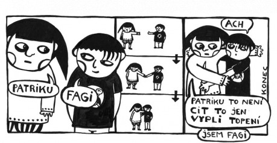
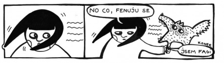
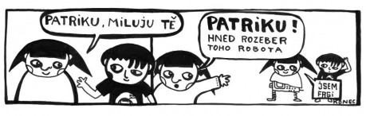

## 5 OTÁZEK NA AUTORKU

__Fagi se dostala (jako jedna z mála comicsových postav v Čechách) až na divadelní prkna. Viděla jste Svět podle Fagi a jaký podle Vás byl? Měla jste přímý podíl na dramatizaci?__

> Nevadí mi dostat se na prkna. Na rozdíl od lidí. Pro ty je prkno většinou konečná. Ale být na divadle není až zas taková sláva Nebel je i ve filmu. Co platno?! Nebel jméno slavných nadarmo. Divadlo dno už hrálo _Svět podle Fagi_ 200x a nepřestávají (program na [www.divadlodno.cz](http://redir.netcentrum.cz/?noaudit&url=http%3A%2F%2Fwww%2Edivadlodno%2Ecz)), je­DNOu si na ně přijdu. Oni si na mě nepříjdou!

__Zestárne někdy Fagi, nebo zůstane navždy „třináctiletou comicsovou holkou“?__

> Comiksové postavy myslím neumýrají. Smrti se nebojím. Bojím se gumy.

__Tato otázka napadne snad každého čtenáře Jsem Fagi!, takže ani já ji nemůžu opomenout a nezeptat se na ni – je Fagi Vaším alteregem?__

> Co je na „Jsem Fagi“ nejasného? Já jsem Fagi!

__Díky výrazné pointovanosti a humoru jazykových „variací a deformací“ je Fagi pochopitelně spjata především s comicsovými stripy, ale uvažovala jste někdy o tom, že byste Faginy příhody rozvinula do větší epické šíře a vyzkoušela si rozsáhlejší tvar?__

> Už v půlce téhle otázky jsem byla unavená.......... život je stryp, vžžžm a už je líp.

__Výraznou postavou comicsu Jsem Fagi! je kromě ústřední „černobílé a placaté“ Fagi a několika dalších postav i poněkud směšnohrdinský Patrik – nikdy se nevzdávající a věrně milující Fagi, která ho však vytrvale odmítá. Dozvíme se někdy proč?__

> Ne!
