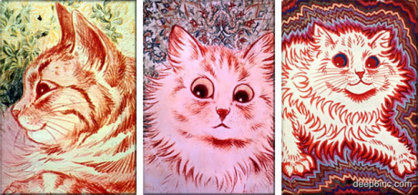
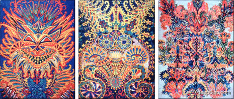

## Případová studie: Louis Wain

Kdo toto jméno už někdy slyšel, ten si pod osobou [Louise Waina](http://cs.wikipedia.org/wiki/Louis_Wain) (1860–1939) zřejmě vybaví anglického malíře, známého pro svůj osobitý styl – tematikou Wainových maleb byl každodenní život polidštěných koček – svým způsobem šlo o parodická znázornění lidského počínání.

Wainův příběh ale není tak šťastný, jak by veselé kočičky z jeho obrazů mohly napovídat. K malování se dostal roku 1884, kdy začal kreslit kočky a koťata pro rozveselení své těžce nemocné ženy. Roku 1886 mu žena umírá, ale Wain maluje dále. Po další sérii traumatických událostí, cca po dvaceti letech, se u Waina objevují první známky duševní nemoci. Tehdy se Wain vrací z New Yorku v tíživé finanční situaci a navíc mu v té době umírá matka. Psychická zátěž zanechává svoji stopu – Waina sužují nestabilní nálady, nesouvislá řeč, bludné představy. Začíná vnímat svět okolo sebe jinak a tato změna se otiskuje i v jeho obrazech. Zažívá halucinace; své doktory přesvědčuje, že na rozdíl od ostatních lidí dokáže vidět a cítit elektromagnetické vlnění obklopující živé tvory. Věří, že toto vlnění z okolního prostředí vstupuje do jeho těla, kde nadále ovlivňuje a mění jeho mysl. Zavírá se u sebe doma, přeskládává nábytek a píše nesmyslné spisy. V roce 1924, kdy se Wainovy výkyvy nálad vystupňovaly tak, že se o něj jeho příbuzní už nezvládali starat, byl hospitalizován v psychiatrické léčebně, kde strávil zbytek života. Maloval však až do konce svého života (1939) – ač výtvory z poslední fáze Wainova života měly stále znázorňovat jeho oblíbené téma, kočky, tak se Wainův způsob jejich vizualizace vzdálil srozumitelnému vyobrazení natolik, že kočky se zde naprosto ztrácí v abstrakci.

Tyto obrázky ukazují na postup Wainovy nemoci, kdy se malíř svým vnímáním postupně vzdaloval okolnímu světu:

První dva až tři obrázky rozpozná většina lidí jako kočky spolehlivě; mám-li se ale pokoušet hledat nějaký objekt jednoznačného určení v posledním kusu, nemůžu jej nalézt ani po několikaminutovém zkoumání (ani v případě, že uplatním výhodu počátečního očekávání, kdy vím, že mám v obrazci hledat kočku). Z pohledu kreativity pak považuji za nejzajímavější obrázek čtvrtý – v následující kapitole vysvětlím proč.

## Tvůrcův paradox

Kde leží definice kreativity? Tolikrát omílaný citát, který praví, že jde o „schopnost vzít stávající poznatky a aplikovat je na nové/neznámé/nevyzkoušené cíle“, tu přijde vhod. Hned si také ukážeme proč (a jak).

Přiměřeně zvládnutá tvůrčí práce (třeba ta designérská) se nachází kdesi mezi dvěma póly – mezi bránou nekonečné představivosti a mezi střízlivou skutečností. Jedním extrémem je předvídatelná každodenní nápodoba reality (kde nám vytknou, že jsme vlastně žádnou kreativitu nad zvoleným tématem neprovedli); a za protipól této mundánnosti si dosaďme nesrozumitelný, nepochopitelný a neuchopitelný chaos… chaos, jako třeba ten Wainův – neřízenou kreativitu, která vytváří díla bez jednotících témat. Takto vznikající díla většina příjemců neocení, protože se utopí v jejich nepřehlednosti.

> Pozn.: jde-li o kreativitu reprezentativní, nikoliv abstraktní, pak se tu schopnost vyznat se předpokládá, protože daná reprezentace tu je předávána komunikačním médiem od příjemce k adresátovi, jako kódovaný symbol, u nějž se předpokládá (mimo jiné) informační hodnota.

Domnívám se, že nejvydařenější autorské výtvory jsou takové, které nechají svého diváka trochu bloudit, něco si domyslet či propojit s vlastním repertoárem zažitých pocitů, přitom si ale dokážou pohlídat, aby publikum nesešlo z cesty a neztratilo se. Cesta myšlenkových pochodů tu je naznačena klíčovými body, které si každý propojí a projde (jako kdyby svými duševními procesy vytvářel omalovánky a spojovačky pro děti); při recepci díla diváci něco zakusí (zdatný autor dokáže ve svém publiku probudit emoci určitého druhu) a nakonec se (mj. i díky obdobnému fungování mozku u zdravých jedinců) dostanou ke zdárnému vyústění daného dojmu – tak, jak autor zamýšlel (mozky většiny lidí, totiž v jistých ohledech skáčou po těch stejných mentálních zkratkách). Divákův výsledný dojem z daného výtvoru bude po tomto prožitku hodnocen kladně a vysoko, protože sám divák pocítí, že se v prožitku promítnul – že daný výtvor, jehož cestou si prošel, souzní s jeho obecnou lidskou zkušeností.

Výtvor příliš nesrozumitelný může být zavrhnut jako „prostě divný“, protože se k němu člověk nedokáže sám vztáhnout a nalézt schůdnou cestu k porozumění. A výtvor příliš obyčejný bude nezajímavý, protože zážitkové cesty, které by si při jeho pozorování měl člověk projít, budou tak zprofanované, že kdejaký divák hned skočí k závěru, poznávaje, kam daná cesta vede.

Zdravá kreativita se pozná i ve schopnosti nalezení správného poměru mezi známým a neznámým materiálem, aneb také v nalezení kouzelného středobodu, chcete-li – je žádoucí trefit tento iluzorní středový bod tak, aby vytvořil bohatou cestu prožitkům publika, a zároveň tak, aby své publikum nesvedl z cesty do chaosu.

## Škálování pro fantasy světy

Chceme tedy onen bod (kterým je myšlen kvalitní design) umístit kamsi mezi všednost a chaos. Kampak se asi tak můžeme trefit, a jak bychom asi mohli dopadnout? Pro názornost zde přikládám takový malý, naivní pracovní model, který umisťuje všelijaké výtvory na pomyslnou stobodovou škálu mezi všedností/chaosem.

> Pozn.: Než svým malým pracovním modelem proženu názorné příklady, musím se přiznat, že jsem byl recenzenty tohoto textu za nadhození takového modelu peskován a kárán. A za co že jsem to byl kárán? No za nedostatečné metodologické zakotvení, přece! Takže pro ujasnění: zabývám se zde primárně vizualizacemi a designovými motivy, ne literaturou. Dále, postmodernu ignoruji, estetiku motivů považuji za podstatnou věc a alespoň matnou srozumitelnost ve vizuální komunikaci za užitečnou nutnost, bez které nelze fungovat. Hodnotím subjektivně a také si plně uvědomuji, že cílem textu nebylo vysvětlit veškeré fungování umění.

Přes všechny výtky a nedokonalosti je třeba mít na paměti, že nějaký model je lepší než žádný. Proto, zkusme tento model o všednosti/chaosu nyní uplatnit – popsat jím několik více či méně známých příkladů:

- __90/10__ – Faerun a/nebo stovky klonů Pána prstenů. Tak tomuto říkám fantasy svět pro konvenční jedince (svět je plný lidí či skorolidí; ústřední motivy bývají také docela všední (či typické pro danou kulturu)). Politicky korektní, nastavené demografickému průměru. Neurazí, ale ani neohromí.
- __75/25__ – Hvězdné války. Svět je pestřeji vyvedený ve vizuálních detailech, ale od svých ústředních zápletek, které se drží zavedeného schématu, se narace nevychýlí (pořádní mimozemšťané tu sice jsou … ale jen na okrasu). Hlavní protagonisté jsou stále lidé a děj se točí okolo nich.
- __60/40__ – Tékumel, Albion, Riddick. Lidé stále setrvávají v záběru, o svůj prostor se ale musí dělit s okolními podivnostmi (neznámé kultury, mimozemšťané, neprozkoumané krajiny, atd.).
- __40/60__ – Oddworld, Coraab. Už žádní lidé či jiní klasikové, ale jen neznámé světy a mimozemšťané (aspoň že mají dvě nohy a dvě ruce … většinou).
- __20/80__ – Neznám svět, který by kdy zašel tak daleko (v této fázi by těla živých stvoření nabývala absurdních tvarů a/nebo splývala s (ne)hmotou prostředí; z dorozumívání a emocí zdejších inteligentních tvorů bychom nebyli schopni nic vyčíst, atd.)
- __0/100__ – Nepopsatelné. To bychom neviděli, neslyšeli, necítili, a tudíž ani nepochopili.

A teď přidávám několik postřehů, které se takové škály mohou týkat:

__Zub času zanechává na výtvorech své stopy a lidské mysli předurčuje k subjektivismu.__ Když uvážíme, že lidé jsou přizpůsobiví, pak jim lze některé typy motivů snáze přiblížit. A to ne nutně násilně – stačí lidský druh chovat v takovém prostředí, kde se s danými motivy budou často setkávat. Když je zasypeme určitými motivy, třeba budou schopní vykazovat vyšší míru tolerance vůči podivnostem – aspoň určitým směrem. Nicméně něco zůstane známé a tolerovatelné, jiné se jim však stále bude jevit jako podivné. Když se dnes seznámíme se středověkým chápáním smrti, je pro nás tento pohled podivný, protože s každodenní zkušeností dneška souvisí minimálně. Středověký člověk se ale pohyboval ve „svém“. Stejně tak i já se zde dopouštím prohřešku, když se oháním výše zmíněným příkladovníkem více či méně podivných světů. Hřeším proto, že ty podivné světy jsou podivné jen vůči mému vkusu, zkušenosti k danému datu a osobnostním dispozicím k toleranci nového. Ale ani takový odhad není jen k ničemu – může být docela trefný. Více viz následující postřeh.

__Masová produkce neriskuje.__ Největší koncentrace výtvorů/produktů zachovává vysokou všednost motivů; komerčně financované produkty neexperimentují a nevstupují pod pomyslnou hranici 80/20, raději zůstávajíce u pár konzervativních nápadů. Současné i minulé komerční hity a bestsellery se až na výjimky usazují na tomto bezpečném intervalu – a to proto, že jejich tvůrci chtějí pokrýt co největší část populace (být normální zde znamená nízkou toleranci vůči novotám). Dá rozum, že když je ve vývoji draze financovaný produkt, jenž má uspět u mas, jeho tvůrci prvně provedou průzkum úspěšnosti titulu na vzorku osob, jenž má reprezentovat cílenou masu. Mezi originalitou produktu a jeho úspěšností na trhu pak existuje nepřímá úměra.

__Škálu lze (někdy) chápat ve více rozměrech.__ Pokud označuji Hvězdné války hodnotou 75/25 a přitom tvrdím, že většina hitů neklesne pod hranici 80/20, zadělávám si na drobný paradox. Pro objasnění tedy: Hvězdné války jako svět disponují svojí porcí novátorství (odhaduji na oněch 75/25); Hvězdné války jako film jsou úplně tuctové. Takže uvažme, že v některých produktech (či přímo v některých médiích) může splývat více kreativních vstupů. Jestli se tyto vstupy v konzumentově konečném dojmu jaksi zprůměrují, toť otázka.

__Tolerance konzumentů má svoji mez.__ Konzumenti se nebudou věnovat příliš novátorským výtvorům, protože ty jim budou připadat podivné. Čím nestandardnější počin vznikne, tím větší procento konzumentů ztratí zájem. Jsou výtvory, které by člověk s (alespoň částečným) kontaktem s realitou nevymyslel, nepochopil; a když mi dáte jeden nesmysl a deset popletených podivínů, můžeme se vsadit, že se nám dostane deseti různých vysvětlení. Přesto výtvor na hraně únosnosti lze druhým přiblížit za pomocí nabídnutí styčných ploch. Řekněme, že podivnost jednoho rozměru může autorům projít za cenu rázného zevšednění jiného rozměru škály (představme si např. MMORPG hru z netradičního prostředí, která ale používá naprosto tuctové herní mechaniky), příp. opatrným posouváním hranic při vyprávění dlouhodobějšího příběhu. Tento přístup nabízí bezpečnou poznávací bázi, z níž se lze vydávat k objevování neznámého.

Jste normální? Pokud jakkolivěk fušujete do kreativního řemesla, ať už designového, či jiného, pak patrně zrovna normální nebudete. Však taky nikdo normální nic zajímavého ještě nevymyslel. Zastoupení podivínů a excentriků bude zrovna mezi kreativci slušné. Ale já po vás teď nechci, abyste se dívali do zrcadla. Naopak, tady máte [kočičí obrázek na rozloučenou](http://www.tentonhammer.com/node/72979).
