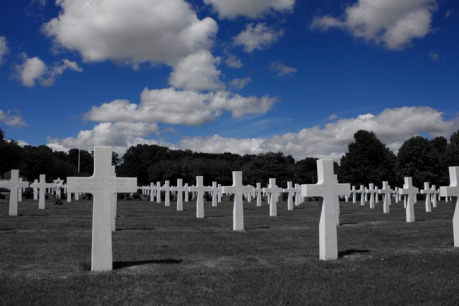

Tento článek volně navazuje na dvojici článků _Ohromné vesmírné bitvy_ a _Ohromné planetární bitvy_, které vyšly v Drakkaru [číslo 19](http://drakkar.sk/download/vydani/drakkar_2010_19_duben.pdf). Oba řešily, jak by se daly hrát velké bitvy z prostředí science fiction v RPG. Zatímco první se věnoval mohutným bitvám ve vesmíru a druhý pak bojům na planetě samotné, text, který čtete nyní, se zaměřuje na jednu z nejobtížnějších vojenských operací vůbec – a to vylodění a invazi na nepřátelské planetě. Během invaze dochází k těžkým bojům ve vesmíru, na obloze i na zemi, osud nejen bitvy, ale i války samotné visí na vlásku. Statečné činy jediného vojáka či velitele mohou rozhodnout o úspěchu, či porážce… a to je prostor pro postavy a hráče.

Tento článek se soustředí na případy vylodění, kdy je potřeba se vyloďovat pod palbou na bráněných územích. Často dojde k situaci, kdy se na planetě nachází spojenec, u nějž je možné pozemní jednotky vylodit bez boje, případně se tam nacházejí plochy, kde je možné vylodit vojska bez obav… Ale pro tento článek vycházím z toho, že občas dojde k tomu, že se obránci musí vyloďovat pod palbou… a upřímně řečeno, je to ten nejzajímavější případ. Pokud se vojska vylodí pokojně, je to záležitost logistiky a je to zajímavé jen málo. Vylodění pod palbou je to pravé spaceoperové dobrodružství, takže vycházím z toho, že ve valné většině případů ve vašich hrách bude z nějakých důvodů potřeba vyloďovat se v bráněných oblastech.

## Příprava invaze

Invaze je jedna z nejobtížnějších vojenských operací vůbec. Musí být perfektně a do detailů naplánována, jinak velmi pravděpodobně selže, nebo utrpí strašlivé ztráty. Již měsíce před vyloděním se v oblasti vylodění toulají „turisté“ se snímkovacími zařízeními, agenti kupují geologické rozbory a mapy z úřadů, shromažďují všechny videozáznamy, kde se místa vylodění objeví, a speciálně upravené lodě pod neutrální registrací prolétají a dělají satelitní snímky. Souběžně s tím zuří válka agentů, kteří se snaží získat informace, koupit důležité úředníky a důstojníky, zatímco zároveň se snaží přesvědčit druhou stranu, že vylodění proběhne někde úplně jinde. Tady je prostor pro postavy, aby se v malých skupinách nebo osamoceně zapojily do získávání informací a tajných operací na zmatení protivníka.

Ve chvíli, kdy jsou data shromážděna, začíná se připravovat plán, superpočítače s výpočetní kapacitou celé planety rozjíždí analýzy všech možných scénářů a začínají se sbírat lodě a vojska k vylodění. Ve chvíli, kdy je shromážděna útočná flotila, se invazní vojska nalodí do přepravních transportérů a je připraven plán a průzkum, je čas, aby flotila vyrazila do bitvy.

## Vesmírná bitva

> Na všech bojových postaveních se rozeřvaly sirény, když radary a satelity zaznamenaly mohutnou bojovou flotilu, která se přiblížila k oběžné dráhy planety. Na palubách bitevních lodí se rozlehlo dupání bot, když všichni spěchali na bojová postavení, zatímco křižníky vyrazily protivníkovi vstříc a orbitální bojové stanice začaly aktivovat své obranné systémy…

Ve chvíli, kdy se útočící flotila vynoří u cílové planety, přichází na řadu regulérní vesmírná bitva s protivníkovou flotilou, hlídkovými loděmi a orbitálními stanicemi. V ní se transportní, tankovací a zásobovací lodě drží zpátky, zatímco bitevní lodě a křižníky postoupí kupředu, aby se střetly s protivníkem, a další brání transporty před protiútokem protivníka.

Ideálním výsledkem je samozřejmě zničit nepřátelskou flotilu a tím vytvořit volné pole působnosti pro invazi, ale to je jen zřídkakdy možné. Klíčové planety jsou málokdy ponechány bez potřebné ochrany, takže na oběžné dráze se rozhoří těžká bitva, v níž se útočící strana snaží vytvořit si __místní převahu__ dostatečnou na to, aby mohla co nejdříve dostat dolů vojska (a nedala čas nepřátelům na zemi, aby se na ni lépe připravili) a zároveň mohla v této oblasti bránit zásobovací trasy a předmostí.

Většina bitev bude vypadat tak, že si útočící flotila vytvoří prostor pro výsadkové lodě (odrazí obránce, zničí orbitální stanici a obranné satelity), a zatímco budou vojáci přistávat, bude pokračovat bitva ve vesmíru (jejíž výsledek je životně důležitý, protože když vlastní fotila prohraje, tak je výsadek odsouzen k neúspěchu i v případě, že zvítězí, protože je odříznutý od zásob a posil).

Flotila může z vesmíru podporovat výsadek __orbitální palbou__. Větší lodě mohou přesměrovat většinu energie do iontových, či orbitálních děl, které jsou dostatečně silná, aby prorazila atmosférou a děsivou silou drtila obranná postavení na zemi. Tyto lodě se ale nemohou podílet na vesmírné bitvě a musí mít vlastní doprovodné lodě, které je budou chránit, admirál jich proto pro podporu pozemního útoku nemůže vyčlenit příliš mnoho, protože tyto lodě by mu chyběly jinde. Pokud jich bude příliš málo a budou pálit příliš krátce, nepovede se zničit nepřátelská postavení protiletadlových baterií a výsadek bude mít ve vzduchu strašlivé ztráty, pokud vyčlení příliš mnoho lodí, pak jich nezbude dost na vesmírnou bitvu (a kanony větších ráží na větších lodích velmi citelně scházejí) a flotila bude poražena. Obvyklou taktikou je tak vyčlenit několik lodí, které sice soustředěnou palbou naruší nepřátelská postavení, ale nezničí pevnější bunkry a většinu sil protivníka, se kterými musí svést pozemní bitvu invazní oddíly.

Vesmírná a pozemní bitva jsou tak dvě spojené roviny – dvě oddělená „bojiště“, jejichž výsledky ale přesto vzájemně ovlivňují jedno druhé. Orbitální bombardování z vesmíru ovlivňuje bitvu na zemi, zatímco úspěch na planetě (ničení planetárních děl schopných ohrozit lodě, případně obsazení velitelství protivníka, které zhorší koordinaci nepřátel) zase zespodu směrem do vesmíru. Hráči se tak mohou rozdělit (někteří budou bojovat bitvu na zemi, další pak ve vesmíru), a přestože bojují na dvou různých bojištích, bojují stejnou bitvu, jejíž výsledky jsou provázány.

I výsledky bitev jsou provázány. Pokud zvítězí flotila ve vesmíru, ale výsadek na zemi je odražen, pak invaze skončí neúspěchem. Flotila sice může planetu z vesmíru ostřelovat, ale nemá možnosti, jak ji zabrat (pokud nesestaví druhý výsadek z vojáků, kteří zbývají, a narychlo zverbovaných posádek lodí). V případě, že výsadek zvítězí, ale flotila prohraje, je pozice vojáků na zemi velmi obtížná, ale ještě není vše ztraceno. Znamená to, že výsadek je odříznutý od podpory a zásobování a buď bude časem nucen kapitulovat, nebo ustoupit do neprostupného terénu a vést partyzánskou válku. Pokud bude ale pozemní armáda úspěšná, může se jí podařit rychle obsadit pozemní štíty, které brání orbitálnímu bombardování, obsadit protiorbitální děla a obrany… což znamená, že protivník bude muset dát dohromady vlastní vojsko, aby je odtamtud dostal… a každý den, kdy se brání, dává čas vlastní flotile, aby se zkonsolidovala a přišla je vysvobodit.

## Výsadek!

Když se flotila probije skrze blokádu na orbitě, pak se v první vlně vylodí __speciální jednotky__, aby lasery osvítily cíle, sabotovaly důležité zařízení a ničily protiletadlové obranné kanony. Ty mohou být na místě umístěny už s předstihem, pokud to není možné, jdou dopředu mezi prvními. S nimi se z lodí vylodí __výsadkáři__ v osobních kapslích, kteří tvoří čepel útoku a jeho první vlnu.

V každé malé kapsli seskakuje palebné družstvo čtyř mužů. Jsou vysazeny s množstvím klamných cílů (které budou vysílat, manévrovat, vystřelovat výmětnice a dělat hromadu dalších věcí, aby se tvářily jako kapsle), stejně jako hromadami smetí a grafitovými bombami, které budou postupně během sestupu explodovat a zahlcovat obrazovky obranných počítačů. Tím dávají vojákům dost velkou šanci dostat se dolů. Kapsle tvoří jen malé cíle a pozemní obrana má jen omezenou dobu, po kterou je může ohrozit. Díky tomu, že jsou rozptýlení do mnoha malých kapslí, neznamená ztráta několika kapslí ztrátu několika oddílů, ale jen jednotlivých vojáků.

Výsadkáři dopadnou roztroušení po větší oblasti (ale nijak zásadní, protože jejich sestup je korigován tryskami a padáky a jsou vysazováni podle počítačem propočítaného vzorce), ale jsou dobře vycvičení a vyzbrojení, takže dokážou nadělat dost škody i odděleně (nota bene, když mají na sobě brnění nebo exoskelety a těžké zbraně). Jednotlivě nebo v malých skupinkách mohou obsadit kritické body, přepadat hlídky, přerušit zásobování a komunikaci, stejně jako obsadit sklady zásob, paliva a důležité křižovatky, kterými proudí nepřátelům posily.

Primárním cílem výsadkářů je připravit a udržet předmostí, kam se mohou vyloďovat další vlny v transportérech bez toho, aby se ocitly na zemi pod přímou palbou. Ve chvíli, kdy se jim to podaří, signalizují svůj úspěch nahoru a začíná další fáze vylodění. Dalším z hlavních cílů výsadku, které plní zároveň s přípravou předmostí, je kompletní narušení zázemí v široké oblasti – protivník musí nasadit několikanásobně větší síly, aby výsadkáře našel a neutralizoval. Ti tak vážou kritické množství vojáků, kteří chybí proti hlavnímu výsadku samotnému a dokážou zpomalit přísun nepřátelských posil.

## Vylodění a pozemní bitva

Poté, co na zem dosednou výsadkáři, se palba orbitálních kanonů přesouvá dále od výsadkových zón, protože není nijak chirurgicky přesná a hrozilo by, že zničí vlastní, těžce dobyté pozice. Přesune se tak dál do vnitrozemí, aby ničilo cíle nebo odřízlo jednotky, které mají posílit obránce. Váha pozemní podpory se přesune na atmosférické stíhače a bombardéry, které jsou nyní nasazeny z vesmírných lodí. Bitva se tak rozpoutá i na třetím „bojišti“, a to přímo v atmosféře, kde se stíhače snaží vybojovat vzdušnou nadvládu a vytvořit bezpečný prostor pro transportéry s vojáky, aby mohly v bezpečí přistát.

Díky orbitálnímu ostřelování a snahám výsadkářů by měla být nyní většina protiletadlových děl vyřazena z provozu, takže dolů se mohou pustit výsadkové transportéry, které na připravená předmostí vylodí oddíly druhé vlny. Letouny přímé podpory tak vystřelí rakety na zbývající pozice protiletadlové obrany a udělají místo výsadkovým transportérům, které vezou pěchotu. Další transportéry mají pod trupem tanky a mecha, které shodí do cílového prostoru, aby poskytovaly těžkou podporu invazním vojákům. Transportéry dosednou na chvíli, vylodí vojáky a pak zamíří zpět k lodím, aby pendlovaly mezi výsadkem a flotilou a přisouvaly další a další oddíly. Dolů na planetu vozí vojáky a zásoby, nahoru zpět raněné, kterým se dostane nahoře lékařské péče.

Cílem je udržet výsadkový prostor, než dorazí další vlny, které je posílí, a rozšířit předmostí. Až budou mít v prostoru dost mužů a strojů, tak zahájí v součinnosti s letectvem (stíhací stroje drží nepřátelské bombardéry dál od výsadkové zóny, stroje přímé podpory létají mise proti cílům označovaným ze země) ofenzivu a umlčí nepřátelská obranná postavení v okolí a zajistí celou oblast, aby dolů mohly nerušeně proudit zásoby a další vojáci.

Ve chvíli, kdy transportéry přepraví do předsunutého postavení dostatek vojáků, vyrazí útočící síla z předmostí, které se vybudovalo. Pak se pokusí vzít ztečí nepřátelské klíčové pozice a zajistit je, přičemž tanky vyráží vepředu, pěchota za nimi, mobilní podpora bojových robotů na křídlech. Výsadek se musí probít z předmostí a rozbít nepřátelskou obranu.

## Pozemní fáze operace

Ve chvíli, kdy se mu to podaří a rozšíří předmostí tak, že výsadkové plochy nejsou pod palbou a nejsou nijak ohrožovány, pak je invaze v zásadě úspěšně ukončena a přesun vojsk z orbity může pokračovat nerušeně. Bitva na zemi se pak změní v regulérní pozemní operaci.

Pokud je zároveň poražena flotila protivníka, pak je v mnoha ohledech osud obránců zpečetěn, protože nemohou být (na rozdíl od útočících armád) zásobovány z vesmíru, oběžnou dráhu ovládají nepřátelé, kteří mohou z orbity ostřelovat obranné pozice a města, přičemž na planetu přistává stále víc a víc nepřátelských jednotek. V mnoha případech se obránci raději vzdají, aby uchránili svá města před spálením z vesmíru a zachránili životy svých vojáků, mnohdy se ale pozemní fáze operace protáhne na mnoho dlouhých týdnů, kdy se obránci zakopou a sveřepě bojují o každý čtvereční metr vlastní planety. Jejich odhodlání se jim může vyplatit, pokud se jejich vlastní flotile podaří dát dohromady dost lodí a spustit záchrannou operaci, která rozbije cizí blokádu na orbitě a dodá jim posily a zásoby.

## Závěr

Vylodění na cizí planetě pod palbou je vlastně esencí space opery… mohutné flotily ohromných vesmírných lodí, bitvy mnoha letek atmosférických stíhačů, padající moduly výsadkářů, těžké pozemní bitvy, výbuchy a osudy celé války a velkých civilizací na vážkách… je podle mě perfektní dát možnost hráčům se na něm nějak podílet či se ho účastnit. Pokusil jsem se tu stručně nastínit svoji představu, jak by takové vylodění v budoucnosti mohlo vypadat a jak by se mohlo ve hrách se objevit, abyste měli možnost se jím inspirovat.
