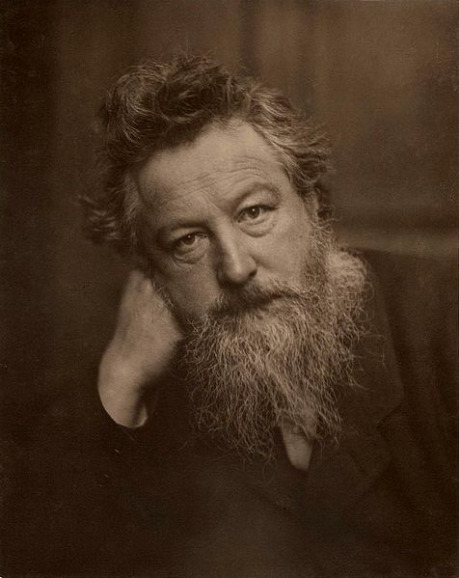

## I.

V mých literárních výletech po jednotlivých žánrech se stalo neplánovanou tradicí, že první díl obvykle rozebere základní pravidla a příklady žánru, které jsou zavedené, nicméně možná právě proto lehce umírající. Druhý díl je potom věnován těm autorům, kteří se z původního žánru pokusili prolomit jinam a v mnoha případech se jim to podařilo. Tato část žánru je hůře definovatelná, méně prozkoumaná, ale možná právě proto daleko slibnější pro vlastní experimenty. Čímž se druhé díly stávají vlastně důležitější než první.

V případě historické fikce tomu nebude jinak. Poznání, že _historická fikce není a neměla by být učebnicí historie,_ se těm nejinovativnějším vypravěčům stalo hlavní devizou. Začali pronásledovat jiné cíle bez ohledu na to, že tím přišla historie trochu zkrátka.

Tím ovšem vznikl terminologický problém. Zatímco první polovině historických fikcí, která jakž takž vychází z platné _historie, jaká byla_, a kterou jsme probrali minule, se u nás říká _historický román,_ ta druhá polovina univerzální jméno nemá. Jméno _historical fiction_ v anglické verzi pokrývá obě poloviny historických světů s tím, že je to vlastně fikce tak trochu _vždycky,_ jak jsme si vysvětlili.

Speciální pojem na případy, kdy autor sice využívá historii, ale provádí s ní úmyslně různé prostocviky, v češtině neexistuje. Zkoušel jsem tomu říkat _manipulovaná historie_, ale postupem debaty na toto téma a zkoumáním dalších případů se mi zdá, že to asi vůbec není jednotný žánr, nýbrž složitá směs všeho možného, co spolu v mnoha případech nemá mnoho společného.

Takže se nakonec vracím pokorně k univerzálnímu širšímu pojmu _historická fikce_ a nechávám záhady terminologie nevyjasněné. Představme si tento pojem jako kontejner, obsahující trochu nesouvislou směs různých žánrů, které spojuje jen velmi široká souvislost s historií.

Zde je nutné ještě jedno osobní vyznání. Zatímco fantasy, sci-fi nebo detektivka jsou žánry, které mi kdysi byly vlastní, ale nakonec jsem těmito metodami víceméně psát přestal, potom má historie – zejména na tento druhý, manipulovaný způsob – pro mne úplně zvláštní postavení. Je pro mne naprosto aktuální a živá; není to něco, co jsem prozkoumal, zavřel do krabice, převázal mašlí a odložil do archivu, ale něco, co mi setrvale roste pod rukama.

Pročež budou tentokrát díly rovnou tři. Bojte se.

## II.

Objev, že historickou věrnost vyprávění lze klidně nechat plavat, aniž by se stalo něco hrozného, byl učiněn již velice dávno. Dokonce tak dávno, že se běsnění takového Tolstého teprve rozebíhalo; v polovině 19. století. Prvotním vynálezcem je podle všeho [William Morris](http://en.wikipedia.org/wiki/William_Morris) (1834 až 1896), muž v Anglii velice slavný, estét, intelektuál, který je také zakladatelem uměleckého designu a kvůli němuž G. B. Shaw prosazoval nový typ divadla. Osoba, bez níž by viktoriánská doba vypadala jinak.

Znamenitý pan Morris, jenž měl zřejmě k dispozici jako vzor zejména Waltera Scotta, postřehl obtíže, které se vážou k ideji historického románu. Zjistil, že je nesmírně obtížné a pracné zachytit reálnou historii věrně. A hlavně, vlastně ho to vůbec nezajímá a jenom zdržuje od vlastních plánů. Takže vědomě rezignoval na historickou věrnost a vybral si místo toho ty vlající korouhve a rytíře. Načež začal psát již v roce 1851 (!) o těch korouhvích a rytířích ve fantastických zemích, o kterých nikdo nikdy neslyšel. Vlastně to velice silně připomínalo starodávný rytířský román, jenž byl údajně opuštěn a pohřben po Cervantesovi.

Pokud se vám chce zvolat, že to je dočista jako J. R. R. Tolkien, nebo ještě přesněji G. R. R. Martin, tak ano, hádáte správně. Českému čtenáři byla tato objevitelská epizoda utajena na dlouhá léta. Teprve poměrně nedávno jsem narazil na dost ojedinělý Morrisův text ve výboru _Krypty a draci_. Musím říci, že jsem na to koukal hodně vyjeveně. Především na to, jak velkolepě to je napsané. To takový Martin, ať se na mne nezlobí, se má přece jen ještě co učit.

Při tom je u všech tří těchto pánů, tedy Morrise, Tolkiena a Martina, kontaminace historií jasně patrná. To, že je dnes obecně pokládáme za žánr _fantasy_, je jen jistý způsob vidění problému, který vznikl u dvou starších autorů až dodatečně; původně byla jejich díla chápána stále jako velmi svérázný případ historické fikce.

Například kontaminace Středozemě naší skutečnou středověkou historií a mytologií je snadno doložitelná. Tvar Středozemě podivně připomíná Evropu. Trvalé nebezpečí a bájné země jsou na východě, naopak božstva sídlí za mořem na západě. Pod nánosem údajně fiktivních událostí, míst a postav už byly odhaleny reálné historické nebo alespoň mýtické předobrazy. Gandalf je tak trochu Ódin, Glaurung je tak trochu Fáfnir a Smaugh je tak trochu drak z Beowulfa. A tak dále. Hranice mezi fantastickým a historickým je tu stále ještě povážlivě těsná.

V každém případě, nakonec tento způsob psaní k jasnému rozchodu s kanonickou historií vedl. A pravověrná __fantastická fikce čili fantasy__ se stala něčím zjevně odlišitelným od fikce historické. Postupně se ustanovila fantasy jako žánr zcela samostatný a kolosální; ale dodnes nese jasné znaky kontaminace historií, které jinak nelze rozumným způsobem vysvětlit. Například nesmírnou oblibu rytířů a šermování ve většině fantasy světů.

Nicméně, s ohledem na vydavatelovy možnosti a trpělivost čtenáře tuto zásadní evoluční odbočku raději dále sledovat nebudeme, protože bychom hned tak neskončili.

## III.

Vynález byl potom učiněn znovu a úplně jinak. Důvodem druhé odbočky od kanonické historie byla _satira_. Autor cítil potřebu demonstrovat, jak nesmírně veselé by bylo _setkání moderní postavy s historickým světem_. Historii při tom nechal v nezměněném, jiráskovsky nedotčeném učebnicovém stavu a jen tam poslal úplně cizího hrdinu, současného člověka. Že to jako bude švanda.

Tím byl vynalezen odlišný subžánr historické fikce, který lze nazvat __Návštěvníci__. Jmenoval se tak jeden český seriál s podobným tématem, kde _Návštěvníci_ přicestovali do současného světa z daleké budoucnosti. Daleko přesnější případ jsou francouzští _Návštěvníci_, kteří připutovali taktéž do současnosti, ale z protisměru, ze středověku. A děla se jim tu různá veselá protivenství. Tady už je souvislost s historickou fikcí daleko zřejmější.

Tento zdánlivě moderní nápad se kupodivu zjevil již v roce 1888. Svatopluk Čech tehdy poslal v _Novém epochálním výletu pana Broučka, tentokrát do XV. století_ svého současného hrdinu mezi husity, jak prozrazuje složitý název díla. Čechův současník Mark Twain provedl o rok později něco podobného a opět to prozrazuje název jeho díla – _Yankee z Connecticutu na dvoře krále Artuše_. Hrdina postřílí na turnaji nějaké rytíře a demonstruje tím, že dneska jsou Yankeeové onačejší kabrňáci než nějací rytíři. O historii tu v obou příkladech vlastně nejde, daleko důležitější je autorova současnost, na kterou dílo míří. Čech se vysmíval soudobému měšťákovi, kterého vystavil přímé konfrontaci s husity. Jo, to dříve, to bývali Čechové, stateční rekové, ale dnes to stojí za houby. Twain se naopak vysmíval těm rytířům. A _Návštěvníci_ se smáli tak nějak všeobecně oběma stranám.

Většina těchto příběhů je celkem prostoduchá záležitost bez hlubších ambicí, ale je velice zajímavé, jak se ve většině z nich občas silná a zajímavá situace neplánovaně prosadila a vytvořila docela velkolepé scény s uměleckým dojmem, které tak nějak vybočují z obyčejné švandy. Nějak si to jede po svém a autorům se to trochu vymklo z ruky. Matěj Brouček je možná zbabělec a trubka, ale na mnoha místech působí rozumněji než agresivní jiráskovsky pojatí husiti. Yankee na dvoře krále Artuše je sice největší mlátič, ale také působí trochu dojmem brutálního vidláka, který se vetřel do salónu a tropí tam škodu; a ostatně, v závěrečných scénách, které jsou vlastně tragické a mimo plán, má hrdina pocit nejasné ztráty. Udatný rytíř z _Návštěvníků – ať zhynu, jestli ustoupím!_ – není vždy bez výjimky směšný, ale občas docela velkolepý.

Nápady na satiru souvisí s pravou historickou fikcí poměrně volně, nicméně občas to nezamýšleně zafunguje. Model _návštěvníci_ zdaleka není mrtvý; ale pokud by se někdo na tuto trasu vydal, měl by rozhodně přemýšlet o kus déle; použít to jako pouhou satirickou veselici znamená část potenciálu zabít.

## IV.

Pokud fantasy vznikla přímo odštěpením z historické fikce, pak se zákonitě muselo stát, že se historická fikce zkřížila v mnoha případech i se _sci-fi_, čili česky _vědeckou fikcí_. Především je kolosálním tématem samotný _běh času_.

Už praotce zakladatele H. G. Wellse napadlo vynalézt _Stroj času_ (1895), čímž sice nestihl vynález _návštěvníků_ o pár let, nicméně mu dodal pseudovědecký základ. Sci-fi je považována za žánr, jenž míří především do budoucnosti, takže pan Wells cestoval přirozeně tímto směrem a poněkud mimo naše téma. V každém případě můžeme pracovně tyto zkříženiny sci-fi a historické fikce označit jako __cestování časem__. Od _návštěvníků_ se liší vlastně jen tím _vědeckým vysvětlením_, jinak to bývá lautr to samé. Nápady tohoto druhu, vesměs pocházející ze Zlatého věku let padesátých, bývají okouzleny časovými paradoxy, technickými rekvizitami a opravdové historii se většinou vyhýbají jako čert kříži; možná je v tom prostě autorovo vědomí vlastní nedostatečnosti, že by něco takového nezvládl napsat. Takže se našeho hlavního tématu dotýkají spíše jen okrajově a v mnoha případech je asi přesnější je řadit ke sci-fi než k případům historické fikce.

Hodně nápadů tohoto druhu vydalo pouze na short story. Proslulá a opravdu velkolepě napsaná povídka je Bradburyho _Burácení hromu_ (1952), podle níž zřejmě vynalezl později matematik Edward Lorenz takzvaný _motýlí efekt._ Jiná podobná zakladatelská legenda jsou Heinleinovy _Všechny tvé stíny_ z podobné doby.

Oba tyto příběhy, ač zjevně založeny na běhu času, se historii úplně vyhnuly a předvedly typické manévry, jak na to. V _Burácení hromu_ nejde o historii, nýbrž pravěk; tím pádem tam žádné historické souvislosti známy nejsou a vypravěč může tvrdit naprosto cokoli. _Všechny tvé stíny_ jsou zase zcela osobním příběhem, který nijak nevybočuje ze současných kulis; časové roviny jsou od sebe vzdáleny jen nepodstatně. V obou případech tedy nemusel mít autor vůbec žádné znalosti konkrétní historie, aby takový příběh napsal.

Další klasický nápad je, že by _čas běžel obráceně_. Buď pro všechny na celém světě, jako v _Kryptozoiku_ Briana Aldisse (1967), nebo jen pro jediného člověka, což působí ve výsledku drtivě tragicky. Náhodou jsem narazil na asi nejlepší zpracování tématu v _Hyperionu_ Dana Simmonse, takže mne už novější _Podivuhodný případ Benjamina Buttona_ až tak nezaujal.

Využití podobných časových paradoxů bylo tak oblíbené a důkladné, že jsou od té doby pojmy jako _stroj času_ nebo _časová smyčka_ všeobecně srozumitelné, i když jde vlastně o neexistující jevy a rekvizity žánru sci-fi. A jejich využívání pokračovalo kontinuálně i v dalších dobách, kdy už na nich nebylo vlastně nic objevného a sloužily jenom jako prostředek k dalším vyprávěcím možnostem.

Na tomto místě se nabízejí příběhy jako _Terminátor_, který se postupně rozvinul v rozsáhlý svět několika časových rovin, jimiž postavy procházejí, nebo česká komedie _Zítra vstanu a opařím se čajem_. Nebo známý Heinleinův román _Dveře do léta_.

Tyto příklady ukazují slabiny podobného přístupu. Sám nápad bývá jednoduchý, funguje skvěle v short story, ale _na delší příběh to nevystačí_. Takové _Růže pro Algernon_ jsou sice úplně pravá sci-fi, ale běh času tu přesto funguje jako klíčový dramatický prvek. Potíž je v tom, že povídka byla geniální, ale natažení na film s názvem _Charlie_ z toho udělalo takovou nanicovatou věc. Taktéž _Burácení hromu_ fungovalo výtečně na miniaturním prostoru, jako film s názvem _Lovci dinosaurů_ to byla až překvapivá zoufalost. Ostatně, i _Benjamin Button_ je trochu pokažen tím, že pointu si každý snadno domyslí už v první polovině vyprávění. Delší věci, jako zrovna _Dveře do léta_, ukazují, že je nutno nespoléhat na krátkodechý efekt časových kouzel a příběh postavit zejména na něčem úplně jiném. Podobně, když se pokoušte vystihnout podstatu _Terminátora_, je to o všem možném jiném než o cestování časem, které je tu jen vedlejší rekvizita.

Jiný základní omyl je dnes už _vysvětlování, jak k té cestě časem došlo_.

Obvykle se tím podaří příběh zaneřádit rozsáhlým technoblábolem. Čtenář i autor, naučený myslet v určitých paradigmatech, má problém se odtrhnout od pravidel sci-fi, podle nichž má být všechno _vědecky vysvětleno_. Potíž je v tom, že cestování časem v běžném slova smyslu věda vylučuje; je to vychytávka, umožněná teoreticky jen při rychlostech blížících se světlu a živé hmotě je nejspíš smrtelně nebezpečná. Takže vědecké vysvětlení má nakonec vždycky stejnou hodnotu jako kouzelné slova _abrakadabra_, _Arabelin kouzelný prsten_ nebo jiná jednoduchá fantastická rekvizita. Ty mají _proti vědeckému vysvětlení_ navíc tu okouzlující výhodu, že jsou alespoň literárně stručné.

Učebnicový příklad je film _Zítra vstanu a opařím se čajem_, kde jsou další a další cesty časem tam a zpátky stále větší otrava a zoufale to volá po vypravěčské zkratce, jak jsme o ní mluvili v [Kompozici](http://drakkar.rpgplanet.cz/literatura/co-je-kompozice-a-prace-s-casem). Podobně fyzikálně úmorný je pozdní Crichtonův román _Timeline_. V knížce zabírá fiktivní fyzikální veteš přes 100 stran a teprve pak si čtenář oddechne úlevou, že je konečně v tom středověku.

Není problém nechat postavu nebo čtenáře v _návštěvnickém_ paradigmatu odcestovat časem do středověku. Můžeme tak učinit milionem metod a hlavní je s tím moc neotravovat. Například zjištění, že Matěj Brouček se ocitl ve středověku, ušetřilo autorovi spoustu stran k užitečnějším věcem. Vše podstatné začne teprve tímto okamžikem; odpovědí na opravdu klíčovou otázku, _co tam sakra bude dělat._ Tedy – proč se vlastně náš příběh má týkat dané časové roviny; středověku, druhé světové války, starých Řeků? Proč se to celé neodehrává někde úplně jinde?

Mnohem životaschopnější historické fikce vznikne, pokud ji autor buduje z opačného konce; autor má _nápad, který funguje jedině, pokud postavy cestují časem do období XY._ Tedy, _i při cestování časem je to stále ještě historická fikce; motivy, že se tím zabýváme, jsou vlastně úplně stejné_ jako [v prvním dílu pojednání](http://rpgforum.cz/forum/viewtopic.php?f=204&t=12582).

Tedy jestliže víme od začátku přesně, co tam, tak se tam nějak dostaneme a nebudeme s tím moc otravovat. Cesta časem se stane technickou záležitostí, asi jako cesta letadlem do New Yorku; dnes na tom už není nic zajímavého. Teprve když jsme tam, příběh vlastně začne. _Terminátor_ je vzorný příklad nadčasového řešení; celé cestování časem se smrsklo na modrou bublinu a pár porůznu roztroušených poznámek.

Když se vrátím ke Zlatému věku sci-fi a cestování časem, promyšlenějších příběhů podobného druhu, které by obsahovaly i nějakou zajímavější historickou fikci, se vyskytlo poměrně málo. Většinou se soustředily na jednorázový objekt nebo nápad. Například se považovalo za velmi cool konfrontovat historii s nějakým moderním předmětem. Co by bylo, kdyby křižáci zajali kosmickou loď (Poul Anderson: _High Crusade_). Nebo _Tajemná záře nad Pacifikem_, která přenese do druhé světové války moderní letadlovou loď. Vlastně zase variace na _návštěvníky_.

Nebezpečí těchto nápadů je zkrátka v určité plochosti a jednorázovosti. Na short story je to dobré; ale aby z toho vylezla alespoň novela, je toho třeba ještě daleko víc; vztahy mezi postavami, příběh a tak dále.

## V.

Poul Anderson a _High Crusade_ ovšem skrývá docela mocnou větev dalšího hybridu sci-fi a historie, takzvaných __archeokosmonautů__. Jde totiž o to, že kdysi v minulosti přiletěli na Zemi mimozemšťani, případně naše vlastní staré civilizace uměly létat do vesmíru.

Uvedenou otázku kdysi velice zpopularizoval švýcarský hoteliér Erich von Däniken, který na toto téma sepsal několik knih, z nichž asi nejslavnější jsou _Vzpomínky na budoucnost_ (1968). Tento dobrý muž dospěl k docela logické myšlence, že pokud někdy došlo k setkání mimozemšťany, pak není důvod věřit, že by se tato událost trefila do úzkého období našeho krátkého kosmického věku, a spíše je třeba hledat v celých tisíciletích historie, která již proběhla. A hledaje, našel plno slavných „důkazů“ těchto archeokosmonautů a jejich přistání zejména u předkolumbovských Indiánů, v Egyptě nebo na Blízkém Východě. Tímto manévrem přenesl Däniken problém z hájemství sci-fi na půdu reálné historie a přinutil autory s podobnými tématy ke hlubšímu zkoumání zákonitostí žánru. Skuteční vědci Dänikena samozřejmě prokleli do horoucích pekel, aby ho jeho fanoušci o to více milovali.

Slavným místním koryfejem tohoto směru byl u nás Ludvík Souček, který sice kritizoval Dänikena coby pavědce, ale vzápětí nato přinesl plno nápadů podobného druhu, opíraje se o neméně úžasné badatele sovětské. Kromě „vědeckých“ knih na dané téma sepsal i řadu vlastních vyprávění o archeokosmonautech.

Žánr _archeokosmonautů_ obvykle proplétá sci-fi, fantasy a historickou fikci zcela neoddělitelným způsobem a s Lupinovskou drzostí si vypůjčuje ode všech. Pokud přijmeme tu úvodní premisu, potom se nám na scéně mohou vedle sebe vyskytnout mimozemšťani, šermující gladiátoři nebo i nějaká ta entita, u níž je na samotném čtenáři rozhodnout, zda to je starověké božstvo na způsob historické fikce, vesmírná inteligence ze sci-fi a nebo čaroděj vyššího levelu na způsob fantasy. Excelentním příkladem budiž Emmerichova _Hvězdná brána_, kterou jeden kamarád zhodnotil, že _je to, jak odstřelili boha Ra na oběžné dráze_. Hvězdná brána později přerostla v úspěšný seriál. Sice tu nelítají rakety, ale jako by se stalo.

Kdos bez viny, hoď kamenem. Můj úplně prvotní příspěvek k historické fikci se odehrál v úplném pravěku mého psaní, ve věku třinácti let, v povídce, kde šlo o Von Braunovský útok nacistů na New York pomocí rakety, kterou řídí sebevražedný kosmonaut. Nápad jak z _Iron Sky_. Následovala moje první delší věc, o zaniklé Atlantidě, kde se pro změnu proháněli po obloze další archeokosmonauti. A o pár let později následovali kosmonauti současní, kteří pro změnu objevili pozůstatky po staroegyptské výpravě na Saturn.

S těmito osobními zkušenostmi si dovolím následovníky varovat; pokud vás něco podobného také napadlo, _myšlenka není nová_. A zpracování reálií přijatelným způsobem je _extrémně náročné_. Měli byste totiž ovládat dobře pravidla všech tří světů; sci-fi, fantasy i historie. Hrozí, že se vašim chybám budou fanoušci smát, jako se stalo třeba ctihodnému Ridleymu Scottovi po _Prométheovi_, který si také zahrál na tuto strunu (a to jaksi navíc, aniž by ho k tomu příběhová logika nutila).

To, že přenesete událost do šerého dávnověku nějaké té Atlantidy nebo Cimerie, znamená, že se ocitáte také na poli fantasy; tvoříte úplně nový konzistentní svět ztížený tím, že by navíc měl nějakým způsobem navazovat na známý starověk. Pokud operujete třeba v reálném starém Egyptě, protože to chcete okořenit reálnými předměty a stavbami – pyramida je startovací rampa, jak jinak – pak vám nezbývá než zmáknout přijatelně příslušné období starého Egypta a koumat, jak tam ty kosmonauty nebo mimozemšťany elegantně začlenit. No, a pokud se bude létat na Proximu Centauri, pak si musíte dostudovat přinejmenším znalost astrofyziky a sci-fi rekvizit. A to všechno jsou teprve kulisy; nezbavuje vás to té klíčové otázky, _co tam, sakra, budou vaše postavy dělat._

Tyto obtíže mne dost brzy odradily a odchýlily jinam, k nosnějším možnostem. A nemohu se zbavit dojmu, že opravdu výtečné archeokosmonauty, navzdory mnoha známým pokusům, vlastně nikdo nikdy nezvládl. Za docela slušný příklad bych asi nabídl čtvrtého _Indiana Jonese a křišťálovou lebku_.

## VI.

Přes problémy archeokosmonautů se dostáváme k pravé __alternativní historii__. Mnoho lidí razí tento pojem pro _historickou fikci všeho druhu, kde se nějakým způsobem uhnulo od kanonické historie_. Pokládám toto užití spojení za hodně nepovedené. Viděli jsme totiž, že v mnoha případech se sice stalo všechno možné, o čem historie neví, třeba návštěva Matěje Broučka v obležené Praze 1420 nebo v protisměru návštěva rytíře v moderní Paříži, případně proběhla celá historie Atlantidy, ale na _známou historii_ to nemělo vůbec žádný vliv. Navíc je na první pohled zřejmé, že ve většině zatím probraných případů o nějakou alternativu historie vlastně vůbec nešlo. Takový hypotetický středověký kronikář by u Matěje Broučka nezjistil nic zvláštního. Neznámá epizoda se sice odehrála, možná byla z nějakého důvodu i důležitá, ale neměla vůbec žádný efekt na známé pozdější události. Zavřela se nad tím voda jako nad tou Atlantidou.

O skutečnou alternativu historie jde třeba ve zmíněném _Zítra vstanu a opařím se čajem_. Konkrétně, _co by bylo, kdyby Hitler vyhrál válku._ Samozřejmě, socialistický autor se takové úžasné možnosti musel vyhnout a z alternativy historie se uteklo. Podobně jako v sesterské komedii _Zabil jsem Einsteina, pánové_.

Překvapivě příbuzný a zajímavý případ je _Valkýra_. Jde o zcela historický příběh povstání proti Hitlerovi, kde opět k žádné odchylce od kanonické historie nedošlo, leda snad nechtěně; nicméně tu je hlavním tématem úžasná možnost, jaké by to bylo, kdyby jim to třeba celé vyšlo. Nicméně, ani zde příběh ze železného kruhu kanonické historie nevykročil.

Společné má tato kategorie příběhů, že tak nějak všeobecně věří v _nezměnitelnost historie;_ ať děláte, co děláte, dopadne to tak, jak to dopadnout muselo.

Proti tomu existuje škola přesně opačná. Následníci Bradburyho motýla z _Burácení hromu_ tvrdí, že historie se _při jakékoli malé změně začne měnit celá, a to nekontrolovaně a podstatně_. Opět to je „vědecké“ asi tak jako ta teorie o nezměnitelnosti; oboje to nikdo nikdy nevyzkoušel. Nicméně ta Bradburyho škola dává pro vypravěče podstatně širší a zajímavější možnosti.

Někteří autoři se na tento problém úplně vykašlali a směle vykročili k alternativě, aniž cítili potřebu to nějak vysvětlovat. Někdy dokonce tak rychle, že ani nedoběhnou úvodní titulky. Film _Vaterland_. Tam to běží právě jako v _Terminátorovi_; hned na začátku je divák nucen připustit, že Hitler tu válku fakt vyhrál... a že jsme mnoho let od tohoto data. Tohle překvapení je jen podkres příběhu, který vypráví o něčem úplně jiném. A mimochodem, mohl být celkem s úspěchem vyprávěn třeba i v lehce odlišných pozměněných kulisách orwellovského socialismu nebo ještě leckde jinde.

Film _Iron Sky_. To je legrácka a nadsázka; ale princip je úplně stejný; začneme spojením „připusťme, že“ a pak se už historie řítí někam úplně jinam, než jak ji známe.

Mě samotného podobné nápady zasáhly dost podstatně. Zejména ta Bradburyho škola. Po archeokosmonautech mne začaly fascinovat _alternativní historie, založené na motýlím efektu_, kde v důsledku malé pozměněné události se celá historie rozběhne odlišným alternativním směrem. V jednom případě se díky nezdařené popravě jednoho rytíře ve 13. století Čechy stanou evropskou velmocí. V jiném případě díky povstání proti Gorbačovovi, ke kterému dojde o trochu dříve než ve skutečnosti, začne třetí světová válka.

Hodně zajímavé jsou takové věci jako RPG hra. To se dost osvědčilo. Nicméně literárně mi to nikdy moc nefungovalo. Nemyslím si, že by za tím mohly být ty „vědecké“ námitky proti alternativám. Podle mne _v sobě nese alternativní historie jistý destruktivní vyprávěcí potenciál z podstaty věci._ Nejdramatičtějším momentem na ní totiž bývá _začátek_, ten klíčový moment, kdy k odchylce došlo. Tam bývá všechno solidně zakotveno v reálné historii. Čím dále se od tohoto bodu vzdalujeme, tím méně se můžeme o reálnou historii opřít; reálné vazby a jistoty nás postupně opouštějí. Celé paradigma vyprávění, které zpočátku vypadá skoro jako literatura faktu, se postupně rozvolňuje a „rozplizává“ v čirou fantasy. A je docela těžké tomu vymyslet nějaký výrazný konec, který by přebil ten začátek.

Pokud příkladmo spiknutí _Valkýra_ opravdu zabije Hitlera, pak se první hodiny dají docela slušně zrekonstruovat z plánů, které tehdy spiklenci měli. A divák bude žasnout. Některé věci se dají očekávat – odpor věrných, naopak podpora těch, co jim hrozila při dalším pokračování války zkáza a smrt. Ale čím dál postupujeme, tím méně máme jasno; kapitulace Německa bude okamžitá, nebo s určitým odstupem? Jak budou reagovat Spojenci na nově vzniklou situaci? Nebude třeba takový Stalin prostě pokračovat ve válce, která mu teprve v závěru přinesla nějaký územní prospěch? Každá taková další situace předpokládá další rozhodování, o kterém nevíme vlastně nic, protože taková otázka vůbec nebyla historií položena. Další scénář, jak se posouvá dál a dál, je stále vratší spekulací. Pokud má příběh ambice dosáhnout většího rozměru, tento efekt se posiluje a v jistém momentě čtenář musí konstatovat, že dál se vlastně mohlo stát úplně cokoli. To, čím okouzlil autor čtenáře na začátku, ohromující přesností a detaily, se úplně rozpadá. Historická fikce přichází o svoji hlavní zbraň. Jde třeba stále o zajímavý příběh, ale zajímavý úplně jiným způsobem; _Valkýra_ mutuje do _Iron Sky_. Takový hybrid je těžko uchopitelný, špatně se s ním pracuje a vlastně si nevzpomínám, že by to někdo úspěšně dotáhl do delšího románu.

## VII.

Skončíme dnes poměrně zvláštně; někde uprostřed mezi historickými světy. Pokud je klasická historická fikce problematická, pak popsaná série možností, jak z ní odbočit, tedy __návštěvníci, cestování časem, archeokosmonauti a alternativní historie,__ je problematická také. Nesou si s sebou všechny obtíže svých přidaných dalších žánrů, tedy sci-fi nebo fantasy. Jsou docela náročné na reálie, náročné na uvěřitelnost a jsou poměrně hodně prozkoumané a provařené. I přes sto let intenzivního zájmu literatury, filmu i her o podobná témata jsou výsledky poměrně skromné; nenalezl jsem snad jediný příběh tohoto typu, který bych zařadil do nejvyšší kategorie mých oblíbenců. Sem tam se mihla skvělá povídka nebo novela, ale spíše je to výjimka než pravidlo a bylo to obvykle už dost dávno. Dokonce bych si troufl tvrdit, že to s klasickým historickým románem prohrávají na celé čáře.

Pokud se do těchto říší přesto vydáte, pak mám pro dnešek jedinou radu; __ujasněte si, čeho přesně chcete dosáhnout.__ Kam přesně potřebujete svoje postavy dostat, jaké problémy před ně navršit, jakou situací je ohrozit. To je jediný způsob, jak zjistit, jestli má opravdu smysl váš důmyslný plán, ve kterém se děj bude odehrávat na epsilonu Eridana v době Francouzské revoluce, kam dorazí kromě soudobých francouzských encyklopedistických badatelů i invaze Hobitů.
