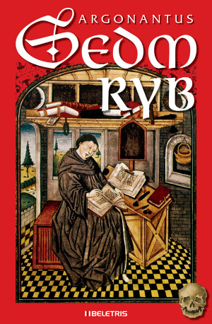
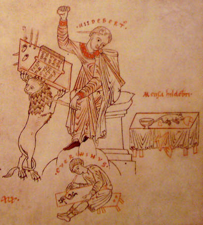

S rukou na srdci môžem povedať, že Sedm ryb je najlepší Argonantus, akého som držal v rukách. Mal som trochu obavu, či 268 strán v skutočnosti nebude len rozriedenou poviedkou, ale naopak sa mi viackrát stalo, že niektoré kratšie epizódy mi prišli príliš stručné, preletené. A románový formát navyše umožnil ešte dômyselnejšie prevrstvenie príbehu a pôsobivejšie vykreslené postavy.

A o čomže to vlastne celé je? Tradične sa stretávame s postavou kronikára Argonanta, tentokrát ešte ako mladého a neskúseného pisárského učňa Everwina. V polovici 12. storočia sa vydáva z Prahy povodím veľkých riek západnej Európy až k stredomorskej Agde. Prenasleduje pri tom vraha a zlodeja ostatkov a zisťuje, že za démonickým nepriateľom stojí prastarý kult filištínskeho boha Dagona. Ten povstáva zo zabudnutia, aby Bohu Izreala oplatil dávnu potupnú porážku a Argonantus sa do toho chtiac-nechtiac zapletie.

Musím priznať, že anglického rozmeru Everwinovho mena som sa nevedel celkom dlho zbaviť a rezalo mi uši (či oči), až kým som nebol nasmerovaný na wikipedickú stránku [Hildeberta a Everwina](http://en.wikipedia.org/wiki/Hildebert_and_Everwin). Tá mi otvorila desivý autorský plán postaviť príbeh na základoch skutočných historických prameňov, presne podľa varovania v úvode. Nejde len o geografické reálie a odkazy „veľkých“ dejín, ale i drobné detaily, ako je Hildebertova epizóda s myšou, na ktoré väčšina čitateľov nebude mať dostatočné znalostné kapacity. O to viac však musím závidieť každému, ktorému takéto odkazy v texte vyskočia.

Nielen vďaka Dagonovmu kultu badať v príbehu nemalú inšpiráciu Lovecraftovskou tvorbou, v starších poviedkach zriedkavejšiu. To, akým spôsobom je Dagon uchopený v rámci stredovekých reálií a biblického kontextu, mu však dáva celkom novú šťavu. Nie je to nejaký novodobý ftagn, ale tisícky rokov známe božstvo. A jeho kult je živým a pozoruhodným strašidlom. Tak, ako som mal nedávno v Argonantovej poviedke Anděl smrti problém s hlavným záporákom, tu mi príde celý kult impozantný a miestami dokonca sympatický. Dostať sa tej pozoruhodnej bande pod šupiny je zábavné a zaujímavé. Nie raz som sa zasníval v predstave zahrať si niekedy hru za tieto postavy. Pracovať s odhaľovaním a napĺňaním túžob ľudí, získavať si ich okamžitou odmenou namiesto sľubov. A zamotať neboráka Argonanta tak hlboko, že nebude vedieť, na ktorej strane vlastne stojí.

Práve Argonantova neistota, resp. premenlivý postoj k protivníkom, ktorú sa snaží zubami nechtami odháňať sebaobrazom bezcitného loviaceho psa, ma výrazne oslovili vo viacerých rovinách knihy. Ich zmysel sa dá totiž čítať rôzne. Kronikárove úvahy ohľadom zmyslu jeho cesty a postavenia voči Dagonovi a jeho nohsledom naberajú postupom času na intenzite. Vždy bude síce antagonistom, to áno. Ale prizná si Argonantus prečo vlastne? O čo mu skutočne ide? Musím povedať, že aj keď som z finále celkom prekvapený nebol, až do úplného konca som mal pochyby ako to dopadne. A to bez ohľadu na to, že ako čitateľ poznám ďalšie Argonantove príbehy, a tak som vedel, že má imunitu na zásadné telesné ujmy. Priestor pre iné zásahy do jeho integrity bol však stále veľký a väčšinu času sa priam núkal.

Ako som spomínal vyššie, dej je svižný a bez zbytočných zásekov. Ani citáty z kníh ho nespomaľujú, majú svoj opodstatnený význam a oživujú ho prepájaním s historickým kontextom. Pre mňa osobne viac ako historické či geografické reálie, ktoré som pozornosťou zvyčajne preskakoval. No ako som už písal, pre erudovanejšieho čitateľa môžu priniesť ďalší zaujímavý rozmer. Príbehová linka je v podstate celý čas lineárna s kamerou na Argonantovi a občasnými krátkymi prestrihmi do nepriateľského tábora. Bočné epizódy sú skôr zriedkavé a krátke. Miestami som mal pocit, že príliš krátke, aby dostatočne objasnili svoj zmysel. Čitateľ tuší, že majú svoj význam, očakáva výstrely z Čechovovej pušky, ale ak k nim aj dôjde, nevytvárajú veľa dejovo zásadných zvratov (napríklad someliérska súťaž v Prahe, učňovské lekcie u remeselníkov).

Na druhú stranu majú práve tieto epizódy nenahraditeľný význam v predstavovaní autora a v iniciačnej vrstve románu, ktorá je minimálne rovnako pozoruhodná ako lovecraftovská cestopisná naháňačka. Teda celkom popravde, pozoruhodnejšia.

Nedávno som sa prichytil, že až na malé výnimky každá kniha, ktorú som v poslednej dobe zobral do rúk, je iniciačný román. Mám mimoriadne rád, keď skúsenejší človek predstavuje kus cesty, ktorou prešiel ako aj funkčné i nefunkčné riešenia, ktoré ho posúvali. Myšlienka prijatia zodpovednosti za svoje rozhodnutia i keď nepoznáme ich dôsledky, ako i ochota a možnosť robiť vlastné rozhodnutia a neriadiť sa inými je možno chrbtovou kosťou v príbehu, ale rozhodne nie tým jediným a bezvýhradne najdôležitejším. Trpezlivosť, pokora a zároveň odhodlanie a nezlomnosť vôle sú imperatívy ako vystrihnuté z Vinárovho traktátu a zároveň ich nesú všetci Argonantovi majstri. Oceňujem, keď je autor schopný podobné myšlienky zabaliť do pútavého príbehu a vyhne sa príliš explicitnému moralizujúcemu mudrovaniu.

Ešte viac ma poteší, keď do knihy zapletie aj cesty svojho alchymického bádania. Pasáže s vínom, kamennými jazykom i farbením skla, ktoré sa v rámci hlavnej linky prenasledovania občas javia tak trochu nadbytočné, naberajú zrazu celkom iný zmysel. Historickopoznávaciu vrstvu nemalou mierou obohatia tiež, pretože sú to oblasti vtedajšieho života, ktorým sa populárna veda venuje podstatne menej ako povedzme vojenstvu, náboženstvu či politike. Práca s textovými prameňmi, nesporná scestovanosť a intenzívny záujem autora o toto obdobie sa spájajú do harmonického celku s viacerými pozoruhodnými súvislosťami. Napríklad spojenie Zlatého traktátu Herma Trismegista s katedrálou vo Vézelay v postave Vinára je zásadný Argonantov vynález, ktorý by nepochybne urobil radosť kdejakému alchymistovi. A možno aj pánu Mockerovi, ak by ešte žil.

A vôbec označovanie dôležitých postáv opisnými prívlastkami a ich bezostyšné považovanie za „pravé mená“ sadlo tiež dobre na môj vkus. Dáva im to akýsi mýtický nádych a bezčasý rozmer.

Nestáva sa mi to pri knihách často, ale občas sa ma zmocní pocit, že tá či oná kniha je napísaná pre mňa. Že existuje akési duševné puto dávajúce autorovi možnosť nazrieť do môjho vnútra a vyjadrovať sa k tomu, čo vidí, cez svoj príbeh. Skutočnosť bude zrejme oveľa prízemnejšie jednoduchá, ale i tak mám tieto pocity pri knihách rád. V Siedmych rybách som takto čítal hlavne Vinárove pasáže.

Vinár sa stal mimoriadnou postavou, ktorá za sebou necháva zrejme najviac nezodpovedaných otázok.

Nie raz som sa prichytil stratený pri pitvaní vrstiev a hľadaní súvislostí a interpretácií, ktoré možno autor vôbec nezamýšľal a veľmi pravdepodobne tam ani nie sú. Magnova palica, draci, umrlčie hlavy... Priehrštie známych alchymistických symbolov nabádajúce premýšľať nad ich miestom v deji a vzťahmi medzi nimi. Ale vínna linka je zreteľná a jasná a predsa ju nie je ľahké rozpliesť. Ako som už spomínal, „koštovka“, po ktorej dostane vtedy ešte Everwin svoje nové meno, sa z istého pohľadu javí byť pre dej akousi nadbytočnou. Lenže nedlho potom sa objavuje súdok s vínom, po ktorom sa „veci zmenili“. Snové i skutočné stretnutie s Vinárom odkazujúce k dávnejšej nevyjasnenej minulosti pitia decembrového vína. Za akých okolností ho Argonantus ochutnal prvýkrát a čo znamenal ten súdok v Prahe? V príbehu vystupujú dve tajomné a nevyjasnené postavy. Vinár je z nich zaujímavejší, lebo otázky točiace sa okolo neho sú subtílnejšie a nenápadnejšia. Druhý tajomný, ktorý sa objaví krátko pred koncom, má svoju nejasnosť v podstate, vyslovenú a surovú, vlastnú mýtickým postavám. Človek ju po čase príjme a prestane mu vŕtať v hlave. Ale chuť Vinárovho brynštu z jazyka tak ľahko nezlezie.

Už vyššie som spomínal, že historické a geografické reálie ma väčšinou neudržali. Nie som veľmi rozhľadený v danej epoche a udržať si prehľad vo všetkých Konrádoch a Vladislavoch, či kopcoch okolo Prahy som nedokázal. Lenže cestopisy majú tú zvláštnu vlastnosť, že neraz o cestovateľovi povedia viac ako o miestach, ktorými prechádza. A postavu kronikára Argonanta je tak to istej miery možné vnímať ako historickú sebaprojekciu autora. Ten totiž v kulisách celkom inej doby necháva čitateľa nahliadnuť do vlastného života. Nie je to tak dávno, čo som tvrdil, že ak ma chytí kniha, autorov život mi môže byť ukradnutý. Pri Siedmych rybách sa však zas presviedčam o tom, že to tak nie je. Že mi vŕtajú hlavou možné paralely postáv či udalostí.

Napriek tomu, že Sedem rýb možno nie je dokonalá kniha,neviem ju pustiť z hlavy. Je zrejme jednou z najlepších, čo som za dlhšiu dobu čítal a nemám problém dať jej päť hviezdičiek bez mihnutia oka. Zaryla sa mi hlboko pod kožu a som presvedčený o tom, že neostane odložená v polici veľmi dlho.
