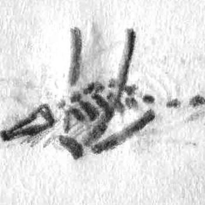
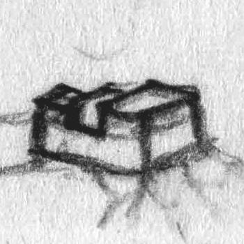

#### Tross

Knížecí město pod vratkou vládou lorda Brakvila. Panství po vyschnutí stříbrných dolů chudne, ale kapitol si nic nepřipouští. Třípatrové hrázděné domy jsou nově omítnuté a ulice jsou poseté stánky a kejklíři. Obchod se nesmí zastavit.

#### Brakk

Nejmocnější z Trosských strážních věží a místo tréninku čerstvých rekrutů. Velitel Horos dokáže naučit různé bojové techniky, ale vyžívá se v šikaně. Do zdejšího žaláře kapitán stráže uklízí politické vězně.

#### Godov

Vesnice zásobující Brakk. Chudí lidé a bohatý zeman Baltus, jenž holduje vykořisťování poddaných a obžerství. Nedávno přišel s úžasným nápadem práva první noci. Případné dobrodruhy a jiné potenciálně vlivné návštěvníky na úkor sedláků bohatě pohostí.

#### Whalenova krvavá vila

Osamocený domov šlechtické rodiny sotva na dohled od nejbližšího sedláckého stavení. Lord Whalen je blízký přítel knížete Brakvila. Zatím nikdo netuší o tragédii, co rodinu postihla.

#### Blosely

Nízká hradba, dřevěné domy. Obyvatelé pastevci, řemeslníci a dřevorubci. Občasné potíže s gobliny. Nad městečkem se stahují mraky a každým dnem začne bouře, která nepřestane, dokud nebude zničeno. Marelok se mstí za svou lásku (viz Čarodějná věž).

#### Wedel

Vysoká palisáda skrývá krásné roubené městěčko. Největší zdejší senzací je věštkyně Amara. Není jasné, jestli je šarlatánka, nebo něco vidí, ale skoro každý tu zná kus své budoucnosti a návštěvníci se sjíždějí zdaleka.

#### Dračí kostra

Potentní místo moci vyhledávané kouzelníky a zaříkávači. Při opakovaném využívání otravuje čarodějovu mysl hněvem. Při použití k hromadnému ničení je šance, že se drakovi podaří získat energii z umírajících duší a ožije jako kostlivý drak.

#### Haydenská tvrz

Poslední lord zešílel, zapečetil bránu a snědl veškeré služebnictvo. Od té doby je tvrz považována za prokletou a nikdo se k ní ani neodváží.

#### Trehern

Izolovaná vesnice bez jakéhokoli opevnění. Cizincům zákaz zbraní. Namísto Worrocha vzývají zdejší lidé místní bohyni Theiu. Jde o přesvědčivou, vychytralou a dobromyslnou čarodějku, která vesnici brání a pomáhá. Daří se jim dobře, ale fanatiční biskupovi rytíři jsou již na cestě.

#### Kastarok

Ruina tvrze Worrochových rytířů. Časem okousané hradby, polámané sochy a příjemný nostalgický nádech. Pokud tu táboří veselá společnost, zjeví se duch starého rytíře Hathora, který rád povyměňuje příběhy. Ví toho o Trossu a jeho okolí hodně.

#### Zbojnický tábor

Zchudlí havíři bez domova, více pytláci než zbojníci. Postavili si několik skromných stavení v korunách stromů a živí se lovem, kradením a při výpravách do města i žebráním. Když mohou, tak podporují Dima Trata.

#### Čarodějná věž

Nažloutlá stavba bez oken ukrytá hluboko v lesích. Sídlo pološíleného čaroděje Mareloka.

#### Stříbrný důl

Důlní městečko zeje prázdnotou. Kdysi bohaté doly s vzácnými kovy protkané žilami ryzího stříbra jsou vytěžené a uzavřené. Tross přišel o největší zdroj svého bohatství a havíři přišli o živobytí. Desítky štol vyhloubené do nitra Garlackých hor jsou domovem jen neproniknutelné temnotě a ozvěnám gobliních skřeků.

#### Hrstan

Osamělý bledý strom prorůstá vysoko v těžko přístupných skalách. Jeho plody, bíle hrušky, propůjčují nadlidskou sílu. Říká se, že jimi byly Garlaky porostlé, ale válečníci je do jednoho otrhali. Nyní, kvůli své nenasytnosti, žijí v horách proměněni v obry.

#### Trpasličí hrobka

Místo odpočinku trpasličích bratří Dragina a Blarina Baragora, jenž se proslavili jako lovci démonů. Lidé mluví o bráně vysekané přímo do štítu šedých hor.

#### Ztracená svatyně nekonečných možností

Skalní chrám plný soch krásných, bohatých a šťastných lidí. V centru se mramorový drak sklání nad stříbrnou kropenkou se zlatou rybkou, která každému splní jedno přání, vždy ovšem s nevýhodou. Kdo ji osvobodi a odnesete do řeky, jezera či moře, spatří její proměnu ve zlatého draka a dostane se mu jednoho skutečného přání.

#### Sump

Trojice kamenných věží obklopena dřevěnými cestami a domy na kůlech. Domov rybářů a sběračů hub a mechů. Sump je z dosahu Trosské jízdy a zdejší se o sebe starají sami. Bláznivý starosta Kuruk brání město pomocí své obří gorily a spory rozsuzuje podle kvality divadelního představení, které je žalobce i obžalovaný nucen odehrát na návesním pódiu.

#### Měšíční oltář

Vzpomínka na vládu temných elfů. V kruhu zkřivených vyschlých stromů se leskne hrubě opracovaný obsidiánový blok. Při měsíčním svitu jej polij krví nevinného a získej do příštího úplňku nadpřirozenou odolnost proti nestříbrným zbraním a schopnost vidění v temnotě.

#### Ziggurat

Zdroj moci dračího kultu. Ještěrci před pyramidou táboří celé dny jen, aby mohli spatřit velekněze a dračí dceru. Právě sem v posledních měsících mizí unesení Sumpští rybáři.

  

## Vztahy ve městě Trossu

  

## Čarodějná věž

Věž je postavená z těžkých pálených bloků a nemá žádná okna. Nad věží nehybně visí v prostoru lesklá koule z neznámého materiálu a v nepravidelných intervalech si s nebesy vyměňuje blesky. Interiér věže je černě omítnutý, s dlaždicovou podlahou a trámovým stropem. Světlo poskytují bledě modré jiskry poletující volně vzduchem společně s prachem.

### 1

Vstupní hala i pole před věží jsu zbroceny krví.

__Kusy goblinů v kalužích krve >__ Dohromady patnáct těl.

__Zohýbané kusy černých plátových zbrojí >__ Čaroděj by mohl vycítit zbytky unikající energie, dohromady tři zbroje, mezi mrtvolami leží i černé meče.

### 2

__Stěny jsou jeden velký reliéf >__ Opatlaný od gobliní krve. Popisuje příběh lásky mezi čarodějem a vesnickou ženou, která byla nakonec zabita žárlivým hraničářem z Blosel.

__Iluzorní stěna >__ Jediná neopatlaná část. Lze bez odporu projít.

### 3

__Socha veselé dívky >__ Nejspíš vyrobená ještě za života.

__Kamenné schodiště do hrobky >__ Stupně, stěny i strop jsou pokryté tlustou vrstvou ledu.

### 4

Celá místnost je pokrytá ledem.

__Pět goblinů >__ V boji využijí luků, krytu za sloupy a kluzkého vlnitého ledu.

__V ledu obalený goblin s magickou hůlkou stojící nad otevřeným sarkofágem >__ Je poznat, že mráz vyšel odtud. Goblin je svraštělý dvousetletý stařec.

_Hůlkou lze výměnou za životní energii sesílat mrazivé střely. Pohroma jako tady nastane, jen pokud se sesilatel použitím zabije._

### 5

__Tři truhlice >__ V jedné je solené maso, ryby, papriky, zavařeniny, koření a další relativně drahé zásoby. V druhé je lano a nějaké látky. Třetí je Mimik.

__Mimik >__ Z vnějšku je iluze truhly dokonalá. Vnitřek jsou velká zubatá ústa a trávící ústrojí v jednom. V boji ze stran a dna vyrazí dlouhé končetiny.

__Teleportační orb >__ Kovová koule visí metr nad podlahou, kdo se jí dotkne, zmizí a zjeví se u koule v (7).

### 6

__Stěny, podlaha i strop jsou pokryté třípalcovou vrstvou duhového slizu >__ Při kontaktu s jiným předmětem (ruka, meč, lano…) způsobí náhodný magický efekt.

1. Zmenšení nebo zvětšení
1. Vytvoření identické kopie
1. Neviditelnost
1. Síla a krutost (zčernání, bodce, kapající kyselina...)
1. Povadlost a slabost
1. Vlastní vůle

### 7

__Tři teleportační orby >__ vedou do 5, 12, 14

### 8

__Kulatý stolek, dvě židle, komoda >__ Drahý mahagonový nábytek. V komodě je schovaný čajový set.

__Dva k sobě srostlí goblini >__ Zjevně se teleportačního orbu dotkli oba naráz.

### 9

__Nehybný ork, trpaslík a orel >__ Stojí v póze, kdy orel útočí orkovi na tvář a trpaslík se připravuje k útoku. Jsou mrtví a vycpaní.

### 10

__Čtyři portréty čaroděje Mareloka >__ Dlouhé havraní vlasy, tenká bradka, tmavé oči, zamračený pohled. Na jednom je nahý.

__Skleněný golem hlídá dveře do další místnosti >__ Je dutý a víří v něm zelený plyn. Vypadá jako církevní hodnostář a bojovat bude jen v sebeobraně. Při rozbití vypustí jedovatý plyn.

### 11

__Průhledná stěna >__ Vnější stěna je dokonale průhledná jako velké okno.

__Bronzové květiny >__ Jsou opravdu z kovu a mají ostré listy.

__Bronzové křeslo >__ Kdo si do něj sedne, uslyší myšlenky všech, co na něj právě myslí. _Ideální pro posun osobních příběhů postav._

### 12

__Teleportační orb >__ vede do 7.

__Ve středu místnosti se vznáší střepy dvou o sebe rozbitých teleportačních orbů, kolem kterých se utvořily tři portály >__ Jsou křehké a dají se vypnout pohnutím střepy.

1. Nacistický bunkr za druhé světové války
1. Jednotka vesmírných mariňáků brání pouštní základnu proti vetřelcům.
1. Létající pirátská loď v astrálním moři

__Při hluku sem vejde alchymista z 13.__

__Iluzorní stěna >__ Průchod velikosti dveří. Vede k orbu, co teleportuje do 17.

### 13

__Alchymista Egil >__ Vyhublý, blonďaté dredy, jedno oko kočičí. Splete si družinu s experimentálními dobrovolníky a začne nadšeně vysvětlovat, jak z nich udělá superlidi. Pokud by došlo k boji, pokusí se zaklínadlem povolat vetřelce z portálu ve 12

Parou poháněná laboratoř > Soustava trubek, hadic, kotlů a baněk s naloženými kusy všemožných monster, postavená okolo křesla, které dokáže bolestivou procedurou (náhodně) trvale přidat

1. Schopnost při pohledu do očí číst myšlenky. Bohužel oboustranně.
1. Nadlidskou sílu doprovázenou záchvaty vzteku.
1. Změnu rasy (1 – kočičí člověk, 2 – ještěrec, 3 – ptákohlav, 4 – taurus)
1. Posmrtnou regeneraci. Nově oživené tělo je vždy o něco slabší než to předchozí.

### 14

Prázdná cela

__Teleportační orb >__ Nikam nevede.

### 15

__Stůl zaházený papíry a pergameny >__ Nesrozumitelné nákresy ke stavbě laboratoře v 13.

__Postel >__ Kvalitní látky, nikdy neprané.

__Šatník >__ Čtyři pláště identické s tím, co měl Egil na sobě, a jedna podprsenka.

__Truhlice >__ 20 zlaťáků, 65 stříbrňáků, 15 měďáků, lektvar odolnosti proti magii, lektvar nahrazující dvě noci spánku, hůlka k sesílání magických střel (při každém použití hoď 1k10, při jedničce se vybije) a druhá identická hůlka (vadná, při prvním použití vybuchne).

### 16

__Teleportační orb >__ vede do 17.

### 17

__Vysoký strop, z kterého trčí dlouhé kovové bodce >__ Celá místnost je zakletá. Po vyslovení slova „ecativarg“ se tu obrátí gravitace vzhůru nohama.

__Čaroděj Marelok >__ Kouzelnická róba, prokletá dýka (paralyzuje) a amulet, co obaluje nositele ve žlutých šupinách pouštních ještěřích lidí včetně děsivé plazí tváře a přísavek na rukou i nohou. Je pološílený a chce pomstít svou ženu. V případném boji vysloví „ecativarg“ a udrží se ve svém trůnu díky ještěřím přísavkám.

__Oživlá černá plátová zbroj >__ Plní Marelokovy rozkazy. Přežije pád ke stropu.

__Dřevěný trůn >__ Vyřezávaný tak, že vypadá jako z látek rozevlátých větrem. Mezi látkami je vymodelovaná dívka, zatlačením na její ňadra se otevírá tajná přihrádka. 140 zlaťáků a 12 rubínů.

__Čtyři prapory na steně po stranách trůnu >__ Každý znázorňuje jednu školu magie ve stejném stylu, v jakém jsou označovány v magických univerzitách. Jsou také oživené a omotají se okolo kohokoli, kdo bude Mareloka ohrožovat. Podezřelé jsou tím, že se při gravitaci neotočí.

__Kulatý stůl s dřevěným modelem celého panství >__ Nad Blosely se vznáší malý kovový orb. Lze jím pohnout kamkoli po mapě a táhne sebou ničivý bouřný mrak.

__Teleportační orb >__ vede do 16.

### 18

__Komora zarostlá mechem, plísní a houbami >__ Většina z toho jedlá, na polici vedle dveří jsou nůžky, šrabka a tác.

### 19

__Police plné knih >__ Beletrie i naučná, poznámky z výzkumů kouzel, luxusní psací souprava, zásoba kvalitního pergamenu.

### 20

__Velká postel__

__Truhlice >__ Uvězněný, stopu vysoký ďáblík. Marelok si ho povolal z pekel jako sluhu, ale není s jeho službami příliš spokojený. Ďáblík je vlezlý, snaživý a neskutečně nešikovný.

### 21

__Kovová vana a vysoký džbán__

__Šatník >__ Cestovní oděv, šaty ke dvoru, žebrácké hadry a noční košile.

__Kamna >__ Namísto ohně se jen otočí pákou a náhodné elektrické výboje vodu ohřejí.

## Haydenská tvrz

### Uriel

Pravděpodobně s ním bude družina bojovat několikrát. Nekromant pokaždé použije jinou taktiku. Paralyzující magické střely, změnění se v mohutného krvavého golema, plošné ovládnutí mysli a podobné.

### 1

__Z ochozu nad branou visí v řetězech tři lebky >__ Skřípají zuby, a kdykoli někdo vkročí na nádvoří, chrastivě se smějí.

__Nádvoří s rozrytými zbytky dlažby >__ Poseté kostmi, hadry a kusy zničeného či zrezlého vybavení.

__Dřevěná stáj >__ Ztrouchnivělá. Uvnitř stojí nehybný kostěný kůň, který ožije a zaútočí jedině v sebeobraně.

__Kamenná studna >__ Dřevěné vědro na dlouhém laně. Pouze díra do 13 ve sklepení, kde je skutečná studna umístěná.

__Na bok převrácený vůz >__ Jeden prázdný sud, chybí přední kola.

__Hradní ochozy >__ 4 ležící kostlivci s luky. Přístupné z žebříků u věže a po stranách stáje.

__Věž >__ Ohořelý kostlivec s mečem. Páka a naviják k ovládání mřížové brány.

__Zbrojnoši zavěšení na kůlech >__ Na vrcholcích kůlů jsou vozová kola, ze kterých visí mrtvoly Reaganiných (viz Drby) spolubojovníků v plátových zbrojích.

_Nejsou uvázáni pevně, a pokud se k nim někdo přiblíží, zapadne sekundární brána z trámových mříží a umrlci i kostlivci ožijí a zaútočí. Jedna příčka je rozsekaná a dovoluje hubeným a neobrněným postavám uniknout._

### 2

__Chlív s hliněnou podlahou__

__Džbán s rudým tulipánem__

### 3

__Zašlá bílá omítka, valená klenba, dřevěná podlaha__

__Nápis na stěně „Tohle není konec! Však ona mě bude milovat!“ >__ Zdá se být naškrábané dýkou.

### 4

__Rozlámaný nábytek >__ Komody, židle, lavice.

__Hromada harampádí >__ Prosté šaty, vidle, lopaty, krumpáč, několik motyk, kolovrat.

### 5

__Beznohý kostlivec >__ Posunuje se po stolech a děravou konví zalévá květiny.

__Pod okny stoly s bylinami >__ Jedovaté, léčivé i jiné. Pro alchymistu hodnota kolem 30 zlatých.

__Zpoza dveří 6. se ozývá hlasitá recitace >__ Čaroděj by poznal, že jde o konec reanimačního rituálu.

### 6

__V kruhu modrého ohně stojí urostlý orkský válečník >__ Dřevěnokostěná zbroj, masivní sekera, šíp skrz krk.

__Nekromant Uriel stojí za ním >__ Sotva třicet let, bledý, černá róba a sandále. Klíč.

### 7

__Na hromadu naskládané rakve >__ Různě drahé, různě velké, až na jednu prázdné. Ta je plná dětských koster, mezi kterými prolézají stopu dlouzí červi s paralyzujícím jedem.

### 8

__Šatní skříň >__ Prázdná

__Koberec s propáleným středem >__ Světle modrý, na stropě nad ním je černožlutá stopa po spáleném tuku. Pod kobercem je runový kruh, který spálí na kost kohokoli, kdo jím projde (k neutralizaci stačí porušit křídu)

__Za dveřmi schody do suterénu >__ Průvan a zápach horkého loje.

_Pokud družina neprozkoumala 6., měl by je dohnat nemrtvý ork a nekromant._

### 9

__V podlaze zapuštěná vana z keramických kachlí >__ Na dně je půl stopy studené narůžovělé vody

__Kovová kamna s hrncem vody >__ Vývod kouře je protažen puklinou ve skále, kterou je vidět ven za tvrz.

### 10

__Regál se zásobami jídla >__ Převážně sušené hovězí a pohanková mouka.

__Stěna obložená až ke stropu dřevem na podpal__

### 11

__Jehlami pokrytý dobrman s koženou maskou >__ Je uvázán řetězem a přes masku nemůže ani kousat ani štěkat, přesto je agresivní. _Pokud mu masku sundáte, uklidní se. Kdo mu vytrhá všechny jehly, k tomu přilne a bude ho následovat._

### 12

__Kostlivec ve špinavé zástěře, v ruce sekáček >__ Zpracovává kravský tuk v loj a vyrábí svíce.

__Dva sudy >__ Plné kusů krav včetně vnitřností.

__Neohraněné ohniště, v němž stojí baňatý kotel s vroucím tukem >__ Lze snadno převrhnout.

__Stolek se svícemi >__ Smrdí a nejsou příliš kvalitní.

### 13

__Masivní dubové dveře >__ Zamčené Urielovým klíčem.

__Pod kruhovou dírou ve stropě je studnice__

### 14

__Pokud jste Uriela zabili, tak tu teď stojí a řve na dva kostlivce, aby vás šli zastřelit >__ Těžké kuše a kuchařské čepice.

__Kovová kamna >__ Vlažná, nedochucená hovězí polévka.

__Hromádka kuchyňského vybavení v rohu >__ Pánev, hrnec, naběračka, cedník, shnilá cibule.

### 15

__Svalnatá bruneta Baia na seně >__ Zesláblá, bledé stopy na hrudi, rudá alergická reakce na končetinách, prořídlé vlasy, přeš nateklý jazyk nemůže mluvit a je okovem připevněná k podlaze. _Uriel na ní testoval lektvary lásky. Poslední zabral, ale přes nateklý jazyk to nevyšlo dostatečně najevo._

### 16

__Snědá Martiana přivázaná ke stolu >__ Nohy pořezané, záda pokrytá voskem, pruhované pozadí, nateklý ret a kolíček na levé bradavce.

__Stojany s lehčími mučícími nástroji >__ Důtky, kolíčky, provazy, jehly, roubík, řemeny, rákoska a pás cudnosti.

### 17

__Na kopci polštářů a dek spí drobná, vyhublá rusovláska Tolka >__ Oranžový lektvar má napojený přímo do žíly; funguje jako výživa i jako uspávadlo. Pod poslštáři je schovaná lokalizační mince do páru s Katliinou (viz Setkání v Trosské pláni).

__Noční stolek se dvěma knihami >__ První je sbírka romantických básní. Druhá je Urielův deník; popisuje, jak mu [vlož nějakou ženu, co postavy znají v Trossu] zlomila srdce.

### 18

__Pokované dveře >__ Zamčené Urielovým klíčem.

__Baculatá blondýnka Emma >__ Nadšená svou šancí k úniku ihned začně družinu přesvědčovat, že Uriel nelze zabít, ať ihned utíkají.

__Postel s nebesy >__ Růžové závoje a příliš měkká matrace.

__Růžové dekorace rozvěšené po stěnách >__ Závěsy, krajky, koberce, šaty.

__Truhlice >__ Panenky, šaty, hlavolamy, líčidla.

__Stolek se stříbrným podnosem a sladkostmi >__ Čokoláda, lízátka, mošt, štrůdl.

### 19

__Mrtvá dívka na podlouhlém stole >__ Je na několika místech pečlivě sešitá a ovázaná. Má otevřený hrudník a srdce zalité v modré substanci.

__Vysoký stůl s náčiním >__ Skalpely, obvazy, jehly, pila.

__Jedna stěna je dřevěná a pokrytá pergameny s nákresy lidské anatomie a nekromantských zaklínadel >__ Prkna zakrývají tajnou chodbu do 20.

### 20

__Magicky uzamčené dveře >__ Nemají zámek a s každým úspěšným i neúspěšným pokusem o vyražení vystřelí výboj energie. Čaroděj může kouzlo rozplést tak, že porazí vypravěče v piškvorkách.

__Potrhaný zelený koberec od dveří až ke schodům__

__Ve stěně po pravé straně je metr zdiva nahrazen jílem >__ V hlíně je schovaný kostlivec, připraven bodnout nicnetušícího vetřelce do zad.

### 21

__Pokud jste Uriela zabili nahoře i v 16, tak tu stojí připraven vyjednávat >__ Nebojí se o svůj život, ale o svůj výzkum. Boj v laboratoři nechce. Vyzve postavy, ať si vezmou ženy a odejdou.

__Na stěně visí polovyschlý stařec lord Hayden popsaný drobnými runami >__ Z řezných ran na chodidlech pomalu odkapává modrá tekutina do připravené nádoby. Když ho pozorně vnímáte, téměř neslyšně opakuje: „Zabij mne.“

__Regál s knihami >__ Čestné místo má grimoár (kouzlo oživení mrtvého, tvář hrůzy a mluvení s mrtvými). Zbytek jsou svazky o anatomii a historii.

__Čistý stůl >__ Pod ním rozházené konopné papíry a střepy. Na jednom je návod k lektvaru lásky. Na dalším zmiňuje, že druhé zrcadlo nechá odvést do Trossu.

__Alchymistické vybavení >__ Kompletní destilační výbava, hmoždíř, kufříky na transport.

__Železem tvrzené dveře do 22 >__ Zamčené Urielovým klíčem.

### 22

__Modré zrcadlo >__ Skleněné, po povrchu neustále stéká vrstva modré tekutiny, ale nikdy neukápne na zem. Kdykoli Uriel zemře, vyleze jeho nová kopie ze zrcadla.

__Postel >__ Pohodlná matrace, kožešinová přikrývka.

__Dvě skříně >__ V první jezdecké boty, náhradní oblečení. V druhé tajný vchod do 19.

__Truhlice >__ Koňské sedlo, 137 zl, 98 st, 39 md, lektvar nenápadnosti, stříbrná korunka, amulet s bronzovou koňskou hlavou (ovládá neúnavného nemrtvého koně ve stáji).

## Ziggurat

### 1

__Kamenné stěny >__ Při bližším prozkoumání je vidět, že v několika místech ve spárách jsou místa zapatlaná suchým bahnem. Skrývají otvory, ze kterých vystřelují kopí.

__Kamenná dlažba >__ Některé dlaždice jsou nášlapné spouště pro kopí.

__Krvavá stopa >__ Jen u jižního vchodu, vede do místnosti 3.

### 2

__Na stěnách jsou vypálené fleky a stopy sazí__

__Hliněný golem >__ Obchází chodbu pomalým krokem a jakékoli vetřelce sežehne plamenem z otvoru, který má namísto tváře.

__Pokud postavy způsobí jakýkoli hluk, začne se ze dveří do místnosti 10 ozývat škrábaní a tlumený nářek.__

### 3

__Ještěrec >__ Dřevěná zbroj, dva zahnuté nože. Má klíč ke dveřím do 17 a 18.

__Vykuchaný panter zavěšený na hácích >__ Při prozkoumání je vidět, že byl zabit mnoha kopími.

__Kožený vak s vnitřnostmi a měděný tác s masem.__

__Několik bloků na východní stěně je spojených v tajné odsunutelné dveře.__

__Spací pytel >__ Lidská výroba.

### 4

__Vaky a sudy s lidským vybavením a cenostmi >__ Meče, nože, šípy, kuše, helmice, štíty, rybářské vybavení, sekyry, klenoty a cetky (cca 100 zlaťáků), 44 zlaťáků, 112 stříbrňáků, 234 měďáků.

### 5

__Poloprůhledné metrové vejce >__ Již prasklé a prázné. Vzdělanec s bestiářem by mohl určit, že se jedná o příliš brzy vylíhnutého zeleného draka.

__Podlaha je pokrytá zaschlým slizem.__

### 6

__Klínové písmo po stěnách >__ Vyžaduje znalost ještěřího jazyka. Vypráví o koruně, co v dávných dobách ovlivnila běh světa. Může ji nosit pouze vyvolený a propůjčuje schopnost vycítit místa moci na velkou vzdálenost.

### 7

__Průsvitný, nehmotný a nehybný válečník s mosazným klíčem v břiše >__ Socha se při dotyku zhmotní a zaútočí. Nikdy ovšem nevykročí z místnosti, jen se vrátí do středu, ztuhne a zprůsvitní.

__Měděná louč v detailně zdobeném trnitém držáku__

__Dveře do další místnosti jsou zamčené a klíčovou dírku mají přesně ve středu pouze namalovanou >__ Otevřou se, když na klíčovou dírku dopadne stín vržený klíčem z válečníka.

### 8

__Rudá trnitá koruna na kameném piedestalu >__ Při nasazení ukáže cestu k nejbližšímu silnému místu moci. Není-li nositelem vyvolený, koruna způsobí trvalé fyzické následky.

### 9

__Dvě hromádky vyschlých skarabů >__ Černí po zapálení vydrží hořet silným žárem několik dní. Bílí po kontaktu s vodou absorbují teplo a pomalu mrazí, čeho se dotknou.

### 10

__Hladoví nemrtví >__ 5 lidských rybářů a 7 ještěrců, posekaní, zkrvavení.

### 11

__Pod hromadou dalších mrvol leží tělo templáře v plátové zbroji >__ Hlava leží opodál. Zbroj je prakticky nepoškozená a mistrovsky kovaný meč stále svírá v dlani. 20 zlaťáků v měšci, svatý symbol a kovový mandlový štít.

### 12

__Dveře vyžadují rybí klíč z 1. náhodného setkání v bažině__

__Nízké stolky s různými měšci >__ Zuby, prsty, uši, vlasy, cetky, 30 zlaťáků.

__Na stěnách všemožné trofeje >__ Nejvzácnější jsou trollí srdce a zejména roh jednorožce, který má pro svůj magický potenciál obrovskou hodnotu mezi alchymisty.

### 13

__Kruhový kamenný stůl >__ Jen zbytky jídla, smotaný řetez a bič.

__Retardovaný ještěrec >__ Bederní rouška z listí, krátký oštěp, neschopnost řeci, jen šílený smích. Na krku řetez s klíči k 10, 14 a 15.

### 14

__Prázdná cela__

### 15

__Pomalu se roztékající dlažba v rohu >__ Při úplné tichosti lze zaslechnout hmyzí cvakání. Pod povrchem je obří mravenec (velký jako osel) a postupě kyselinou rozpouští podlahu.

__Tři vězni schoulení v rohu místnosti >__ Starší sběrač hub, jeho dcera a mladík z Trossu, který neustále blábolí o změně člověka v ještěra.

### 16

__6 obřích mravenců__

__Královna obřích mravenců >__ Přišla o své impérium a chce získat korunu z 8, aby našla místo k uhnízdení. Umí telepaticky komunikovat (robotí hlas).

### 17

__Tunel vedoucí na jih od ještěřího tábora do blat >__ Prvních a posledních 20 metrů je zatopených.

### 18

__Tunel vedoucí do díry přímo ve středu ještěřího tábora >__ Vyhazují tam výkaly, popel, kosti a další.

### 19

__Lidské knihy rozmáčené v mísách s vodou__

__Z papírové kaše uplácaný srpek měsíce__

### 20

__Bazén krve >__ Pod hladinou spí gigantická anakonda ve službách dračího kultu.

__Otvor ve stropě přímo nad bazénem__

### 21

__Dveře vyžadují k otevření klíče obou strážců (ze 3 a 13).__

### 22

__U stěny uvázaní tři lidé__

__Trůn se sochou hlavního kněze >__ Není to socha. Je pokrytý vrstvou ztuhlého bahna. U sebe má klíč z pyramidy a chrysopras (5k100 zl.) k ovládání anakondy (druhý má anakonda v sobě). Ten, co vede rituál, je iluze.

__Trůn s nahou dívkou bez jediného chlupu či vlasu >__ Bleděmodrá kaše z misky na opěradle ji činí povolnou a submisivní. Dívka je nedospělý zelený drak. Když ji někdo zabije nebo těžce zraní, roztrhne se její křehká forma a změní se v draka bez šupin, jen svaly a krev. Dokáže chrlit kyselinu.

__Ještěří kněz >__ Odebírá dračí dívce krev a nutí lidské vězně ji pít. Někteří se změní v ještěrce a jsou vítáni. Ostatní jsou shozeni k anakondě.

__Deset ještěřích mnichů >__ Bílé malování, pláště a kostěné nože.

### Ještěrec jako hratelná rasa?

Humanoid s protáhlou plazí tváří, pevnou zelenou nebo hnědou kůží a mohutným ještěřím ocasem. Při tvorbě postavy vyber dvě schopnosti:

- Regenerace

> Na rozdíl od lidí mohou jim znovu plně dorůst i ztracené orgány a končetiny.

- Šupiny

> Tělo je pokryté silnou ochrannou vrstvou.

- Čich

> Díky citlivému hadímu jazyku rozpoznáš bytosti i substance na velkou vzdálenost.

- Obojživelník

> Dokážeš libovolně dlouho dýchat pod vodou.

- Jed

> Namísto normálních zubů máš dva hadí a dokážeš kousnutím otrávit. Potravu ovšem musíš polykat vcelku.

- Bodce

> Máš rohatou hlavu a ocas zakončený nebezpečnými ostny.

- Chameleon

> Můžeš během několika okamžiků změnit barvu.

- Přísavky

> Prsty zespodu pokryté lamelami a přísavkami. Šplhání je pro tebe stejně přirozené jako chůze. Při šplhání po stěně potřebuješ tři volné končetiny, po stropě čtyři.

## Náhodné tabulky

### Tross – Město

Ve dne (d12)

1. Bard zpívá o jednom z hráčů a milence kapitána stráží. Nevinná zábava, nebo po hráčích někdo jde?
1. Svátek umrlčího tance. Všichni obyvatelé nosí strašidelné masky. Po lidech bez masky se hází shnilé ovoce.
1. Postavy jsou svědky krádeže. Nechají zloděje uniknout bez povšimnutí? Má kontakt ke Stínu.
1. Šlechtic ze sousedního panství navštěvuje knížete a přijel s početnou družinou. Zatímco lordi jednají na hradě, doprovod si pod diplomatickou imunitou dovoluje na místní.
1. Z kopce se řítí maringotka se zaseklou brzdou a míří přímo na tržiště!
1. Do města dorazilo obludárium. Hlavní atrakce, mantichora, je nejen skutečná, ale i rozzuřená.
1. Probíhá protest za práva havířů. Stříbrný důl byl uzavřen a důlníci chtějí přidělit pole. Vede je Dim Tratas.
1. Pověstná družina dobrodruhů se chce dát dohromady s hráčskou skupinou pro společnou výpravu do některého z dungeonů. Jsou hajzlové a klidně nechají hráče jít jako první s namířenou kuší do zad.
1. Na tržiště dorazila gnómská karavana s vynálezy, lektvary a výbušninami.
1. Na náměstí se připravuje soutěž v tanci. Sabotování konkurentů, podplácení poroty, vlivní lidé v publiku a hlavně příležitost u roleplaye vstát od stolu.
1. Philomena Karzska si usmyslela, že její příští rozmazlený milenec bude jeden z hráčů.
1. Zombie incident v jednom z bohatších domů. Worrochův kněz Marius narychlo hledá diskrétní řešení, aby nevypukla panika.

V noci (d8)

1. Z obou stran se k vám přibližují hladoví psi s pěnou u huby.
1. Zatímco slizký žebrák masturbuje, nakukuje do úzké uličky, odkud se ozývá ženský křik. Žena tam ve špíně rodí.
1. Vyvolávač láká všechny pány na drobné exotické půlelfky do vyhlášeného nevěstince. Banda hrdlořezů přestane kopat do žebráka a se siláckými řečmi se tam vydává.
1. Z ulice vpravo se ozývá praskání a čvachtavé zvuky. Krysodlak tam požírá starou paní. Při prvním zranění se promění v malého chlapce, který netuší, co se s ním stalo, kde je a proč je pokrytý krví.
1. Z kočáru vystupuje Mariana Warga a loučí se s maskovaným milencem (knížecím synem).
1. Nahá dívka jen v potrhaném plášti a se strachem v očích proběhne přes ulici do dvora. Ve dvoře na zachránce čeká připravená skupina zlodějů.
1. Několik vandalů hází kameny na dům starého pána. Děda jim nabízel otrávenou polívku a okradl je. Chlapci se bojí jeho jedů, ale chtějí si to s ním vyříkat.
1. Hrozivě vyhlížející ork táhne po ulici cukající se pytel. Vleče v něm dítě.

### Trosské pláně (d12)

1. Bohatá pole jsou plná pracujících rolníků, přesto nikdo nezasahuje, když statkář nevhodně obtěžuje dívku v potrhaných šatech.
1. Za kamenou zídkou půvabného sadu probíhají jablečné slavnosti. Mošt, medovina, štrůdl, špaldové placky, různé hry a soutěže, které se dají odehrát i mezi hráči (zpěv, zadržení dechu atd.).
1. Veselý kašpar s naditým měšcem vyzývá ke hře v kostky. Neznáte-li pravidla, použijte kámen/nůžky/papír. K sebeobraně má kašpar jedem potřenou dýku.
1. Nově vybavená jednotka jízdy vybírá speciální daň od nejbohatších statkářů, aby vykompenzovala ztrátu stříbrného dolu.
1. Bohémští trpasličí žoldnéři se s vámi za pár měďáků podělí o pytlácký úlovek a poslední pivo. Jsou velmi přátelští a chtějí se nechat najmout.
1. Biskup Mankar zpitý do němoty ve škarpě. Pokud ho vzbudíte, začne vás brát jako součást svého stáda a zařídí vám různá privilegia a finanční odměnu. Pokud se mu ovšem zprotivíte a bude si myslet, že byste ho mohli pošpinit, tak vás nechá odstranit.
1. Chudá postarší žena Katlin tvrdí, že dokáže svou ztracenou dceru Tolku najít pomocí milenecké mince (magický pár mincí, které se vždy přitahují), ale nikdo jí nevěří. Odhodlává se do lesů vyrazit sama. Mince ji povede k Haydenské tvrzi.
1. Skupina zoufalých propuštěných důlníků opevněná v zájezdním hostinci drží jako rukojmí barda, šlechtice a hostinského se ženou. Dvojice Trosských jezdců vyjednává.
1. Stylově oblečený obchodník prodává prokleté magické předměty. Meč, který posílá všechny duše bez soudu do pekel, roh, co troubením vyvolává strach ve slabých, apod. Byl to on, kdo prodal ubrousek lordu Whalenovi v Krvavé vile.
1. Strašidelný mlýn. V noci se tam zjevují duchové dětí. Vypadají děsivě, ale chtějí si jen hrát. Ve sklepě je schované dědictví a celá rodina s rozřezanými zápěstími.
1. Poutníci na cestě ke Kastaroku, rozpadlé pevnosti Worrochových rytířů.
1. Nebe je temné a křižují ho blesky. Prudký déšť neustává po celý den. Rolníci dnes nevylézají, aby je neodnesla wyverna. Nikdo ji neloví, věří, že přináší dobrou úrodu.

### Hrzales (d12)

1. Zoufalí havíři přepadají cestovatele jako banditi.
1. Goblini na lovu. Přesouvají se z hor k hranicím pláně, kde budou krást dobytek a unášet rolníky.
1. Ogři zabrali most a vybírají mýto. Chtějí buď něco opravdu hezkého, nebo jídlo; nejlépe koně či některého z členů výpravy. Jsou hloupí a vztahovační.
1. Zvídavá lesní víla nedokáže pochopit lidskou morálku. Zná jen přežití silnějšího. Chce dobrodruhy následovat, aby se o lidech něco naučila. Umí procházet dřevem jako vodou.
1. Satyr zpívá stromům a lesním zvířatům. Při setkání s lidmi se chová vlezle, žebrá a provokuje. Pokud hráči projdou jeho testem a budou štědří a tolerantní, tak rád pomůže či poradí. Jeho písně léčí a mohou dočasně poskytnout magické schopnosti.
1. Skupina mladých dobrodruhů má v kleci dryádu. Žádají o pomoc s doprovodem do Trossu, o výdělek se rozdělí. Pokud hráči dryádu neosvobodí, tak si pro ni v noci přijdou oživlé stromy.
1. Pytlácká past. Proradný pytlák není daleko.
1. Zuřivý divočák.
1. Stopy. Hoď znovu 1k8 na této tabulce, abys zjistil komu patří.
1. Z lesa se ozývá volání o pomoc. Je to lákání Hablarany, obřího mluvícího pavouka. Jedem paralyzuje a potřebuje nakrmit mnoho potomků. Jeho jeskyně je plná vysátých mrtvol a jejich vybavení.
1. V cestě vám brání agresivní a hustý porost divoké kopřivy. Lze se prosekat skrz (šance na podráždění pokožky, která pak pálí a více krvácí), nebo se zdržet obcházením a hodem na další náhodné setkání v lese.
1. V cestě vám brání široká rokle s potůčkem na dně. Nejenže jde o těžký sestup, dole ve stínu skal žije trol. Pokusí-li se hráči rokli obejít, ztratí nějaký čas a hází na další náhodné setkání v lese.

### Garlacké hory (d12)

1. __Poprvé:__ kůly s lidskými kostlivci, gobliními štíty a dekoracemi z dlouhého peří ptáka Noha. __Podruhé:__ gobliní jezdci na vrrcích.
1. viz 1.
1. __Poprvé:__ studené ohniště, ohlodané gobliní kosti a díry k ležení vystlané větvemi dlouhými víc než dva metry. __Podruhé:__ orčí lovecká skupina sbírá gobliní trofeje a plní pytle jejich cennostmi.
1. viz. 3
1. Gobliní zaříkávač/vynálezce s několika poskoky testuje nová děla a magického dřevěného golema.
1. Skupina trpasličích prospektorů nevěří, že lidé vytěžili všechno, a hledají další drahé kovy. Jsou přátelští a ochotní jen do chvíle, než na něco cenného skutečně narazíte.
1. Narazili jste na jednu z mnoha prastarých sošek k uctění trpasličích předků. Zanechte tu oběť, nejlépe ve zlatě, a získáte požehnání (krátkodobý bonus nebo přehození kostky).
1. Osamělý stařec pořád opakuje, jak je mu skvěle od té doby, co žije sám v horách. Přesto postavy pozve do své jeskyně a pohostí. Když mu hráči zařídí trvalejší společnost nebo ho přesvědčí k návratu do Trossu, daruje jim svůj plášť nenápadnosti.
1. Na stezce leží několik balvanů, rozlámané trakaře, truhlice a nářadí. Ve skalách nad stezkou sídlí obr a vrhá na cestovatele kameny.
1. Blíží se silueta gigantického ptáka Noha, asi byste se měli schovat. Kdo to nestihne, toho pták odnese do svého hnízda ve skalách.
1. Sněhová bouře; led, mráz, vichr, nízká viditelnost.
1. Hoď znovu a nový výsledek po chvíli přeruš kamennou lavinou.

### Bažina (d12)

1. __Poprvé:__ bosé humanoidní stopy se třemi drápy. __Podruhé:__ Osm ještěrců loví lidi do zigguratu. Vede je veterán s kostěnou zbrojí a oboustranným kopím. U sebe má klíč s rybí hlavou.
1. viz 1.
1. viz 1.
1. Rybáři vypouští pelikány s podvázanými krky na ryby. Škrtidlo sundají, až když pták nanosí dost ryb pro svého majitele. V mezičase se předhání v dohadech o tom, kam ještěrci odvádí ztracené lidi.
1. Nápadné bleděmodré zelí. Požití způsobuje malátnost a submisivitu.
1. Stromy, ostrůvky půdy i bažina jsou porostlé narudlým mechem. Vše, čeho se mech dotýká, ožívá jako prodloužené končetiny masožravé květiny pod hladinou.
1. Zbohatlý trosský měšťan na tajné schůzce s ještěrci dračího kultu.
1. Jedovatá žába s korunkou na hlavě. Je to zlomyslný žert, nebo princ, který čeká, až se za něj nějaká dívka obětuje?
1. Pijavice, které zraňují zdravé a léčí zraněné.
1. Brnivý zemětřas a uši drásající bzučení. Útok hejna pětikilových komárů.
1. Na zlomeném stromě nabodnutý pirát. Vypadá, jako by spadl z oblohy. Nohy okousané od dravců, trojhranný klobouk stále na hlavě. Po kapsách hrst drahokamů (cena 3k20 zlaťáků) a lektvar neviditelnosti.
1. Bažina je dnes zalitá v husté mléčné mlze. Hoď znovu, koho v mlze potkají. Padne-li zase 12, mlha je zlomyslná a ukazuje lidem vidinu jejich největšího strachu, aby je zahnala do močálů.

### Drby (d12)

1. Mladý kovář se chvástá, že umí vyrobit magickou zbraň. Ví, kde v horách najít kouzelnou Trpasličí hrobku s magickou kovadlinou.
1. Stříbrné doly byly uzavřeny, když se v nich začali ztrácet důlníci. Risk začal převažovat zisk.
1. Z opuštěné Haydenské tvrze vychází kouř. Někdo tam žije. Jak dlouho potrvá, než tam kníže pošle muže na průzkum?
1. Podezřelý muž tvrdí, že lord Whalen shání žoldnéře, jako jste vy. Udájně na delikátní práci.
1. Kdo nechce trpět prací nebo riskovat život v nesmyslném dobrodruhování, ať se nechá naverbovat do Trosské stráže v Brakku a stane se pořádným profesionálním válečníkem.
1. Nejlepší drogy koupíš u Kuzal’k’taka. U vchodu řekni, že tě posílám já.
1. Lidé se bojí dvorního čaroděje Karsavara. Zahrává si s temnými silami. A prý magicky zapečetil jednu budovu v chudinské čtvrti.
1. V Trehernu žije bohyně, co vyléčí každou nemoc a čte myšlenky. Worroch je mrtvý bůh, to vám povídám.
1. Alchymistka Kragg má nový recept. Přines jí kapesník nasáklý dívčími slzami a ona ti za 20 zlatých připraví lektvar lásky.
1. Na vývěsce pergamen s knížecí pečetí, na němž stojí: „Městská stráž vyplatí JEDEN ZLATÝ za každou předloženou GOBLINÍ HLAVU nebo její větší polovinu.“
1. Na vývěsce hrubý papír, na němž se píše: „Najímáme žoldnéře na ochranu rybářů a houbových farem. Hlaste se u Markoa v Sulpu. Zbraně si přineste vlastní.“
1. Na vývěsce je načmáráno krví: „BOJUJU ZA PRACHY. JSEM U REZAVÉHO MEČE. – REAGAN.“ Bojovnice. Utekla z boje v Haydenově tvrzi, kde zemřela její družina. Ničí ji svědomí.
