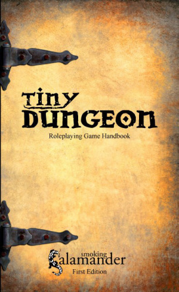
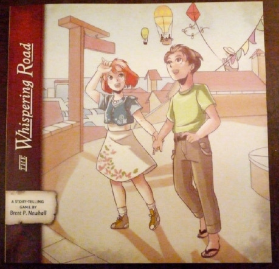
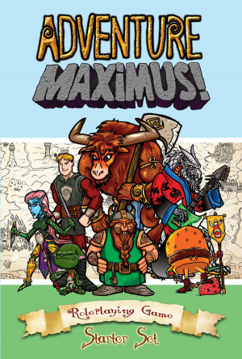

## Tiny Dungeon: A Minimalist Tabletop RPG

je kickstartovský projekt minimalistického RPG systému.

Autori sa držia hesla Antoine de Saint­-Exupery: „Perfection is achieved, not when there is nothing more to add, but when there is nothing left to take away.“ Toto je heslo skrz celé pravidlá, ktoré majú dokopy 26 strán doplnené o celkom pekné obrázky.

Základným princípom hry je hod 2k6, kde hod 5 a 6 sa považujú za úspech. Pri výhode, ktorú vytvárajú vedomosti alebo samotné okolnosti, sa hod zmení na 3k6, pri nevýhode na 1k6. Zaujímavosťou pravidiel je, že nie je žiaden ďalší mechanizmus na korekciu, resp. porovnanie úspechov. Ak napríklad zaútočím na súpera, hodím si príslušným množstvom kociek a už jeden úspech mi stačí na to, aby som mu spôsobil jedno zranenie. Brnenie v tomto systéme je len kozmetické a stále hráč spôsobí jedno zranenie. Pri boji si hráč môže pomôcť sústredením, keď vymení jednu akciu za pridanie 4 do množiny úspechov na jednu svoju akciu. Rovnako tak je možné sa vyhnúť útoku ak postava neútočí. Nie je to však vôbec ľahké. Je totiž potrebné na 1k6 hodiť aspoň jeden úspech.

Tvorba postavy je veľmi priama, trvá len niekoľko minút a zaobíde sa bez hádzania. Hráč si vyberie rasu – Človek, Fey (Elf), Trpazlík, Goblin alebo Salamander. Rasa určuje počet životov 4–8) a jednu rasovú výhodu. K tomu si potom vyberie hráč 3 vedomosti zo zoznamu 30 možných. 5 z nich sa špecializujú na mágiu. Pridá sa jedna zbraňová vedomosť, výbava a trocha histórie.

Vedomosti sú zábavne popísané vetou alebo dvoma a hráč ich prejde pohľadom za zopár minút. Napríklad vedomosť berseker znamená, že postava útočí s nevýhodou (hod 1k6), ale spôsobí dvojnásobné zranenie (2 životy). Marksman napríklad pri výstrele zasiahne pri hode 3 a lepšom ak mieri.Sú tu vedomosti, ktoré dávajú výhodu pri plížení, kradnut, silových činnostiach a podobne.

Samotná mágia je rozdelená do piatich kategórií – do piatich vedomostí. Spell-Reader dokáže čítať magické zvitky, ktoré by mali byť silnejšie ako hocijaká mágia, ktorú hrdinovia ovládajú, ale sú jednorázové. Spell-Toucher slúži na jednoduchú mágiu. Vytvoriť malý oheň, posunúť predmet, jednoduchá ilúzia i zraniť niekoho na dialku. Beastspeakers a healers hovoria sami za seba. Poslednou magickou vedomosťou je Familiars, ktorá dáva hrdinovi nehmotného priatela.

Hra Tiny Dungeon má už vo svojom názve kategóriu hier, kde by sa chcela zaradiť. Pravidlá sú prehľadné, jednoduché a veľmi rýchle na pochopenie. Postavu nie je problém vytvoriť na počkanie, súboje a vyhodnotenie prekážok nijak nespomaľujú hru. Princíp zásah = strata jedného životu neoberá súboje o zaujímavosť, skôr naopak. Samotný GM má veľmi zjednodušenú rolu pri určovaní sily netvorov, je určená primárne jeho počtom životov a vedomosťami, i iných prekážok, ktoré hrdinovia na svojej púti stretnú.

Celkovo je to určite zaujímavý systém, ktorý by podľa mňa mohol nadchnúť i mladšiu hráčsku základňu.

## The Whispering Road: A Miyazaki-inspired Tabletop RPG

je ďalší úspešný kickstartovský projekt postavený na minimalezme vzhľadom na pravidlá a prípravu.

Základné pravidlá sa zmestili na 8 veľmi pekne ilustrovaných strán a nie je to kvôli hustote textu, ale kvôli ich jednoduchosti. Veru, textu tam moc nie je.

V skratke, postava sa buduje na základe 4 archetypov, ktoré pomáhajú definovať potreby postavy, a z 30 vedomostí, z ktorých si postava vyberie 5 (počas hrania je možné ich zmeniť). Najdôležitejšie pre hranie však je „čo postava potrebuje“ (Personal Need), a ktorý iný hráč ju obmedzuje v tom, aby sa jej potreba naplnila. Príklad z pravidiel:

> _Toro:_ „Postarať sa o Soru, ktorá je ustavične v nejakom nebezpečí.“
>
> _Sora:_ „Zistiť, čo sa stalo s mojou civilizáciou, ale to je tak nebezpečné, že nik o tom nechce hovoriť.”
>
> _Ono:_ „Zistiť, čo je také špeciálne na Sore, ale ona o tom nechce hovoriť.“
>
> _Maria:_ „Ukázať Torovi ako veľmi ho ľúbi, ale on má oči len pre Soru.“

Čo je ale na hre najzaujímavejšie je jej mechanika. Konflikt vzniká v dvoch prípadoch. Buď si protirečia hráči a je potrebné ich rozsúdiť, alebo vzniknutý problém sa týka „Personal Need“ aspoň jedného z hráčov. Hádže sa buď k6 alebo k8. Počet určujú vedomosti, ktoré pri tom hráč používa. Je veľmi dôležité, či hráč používa vedomosť pre naplnenie svojich cieľov, alebo niekoho iného. Hod, úspešný i neúspešný, sa pripočíta ku karme postavy. Ak slúžil na naplnenie vlastných cieľov, tak sa mu zväčší Zlá karma. Ak ku naplneniu cudzích cieľov, tak sa pripočíta ku Dobrej karme. Na záver hry sa vyhodnotí, o koľko Dobrá karma prevýšila Zlú, respektíve naopak.

Z tohto princípu tak vychádza i celá skladba dobrodružstiev, v ktorých sa dej točí okolo pomáhania iným, pacifizme, zisťovaní.

Druhá časť knihy je venovaná samotnému hraniu. Podľa času, ktorý je k dispozícií sa zvolí 3 aktová alebo 5 aktová skladba príbehu. Každý akt má svoju štruktúru pekne rozpísanú na vlastnej strane pravidiel a obsahuje niekoľko konfliktov, ktoré hráči hraním vytvárajú. To, aby sa dej hýbal a aby sa držal osnovy zabezpečuje dvojica Navigator (GM) a Driver (pomocný GM). Obaja hrajú tiež postavy a majú naviac i vymedzené úlohy počas questu.

Hra nie je obmedzená prostredím alebo dobou a je na hráčoch sa dohodnúť, v akom období by sa mala odohrávať. Rovnako je na nich, aby sa dohodli čo v príbehu nesmie chýbať a čo by tam chceli mať. Preto mi pripadá hra ako ideálna na hranie bez prípravy alebo len s minimálnou prípravou.

## Adventure Maximus!

je úspešným kickstartovským projektom určeným hlavne deťom. Deťmi sa pri tom rozumiem človek vo veku 8 a viac rokov.

Hra sa predáva v krabici, v ktorej nájdete karty hrdinov, beštií, povolané, predmetov, kúziel a miest, kde sa dobrodružstvá budú odohrávať. K tomu samozrejme denníky, pravidlá a päť šesťstenných kociek. Kocky nie sú klasické, ako sme zvyknutý. „Tieto“ majé tri strany prázdne, jednu s jednotkou, jednu s dvojkou a jednu so znakom Maximus. Maximus znamená +2 a môžte si hodiť ešte raz. Všetko toto je veľmi farebné a zaujímavo graficky spracované – určite pútave pre deti.

Podľa môjho pohľadu pravidlá nie su až tak jednoduché – rôzne karty dávajú rôzne bonusy, častokrát dávajú 3–4 možnosti ako predmet použiť, rôzne akcie stoja rôzne Body Akcií a naviac je v balení len 5 kociek. Našťastie, je všetko farebne tak spracované, že ak si hráč uloží kartičky na denník, všetko je zrazu prehľadné.

Veľkým bonusom tejto hry sú kartičky a generovanie dobrodružstiev. GM si vylosuje kartičku miesta, kartičku pokladu a beštie, resp. bossa. Tri krát pre tri na seba nadväzujúce dobrodružstvá. Ako sa hrdinovia dostanú na dané miesto, ako sa nechajú najať do služieb, ako vznikne konflikt medzi hrdinmi a beštiou je na GM-ovi. Pravidlá tak nekladú na GM-a moc veľké nároky. Dobrodružstvo kľudne môže ísť od boju k boju, ktoré medzi sebou budú deliť dve – tri vety. Ale ak chce, tak môže príbehy okoreniť o stretnutia, udalosti, dá priestor pre použitie vedomostí postáv a podobne. Má pri tom používať DVE základné pravidlá: 1. Hra je o zábave a 2. Odpovedať na otázky hráčov „ÁNO ale ...“.

Na záver by som hru zhrnul veľmi krátko. Adventure Maximus! je skutočne hra dobrá svojim spracovaním pre mladých začiatočníkov vo svete RPG. A dôraz by som by som dal na mladých. Na hranie je potrebná dobrá pamäť alebo angličtina – teda i schopnosť čítať. Hra tak i napriek svojmu peknému grafickému spracovaniu nie je pre predškolské deti a tak sa podľa mňa zaradzuje medzi skupinu hier, kde je silná konkurencia.

Pravidlá sú zdarma stiahnutelné na stránke [http://www.adventuremaximus.com/](http://www.adventuremaximus.com/). Rovnako tak je možné na Youtube nájsť príklady hrania.
