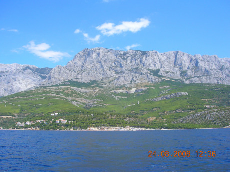

Na zorganizování dovolené na jachtě je nejdůležitější dát dohromady posádku, která má volný čas ve stejný termín a chuť zúčastnit se plavby, jež stojí přeci jen nějaké peníze. Konkrétně letos v červnu přišla jednoho účastníka na 7 170,– Kč za loď a společné jídlo, 2 611,– Kč za dopravu a cca 1 500,– Kč za drobné výdaje a vlastní jídlo. Teplé jídlo se zpravidla společně připravuje jen jednou denně, ostatní se řeší individuálně. Ani tak není snadné domluvit jídelníček, který by měl zahrnovat jídla lehce stravitelná, z trvanlivých surovin – na lodi je sice malá lednička, ale s pochybným výkonem – a snadná na přípravu. Stravování na lodi je důležitou složkou prevence mořské nemoci, přílišný hlad nebo naopak přesycení napomáhá jejímu rozvoji. Ale vzhledem ke skutečnosti, že v chorvatských vodách je prakticky vždy vidět pevnina, nebývá mořská nemoc až takový problém.

> ### Námořní historky 1
>
> V roce 2011 jsme při plavbě ze zátoky Pantera na nejsevernějším výběžku Dugi Otoku na Nacionalni Park Kornati, rozkládající se na jihovýchod od něj, zvolili vnější trasu, tedy cestu na jihozápad od tohoto ostrova maratonců – Dugi otok znamená v češtině Dlouhý ostrov a je opravdu hodný svého jména, neboť jeho délka o něco přesahuje 42 km právě jako maratonská trať. Předpověď počasí hlásila prakticky bezvětří, na otevřeném moři ale byla šance na alespoň nějaký vánek do plachet. Proto nás počínající Yugo o síle 5 stupňů Beaufortovy stupnice překvapilo – příjemně, protože „na plné prádlo“ (jak se říká stavu, kdy jsou obě plachty vytaženy na maximum) dělala naše loď ostře proti větru krásných 8 uzlů a na zatím hladkém moři to byla dokonalá plavba – rychlá, klidná a tichá. A přitom držitel nejnižšího českého oprávnění, vůdce rekreačního plavidla, nesmí za takovéhoto počasí vůbec vyplout! Kurz vedl přímo na jihozápad tak, aby bylo možné na dva obraty dosáhnout majáku Sestrice u vstupu do Kornatského kanálu. Poklidnosti okamžiku podlehl i kapitán, který se uložil na přídi schován za plachtou. Tam se dostal oknem v příďové kajutě, takže posádka, včetně kormidelníka se domnívala, že jsou všichni buď v kajutách nebo v kokpitu poblíž kormidla. V celou sudou hodinu bývalo na Radiu Rijeka hlášení počasí, ovšem nyní se hlásilo Radio Ancona (Itálie). Kormidelník se podíval na mapu v GPS a urychleně zoomoval, i na nejmenším rozlišení byla významně větší část obrázku symbolizujícího naši loď za vyznačeným rozhraním teritoriálních vod. Vyplutí z teritoriálních vod je porušení podmínek pojištění a za to se strhává celá kauce, v tomto případě 2 000 EUR. Kormidelník zakřičel: „Připravit na obrat, pozooor, teď!“ To kapitána probralo z dřímoty, takže do vody sjel sice po hlavě, ale byl již vzhůru. Rychlost lodi, které bezchybně provedený obrat příliš neubral, již v té době přesahovala 9 uzlů, což člověk neuplave, ani kdyby se jmenoval Ian Thorpe, takže kapitán se záhy ocitl pořádný kus za zádí, kde jej bdělá posádka samozřejmě zaznamenala. Ostatně jeho výkřiky přeslechnout nešlo. Jen co podle navigace celý symbol jachty bezpečně minul hranici teritoriálních vod, byla loď nastavena přídí proti větru a plachty skasány. Přesto kapitán nechápal, proč má těch nějakých 900 metrů doplavat a názor změnil, až když začala posádka ostentativně mávat žlutým papírem – ve skutečnosti to byl velký žlutý ručník, protože papír, ani když to byl formulář A3 o ztrátě člena posádky během plavby, který má též žlutou barvu, není na takovou vzdálenost rozeznatelný. Ačkoliv by pan kapitán tuto historku vyprávěl poněkud odlišně, souhlasil s tím, že bylo správné okamžitě reagovat na hrozící ztrátu kauce. Od té doby nikdo neopomněl nahlásit, když se za podobných podmínek vydával mimo kokpit.

V dalším kroku organizátor, obvykle kapitán, vybere vhodnou loď. Nejsnazší cesta je k tomu přes českého zprostředkovatele charterů, mně osobně se výborně osvědčil yachtnet.cz. Loď zarezervuje a zaplatí předem nájemné, které činí od tisíce euro výše, podle velikosti, novosti a kvality jachty. V příslušnou sobotu odpoledne se pak dostaví do maríny, kde se nachází vybrané plavidlo. Největší množství marín se nachází mezi Zadarem a Splitem. Při volbě lodi se vyplatí zkoumat, kde se pronajímá, neboť to má vliv nejen na oblast plavby – při týdenním půjčení lodě v Zadaru se do Dubrovníku nepodíváte za žádných rozumných podmínek, ale i na další věci. Díky kvalitní dálniční síti jsou rozdíly v dojezdových časech prakticky zanedbatelné, na rozdíl od jiných okolností. Kupříkladu Zadar je proslulý naprostým minimem místa pro manévrování v přístavním bazénu, takže parkovat tam vyžaduje větší zkušenosti. Trogir má jednu marínu přímo v krásném historickém centru, ale vyznačuje se nebezpečnými proudy, které mohou vést k poškození lodi, což se projeví při vrácení kauce. Ta se skládá v hotovosti nebo blokací prostředků na bankovním účtu při převzetí jachty od charterové společnosti. Výše kauce se pohybuje od jednoho tisíce do čtyř tisíc eur podle hodnoty lodi. Kremik je sice dobře chráněná a prostorná marína, což ocení i řidiči při snaze najít místo k parkování, ale je daleko od města, jeho obchodů a restaurací. Z výše uvedených hledisek mi jako nejlepší volba připadá marína Mandalína v Šibeniku.

Po složení kauce probíhá takzvaný check--in – prohlídka lodě s pracovníkem charterové společnosti, při které se ověřuje, že nechybí nic z povinného vybavení, kontroluje se stav lodi a dojde na seznámení se s lodí, neboť každá je trochu jiná. Tuto fázi by řada rekreačních skipperů ráda přeskočila, protože zdržuje od možnosti vyplout, ale z vlastní zkušenosti mohu potvrdit, že se to nevyplatí. Lodě mohou mít své zvláštnosti, které v nevhodné chvíli nemile překvapí. Například osvětlení lodi nefunguje jen, jak je obvyklé, na spínač na hlavní desce a na individuální tlačítka u každého světla, ale je třeba jej ještě zapnout hlavním vypínačem, který se schovává kdo ví kde, či pojistka kotevního vrátku může mít neobvyklý způsob zapínání. Obvyklá je rovněž kontrola plachet a ovládání motoru. Vzhledem k tomu, že starší lodě jsou výrazně cenově dostupnější, tak drobné závady a opotřebení vyloučit nelze. Člověka přesto dokáže překvapit, když jsou na starší lodi fungl nové kvalitní plachty, ale ovládané starými lany na samé hranici životnosti. Po završení této procedury je možné s lodí vyplout. Je však vhodné dobře zvážit, zda má párhodinová, obvykle jen koupací plavba smysl, když je posádka unavena z dlouhé cesty k moři. Osobně se rozhoduji právě podle toho, jak moc je náročné manévrovat v maríně, protože obvykle se v sobotu loď vrací do téhož přístavu a „na ostro“ se vyplouvá až v neděli dopoledne.

Kam všude lze v Chorvatsku plout, by bylo na jiné téma, kterému se vůbec nebráním, bude-li však o něj zájem. Z praktického hlediska je třeba se věnovat hlavně tomu, kde zakotvit na noc. Samozřejmě je možné plout i přes noc a dodržovat systém hlídek, ovšem nechť si každý sám posoudí, nakolik je to slučitelné s jeho představou dovolené. Pokud jde o zakotvení na noc, je možné vybírat ze tří základních možností – stání na kotvě, stání na bójce a vyvázání se v maríně nebo u městského mola. Stání na kotvě je nejlevnější z možností, ve větší části zátok je stále ještě kotvení zdarma, ale vyžaduje zvýšenou opatrnost. Chorvatské pobřeží je formováno blízkostí masivu Dinárského pohoří, což přináší již vychvalovanou členitost, ale také efekt, kterému se lidově říká noční bríza či odborněji katabatické větry. Voda má oproti pevnině nižší termickou dynamiku, takže přes den se pomaleji ohřívá a v noci pomaleji chladne. To vede k tomu, že za tmy je nad mořem teplejší, od vody ohřátý vzduch, který stoupá vzhůru a uvolňuje tak místo pro masy chladnějšího vzduchu z pevniny. Tento jev je v Chorvatsku odložen a zároveň umocněn právě horskou hrází na pobřeží – pro představu, Sveti Jure, kousek od Makarské má výšku 1 762 m a nachází se necelých 7 km od břehu moře. Noční bríza v poryvech snadno přesáhne rychlost 40 uzlů, což je hodnota, která ráda trhá kotvy ode dna. Pro kotvení je třeba najít krytou zátoku s hloubkou nepřesahující patnáct metrů – charterové lodě mají obvykle kotvu na padesátimetrovém řetězu a platí, že řetězu by měl být vypuštěn nejméně čtyřnásobek hloubky. Vzhledem k délce vypuštěného řetězu by pak měla zátoka poskytovat dostatek místa na pohyb lodi na kotvě.

Za kotevní bójku se sice platí, podle délky lodi přibližně od sta do čtyř set kun, ale znamená to klidnou noc. I když někdy může vítr pohnout i betonovým blokem o obvyklé váze 700 kg, který drží bóji na místě. Proto někteří provozovatelé bójkových polí vyhánějí kotvící lodě při varování před vichřicemi. Při pozdějším příjezdu již mohou být rovněž všechny bójky obsazeny. Mimochodem, při stání na kotvě nebo na bójce se loď stále považuje za plovoucí a tedy by měla být na palubě přítomna osoba s příslušným oprávněním a ve střízlivém stavu, což pobřežní stráž namátkově kontroluje.

> ### Námořní historky 2
>
> Nejdramatičtější noc, kterou jsem na lodi zažil, se odehrála zhruba v&#160;polovině plavby, kdy jsme proplouvali souostrovím Kornati, na němž je vyhlášen stejnojmenný Národní park. NP Kornati chrání nejen mimořádné bohatství mořského ptactva, vzácný a nádherný podhladinový ekosystém včetně delfínů skákavých (v&#160;angličtině neméně výstižně zvaných lahvonosých), ale i samotný povrch ostrovů, které jsou důkazem toho, co může způsobit hloupé chování k&#160;přírodě a krajině. Kácení borových hájů a nadměrné pasení ovcí způsobilo degradaci povrchu a následnou erozi půdy v&#160;takovém rozsahu, že byly prakticky zcela obnaženy kamenné základy ostrovů. Na nich jsou tak nádherně vidět geologické vrstvy, jejich zlomy apod. Jeho součástí jsou i nádherné útesy dosahujících místy až přes to metrů výšky, z&#160;nichž je nějakých 30 metrů nad hladinou a zbytek pod ní. Podle mého se jedná o jedno z&#160;nejkrásnějších a nejpůsobivějších míst na zemi. Když jsem je poprvé uviděl, rozhodl jsem se, že se tam buď sám ožením, nebo jako kapitán využiji svého práva oddávat. Druhá možnost se mi splnila v&#160;roce 2011, při mé první plavbě v&#160;pozici lodivoda. Byť se nakonec platnost sňatku nepodařilo protlačit přes brněnskou matriku, která je pro tyto záležitosti příslušným správním úřadem, tak se jednalo o nevšední zážitek. Oné noci jsme zakotvili v&#160;zátoce Vrulje. Na noc byl hlášen silný katabatický vítr. Proto jsme se rozhodli stát na dvou kotvách a samozřejmě držet nepřetržitou hlídku. Většinu noci stála loď na rozdíl od sousedních v&#160;klidu, avšak nad ránem přesáhla rychlost větru v&#160;poryvech 60 uzlů, jedenáctý stupeň Bouforta – silná vichřice. To už nevydržela ani Pembina a vítr ji začal snášet na skaliska. Motor byl nastartován, kotevní vrátek však vypověděl službu, a tak bylo třeba kotevní řetěz s&#160;hlavní kotvou i přimotané kotevní lano s&#160;pomocnou vytáhnout ručně, což se společným úsilím podařilo. Mezitím se však jakémusi rybáři utrhla síť a rozhodla se blíže seznámit s&#160;naším propelerem – vrtulí pohánějící loď při plavbě na motor, které se ne zcela přesně říká lodní šroub. Loď se tak stala téměř neovladatelnou, naštěstí ji už vítr hnal mimo skály na volné moře. Na poslední chvíli chytla znovu vypuštěná hlavní kotva, a tak bylo možné po rozednění začít s&#160;odřezáváním sítě. S&#160;tím se pokračovalo i poté, co nás strážci parku dotáhli na bójku uvnitř zátoky. Celkem bylo potřeba asi sto padesáti nádechových ponorů, než byl šroub očištěn. Přičemž uvnitř zátoky držel proud potápěče příhodně na místě, takže šlo použít obě ruce a pracovat efektivněji, jenže o to složitější bylo se vynořit. Já absolvoval asi 130 ponorů, přičemž v&#160;zátoce jsem po každém druhém vynoření dávil, jak se mi nedostávalo dechu. Vzhledem k&#160;tomu, že při snaze přeprat síť byl motor mimořádně namáhán, tak bylo přistoupeno mj. ke kontrole oleje. Jeho hladina se zdála být těsně pod minimem, takže jsme jej doplnili z&#160;rezervy, která byla na palubě a navíc ještě z&#160;toho, co nám darovali strážci parku. Další plavba směrem na ostrov Murter probíhala zcela idylicky až do okamžiku, kdy jsme chtěli vyplout z&#160;Kornatského kanálu na Murterské moře. Proti nám šel vítr, proud i pohyb vln. Kapitán nařídil použít motor, abychom se dostali z&#160;úzkého hrdla průlivu. Jenže po jeho spuštění se z&#160;výfuku, jímž je odváděna i protékající voda chlazení, vyvalila oblaka hustého bílého dýmu a zahalila širé okolí. Motor jsme ihned vypnuli, hasicí přístroje v&#160;pohotovosti, ale naštěstí nikde nic nehořelo. Museli jsme napnout všechny (tedy obě) plachty a na moře postaru vykřižovat. Než jsme překonali cirka 200 metrů úžiny, provedli jsme nějakých 40 obratů a napluli více než 6 km. Po noční fujavici bylo moře docela zvlněné, ale čerstvý severák nám umožnil jej přeplout na plachty rychle a v&#160;klidu. V&#160;zátoce Sv. Nikola jsme měli domluvené setkání s&#160;majitelem lodi, aby se mohl na motor podívat. V&#160;této zátoce se nachází malý přístav bývalé rybárny, zhruba tak pro šest větších lodí. Nyní tam stály dvě lodě s&#160;rakouskou vlajkou posádky, vyvázané tak mohutnou pavučinou lan, že se tam žádná další loď nevešla, když jsme přesto zkusili se vyvázat na kraji mola, tak nás jeden člověk zavalil lavinou německých nadávek, z&#160;nichž jsem rozuměl pouze některých výrazům, jimiž narážel na to, že měl Hitler všechny Čechy poslat do Osvětimi. Žel mi kapitán zakázal odpovědět s&#160;použitím mooringového háku místo slovníku. Odmítnout přistání lodi plující na plachty bez motorového pohonu se považuje za obzvláště hrubou neslušnost. Nakonec jsme se vyvázali u mola z&#160;vnější strany. Majitel lodi příčinu dýmu odhalil záhy – v&#160;motoru bylo oleje i po dolití 4 litrů tak tak minimum, ale převodovka byla bohatě přelitá, a právě ze spálení tohoto oleje vznikl onen dým. Holt devět právníků v&#160;posádce mělo i&#160;svá negativa…

Za využití jiné než domovské maríny se platí poplatek několikanásobně vyšší, než je bójkovné, ale zase to znamená možnost doplnit vodu, napojit se na rozvod elektrické energie, a především vystoupit suchou nohou na břeh a využít tamních sprch a toalet. Městská mola bývají levnější, avšak nemusí nabízet vše z výše uvedeného servisu. Na ostrovech pak bývá s dostatkem pitné vody někdy problém i v renomovaných marinách, neb se tam voda dováží tankery z pevniny, což je třeba případ ACI mariny Žut nebo městečka Maly Iž. Osobně preferuji rozložení nocování s vyplutím v neděli následované dvěma nocemi na bójkách, za optimálních podmínek na kotvě, pak jednu noc někde v hezkém městečku a pak opět dvě noci na bójkách a návrat do domovské maríny.

Před odevzdáním lodi je třeba dotankovat spotřebovanou naftu, což ve frekventovanějších přístavech tvoří v pátečním odpoledni u benzínek, které jinak vypadají jako normální tankovací stanice, jen mají z jedné strany místo silnice vodní plochu, chaotické fronty. Tentýž den navečer pak probíhá check-out zpětná kontrola lodi. Pro kapitány, vyčerpané motáním se u benzínky, manévrováním při parkování a pak touto kontrolou je následné vyřizování kauce psychicky náročnou záležitostí. Přeci jen přijít o nějakých 1500 EUR by bylo velmi nemilé a dvakrát by prodražilo celou dovolenou. Větším nebezpečím z hlediska pravděpodobnosti výskytu jsou ale menší srážky za dílčí detaily typu ucpané toalety, ztracená klika na vinšnu apod.

Předcházející řádky mohou letmo nastínit, jak přibližně jachting v praxi vypadá, ale to ani zdaleka nenahradí osobní zkušenost, kterou mohu každému jen doporučit. Svět jachtingu není jen světem, v němž se mohou dobře odehrávat příběhy her na hrdiny, k čemuž svádí například to, že se v marínách potkávají lidé z celého světa a z nejrůznějších sociálních skupin na lodích, které neustále odplouvají a připlouvají nebo také nedoplují. Jak bylo naznačeno výše, Čechoslováci uskutečnili řadu plaveb i za minulého režimu – nemohl mezi tyto nadšené a talentované lidi proniknout rozvědčík s úkolem využít plavby do ústí anglické řeky Humber k fotografování loděnice v Hullu? Nebo hůř, nebylo možné nějakým způsobem zlomit přímo někoho z jachtařů? Naopak v dnešní době si lze snadno představit, že teroristé využijí jachtu k útoku na civilní leteckou dopravu, jak popisuje třeba Patrick Robinson. Z jiného konce je třeba zdůraznit, že plavba na plachetnici je dokonalým místem ke hraní těchto her, které pomohou zkrátit někdy jednotvárné pasáže plachtění. Pro mne osobně je jednou z nejpřitažlivějších věcí na jachtingu stále ještě nadprůměrně vysoká slušnost mezi příslušníky tohoto společenstva, kdy je samozřejmostí pomoci, podat lano, přistávající lodi, slušně se pozdravit a vůbec se chovat ohleduplně.
