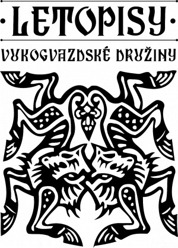
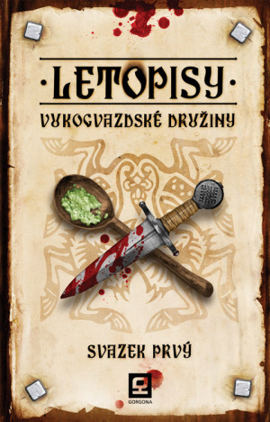
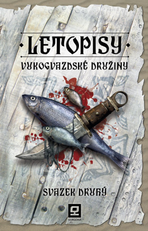
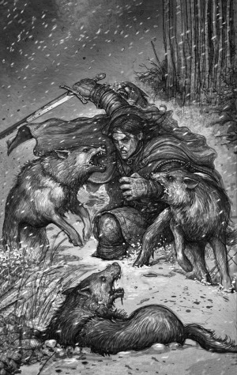
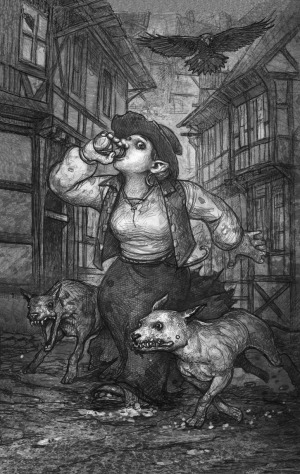

Vukogvazd neboli Vlčí hvozd se stal synonymem pro fantasy svět inspirovaný slovanskými, ale i nepříliš známými baltskými a ugrofinskými mýty a dějinami. Své hraní však Vukogvazdští pojali trochu jinak. Méně bezduchého vytloukání jeskyň, více role playingu a do detailu propracovaných charakterů. Důraz na příběh a jeho prožitek, na vztahy mezi postavami i na drsné reálie evropského středověku. A také snaha podělit se s ostatními příznivci her na hrdiny o své zážitky.

„Ztracené děti, znesvěcené hroby, tajemný skřet, sežehnutý chasník a navrch hadrové panenky. Seděla jsem nad korbelem piva v té velké rychtě, poslouchala nesouvislé vyprávění pána z Lovisberku a po zádech mi běhal mráz. Že já káča radši nevyrazila do toho Graslu sama!“

– _Meoda_ _(Starý Důl, LVD I.)_

## Zábava rovná se tvorba

Už od samého začátku totiž Vukogvazdští své odehrané příběhy sepisovali a vystavovali pro potěšení spřízněných duší na svých webových stránkách [vukogvazd.cz](http://vukogvazd.cz). „Inspirovala nás tehdy populární Historie Nurnské družiny, které jsme se chtěli vyrovnat,“ vzpomíná Honza Kravčík, jeden ze zakladatelů Vukogvazdské družiny. „I my chtěli sdílet své příběhy, jejich zápletky, prostředí a vůbec zážitky ze hry. Ale šli jsme na to jiným způsobem.“

Šlo o svého druhu unikum. Každý hráč popisoval příběh z pohledu své postavy a pán jeskyně (kterému Vukogvazdští přezdívají dějmistr) texty redigoval a skládal z nich dohromady celý děj. Vznikla tak zajímavá fúze mezi hrou, realitou a literaturou – jednolitý příběh viděný očima několika postav najednou.

Kupodivu tato forma slavila úspěch. Spisky byly staromilsky pokřtěny na Letopisy a brzičko si našly své nadšené a věrné čtenáře. Byly trochu jiné než běžná fantasy produkce. Nehrdinské, syrově realistické a přece plné pohádkového tajemna, čar a nestvůr. Hlavními postavami Letopisů nebyli uhrančiví rytíři či přemoudřelí mágové. Spíš obyčejní lidé z masa a kostí, vyvrženci a tuláci, které v první řadě zajímá, jak utišit hladový břich a kde urvat nějaký ten groš. I proto se ve vukogvazdských příbězích tolik kleje, občas obcuje a zhusta umírá.

Jaké bylo ovšem překvapení tvůrců, když se návštěvníci webu začali čím dál více dovolávat dalších a dalších příběhů. A když špalík svazků přerostl hlavu družinové půlčice Meody, padlo rozhodnutí – Letopisy se musí vydat knižně!

## Skromně, chlapi, hlavně skromně

Nastalo období lopotného přepisování, škrtání a upravování prvních dobrodružství. Práce to byla pomalá, zato však náročná. Zpravidla zůstaly původní dějové linky i většina postav, ale literární postupy doznaly zásadních změn. Aby knihy mohli číst všichni, nejen příznivci RPG, bylo nutné příběhy vymanit z herních mechanismů Dračího doupěte. Také bylo záhodno dopodrobna rozpracovat svět, který během let zbytněl v pestrý celek, čítající na třicet království, knížectví a městských států o rozloze Evropy. Asi nejtvrdším oříškem pak bylo vytvořit každému z hrdinů svébytný projev, který by ho dostatečně odlišoval od ostatních a zároveň příliš nevyčníval z celkové atmosféry.

Bezbřehé nadšení a neutuchající zápal však tvůrce neopustil, a když jedenácté léto po přelomu tisíciletí dopsali poslední řádek prvního svazku přepracovaných Letopisů, bylo dokonáno. Vznikla zatraceně špinavá fantasy, která vyšla v nakladatelství Gorgona.

„Letopisy se běžné produkci vymykají i vytříbeným, bohatým jazykem a specifickým slovním humorem.“

_– Josef Šrámek, FantasyPlanet.cz_

Z původní herní skupiny zůstali pouze čtyři nadšenci. Nevděčnou roli tažného vola na sebe vzal Honza Kravčík, který lehce pozměněné příběhy upravuje a sepisuje. Vojta Sedláček slouží jako první linie zpětné vazby a hlavní poradní hlas. Jéňa Kremer usiluje o udržení jedinečného stylu a vymýcení historických nesmyslů, kterými fantasy zpravidla přetéká. Tvůrčí rovnováhu doplňuje Honza Hnátek, který často a rád tmelí kolektiv. Vše zpovzdálí shovívavě pozoruje Hana Fruhwirtová, šéfredaktorka nakladatelství Gorgona, která se do věci vkládá ve chvíli, kdy rozverné nápady čtveřice začínají být nesnesitelné. „Se vznikem knižních Letopisů vzniklo i nakladatelství Gorgona, protože chcete-li vydat knihu podle svých představ, musíte si ji vydat sami,“ vysvětluje Hana. „Zároveň jsme se rozhodli oblažit české čtenářstvo i zahraniční fantasy, kvalitně zpracovanou, a to jak po stránce grafické, tak jazykové.“

Všichni se na tvorbě Letopisů podílejí dle svých možností. Pomáhá jim v tom i jejich zaměstnání, potažmo vzdělání. Spojí-li se zkušenosti filologů, historika a programátora, literatura je pak nejen zábavná, ale skutečně funkční a neodehrává se v kašírovaných pseudostředověkých kulisách.

## Budiž kniha!

První svazek Letopisů Vukogvazdské družiny (LVD) vyšel roku 2011 a recenzenti se začali předhánět v superlativech. Honza Holan na stránkách [Fantasya.cz](http://fantasya.cz/clanek/letopisy-vukogvazdske-druziny-svazek-prvy-draci-doupe-z-jineho-uhlu-pohledu) napsal, že jde o naprostý unikát a dodal: „Rozhodně se jedná o vynikající dílo, které byste si neměli nechat ujít.“ Tereza Zoulová z [Fanzine.cz](http://fanzine.topzine.cz/recenze-kniha-letopisy-vukogvazdske-druziny-nabizi-dost-spiny-pro-vsechny) ohodnotila prvotinu devadesáti procenty a pochvalovala si jazykovou stránku textu: „Nad klenoty vyšťouranými kdesi v zaprášených poličkách rodného jazyka zaplesá srdce nejednoho bohemisty a ostatní mají jedinečnou příležitost pochytit něco nového.“ Neméně nadšené byly ohlasy dlouholetých fanoušků.

Úspěch a chvála povzbudily a autoři se záhy vrhli do tvorby dílu druhého, který se podařilo dostat na knižní pulty roku 2013. Obálky se opět zhostil věhlasný polský ilustrátor Piotr Cieśliński, vnitřní ilustrace po finské komiksové kreslířce Ainur Elmgrenové, která se podílela na prvním svazku, převzal neméně slavný Polák Dominik Broniek. Další svazek vzbudil ještě více nadšených čtenářských ohlasů než ten předchozí.

Petr Kozelka z deníku Právo napsal: „Letopisy vol. II jsou skvělým příspěvkem do české fantasy knihovničky, svou originalitou vyprávění, neobvyklým jazykem a také výběrem hrdinů, kteří jsou ‚obyčejnými lidmi‘.“ Honza Holan se opět rozplýval: „Děj se obloukem vyhýbá vyjetým kolejím a tradičním žánrovým klišé se vysmívá zpovzdálí.“ Honza Žlebek na [Sardenu ](http://sarden.sedrick.cz/node/6668)v hodnocení obou dílů uzavírá: „Díky pečlivé redakční práci a do hloubky prokreslenému světu v pozadí se mohou Letopisy bez váhání zařadit na špičku herní literatury. A ostatní tituly jim ani nebudou dýchat na záda, jak dalece zůstanou pozadu.“

## Z čtenářského deníčku

A o čem tedy jsou Letopisy Vukogvazdské družiny? Každý svazek obsahuje tři dobrodružné příběhy tvořící dějově uzavřený celek. V prvním díle to jsou Salaš v horách, Starý Důl a Štvanice. Seznamujeme se v nich s mladými dobrodruhy – tuláky, uprchlými nevolníky či vandrujícími tovaryši, které náhoda svede na jednu cestu. Jejich osudy se spojí v touze po snadném výdělku a dobrodružství, ze kterého se pro mnohé stane boj o holý život. Ať už při bloudění po nebezpečných hraničních horách, pátrání po záhadně zmizelých dětech nebo stíhání krutého lapky do hloubi tajuplného hvozdu.

V prvním příběhu druhého svazku, nazvaném Malí páni, se družiníci střetnou s drsnou zimou ve Vlčím hvozdu a jsou nuceni hledat štěstí v bohatém přístavním městě. Varogovo požehnání je zavede do pohanských krajů, ve kterých platí trochu jiné obyčeje, ale venkoncem jde stejně jako všude jinde o kejhák. Třetí, nadmíru krvavá historie, poeticky nazvaná O ovcích a orlech, je strhujícím vyvrcholením celého svazku. „Dobrodružství v Orlích horách bylo legendou už v době, kdy jsme ho odehráli,“ vzpomíná Honza Kravčík. „Při vzpomínce na atmosféru strachu a věčného skrývání, kterou se tehdejšímu dějmistrovi podařilo vytvořit, mám husí kůži ještě teď. Snažili jsme se stejný pocit zprostředkovat i čtenářům a z jejich ohlasů vyplývá, že se to podařilo.“

„Znělo to jako nějaká pohádka. V knížectví za sedmero horama a devatero řekama vězní krutej kníže starýho biskupa a šíří klepy, že dědek přeřízl pár jeptišek. Aby celej svět uvěřil, že je to pravda, přinutí biskupova důvěrníka svědčit proti svýmu pánovi, se kterým je to rázem sakra nahnutý. Ale když nešťastnýho svědka vysvobodíme, biskupa neodsouděj a my nejspíš dostaneme půl knížectví a jalovou kněžnu za ženu.“

_– Lopin (O ovcích a orlech, LVD II.)_

## A co dál?

Jak už jste možná uhodli, vzniká i třetí díl Letopisů. Autoři by jich rádi viděli celkově pět, protože… Protože pentalogie prostě zní dobře a výborných odehraných příběhů z Vlčího hvozdu je přehršel. A tentokrát je ještě jeden cíl: vydat další svazek za méně než dva roky. Podaří se? Tvůrci mají slušně našlápnuto a vznikají i nové ilustrace, jejichž autorem bude opět skvělý Dominik Broniek. Ale víte, jak to bývá – člověk míní, knihy mění. Letošní zima jako termín vydání je odhad odvážný, ne však nereálný.

Autoři tedy píší, až se jim od klávesnice kouří, není to ovšem jejich jediná tvůrčí činnost. Pro všechny fanoušky Vukogvazdu chystají další překvapení. Mezi tu nej patří mapa světa, po které příznivci a čtenáři už dlouho volají. Ztvárnil ji Darměj Nadvědílo, jenž osobně celý svět prošel a brkem svým vše důkladně zaznamenal. Další peckou budou trička s letopisným motivem a chystá se i vukogvazdská kuchařka. Rozjeto je i pár dalších, neméně zajímavých projektů, které jsou prozatím tajemstvím.

Věrné družiníky a zástupce Gorgony můžete také vídat na různých žánrových akcích a conech, kde pravidelně přednášejí nejen o svém díle. V nejbližší době se chystají na Fantasy víkend v knihovně v Dobříši, a to na přelomu října a listopadu. Veškeré novinky a zajímavosti se samozřejmě můžete dozvědět na Facebooku – buď na stránkách Letopisů Vukogvazdské družiny nebo na stránkách Gorgony. Vítáni jsou všichni příznivci kvalitního čtiva. A vlků. Haúúúúú!

[www.letopisy.eu](www.letopisy.eu) | [www.fb.com/letopisy](www.fb.com/letopisy)

[www.gorgona.eu](www.gorgona.eu) | [www.fb.com/gorgonabooks](www.fb.com/gorgonabooks)
