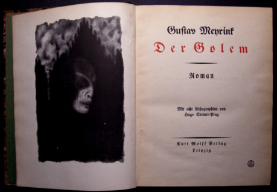
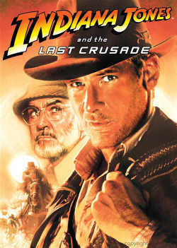
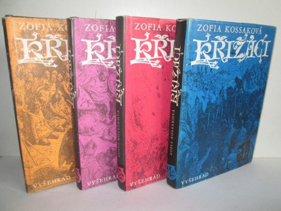

## I.

Na úvod rafinovanějších metod historické fikce je třeba vyslovit mocné kouzlo nejvyššího vypravěčského levelu. __Dvojexpozice.__ _Vezměte dva děje a pusťte je tak nějak přes sebe._ Tímto trikem se nám oba děje zajímavě zauzlí. Obě linie se obohacují. Dosáhnete toho, čemu říkal Havel _ozvláštnění_ a je jádrem úplně každého příběhu. Tedy, že při své zdánlivé reálnosti je příběh zároveň _neobvyklý_ a má vůbec smysl ho vyprávět.

Efekt dvojexpozice funguje v mnoha historických fikcích především jako konfrontace dvou časových linií. Příkladem dvojexpozice byl i _Titanik_ [v prvním díle seriálu](http://rpgforum.cz/forum/viewtopic.php?f=204&t=12582), na který jste zřejmě už málem zapomněli. Love story se střetla s katastrofickým románem. Celkem jednoduchý film _Julia a Julia_ takto postavil proti sobě dvě kuchařky Julie, jednu, autorku slavné knihy z doby světové války, a druhou, současnou bloggerku, píšící o té první. Film _Hodiny_, tvářící se nesmírně intelektuálně, nebyl nic jiného než tento vyprávěcí manévr. A vlastně úplně totéž je _Atlas mraků_. Ve všech příkladech se dva nebo více nestravitelně jednoduchých příběhů změnily v něco mnohem zajímavějšího a zábavnějšího.

V historické fikci je dvojexpozice metoda až zázračná. Díky tomu, že máme rovinu současnosti vypravěče, _zde a nyní_, a rovinu nějaké historie, o které vyprávíme, se podobná řešení sama nabízejí. Když si uvědomíme, že nám jde vlastně jen o konfrontaci časových dějů, pak je vlastně úplně nepodstatná technika, jak se nám ty dvě časové linie setkají. Nemá cenu trávit popisem stroje času nebo důmyslné časové magie stovku stran; můžete to vzít snadno a rychle. Pokud přijdete na to, které dva příběhy či postavy máte zkřížit, aby se to začalo vzájemně obohacovat, máte napůl vyhráno. Metoda udělá z vašeho příběhu příběh o třídu lepší, pokud to vezmete za správný konec.

Zdařilý příklad je román _Dům na pobřeží_ (1969) od Daphne du Maurierová. Prostě se přepínáme mezi postavami ve středověku a dnes, s jakýmsi mlhavým vysvětlením o nějakých drogách, které ten stav vyvolávají. A je to. Velmi podobně pracuje i Kate Mooseová, autorka _Labyrintu._ Nyní populární thrilleristka Gillian Flynnová sice nepřepíná stovky let daleko, obvykle jen do doby před pár lety, ale jako by se stalo. A řeší to ještě jednodušeji; prostě nadepíše scénu datem a vypravěčem; chvíli jede jeden příběh a chvíli druhý.

Jiný velký fanda dvojexpozic byl [Gustav Meyrink](http://drakkar.rpgplanet.cz/literatura/gustav-meyrink-–-lodivod-na-vodach-duchovna). _Golem_ užívá dvou příběhů, dvou postav a dvou světů; a celé vysvětlení je, že si na začátku postavy vyměnily klobouk. Ještě čistší příklad je _Anděl západního okna_, kde se takto prolínají hrdinovy osudy s osudy jeho dávného předka Johna Dee.

Můj úplně první samostatný román _Cesta vzhůru_ (1988) byl dvojexpozicí, kdy jsem se prostě držel dějové linky v kronikách a k tomu jsem přidával osudy hrdiny, což jsem byl já sám. Metoda přehazovala, manipulovala, upravovala a dávala dohromady skutečné věci, skutečné osoby, skutečné události, skutečné výroky, a to z věku z hlediska příběhu současného (12. století) a budoucího (našeho). Jen se to tvářilo fantasticky; vlastně bylo všechno reálné. Vzniklo něco mnohem chytřejšího a komplexnějšího, než bych byl schopen jinými prostředky dosáhnout. Metoda byla mocnější než moje tehdejší spisovatelské schopnosti. A vlastně mne už neopustila dodnes; výrazné rysy dvojexpozice lze najít i ve třetím románu [Sedm ryb](http://www.beletris.cz/e-shop/knihy/114-sedm-ryb-argonantus-9788087105894.html), o čtvrt století mladším. Ovšem jsou tu k vidění i metody další, o kterých ještě řeč bude.

## II.

Nyní je čas přikročit k metodě __archeothrilleru__. Ve skutečnosti je právě tohle asi úplně nejoblíbenější větev historické fikce. Hrdinové jsou při tom obvykle v naší současnosti a do té historie tak nějak zvenku nahlížejí, například jako badatelé. A obvykle zjistí, že se historie odehrála jinak, než se obecně věří. Takže najdou Svatý grál a Archu úmluvy.

_Indiana Jones_, samozřejmě.

Vlastně jsem nenašel jasného předchůdce. Spielberg a jeho parta se dovolávali dobrodružných comicsů pro chlapce ze třicátých let. To dnes už asi málokdo pamatuje, aby to zkontroloval.

Indiana Jones, jak známo, je archeolog a v jeho příbězích jde obvykle o legendární artefakt. Děj se sice odehrává – nebo spíše řítí – v Jonesově současnosti, nicméně do historie nahlížíme často a v těch chvílích se ocitne Jones v jakémsi dungeonu. Nastupují reálie připomínající fantasy hru. Je to [absolutní jinde](https://www.youtube.com/watch?v=Pr-8AP0To4k), kde se propadá podlaha, všude je plno nástrah a za dvě minuty se stane tolik věcí, že se nestačíte divit. Při tom se ovšem dbá, aby všechny rekvizity měly potřebnou historickou patinu a příslušná civilizace je – snad – uměla vyrobit. Při soudném pohledu nejspíš nevyrobila; ale v rámci vyprávěcí fikce to působí přesvědčivě.

Na druhý – nebo až další – pohled si uvědomíme, že i Jonesova _současnost_ je vlastně historická; děje se to obvykle někdy v době nacistů. Takže jsou to vlastně dvě různé historie, které se potkávají. Takže zase svérázná varianta dvojexpozice. Z paradigmatu jen lehce vybočil poslední příběh o křišťálové lebce, natočený o mnoho let později. Jonesova současnost se posunula do padesátých let, nacisty nahradili komunisti a předmětem historického pátrání jsou _archeokosmonauti_.

Typický je odlehčený tón vyprávění, elegantní humor a řítící se akce, která překoná všechna historicky podezřelejší místa. Zajímavé je, že autoři v obou historiích švindlují velmi málo a mají to nastudované dost pečlivě. Naopak umí dobové detaily efektně využít, když připomenu třeba velkolepý tank v _Poslední křížové výpravě._

Podobně jako u dříve probírané historické kategorie návštěvníků se údajná čistá zábava a švanda ve většině Jonesových příběhů zvrtla ve věci daleko závažnější. Dobrodružství míří k jistému sebepoznání hrdiny a zjištěním, která si velmi dlouho neuvědomuje divák ani Jonesovi oponenti. Například to, že v Arše vlastně sídlí _židovský Bůh_ a pro nacisty možná [není až tak rozumné ji hledat](https://www.youtube.com/watch?v=0APF3SO9tqE). Nejpůsobivější jsou právě finále, kdy se obě časové roviny setkají a začnou na sebe navazovat. Obě pointy dvou nejlepších Jonesů takto fungují. Scéna s otevřením Archy je přímo biblická. Stejně tak scéna, kdy je nalezen Grál.

Úspěch Jonesovského archeothrilleru byl kolosální a napodobeniny se začaly líhnout přímo masově. Většina z nich představuje více či méně zdařilé variace na Jonese. _Tomb Raider_ a jeho hrdinka Lara Croftová, původně legendární herní série, která se dočkala dvou velmi bídných filmových zpracování. _Knihovník Carsen Flynn_, který má jenom ta bídná filmová zpracování. Poměrně zánovní Bruckheimerovi _Lovci pokladů_, podstatně zdařilejší a zábavnější, ale síly vzoru přece jen nedosahující. _Mumie_, která v jádru zůstává také archeothrillerem. Je toho zkrátka strašně moc; staré a zázračné artefakty hledá dnes kdejaký jouda.

Hlavním Jonesovým dědicem je profesor Langdon. O __Danu Brownovi__ lze říci, že archeothriller rozhodně nevymyslel, ale velice ho zpopularizoval. Úplně největší megabestseller historické fikce všech dob a disciplín je _Da Vinci Code_ (2003). Můžeme s tím nesouhlasit, můžeme proti tomu protestovat, ale to je asi tak vše, co s tím můžeme dělat. Proti osmdesáti milionům prodaných knih je každý odpor marný.

Dokud psal Brown nehistorické technothrillery, tak se celkem nic převratného nedělo. Potom vyšťáral jádro nápadu o Ježíšovi a jeho potomcích. Ten nápad byl tak trochu veřejný majetek, protože kromě záhadopisných knih, jako _Svatá krev a Svatý grál_ (1982), se to mohl dozvědět třeba v románu od Kazantzakise _Poslední pokušení Ježíše Krista_ (1953), úspěšně zfilmovaném (1988), a kdyby přehlédl i tohle, mohl se to také dočíst jako turista v průvodci po jižní Francii. Tam to ví odedávna každý. Brown byl prostě ve správnou dobu na správném místě. Moc neumí psát, nápad nevymyslel, ale jeho zásluha vězí v tom, že to zabalil jako archeothriller a uvědomil si, jak [mocný potenciál v tom je](https://www.youtube.com/watch?v=KcfNpfaGejA). A i zde se skoro nechtěně podařily efekty daleko závažnější, než by Brown jinak uměl dosáhnout; metoda byla opět lepší než on sám. Je pozoruhodné, co všechno se o knize napsalo a kolik lidí nebylo schopno fikci a pravdu odlišit.

No a to je s tím Brownem vlastně celé; zkoušel ještě pro velký úspěch nápad několikrát recyklovat, ale funguje mu to stále hůře. Za povšimnutí stojí určitě filmová verze _Andělů a démonů_, napravující četné podivnosti originálu.

Archeothriller stále frčí a pro někoho to může být zlatý důl. Přiznám se, že pro mne nebyl. Kolem archeothrilleru jsem se jen mihnul v jediné povídce a i tam bylo ještě několik dalších témat. Ale třeba budete mít víc štěstí.

## III.

Někdy v patnácti letech jsem narazil na ještě mocnější a zajímavější metodu, kterou bych si dovolil nazvat __mytologická historická fikce__.

Za toto životní zjevení mohla [Zofia Kossaková](http://cs.wikipedia.org/wiki/Zofia_Kossak-Szczucka), polská katolická autorka. Její kolosální opus _Křižáci_ – který se plete se stejnojmennou a daleko slabší knihou od Sienkiewicze – popisuje osudy první křížové výpravy. Ježto jsou hrdinové věřící, je na scéně sem tam nějaký ten zázrak. Ježto jsou tam i pohani, pak i nějaké to pohanské kouzlo a strašidlo. Neděje se to moc často, ale pak to stojí zato. Ještě výraznější to je v jejím jiném románu _Úmluva_, který vypráví biblický příběh o Abrahámovi.

Tato větev historické fikce, jak už bylo řečeno, se notoricky plete s metodou odbočení do fantasy, jak ho praktikoval Morris nebo Tolkien. Rozdíl je přitom dost hluboký. Mytologická fikce prostě není jen tak vymyšlená; je daná historií samotnou. Efektu si lze kupodivu všimnout i u předchozího Jonesovského modelu. Artefakty, kolem nichž se celý děj točí, jsou nadpřirozené odedávna. Pokud existuje Archa, pak je nadpřirozená; jinak to není Archa. Jonese vlastně nelze natočit důsledně realisticky; fantastické reálie vězí přímo v podstatě historie. U Kossakové, která psala dávno před vznikem Jonese, jen je méně slavná, to funguje stejně. Svatí dělají zázraky, protože jsou svatí.

Tato zvláštní metoda vyprávění rozbíjí plno samozřejmostí. U historické fikce na Jiráskův způsob víme, že se to nestalo, je to fikce, ale _stát by se to mohlo_. U Tolkiena víme, že je to fikce a _stát by se to ani nemohlo_, protože hobiti a tak podobně neexistují.

Tady je to trochu jinak. Pokud se v dobách středověkých _věřilo_ v anděly i ďábly, potom fikce fungovala na jiném principu; všeobecně se to totiž pokládalo všechno za reálné. Tím nebylo zúčastněným vždy jasné, že vůbec o nějakou fikci jde, a mohli to vnímat jako toho Jiráska. A právě tak to není moc jasné u Kossakové, když celá křížová výprava je dokonce _true story_. Vůbec si nejsem jist, nakolik ví autorka, že zázraky neexistují, a stejně nejasné je to u jejích katolických čtenářů.

_Zdánlivě evidentní rozdíl fantastického a reálného se stírá._ Vlastně to funguje tak, jako by nejen hrdinové, ale i čtenáři odcestovali do středověku a viděli situaci tehdejšíma očima. Sepětí čtenáře a hrdiny je tak podstatně těsnější.

V modelu mytologické fikce si tedy autor ponechává úplně základní výhodu historie, že _se opravdu odehrála, jak každý ví_. Pokud naproti tomu konstruuje fantastický svět, musí se smířit s tím, že to nikdy nebude stejně přesvědčivé. Vždy platí určitou daň v oslabení té vyprávěcí fikce. Je to každým kouzlem a strašidlem víc fiktivní a méně uvěřitelné.

Kossaková a její žáci na to jdou přesně z opačného konce; _je třeba být realistický, dokud to jde. Vše fantastické má mít vždycky nějaký důvod a smysl. A i ta fantazie musí být historická._

Možná máte problém psát o andělích a démonech, neb jste beznadějně nevěřící. Nevadí; můžete si takto vypůjčovat z jiných mytologií. Je často využívaný úhel pohledu starého Slovana, Vikinga nebo Egypťana, pokud na to autor má.

Mezi autory, kteří na mne měli vliv od prapočátků, patří Kossaková na čestné místo. Také mezi knihami, o kterých byla doposud ve všech dílů historické fikce řeč, jsou _Křižáci_ beznadějně nejlepší.

V době psaní _Souboje_ (1991) o moji duši zápasili Kossaková s Tolkienem. Z povídky je zřejmé, že Tolkien těsně vyhrál; ale přesto, dal jsem si velmi záležet, aby všechny fantastické prvky byly co nejdůsledněji historické, doložené autentickými nálezy, popsané na příslušné straně pravé středověké kroniky. Část příběhu, kde se poprvé zjevuje Argonantus a používají se fantasy kouzla, vnímám dnes jako rušivou a už bych to dnes řešil jinak.

Na přelomu tisíciletí ale Kossaková začala Tolkienovi vracet úder. Tehdy docházelo zejména ke __zkřížení historické mytologické fikce s příběhem o strašidle__, které je co možná nejlépe historicky doložené. Tento nápad mohu jenom doporučit, protože mne zklamal opravdu málokdy. Strašidlo v roli situace odkryje ty nejskrytější záhyby lidských duší a v historických kulisách se strašidlům daří možná ještě lépe než v současnosti. Strašidlo nemusíte pracně vynalézat, ale stačí po něm zapátrat v příslušné mytologii nebo pověstech.

## IV.

V době, kdy jsem se vlastními klopotnými cestami pídil k vynálezu historické fikce, která je ochotna odbočit od kanonické historie, ale přesto zůstává historií a nepřeleze do fantasy, dospěla k podobným objevům i světová literatura. Byl jsem něco jako Jára Cimrman, který ve své osamělé laboratoři vybádal, jak správně ředit kyselinu, aniž by tušil, že se o tomtéž může dočíst v jednom světovém bestselleru.

Je řeč o muži jménem [Umberto Eco](http://cs.wikipedia.org/wiki/Umberto_Eco), který bývá považován za praotce všech historií, které kašlou na historickou věrnost, ale při tom se ještě stihnou tvářit, že tomu tak není. Jak jsme viděli, ne zcela právem, protože třeba Kossaková byla určitě daleko dřív. Eco je ale určitě nejslavnější a v megabestsellerech historické fikce ho překonává jenom ten Dan Brown. Rokem nula je potom rok __1980__, kdy vyšlo _Jméno růže._ Ve své době to četl prakticky každý. Ecova metoda, kterou bych nazval __komplexní historická fikce__, je při tom opět trochu jiná.

Především, všechna technická udělátka, jako stroj času, vzpomínky, záhadné drogy a kouzelné prsteny, tu chybí. Nepozorný čtenář by to mohl chápat jako čistě historický román jiráskovského typu. Ve skutečnosti tu došlo k mnoha velejemným zásahům s netušenými důsledky. Dvojexpozice dvou časů trvá, ale všechno cizorodé se schovalo. Takže třeba, do 14. století se dostavil v kutně františkána osobně Sherlock Holmes, přejmenovaný – s veselým pomrkáváním na znalé – na Viléma z Baskervillu, se svým pomocníkem jménem Adso (skloňováno česky _Adsone_). Vilém z Baskervillu primárně získává poznání; není to bojovník, ale spíš něco mezi čarodějem a detektivem; do akce se spíš připlete, než že by ji vyhledával. Tohle má společné s mnohými následovníky.

Připomínám, že ani __středověkou detektivku__ přitom Eco nevymyslel. Už byla řeč v detektivkách, že jsou na světě autoři jako Robert van Gulik, který psal o čínském _soudci Ti_ dávno před Ecovou knihou. Z našich luhů a hájů se nabízí také docela starobylý _Zločin na Zlenicích hradě l. p. 1318_ od Radovana Šimáčka (již z roku 1941).

Jenže rovina historické detektivky, to je jen jedna z mnoha moderních strun, na kterou mistr Eco hraje. Ona je to zároveň učebnice všech heretických hnutí, které hýbaly přelomem 13. a 14. století. Také se tu řeší problém inkvizice, a to z pohledu, kterého by asi byl málokterý současník schopen. A vlastně je to také _román o knihách a o slovech;_ to je daleko důležitější než nějaké postavy a hrdinové. V klášteře také stojí knihovna, připomínající strašidelné bludiště, kterou ve 14. století zaručeně nikdo nepostavil. Podobně Vilémovy úvahy o významu slov a vlastních jménech, vydávající se za scholastickou diskusi, jsou ve skutečnosti přednáškou z postmoderní sémiotiky.

Zkrátka, cílem Umberta Eca rozhodně není _ukázat historii, jaká byla,_ nebo _jak ji tehdy viděli_, ale demonstrovat zcela současné teze v atraktivním hávu středověké detektivky. Historie funguje v _komplexní fikci_ jako husa, která je vycpána důmyslnou nádivkou ze všeho možného. Podmínkou je, že ta novodobá nádivka musí být v huse dokonale ukrytá a nepůsobit ani trochu cizorodě. Tyto manipulace, jakkoli nenápadné, jsou jádrem vyprávění. _Kvůli nim se to všechno děje._ Pokud by manipulace smysl neměla, autor ji neudělá.

Základem úspěchu je pochopitelně kolosální znalost. Eco ví o středověku tolik, co vzdělaný středověký mnich. Výborné znalosti jazyků a občasné slovní hříčky v latině jsou jednou z takových vychytávek dohánějících čtenáře k zoufalství. Nebo moje oblíbená pasáž, kdy Adso _několik stránek_ popisuje tympanon nade dveřmi kostela.

Nutno říci, že tuto výtečnou knihu vlastně nepřekonal ani sám Eco. Později se už tomuto typu historické fikce věnoval stále méně a z nastoupené cesty odbočil, obvykle ke své vlastní škodě. Výjimkou je _Foucaultovo kyvadlo_ (1989), které je neméně kolosálním a komplexním případem archeothrilleru, pro změnu s prvky mytologické fikce. Jde o napínavé putování skrze všechny světové magické praktiky všech míst a věků. Já osobně mám _Kyvadlo_ ještě raději než _Jméno růže_, ale přiznávám, že jsem v drtivé menšině.

Pozdější Ecovy knihy, jako _Ostrov včerejšího dne_ nebo _Baudolino_, už zdaleka takové obliby nedosáhly. Mihne se tu metoda _Jména růže,_ ale autor se bohužel tolik nadchl svými slovními a historickými ekvilibristikami, že ho úplně přestal zajímat čtenář a příběh. _Ostrov_ nemá naprosto žádný děj, což je u knihy této délky děsivé. Když se vrátím k té huse, pak v tomto případě husa explodovala v důsledku přecpání příliš mnoha významy a výsledek je dost nepoživatelný.

_Baudolino_ je šílený ještě z jiného důvodu; jde o knihu, která je úmyslně lživá. Baudolino je pábitel, který si vymýšlí; postupně ztrácíme jistotu nejen o tom, co se odehrálo doopravdy, ale zda byl vůbec nějaký Baudolino a proč nám to celé Eco vlastně vypráví. Je tu zbořena i ta nejzákladnější jistota každé _fiction_ a vyprávění vůbec; totiž, že ději věří alespoň jeho účastníci.

Po přímluvách ovšem musím uznat Baudolinovi alespoň bod za experiment.

## V.

Ecovo _Jméno růže_ mělo přesto následovníky. Mnoho následovníků a také méně slavných současníků. Po osmdesátých letech, kdy se zjevili Eco a Indiana Jones, došlo k velké rehabilitaci historické fikce. A metody, popsané v tomto seriálu, se začaly mísit nejbizarnějšími způsoby.

Tady mi byl vhodně připomenut autor, který využívá dvojexpozice, nicméně nějak vybočuje ze všech měřítek. Moc nesedí do sci-fi ani do fantasy a i zařazení do historické fikce s dvojexpozicí je poměrně těsné. [Robert Holdstock](http://cs.wikipedia.org/wiki/Robert_Holdstock).

Klíčovým nápadem je to, že celá minulost lidstva přetrvává v našich hlavách. Všechna mýtická zjevení, počínaje pravěkými lovci mamutů přes krále Arthura a třeba v našich místních podmínkách Bivoje s kancem, __někde na dně naší mysli stále jsou__; a jakmile se ocitneme ve vhodném prostředí původního lesa, začnou se zjevovat někde na okraji našeho periferního vidění. A jsou stále reálnější, až nakonec ožijí.

První průlomovou knihu _Les mytág_ jsem četl v půli devadesátých let v konkurenci jiných tehdejších zjevení a rozhodně za nimi nijak nezaostávala. Nápad sám by nestačil; Holdstock ho umí dokonale využít. Patří k té generaci spisovatelů, která rozhodně psát umí. A patří mezi těžké spisovatele, jako třeba Meyrink nebo Eco; rozhodně neočekávejte jednoduchý děj a standardní fantasy situace, ke kterým by podobný základ sváděl. Při tom je _Les mytág_ ještě spíše z té jednodušší kategorie mistrových knih; to se teprve rozehříval. U dalších pokračování, jako _Lavondyss_ nebo _Dávné ozvěny_, se teprve rozjel do opravdových orgií hlubinné psychologie. Má věrné fanoušky i v těchto nejextrémnějších dílech; já se přiznám, že se mi tím trochu vzdálil, protože příběh pokládám za základ dobrého románu za všech okolností. Nicméně, vyplatilo se Holdstocka levým okem sledovat i nadále, protože dodatečně vytvořil ještě několik dalších úžasných knih, jako třeba _Merlinův les_ nebo _Fantom_.

Nevýhodou Holdstocka pro jiné spisovatele je, že ho naprosto nejde napodobit; každý ihned pozná, odkud vítr vane.

I další, dávno zavedení spisovatelé, začali pošilhávat po historické fikci. Již vzpomenutý Michael Crichton, autor už probraného _Timeline_, je autorem starší a daleko zdařilejší knihy jménem _13th Warrior_, u nás _Pojídači mrtvých_; zfilmováno s Banderasem jako _Vikingové_. Opět se to tváří jako dokonalá historie; jen se tam bez dalšího varování vsunul jeden podstatný nápad ze sci-fi. Knížka je krátká, ale výrazně dobrá; film dopadl spíše průměrně.

Výjimečně skvělou filmovou fikcí byla Bessonova [Johanka z Arku](https://www.youtube.com/watch?v=7jkh9J_b5HM). I zde plno lidí neodhalilo, že uvnitř zdánlivě dost autentické historie se skrývají vložená obecnější témata; pár meyrinkovských scén zůstalo spíše nepochopeno. Jediný nečekaný příbuzný je asi dávná Vláčilova _Markéta Lazarová;_ ta se tváří o něco autentičtěji, ale i zde je to výrazná stylizace. Zde si nejsem jist, kolik těch historických manipulací má na svědomí Vančurova předloha.

Jiný komplikovaný případ je kniha _Historie světa v deseti a půl kapitolách_ od Juliana Barnese. Inzerované téma historie světa je viděné výlučně skrze mořeplavbu. Prvním z těch obrazů je příběh Noemovy archy, ovšem viděný červotočem na lodi. Jindy jde o rozbor skutečného obrazu, [Voru Medusy](http://cs.wikipedia.org/wiki/Vor_Medúzy). A taky _Bílé velryby_ a _Čelistí_. Celé je to tak nějak zlomyslně zpřeházené, takže výsledné námořnické dějiny světa nakonec působí úplně jinak, než jak je známe.

Podobný nápad, asi všeobecně známý, jsou Tarantinovi _Hanebný pancharti_. I tady jsou manipulace s historií vysloveně zlovolné až podlé; vlastně skoro všechny události se staly, ale tak nějak jinak a v jinou dobu. Tarantino má perfektně nastudované detaily ohledně války, německého filmu a všeho možného, ale není třeba příliš přesvědčovat, že s touto historií je cosi velice v nepořádku. _Hanebný pancharti_ jsou sice tak trochu veselá nadsázka, ale co chvíli vzniká situace, která vlastně není veselá ani trochu. Například ta úplně první scéna.

Český velikán Miloš Urban bývá občas zmíněn jako „český Dan Brown“, ale velmi nepřesně. Vydal [Sedmikostelí](http://cs.wikipedia.org/wiki/Sedmikostelí) už 1998, v době, kdy Dan Brown ještě psal computerové thrillery. A zejména, nejde o archeothriller, ale daleko spíše komplexní fikci, kde je daleko případnější příklad Umberto Eco a _Jméno růže_. A také bych přihodil na váhu Gustava Meyrinka. _Sedmikostelí_ je totiž kromě detektivky také iniciační dvojexpozice. Od mrtvoly k mrtvole až k opravdovému poznání a zasvěcení. Kromě materiálních stop děj posouvají různá vnuknutí, tušení a náhlá zjevení, právě jako kdysi u Meyrinka. Urbanův duch je jasně nakloněn fantastickým scénám; často necítí potřebu všechno vysvětlovat. Iracionální logika dějů a jednání postav je stejně platná jako Holmesovská racionální úvaha; vše se pohybuje někde uprostřed mezi těmito možnostmi.

Zajímavé je to tím, že _Sedmikostelí_ je lepší kniha než _Jméno růže._ Předpokládám, že pár slabších jedinců nad drzostí mého prohlášení právě omdlelo; ale například velikost finálního efektu nebo přímo intimní přesvědčivost postav je u Eca zjevně nedostižena. Od Meyrinkových dob se snad nikdo nedostal tak daleko jako Urban v _Sedmikostelí_.

Historická fikce v různých podobách provází Urbana po většině díla; a _Sedmikostelí_ (1998) se mu stalo jistým zakletím, které od té doby marně zkouší dostihnout v _Hastrmanovi_ (2001) a _Stínu katedrály_ (2003), v _Santiniho jazyce_ (2005) i v románu _Lord Mord_ (2008). Podle mne se mu to už nikdy nepodařilo; nejsou to vůbec špatné knihy, ale _Sedmikostelí_ je beznadějně nejlepší. Za zmínku stojí přesto dost výrazný _Hastrman_, který je tak nějak rustikální, dost krvavý a zvláštním způsobem rezonující s Máchovým _Májem_. A jen lehce stranou stojící hodně zdařilá _Poslední tečka za Rukopisy_.

Zajímavé je, a to mají společné Eco i Urban, že je moc nejde zfilmovat. Je tu plno duchovních a literárních jemností, které lze rukou necitlivou zničit. Zfilmovaný _Santiniho jazyk_, jakož i _Jméno růže_ budiž věčnou výstrahou všem snaživcům, co na to nemají. Jak laciný český Strachův pokus, tak drahý hollywoodský blockbuster se Seanem Connerym považuji za naprostou katastrofu; vznikl z toho prostě takový středověký brownovský thriller, ze kterého zmizely všechny jazykové a filosofické vychytávky. V intencích této poznámky nepovažuji za náhodu, že se ještě nikdo nepokusil o zfilmování Gustava Meyrinka.

## VI.

Takže abyste z toho chaotického guláše něco měli. Bavíme se tu o extrémně složitých metodách neprozkoumaného žánru a přiznám se, že si zdaleka nejsem se vším jist. Takže malé shrnutí proti zabloudění.

Základem historické fikce ve všech podobách je to, že _z nějakého důvodu vám nestačí k vyprávění běžná realita_ a potřebujete ve vyprávění něco, co je mimo obecnou zkušenost.

Na druhou stranu, nechce se vám vyrábět realitu úplně odlišnou, tedy vrhnout se do fantasy. A také vás nelákají technicistní rekvizity sci-fi. _Chcete psát co nejvěrohodněji, jakoby realisticky, užívat toho, co se stalo, jak každý ví, ale ve skutečnosti se zároveň snažíte propašovat do příběhu něco, co vlastně reálné není._

Důvody této vaší snahy mohou být nejrůznější; chcete tam detektivku, strašidlo, duchovní iniciaci nebo třeba jen zajímavější vyprávění s dvojexpozicí dvou časových rovin.

V tomto smyslu jsou popsané subžánry či vyprávěcí metody různé triky, jak podobných efektů dosáhnout:

1. __Romantická historická fikce__ Waltera Scot­ta a
1. __vědecká historická fikce__ Aloise Jiráska jsou dvě základní metody, jak na to jít. Popsali jsme je v prvém díle. Obě jsou dnes v čisté podobě asi mrtvé, ale jejich stopy naopak nacházíme prakticky všude.
1. __Fantastická fikce čili fantasy__. Jak k této odbočce došlo, je popsáno v druhém díle. Případ, kdy to autor s historickou věrností zabalil.
1. __Návštěvníci.__ Historie vás zajímá obvykle méně, láká vás ta konfrontace dvou světů. Podrobnosti viz druhý díl.
1. __Cestování časem.__ Tedy třeba ani ne do historie, nýbrž po málo vzdálených časových rovinách; a je to daleko více typ sci-fi než historické fikce; ale některé principy jsou příbuzné. Také druhý díl.
1. __Alternativní historie.__ Historii je třeba z nějakých důvodů změnit. Druhý díl.
1. __Archeokosmonauti.__ Společná disciplína sci-fi, fantasy i historie; a spíš to vychází z módy. Druhý díl.
1. __Dvojexpozice.__ Dva děje přes sebe. Kašlete na to, jak je to možné; prostě to vyprávějte a propojujte. Vyspělejší varianta verzí 4 a 5. Třetí díl.
1. __Archeothriller.__ Do historie jen nahlíží a je to v současnosti asi vůbec nejúspěšnější odrůda historické fikce. Třetí díl.
1. __Mytologická fikce__. Přidají se tam autentičtí bohové, démoni, strašidla, artefakty, zázraky. Zdánlivě fantasy, ale vlastně něco jiného.
1. __Komplexní historická fikce.__ Můžete tam přidat vlastně nakonec úplně cokoli, pokud to dokážete dokonale zamaskovat.

Věřím a vyzkoušel jsem, že zejména poslední metody, popsané v tomto posledním pokračování, dávají tak obrovské možnosti vyprávění, že tomu mohou sesterské žánry sci-fi a fantasy jen těžko konkurovat. Mám podezření, že docela vysoké procento údajných spisovatelů fantasy tajně prchá podobnými směry; vlastně už dávno fantasy nepíší, jen se to neodvážili svým čtenářům prozradit.

Ač je historická fikce nejstarší z této skupiny žánrů, ukazuje se, že má možná největší výdrž a že o ní ještě uslyšíme.
