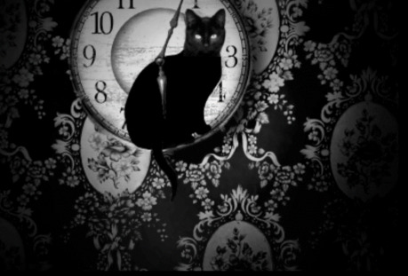
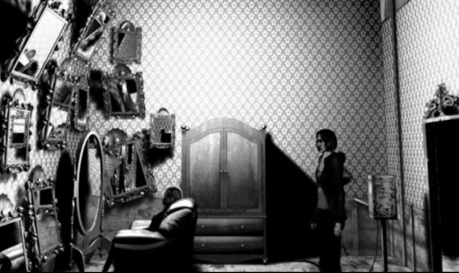
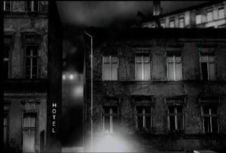
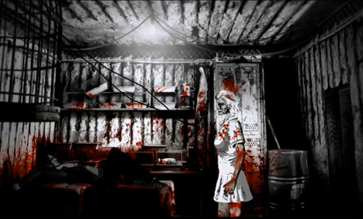

Mnoho velkých příběhů končí sebevraždou. Tenhle jí ale začíná. Hráč se ocitne v kůži Susan Ashworthové, jejíž život se sestává ze samoty, melancholických vzpomínek, kouření cigaret na balkoně v dešti a krmení pouličních koček, jež přivolává hrou truchlivé písně na klavír. Kočky jsou jejími jedinými přáteli. Na nikoho jiného se kromě nich nemůže spolehnout a ony jsou také jediné, kdo ji po její smrti skutečně oplakává. Sousedé Susan považují za podivínku, která činžovní dům zamořila toulavými kočkami, a přezdívají jí nelichotivě „Cat Lady“.

Během prvních minut této hororové indie adventury jsme konfrontováni s bezvýchodností a samotou, kterou Susan Ashworthová ve svém životě pociťuje. Právě píše dopis na rozloučenou (jenž si pravděpodobně nikdo nepřečte), jen chvíli poté, co spolykala lahvičku prášků. Nečeká ji však poklidná cesta na druhý břeh, ba právě naopak. Susan Ashworthová na prapodivném přestupním místě mezi životem a smrtí dostává další šanci – šanci vrátit se zpět do našeho světa. Cesta zpátky mezi smrtelníky ale není ani pro slabé povahy, vyžaduje ochotu umazat se krví. Susan přislíbí, že se v našem světě „postará“ o Parazity – vrahy, šílence a devianty. Monstra žijící mezi námi, která se skrývají za tváří usměvavého souseda nebo třeba laskavého psychiatra. Výměnou za to nezíská (alespoň dočasně) nic menšího než nesmrtelnost (pochopitelně proto, že likvidace Hannibala Lectera a jeho kumpánů obvykle vyžaduje více než jeden pokus).

Pro hru je charakteristická temná a tísnivá atmosféra s hororovými tóny, za něž by se nestyděl ani Hitchcock. Dění ve hře je nasvíceno pochmurným přísvitem pouličních lamp v mlze či blikajících zářivek na chodbách psychiatrického oddělení a podkresleno zvuky deště, vzdálenými výkřiky nebo jen zlověstným tichem. Všednodenní realitu střídají groteskní momenty a dění, které může, ale taky nemusí být horečnatým snem, či halucinací. Tíživé, zneklidňující a mnohdy až mrazivé vyznění příběhu nás nemůže nechat na pochybách, že The Cat Lady patří mezi ty vydařenější zástupce her nabízejících výlety do domu hrůzy.

Hra je rozdělena do 7 kapitol (Legenda o Kočičí vdově, Druhý první nádech, Některé květiny se nikdy neotáčejí za sluncem….), které se liší jak svým charakterem, tak i dynamikou. I když je první z nich (Domeček v lese) zpočátku spíše pomalá a lehce matoucí, stojí za to u hry vydržet, protože pak přijdou na řadu brokovnice, slibovaní psychopati a také dobrý příběh. Nejvydařenější kapitolou je Kulka pro Susan, která pracuje s ověřenými hororovými prvky a kulisami, je nejvíce děsivá a napínavá od samého začátku až do úplného konce.

Hráči The Cat Lady je ponechána jen relativně malá volnost, ať už ve způsobu řešení problémů (pokud si například usmyslíte, že chcete šíleného kanibala, který vás vězní ve svém sídle, umlátit cihlou, nemůžete, protože cihlu je potřeba použít za jiným účelem) nebo v zasahování do děje. Hra vyvolává dojem filmovosti, kdy se z hráče stává herec v příběhu života Susan Ashwortové, jenž už byl z velké části napsán a otevřený zůstává pouze jeho konec, který je ve vašich rukou. Nicméně to není nutně na škodu, protože hra staví především na působivé atmosféře, silné příběhové lince a propracovaných detailech.

Na hráče čeká i několik strašidelných hádanek a rébusů, ať už v opuštěném hotelu, domě kanibalů, nebo kdesi ve snové realitě, kde dveře střeží prolhané panenky a jen jedny z dveří vedou zpátky do světa živých. K jejich řešení obvykle poslouží předměty, s nimiž se Susan setkala, byť se zdají být sebevšednější nebo sebevýstřednější (plynová maska, černé svatební šaty a spol.). Výhodou je ve hře fakt, že každý předmět je jako ona příslovečná Čechovova puška – má svůj význam a budete ho nutně muset použít; třeba k tomu, abyste si zachránili život. _Ano, v této hře si můžete zachránit život pomocí utržené hlavy panenky a nohy od židle._

The Cat Lady ale není jen tuctový horor, v němž se snažíte zabít ty, co vám jdou po krku, dřív, než dostanou oni vás. Je mnohem víc. Ne náhodou připomíná The Cat Lady iniciační román. Susanin boj o přežití má také symbolický smysl – je o hledání nové cesty, skutečného nebo možná lepšího sebe sama a vyššího smyslu ve světě, který je nespravedlivý, chladný a temný. To největší zlo, z nějž tuhne krev žilách, se však skrývá v lidském nitru – a právě tomu se musí Susan Ashworthová postavit a přežít. Ale možná má jen tolik životů jako kočka… Budou jí stačit?
