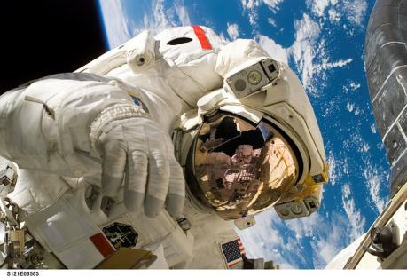

Crithonian Revenge je tři století stará bitevní loď zničená v bitvě u Selucu. Tento mohutný koráb tvoří jeden z prvních kusů Vraku – nachází se v jeho středu, takže tu otáčení Vraku nevytváří gravitaci. Není tu ani atmosféra, protože loď byla zničena v zuřivé bitvě, takže trup lodi je posetý děrami po explozích, které ho rozpáraly. Kromě několika málo sekcí, které uzavřely automatické přepážky, je v jeho chodbách a místnostech jen vakuum, které zakonzervovalo celou scénu tak, jak vypadala před třemi stoletími. Loď explodovala a byla zničena přetížením reaktoru ve chvíli, kdy se ji pokoušel obsadit federační výsadek. Tato exploze loď prakticky rozpárala na levoboku a byla natolik poškozená, že ji po bitvě neodtáhla ani jedna z bojujících stran, protože pro ni neměli žádné využití. Na lodi se v některých nepoškozených skladech stále nacházejí vojenské zásoby, zbraně a munice (to také může být důvod, proč na loď jít, lze tu nalézt i nukleární hlavici, kterou výbuch neodpálil).

Na palubě lodi se musí postavy pohybovat ve skafandrech a ve stavu beztíže, takže pohyb je ztížen. V chodbách se vznášejí mrtvoly federálních mariňáků i obránců, kteří zemřeli při vzájemném boji. Některé mrtvoly se dodnes škrtí, probodávají noži nebo visí vedle sebe jako zmrzlé kusy masa, zatímco jejich prolitá krev stále poletuje kolem. Na lodi nikdo nepřežil. I těch několik chudáků, kterým se podařilo nasoukat se včas do skafandrů, se o několik hodin později udusilo, protože k vraku lodi se nikdy nedostali záchranáři.

Hned od počátku vstupu do lodi by Vypravěč měl navodit tísnivou atmosféru. Postavy mají na sobě skafandry, které omezují pohyb a hlavně vidění (Vypravěč by měl popisovat klaustrofobické pocity a hrát na tuto notu, nikdo není rád v těsné plechovce, kde vás jen tenká vrstva mylaru dělí od mrazivého kosmu), na lodi není gravitace ani atmosféra (roztrhanými stěnami lodi dovnitř občas zasvitne záře vzdálených sluncí a je vidět ostatní mlčenlivé lodě Vraku) a všude jsou mrtvoly. Vypravěč by měl popisovat, jak se postavy prodírají dál bitevními scénami, nalézají skafandry s těmi, kteří se udusili (a třeba namluvili zvukový záznam pro své blízké, kteří jsou už dávno mrtví)… a začíná se jich zmocňovat stále víc a víc tísnivý pocit, že je někdo sleduje.

Hráči budou mít pocit, že několikrát na okraji světelného kuželu svých baterek něco zahlédnou, ale kdykoli se to rozhodnou prozkoumat, nic nenajdou. Začne je všechny bolet hlava a soustředění ve skafandrech začne být ještě problematičtější (Geigerovy počítače nicméně tvrdí, že radiace je v normě). Pak si všimnou, že některé z kamer na lodi, které zůstaly neporušené, se za nimi otočily, jak prošli. V jeden moment pocit cizí přítomnosti zeslábne, stejně jako bolest v hlavách, načež se loď zachvěje (o kus vzdálený výbuch kvůli vakuu neuslyší, ale mohou ho bokem lodi vidět)… a tísnivý pocit se vrátí zpět se zvýšenou intenzitou. Teď už není pochyb o tom, že je někdo sleduje. Vypravěč může připravit malou lekací scénu, kdy k nim po vstupu do místnosti vyrazí několik obrysů. Ve chvíli, kdy zahájí palbu (popiš, jak je palba zpětným rázem odhodila ve stavu beztíže zpět), zjistí, že je to jen několik rozložených mrtvol v místnosti s atmosférou. Otevření dveří způsobilo, že vzduch začal unikat do vakua – a vše uvnitř s ním.

Ten tísnivý pocit je bude následovat i do dalších částí lodi, jako by je něco stále sledovalo. Ve chvíli, kdy už budou mít atmosféru i gravitaci, budou mít pocit, že slyší za sebou další kroky, které ještě chvíli budou pokračovat i poté, co oni zastaví… a pak umlknou. Vypravěč by se měl snažit mezi hráče zasít neklid a paranoiu. Měli by mít pocit, že je někdo… nebo něco sleduje.

To proto, že je skutečně někdo sleduje. Přilepil se na ně menalkian s maskovacím zařízením. Je to příslušník poměrně málo početné, ale technicky vyspělé rasy, která žije za Okrajem a o které se toho ví málo, protože s lidmi se menalkiané setkávají zřídka. Tento menalkian se pokusil zakotvit u vraku CSS Crithonian Revenge a prozkoumat ho, ale poškodil svou loď při přistávacím manévru a nebyl schopen ji opravit. Menalkiani se dokážou uvést do stavu hibernace, při které spotřebovávají jen málo kyslíku, a proto mohl čekat, dokud se někdo neukáže. Naštěstí pro něj se objevily postavy a menalkian usoudil, že budou někde mít loď, kterou nutně potřebuje. Sleduje je proto ukrytý pod menalkianským maskovacím zařízením. Toto zařízení vydává pronikavé záření, které způsobuje postavám bolest hlavy a tísnivý pocit. To, co postavy vždycky zahlédly a pak tam nic nebylo, byl menalkianův neopatrný pohyb – lidské oči jsou nastavené tak, aby registrovaly pohyb – menalkian pak vždycky strnul a maskovací zařízení jej ukrylo.

Mimozemšťan zoufale potřebuje loď, lidské řeči nerozumí a neumí se tak s postavami domluvit. Je proto rozhodnut jim loď vzít násilím – ve chvíli, kdy jej k ní zavedou, vypne maskovací zařízení (žere příliš mnoho energie, kterou přesměruje do energetického brnění), hodí mezi ně oslepující granát a spustí palbu.
