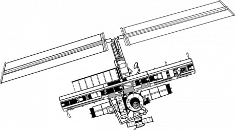
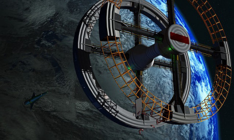

Miestnoťou zatriasol silný prešiel otras. Ďalšia loď neďaleko odtiaľ uviazla vo vesmírnom vraku. Éterom rozľahol kódovaný hlas. Kódovaný štandartným vojenským kódom planéty Zem.

„Vesmírna loď ESS Žouk hlási poškodenie a žiada o pomoc!“

Kódovaný signál sa opakuje v pravidelných intervaloch.

Nie je ťažké ju nájsť, nie je ťažké otvoriť hangár. Na hrdinov však nečaká žiadne privítanie. Len blikajúce núdzové svetlo na chodbách. Tohto desať poschodového bojového stroja s druhej línie s 26 ťažkými delami na spodných poschodiach a 26 ľahkými na horných.

Loď poznáva, že prístup do nej nie je autorizovaný, a už po niekoľkých desiatkach metrov sa mierne zatrasie a oznámi: „Váš vstup nie je autorizovaný. Loď zaháji obranné mechanizmi za 5-4-3-2-1.“ Ozve sa niečo ako výstrel naprázdno, svetlá sa bolestivo rozžiaria, ale inak sa nič nedeje.

Postavy môžu následovať ďalej. Posledná z nich však zaútočí na svojich kolegov. Jej schopnosti sú výrazne nižšie, ale i kedže útočí z prekvapenia, mala by zasiať aspoň trochu paniky medzi ostatných. Pri zabití sa vyparí ako zo vzduchu a chvíľu výjde spoza rohu skutočná postava hrdiny, ktorý si nebude pamätať posledných zopár minút. Posledné, čo si bude pamätať, bude zvuk výstrelu naprázdno a bolesť hlavy.

Loď je prázdna. Nikde ani stopa, ani prach, ani povaľujúci sa náboj. Nikde nie je elektrika. Funguje len núdzové osvetlenie.

Situácia sa opakuje zas po nejakej dobe.

„Váš vstup nie je autorizovaný. Loď zaháji obranné mechanizmi za 5-4-3-2-1.“ Ozve sa niečo ako výstrel naprázdno, svetlá sa bolestivo rozžiaria ale inak sa nič nedeje.

Tentoraz však dvaja z hrdinov zaútočia na svojich kolegov. Opäť s postihmi a opäť sa vrátia po chvíly originály.

Na lodi sú len dve miesta, kde sa dá niečo dozvedieť. Buď sa pokúsiť ju opustiť, ale tomu sa tentoraz bude loď brániť. Alebo sa dostať do riadiaceho centra a tam si preštudovať (hacknúť) lodný záznam.

Záznam hovorí o tom kedy bola loď postavená, na akej orbitálnej základni a kým. Tiež spomína časté nehody a prípady žialenstva, ktoré zaznamenali hlavne strojový inžinieri. Preto sa i omeškalo jej dokončenie a bojové nasadenie. Loď, alebo skôr lodný program, však nutnosť dokončenia a osadenia lode posádkou neuznal za dostatočný dôvod na zdržanie jej bojového nasadenia a napriek snahe opustil prístav.

Posledné desaťročia blúdi galaxiou a zbiera informácie od tých „bláznov“, ktorý do nej nastúpia. V záznamoch však nie je vysvetlené, KTO nahradí tých, z ktorých sú vysávané informácie. Sú to DUCHOVIA? To nik nevie a asi sa ani nedozvie.

__Odmena:__ Náboje, zásoby, vybavenie, zdroje a podobne, čo loď mala pri odchode zo strojnice.

__Cieľom__ nie je vyvraždiť družinu, ale vniesť do jej radov neistotu, ktorú je možno použiť o niekoľko questov neskôr. Zároveň sa môžu obohatiť o cenné vybavenie, ktoré by im malo námahu s loďou vynahradiť.

Toto je len taký vtip, ktorý ma dnes napadol a moc som sa nad ním nezamýšlal. Je to na krátky a intenzívny quest. Dve maximálne tri hodiny akcie so šťastným koncom, keď doráňaný hrdinovia s bolesťou hlavy uniknú z korábu s novými hračkami.

Loď za niekoľko hodín alebo dní zmizne.

### Raj a peklo zvierat

Autor: Skenderax

> Príbeh je postavený podľa námetu mojej obľúbenej beštie _Colour Out Of Space_ (použijem skratku CooS lebo som lenivý to prepisovať). Táto beštia bola použitá v rovnomennom diele H. P. Lovecrafta, ktoré určite stojí za prečítanie.
>
> Quest je v skutočnosti smrtelná pasca a jedinou šancou ako prežiť je utiecť veľmi veľmi ďaleko. Preto neviem, či niečo také chcete zakomponovať do vraku. Ja som hral podobný quest na Divokom západe ako jednorázovku a bol to poriadne depresívny masaker, na ktorý hráči s radosťou spomínajú.

### Scéna: Príchod

Loď je prastará a cudzia. Jej koridory sú priveľké, divne tvarované, popísané znakmi, ktoré bolia na pohľad svojou zložitosťou. Niečo je tu však iné ako inde. Vzduch. Nie je filtrovaný, umelo okysličovaný, nespočetne krát recyklovaný.

Je čerstvý.

Po zopár krokoch zisťujú hrdinovia prečo – nachádzajú vegetáciu. Krásne zelenú s veľkými farebnými plodmi. Niekde v dialke je počuť hukot hmyzu.

### Scéna: Hangár

Hrdinovia prídu do hangáru tunelom niekoľko desiatok metrov nad zemou a tak majú dobrý výhľad na gigantický priestor, ktorý sa pred nimi rozprestiera. Bývalý hala, hangár alebo skladište. Nech už to bolo čokolvek, hravo by sa tu zmestila celá vesmírna loď. Teraz je to ale len vrakovište pokryté zeleňou. Pozemské i mimozemské rastliny tu žijú v symbióze. V strede tejto ohromnej plochy je jazero s malým ostrovom. Na prvý pohľad vidno, že hrdinovia nie sú jediný, ktorý tento raj našli. Sú tu i iné živočíšne druhy, hlavne mimozemské. Na prvý pohľad sa zdá, že sa len tak bez záujmu túlajú po krajine.

Nie je vidno žiaden súboj, žiadne naháňanie, žiadne násilie. Počuť len bzukot hmyzu, ktorému sa tak dobre darí, že narástol do veľkosti palca dospelého človeka, a občasné zrevanie niektorého z tvorov v džungly. Hmyz i zvieratá sú jemne deformované. Hmyzu, ktorý žije najkratšie, sa darí najlepšie.

### Scéna: Spánok

Hrdinovia spia tvrdým spánkom. V ňom majú divoké sny, ktoré ako by boli vystrihnuté z iných svetov, iných životov. Vidia krásy iných svetov i okamihy, ktoré pôsobia stresujúco. A k tomu počujú hudbu. Nádhernú, nadpozemskú, rajskú hudbu. Hudbu, ktorá sa dá počúvať do konca života. Hudbu, kvôli ktorej sa človek nechce zobudiť.

Napriek tomu sa zobudia. Živý, zdravý a s spomienkou na hudbu. Spomienkou na okraji mysle. Cítia ju a predsa nevedia zopakovať, nevedia si ju spievať...

+ V noci útočí Colour Out Of Space – svojim mentálny útokom oberá obete o slobodnú vôľu, zabraňuje im odísť a smeruje ich ku letargii prípadne inej forme šialenstva.

### Scéna: Džungla

Hrdinom nič nebráni pohybovať sa medzi rastlinami, ochutnávať ich (nie su moc dobré), prípadne loviť. Žiadne zviera sa im nebude brániť, žiadne nebude moc dlho utekať. Žiadne nebude moc dobre chutiť. Všetko je pasívne, pripravené vzdať sa všetkého. I života.

Postupom nájdu i miesta, kde si humanoidi, resp. mimozemské rasy, spravili obydlia. Kde sa usadili, kde vyklčovali časť džungle, kde vytvorili mini dediny. Nájdu rodiny, ktoré vyvraždil najstarší člen a potom spáchal sebevraždu. Pekne naukladaných vedľa seba, bez znaku toho, že by sa bránili. Nájdu obesených. Nájdu mrtvoly, ktoré umreli od smädu, sediacich na provizórnych kreslách vyrobených zo šrotu, na ktorom sa umiestnila džungla...

Podobne na tom sú i zvieratá v lese. Tie však umierajú od smedu. Bez zjavnej známky dôvodu, prečo by sa nemali napiť.

### Scéna: Napovedy

- __Opilec:__ Hrdinovia započujú streľbu. Dobehnú sa pozrieť a uvidia muža. V jednej ruke zbraň, v druhej fľaša s liehom na čistenie kovu. Kričí opilštinou na džunglu, ktorá mu neodpovedá. Nie je mu moc rozumieť, ale z reči pochopia hrdinovia, že vyzíva džunglu, aby si ho prišla zobrať, že sa jej nebojí. A páli nazdarbohu jednu dávku za druhou do listov na okolý. V skutočnosti sa bojí. Bojí sa zobrať si život. A alkohol je jediný spôsob, ako si dodať odvahu, ako „vypnúť“ negatívne pôsobenie CooS. Jediný spôsob, ako prestať snívať. Nakonie opilec predsa len spácha sebevraždu, prípadne v najbližšom spánku umrie.
- __Farby:__ Po niekoľkých nociach (2–3 podľa toho, ako GM nastavý úbytok vôle) si hrdinovia uvedomia, že mierne svietia farbami dúhy. Čo to spôsobuje? Hmm... Zistia, že i rastliny a všetko živé v noci jemne svieti. To je fyzický prejav útokov CooS.
- __Radiácia:__ Na okolý je zdroj radiácie. Nie veľkej, ale predsa. Je to v jazere.
- __Mrtvoly:__ Najviac mrtvol je v okolý jazera, resp. čím bližšie ku jazeru, tým viac je mrtvol.

### Scéna: Jazierko

Postavy musia preplávať (prekonať) cez jazero na ostrov. Na ňom je široký servisný tunel. Hrdinovia cítia mierny zápach ozónu, vidia mierne svetlo na stenách.

Ak pôjdu ďalej, uvidia CooS. CooS nemá hmotné telo – je to len amorfné svetlo rôznych farieb - a je nezranitelný zbraňami. Je možné mu ublížiť len mágiou alebo jej ekvivalentom. Má tri druhý útokov:

- _Mentálny útok_ – oberá ním postavy o vôľu. Čím slabšia vôla, tým menej účinný je mentálny útok.
- _Vyciciavanie_ – oberá postavy o životnú energiu, na ktorej sa živý a rastie. Prefajuje sa to fyzickým starnutím podobným umrtiu na vyschnutie.
- _Chytenie_ – dokáže zhmotniť časť svetla tak, že vytvorí končatinu, ktorou dokáže „zobrať“, čo chce.

CooS je tvor, ktorý by mal byť nezabitelný. Ten, kto bude mať silu a schopnosť jej ublížiť, sa stane prvým terčom vycicania. Postavy by mali dôjsť do štádia, kedy si uvedomia, že proti tomuto sa nedá bojovať a pokúsiť sa utiecť. Ak na to budú mať ešte dosť vlastnej vôle. Prípadne si pomôcť navzájom.

### Čo sa deje

Servisné tunely su miestnom, kde CooS umiestňuje svoje larvy. Tie postupne svojim mentálny útokom oberú živočístvo o vôľu a potom vstrebá ich silu. Ak narastie do určitej veľkosti, hangár opustí a po nejakom čase sa vráti vložiť novú larvu. V čase, keď sú servisné priestory v jazierku prázdne, sa pomaly život vracia do pôvodných koľají. Zvieratá sa rozmnožujú, rastlinám sa vráti chuť, svet sa premení na raj.
